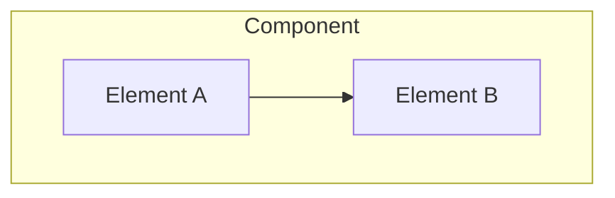

# Chapter N: Topic Name
{: .fs-9 }

Brief description of what this chapter covers.
{: .fs-6 .fw-300 }

---

## Overview

### What is [Topic]?

Explain the concept at a high level. What problem does it solve? Why is it important in UEFI?

### Architecture



### Key Concepts

| Concept | Description |
|:--------|:------------|
| Term 1 | Definition |
| Term 2 | Definition |

### When to Use

- Use case 1
- Use case 2

---

## Initialization

### Prerequisites

Before initialization:
- Requirement 1
- Requirement 2

### Step-by-Step Setup

#### Step 1: [First Step]

```c
// Code example
EFI_STATUS Status;
```

#### Step 2: [Second Step]

Explanation of the step.

### Common Initialization Patterns

Pattern 1: Description

```c
// Pattern example
```

---

## Configuration

### Settings and Options

| Setting | Type | Description | Default |
|:--------|:-----|:------------|:--------|
| Option1 | BOOLEAN | Description | FALSE |
| Option2 | UINT32 | Description | 0 |

### INF File Configuration

```ini
[Defines]
  MODULE_TYPE = UEFI_APPLICATION
  # ... other settings
```

### PCD Configuration

```ini
[PcdsFixedAtBuild]
  gEfiMdePkgTokenSpaceGuid.PcdDebugPropertyMask|0x1F
```

### Build-Time Options

Explanation of build configuration options.

---

## Porting Guide

### Platform Considerations

| Platform | Considerations |
|:---------|:---------------|
| x64 | Specific notes |
| ARM64 | Specific notes |
| RISC-V | Specific notes |

### Hardware Dependencies

List any hardware-specific requirements or abstractions needed.

### Common Porting Issues

#### Issue 1: [Description]

**Problem:** Explanation of the issue.

**Solution:** How to resolve it.

#### Issue 2: [Description]

**Problem:** Explanation of the issue.

**Solution:** How to resolve it.

### Cross-Platform Code

```c
#if defined(MDE_CPU_X64)
  // x64-specific code
#elif defined(MDE_CPU_AARCH64)
  // ARM64-specific code
#endif
```

---

## Example Code

### Complete Example

```c
/** @file
  Example implementation of [Topic]

  Copyright (c) 2024, Your Name. All rights reserved.
  SPDX-License-Identifier: BSD-2-Clause-Patent
**/

#include <Uefi.h>
#include <Library/UefiLib.h>

EFI_STATUS
EFIAPI
UefiMain (
  IN EFI_HANDLE        ImageHandle,
  IN EFI_SYSTEM_TABLE  *SystemTable
  )
{
  // Implementation
  return EFI_SUCCESS;
}
```

### Building the Example

```bash
# Build command
build -p UefiGuidePkg/UefiGuidePkg.dsc -m UefiGuidePkg/TopicExample/TopicExample.inf
```

### Running in QEMU

```bash
# Launch QEMU with the example
./run-qemu.sh
```

### Expected Output

```
Expected console output here
```

---

## UEFI Specification Reference

- **UEFI Spec Section X.Y**: [Topic Name](https://uefi.org/specs/UEFI/2.10/XX_Section.html)
- **PI Spec Section X.Y**: [Related Topic](https://uefi.org/specs/PI/1.8/XX_Section.html)

---

## Summary

Key takeaways from this chapter:

1. Point 1
2. Point 2
3. Point 3

---

## Next Steps

- [Next Chapter](next-chapter.html) - What comes next
- [Related Topic](related-topic.html) - Related content

---

{: .note }
> **See Also:**
> - [Related EDK2 Code](https://github.com/tianocore/edk2/tree/master/MdePkg)
> - [Additional Resource](https://example.com)
