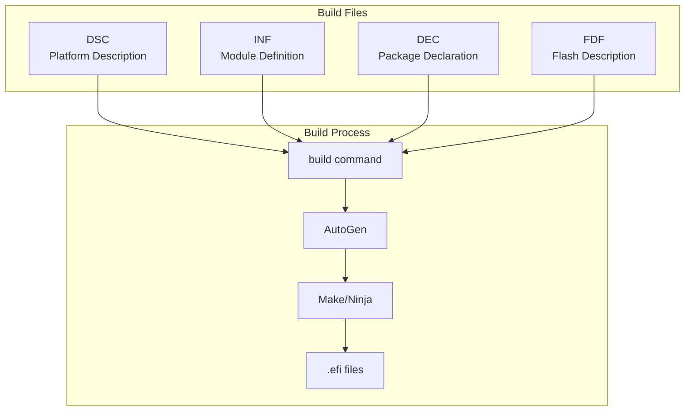

# Appendix A: EDK2 Build System

Comprehensive reference for EDK2 build files, syntax, and commands.

## Build File Types



## INF File Reference

Module Information File - defines a single module.

### Complete INF Template

```ini
## @file
#  Brief description of the module
#
#  Detailed description of the module functionality.
#
#  Copyright (c) 2024, Your Company. All rights reserved.
#  SPDX-License-Identifier: BSD-2-Clause-Patent
#
##

[Defines]
  INF_VERSION                    = 0x00010019
  BASE_NAME                      = ModuleName
  MODULE_UNI_FILE                = ModuleName.uni
  FILE_GUID                      = 12345678-1234-1234-1234-123456789ABC
  MODULE_TYPE                    = UEFI_APPLICATION
  VERSION_STRING                 = 1.0
  ENTRY_POINT                    = UefiMain
  UNLOAD_IMAGE                   = ModuleUnload

#
# VALID_ARCHITECTURES = IA32 X64 AARCH64 ARM
#

[Sources]
  ModuleName.c
  ModuleName.h
  Helper.c

[Sources.IA32]
  Ia32/CpuSpecific.c

[Sources.X64]
  X64/CpuSpecific.c

[Sources.AARCH64]
  AArch64/CpuSpecific.c

[Packages]
  MdePkg/MdePkg.dec
  MdeModulePkg/MdeModulePkg.dec

[LibraryClasses]
  UefiApplicationEntryPoint
  UefiLib
  BaseMemoryLib
  MemoryAllocationLib
  PrintLib
  DebugLib

[Protocols]
  gEfiSimpleTextInputExProtocolGuid         ## CONSUMES
  gEfiGraphicsOutputProtocolGuid            ## SOMETIMES_CONSUMES

[Guids]
  gEfiGlobalVariableGuid                    ## CONSUMES

[Ppis]
  # PEI-to-PEI interfaces (PEIM modules only)

[FeaturePcd]
  gMyPkgTokenSpaceGuid.PcdFeatureEnabled    ## CONSUMES

[FixedPcd]
  gMyPkgTokenSpaceGuid.PcdBufferSize        ## CONSUMES

[Pcd]
  gMyPkgTokenSpaceGuid.PcdConfigValue       ## CONSUMES

[Depex]
  TRUE

[BuildOptions]
  GCC:*_*_*_CC_FLAGS = -Wno-unused-variable
  MSFT:*_*_*_CC_FLAGS = /wd4100
```

### INF Section Reference

| Section | Purpose |
|---------|---------|
| `[Defines]` | Module metadata and entry points |
| `[Sources]` | Source files to compile |
| `[Packages]` | Package dependencies (DEC files) |
| `[LibraryClasses]` | Libraries to link |
| `[Protocols]` | Protocol GUIDs used |
| `[Guids]` | GUIDs consumed/produced |
| `[Ppis]` | PPIs for PEI modules |
| `[Pcd]` | Platform Configuration Database entries |
| `[Depex]` | Dependency expression |
| `[BuildOptions]` | Compiler/linker flags |

### MODULE_TYPE Values

| Type | Entry Point Library | Description |
|------|---------------------|-------------|
| `SEC` | None | Security phase |
| `PEI_CORE` | PeiCoreEntryPoint | PEI Foundation |
| `PEIM` | PeimEntryPoint | PEI module |
| `DXE_CORE` | DxeCoreEntryPoint | DXE Foundation |
| `DXE_DRIVER` | UefiDriverEntryPoint | DXE driver |
| `DXE_RUNTIME_DRIVER` | UefiDriverEntryPoint | Runtime driver |
| `DXE_SMM_DRIVER` | UefiDriverEntryPoint | SMM driver |
| `UEFI_DRIVER` | UefiDriverEntryPoint | UEFI driver model |
| `UEFI_APPLICATION` | UefiApplicationEntryPoint | UEFI app |

## DEC File Reference

Package Declaration File - defines a package's public interface.

### Complete DEC Template

```ini
## @file
#  Package declaration for MyPkg
#
#  Copyright (c) 2024, Your Company. All rights reserved.
#  SPDX-License-Identifier: BSD-2-Clause-Patent
#
##

[Defines]
  DEC_SPECIFICATION              = 0x00010019
  PACKAGE_NAME                   = MyPkg
  PACKAGE_GUID                   = 87654321-4321-4321-4321-CBA987654321
  PACKAGE_VERSION                = 1.0

[Includes]
  Include

[Includes.IA32]
  Include/Ia32

[Includes.X64]
  Include/X64

[LibraryClasses]
  ##  @libraryclass  Description of library
  MyLib|Include/Library/MyLib.h

[Guids]
  ## GUID for custom purpose
  gMyPkgTokenSpaceGuid = { 0x12345678, 0x1234, 0x1234, { 0x12, 0x34, 0x56, 0x78, 0x9a, 0xbc, 0xde, 0xf0 }}

  ## File GUID
  gMyFileGuid = { 0xabcdef12, 0x3456, 0x7890, { 0xab, 0xcd, 0xef, 0x12, 0x34, 0x56, 0x78, 0x90 }}

[Protocols]
  ## My custom protocol
  gMyProtocolGuid = { 0x11111111, 0x2222, 0x3333, { 0x44, 0x55, 0x66, 0x77, 0x88, 0x99, 0xaa, 0xbb }}

[Ppis]
  ## My PPI for PEI phase
  gMyPpiGuid = { 0xaaaaaaaa, 0xbbbb, 0xcccc, { 0xdd, 0xee, 0xff, 0x00, 0x11, 0x22, 0x33, 0x44 }}

[PcdsFeatureFlag]
  ## Enable feature X
  gMyPkgTokenSpaceGuid.PcdFeatureX|FALSE|BOOLEAN|0x00000001

[PcdsFixedAtBuild]
  ## Buffer size in bytes
  gMyPkgTokenSpaceGuid.PcdBufferSize|4096|UINT32|0x00000010

  ## Base address
  gMyPkgTokenSpaceGuid.PcdBaseAddress|0x80000000|UINT64|0x00000011

  ## String constant
  gMyPkgTokenSpaceGuid.PcdStringConst|"Default"|VOID*|0x00000012

[PcdsPatchableInModule]
  ## Value can be patched in binary
  gMyPkgTokenSpaceGuid.PcdPatchable|0|UINT32|0x00000020

[PcdsDynamic, PcdsDynamicEx]
  ## Dynamic PCD (stored in PCD database)
  gMyPkgTokenSpaceGuid.PcdDynamicValue|0|UINT32|0x00000030
```

### PCD Types

| Type | Storage | Modifiable |
|------|---------|------------|
| `FeatureFlag` | Compile-time constant | No |
| `FixedAtBuild` | Compile-time constant | No |
| `PatchableInModule` | In binary, patchable | Binary edit |
| `Dynamic` | PCD database | Runtime (PEI/DXE) |
| `DynamicEx` | PCD database | Runtime + external |

## DSC File Reference

Platform Description File - defines how to build a platform.

### Complete DSC Template

```ini
## @file
#  Platform description file for MyPlatform
#
#  Copyright (c) 2024, Your Company. All rights reserved.
#  SPDX-License-Identifier: BSD-2-Clause-Patent
#
##

[Defines]
  PLATFORM_NAME                  = MyPlatform
  PLATFORM_GUID                  = 11111111-2222-3333-4444-555555555555
  PLATFORM_VERSION               = 1.0
  DSC_SPECIFICATION              = 0x00010019
  OUTPUT_DIRECTORY               = Build/MyPlatform
  SUPPORTED_ARCHITECTURES        = IA32|X64|AARCH64
  BUILD_TARGETS                  = DEBUG|RELEASE|NOOPT
  SKUID_IDENTIFIER               = DEFAULT
  FLASH_DEFINITION               = MyPkg/MyPlatform.fdf

  # Build options
  DEFINE DEBUG_ENABLE            = TRUE

#
# Include common definitions
#
!include MdePkg/MdeLibs.dsc.inc

[SkuIds]
  0|DEFAULT

[LibraryClasses]
  # Base libraries
  BaseLib|MdePkg/Library/BaseLib/BaseLib.inf
  BaseMemoryLib|MdePkg/Library/BaseMemoryLib/BaseMemoryLib.inf
  PrintLib|MdePkg/Library/BasePrintLib/BasePrintLib.inf
  DebugLib|MdePkg/Library/BaseDebugLibSerialPort/BaseDebugLibSerialPort.inf

  # Entry points
  UefiApplicationEntryPoint|MdePkg/Library/UefiApplicationEntryPoint/UefiApplicationEntryPoint.inf
  UefiDriverEntryPoint|MdePkg/Library/UefiDriverEntryPoint/UefiDriverEntryPoint.inf

  # UEFI services
  UefiLib|MdePkg/Library/UefiLib/UefiLib.inf
  UefiBootServicesTableLib|MdePkg/Library/UefiBootServicesTableLib/UefiBootServicesTableLib.inf
  UefiRuntimeServicesTableLib|MdePkg/Library/UefiRuntimeServicesTableLib/UefiRuntimeServicesTableLib.inf
  DevicePathLib|MdePkg/Library/UefiDevicePathLib/UefiDevicePathLib.inf

  # Memory
  MemoryAllocationLib|MdePkg/Library/UefiMemoryAllocationLib/UefiMemoryAllocationLib.inf

[LibraryClasses.common.PEIM]
  PeimEntryPoint|MdePkg/Library/PeimEntryPoint/PeimEntryPoint.inf
  PeiServicesLib|MdePkg/Library/PeiServicesLib/PeiServicesLib.inf
  MemoryAllocationLib|MdePkg/Library/PeiMemoryAllocationLib/PeiMemoryAllocationLib.inf

[LibraryClasses.common.DXE_DRIVER]
  MemoryAllocationLib|MdePkg/Library/UefiMemoryAllocationLib/UefiMemoryAllocationLib.inf

[LibraryClasses.common.DXE_RUNTIME_DRIVER]
  MemoryAllocationLib|MdePkg/Library/UefiMemoryAllocationLib/UefiMemoryAllocationLib.inf

[LibraryClasses.common.UEFI_APPLICATION]
  MemoryAllocationLib|MdePkg/Library/UefiMemoryAllocationLib/UefiMemoryAllocationLib.inf
  ShellLib|ShellPkg/Library/UefiShellLib/UefiShellLib.inf
  ShellCEntryLib|ShellPkg/Library/UefiShellCEntryLib/UefiShellCEntryLib.inf

[PcdsFeatureFlag]
  gEfiMdePkgTokenSpaceGuid.PcdComponentNameDisable|FALSE
  gEfiMdePkgTokenSpaceGuid.PcdDriverDiagnosticsDisable|FALSE

[PcdsFixedAtBuild]
  # Debug output configuration
  gEfiMdePkgTokenSpaceGuid.PcdDebugPropertyMask|0x2F
  gEfiMdePkgTokenSpaceGuid.PcdDebugPrintErrorLevel|0x80400040

  # Serial port
  gEfiMdeModulePkgTokenSpaceGuid.PcdSerialRegisterBase|0x3F8

[PcdsFixedAtBuild.X64]
  # X64-specific PCDs
  gEfiMdeModulePkgTokenSpaceGuid.PcdMaxVariableSize|0x10000

[PcdsDynamicDefault]
  gEfiMdePkgTokenSpaceGuid.PcdPlatformBootTimeOut|5

[Components]
  # Core modules
  MdeModulePkg/Core/Dxe/DxeMain.inf

  # Drivers
  MdeModulePkg/Universal/Console/ConPlatformDxe/ConPlatformDxe.inf
  MdeModulePkg/Universal/Console/ConSplitterDxe/ConSplitterDxe.inf

  # Applications
  MyPkg/Application/MyApp/MyApp.inf {
    <LibraryClasses>
      # Override library for this module only
      DebugLib|MdePkg/Library/BaseDebugLibNull/BaseDebugLibNull.inf
    <PcdsFixedAtBuild>
      # Override PCD for this module only
      gEfiMdePkgTokenSpaceGuid.PcdDebugPropertyMask|0x00
  }

[Components.IA32]
  # IA32-specific components

[Components.X64]
  # X64-specific components

[BuildOptions]
  # Global build options
  GCC:*_*_*_CC_FLAGS = -Wno-error
  MSFT:*_*_*_CC_FLAGS = /W4

  # Architecture-specific
  GCC:*_*_X64_CC_FLAGS = -mcmodel=small
```

## FDF File Reference

Flash Description File - defines flash layout and FV contents.

### FDF Structure

```ini
## @file
#  Flash Description File for MyPlatform
#
##

[Defines]
  DEFINE FLASH_BASE             = 0xFF800000
  DEFINE FLASH_SIZE             = 0x00800000
  DEFINE BLOCK_SIZE             = 0x1000
  DEFINE NUM_BLOCKS             = 0x800

[FD.MyPlatform]
  BaseAddress   = $(FLASH_BASE)
  Size          = $(FLASH_SIZE)
  ErasePolarity = 1
  BlockSize     = $(BLOCK_SIZE)
  NumBlocks     = $(NUM_BLOCKS)

  # Layout regions
  0x00000000|0x00040000
  gMyPkgTokenSpaceGuid.PcdFlashFvRecoveryBase|gMyPkgTokenSpaceGuid.PcdFlashFvRecoverySize
  FV = FVRECOVERY

  0x00040000|0x00200000
  gMyPkgTokenSpaceGuid.PcdFlashFvMainBase|gMyPkgTokenSpaceGuid.PcdFlashFvMainSize
  FV = FVMAIN

  0x00240000|0x00040000
  gMyPkgTokenSpaceGuid.PcdFlashNvStorageVariableBase|gMyPkgTokenSpaceGuid.PcdFlashNvStorageVariableSize
  DATA = {
    # NV Storage header
    0xFF, 0xFF, 0xFF, 0xFF, 0xFF, 0xFF, 0xFF, 0xFF
  }

[FV.FVRECOVERY]
  FvAlignment        = 16
  ERASE_POLARITY     = 1
  MEMORY_MAPPED      = TRUE
  STICKY_WRITE       = TRUE
  LOCK_CAP           = TRUE
  LOCK_STATUS        = TRUE
  WRITE_DISABLED_CAP = TRUE
  WRITE_ENABLED_CAP  = TRUE
  WRITE_STATUS       = TRUE
  WRITE_LOCK_CAP     = TRUE
  WRITE_LOCK_STATUS  = TRUE
  READ_DISABLED_CAP  = TRUE
  READ_ENABLED_CAP   = TRUE
  READ_STATUS        = TRUE
  READ_LOCK_CAP      = TRUE
  READ_LOCK_STATUS   = TRUE

  # SEC Core
  INF  MyPkg/Sec/SecMain.inf

  # PEI Core
  INF  MdeModulePkg/Core/Pei/PeiMain.inf

  # PEIMs
  INF  MdeModulePkg/Universal/PCD/Pei/Pcd.inf

[FV.FVMAIN]
  FvAlignment        = 16
  ERASE_POLARITY     = 1
  MEMORY_MAPPED      = TRUE
  STICKY_WRITE       = TRUE
  LOCK_CAP           = TRUE
  LOCK_STATUS        = TRUE

  # DXE Core
  INF  MdeModulePkg/Core/Dxe/DxeMain.inf

  # DXE Drivers
  INF  MdeModulePkg/Universal/PCD/Dxe/Pcd.inf
  INF  MdeModulePkg/Universal/Console/ConPlatformDxe/ConPlatformDxe.inf
  INF  MdeModulePkg/Universal/Console/GraphicsConsoleDxe/GraphicsConsoleDxe.inf

  # Applications
  INF  ShellPkg/Application/Shell/Shell.inf

  # Files
  FILE FREEFORM = 11111111-2222-3333-4444-555555555555 {
    SECTION RAW = MyPkg/Data/config.bin
  }

[Rule.Common.SEC]
  FILE SEC = $(NAMED_GUID) {
    PE32  PE32  $(INF_OUTPUT)/$(MODULE_NAME).efi
  }

[Rule.Common.PEI_CORE]
  FILE PEI_CORE = $(NAMED_GUID) {
    PE32  PE32  $(INF_OUTPUT)/$(MODULE_NAME).efi
    UI    STRING = "$(MODULE_NAME)"
  }

[Rule.Common.PEIM]
  FILE PEIM = $(NAMED_GUID) {
    PEI_DEPEX PEI_DEPEX Optional $(INF_OUTPUT)/$(MODULE_NAME).depex
    PE32      PE32     $(INF_OUTPUT)/$(MODULE_NAME).efi
    UI        STRING = "$(MODULE_NAME)"
  }

[Rule.Common.DXE_CORE]
  FILE DXE_CORE = $(NAMED_GUID) {
    PE32  PE32  $(INF_OUTPUT)/$(MODULE_NAME).efi
    UI    STRING = "$(MODULE_NAME)"
  }

[Rule.Common.DXE_DRIVER]
  FILE DRIVER = $(NAMED_GUID) {
    DXE_DEPEX DXE_DEPEX Optional $(INF_OUTPUT)/$(MODULE_NAME).depex
    PE32      PE32     $(INF_OUTPUT)/$(MODULE_NAME).efi
    UI        STRING = "$(MODULE_NAME)"
  }

[Rule.Common.UEFI_APPLICATION]
  FILE APPLICATION = $(NAMED_GUID) {
    PE32  PE32  $(INF_OUTPUT)/$(MODULE_NAME).efi
    UI    STRING = "$(MODULE_NAME)"
  }
```

## Build Command Reference

### Basic Commands

```bash
# Initialize environment
source edksetup.sh              # Linux/macOS
edksetup.bat                    # Windows
edksetup.bat Rebuild            # Rebuild BaseTools

# Build platform
build                           # Use target.txt defaults
build -a X64 -t GCC5 -p MyPkg/MyPlatform.dsc -b DEBUG

# Build single module
build -a X64 -t GCC5 -p MyPkg/MyPlatform.dsc -m MyPkg/App/App.inf

# Clean build
build clean
build cleanall                  # Also clean BaseTools
```

### Build Options

| Option | Description | Example |
|--------|-------------|---------|
| `-a` | Architecture | `-a X64`, `-a AARCH64` |
| `-t` | Toolchain | `-t GCC5`, `-t VS2019` |
| `-p` | Platform DSC | `-p OvmfPkg/OvmfPkgX64.dsc` |
| `-m` | Module INF | `-m MdeModulePkg/App.inf` |
| `-b` | Build target | `-b DEBUG`, `-b RELEASE` |
| `-n` | Thread count | `-n 8` |
| `-y` | Report file | `-y report.txt` |
| `-Y` | Report type | `-Y PCD`, `-Y LIBRARY` |
| `-D` | Define macro | `-D DEBUG_ENABLE=TRUE` |
| `-j` | Log file | `-j build.log` |
| `-s` | Silent | No progress output |
| `-q` | Quiet | Minimal output |
| `-v` | Verbose | Detailed output |

### Environment Variables

```bash
# Required
export WORKSPACE=/path/to/edk2
export EDK_TOOLS_PATH=$WORKSPACE/BaseTools
export PACKAGES_PATH=$WORKSPACE:$WORKSPACE/edk2-platforms

# Toolchain
export GCC5_AARCH64_PREFIX=aarch64-linux-gnu-
export GCC5_ARM_PREFIX=arm-linux-gnueabihf-

# Optional
export CONF_PATH=$WORKSPACE/Conf
export BUILD_OUTPUT=$WORKSPACE/Build
```

### target.txt Configuration

```ini
# Conf/target.txt
ACTIVE_PLATFORM       = OvmfPkg/OvmfPkgX64.dsc
TARGET                = DEBUG
TARGET_ARCH           = X64
TOOL_CHAIN_CONF       = Conf/tools_def.txt
TOOL_CHAIN_TAG        = GCC5
BUILD_RULE_CONF       = Conf/build_rule.txt
MAX_CONCURRENT_THREAD_NUMBER = 8
```

## Build Troubleshooting

| Error | Cause | Solution |
|-------|-------|----------|
| "No platform description" | DSC not specified | Use `-p` or set in target.txt |
| "Module not found" | Wrong path in DSC | Check PACKAGES_PATH |
| "Undefined symbol" | Missing library | Add to LibraryClasses |
| "GUID redefined" | Duplicate GUID | Use unique GUID |
| "PCD not found" | Missing DEC | Add package to [Packages] |
| "Toolchain not found" | Wrong TOOL_CHAIN_TAG | Check tools_def.txt |

## References

- [EDK2 Build Specification](https://github.com/tianocore/tianocore.github.io/wiki/EDK-II-Specifications)
- [INF Specification](https://edk2-docs.gitbook.io/edk-ii-inf-specification/)
- [DSC Specification](https://edk2-docs.gitbook.io/edk-ii-dsc-specification/)
- [FDF Specification](https://edk2-docs.gitbook.io/edk-ii-fdf-specification/)
- [DEC Specification](https://edk2-docs.gitbook.io/edk-ii-dec-specification/)
