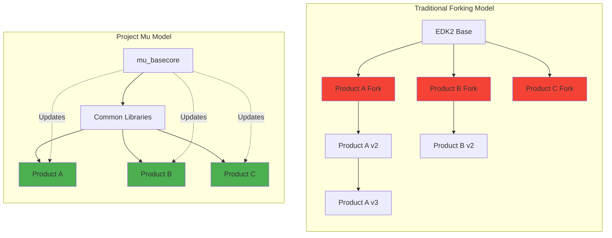
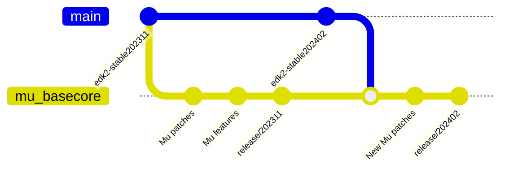
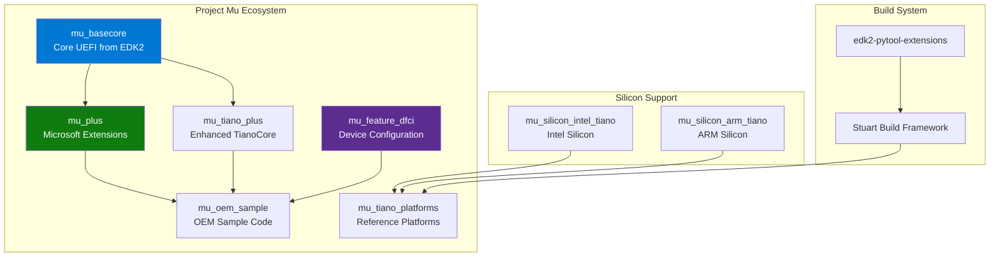
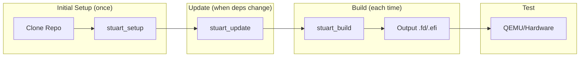
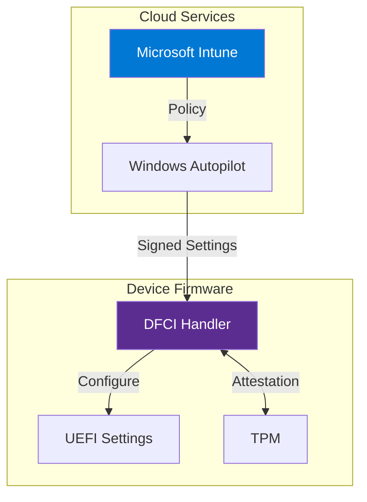

# Appendix B: Project Mu Complete Guide
{: .fs-9 }

Microsoft's modular UEFI firmware framework for scalable, maintainable, and secure firmware development.
{: .fs-6 .fw-300 }

---

## Table of Contents
{: .no_toc }

1. TOC
{:toc}

---

## Overview

### What is Project Mu?

**Project Mu** is Microsoft's open-source UEFI firmware implementation, released in December 2018. It is a modular adaptation of TianoCore's EDK2 designed for building modern devices using scalable, maintainable, and reusable patterns.

{: .important }
> **This is production code** - the same firmware that powers Microsoft Surface devices and Hyper-V. It's kept current because it must be to continue shipping products.

### Why Project Mu Exists

The firmware industry traditionally used a **"forking" model** - copy/paste/rename with each new product. This created unsustainable maintenance burdens where updates became nearly impossible due to cost and risk.



### Core Philosophy

Project Mu embraces:

| Principle | Description |
|:----------|:------------|
| **Firmware as a Service (FaaS)** | Fast, efficient firmware updates post-release |
| **Collaborative Development** | Shipping firmware is an ongoing collaboration between partners |
| **Modern Tooling** | GitHub issues, PRs, gated builds, CI/CD automation |
| **Multi-Repository Design** | Separate code by ownership while maintaining integration |
| **Less is More** | Include only necessary components, avoid unused code |

---

## Project Mu vs EDK2

### Key Differences

| Aspect | EDK2 (TianoCore) | Project Mu |
|:-------|:-----------------|:-----------|
| **Source** | Intel reference implementation | Microsoft fork of EDK2 |
| **Architecture** | Monolithic repository | Multi-repository, modular design |
| **Build System** | `build` command | Stuart (Python-based) |
| **Update Model** | Manual integration | Firmware as a Service (FaaS) |
| **Testing** | Basic | Strong emphasis on automated unit testing |
| **Rust Support** | Limited | First-class Rust integration |
| **CI/CD** | Manual setup | Built-in pipelines |
| **Dependencies** | Git submodules | pip packages + submodules |
| **Versioning** | Quarterly stable tags | Semantic versioning aligned with EDK2 |

### Relationship to EDK2

Project Mu follows EDK2's quarterly "stable tag" releases. A Mu release branch like `release/202405` is based on `edk2-stable202405`.



**Current Status (202502):**
- `mu_basecore` contains **266 commits** on top of edk2-stable202502
- `mu_tiano_plus` contains **58 commits** on top of edk2-stable202502

Relevant changes are contributed back to EDK2, though some Mu-specific changes remain in Mu only.

---

## Repository Structure

### Core Repositories

Project Mu uses a **multi-repository architecture** for technical separation and selective consumption:



### Repository Details

| Repository | Purpose | Content |
|:-----------|:--------|:--------|
| **mu_basecore** | Core UEFI guts forked from TianoCore | MdePkg, MdeModulePkg, BaseTools, SecurityPkg, CryptoPkg |
| **mu_plus** | Microsoft-contributed optional libraries | MsCorePkg, MsGraphicsPkg, DfciPkg, UefiTestingPkg |
| **mu_tiano_plus** | Enhanced TianoCore libraries | Optional modules from TianoCore with enhancements |
| **mu_feature_dfci** | Device Firmware Configuration Interface | Cloud-based firmware management |
| **mu_oem_sample** | Sample OEM implementation | Front page, boot manager examples |
| **mu_tiano_platforms** | Virtual platform firmware | QEMU Q35, ARM SBSA platforms |
| **mu_silicon_intel_tiano** | Intel silicon support | Intel-specific packages |
| **mu_silicon_arm_tiano** | ARM silicon support | ARM-specific packages |

### mu_basecore Structure

```
mu_basecore/
├── MdePkg/                 # Industry-standard definitions
│   ├── Include/
│   │   ├── Protocol/       # UEFI protocols
│   │   ├── Library/        # Library headers
│   │   ├── Guid/           # GUID definitions
│   │   └── Uefi/           # UEFI spec types
│   └── Library/            # Base libraries
├── MdeModulePkg/           # Core UEFI modules
│   ├── Core/               # DXE/PEI core
│   ├── Bus/                # Bus drivers
│   └── Universal/          # Universal drivers
├── UefiCpuPkg/             # CPU initialization
├── SecurityPkg/            # Security features
├── CryptoPkg/              # Cryptography
├── NetworkPkg/             # Network stack
├── FatPkg/                 # FAT filesystem
├── BaseTools/              # Build infrastructure
│   ├── Source/C/           # C tools
│   └── Source/Python/      # Python tools
└── .pytool/                # Stuart configuration
```

### mu_plus Structure (Microsoft Extensions)

```
mu_plus/
├── MsCorePkg/              # Microsoft core services
│   ├── Library/
│   │   ├── MathLib/        # Math operations
│   │   └── JsonLiteParserLib/
│   └── Universal/
├── MsGraphicsPkg/          # Graphics and UI
│   ├── Library/
│   │   ├── BootGraphicsLib/
│   │   └── SwmDialogsLib/
│   └── MsEarlyGraphics/
├── MsWheaPkg/              # WHEA (hardware errors)
├── DfciPkg/                # Device Firmware CI
├── UefiTestingPkg/         # Unit testing framework
├── XmlSupportPkg/          # XML parsing
├── PolicyServicePkg/       # Policy management
└── SetupDataPkg/           # Setup configuration
```

### Typical Platform Layout

```
my_platform/
├── .azurepipelines/              # Azure DevOps CI/CD
│   └── Platform-Build.yml
├── .github/
│   └── workflows/
│       └── build.yml             # GitHub Actions CI
├── .pytool/
│   ├── CISettings.py             # CI configuration
│   └── Plugin/                   # Custom plugins
├── Platforms/
│   └── MyPlatformPkg/
│       ├── MyPlatform.dsc        # Platform DSC
│       ├── MyPlatform.fdf        # Flash description
│       ├── PlatformBuild.py      # Stuart build config
│       ├── Library/              # Platform libraries
│       ├── Drivers/              # Platform drivers
│       └── Include/
├── Common/
│   ├── MU/                       # mu_plus submodule
│   └── TIANO/                    # mu_tiano_plus submodule
├── MU_BASECORE/                  # mu_basecore submodule
├── Silicon/
│   └── Vendor/
│       └── REF_CODE/             # Silicon vendor code
├── pip-requirements.txt          # Python dependencies
├── .gitmodules
└── readme.md
```

---

## Installation and Setup

### Prerequisites

#### All Platforms

| Component | Minimum Version | Purpose |
|:----------|:----------------|:--------|
| Python | 3.8+ | Build system, Stuart |
| Git | 2.25+ | Version control, submodules |
| pip | 21.0+ | Python package manager |

#### Linux (Ubuntu/Debian)

```bash
# Update system
sudo apt update && sudo apt upgrade -y

# Install build essentials
sudo apt install -y \
    build-essential \
    git \
    python3 \
    python3-pip \
    python3-venv \
    uuid-dev \
    nasm \
    iasl \
    gcc-12 \
    g++-12 \
    make \
    qemu-system-x86

# Verify installations
gcc --version
python3 --version
git --version
```

#### Windows

```powershell
# Install via winget
winget install Python.Python.3.11
winget install Git.Git

# Visual Studio 2019/2022 with:
# - Desktop development with C++
# - Windows 10/11 SDK

# NASM from https://www.nasm.us/
# Add to PATH: C:\Program Files\NASM
```

#### macOS

```bash
# Install Xcode Command Line Tools
xcode-select --install

# Install Homebrew
/bin/bash -c "$(curl -fsSL https://raw.githubusercontent.com/Homebrew/install/HEAD/install.sh)"

# Install dependencies
brew install python@3.11 nasm acpica qemu
```

### Installing Stuart Build System

Stuart is Project Mu's Python-based build orchestration system.

```bash
# Create and activate virtual environment (recommended)
python3 -m venv mu_venv
source mu_venv/bin/activate    # Linux/macOS
# mu_venv\Scripts\activate.bat  # Windows

# Install Stuart and related tools
pip install --upgrade pip
pip install edk2-pytool-library edk2-pytool-extensions

# Verify installation
stuart_setup --help
stuart_update --help
stuart_build --help
```

### Setting Up Your First Mu Platform

#### Option 1: Clone mu_tiano_platforms (Recommended for Learning)

```bash
# Clone the official virtual platform repository
git clone https://github.com/microsoft/mu_tiano_platforms.git
cd mu_tiano_platforms

# Checkout a stable release
git checkout release/202402

# Setup dependencies (downloads submodules)
stuart_setup -c Platforms/QemuQ35Pkg/PlatformBuild.py

# Update (syncs all dependencies)
stuart_update -c Platforms/QemuQ35Pkg/PlatformBuild.py

# Build
stuart_build -c Platforms/QemuQ35Pkg/PlatformBuild.py TOOL_CHAIN_TAG=GCC5
```

#### Option 2: Clone mu_oem_sample (For Creating Your Own Platform)

```bash
# Clone OEM sample
git clone https://github.com/microsoft/mu_oem_sample.git my-platform
cd my-platform

# Setup and update
stuart_setup -c Platforms/SamplePkg/PlatformBuild.py
stuart_update -c Platforms/SamplePkg/PlatformBuild.py

# Build
stuart_build -c Platforms/SamplePkg/PlatformBuild.py
```

#### Option 3: Create a New Platform from Scratch

```bash
# Create workspace
mkdir my_mu_platform && cd my_mu_platform

# Initialize git
git init

# Add Mu repositories as submodules
git submodule add https://github.com/Microsoft/mu_basecore.git MU_BASECORE
git submodule add https://github.com/Microsoft/mu_plus.git Common/MU
git submodule add https://github.com/Microsoft/mu_tiano_plus.git Common/TIANO

# Create platform directory structure
mkdir -p Platforms/MyPlatformPkg/{Library,Drivers,Include}

# Create pip-requirements.txt
cat > pip-requirements.txt << 'EOF'
edk2-pytool-library>=0.20.0
edk2-pytool-extensions>=0.27.0
edk2-basetools>=0.1.0
EOF

# Install dependencies
pip install -r pip-requirements.txt
```

---

## Stuart Build System

### Overview

Stuart is Project Mu's Python-based build framework that provides:
- Dependency management
- Build orchestration
- CI/CD integration
- Plugin architecture
- Environment configuration

### Stuart Commands

| Command | Purpose | Usage |
|:--------|:--------|:------|
| `stuart_setup` | Initial setup, download dependencies | Run once after clone |
| `stuart_update` | Update dependencies, sync submodules | Run when dependencies change |
| `stuart_build` | Build the platform | Main build command |
| `stuart_ci_setup` | CI-specific setup | Used in CI pipelines |
| `stuart_ci_build` | CI build with tests | Includes unit tests and validation |

### Build Workflow



### Basic Build Commands

```bash
# Setup - download external dependencies
stuart_setup -c Platforms/QemuQ35Pkg/PlatformBuild.py

# Update - sync submodules, apply patches
stuart_update -c Platforms/QemuQ35Pkg/PlatformBuild.py

# Build - compile the platform
stuart_build -c Platforms/QemuQ35Pkg/PlatformBuild.py

# Build with specific options
stuart_build -c Platforms/QemuQ35Pkg/PlatformBuild.py \
    TOOL_CHAIN_TAG=GCC5 \
    TARGET=DEBUG

# Build specific architecture
stuart_build -c Platforms/QemuQ35Pkg/PlatformBuild.py \
    -a X64

# Build multiple architectures
stuart_build -c Platforms/QemuQ35Pkg/PlatformBuild.py \
    -a IA32,X64

# Clean build
stuart_build -c Platforms/QemuQ35Pkg/PlatformBuild.py --clean
```

### PlatformBuild.py Configuration

Every Mu platform requires a `PlatformBuild.py` file that defines build configuration:

```python
# PlatformBuild.py - Complete Example

import os
from pathlib import Path
from edk2toolext.invocables.edk2_platform_build import BuildSettingsManager
from edk2toolext.invocables.edk2_setup import SetupSettingsManager
from edk2toolext.invocables.edk2_update import UpdateSettingsManager
from edk2toolext.invocables.edk2_pr_eval import PrEvalSettingsManager
from edk2toollib.utility_functions import GetHostInfo

class PlatformBuilder(
    BuildSettingsManager,
    SetupSettingsManager,
    UpdateSettingsManager,
    PrEvalSettingsManager
):
    """Platform build configuration for My Platform."""

    def __init__(self):
        self.WorkspaceRoot = Path(__file__).parent.parent.parent.resolve()
        self.PackagesPath = None

    # =================== Repository Settings ===================

    def GetWorkspaceRoot(self):
        """Return workspace root directory."""
        return str(self.WorkspaceRoot)

    def GetPackagesPath(self):
        """Return list of package paths for dependency resolution."""
        if self.PackagesPath is None:
            self.PackagesPath = [
                str(self.WorkspaceRoot / "MU_BASECORE"),
                str(self.WorkspaceRoot / "Common" / "MU_TIANO"),
                str(self.WorkspaceRoot / "Common" / "MU"),
                str(self.WorkspaceRoot / "Platforms"),
            ]
        return self.PackagesPath

    def GetRequiredSubmodules(self):
        """Define git submodules required for build."""
        return [
            "MU_BASECORE",
            "Common/MU_TIANO",
            "Common/MU",
        ]

    # =================== Build Settings ===================

    def GetName(self):
        """Platform name."""
        return "MyPlatformPkg"

    def GetArchitecturesSupported(self):
        """Supported CPU architectures."""
        return ["IA32", "X64"]

    def GetTargetsSupported(self):
        """Supported build targets."""
        return ["DEBUG", "RELEASE", "NOOPT"]

    def GetPackagesSupported(self):
        """Packages this platform builds."""
        return ["MyPlatformPkg"]

    def GetActiveScopes(self):
        """Return list of build scopes."""
        scopes = ["myplatform", "edk2-build"]

        # Add toolchain-specific scope
        toolchain = self.env.GetValue("TOOL_CHAIN_TAG", "")
        if toolchain.startswith("GCC"):
            scopes.append("gcc")
        elif toolchain.startswith("VS"):
            scopes.append("vs")

        return scopes

    def GetDscName(self):
        """Platform DSC file path."""
        return "Platforms/MyPlatformPkg/MyPlatform.dsc"

    def GetFlashImageName(self):
        """Output flash image base name."""
        return "MYPLATFORM"

    # =================== Environment Settings ===================

    def SetPlatformEnv(self):
        """Set build environment variables."""
        self.env.SetValue("ACTIVE_PLATFORM", self.GetDscName(), "Platform")
        self.env.SetValue("TARGET_ARCH", "X64", "Platform Default")
        self.env.SetValue("TOOL_CHAIN_TAG", "GCC5", "Platform Default")
        self.env.SetValue("TARGET", "DEBUG", "Platform Default")

        # Build output directory
        self.env.SetValue(
            "BUILD_OUTPUT_BASE",
            str(self.WorkspaceRoot / "Build" / self.GetName()),
            "Platform"
        )

        return 0

    def GetBuildOutputDir(self):
        """Build output directory."""
        return str(self.WorkspaceRoot / "Build")

    # =================== Dependencies ===================

    def GetDependencies(self):
        """External dependencies (git repos, nuget, etc.)."""
        return [
            {
                "Path": "MU_BASECORE",
                "Url": "https://github.com/microsoft/mu_basecore.git",
                "Branch": "release/202402",
            },
            {
                "Path": "Common/MU_TIANO",
                "Url": "https://github.com/microsoft/mu_tiano_plus.git",
                "Branch": "release/202402",
            },
            {
                "Path": "Common/MU",
                "Url": "https://github.com/microsoft/mu_plus.git",
                "Branch": "release/202402",
            },
        ]

    # =================== Hooks ===================

    def PreBuildHook(self):
        """Actions before build starts."""
        print(f"Pre-build: Building {self.GetName()}")
        return 0

    def PostBuildHook(self):
        """Actions after build completes."""
        print("Post-build: Creating flash image...")
        # Custom flash image generation can go here
        return 0

    def GetLoggingFolderRelativeToRoot(self):
        """Logging folder location."""
        return "Build/Logs"


# Instantiate for stuart
__init__ = PlatformBuilder()
```

### Build Variables and Options

```bash
# Common build variables
stuart_build -c PlatformBuild.py \
    TOOL_CHAIN_TAG=GCC5 \       # GCC5, VS2019, VS2022, CLANGPDB
    TARGET=DEBUG \               # DEBUG, RELEASE, NOOPT
    -a X64 \                     # IA32, X64, AARCH64, ARM
    --clean \                    # Clean before build
    --verbose                    # Verbose output

# Environment variables
export STUART_PLATFORM=Platforms/MyPkg/PlatformBuild.py
export TOOL_CHAIN_TAG=GCC5
stuart_build -c $STUART_PLATFORM
```

---

## Unique Features

### 1. Device Firmware Configuration Interface (DFCI)

DFCI brings cloud-based, zero-touch UEFI management to enterprise devices.



#### DFCI Capabilities

| Feature | Description |
|:--------|:------------|
| **Zero-touch management** | Configure firmware without physical access |
| **Secure channel** | Signed and encrypted communications |
| **Hardware settings** | Disable cameras, microphones, USB boot |
| **Malware resilience** | Settings enforced before OS boots |
| **Autopilot integration** | Uses existing device registration |

#### Implementing DFCI Settings

```c
// Register a custom DFCI setting

#include <DfciSystemSettingTypes.h>
#include <Protocol/DfciSettingsProvider.h>

#define MY_SETTING_ID  L"OEM_MyCustomSetting"

// Setting getter callback
STATIC
EFI_STATUS
EFIAPI
MySettingGet (
    IN  CONST DFCI_SETTING_PROVIDER  *This,
    IN  OUT   UINTN                  *ValueSize,
    OUT       VOID                   *Value
    )
{
    BOOLEAN  *Setting = (BOOLEAN *)Value;

    if (*ValueSize < sizeof(BOOLEAN)) {
        *ValueSize = sizeof(BOOLEAN);
        return EFI_BUFFER_TOO_SMALL;
    }

    // Read current setting from variable or hardware
    *Setting = mMyFeatureEnabled;
    *ValueSize = sizeof(BOOLEAN);

    return EFI_SUCCESS;
}

// Setting setter callback
STATIC
EFI_STATUS
EFIAPI
MySettingSet (
    IN  CONST DFCI_SETTING_PROVIDER  *This,
    IN        UINTN                  ValueSize,
    IN  CONST VOID                   *Value,
    OUT       DFCI_SETTING_FLAGS     *Flags
    )
{
    BOOLEAN  NewValue;

    if (ValueSize != sizeof(BOOLEAN)) {
        return EFI_INVALID_PARAMETER;
    }

    NewValue = *(BOOLEAN *)Value;
    mMyFeatureEnabled = NewValue;

    // Persist to UEFI variable
    gRT->SetVariable(
        L"MyFeatureEnabled",
        &gMyFeatureGuid,
        EFI_VARIABLE_NON_VOLATILE | EFI_VARIABLE_BOOTSERVICE_ACCESS,
        sizeof(BOOLEAN),
        &mMyFeatureEnabled
    );

    *Flags = DFCI_SETTING_FLAGS_NONE;
    return EFI_SUCCESS;
}

// Register the setting
EFI_STATUS
RegisterMyDfciSetting (
    VOID
    )
{
    EFI_STATUS                   Status;
    DFCI_SETTING_PROVIDER        *Provider;
    DFCI_SETTING_PROVIDER_ENTRY  Entry;

    // Locate DFCI provider protocol
    Status = gBS->LocateProtocol(
        &gDfciSettingsProviderProtocolGuid,
        NULL,
        (VOID **)&Provider
    );
    if (EFI_ERROR(Status)) {
        return Status;
    }

    // Configure the setting entry
    ZeroMem(&Entry, sizeof(Entry));
    Entry.Id = MY_SETTING_ID;
    Entry.Type = DFCI_SETTING_TYPE_ENABLE;
    Entry.Flags = DFCI_SETTING_FLAGS_NO_PREBOOT_UI;
    Entry.GetSettingValue = MySettingGet;
    Entry.SetSettingValue = MySettingSet;
    Entry.GetDefaultValue = MySettingGetDefault;

    // Register with DFCI
    Status = Provider->RegisterProvider(Provider, &Entry);

    return Status;
}
```

### 2. Rust Support

Project Mu provides first-class Rust integration for memory-safe firmware development.

#### Why Rust for UEFI?

| Benefit | Description |
|:--------|:------------|
| **Memory safety** | Prevents buffer overflows, use-after-free |
| **No garbage collection** | Suitable for firmware constraints |
| **Zero-cost abstractions** | Performance equivalent to C |
| **Modern tooling** | Cargo, clippy, rustfmt |
| **Interoperability** | Easy FFI with existing C code |

#### Setting Up Rust Development

```bash
# Install Rust toolchain
curl --proto '=https' --tlsv1.2 -sSf https://sh.rustup.rs | sh

# Add UEFI targets
rustup target add x86_64-unknown-uefi
rustup target add i686-unknown-uefi
rustup target add aarch64-unknown-uefi

# Clone Mu Rust devops (includes development container)
git clone https://github.com/microsoft/mu_devops.git
```

#### Rust UEFI Module Example

```rust
// RustHelloWorld.rs

#![no_std]
#![no_main]

extern crate alloc;

use core::panic::PanicInfo;
use r_efi::efi;

/// UEFI entry point
#[no_mangle]
pub extern "efiapi" fn efi_main(
    _image_handle: efi::Handle,
    system_table: *mut efi::SystemTable,
) -> efi::Status {
    let st = unsafe { &*system_table };
    let con_out = unsafe { &*st.con_out };

    // Print hello message
    let hello = "Hello from Rust UEFI!\r\n\0";
    let hello_wide: Vec<u16> = hello.encode_utf16().collect();

    unsafe {
        (con_out.output_string)(
            st.con_out,
            hello_wide.as_ptr() as *mut efi::Char16,
        );
    }

    efi::Status::SUCCESS
}

#[panic_handler]
fn panic(_info: &PanicInfo) -> ! {
    loop {}
}
```

#### Rust Module INF File

```ini
# RustHelloWorld.inf

[Defines]
  INF_VERSION    = 0x00010005
  BASE_NAME      = RustHelloWorld
  FILE_GUID      = 12345678-1234-1234-1234-123456789ABC
  MODULE_TYPE    = UEFI_APPLICATION
  VERSION_STRING = 1.0
  ENTRY_POINT    = efi_main

[Sources]
  RustHelloWorld.rs

[Packages]
  MdePkg/MdePkg.dec
  MsCorePkg/MsCorePkg.dec

[BuildOptions]
  # Rust build flags
  *_*_*_RUST_FLAGS = --edition 2021 -Z build-std=core,alloc
```

### 3. Modern Front Page

Project Mu includes a touch-friendly, graphical UEFI setup interface.

```
┌─────────────────────────────────────────────────────────────┐
│  ╔═══════════════════════════════════════════════════════╗  │
│  ║           Device Configuration                        ║  │
│  ╠═══════════════════════════════════════════════════════╣  │
│  ║  [Boot Options]        [Security]        [System]     ║  │
│  ║                                                       ║  │
│  ║  ┌─────────────────────────────────────────────┐     ║  │
│  ║  │  Boot Sequence:                             │     ║  │
│  ║  │    1. Windows Boot Manager                  │     ║  │
│  ║  │    2. USB Storage Device                    │     ║  │
│  ║  │    3. Network Boot                          │     ║  │
│  ║  └─────────────────────────────────────────────┘     ║  │
│  ║                                                       ║  │
│  ║  [ Move Up ]  [ Move Down ]  [ Delete ]              ║  │
│  ║                                                       ║  │
│  ╚═══════════════════════════════════════════════════════╝  │
│           [Save]    [Discard]    [Reset to Defaults]        │
└─────────────────────────────────────────────────────────────┘
```

#### Front Page Features

- **On-screen keyboard** for touch devices
- **Touch-friendly UI** with large buttons
- **Secure settings management** via DFCI
- **Modern HII implementation** with enhanced visuals
- **Accessibility features** for enterprise deployment

### 4. Unit Testing Framework

Project Mu includes comprehensive testing infrastructure.

```c
// UnitTest example using CMocka

#include <Uefi.h>
#include <UnitTestFramework.h>

// Test: Verify addition function
UNIT_TEST_STATUS
EFIAPI
TestAddition (
    IN UNIT_TEST_CONTEXT  Context
    )
{
    INTN  Result;

    Result = MyAdd(2, 3);
    UT_ASSERT_EQUAL(Result, 5);

    Result = MyAdd(-1, 1);
    UT_ASSERT_EQUAL(Result, 0);

    return UNIT_TEST_PASSED;
}

// Test: Verify buffer handling
UNIT_TEST_STATUS
EFIAPI
TestBufferFunction (
    IN UNIT_TEST_CONTEXT  Context
    )
{
    UINT8   Buffer[10];
    UINTN   Size = sizeof(Buffer);

    // Should succeed
    UT_ASSERT_NOT_EFI_ERROR(MyBufferInit(Buffer, &Size));

    // Should fail with small buffer
    Size = 5;
    UT_ASSERT_STATUS_EQUAL(
        MyBufferInit(Buffer, &Size),
        EFI_BUFFER_TOO_SMALL
    );

    return UNIT_TEST_PASSED;
}

// Test suite setup
EFI_STATUS
EFIAPI
UefiTestMain (
    IN EFI_HANDLE        ImageHandle,
    IN EFI_SYSTEM_TABLE  *SystemTable
    )
{
    EFI_STATUS                  Status;
    UNIT_TEST_FRAMEWORK_HANDLE  Framework;
    UNIT_TEST_SUITE_HANDLE      Suite;

    // Create test framework
    Status = InitUnitTestFramework(
        &Framework,
        "My Library Tests",
        gEfiCallerBaseName,
        "1.0"
    );
    if (EFI_ERROR(Status)) {
        return Status;
    }

    // Create test suite
    Status = CreateUnitTestSuite(
        &Suite,
        Framework,
        "Core Function Tests",
        "MyLib.Core",
        NULL, NULL
    );

    // Add tests
    AddTestCase(Suite, "Addition", "TestAddition", TestAddition, NULL, NULL, NULL);
    AddTestCase(Suite, "Buffer", "TestBuffer", TestBufferFunction, NULL, NULL, NULL);

    // Run tests
    Status = RunAllTestSuites(Framework);

    // Cleanup
    FreeUnitTestFramework(Framework);

    return Status;
}
```

#### Running Tests

```bash
# Run CI build with tests
stuart_ci_build -c Platforms/MyPkg/PlatformBuild.py

# Run specific test module
stuart_build -c PlatformBuild.py -m MyPkg/Test/MyLibTest.inf

# Host-based unit tests (runs on build machine)
python -m pytest Build/HostTests/ -v
```

### 5. Policy Service

Dynamic configuration management across firmware phases.

```c
// Using Policy Service for dynamic configuration

#include <Protocol/Policy.h>

// Define policy structure
typedef struct {
    BOOLEAN  FeatureEnabled;
    UINT32   FeatureLevel;
    UINT8    Configuration[32];
} MY_FEATURE_POLICY;

// Policy GUID
STATIC EFI_GUID gMyFeaturePolicyGuid = {
    0x12345678, 0x1234, 0x1234,
    { 0x12, 0x34, 0x56, 0x78, 0x9a, 0xbc, 0xde, 0xf0 }
};

// Get policy
EFI_STATUS
GetMyFeaturePolicy (
    OUT MY_FEATURE_POLICY  **Policy
    )
{
    EFI_STATUS       Status;
    POLICY_PROTOCOL  *PolicyProtocol;
    UINTN            PolicySize;

    Status = gBS->LocateProtocol(
        &gPolicyProtocolGuid,
        NULL,
        (VOID **)&PolicyProtocol
    );
    if (EFI_ERROR(Status)) {
        return Status;
    }

    PolicySize = sizeof(MY_FEATURE_POLICY);
    Status = PolicyProtocol->GetPolicy(
        &gMyFeaturePolicyGuid,
        NULL,
        (VOID **)Policy,
        &PolicySize
    );

    return Status;
}

// Set policy (typically done in PEI or early DXE)
EFI_STATUS
SetMyFeaturePolicy (
    IN MY_FEATURE_POLICY  *Policy
    )
{
    EFI_STATUS       Status;
    POLICY_PROTOCOL  *PolicyProtocol;

    Status = gBS->LocateProtocol(
        &gPolicyProtocolGuid,
        NULL,
        (VOID **)&PolicyProtocol
    );
    if (EFI_ERROR(Status)) {
        return Status;
    }

    Status = PolicyProtocol->SetPolicy(
        &gMyFeaturePolicyGuid,
        POLICY_ATTRIBUTE_FINALIZED,
        Policy,
        sizeof(MY_FEATURE_POLICY)
    );

    return Status;
}
```

---

## CI/CD Integration

### Azure Pipelines

```yaml
# azure-pipelines.yml

trigger:
  - main
  - release/*

pool:
  vmImage: 'ubuntu-latest'

variables:
  - name: STUART_PLATFORM
    value: Platforms/MyPlatformPkg/PlatformBuild.py

stages:
  - stage: Build
    jobs:
      - job: BuildFirmware
        strategy:
          matrix:
            DEBUG_GCC:
              TARGET: DEBUG
              TOOLCHAIN: GCC5
            RELEASE_GCC:
              TARGET: RELEASE
              TOOLCHAIN: GCC5

        steps:
          - task: UsePythonVersion@0
            inputs:
              versionSpec: '3.10'
            displayName: 'Set Python Version'

          - script: |
              pip install -r pip-requirements.txt
            displayName: 'Install Python Dependencies'

          - script: |
              stuart_setup -c $(STUART_PLATFORM)
            displayName: 'Stuart Setup'

          - script: |
              stuart_update -c $(STUART_PLATFORM)
            displayName: 'Stuart Update'

          - script: |
              stuart_build -c $(STUART_PLATFORM) \
                TARGET=$(TARGET) \
                TOOL_CHAIN_TAG=$(TOOLCHAIN)
            displayName: 'Stuart Build'

          - task: PublishBuildArtifacts@1
            inputs:
              pathtoPublish: 'Build'
              artifactName: 'firmware-$(TARGET)-$(TOOLCHAIN)'
            displayName: 'Publish Artifacts'

  - stage: Test
    dependsOn: Build
    jobs:
      - job: UnitTests
        steps:
          - script: |
              pip install -r pip-requirements.txt
              stuart_setup -c $(STUART_PLATFORM)
              stuart_update -c $(STUART_PLATFORM)
              stuart_ci_build -c $(STUART_PLATFORM)
            displayName: 'Run Unit Tests'

          - task: PublishTestResults@2
            inputs:
              testResultsFormat: 'JUnit'
              testResultsFiles: '**/test-results.xml'
            displayName: 'Publish Test Results'
```

### GitHub Actions

```yaml
# .github/workflows/build.yml

name: Build Firmware

on:
  push:
    branches: [ main, release/* ]
  pull_request:
    branches: [ main ]

env:
  STUART_PLATFORM: Platforms/MyPlatformPkg/PlatformBuild.py

jobs:
  build:
    strategy:
      matrix:
        target: [DEBUG, RELEASE]
        os: [ubuntu-latest, windows-latest]
        include:
          - os: ubuntu-latest
            toolchain: GCC5
          - os: windows-latest
            toolchain: VS2019

    runs-on: ${{ matrix.os }}

    steps:
      - name: Checkout
        uses: actions/checkout@v4
        with:
          submodules: recursive

      - name: Set up Python
        uses: actions/setup-python@v5
        with:
          python-version: '3.10'

      - name: Install Dependencies
        run: pip install -r pip-requirements.txt

      - name: Stuart Setup
        run: stuart_setup -c ${{ env.STUART_PLATFORM }}

      - name: Stuart Update
        run: stuart_update -c ${{ env.STUART_PLATFORM }}

      - name: Stuart Build
        run: |
          stuart_build -c ${{ env.STUART_PLATFORM }} \
            TARGET=${{ matrix.target }} \
            TOOL_CHAIN_TAG=${{ matrix.toolchain }}

      - name: Upload Artifacts
        uses: actions/upload-artifact@v4
        with:
          name: firmware-${{ matrix.target }}-${{ matrix.toolchain }}
          path: Build/**/*.fd

  test:
    needs: build
    runs-on: ubuntu-latest
    steps:
      - uses: actions/checkout@v4
        with:
          submodules: recursive

      - uses: actions/setup-python@v5
        with:
          python-version: '3.10'

      - name: Run CI Build with Tests
        run: |
          pip install -r pip-requirements.txt
          stuart_setup -c ${{ env.STUART_PLATFORM }}
          stuart_update -c ${{ env.STUART_PLATFORM }}
          stuart_ci_build -c ${{ env.STUART_PLATFORM }}

      - name: Publish Test Results
        uses: EnricoMi/publish-unit-test-result-action@v2
        if: always()
        with:
          files: '**/test-results.xml'
```

---

## Running on QEMU

### Building QEMU Q35 Platform

```bash
# Clone mu_tiano_platforms
git clone https://github.com/microsoft/mu_tiano_platforms.git
cd mu_tiano_platforms

# Setup and build
stuart_setup -c Platforms/QemuQ35Pkg/PlatformBuild.py
stuart_update -c Platforms/QemuQ35Pkg/PlatformBuild.py
stuart_build -c Platforms/QemuQ35Pkg/PlatformBuild.py TOOL_CHAIN_TAG=GCC5

# Output files
ls Build/QemuQ35Pkg/DEBUG_GCC5/FV/
# QEMUQ35_CODE.fd  - Firmware code
# QEMUQ35_VARS.fd  - Variable store
```

### Running with QEMU

```bash
# Basic execution
qemu-system-x86_64 \
    -machine q35,smm=on \
    -m 256M \
    -drive if=pflash,format=raw,readonly=on,file=Build/QemuQ35Pkg/DEBUG_GCC5/FV/QEMUQ35_CODE.fd \
    -drive if=pflash,format=raw,file=Build/QemuQ35Pkg/DEBUG_GCC5/FV/QEMUQ35_VARS.fd \
    -serial stdio \
    -nographic

# With debugging enabled
qemu-system-x86_64 \
    -machine q35,smm=on \
    -m 256M \
    -drive if=pflash,format=raw,readonly=on,file=Build/QemuQ35Pkg/DEBUG_GCC5/FV/QEMUQ35_CODE.fd \
    -drive if=pflash,format=raw,file=Build/QemuQ35Pkg/DEBUG_GCC5/FV/QEMUQ35_VARS.fd \
    -serial stdio \
    -s -S  # GDB server on port 1234, pause at start

# With a virtual disk for testing applications
mkdir hda-contents
cp MyApp.efi hda-contents/

qemu-system-x86_64 \
    -machine q35,smm=on \
    -m 256M \
    -drive if=pflash,format=raw,readonly=on,file=Build/QemuQ35Pkg/DEBUG_GCC5/FV/QEMUQ35_CODE.fd \
    -drive if=pflash,format=raw,file=Build/QemuQ35Pkg/DEBUG_GCC5/FV/QEMUQ35_VARS.fd \
    -drive format=raw,file=fat:rw:./hda-contents \
    -serial stdio
```

### Running on ARM SBSA Platform

```bash
# Build ARM SBSA platform
stuart_setup -c Platforms/QemuSbsaPkg/PlatformBuild.py
stuart_update -c Platforms/QemuSbsaPkg/PlatformBuild.py
stuart_build -c Platforms/QemuSbsaPkg/PlatformBuild.py TOOL_CHAIN_TAG=GCC5

# Run with QEMU
qemu-system-aarch64 \
    -machine sbsa-ref \
    -m 2G \
    -cpu max \
    -drive if=pflash,format=raw,readonly=on,file=Build/QemuSbsaPkg/DEBUG_GCC5/FV/SBSA_CODE.fd \
    -drive if=pflash,format=raw,file=Build/QemuSbsaPkg/DEBUG_GCC5/FV/SBSA_VARS.fd \
    -serial stdio \
    -nographic
```

---

## Migration from EDK2

### Step 1: Understand the Differences

| EDK2 | Project Mu | Migration Action |
|:-----|:-----------|:-----------------|
| `source edksetup.sh` | `stuart_setup` + `stuart_update` | Update build scripts |
| `build` command | `stuart_build` | Update CI/CD pipelines |
| `Conf/target.txt` | `PlatformBuild.py` | Create Python config |
| Manual submodules | Automatic dependency management | Define in `GetDependencies()` |
| Single repo | Multi-repo | Split platform from core |

### Step 2: Create Platform Package

```bash
# Create new platform based on OEM sample
git clone https://github.com/microsoft/mu_oem_sample.git my-platform
cd my-platform

# Remove sample-specific code
rm -rf Platforms/SamplePkg

# Create your platform structure
mkdir -p Platforms/MyPlatformPkg/{Library,Drivers,Include}
```

### Step 3: Convert DSC File

**EDK2 DSC:**
```ini
[Defines]
  PLATFORM_NAME           = MyPlatform
  PLATFORM_GUID           = 12345678-1234-1234-1234-123456789ABC
  PLATFORM_VERSION        = 1.0
  DSC_SPECIFICATION       = 0x00010005
  OUTPUT_DIRECTORY        = Build/MyPlatform
  SUPPORTED_ARCHITECTURES = X64
  BUILD_TARGETS           = DEBUG|RELEASE

[LibraryClasses]
  DebugLib|MdePkg/Library/BaseDebugLibNull/BaseDebugLibNull.inf
  PcdLib|MdePkg/Library/BasePcdLibNull/BasePcdLibNull.inf
```

**Project Mu DSC:**
```ini
[Defines]
  PLATFORM_NAME           = MyPlatform
  PLATFORM_GUID           = 12345678-1234-1234-1234-123456789ABC
  PLATFORM_VERSION        = 1.0
  DSC_SPECIFICATION       = 0x00010005
  OUTPUT_DIRECTORY        = Build/MyPlatform
  SUPPORTED_ARCHITECTURES = X64
  BUILD_TARGETS           = DEBUG|RELEASE|NOOPT

# Include Mu-specific definitions
!include MU_BASECORE/MdePkg/MdeLibs.dsc.inc

[LibraryClasses]
  # Use Mu-enhanced debug library when available
  DebugLib|MsCorePkg/Library/DebugLib/DebugLib.inf

  # Or fall back to base library
  # DebugLib|MdePkg/Library/BaseDebugLibNull/BaseDebugLibNull.inf

  PcdLib|MdePkg/Library/BasePcdLibNull/BasePcdLibNull.inf

  # Mu-specific libraries
  MathLib|MsCorePkg/Library/MathLib/MathLib.inf
  JsonLiteParserLib|MsCorePkg/Library/JsonLiteParserLib/JsonLiteParserLib.inf

[LibraryClasses.common.DXE_DRIVER]
  # Mu graphics support (optional)
  UiRectangleLib|MsGraphicsPkg/Library/UiRectangleLib/UiRectangleLib.inf
```

### Step 4: Create PlatformBuild.py

See the complete example in the [Stuart Build System](#platformbuildpy-configuration) section.

### Step 5: Update Package Paths

```python
# In PlatformBuild.py
def GetPackagesPath(self):
    return [
        # Mu core packages
        str(self.WorkspaceRoot / "MU_BASECORE"),
        str(self.WorkspaceRoot / "Common" / "MU_TIANO"),
        str(self.WorkspaceRoot / "Common" / "MU"),

        # Your platform
        str(self.WorkspaceRoot / "Platforms"),

        # Silicon vendor code
        str(self.WorkspaceRoot / "Silicon" / "Intel"),
    ]
```

### Step 6: Migrate Build Pipeline

**Before (EDK2):**
```bash
source edksetup.sh
build -p MyPlatform.dsc -a X64 -t GCC5 -b DEBUG
```

**After (Project Mu):**
```bash
stuart_setup -c Platforms/MyPlatformPkg/PlatformBuild.py
stuart_update -c Platforms/MyPlatformPkg/PlatformBuild.py
stuart_build -c Platforms/MyPlatformPkg/PlatformBuild.py
```

---

## Troubleshooting

### Common Issues

| Issue | Cause | Solution |
|:------|:------|:---------|
| `stuart_setup not found` | Stuart not installed | `pip install edk2-pytool-extensions` |
| Submodule download fails | Network/URL issues | Check network, verify repository URLs |
| Build fails: missing package | Package path not configured | Add to `GetPackagesPath()` |
| `TOOL_CHAIN_TAG not set` | Environment not configured | Set in `SetPlatformEnv()` or command line |
| CI timeout | Build too slow | Increase timeout, enable parallel builds |
| Missing library class | DSC not configured | Add library mapping to DSC |
| Python version error | Wrong Python version | Use Python 3.8+ |
| Git submodule error | Submodule not initialized | Run `stuart_update` |

### Debug Build Issues

```bash
# Verbose output
stuart_build -c PlatformBuild.py --verbose

# Check environment variables
stuart_build -c PlatformBuild.py --dump-env

# Clean build
stuart_build -c PlatformBuild.py --clean

# Skip certain steps
stuart_build -c PlatformBuild.py --skip-pre-build
```

### Checking Dependencies

```bash
# List all dependencies
stuart_setup -c PlatformBuild.py --list

# Force re-download
stuart_setup -c PlatformBuild.py --force

# Check package paths
python -c "
from Platforms.MyPlatformPkg.PlatformBuild import PlatformBuilder
pb = PlatformBuilder()
for p in pb.GetPackagesPath():
    print(p)
"
```

---

## Examples

### Complete Platform Example

See the [mu_tiano_platforms](https://github.com/microsoft/mu_tiano_platforms) repository for complete working examples:

- **QemuQ35Pkg** - x86_64 Q35 platform
- **QemuSbsaPkg** - ARM64 SBSA platform

### Minimal UEFI Application

```c
// SimpleApp.c

#include <Uefi.h>
#include <Library/UefiLib.h>
#include <Library/UefiBootServicesTableLib.h>

EFI_STATUS
EFIAPI
SimpleAppEntry (
    IN EFI_HANDLE        ImageHandle,
    IN EFI_SYSTEM_TABLE  *SystemTable
    )
{
    Print(L"Hello from Project Mu!\n");
    Print(L"Press any key to exit...\n");

    // Wait for key press
    EFI_INPUT_KEY  Key;
    gBS->WaitForEvent(1, &gST->ConIn->WaitForKey, NULL);
    gST->ConIn->ReadKeyStroke(gST->ConIn, &Key);

    return EFI_SUCCESS;
}
```

```ini
# SimpleApp.inf

[Defines]
  INF_VERSION    = 0x00010005
  BASE_NAME      = SimpleApp
  FILE_GUID      = ABCD1234-1234-1234-1234-123456789ABC
  MODULE_TYPE    = UEFI_APPLICATION
  VERSION_STRING = 1.0
  ENTRY_POINT    = SimpleAppEntry

[Sources]
  SimpleApp.c

[Packages]
  MdePkg/MdePkg.dec

[LibraryClasses]
  UefiApplicationEntryPoint
  UefiLib
  UefiBootServicesTableLib
```

---

## References

### Official Resources

- [Project Mu Documentation](https://microsoft.github.io/mu/) - Official documentation
- [Project Mu GitHub](https://github.com/microsoft?q=mu_&type=all) - All Mu repositories
- [Stuart Documentation](https://www.tianocore.org/edk2-pytool-extensions/) - Build system guide

### Repositories

| Repository | Description |
|:-----------|:------------|
| [mu_basecore](https://github.com/microsoft/mu_basecore) | Core UEFI from EDK2 |
| [mu_plus](https://github.com/microsoft/mu_plus) | Microsoft extensions |
| [mu_tiano_plus](https://github.com/microsoft/mu_tiano_plus) | Enhanced TianoCore |
| [mu_tiano_platforms](https://github.com/microsoft/mu_tiano_platforms) | Reference platforms |
| [mu_feature_dfci](https://github.com/microsoft/mu_feature_dfci) | DFCI feature |
| [mu_oem_sample](https://github.com/microsoft/mu_oem_sample) | OEM sample code |
| [mu_devops](https://github.com/microsoft/mu_devops) | CI/CD and Rust containers |

### Related Documentation

- [DFCI Feature Documentation](https://microsoft.github.io/mu/dyn/mu_feature_dfci/DfciPkg/Docs/Dfci_Feature/)
- [Rust in Project Mu](https://microsoft.github.io/mu/WhatAndWhy/rust/)
- [edk2-pytool-extensions](https://github.com/tianocore/edk2-pytool-extensions) - Stuart source

### Blog Posts and Articles

- [Introducing Project Mu - Windows Developer Blog](https://blogs.windows.com/windowsdeveloper/2018/12/19/%E2%80%AFintroducing-project-mu/)
- [Rust Support for UEFI - Microsoft Tech Community](https://techcommunity.microsoft.com/blog/surfaceitpro/rust-support-for-uefi-development-through-project-mu/3970582)

---

{: .note }
> **Version Compatibility**: This guide is based on Project Mu release/202402. Commands and configurations may vary for different releases.
