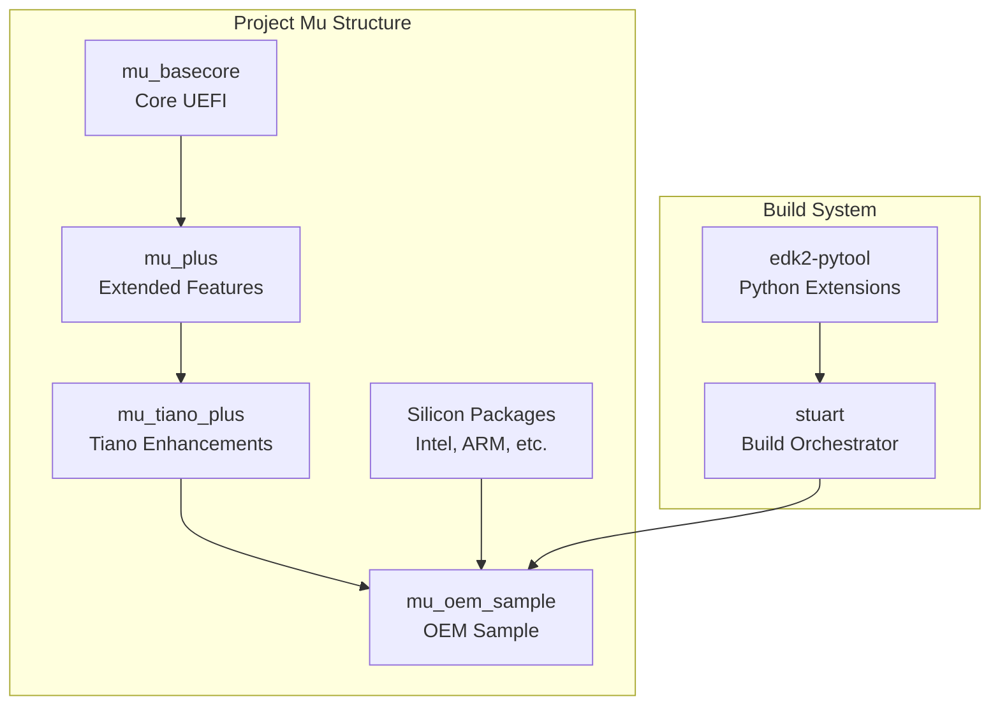

# Appendix B: Project Mu

Project Mu is Microsoft's modular adaptation of TianoCore EDK2, designed for modern UEFI development with improved tooling and CI/CD integration.

## Overview



## Key Differences from EDK2

| Aspect | EDK2 | Project Mu |
|--------|------|------------|
| Build Tool | `build` command | Stuart (Python) |
| Repo Structure | Monolithic | Multi-repository |
| CI/CD | Manual | Built-in pipelines |
| Dependencies | Submodules | pip packages |
| Documentation | Wiki | Integrated docs |
| Versioning | Tags | Semantic versioning |

## Installation

### Prerequisites

```bash
# Python 3.8+ required
python3 --version

# Install pip and virtualenv
pip install virtualenv

# Git with submodule support
git --version
```

### Setting Up Mu Environment

```bash
# Create workspace
mkdir mu-workspace && cd mu-workspace

# Create virtual environment
python3 -m venv venv
source venv/bin/activate  # Linux/macOS
# or: venv\Scripts\activate.bat  # Windows

# Install stuart tools
pip install edk2-pytool-library edk2-pytool-extensions

# Verify installation
stuart_setup --help
stuart_update --help
stuart_build --help
```

### Clone Mu Repositories

```bash
# Clone sample platform
git clone https://github.com/microsoft/mu_tiano_platforms.git
cd mu_tiano_platforms

# Or create your own based on template
git clone https://github.com/microsoft/mu_oem_sample.git my-platform
cd my-platform
```

## Stuart Build System

### Stuart Commands

| Command | Purpose |
|---------|---------|
| `stuart_setup` | Download dependencies |
| `stuart_update` | Update dependencies |
| `stuart_build` | Build platform |
| `stuart_ci_setup` | CI setup |
| `stuart_ci_build` | CI build with tests |

### Build Workflow

```bash
# 1. Setup - download external dependencies
stuart_setup -c Platforms/QemuQ35Pkg/PlatformBuild.py

# 2. Update - sync submodules, apply patches
stuart_update -c Platforms/QemuQ35Pkg/PlatformBuild.py

# 3. Build
stuart_build -c Platforms/QemuQ35Pkg/PlatformBuild.py

# Build with options
stuart_build -c Platforms/QemuQ35Pkg/PlatformBuild.py \
    TOOL_CHAIN_TAG=GCC5 \
    TARGET=DEBUG

# Build specific architecture
stuart_build -c Platforms/QemuQ35Pkg/PlatformBuild.py \
    -a X64
```

### PlatformBuild.py Structure

```python
# PlatformBuild.py - Platform build configuration

import os
from edk2toolext.invocables.edk2_platform_build import BuildSettingsManager
from edk2toolext.invocables.edk2_setup import SetupSettingsManager
from edk2toolext.invocables.edk2_update import UpdateSettingsManager
from edk2toollib.utility_functions import GetHostInfo

class PlatformBuilder(BuildSettingsManager, SetupSettingsManager, UpdateSettingsManager):

    def __init__(self):
        self.WorkspaceRoot = os.path.dirname(os.path.abspath(__file__))

    # =================== Setup Settings ===================

    def GetRequiredSubmodules(self):
        """Define git submodules required for build."""
        return [
            "MU_BASECORE",
            "Common/MU_TIANO",
            "Common/MU_PLUS",
            "Silicon/Intel/IntelSiliconPkg",
        ]

    def GetPackagesPath(self):
        """Return list of package paths."""
        return [
            os.path.join(self.WorkspaceRoot, "MU_BASECORE"),
            os.path.join(self.WorkspaceRoot, "Common", "MU_TIANO"),
            os.path.join(self.WorkspaceRoot, "Common", "MU_PLUS"),
            os.path.join(self.WorkspaceRoot, "Platforms"),
        ]

    # =================== Build Settings ===================

    def GetActiveScopes(self):
        """Return list of build scopes."""
        return ['qemu', 'x64', 'gcc']

    def GetName(self):
        """Platform name."""
        return "QemuQ35Pkg"

    def GetArchitecturesSupported(self):
        """Supported architectures."""
        return ["X64", "IA32"]

    def GetTargetsSupported(self):
        """Supported build targets."""
        return ["DEBUG", "RELEASE", "NOOPT"]

    def GetPackagesSupported(self):
        """Packages this platform builds."""
        return ["QemuQ35Pkg"]

    def GetDscName(self):
        """Platform DSC file."""
        return "Platforms/QemuQ35Pkg/QemuQ35Pkg.dsc"

    def GetFlashImageName(self):
        """Output flash image name."""
        return "QEMU_EFI"

    def SetPlatformEnv(self):
        """Set build environment variables."""
        self.env.SetValue("ACTIVE_PLATFORM", self.GetDscName(), "Platform")
        self.env.SetValue("TARGET_ARCH", "X64", "Platform")
        self.env.SetValue("TOOL_CHAIN_TAG", "GCC5", "Platform")

        return 0

    def GetBuildOutputDir(self):
        """Build output directory."""
        return os.path.join(self.WorkspaceRoot, "Build")

    # =================== Update Settings ===================

    def GetDependencies(self):
        """External dependencies (nuget, pip, etc)."""
        return [
            {
                "name": "mu_basecore",
                "source": "https://github.com/microsoft/mu_basecore.git",
                "version": "release/202311",
                "path": "MU_BASECORE"
            },
            {
                "name": "mu_tiano_plus",
                "source": "https://github.com/microsoft/mu_tiano_plus.git",
                "version": "release/202311",
                "path": "Common/MU_TIANO"
            },
        ]

    def GetPackagesPath(self):
        """Packages path for dependency resolution."""
        return self._packages_path

    # =================== Pre/Post Build Hooks ===================

    def PreBuildHook(self):
        """Actions before build."""
        print("Pre-build: Generating configuration...")
        return 0

    def PostBuildHook(self):
        """Actions after build."""
        print("Post-build: Creating flash image...")
        return 0


# Instantiate for stuart
__init__ = PlatformBuilder()
```

## Repository Structure

### mu_basecore

```
mu_basecore/
├── MdePkg/             # Core definitions (from EDK2)
├── MdeModulePkg/       # Core modules (from EDK2)
├── UefiCpuPkg/         # CPU drivers (from EDK2)
├── SecurityPkg/        # Security modules
├── CryptoPkg/          # Crypto libraries
├── NetworkPkg/         # Network stack
├── FatPkg/             # FAT filesystem
├── BaseTools/          # Build tools
└── .pytool/            # Stuart configuration
```

### mu_plus (Microsoft Extensions)

```
mu_plus/
├── MsCorePkg/          # Microsoft core services
├── MsGraphicsPkg/      # Graphics and UI
├── MsWheaPkg/          # WHEA extensions
├── DfciPkg/            # Device Firmware CI
├── UefiTestingPkg/     # Testing framework
└── XmlSupportPkg/      # XML parsing
```

### Platform Package Structure

```
my_platform/
├── .azurepipelines/           # CI/CD pipelines
├── .pytool/
│   ├── CISettings.py          # CI configuration
│   └── Plugin/                # Custom plugins
├── Platforms/
│   └── MyPlatformPkg/
│       ├── MyPlatform.dsc     # Platform DSC
│       ├── MyPlatform.fdf     # Flash description
│       ├── PlatformBuild.py   # Stuart build config
│       ├── Library/           # Platform libraries
│       └── Drivers/           # Platform drivers
├── Common/                    # Shared components
├── Silicon/                   # Silicon-specific
├── pip-requirements.txt       # Python dependencies
└── readme.md
```

## CI/CD Integration

### Azure Pipelines

```yaml
# azure-pipelines.yml
trigger:
  - main
  - release/*

pool:
  vmImage: 'ubuntu-latest'

steps:
  - task: UsePythonVersion@0
    inputs:
      versionSpec: '3.10'

  - script: |
      pip install -r pip-requirements.txt
    displayName: 'Install dependencies'

  - script: |
      stuart_setup -c Platforms/MyPlatformPkg/PlatformBuild.py
    displayName: 'Stuart Setup'

  - script: |
      stuart_update -c Platforms/MyPlatformPkg/PlatformBuild.py
    displayName: 'Stuart Update'

  - script: |
      stuart_ci_build -c Platforms/MyPlatformPkg/PlatformBuild.py
    displayName: 'Stuart CI Build'

  - task: PublishBuildArtifacts@1
    inputs:
      pathtoPublish: 'Build'
      artifactName: 'firmware'
```

### GitHub Actions

```yaml
# .github/workflows/build.yml
name: Build Firmware

on:
  push:
    branches: [ main ]
  pull_request:
    branches: [ main ]

jobs:
  build:
    runs-on: ubuntu-latest

    steps:
      - uses: actions/checkout@v3
        with:
          submodules: recursive

      - name: Set up Python
        uses: actions/setup-python@v4
        with:
          python-version: '3.10'

      - name: Install dependencies
        run: pip install -r pip-requirements.txt

      - name: Stuart Setup
        run: stuart_setup -c Platforms/MyPlatformPkg/PlatformBuild.py

      - name: Stuart Update
        run: stuart_update -c Platforms/MyPlatformPkg/PlatformBuild.py

      - name: Stuart Build
        run: stuart_build -c Platforms/MyPlatformPkg/PlatformBuild.py

      - name: Upload artifacts
        uses: actions/upload-artifact@v3
        with:
          name: firmware
          path: Build/
```

## Feature Comparison

### Mu-Specific Features

| Feature | Description |
|---------|-------------|
| DFCI | Device Firmware Configuration Interface |
| Mu Telemetry | Firmware telemetry framework |
| Mu Graphics | Enhanced graphics stack |
| Mu Policy | Dynamic configuration policies |
| Capsule Update | Enhanced update framework |

### Using Mu Features

```c
// Using DFCI for configuration management
#include <DfciSystemSettingTypes.h>
#include <Protocol/DfciSettingsProvider.h>

EFI_STATUS
RegisterDfciSetting (
    VOID
    )
{
    DFCI_SETTING_PROVIDER  *Provider;

    // Get DFCI provider
    Status = gBS->LocateProtocol(
        &gDfciSettingsProviderProtocolGuid,
        NULL,
        (VOID **)&Provider
    );

    // Register a setting
    Status = Provider->RegisterProvider(
        Provider,
        DFCI_OEM_SETTING_ID__MY_FEATURE,
        DFCI_SETTING_TYPE_ENABLE,
        DFCI_SETTING_FLAGS_NO_PREBOOT_UI,
        MySettingSet,
        MySettingGet,
        MySettingDefault,
        NULL
    );

    return Status;
}
```

## Migration from EDK2

### Step 1: Create Platform Package

```bash
# Clone Mu sample
git clone https://github.com/microsoft/mu_oem_sample.git my-platform
cd my-platform

# Remove sample-specific code
rm -rf Platforms/SamplePkg

# Create your platform
mkdir -p Platforms/MyPlatformPkg
```

### Step 2: Update Dependencies

```python
# PlatformBuild.py
def GetDependencies(self):
    return [
        {
            "name": "mu_basecore",
            "source": "https://github.com/microsoft/mu_basecore.git",
            "version": "release/202311",
            "path": "MU_BASECORE"
        },
        # Add other dependencies
    ]
```

### Step 3: Adapt DSC File

```ini
# Changes from EDK2 to Mu DSC

# Include Mu-specific definitions
!include MU_BASECORE/MdePkg/MdeLibs.dsc.inc

# Use Mu library instances where available
[LibraryClasses]
  # Mu-enhanced debug library
  DebugLib|MsCorePkg/Library/DebugLib/DebugLib.inf

  # Mu graphics
  GraphicsLib|MsGraphicsPkg/Library/GraphicsLib/GraphicsLib.inf
```

### Step 4: Configure Stuart

```python
# Create PlatformBuild.py based on template
# Update paths, dependencies, and build settings
```

## Troubleshooting

| Issue | Solution |
|-------|----------|
| Stuart not found | `pip install edk2-pytool-extensions` |
| Submodule failed | Check network, verify URLs |
| Build fails | Check `GetPackagesPath()` includes all deps |
| CI timeout | Increase timeout, optimize build |
| Missing library | Add to DSC `LibraryClasses` |

## References

- [Project Mu Documentation](https://microsoft.github.io/mu/)
- [mu_basecore Repository](https://github.com/microsoft/mu_basecore)
- [edk2-pytool Documentation](https://github.com/tianocore/edk2-pytool-extensions)
- [Stuart User Guide](https://github.com/tianocore/edk2-pytool-extensions/blob/master/docs/usability/using_stuart.md)
