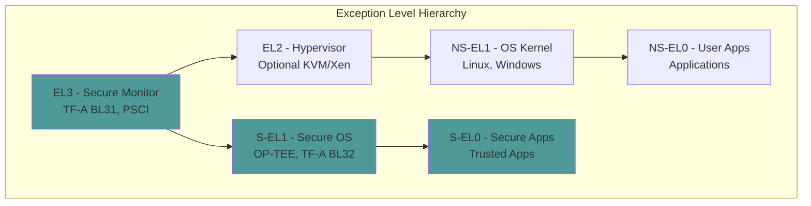

# Appendix F: ARM Quick Reference

Quick reference for ARM UEFI development including registers, PSCI, GIC, and SystemReady compliance.

## ARM Exception Levels



| Level | Description | Typical Use |
|-------|-------------|-------------|
| EL0 | Unprivileged | User applications |
| EL1 | Privileged | OS kernel, UEFI |
| EL2 | Hypervisor | KVM, Xen |
| EL3 | Secure Monitor | TF-A, PSCI |

## Key System Registers

### General Purpose

| Register | Description |
|----------|-------------|
| `X0-X7` | Function arguments/return values |
| `X8` | Indirect result location |
| `X9-X15` | Caller-saved temporaries |
| `X16-X17` | Intra-procedure scratch (IP0, IP1) |
| `X18` | Platform register |
| `X19-X28` | Callee-saved registers |
| `X29` | Frame pointer (FP) |
| `X30` | Link register (LR) |
| `SP` | Stack pointer (per EL) |
| `PC` | Program counter |

### System Control (EL1)

| Register | Description | Common Bits |
|----------|-------------|-------------|
| `SCTLR_EL1` | System Control | M(MMU), C(Cache), I(ICache), WXN |
| `MAIR_EL1` | Memory Attribute Indirection | Device, Normal memory types |
| `TCR_EL1` | Translation Control | T0SZ, T1SZ, TG0, TG1 |
| `TTBR0_EL1` | Translation Table Base 0 | User space page tables |
| `TTBR1_EL1` | Translation Table Base 1 | Kernel space page tables |
| `VBAR_EL1` | Vector Base Address | Exception vector table |
| `ESR_EL1` | Exception Syndrome | Exception class, ISS |
| `FAR_EL1` | Fault Address | Faulting address |
| `ELR_EL1` | Exception Link | Return address |
| `SPSR_EL1` | Saved Program Status | Saved PSTATE |

### System Control (EL2)

| Register | Description |
|----------|-------------|
| `HCR_EL2` | Hypervisor Configuration |
| `VTTBR_EL2` | Virtualization Translation Table Base |
| `VTCR_EL2` | Virtualization Translation Control |
| `VBAR_EL2` | Vector Base Address EL2 |
| `ESR_EL2` | Exception Syndrome EL2 |

### System Control (EL3)

| Register | Description |
|----------|-------------|
| `SCR_EL3` | Secure Configuration |
| `SCTLR_EL3` | System Control EL3 |
| `VBAR_EL3` | Vector Base Address EL3 |
| `ESR_EL3` | Exception Syndrome EL3 |

### Accessing Registers

```c
// Read system register
UINT64
ArmReadSctlrEl1 (
    VOID
    )
{
    UINT64 Value;
    asm volatile("mrs %0, sctlr_el1" : "=r" (Value));
    return Value;
}

// Write system register
VOID
ArmWriteVbarEl1 (
    IN UINT64  VectorBase
    )
{
    asm volatile("msr vbar_el1, %0" : : "r" (VectorBase));
    asm volatile("isb");
}

// EDK2 library functions (ArmLib)
#include <Library/ArmLib.h>

UINT64 Sctlr = ArmReadSctlr();
ArmWriteVbar(VectorBase);
ArmDisableInterrupts();
ArmEnableInterrupts();
ArmDisableCachesAndMmu();
ArmEnableDataCache();
ArmEnableInstructionCache();
ArmEnableMmu();
ArmInvalidateTlb();
```

## PSCI (Power State Coordination Interface)

### Function IDs

| Function | SMC32 ID | SMC64 ID | Description |
|----------|----------|----------|-------------|
| `PSCI_VERSION` | 0x84000000 | - | Get PSCI version |
| `CPU_SUSPEND` | 0x84000001 | 0xC4000001 | Suspend CPU |
| `CPU_OFF` | 0x84000002 | - | Turn off CPU |
| `CPU_ON` | 0x84000003 | 0xC4000003 | Turn on CPU |
| `AFFINITY_INFO` | 0x84000004 | 0xC4000004 | Get CPU state |
| `MIGRATE` | 0x84000005 | 0xC4000005 | Migrate trusted OS |
| `SYSTEM_OFF` | 0x84000008 | - | System shutdown |
| `SYSTEM_RESET` | 0x84000009 | - | System reset |
| `SYSTEM_RESET2` | 0x84000012 | 0xC4000012 | Reset with type |
| `FEATURES` | 0x8400000A | - | Query features |
| `CPU_FREEZE` | 0x8400000B | - | Freeze CPU |
| `CPU_DEFAULT_SUSPEND` | 0x8400000C | 0xC400000C | Default suspend |
| `SYSTEM_SUSPEND` | 0x8400000E | 0xC400000E | System suspend |
| `PSCI_STAT_RESIDENCY` | 0x84000010 | 0xC4000010 | Stat residency |
| `PSCI_STAT_COUNT` | 0x84000011 | 0xC4000011 | Stat count |

### Return Values

| Value | Meaning |
|-------|---------|
| 0 (`PSCI_SUCCESS`) | Success |
| -1 (`PSCI_E_NOT_SUPPORTED`) | Not supported |
| -2 (`PSCI_E_INVALID_PARAMS`) | Invalid parameters |
| -3 (`PSCI_E_DENIED`) | Denied |
| -4 (`PSCI_E_ALREADY_ON`) | Already on |
| -5 (`PSCI_E_ON_PENDING`) | On pending |
| -6 (`PSCI_E_INTERN_FAIL`) | Internal failure |
| -7 (`PSCI_E_NOT_PRESENT`) | Not present |
| -8 (`PSCI_E_DISABLED`) | Disabled |
| -9 (`PSCI_E_INVALID_ADDRESS`) | Invalid address |

### PSCI Usage Examples

```c
#include <IndustryStandard/ArmStdSmc.h>
#include <Library/ArmSmcLib.h>

// Call PSCI via SMC
ARM_SMC_ARGS  SmcArgs;

// Get PSCI version
SmcArgs.Arg0 = ARM_SMC_ID_PSCI_VERSION;
ArmCallSmc(&SmcArgs);
UINT32 Version = SmcArgs.Arg0;  // 0x00010001 = v1.1

// CPU_ON - Start secondary CPU
SmcArgs.Arg0 = ARM_SMC_ID_PSCI_CPU_ON_AARCH64;
SmcArgs.Arg1 = TargetMpidr;     // Target CPU MPIDR
SmcArgs.Arg2 = EntryPoint;      // Entry point address
SmcArgs.Arg3 = ContextId;       // Context (passed to CPU)
ArmCallSmc(&SmcArgs);
if (SmcArgs.Arg0 != PSCI_SUCCESS) {
    // Handle error
}

// System reset
SmcArgs.Arg0 = ARM_SMC_ID_PSCI_SYSTEM_RESET;
ArmCallSmc(&SmcArgs);
// Does not return
```

## GIC (Generic Interrupt Controller)

### GIC Registers

#### Distributor (GICD)

| Register | Offset | Description |
|----------|--------|-------------|
| `GICD_CTLR` | 0x0000 | Distributor Control |
| `GICD_TYPER` | 0x0004 | Interrupt Controller Type |
| `GICD_IIDR` | 0x0008 | Implementer Identification |
| `GICD_IGROUPRn` | 0x0080 | Interrupt Group (GICv2) |
| `GICD_ISENABLERn` | 0x0100 | Interrupt Set-Enable |
| `GICD_ICENABLERn` | 0x0180 | Interrupt Clear-Enable |
| `GICD_ISPENDRn` | 0x0200 | Interrupt Set-Pending |
| `GICD_ICPENDRn` | 0x0280 | Interrupt Clear-Pending |
| `GICD_IPRIORITYRn` | 0x0400 | Interrupt Priority |
| `GICD_ITARGETSRn` | 0x0800 | Interrupt Targets (GICv2) |
| `GICD_ICFGRn` | 0x0C00 | Interrupt Configuration |
| `GICD_IROUTERn` | 0x6100 | Interrupt Routing (GICv3) |

#### Redistributor (GICR) - GICv3+

| Register | Offset | Description |
|----------|--------|-------------|
| `GICR_CTLR` | 0x0000 | Redistributor Control |
| `GICR_TYPER` | 0x0008 | Redistributor Type |
| `GICR_WAKER` | 0x0014 | Redistributor Wake |
| `GICR_IGROUPR0` | 0x10080 | SGI/PPI Group |
| `GICR_ISENABLER0` | 0x10100 | SGI/PPI Set-Enable |
| `GICR_ICENABLER0` | 0x10180 | SGI/PPI Clear-Enable |

#### CPU Interface (GICC/ICC)

| Register | Description |
|----------|-------------|
| `ICC_PMR_EL1` | Priority Mask |
| `ICC_BPR1_EL1` | Binary Point |
| `ICC_IAR1_EL1` | Interrupt Acknowledge |
| `ICC_EOIR1_EL1` | End of Interrupt |
| `ICC_CTLR_EL1` | CPU Interface Control |
| `ICC_SRE_EL1` | System Register Enable |
| `ICC_IGRPEN1_EL1` | Group 1 Enable |

### Interrupt Types

| Type | Range | Description |
|------|-------|-------------|
| SGI | 0-15 | Software Generated Interrupts |
| PPI | 16-31 | Private Peripheral Interrupts |
| SPI | 32-1019 | Shared Peripheral Interrupts |
| LPI | 8192+ | Locality-specific (GICv3) |

### GIC Configuration Example

```c
#include <Library/ArmGicLib.h>

// Initialize GIC
VOID
InitializeGic (
    IN UINT64  GicdBase,
    IN UINT64  GicrBase  // GICv3 only
    )
{
    // Enable distributor
    MmioWrite32(GicdBase + GICD_CTLR,
                GICD_CTLR_ARE_S | GICD_CTLR_ARE_NS |
                GICD_CTLR_ENABLE_GRP1_NS);

    // For each SPI (32+)
    for (UINT32 IntId = 32; IntId < MaxIntId; IntId++) {
        // Set priority
        MmioWrite8(GicdBase + GICD_IPRIORITYR + IntId, 0xA0);

        // Route to this CPU (GICv3)
        MmioWrite64(GicdBase + GICD_IROUTER + IntId * 8,
                    ArmReadMpidr() & 0xFFFFFF);

        // Enable interrupt
        MmioWrite32(GicdBase + GICD_ISENABLER + (IntId / 32) * 4,
                    1 << (IntId % 32));
    }

    // Enable CPU interface (GICv3 system registers)
    ArmGicV3SetPriorityMask(0xFF);
    ArmGicV3SetBinaryPointer(0);
    ArmGicV3EnableInterruptInterface();
}

// Handle interrupt
VOID
HandleInterrupt (
    VOID
    )
{
    UINT32 IntId = ArmGicV3AcknowledgeInterrupt();

    if (IntId < 1020) {
        // Handle the interrupt
        ProcessInterrupt(IntId);

        // Signal end of interrupt
        ArmGicV3EndOfInterrupt(IntId);
    }
}
```

## ARM ACPI Tables

### Required Tables for ARM

| Table | Description | Key Contents |
|-------|-------------|--------------|
| RSDP | Root System Description Pointer | XSDT address |
| XSDT | Extended System Description Table | Pointers to other tables |
| FADT | Fixed ACPI Description Table | PSCI info, hardware model |
| MADT | Multiple APIC Description Table | GIC structures |
| GTDT | Generic Timer Description Table | Timer info |
| DSDT | Differentiated System Description | Device tree in AML |
| DBG2 | Debug Port Table 2 | Debug console |
| SPCR | Serial Port Console Redirection | Serial console |
| PPTT | Processor Properties Topology | Cache hierarchy |
| IORT | IO Remapping Table | SMMU mappings |
| MCFG | PCI Express Config | ECAM base |

### MADT GIC Structures

```c
// GIC Distributor
typedef struct {
    UINT8   Type;                   // 12
    UINT8   Length;                 // 24
    UINT16  Reserved1;
    UINT32  GicId;
    UINT64  PhysicalBaseAddress;
    UINT32  SystemVectorBase;
    UINT8   GicVersion;             // 3 for GICv3
    UINT8   Reserved2[3];
} EFI_ACPI_6_3_GICD_STRUCTURE;

// GIC CPU Interface
typedef struct {
    UINT8   Type;                   // 11
    UINT8   Length;                 // 80
    UINT16  Reserved;
    UINT32  CpuInterfaceNumber;
    UINT32  AcpiProcessorUid;
    UINT32  Flags;
    UINT32  ParkingProtocolVersion;
    UINT32  PerformanceInterruptGsiv;
    UINT64  ParkedAddress;
    UINT64  PhysicalBaseAddress;    // GICC
    UINT64  GICV;
    UINT64  GICH;
    UINT32  VGICMaintenanceInterrupt;
    UINT64  GICRBaseAddress;        // GICv3
    UINT64  MPIDR;
    UINT8   ProcessorPowerEfficiencyClass;
    UINT8   Reserved2;
    UINT16  SpeOverflowInterrupt;
} EFI_ACPI_6_3_GIC_STRUCTURE;

// GIC Redistributor (GICv3)
typedef struct {
    UINT8   Type;                   // 14
    UINT8   Length;                 // 16
    UINT16  Reserved;
    UINT64  DiscoveryRangeBaseAddress;
    UINT32  DiscoveryRangeLength;
} EFI_ACPI_6_3_GICR_STRUCTURE;

// GIC ITS (GICv3)
typedef struct {
    UINT8   Type;                   // 15
    UINT8   Length;                 // 20
    UINT16  Reserved1;
    UINT32  GicItsId;
    UINT64  PhysicalBaseAddress;
    UINT32  Reserved2;
} EFI_ACPI_6_3_GIC_ITS_STRUCTURE;
```

### GTDT Structure

```c
typedef struct {
    EFI_ACPI_DESCRIPTION_HEADER  Header;
    UINT64  CntControlBasePhysicalAddress;
    UINT32  Reserved;
    UINT32  SecureEL1TimerGSIV;
    UINT32  SecureEL1TimerFlags;
    UINT32  NonSecureEL1TimerGSIV;
    UINT32  NonSecureEL1TimerFlags;
    UINT32  VirtualTimerGSIV;
    UINT32  VirtualTimerFlags;
    UINT32  NonSecureEL2TimerGSIV;
    UINT32  NonSecureEL2TimerFlags;
    UINT64  CntReadBasePhysicalAddress;
    UINT32  PlatformTimerCount;
    UINT32  PlatformTimerOffset;
} EFI_ACPI_6_3_GTDT;
```

## SystemReady Compliance

### Certification Bands

| Band | Target | Key Requirements |
|------|--------|------------------|
| **SR** | Servers | SBSA L3+, full UEFI, full ACPI |
| **ES** | Embedded | UEFI, ACPI, standard boot |
| **IR** | IoT/Constrained | UEFI subset, DT or ACPI |

### Compliance Checklist

#### Base Requirements

- [ ] UEFI 2.7+ with required protocols
- [ ] ACPI 6.3+ with required tables
- [ ] Secure Boot support
- [ ] Capsule Update support
- [ ] EFI System Partition (ESP)
- [ ] SMBIOS 3.0+ tables

#### Testing Requirements

- [ ] UEFI SCT (Self Certification Test) pass
- [ ] FWTS (Firmware Test Suite) pass
- [ ] BSA ACS (Architecture Compliance Suite) pass
- [ ] OS boot validation (Linux, Windows)

### Running ACS Tests

```bash
# Download ACS image
wget https://github.com/ARM-software/arm-systemready/releases/latest/download/ir-acs-live-image.img.xz
xz -d ir-acs-live-image.img.xz

# Run in QEMU
qemu-system-aarch64 \
    -M virt,gic-version=3 \
    -cpu cortex-a72 \
    -m 4G \
    -drive if=pflash,format=raw,file=AAVMF_CODE.fd,readonly=on \
    -drive if=pflash,format=raw,file=AAVMF_VARS.fd \
    -drive file=ir-acs-live-image.img,format=raw \
    -serial stdio

# Tests run automatically, results in /acs-results/
```

## Memory Map

### Typical ARM64 Memory Layout

| Address Range | Size | Description |
|---------------|------|-------------|
| 0x0000_0000 - 0x0000_FFFF | 64KB | Exception vectors (optional) |
| 0x0800_0000 - 0x0FFF_FFFF | 128MB | Flash/ROM |
| 0x0900_0000 | - | GIC Distributor |
| 0x0900_A000 | - | GIC Redistributor |
| 0x0901_0000 | - | UART0 (PL011) |
| 0x0C00_0000 | - | PCIe ECAM |
| 0x4000_0000 - 0xFFFF_FFFF | 3GB | DRAM (low) |
| 0x8_0000_0000+ | - | DRAM (high) |

### EDK2 Memory Configuration

```ini
# Platform DSC
[PcdsFixedAtBuild]
  # System memory base and size
  gArmTokenSpaceGuid.PcdSystemMemoryBase|0x40000000
  gArmTokenSpaceGuid.PcdSystemMemorySize|0xC0000000   # 3GB

  # FD (Firmware Device) location
  gArmTokenSpaceGuid.PcdFdBaseAddress|0x00000000
  gArmTokenSpaceGuid.PcdFdSize|0x00400000             # 4MB

  # FV (Firmware Volume) location
  gArmTokenSpaceGuid.PcdFvBaseAddress|0x00000000
  gArmTokenSpaceGuid.PcdFvSize|0x00300000

  # GIC Configuration
  gArmTokenSpaceGuid.PcdGicDistributorBase|0x09000000
  gArmTokenSpaceGuid.PcdGicRedistributorsBase|0x090A0000

  # Timer
  gArmTokenSpaceGuid.PcdArmArchTimerFreqInHz|62500000
  gArmTokenSpaceGuid.PcdArmArchTimerSecIntrNum|29
  gArmTokenSpaceGuid.PcdArmArchTimerIntrNum|30
  gArmTokenSpaceGuid.PcdArmArchTimerVirtIntrNum|27
  gArmTokenSpaceGuid.PcdArmArchTimerHypIntrNum|26

  # Serial console
  gEfiMdeModulePkgTokenSpaceGuid.PcdSerialRegisterBase|0x09010000
  gEfiMdePkgTokenSpaceGuid.PcdUartDefaultBaudRate|115200
```

## Quick Build Commands

```bash
# Setup EDK2 for ARM
export GCC5_AARCH64_PREFIX=aarch64-linux-gnu-
source edksetup.sh

# Build QEMU ARM64 firmware
build -a AARCH64 -t GCC5 -p ArmVirtPkg/ArmVirtQemu.dsc -b DEBUG

# Run in QEMU
qemu-system-aarch64 \
    -M virt,gic-version=3 \
    -cpu cortex-a72 \
    -m 2G \
    -drive if=pflash,format=raw,file=QEMU_EFI.fd,readonly=on \
    -drive if=pflash,format=raw,file=QEMU_VARS.fd \
    -nographic

# Debug with GDB
qemu-system-aarch64 ... -s -S &
aarch64-linux-gnu-gdb
(gdb) target remote :1234
(gdb) add-symbol-file Build/.../DEBUG_GCC5/AARCH64/DxeCore.debug 0x...
```

## References

- [ARM Architecture Reference Manual](https://developer.arm.com/documentation/ddi0487/latest)
- [PSCI Specification](https://developer.arm.com/documentation/den0022/latest)
- [GIC Architecture Specification](https://developer.arm.com/documentation/ihi0069/latest)
- [SystemReady Certification](https://www.arm.com/architecture/system-architectures/systemready-certification-program)
- [EDK2 ArmPkg](https://github.com/tianocore/edk2/tree/master/ArmPkg)
- [Trusted Firmware-A](https://trustedfirmware-a.readthedocs.io/)
