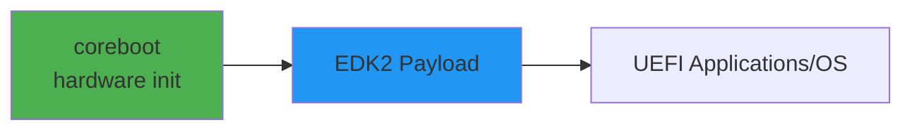
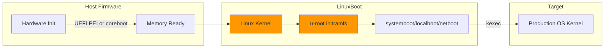
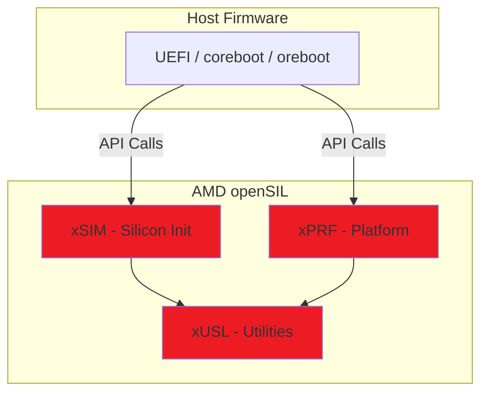
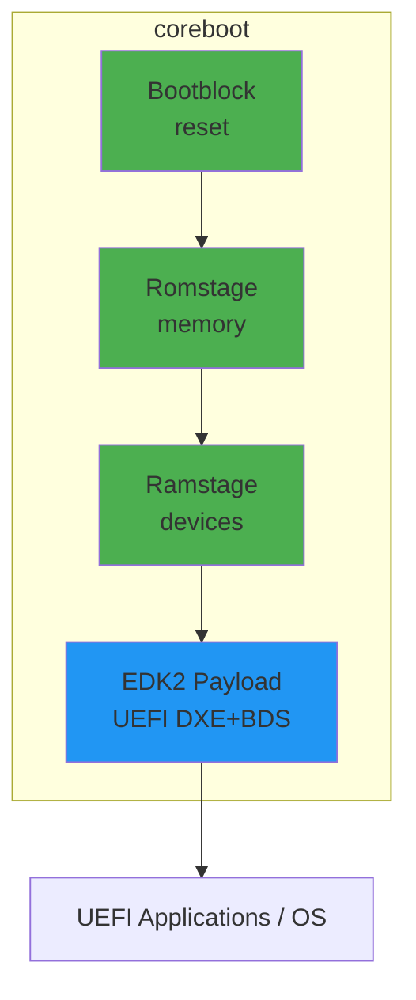
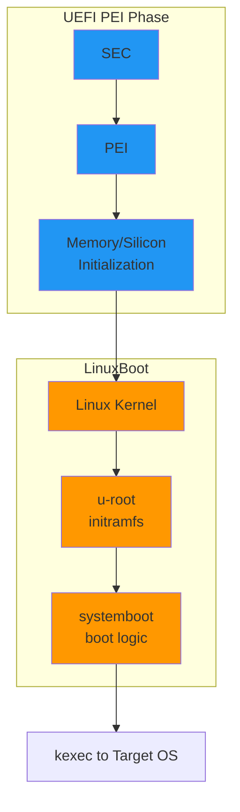
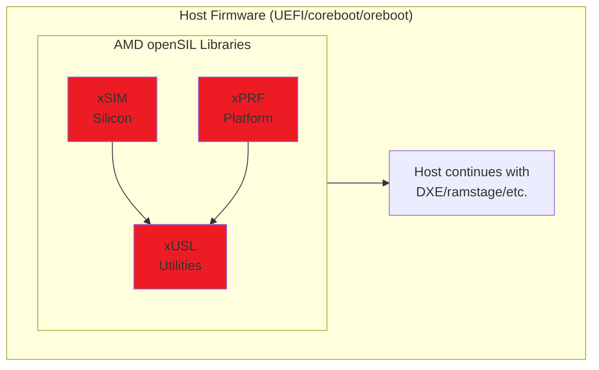

# Appendix G: Alternative Firmware Approaches
{: .fs-9 }

Overview of open-source firmware alternatives to proprietary UEFI implementations.
{: .fs-6 .fw-300 }

---

## Introduction

While this guide focuses on UEFI development using EDK2, the firmware ecosystem includes several alternative approaches. Understanding these alternatives helps you choose the right solution for your platform and recognize how they interoperate with UEFI.

### Why Consider Alternatives?

| Concern | UEFI (Proprietary) | Open-Source Alternatives |
|:--------|:-------------------|:-------------------------|
| **Code Auditability** | Closed-source vendor code | Fully auditable source |
| **Attack Surface** | Large codebase (~millions of lines) | Minimal, focused code |
| **Boot Speed** | Slower (feature-rich) | Faster (minimal) |
| **Customization** | Vendor-dependent | Full control |
| **Security Updates** | At vendor's convenience | Community-driven |
| **Binary Blobs** | Required (FSP, AGESA) | Varies by project |

---

## Comparison Matrix

| Project | Language | x86 Support | ARM Support | RISC-V | Binary Blobs | UEFI Compatible |
|:--------|:---------|:------------|:------------|:-------|:-------------|:----------------|
| **coreboot** | C | Yes | Limited | Yes | Some required | Via payload |
| **LinuxBoot** | Go/C | Yes | Yes | Yes | Host-dependent | Replaces DXE |
| **AMD openSIL** | C | AMD only | No | No | None (goal) | Yes |
| **oreboot** | Rust | No | Yes | Yes | None | Via payload |
| **Libreboot** | C | Yes | Limited | No | None | Via payload |

```mermaid
graph TB
    subgraph "Traditional UEFI Boot"
        SEC1[SEC] --> PEI1[PEI]
        PEI1 --> DXE1[DXE]
        DXE1 --> BDS1[BDS]
        BDS1 --> OS1[OS Loader]
    end

    subgraph "coreboot Boot"
        CB_BOOT[Bootblock] --> CB_ROM[Romstage]
        CB_ROM --> CB_RAM[Ramstage]
        CB_RAM --> CB_PAY[Payload]
        CB_PAY --> OS2[OS/UEFI/Linux]
    end

    subgraph "LinuxBoot"
        LB_PEI[UEFI PEI/coreboot] --> LB_LINUX[Linux Kernel]
        LB_LINUX --> LB_UROOT[u-root initramfs]
        LB_UROOT --> OS3[kexec to OS]
    end

    style SEC1 fill:#2196f3
    style CB_BOOT fill:#4caf50
    style LB_LINUX fill:#ff9800
```



---

## coreboot

### Overview

**coreboot** (formerly LinuxBIOS) is an open-source firmware project that replaces proprietary BIOS/UEFI with minimal code to initialize hardware. It focuses on doing "just enough" to hand off to a payload (bootloader, OS, or UEFI environment).

### Design Philosophy

- **Minimal**: Only initialize hardware necessary for the payload
- **Fast**: Boot times under 1 second for desktops, minutes saved on servers
- **Auditable**: Open-source code with reduced attack surface
- **Payload-agnostic**: Can launch SeaBIOS, GRUB, Linux, or even TianoCore UEFI

### Architecture

| Stage | Purpose | Size (typical) |
|:------|:--------|:---------------|
| **Bootblock** | CPU reset, CAR setup, load romstage | ~20KB |
| **Romstage** | Memory init, early hardware | ~87KB (native) |
| **Ramstage** | Device enumeration, resource allocation | ~200KB |
| **Payload** | Bootloader/OS/UEFI | Varies |

### Current State (2025-2026)

- **Latest Release**: coreboot 25.12 (December 2025)
- **Next Release**: 26.03 (March 2026)
- **Active Development**: 50+ contributors, regular releases
- **Production Use**: Google Chromebooks, System76, Purism, Protectli

### Platform Support

| Vendor | Platforms | Notes |
|:-------|:----------|:------|
| **Intel** | Many generations | FSP binary required |
| **AMD** | Select platforms | AGESA/openSIL |
| **ARM** | Limited | Primarily development boards |
| **RISC-V** | Growing | SiFive, StarFive |

### UEFI Interoperability

coreboot can launch a **TianoCore EDK2 payload**, providing full UEFI boot services:



This gives you coreboot's fast, auditable init with UEFI compatibility.

### Key Resources

| Resource | Link |
|:---------|:-----|
| Official Site | [coreboot.org](https://www.coreboot.org/) |
| Documentation | [doc.coreboot.org](https://doc.coreboot.org/) |
| Tutorial | [Tutorial Part 1](https://doc.coreboot.org/tutorial/part1.html) |
| GitHub | [github.com/coreboot/coreboot](https://github.com/coreboot/coreboot) |
| IRC | `#coreboot` on Libera.Chat |

---

## LinuxBoot

### Overview

**LinuxBoot** replaces specific UEFI firmware functionality with a Linux kernel and initramfs. Instead of running UEFI DXE drivers for storage, network, and other devices, LinuxBoot uses proven Linux drivers.

### Design Philosophy

- **Replace, Don't Rewrite**: Use Linux's battle-tested drivers instead of UEFI DXE
- **Reduce Attack Surface**: Replace millions of lines of UEFI with audited Linux kernel
- **Standardized Environment**: Developers work in familiar Linux userspace
- **Flexible Boot**: Boot via kexec, network (PXE/HTTP), or local storage

### Architecture



### Components

| Component | Description |
|:----------|:------------|
| **Linux Kernel** | Minimal kernel for hardware access (~5MB) |
| **u-root** | Go-based initramfs with Unix utilities |
| **systemboot** | Boot logic (netboot, localboot) merged into u-root |

### Current State (2025-2026)

- **Active Development**: Supported by Google, Meta, and others
- **Production Use**: Large-scale data center deployments
- **u-root**: Actively maintained, Go 1.21+ required
- **Documentation**: [LinuxBoot Book](https://book.linuxboot.org/)

### Advantages Over Traditional UEFI

| Aspect | UEFI DXE | LinuxBoot |
|:-------|:---------|:----------|
| **Driver Quality** | Vendor-specific, closed | Linux mainline, audited |
| **Network Boot** | PXE (limited) | Full HTTP/HTTPS, SSH |
| **Debugging** | Proprietary tools | Standard Linux tools |
| **Updates** | Flash firmware | Update kernel/initrd |
| **Security** | Varies | Kernel security features |

### Key Resources

| Resource | Link |
|:---------|:-----|
| Official Site | [linuxboot.org](https://www.linuxboot.org/) |
| LinuxBoot Book | [book.linuxboot.org](https://book.linuxboot.org/) |
| u-root GitHub | [github.com/u-root/u-root](https://github.com/u-root/u-root) |
| Coreboot Integration | [book.linuxboot.org/coreboot.u-root.systemboot](https://book.linuxboot.org/coreboot.u-root.systemboot/) |

---

## AMD openSIL

### Overview

**AMD openSIL** (Open Silicon Initialization Library) is AMD's initiative to replace the closed-source AGESA firmware with an open-source silicon initialization library. It represents a major shift toward transparency in x86 firmware.

### Design Philosophy

- **Host-Agnostic**: Works with UEFI, coreboot, oreboot, or any host firmware
- **Open Source**: Full source code under MIT license (when released)
- **Modern Architecture**: Written in C17, clean API design
- **Scalable**: Same codebase for client and server platforms

### Architecture

openSIL consists of three statically linked libraries:

| Library | Purpose |
|:--------|:--------|
| **xSIM** | Silicon Initialization - CPU, memory controller, I/O |
| **xPRF** | Platform Reference - Board-specific customizations |
| **xUSL** | Utilities & Services - Common helper functions |



### Current State (2025-2026)

| Milestone | Status |
|:----------|:-------|
| Proof-of-Concept (Genoa) | Complete |
| Extended POC (Turin/Phoenix) | Complete |
| Production openSIL (Venice/Medusa) | 2026 |
| Open-source release | Q3-Q4 2026 |
| AGESA End of Life | 2026 |

{: .important }
> **2026 Transition**: AMD has confirmed that AGESA will be end-of-life in 2026, with openSIL replacing it for all new products. The first production platforms will be 6th Gen EPYC "Venice" (server) and Ryzen "Medusa" (client).

### Comparison: AGESA vs openSIL

| Aspect | AGESA | openSIL |
|:-------|:------|:--------|
| **Source** | Closed binary blob | Open source (MIT) |
| **Host Support** | UEFI only | Any host firmware |
| **Build Time** | 20-30 minutes | ~30 seconds |
| **Auditability** | None | Full |
| **Integration** | Binary linking | Static source linking |

### Industry Adoption

- **9elements**: Collaborating with AMD on coreboot integration
- **MiTAC**: Experimenting with openSIL POC
- **Supermicro**: Evaluating for server platforms
- **NLnet Foundation**: Funding coreboot+openSIL for modern AMD boards

### Key Resources

| Resource | Link |
|:---------|:-----|
| AMD Blog | [AMD openSIL Announcement](https://www.amd.com/en/blogs/2023/empowering-the-industry-with-open-system-firmware-.html) |
| GitHub (POC) | [github.com/openSIL/openSIL](https://github.com/openSIL/openSIL) |
| Basic Input/Output Blog | [AMD openSIL Analysis](https://www.basicinputoutput.com/2025/01/amd-opensil.html) |
| OSFC Talks | [Open Source Firmware Conference](https://osfc.io/) |

---

## oreboot

### Overview

**oreboot** is a fork of coreboot rewritten entirely in Rust, with no C code. It targets platforms that can be fully open-source without binary blobs.

### Design Philosophy

- **No C Code**: Memory-safe Rust throughout
- **No Binary Blobs**: Only truly open hardware supported
- **LinuxBoot Payload**: Designed specifically for LinuxBoot
- **Modern Development**: GitHub-based, auto-formatted code

### Current State (2025-2026)

| Aspect | Status |
|:-------|:-------|
| **x86 Support** | None (blobs required) |
| **ARM Support** | AST2500 BMC |
| **RISC-V Support** | SiFive HiFive Unleashed |
| **Maturity** | Experimental |

### Supported Platforms

| Platform | Architecture | Notes |
|:---------|:-------------|:------|
| AST2500 | ARM | BMC platform |
| HiFive Unleashed | RISC-V | SiFive development board |
| QEMU | Various | For testing |

### Key Resources

| Resource | Link |
|:---------|:-----|
| GitHub | [github.com/oreboot/oreboot](https://github.com/oreboot/oreboot) |
| Documentation | In repository README |

---

## Libreboot & Canoeboot

### Overview

**Libreboot** and **Canoeboot** are coreboot distributions that provide pre-built, tested firmware images for specific hardware. They focus on user accessibility - you don't need to be a firmware developer to install them.

### Differences

| Aspect | Libreboot | Canoeboot |
|:-------|:----------|:----------|
| **Philosophy** | Pragmatic blob policy | Strictly libre (no blobs) |
| **CPU Microcode** | Included when beneficial | Excluded |
| **Hardware Support** | Broader | More restricted |
| **Target Users** | Security-conscious users | Free software purists |

### Current State (2025-2026)

- **Latest Release**: 26.01 (January 2026)
- **SPI Membership**: Libreboot became an SPI Associated Project (September 2025)
- **Active Maintenance**: Regular releases tracking coreboot upstream

### Supported Hardware (Examples)

| Category | Devices |
|:---------|:--------|
| **Laptops** | ThinkPad X200, T400, Dell Latitude E7240 |
| **Desktops** | HP Pro 3500, various AMD boards |
| **Servers** | ASUS KGPE-D16, KFSN4-DRE |

### Installation

Unlike coreboot (which requires compilation), Libreboot/Canoeboot provide ready-to-flash ROM images:

```bash
# Example: Flash internally (if supported)
flashrom -p internal -w libreboot.rom

# Example: Flash externally via SPI programmer
flashrom -p ch341a_spi -w libreboot.rom
```

{: .warning }
> **Hardware Risk**: Flashing firmware incorrectly can brick your device. External flashing equipment may be needed for recovery.

### Key Resources

| Resource | Link |
|:---------|:-----|
| Libreboot | [libreboot.org](https://libreboot.org/) |
| Canoeboot | [canoeboot.org](https://canoeboot.org/) |
| Installation Guide | [libreboot.org/docs/install](https://libreboot.org/docs/install/) |
| Downloads | [libreboot.org/download](https://libreboot.org/download.html) |
| Purchase Pre-installed | [Minifree Ltd](https://minifree.org/) |

---

## Integration Patterns

### coreboot + UEFI Payload

Use coreboot for fast, auditable hardware init, then launch EDK2 for UEFI compatibility:



### LinuxBoot with UEFI PEI

Keep UEFI PEI for silicon init, replace DXE with LinuxBoot:



### AMD openSIL with Host Firmware

openSIL provides silicon init as a library for any host:



---

## Choosing the Right Approach

### Decision Guide

| If you need... | Consider... |
|:---------------|:------------|
| Maximum UEFI compatibility | **EDK2** (this guide) or **coreboot + EDK2 payload** |
| Fast boot, auditable code | **coreboot** |
| Data center scale, Linux expertise | **LinuxBoot** |
| AMD platforms, future-proof | **openSIL** (when available) |
| Memory-safe firmware, no blobs | **oreboot** (limited platforms) |
| Ready-to-use libre firmware | **Libreboot/Canoeboot** |

### Platform Considerations

| Platform | Recommended Approach |
|:---------|:--------------------|
| Intel Client/Server | coreboot + FSP, or LinuxBoot |
| AMD Client (current) | coreboot + AGESA |
| AMD Server (2026+) | openSIL + host of choice |
| ARM Server | LinuxBoot or TF-A + EDK2 |
| RISC-V | oreboot or coreboot |
| Chromebook | coreboot (factory default) |

---

## Community and Events

### Conferences

| Event | Description |
|:------|:------------|
| **OSFC** | Open Source Firmware Conference - annual gathering |
| **OCP Summit** | Open Compute Project - AMD openSIL updates |
| **Embedded Linux Conference** | LinuxBoot presentations |

### Organizations

| Organization | Focus |
|:-------------|:------|
| **Open Source Firmware Foundation** | Advocacy and coordination |
| **CHIPS Alliance** | Open-source hardware/firmware |
| **RISC-V International** | RISC-V ecosystem |

### Getting Involved

| Project | How to Contribute |
|:--------|:------------------|
| coreboot | [Gerrit code review](https://review.coreboot.org/), IRC |
| LinuxBoot | GitHub PRs, Slack |
| openSIL | GitHub (when public) |
| oreboot | GitHub PRs |
| Libreboot | Git patches, IRC |

---

## Summary

The firmware landscape is evolving rapidly. While proprietary UEFI remains dominant, open-source alternatives offer compelling benefits:

- **coreboot** provides a mature, production-ready alternative for many platforms
- **LinuxBoot** brings Linux's robust driver ecosystem to firmware
- **AMD openSIL** promises fully open silicon init for AMD platforms starting 2026
- **oreboot** explores memory-safe firmware in Rust
- **Libreboot/Canoeboot** make open firmware accessible to non-developers

For UEFI developers, understanding these alternatives helps you:
1. Choose the right foundation for new projects
2. Integrate open firmware with UEFI when needed
3. Prepare for the industry's shift toward openness

{: .note }
> This appendix provides an overview. For hands-on development, refer to each project's official documentation linked above.

---

## Additional Resources

### Comparison Articles

- [Open Source Firmware Foundation: Comparison](https://blog.osfw.foundation/a-comparison-between-open-source-host-firmware-solutions-and-closed-source-uefi/)
- [LinuxBoot vs UEFI](https://itsfoss.com/linuxboot-uefi/)
- [Overview of x86 Booting](https://grigio.org/overview-of-booting-an-x86-computer-with-uefi-opensil-and-coreboot/)

### Video Presentations

- OSFC talks (available on YouTube)
- OCP Summit AMD openSIL sessions
- Google Tech Talks on LinuxBoot

### Mailing Lists

- [coreboot mailing list](https://mail.coreboot.org/mailman/listinfo/coreboot)
- [u-root mailing list](https://groups.google.com/g/u-root)
