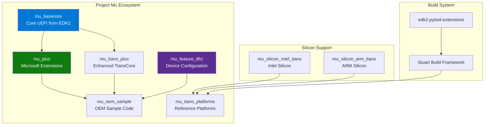

# Section B.1: Repository Structure

Project Mu uses a multi-repository architecture for technical separation and selective consumption.

---

## Core Repositories



---

## Repository Details

| Repository | Purpose | Content |
|:-----------|:--------|:--------|
| **mu_basecore** | Core UEFI guts forked from TianoCore | MdePkg, MdeModulePkg, BaseTools, SecurityPkg, CryptoPkg |
| **mu_plus** | Microsoft-contributed optional libraries | MsCorePkg, MsGraphicsPkg, DfciPkg, UefiTestingPkg |
| **mu_tiano_plus** | Enhanced TianoCore libraries | Optional modules from TianoCore with enhancements |
| **mu_feature_dfci** | Device Firmware Configuration Interface | Cloud-based firmware management |
| **mu_oem_sample** | Sample OEM implementation | Front page, boot manager examples |
| **mu_tiano_platforms** | Virtual platform firmware | QEMU Q35, ARM SBSA platforms |
| **mu_silicon_intel_tiano** | Intel silicon support | Intel-specific packages |
| **mu_silicon_arm_tiano** | ARM silicon support | ARM-specific packages |

---

## mu_basecore Structure

```
mu_basecore/
├── MdePkg/                 # Industry-standard definitions
│   ├── Include/
│   │   ├── Protocol/       # UEFI protocols
│   │   ├── Library/        # Library headers
│   │   ├── Guid/           # GUID definitions
│   │   └── Uefi/           # UEFI spec types
│   └── Library/            # Base libraries
├── MdeModulePkg/           # Core UEFI modules
│   ├── Core/               # DXE/PEI core
│   ├── Bus/                # Bus drivers
│   └── Universal/          # Universal drivers
├── UefiCpuPkg/             # CPU initialization
├── SecurityPkg/            # Security features
├── CryptoPkg/              # Cryptography
├── NetworkPkg/             # Network stack
├── FatPkg/                 # FAT filesystem
├── BaseTools/              # Build infrastructure
│   ├── Source/C/           # C tools
│   └── Source/Python/      # Python tools
└── .pytool/                # Stuart configuration
```

---

## mu_plus Structure (Microsoft Extensions)

```
mu_plus/
├── MsCorePkg/              # Microsoft core services
│   ├── Library/
│   │   ├── MathLib/        # Math operations
│   │   └── JsonLiteParserLib/
│   └── Universal/
├── MsGraphicsPkg/          # Graphics and UI
│   ├── Library/
│   │   ├── BootGraphicsLib/
│   │   └── SwmDialogsLib/
│   └── MsEarlyGraphics/
├── MsWheaPkg/              # WHEA (hardware errors)
├── DfciPkg/                # Device Firmware CI
├── UefiTestingPkg/         # Unit testing framework
├── XmlSupportPkg/          # XML parsing
├── PolicyServicePkg/       # Policy management
└── SetupDataPkg/           # Setup configuration
```

---

## Typical Platform Layout

```
my_platform/
├── .azurepipelines/              # Azure DevOps CI/CD
│   └── Platform-Build.yml
├── .github/
│   └── workflows/
│       └── build.yml             # GitHub Actions CI
├── .pytool/
│   ├── CISettings.py             # CI configuration
│   └── Plugin/                   # Custom plugins
├── Platforms/
│   └── MyPlatformPkg/
│       ├── MyPlatform.dsc        # Platform DSC
│       ├── MyPlatform.fdf        # Flash description
│       ├── PlatformBuild.py      # Stuart build config
│       ├── Library/              # Platform libraries
│       ├── Drivers/              # Platform drivers
│       └── Include/
├── Common/
│   ├── MU/                       # mu_plus submodule
│   └── TIANO/                    # mu_tiano_plus submodule
├── MU_BASECORE/                  # mu_basecore submodule
├── Silicon/
│   └── Vendor/
│       └── REF_CODE/             # Silicon vendor code
├── pip-requirements.txt          # Python dependencies
├── .gitmodules
└── readme.md
```

---

## Layering Philosophy

Project Mu enforces a rigid dependency hierarchy where each layer can only depend on layers below it:

```
┌─────────────────────────────────┐
│     Platform (Product)          │  ← Your specific product
├─────────────────────────────────┤
│      Silicon (Vendor)           │  ← Intel/AMD/ARM reference code
├─────────────────────────────────┤
│      Common (Features)          │  ← mu_plus, mu_tiano_plus
├─────────────────────────────────┤
│     Basecore (UEFI Core)        │  ← mu_basecore
└─────────────────────────────────┘
```

This enables controlled scope and predictable dependencies.

---

## Next Section

[B.2 Installation & Setup]()
