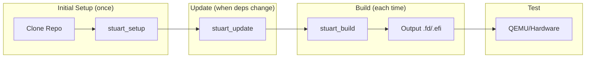

# Section B.3: Stuart Build System

Stuart is Project Mu's Python-based build framework that provides dependency management, build orchestration, CI/CD integration, and plugin architecture.

---

## Stuart Commands

| Command | Purpose | Usage |
|:--------|:--------|:------|
| `stuart_setup` | Initial setup, download dependencies | Run once after clone |
| `stuart_update` | Update dependencies, sync submodules | Run when dependencies change |
| `stuart_build` | Build the platform | Main build command |
| `stuart_ci_setup` | CI-specific setup | Used in CI pipelines |
| `stuart_ci_build` | CI build with tests | Includes unit tests and validation |

---

## Build Workflow



---

## Basic Build Commands

```bash
# Setup - download external dependencies
stuart_setup -c Platforms/QemuQ35Pkg/PlatformBuild.py

# Update - sync submodules, apply patches
stuart_update -c Platforms/QemuQ35Pkg/PlatformBuild.py

# Build - compile the platform
stuart_build -c Platforms/QemuQ35Pkg/PlatformBuild.py

# Build with specific options
stuart_build -c Platforms/QemuQ35Pkg/PlatformBuild.py \
    TOOL_CHAIN_TAG=GCC5 \
    TARGET=DEBUG

# Build specific architecture
stuart_build -c Platforms/QemuQ35Pkg/PlatformBuild.py \
    -a X64

# Build multiple architectures
stuart_build -c Platforms/QemuQ35Pkg/PlatformBuild.py \
    -a IA32,X64

# Clean build
stuart_build -c Platforms/QemuQ35Pkg/PlatformBuild.py --clean
```

---

## PlatformBuild.py Configuration

Every Mu platform requires a `PlatformBuild.py` file that defines build configuration:

```python
# PlatformBuild.py - Complete Example

import os
from pathlib import Path
from edk2toolext.invocables.edk2_platform_build import BuildSettingsManager
from edk2toolext.invocables.edk2_setup import SetupSettingsManager
from edk2toolext.invocables.edk2_update import UpdateSettingsManager
from edk2toolext.invocables.edk2_pr_eval import PrEvalSettingsManager
from edk2toollib.utility_functions import GetHostInfo

class PlatformBuilder(
    BuildSettingsManager,
    SetupSettingsManager,
    UpdateSettingsManager,
    PrEvalSettingsManager
):
    """Platform build configuration for My Platform."""

    def __init__(self):
        self.WorkspaceRoot = Path(__file__).parent.parent.parent.resolve()
        self.PackagesPath = None

    # =================== Repository Settings ===================

    def GetWorkspaceRoot(self):
        """Return workspace root directory."""
        return str(self.WorkspaceRoot)

    def GetPackagesPath(self):
        """Return list of package paths for dependency resolution."""
        if self.PackagesPath is None:
            self.PackagesPath = [
                str(self.WorkspaceRoot / "MU_BASECORE"),
                str(self.WorkspaceRoot / "Common" / "MU_TIANO"),
                str(self.WorkspaceRoot / "Common" / "MU"),
                str(self.WorkspaceRoot / "Platforms"),
            ]
        return self.PackagesPath

    def GetRequiredSubmodules(self):
        """Define git submodules required for build."""
        return [
            "MU_BASECORE",
            "Common/MU_TIANO",
            "Common/MU",
        ]

    # =================== Build Settings ===================

    def GetName(self):
        """Platform name."""
        return "MyPlatformPkg"

    def GetArchitecturesSupported(self):
        """Supported CPU architectures."""
        return ["IA32", "X64"]

    def GetTargetsSupported(self):
        """Supported build targets."""
        return ["DEBUG", "RELEASE", "NOOPT"]

    def GetPackagesSupported(self):
        """Packages this platform builds."""
        return ["MyPlatformPkg"]

    def GetActiveScopes(self):
        """Return list of build scopes."""
        scopes = ["myplatform", "edk2-build"]

        # Add toolchain-specific scope
        toolchain = self.env.GetValue("TOOL_CHAIN_TAG", "")
        if toolchain.startswith("GCC"):
            scopes.append("gcc")
        elif toolchain.startswith("VS"):
            scopes.append("vs")

        return scopes

    def GetDscName(self):
        """Platform DSC file path."""
        return "Platforms/MyPlatformPkg/MyPlatform.dsc"

    def GetFlashImageName(self):
        """Output flash image base name."""
        return "MYPLATFORM"

    # =================== Environment Settings ===================

    def SetPlatformEnv(self):
        """Set build environment variables."""
        self.env.SetValue("ACTIVE_PLATFORM", self.GetDscName(), "Platform")
        self.env.SetValue("TARGET_ARCH", "X64", "Platform Default")
        self.env.SetValue("TOOL_CHAIN_TAG", "GCC5", "Platform Default")
        self.env.SetValue("TARGET", "DEBUG", "Platform Default")

        # Build output directory
        self.env.SetValue(
            "BUILD_OUTPUT_BASE",
            str(self.WorkspaceRoot / "Build" / self.GetName()),
            "Platform"
        )

        return 0

    def GetBuildOutputDir(self):
        """Build output directory."""
        return str(self.WorkspaceRoot / "Build")

    # =================== Dependencies ===================

    def GetDependencies(self):
        """External dependencies (git repos, nuget, etc.)."""
        return [
            {
                "Path": "MU_BASECORE",
                "Url": "https://github.com/microsoft/mu_basecore.git",
                "Branch": "release/202402",
            },
            {
                "Path": "Common/MU_TIANO",
                "Url": "https://github.com/microsoft/mu_tiano_plus.git",
                "Branch": "release/202402",
            },
            {
                "Path": "Common/MU",
                "Url": "https://github.com/microsoft/mu_plus.git",
                "Branch": "release/202402",
            },
        ]

    # =================== Hooks ===================

    def PreBuildHook(self):
        """Actions before build starts."""
        print(f"Pre-build: Building {self.GetName()}")
        return 0

    def PostBuildHook(self):
        """Actions after build completes."""
        print("Post-build: Creating flash image...")
        # Custom flash image generation can go here
        return 0

    def GetLoggingFolderRelativeToRoot(self):
        """Logging folder location."""
        return "Build/Logs"


# Instantiate for stuart
__init__ = PlatformBuilder()
```

---

## Build Variables and Options

```bash
# Common build variables
stuart_build -c PlatformBuild.py \
    TOOL_CHAIN_TAG=GCC5 \       # GCC5, VS2019, VS2022, CLANGPDB
    TARGET=DEBUG \               # DEBUG, RELEASE, NOOPT
    -a X64 \                     # IA32, X64, AARCH64, ARM
    --clean \                    # Clean before build
    --verbose                    # Verbose output

# Environment variables
export STUART_PLATFORM=Platforms/MyPkg/PlatformBuild.py
export TOOL_CHAIN_TAG=GCC5
stuart_build -c $STUART_PLATFORM
```

---

## Key Configuration Methods

| Method | Purpose |
|:-------|:--------|
| `GetWorkspaceRoot()` | Returns workspace root directory |
| `GetPackagesPath()` | Returns list of package search paths |
| `GetRequiredSubmodules()` | Defines required git submodules |
| `GetDependencies()` | Defines external dependencies |
| `GetName()` | Platform name for identification |
| `GetDscName()` | Path to platform DSC file |
| `GetArchitecturesSupported()` | List of supported CPU architectures |
| `GetTargetsSupported()` | List of build targets (DEBUG, RELEASE) |
| `SetPlatformEnv()` | Sets environment variables for build |
| `PreBuildHook()` | Actions before build starts |
| `PostBuildHook()` | Actions after build completes |

---

## Next Section

[B.4 Unique Features]()
