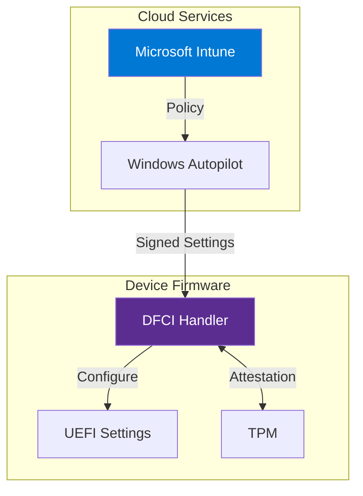

# Section B.4: Unique Features

Project Mu provides several unique features beyond standard EDK2 capabilities.

---

## 1. Device Firmware Configuration Interface (DFCI)

DFCI brings cloud-based, zero-touch UEFI management to enterprise devices.



### DFCI Capabilities

| Feature | Description |
|:--------|:------------|
| **Zero-touch management** | Configure firmware without physical access |
| **Secure channel** | Signed and encrypted communications |
| **Hardware settings** | Disable cameras, microphones, USB boot |
| **Malware resilience** | Settings enforced before OS boots |
| **Autopilot integration** | Uses existing device registration |

### Implementing DFCI Settings

```c
// Register a custom DFCI setting

#include <DfciSystemSettingTypes.h>
#include <Protocol/DfciSettingsProvider.h>

#define MY_SETTING_ID  L"OEM_MyCustomSetting"

// Setting getter callback
STATIC
EFI_STATUS
EFIAPI
MySettingGet (
    IN  CONST DFCI_SETTING_PROVIDER  *This,
    IN  OUT   UINTN                  *ValueSize,
    OUT       VOID                   *Value
    )
{
    BOOLEAN  *Setting = (BOOLEAN *)Value;

    if (*ValueSize < sizeof(BOOLEAN)) {
        *ValueSize = sizeof(BOOLEAN);
        return EFI_BUFFER_TOO_SMALL;
    }

    // Read current setting from variable or hardware
    *Setting = mMyFeatureEnabled;
    *ValueSize = sizeof(BOOLEAN);

    return EFI_SUCCESS;
}

// Setting setter callback
STATIC
EFI_STATUS
EFIAPI
MySettingSet (
    IN  CONST DFCI_SETTING_PROVIDER  *This,
    IN        UINTN                  ValueSize,
    IN  CONST VOID                   *Value,
    OUT       DFCI_SETTING_FLAGS     *Flags
    )
{
    BOOLEAN  NewValue;

    if (ValueSize != sizeof(BOOLEAN)) {
        return EFI_INVALID_PARAMETER;
    }

    NewValue = *(BOOLEAN *)Value;
    mMyFeatureEnabled = NewValue;

    // Persist to UEFI variable
    gRT->SetVariable(
        L"MyFeatureEnabled",
        &gMyFeatureGuid,
        EFI_VARIABLE_NON_VOLATILE | EFI_VARIABLE_BOOTSERVICE_ACCESS,
        sizeof(BOOLEAN),
        &mMyFeatureEnabled
    );

    *Flags = DFCI_SETTING_FLAGS_NONE;
    return EFI_SUCCESS;
}

// Register the setting
EFI_STATUS
RegisterMyDfciSetting (
    VOID
    )
{
    EFI_STATUS                   Status;
    DFCI_SETTING_PROVIDER        *Provider;
    DFCI_SETTING_PROVIDER_ENTRY  Entry;

    // Locate DFCI provider protocol
    Status = gBS->LocateProtocol(
        &gDfciSettingsProviderProtocolGuid,
        NULL,
        (VOID **)&Provider
    );
    if (EFI_ERROR(Status)) {
        return Status;
    }

    // Configure the setting entry
    ZeroMem(&Entry, sizeof(Entry));
    Entry.Id = MY_SETTING_ID;
    Entry.Type = DFCI_SETTING_TYPE_ENABLE;
    Entry.Flags = DFCI_SETTING_FLAGS_NO_PREBOOT_UI;
    Entry.GetSettingValue = MySettingGet;
    Entry.SetSettingValue = MySettingSet;
    Entry.GetDefaultValue = MySettingGetDefault;

    // Register with DFCI
    Status = Provider->RegisterProvider(Provider, &Entry);

    return Status;
}
```

---

## 2. Rust Support

Project Mu provides first-class Rust integration for memory-safe firmware development.

### Why Rust for UEFI?

| Benefit | Description |
|:--------|:------------|
| **Memory safety** | Prevents buffer overflows, use-after-free |
| **No garbage collection** | Suitable for firmware constraints |
| **Zero-cost abstractions** | Performance equivalent to C |
| **Modern tooling** | Cargo, clippy, rustfmt |
| **Interoperability** | Easy FFI with existing C code |

### Setting Up Rust Development

```bash
# Install Rust toolchain
curl --proto '=https' --tlsv1.2 -sSf https://sh.rustup.rs | sh

# Add UEFI targets
rustup target add x86_64-unknown-uefi
rustup target add i686-unknown-uefi
rustup target add aarch64-unknown-uefi

# Clone Mu Rust devops (includes development container)
git clone https://github.com/microsoft/mu_devops.git
```

### Rust UEFI Module Example

```rust
// RustHelloWorld.rs

#![no_std]
#![no_main]

extern crate alloc;

use core::panic::PanicInfo;
use r_efi::efi;

/// UEFI entry point
#[no_mangle]
pub extern "efiapi" fn efi_main(
    _image_handle: efi::Handle,
    system_table: *mut efi::SystemTable,
) -> efi::Status {
    let st = unsafe { &*system_table };
    let con_out = unsafe { &*st.con_out };

    // Print hello message
    let hello = "Hello from Rust UEFI!\r\n\0";
    let hello_wide: Vec<u16> = hello.encode_utf16().collect();

    unsafe {
        (con_out.output_string)(
            st.con_out,
            hello_wide.as_ptr() as *mut efi::Char16,
        );
    }

    efi::Status::SUCCESS
}

#[panic_handler]
fn panic(_info: &PanicInfo) -> ! {
    loop {}
}
```

### Rust Module INF File

```ini
# RustHelloWorld.inf

[Defines]
  INF_VERSION    = 0x00010005
  BASE_NAME      = RustHelloWorld
  FILE_GUID      = 12345678-1234-1234-1234-123456789ABC
  MODULE_TYPE    = UEFI_APPLICATION
  VERSION_STRING = 1.0
  ENTRY_POINT    = efi_main

[Sources]
  RustHelloWorld.rs

[Packages]
  MdePkg/MdePkg.dec
  MsCorePkg/MsCorePkg.dec

[BuildOptions]
  # Rust build flags
  *_*_*_RUST_FLAGS = --edition 2021 -Z build-std=core,alloc
```

---

## 3. Modern Front Page

Project Mu includes a touch-friendly, graphical UEFI setup interface.

```
┌─────────────────────────────────────────────────────────────┐
│  ╔═══════════════════════════════════════════════════════╗  │
│  ║           Device Configuration                        ║  │
│  ╠═══════════════════════════════════════════════════════╣  │
│  ║  [Boot Options]        [Security]        [System]     ║  │
│  ║                                                       ║  │
│  ║  ┌─────────────────────────────────────────────┐     ║  │
│  ║  │  Boot Sequence:                             │     ║  │
│  ║  │    1. Windows Boot Manager                  │     ║  │
│  ║  │    2. USB Storage Device                    │     ║  │
│  ║  │    3. Network Boot                          │     ║  │
│  ║  └─────────────────────────────────────────────┘     ║  │
│  ║                                                       ║  │
│  ║  [ Move Up ]  [ Move Down ]  [ Delete ]              ║  │
│  ║                                                       ║  │
│  ╚═══════════════════════════════════════════════════════╝  │
│           [Save]    [Discard]    [Reset to Defaults]        │
└─────────────────────────────────────────────────────────────┘
```

### Front Page Features

- **On-screen keyboard** for touch devices
- **Touch-friendly UI** with large buttons
- **Secure settings management** via DFCI
- **Modern HII implementation** with enhanced visuals
- **Accessibility features** for enterprise deployment

---

## 4. Unit Testing Framework

Project Mu includes comprehensive testing infrastructure using CMocka.

```c
// UnitTest example using CMocka

#include <Uefi.h>
#include <UnitTestFramework.h>

// Test: Verify addition function
UNIT_TEST_STATUS
EFIAPI
TestAddition (
    IN UNIT_TEST_CONTEXT  Context
    )
{
    INTN  Result;

    Result = MyAdd(2, 3);
    UT_ASSERT_EQUAL(Result, 5);

    Result = MyAdd(-1, 1);
    UT_ASSERT_EQUAL(Result, 0);

    return UNIT_TEST_PASSED;
}

// Test: Verify buffer handling
UNIT_TEST_STATUS
EFIAPI
TestBufferFunction (
    IN UNIT_TEST_CONTEXT  Context
    )
{
    UINT8   Buffer[10];
    UINTN   Size = sizeof(Buffer);

    // Should succeed
    UT_ASSERT_NOT_EFI_ERROR(MyBufferInit(Buffer, &Size));

    // Should fail with small buffer
    Size = 5;
    UT_ASSERT_STATUS_EQUAL(
        MyBufferInit(Buffer, &Size),
        EFI_BUFFER_TOO_SMALL
    );

    return UNIT_TEST_PASSED;
}

// Test suite setup
EFI_STATUS
EFIAPI
UefiTestMain (
    IN EFI_HANDLE        ImageHandle,
    IN EFI_SYSTEM_TABLE  *SystemTable
    )
{
    EFI_STATUS                  Status;
    UNIT_TEST_FRAMEWORK_HANDLE  Framework;
    UNIT_TEST_SUITE_HANDLE      Suite;

    // Create test framework
    Status = InitUnitTestFramework(
        &Framework,
        "My Library Tests",
        gEfiCallerBaseName,
        "1.0"
    );
    if (EFI_ERROR(Status)) {
        return Status;
    }

    // Create test suite
    Status = CreateUnitTestSuite(
        &Suite,
        Framework,
        "Core Function Tests",
        "MyLib.Core",
        NULL, NULL
    );

    // Add tests
    AddTestCase(Suite, "Addition", "TestAddition", TestAddition, NULL, NULL, NULL);
    AddTestCase(Suite, "Buffer", "TestBuffer", TestBufferFunction, NULL, NULL, NULL);

    // Run tests
    Status = RunAllTestSuites(Framework);

    // Cleanup
    FreeUnitTestFramework(Framework);

    return Status;
}
```

### Running Tests

```bash
# Run CI build with tests
stuart_ci_build -c Platforms/MyPkg/PlatformBuild.py

# Run specific test module
stuart_build -c PlatformBuild.py -m MyPkg/Test/MyLibTest.inf

# Host-based unit tests (runs on build machine)
python -m pytest Build/HostTests/ -v
```

---

## 5. Policy Service

Dynamic configuration management across firmware phases.

```c
// Using Policy Service for dynamic configuration

#include <Protocol/Policy.h>

// Define policy structure
typedef struct {
    BOOLEAN  FeatureEnabled;
    UINT32   FeatureLevel;
    UINT8    Configuration[32];
} MY_FEATURE_POLICY;

// Policy GUID
STATIC EFI_GUID gMyFeaturePolicyGuid = {
    0x12345678, 0x1234, 0x1234,
    { 0x12, 0x34, 0x56, 0x78, 0x9a, 0xbc, 0xde, 0xf0 }
};

// Get policy
EFI_STATUS
GetMyFeaturePolicy (
    OUT MY_FEATURE_POLICY  **Policy
    )
{
    EFI_STATUS       Status;
    POLICY_PROTOCOL  *PolicyProtocol;
    UINTN            PolicySize;

    Status = gBS->LocateProtocol(
        &gPolicyProtocolGuid,
        NULL,
        (VOID **)&PolicyProtocol
    );
    if (EFI_ERROR(Status)) {
        return Status;
    }

    PolicySize = sizeof(MY_FEATURE_POLICY);
    Status = PolicyProtocol->GetPolicy(
        &gMyFeaturePolicyGuid,
        NULL,
        (VOID **)Policy,
        &PolicySize
    );

    return Status;
}

// Set policy (typically done in PEI or early DXE)
EFI_STATUS
SetMyFeaturePolicy (
    IN MY_FEATURE_POLICY  *Policy
    )
{
    EFI_STATUS       Status;
    POLICY_PROTOCOL  *PolicyProtocol;

    Status = gBS->LocateProtocol(
        &gPolicyProtocolGuid,
        NULL,
        (VOID **)&PolicyProtocol
    );
    if (EFI_ERROR(Status)) {
        return Status;
    }

    Status = PolicyProtocol->SetPolicy(
        &gMyFeaturePolicyGuid,
        POLICY_ATTRIBUTE_FINALIZED,
        Policy,
        sizeof(MY_FEATURE_POLICY)
    );

    return Status;
}
```

---

## Next Section

[B.5 CI/CD Integration]()
