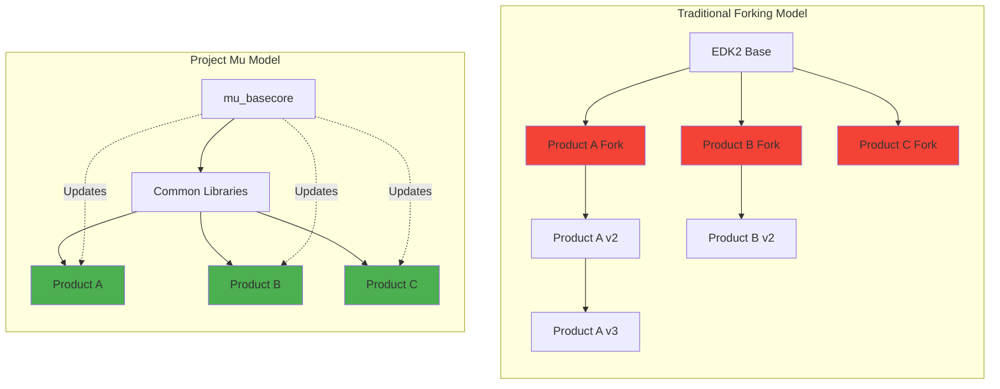
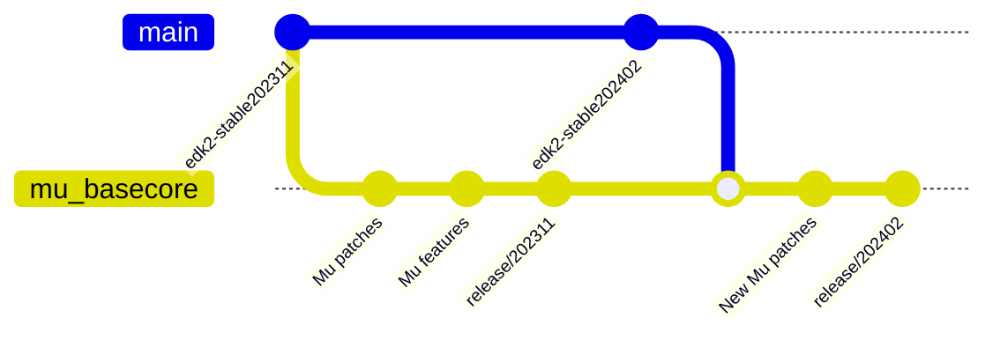

# Appendix B: Project Mu Complete Guide
{: .fs-9 }

Microsoft's modular UEFI firmware framework for scalable, maintainable, and secure firmware development.
{: .fs-6 .fw-300 }

---

## Chapter Overview

| Section | Topic | Focus |
|---------|-------|-------|
| [B.1](repository-structure/) | Repository Structure | Multi-repo architecture, package layouts |
| [B.2](installation-setup/) | Installation & Setup | Prerequisites, Stuart installation, first platform |
| [B.3](stuart-build/) | Stuart Build System | Commands, PlatformBuild.py, build workflow |
| [B.4](unique-features/) | Unique Features | DFCI, Rust support, Front Page, Unit Testing |
| [B.5](cicd/) | CI/CD Integration | Azure Pipelines, GitHub Actions templates |
| [B.6](qemu/) | Running on QEMU | Q35 and ARM SBSA platforms |
| [B.7](migration/) | Migration from EDK2 | Step-by-step migration guide |
| [B.8](troubleshooting/) | Troubleshooting & References | Common issues, examples, resources |

---

## Overview

### What is Project Mu?

**Project Mu** is Microsoft's open-source UEFI firmware implementation, released in December 2018. It is a modular adaptation of TianoCore's EDK2 designed for building modern devices using scalable, maintainable, and reusable patterns.

{: .important }
> **This is production code** - the same firmware that powers Microsoft Surface devices and Hyper-V. It's kept current because it must be to continue shipping products.

### Why Project Mu Exists

The firmware industry traditionally used a **"forking" model** - copy/paste/rename with each new product. This created unsustainable maintenance burdens where updates became nearly impossible due to cost and risk.



### Core Philosophy

Project Mu embraces:

| Principle | Description |
|:----------|:------------|
| **Firmware as a Service (FaaS)** | Fast, efficient firmware updates post-release |
| **Collaborative Development** | Shipping firmware is an ongoing collaboration between partners |
| **Modern Tooling** | GitHub issues, PRs, gated builds, CI/CD automation |
| **Multi-Repository Design** | Separate code by ownership while maintaining integration |
| **Less is More** | Include only necessary components, avoid unused code |

---

## Project Mu vs EDK2

### Key Differences

| Aspect | EDK2 (TianoCore) | Project Mu |
|:-------|:-----------------|:-----------|
| **Source** | Intel reference implementation | Microsoft fork of EDK2 |
| **Architecture** | Monolithic repository | Multi-repository, modular design |
| **Build System** | `build` command | Stuart (Python-based) |
| **Update Model** | Manual integration | Firmware as a Service (FaaS) |
| **Testing** | Basic | Strong emphasis on automated unit testing |
| **Rust Support** | Limited | First-class Rust integration |
| **CI/CD** | Manual setup | Built-in pipelines |
| **Dependencies** | Git submodules | pip packages + submodules |
| **Versioning** | Quarterly stable tags | Semantic versioning aligned with EDK2 |

### Relationship to EDK2

Project Mu follows EDK2's quarterly "stable tag" releases. A Mu release branch like `release/202405` is based on `edk2-stable202405`.



**Current Status (202502):**
- `mu_basecore` contains **266 commits** on top of edk2-stable202502
- `mu_tiano_plus` contains **58 commits** on top of edk2-stable202502

Relevant changes are contributed back to EDK2, though some Mu-specific changes remain in Mu only.

---

## Quick Start

```bash
# 1. Install Stuart
pip install edk2-pytool-library edk2-pytool-extensions

# 2. Clone a platform
git clone https://github.com/microsoft/mu_tiano_platforms.git
cd mu_tiano_platforms

# 3. Setup, update, and build
stuart_setup -c Platforms/QemuQ35Pkg/PlatformBuild.py
stuart_update -c Platforms/QemuQ35Pkg/PlatformBuild.py
stuart_build -c Platforms/QemuQ35Pkg/PlatformBuild.py TOOL_CHAIN_TAG=GCC5
```

---

{: .note }
> **Version Compatibility**: This guide is based on Project Mu release/202402. Commands and configurations may vary for different releases.
