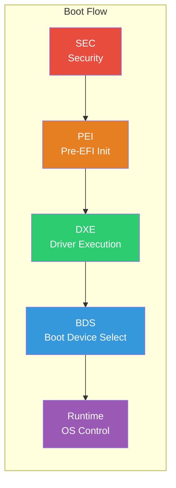

# UEFI Development Guide
{: .fs-9 }

A comprehensive tutorial for UEFI firmware development, from your first "Hello World" to advanced SMM drivers.
{: .fs-6 .fw-300 }

[Get Started](#getting-started){: .btn .btn-primary .fs-5 .mb-4 .mb-md-0 .mr-2 }
[View on GitHub](https://github.com/user/uefi-guide-tutorial){: .btn .fs-5 .mb-4 .mb-md-0 }

---

## What is UEFI?

**Unified Extensible Firmware Interface (UEFI)** is the modern firmware interface that has replaced legacy BIOS on most computers. It provides a standardized environment for booting operating systems and running pre-boot applications.



## Who is This Guide For?

This tutorial is designed for developers at all levels:

| Level | You Will Learn |
|:------|:---------------|
| **Beginner** | UEFI concepts, development environment setup, first UEFI application |
| **Intermediate** | Driver model, protocols, memory services, console and file I/O |
| **Advanced** | PEI/DXE internals, SMM, Secure Boot, TPM, ACPI, capsule updates |
| **Professional** | Complete projects: shell commands, boot menus, network apps, boot loaders |

## Getting Started

### Prerequisites

- Basic C programming knowledge
- Familiarity with command-line tools
- A computer running Windows, Linux, or macOS

### Quick Start

1. **[Set Up Your Environment](part1/02-environment-setup.html)** - Install EDK2, compilers, and QEMU
2. **[Build Hello World](part1/03-hello-world.html)** - Create your first UEFI application
3. **[Explore the Tutorials](part2/)** - Learn core UEFI concepts

## Tutorial Structure

<div class="code-example" markdown="1">

### Part 1: Getting Started
{: .text-delta }
UEFI introduction, development environment setup, and your first application.

### Part 2: Core Concepts
{: .text-delta }
Driver model, protocols, handles, memory services, and boot/runtime services.

### Part 3: Essential Services
{: .text-delta }
Console I/O, graphics (GOP), file systems, block I/O, networking, and UEFI variables.

### Part 4: Advanced Topics
{: .text-delta }
PEI phase, DXE internals, SMM, Secure Boot, TPM, ACPI, and firmware updates.

### Part 5: Practical Projects
{: .text-delta }
Complete implementations: shell commands, graphical boot menu, network tools, boot loader.

### Appendices
{: .text-delta }
EDK2 build system, Project Mu, debugging techniques, references, and glossary.

</div>

## Key Resources

| Resource | Description |
|:---------|:------------|
| [UEFI Specification](https://uefi.org/specifications) | Official UEFI specification documents |
| [EDK2 GitHub](https://github.com/tianocore/edk2) | TianoCore EDK2 source code |
| [Project Mu](https://microsoft.github.io/mu/) | Microsoft's UEFI core implementation |
| [UEFI Forum](https://uefi.org/) | Official UEFI standards organization |

## Code Examples

All code examples in this tutorial are:
- **Complete and buildable** - Every example compiles with EDK2
- **Tested in QEMU** - Verified to run in OVMF virtual environment
- **Well-documented** - Comments explain the key concepts
- **Available in the repository** - Full source in `examples/UefiGuidePkg/`

```c
// Your first UEFI application
#include <Uefi.h>
#include <Library/UefiLib.h>

EFI_STATUS
EFIAPI
UefiMain (
  IN EFI_HANDLE        ImageHandle,
  IN EFI_SYSTEM_TABLE  *SystemTable
  )
{
  Print(L"Hello, UEFI World!\n");
  return EFI_SUCCESS;
}
```

---

## About This Guide

This guide is maintained by the community and references:
- **UEFI Specification 2.10** (or later)
- **EDK2 Stable Tag**: `edk2-stable202311`
- **Project Mu**: Latest stable release

{: .note }
> Last updated: 2024. Content is verified against the EDK2 stable tag listed above.

---

<div class="d-flex flex-justify-around">
  <a href="part1/01-introduction.html" class="btn btn-primary">Start Learning →</a>
</div>
