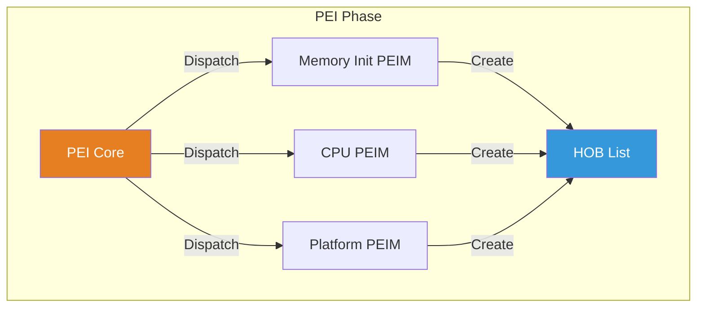
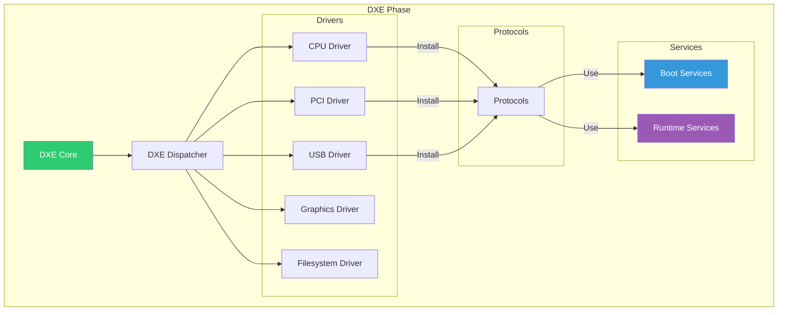
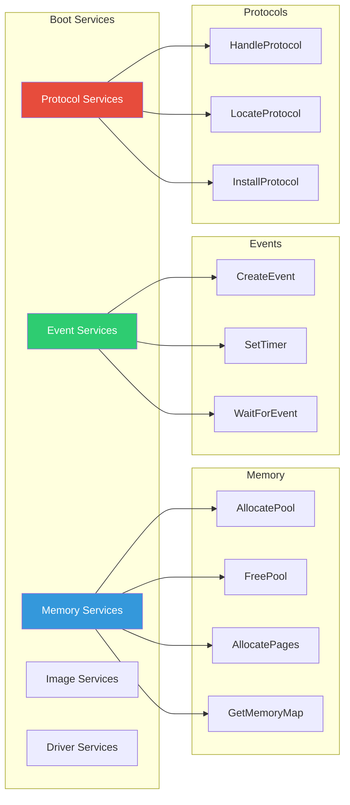

# Chapter 1: Introduction to UEFI
{: .fs-9 }

Understanding the Unified Extensible Firmware Interface architecture.
{: .fs-6 .fw-300 }

---

## Overview

### What is UEFI?

**UEFI (Unified Extensible Firmware Interface)** is a specification that defines the interface between an operating system and platform firmware. It replaces the legacy BIOS (Basic Input/Output System) that has been used since the IBM PC era.

UEFI provides:
- **Modern architecture**: 32-bit or 64-bit execution environment (not 16-bit real mode)
- **Modular design**: Drivers and applications can be loaded dynamically
- **Standardized interfaces**: Protocols for accessing hardware and services
- **Security features**: Secure Boot, measured boot, and authenticated variables
- **Rich pre-boot environment**: GUI support, networking, and file system access

### UEFI vs Legacy BIOS

| Feature | Legacy BIOS | UEFI |
|:--------|:------------|:-----|
| **Execution Mode** | 16-bit real mode | 32-bit or 64-bit protected mode |
| **Addressing** | 1 MB limit | Full memory access |
| **Partition Table** | MBR (2 TB limit) | GPT (9.4 ZB limit) |
| **Boot Process** | INT 19h, boot sector | Boot Manager, EFI applications |
| **Driver Model** | Option ROMs | UEFI drivers (portable) |
| **Extensibility** | Limited | Highly modular |
| **User Interface** | Text-based | GUI capable |
| **Security** | None built-in | Secure Boot, TPM integration |
| **Network Boot** | PXE only | HTTP Boot, iSCSI, etc. |

### Key Concepts

| Concept | Description |
|:--------|:------------|
| **Handle** | An opaque reference to a collection of related protocols |
| **Protocol** | A named interface (GUID) providing specific functionality |
| **GUID** | 128-bit Globally Unique Identifier for protocols and variables |
| **Boot Services** | Functions available before ExitBootServices() |
| **Runtime Services** | Functions available to the OS after boot |
| **Driver** | Code that provides services via protocols |
| **Application** | Standalone executable that runs and exits |

---

## UEFI Boot Stages

The UEFI boot process consists of several distinct phases, each with specific responsibilities and available services.

```mermaid
flowchart TB
    subgraph SEC [SEC Phase - Security]
        S1[Power On / Reset]
        S2[CPU Microcode]
        S3[Cache-as-RAM Setup]
        S4[Trust Initialization]
    end

    subgraph PEI [PEI Phase - Pre-EFI Initialization]
        P1[PEI Core]
        P2[PEIMs Execute]
        P3[Memory Init]
        P4[Recovery Check]
        P5[S3 Resume Check]
    end

    subgraph DXE [DXE Phase - Driver Execution Environment]
        D1[DXE Core]
        D2[DXE Dispatcher]
        D3[Driver Loading]
        D4[Protocol Installation]
        D5[Boot & Runtime Services]
    end

    subgraph BDS [BDS Phase - Boot Device Selection]
        B1[BDS Core]
        B2[Console Init]
        B3[Boot Options]
        B4[OS Loader]
    end

    subgraph TSL [TSL - Transient System Load]
        T1[OS Loader Runs]
        T2[ExitBootServices]
    end

    subgraph RT [Runtime Phase]
        R1[OS Control]
        R2[Runtime Services Only]
    end

    SEC --> PEI
    PEI --> DXE
    DXE --> BDS
    BDS --> TSL
    TSL --> RT

    style SEC fill:#e74c3c,color:#fff
    style PEI fill:#e67e22,color:#fff
    style DXE fill:#2ecc71,color:#fff
    style BDS fill:#3498db,color:#fff
    style TSL fill:#9b59b6,color:#fff
    style RT fill:#34495e,color:#fff
```

### SEC Phase (Security)

**Purpose**: Establish the root of trust and prepare the environment for PEI.

**Characteristics**:
- Runs from reset vector (typically at 0xFFFFFFF0)
- Executes in place from flash (no RAM yet)
- Sets up temporary memory using Cache-as-RAM (CAR)
- Initializes basic CPU state
- Verifies PEI core integrity (if Secure Boot enabled)

**Services Available**: None (assembly code, no API)

### PEI Phase (Pre-EFI Initialization)

**Purpose**: Initialize permanent memory and prepare the system for DXE.

**Characteristics**:
- Runs with limited memory (CAR only initially)
- Executes PEI Modules (PEIMs)
- Uses PPI (PEIM-to-PEIM Interface) for communication
- Initializes main memory (DRAM)
- Creates Hand-Off Blocks (HOBs) for DXE

**Services Available**: PEI Services (limited set)

| PEI Service | Description |
|:------------|:------------|
| `InstallPpi` | Install a PEIM-to-PEIM Interface |
| `LocatePpi` | Find a PPI by GUID |
| `NotifyPpi` | Register for PPI installation notification |
| `GetBootMode` | Get current boot mode (normal, recovery, S3) |
| `CreateHob` | Create a Hand-Off Block for DXE |

### DXE Phase (Driver Execution Environment)

**Purpose**: Load drivers, initialize the full platform, and provide boot services.

**Characteristics**:
- Full memory available
- Executes DXE drivers and UEFI drivers
- Uses Protocol model for communication
- Provides Boot Services and Runtime Services
- Most UEFI applications run here

**Services Available**: Full Boot Services and Runtime Services

### BDS Phase (Boot Device Selection)

**Purpose**: Initialize consoles, process boot options, and launch OS loader.

**Characteristics**:
- Console devices initialized (keyboard, display)
- Boot options processed (BootOrder variable)
- User interface available
- OS loader selected and executed

**Services Available**: Full Boot Services and Runtime Services

### TSL (Transient System Load)

**Purpose**: OS loader prepares to take control.

**Characteristics**:
- OS loader runs as UEFI application
- Gets memory map
- Loads kernel and initrd
- Calls `ExitBootServices()`

### Runtime Phase

**Purpose**: OS has control; limited firmware services remain.

**Characteristics**:
- Boot Services no longer available
- Only Runtime Services accessible
- Virtual addressing may be used

---

## Services Activation by Phase

This table shows which services are available during each boot phase:

| Service Category | SEC | PEI | DXE | BDS | TSL | Runtime |
|:-----------------|:---:|:---:|:---:|:---:|:---:|:-------:|
| **PEI Services** | - | ✓ | - | - | - | - |
| **Boot Services** | - | - | ✓ | ✓ | ✓ | - |
| **Runtime Services** | - | - | ✓ | ✓ | ✓ | ✓ |
| **Protocols** | - | PPI | ✓ | ✓ | ✓ | - |
| **Memory Allocation** | - | Limited | ✓ | ✓ | ✓ | - |
| **Console I/O** | - | - | ✓ | ✓ | ✓ | - |
| **File System** | - | - | ✓ | ✓ | ✓ | - |
| **Network** | - | - | ✓ | ✓ | ✓ | - |
| **Variables** | - | HOB | ✓ | ✓ | ✓ | ✓ |

### Boot Services (DXE and later)

Boot Services are available from DXE phase until `ExitBootServices()` is called:

### Runtime Services (Always Available After DXE)

Runtime Services survive `ExitBootServices()` and are available to the OS:

| Service | Description |
|:--------|:------------|
| `GetTime` / `SetTime` | RTC access |
| `GetVariable` / `SetVariable` | UEFI variable access |
| `GetNextVariableName` | Enumerate variables |
| `ResetSystem` | System reset/shutdown |
| `GetNextHighMonotonicCount` | Monotonic counter |
| `UpdateCapsule` | Firmware update |
| `QueryVariableInfo` | Variable storage info |

---

## UEFI Specification Reference

- **UEFI Specification**: [https://uefi.org/specifications](https://uefi.org/specifications)
  - Chapter 1: Introduction
  - Chapter 2: Overview
  - Chapter 4: EFI System Table
  - Chapter 7: Services - Boot Services
  - Chapter 8: Services - Runtime Services

- **PI Specification**: [https://uefi.org/specifications](https://uefi.org/specifications)
  - Volume 1: PEI
  - Volume 2: DXE
  - Volume 4: SMM

---

## Summary

1. **UEFI replaces legacy BIOS** with a modern, extensible firmware interface
2. **Boot progresses through phases**: SEC → PEI → DXE → BDS → Runtime
3. **Each phase has specific services**: PEI Services, Boot Services, Runtime Services
4. **Protocols provide functionality**: Hardware access through standardized interfaces
5. **ExitBootServices is the transition point**: From firmware control to OS control

---

## Glossary

| Term | Definition |
|:-----|:-----------|
| **UEFI** | Unified Extensible Firmware Interface |
| **PI** | Platform Initialization (Intel specification) |
| **SEC** | Security phase - first code after reset |
| **PEI** | Pre-EFI Initialization phase |
| **PEIM** | PEI Module |
| **PPI** | PEIM-to-PEIM Interface |
| **DXE** | Driver Execution Environment |
| **BDS** | Boot Device Selection |
| **HOB** | Hand-Off Block (PEI to DXE data) |
| **GUID** | Globally Unique Identifier (128-bit) |
| **Handle** | Reference to protocol collection |
| **Protocol** | Named interface providing functionality |
| **CAR** | Cache-as-RAM (temporary memory before DRAM) |
| **NVRAM** | Non-Volatile RAM for variables |

---

## Next Steps

- [Chapter 2: Environment Setup]() - Set up your development environment
- [Chapter 3: Hello World]() - Build your first UEFI application

---

{: .note }
> **UEFI Spec Version**: This guide references UEFI Specification 2.10 and PI Specification 1.8.
> Always check the latest specification for updates.
