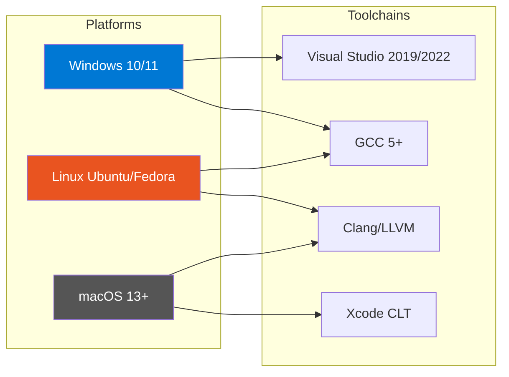

# Chapter 2: Environment Setup
{: .fs-9 }

Configure your development environment for UEFI firmware development.
{: .fs-6 .fw-300 }

---

## Overview

### What You Need

To develop UEFI applications and drivers, you need:

| Component | Purpose |
|:----------|:--------|
| **EDK2** | TianoCore UEFI development kit (source code) |
| **Compiler** | GCC, Clang, or Visual Studio |
| **Python 3** | Build system scripts |
| **NASM** | Assembly compiler |
| **IASL** | ACPI compiler |
| **QEMU + OVMF** | Virtual machine for testing |

### Platform Support



---

## Windows Setup

### Overview

Windows development uses Visual Studio as the primary compiler with additional tools for assembly and ACPI compilation.

**Required Components:**
- Visual Studio 2019 or 2022 (Community edition works)
- Python 3.8+
- NASM 2.15+
- IASL (from ACPICA)
- Git for Windows

### Initialization

#### Step 1: Install Visual Studio

1. Download [Visual Studio 2022 Community](https://visualstudio.microsoft.com/downloads/)
2. Run the installer and select these workloads:
   - **Desktop development with C++**
   - **Windows 10/11 SDK** (latest version)

3. In "Individual components", ensure these are selected:
   - MSVC v143 build tools (x64/x86)
   - Windows 10/11 SDK
   - C++ CMake tools

#### Step 2: Install Python

```powershell
# Download from python.org or use winget
winget install Python.Python.3.11

# Verify installation
python --version
pip --version
```

#### Step 3: Install NASM

```powershell
# Download NASM from https://www.nasm.us/
# Or use Chocolatey
choco install nasm

# Add to PATH (if not automatic)
# Default: C:\Program Files\NASM
```

#### Step 4: Install IASL

```powershell
# Download from https://acpica.org/downloads
# Extract iasl.exe to a directory in PATH
# Recommended: C:\ASL\

# Verify
iasl -v
```

#### Step 5: Install Git

```powershell
winget install Git.Git

# Configure
git config --global core.autocrlf false
git config --global core.longpaths true
```

### Configuration

#### Environment Variables

Add to your System PATH:
```
C:\Program Files\NASM
C:\ASL
C:\Python311
C:\Python311\Scripts
```

#### EDK2 Build Configuration

Create/edit `Conf/target.txt` after running `edksetup.bat`:

```ini
ACTIVE_PLATFORM       = UefiGuidePkg/UefiGuidePkg.dsc
TARGET                = DEBUG
TARGET_ARCH           = X64
TOOL_CHAIN_CONF       = Conf/tools_def.txt
TOOL_CHAIN_TAG        = VS2019
MAX_CONCURRENT_THREAD_NUMBER = 0
```

### Porting Guide

#### Using GCC on Windows (WSL2)

For GCC-based development on Windows, use WSL2:

```powershell
# Install WSL2
wsl --install -d Ubuntu-22.04

# Then follow Linux setup instructions inside WSL
```

#### CI/CD Integration

For GitHub Actions on Windows:

```yaml
- name: Setup EDK2
  run: |
    git clone https://github.com/tianocore/edk2.git
    cd edk2
    git submodule update --init
    edksetup.bat Rebuild
```

---

## Linux Setup

### Overview

Linux is the recommended development platform for EDK2. GCC provides excellent compilation support.

**Supported Distributions:**
- Ubuntu 22.04 LTS, 24.04 LTS
- Fedora 38+
- Debian 12+

### Initialization

#### Ubuntu/Debian

```bash
# Update system
sudo apt update && sudo apt upgrade -y

# Install build essentials
sudo apt install -y \
    build-essential \
    git \
    python3 \
    python3-pip \
    python3-venv \
    uuid-dev \
    nasm \
    iasl \
    gcc-12 \
    g++-12 \
    make \
    qemu-system-x86

# Set GCC 12 as default (if multiple versions)
sudo update-alternatives --install /usr/bin/gcc gcc /usr/bin/gcc-12 100
sudo update-alternatives --install /usr/bin/g++ g++ /usr/bin/g++-12 100

# Verify installations
gcc --version
nasm -v
iasl -v
python3 --version
```

#### Fedora

```bash
# Install dependencies
sudo dnf install -y \
    @development-tools \
    git \
    python3 \
    python3-pip \
    libuuid-devel \
    nasm \
    acpica-tools \
    gcc \
    gcc-c++ \
    make \
    qemu-system-x86

# Verify
gcc --version
nasm -v
iasl -v
```

### Configuration

#### Shell Environment

Add to `~/.bashrc` or `~/.zshrc`:

```bash
# EDK2 Workspace
export EDK2_WORKSPACE="$HOME/edk2"
export PACKAGES_PATH="$EDK2_WORKSPACE"

# EDK2 setup alias
alias edk2setup='source $EDK2_WORKSPACE/edksetup.sh'

# Build shortcuts
alias edk2build='build -p UefiGuidePkg/UefiGuidePkg.dsc -a X64 -t GCC5 -b DEBUG'
```

#### EDK2 target.txt

```ini
ACTIVE_PLATFORM       = UefiGuidePkg/UefiGuidePkg.dsc
TARGET                = DEBUG
TARGET_ARCH           = X64
TOOL_CHAIN_CONF       = Conf/tools_def.txt
TOOL_CHAIN_TAG        = GCC5
MAX_CONCURRENT_THREAD_NUMBER = 0
```

### Porting Guide

#### Distribution Differences

| Distribution | Package Manager | GCC Package | Notes |
|:-------------|:----------------|:------------|:------|
| Ubuntu/Debian | apt | gcc-12 | Use `build-essential` |
| Fedora | dnf | gcc | Use `@development-tools` |
| Arch | pacman | gcc | `base-devel` group |
| openSUSE | zypper | gcc | `devel_basis` pattern |

#### Cross-Compilation for ARM64

```bash
# Install ARM64 cross-compiler
sudo apt install gcc-aarch64-linux-gnu

# Build for ARM64
build -a AARCH64 -t GCC5 -p UefiGuidePkg/UefiGuidePkg.dsc
```

---

## macOS Setup

### Overview

macOS development requires Xcode Command Line Tools and Homebrew for additional packages.

**Requirements:**
- macOS 13 (Ventura) or later
- Xcode Command Line Tools
- Homebrew

### Initialization

#### Step 1: Xcode Command Line Tools

```bash
# Install Xcode CLT
xcode-select --install

# Verify
clang --version
```

#### Step 2: Install Homebrew

```bash
# Install Homebrew
/bin/bash -c "$(curl -fsSL https://raw.githubusercontent.com/Homebrew/install/HEAD/install.sh)"

# Add to PATH (follow installer instructions)
echo 'eval "$(/opt/homebrew/bin/brew shellenv)"' >> ~/.zshrc
source ~/.zshrc
```

#### Step 3: Install Dependencies

```bash
# Install required packages
brew install \
    python@3.11 \
    nasm \
    acpica \
    qemu \
    mtoc

# Verify
nasm -v
iasl -v
python3 --version
```

### Configuration

#### Shell Environment

Add to `~/.zshrc`:

```bash
# EDK2 Workspace
export EDK2_WORKSPACE="$HOME/edk2"
export PACKAGES_PATH="$EDK2_WORKSPACE"

# Python path
export PATH="/opt/homebrew/opt/python@3.11/bin:$PATH"

# EDK2 setup
alias edk2setup='source $EDK2_WORKSPACE/edksetup.sh'
```

#### EDK2 target.txt

```ini
ACTIVE_PLATFORM       = UefiGuidePkg/UefiGuidePkg.dsc
TARGET                = DEBUG
TARGET_ARCH           = X64
TOOL_CHAIN_CONF       = Conf/tools_def.txt
TOOL_CHAIN_TAG        = XCODE5
MAX_CONCURRENT_THREAD_NUMBER = 0
```

### Porting Guide

#### Apple Silicon (M1/M2/M3) Considerations

On Apple Silicon Macs:
- Native builds produce ARM64 binaries by default
- Use Rosetta 2 for x86_64 tools if needed
- QEMU supports both x86_64 emulation and native ARM64

```bash
# Install Rosetta 2 (if needed for x86 tools)
softwareupdate --install-rosetta

# Build for x86_64 (cross-compile)
build -a X64 -t XCODE5 -p UefiGuidePkg/UefiGuidePkg.dsc

# Build for ARM64 (native on Apple Silicon)
build -a AARCH64 -t XCODE5 -p UefiGuidePkg/UefiGuidePkg.dsc
```

#### Intel Mac Notes

On Intel Macs, X64 builds are native. No special configuration needed.

---

## EDK2 Setup

### Overview

EDK2 (EFI Development Kit II) is the reference implementation of UEFI from TianoCore.

**Repository Structure:**
```
edk2/
├── MdePkg/           # Industry-standard headers and libraries
├── MdeModulePkg/     # Core UEFI modules
├── OvmfPkg/          # QEMU/OVMF virtual platform
├── ShellPkg/         # UEFI Shell
├── NetworkPkg/       # Network stack
├── SecurityPkg/      # Security features
├── BaseTools/        # Build infrastructure
└── Conf/             # Build configuration
```

### Initialization

#### Clone EDK2

```bash
# Clone the repository
git clone https://github.com/tianocore/edk2.git
cd edk2

# Checkout stable tag (recommended)
git checkout edk2-stable202311

# Initialize submodules
git submodule update --init --recursive
```

#### Build BaseTools

```bash
# Linux/macOS
make -C BaseTools

# Windows (in VS Developer Command Prompt)
edksetup.bat Rebuild
```

#### Initialize Build Environment

```bash
# Linux/macOS
source edksetup.sh

# Windows
edksetup.bat
```

### Configuration

#### Conf/target.txt

After running edksetup, edit `Conf/target.txt`:

```ini
# Active platform to build
ACTIVE_PLATFORM       = OvmfPkg/OvmfPkgX64.dsc

# Build target (DEBUG, RELEASE, NOOPT)
TARGET                = DEBUG

# Architecture (IA32, X64, AARCH64, RISCV64)
TARGET_ARCH           = X64

# Toolchain
TOOL_CHAIN_TAG        = GCC5        # Linux
# TOOL_CHAIN_TAG      = VS2019      # Windows
# TOOL_CHAIN_TAG      = XCODE5      # macOS

# Parallel build (0 = auto-detect CPU count)
MAX_CONCURRENT_THREAD_NUMBER = 0
```

#### Build OVMF (for testing)

```bash
# Build OVMF firmware for QEMU
build -p OvmfPkg/OvmfPkgX64.dsc -a X64 -t GCC5 -b DEBUG

# Output location
ls Build/OvmfX64/DEBUG_GCC5/FV/OVMF*.fd
```

### Porting Guide

#### Stable Tags vs Main Branch

| Approach | Pros | Cons |
|:---------|:-----|:-----|
| **Stable Tag** | Tested, documented, reproducible | May lack newest features |
| **Main Branch** | Latest features | May have breaking changes |

**Recommendation:** Use stable tags for tutorials and learning.

```bash
# List available stable tags
git tag | grep edk2-stable

# Switch to a stable tag
git checkout edk2-stable202311
git submodule update --init --recursive
```

---

## Project Mu Setup

### Overview

[Project Mu](https://microsoft.github.io/mu/) is Microsoft's fork of UEFI core, used in Surface devices and other products.

**Key Differences from EDK2:**
- Multi-repository architecture
- Stuart build system (Python-based)
- Additional security features
- CI/CD focused

### Initialization

#### Install Stuart

```bash
# Create virtual environment (recommended)
python3 -m venv mu_venv
source mu_venv/bin/activate  # Linux/macOS
# mu_venv\Scripts\activate   # Windows

# Install stuart
pip install --upgrade edk2-pytool-extensions
```

#### Clone a Mu Platform

```bash
# Example: Clone Mu Tiano Platforms
git clone https://github.com/microsoft/mu_tiano_platforms.git
cd mu_tiano_platforms

# Checkout stable release
git checkout release/202311
```

#### Setup and Update

```bash
# Download dependencies
stuart_setup -c Platforms/QemuQ35Pkg/PlatformBuild.py

# Update (fetch external dependencies)
stuart_update -c Platforms/QemuQ35Pkg/PlatformBuild.py
```

### Configuration

#### Platform Build Configuration

Each Mu platform has a `PlatformBuild.py` file:

```python
# Example configuration options
stuart_build -c Platforms/QemuQ35Pkg/PlatformBuild.py \
    TOOL_CHAIN_TAG=GCC5 \
    TARGET=DEBUG \
    -a X64
```

#### Environment Variables

```bash
export STUART_PLATFORM=Platforms/QemuQ35Pkg/PlatformBuild.py
export TOOL_CHAIN_TAG=GCC5
```

### Porting Guide

#### EDK2 to Mu Migration

| EDK2 | Project Mu |
|:-----|:-----------|
| `source edksetup.sh` | `stuart_setup` |
| `build` command | `stuart_build` |
| `Conf/target.txt` | `PlatformBuild.py` |
| Manual submodules | Automatic dependency management |

---

## VS Code Setup

### Overview

Visual Studio Code provides excellent support for UEFI development with the right extensions.

### Recommended Extensions

| Extension | Purpose |
|:----------|:--------|
| **C/C++** (Microsoft) | IntelliSense, debugging |
| **EditorConfig** | Consistent formatting |
| **GitLens** | Git integration |
| **Hex Editor** | Binary file viewing |

#### Install Extensions

```bash
code --install-extension ms-vscode.cpptools
code --install-extension EditorConfig.EditorConfig
code --install-extension eamodio.gitlens
code --install-extension ms-vscode.hexeditor
```

### Configuration

#### c_cpp_properties.json

Create `.vscode/c_cpp_properties.json` in your workspace:

```json
{
    "configurations": [
        {
            "name": "EDK2",
            "includePath": [
                "${workspaceFolder}/**",
                "${env:EDK2_WORKSPACE}/MdePkg/Include/**",
                "${env:EDK2_WORKSPACE}/MdeModulePkg/Include/**"
            ],
            "defines": [
                "EFIAPI=__attribute__((ms_abi))"
            ],
            "compilerPath": "/usr/bin/gcc",
            "cStandard": "c11",
            "intelliSenseMode": "linux-gcc-x64"
        }
    ],
    "version": 4
}
```

#### tasks.json

Create `.vscode/tasks.json` for build tasks:

```json
{
    "version": "2.0.0",
    "tasks": [
        {
            "label": "EDK2 Build",
            "type": "shell",
            "command": "source ${env:EDK2_WORKSPACE}/edksetup.sh && build",
            "group": {
                "kind": "build",
                "isDefault": true
            },
            "problemMatcher": {
                "pattern": {
                    "regexp": "^(.*):(\\d+):(\\d+): (error|warning): (.*)$",
                    "file": 1,
                    "line": 2,
                    "column": 3,
                    "severity": 4,
                    "message": 5
                }
            }
        }
    ]
}
```

---

## QEMU/OVMF Setup

### Overview

QEMU with OVMF firmware allows testing UEFI applications without physical hardware.

### Initialization

#### Install QEMU

```bash
# Ubuntu/Debian
sudo apt install qemu-system-x86 ovmf

# Fedora
sudo dnf install qemu-system-x86 edk2-ovmf

# macOS
brew install qemu

# Windows (use installer from qemu.org)
```

#### Locate OVMF Firmware

```bash
# Ubuntu/Debian
ls /usr/share/OVMF/
# OVMF_CODE.fd, OVMF_VARS.fd

# Fedora
ls /usr/share/edk2/ovmf/
# OVMF_CODE.fd, OVMF_VARS.fd

# Or build from EDK2
build -p OvmfPkg/OvmfPkgX64.dsc -a X64 -t GCC5 -b DEBUG
```

### Configuration

#### Basic QEMU Launch

```bash
qemu-system-x86_64 \
    -machine q35 \
    -m 256M \
    -drive if=pflash,format=raw,readonly=on,file=/usr/share/OVMF/OVMF_CODE.fd \
    -drive if=pflash,format=raw,file=OVMF_VARS.fd \
    -drive format=raw,file=fat:rw:./hda-contents \
    -serial stdio \
    -nographic
```

#### With Debugging Support

```bash
qemu-system-x86_64 \
    -machine q35 \
    -m 256M \
    -drive if=pflash,format=raw,readonly=on,file=/usr/share/OVMF/OVMF_CODE.fd \
    -serial stdio \
    -s -S  # GDB server on localhost:1234, pause at start
```

---

## Environment Verification

### Verification Procedure

Run these commands to verify your setup:

```bash
# 1. Check EDK2 environment
echo $EDK2_WORKSPACE
echo $PACKAGES_PATH

# 2. Check compilers
gcc --version       # or cl.exe on Windows
nasm -v
iasl -v
python3 --version

# 3. Build a test application
source edksetup.sh  # or edksetup.bat on Windows
build -p MdeModulePkg/MdeModulePkg.dsc -m MdeModulePkg/Application/HelloWorld/HelloWorld.inf -a X64 -t GCC5 -b DEBUG

# 4. Verify output exists
ls Build/MdeModule/DEBUG_GCC5/X64/HelloWorld.efi

# 5. Test in QEMU
# (See QEMU setup section)
```

### Expected Output

```
Build environment:
  EDK2_WORKSPACE=/home/user/edk2
  PACKAGES_PATH=/home/user/edk2

Compiler versions:
  gcc (Ubuntu 12.3.0) 12.3.0
  NASM version 2.16.01
  ASL+ Optimizing Compiler/Disassembler version 20230628
  Python 3.11.4

Build result:
  Build/MdeModule/DEBUG_GCC5/X64/HelloWorld.efi (created)
```

### Troubleshooting

| Issue | Solution |
|:------|:---------|
| `build: command not found` | Run `source edksetup.sh` first |
| `NASM not found` | Install NASM and add to PATH |
| `IASL not found` | Install ACPICA tools |
| `Python not found` | Install Python 3.8+ |
| `GCC5 not supported` | Check GCC version (need 5.0+) |

---

## Summary

1. **Choose your platform**: Windows, Linux, or macOS
2. **Install prerequisites**: Compiler, Python, NASM, IASL
3. **Clone EDK2**: Use a stable tag
4. **Configure environment**: Set up target.txt
5. **Verify setup**: Build and run a test application
6. **Set up QEMU**: For testing without hardware

---

## Next Steps

- [Chapter 3: Hello World](03-hello-world.md) - Build your first UEFI application

---

{: .note }
> **EDK2 Version**: This guide uses `edk2-stable202311`. Adjust commands for your chosen version.
