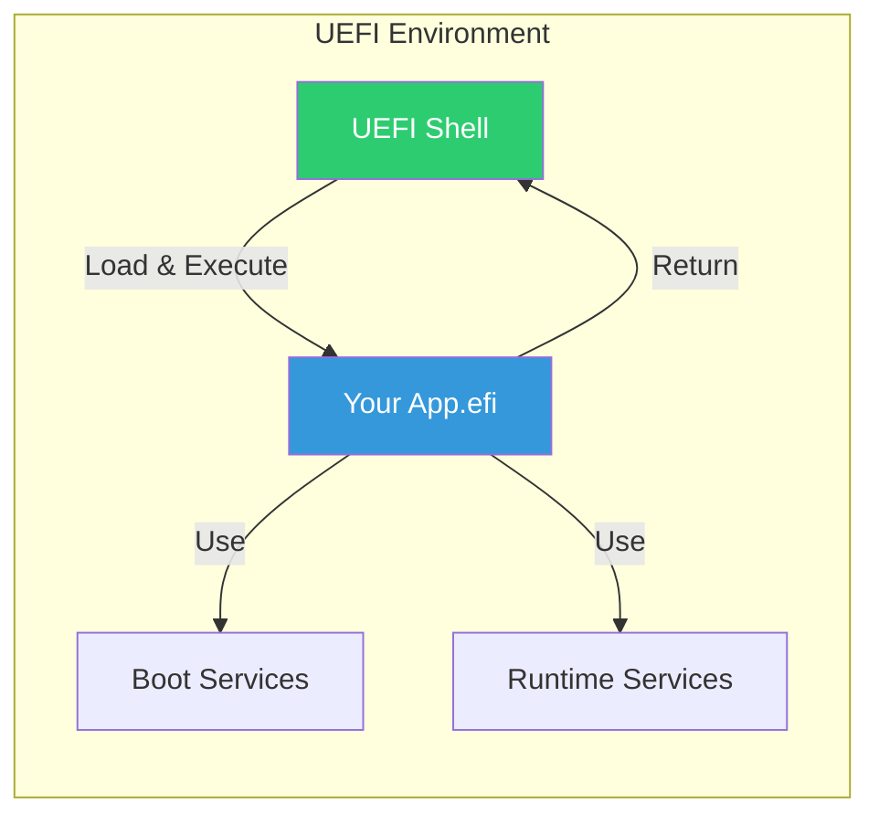
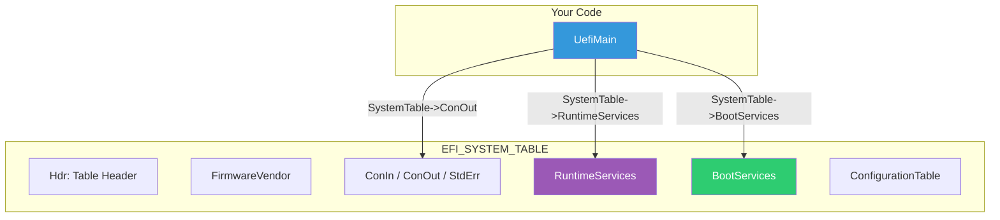

# Chapter 3: Hello World
{: .fs-9 }

Build and run your first UEFI application.
{: .fs-6 .fw-300 }

---

## Overview

### What is a UEFI Application?

A **UEFI Application** is a standalone executable that:
- Runs in the UEFI pre-boot environment
- Has access to Boot Services and Runtime Services
- Executes and then returns control to the caller (typically UEFI Shell or Boot Manager)
- Uses the `.efi` file extension



### Application vs Driver

| Aspect | Application | Driver |
|:-------|:------------|:-------|
| **Lifecycle** | Runs and exits | Stays resident |
| **Entry Point** | `UefiMain` | `DriverEntryPoint` |
| **Purpose** | One-time task | Provide services |
| **Memory** | Released on exit | Persists |
| **MODULE_TYPE** | `UEFI_APPLICATION` | `UEFI_DRIVER` or `DXE_DRIVER` |

### Hello World Structure

Our Hello World application will:
1. Receive the Image Handle and System Table
2. Print "Hello, UEFI World!" to the console
3. Return `EFI_SUCCESS`

---

## Initialization

### Entry Point: UefiMain

Every UEFI application has an entry point function. By convention, it's called `UefiMain`:

```c
EFI_STATUS
EFIAPI
UefiMain (
  IN EFI_HANDLE        ImageHandle,
  IN EFI_SYSTEM_TABLE  *SystemTable
  )
```

#### Parameters

| Parameter | Type | Description |
|:----------|:-----|:------------|
| `ImageHandle` | `EFI_HANDLE` | Handle for this loaded image |
| `SystemTable` | `EFI_SYSTEM_TABLE*` | Pointer to the UEFI System Table |

#### Return Value

| Return | Meaning |
|:-------|:--------|
| `EFI_SUCCESS` | Application completed successfully |
| Other `EFI_STATUS` | Error occurred |

### The System Table

The `EFI_SYSTEM_TABLE` is your gateway to UEFI services:



### Key System Table Members

```c
struct EFI_SYSTEM_TABLE {
    EFI_TABLE_HEADER                  Hdr;
    CHAR16                            *FirmwareVendor;
    UINT32                            FirmwareRevision;
    EFI_HANDLE                        ConsoleInHandle;
    EFI_SIMPLE_TEXT_INPUT_PROTOCOL    *ConIn;       // Keyboard input
    EFI_HANDLE                        ConsoleOutHandle;
    EFI_SIMPLE_TEXT_OUTPUT_PROTOCOL   *ConOut;      // Screen output
    EFI_HANDLE                        StandardErrorHandle;
    EFI_SIMPLE_TEXT_OUTPUT_PROTOCOL   *StdErr;      // Error output
    EFI_RUNTIME_SERVICES              *RuntimeServices;
    EFI_BOOT_SERVICES                 *BootServices;
    // ...
};
```

---

## Configuration

### INF File Structure

Every EDK2 module needs an **INF (Module Information)** file:

```ini
## @file
#  Hello World UEFI Application
#
#  Copyright (c) 2024, Your Name. All rights reserved.
#  SPDX-License-Identifier: BSD-2-Clause-Patent
##

[Defines]
  INF_VERSION                    = 0x00010017
  BASE_NAME                      = HelloWorld
  FILE_GUID                      = 6789abcd-1234-5678-9abc-def012345678
  MODULE_TYPE                    = UEFI_APPLICATION
  VERSION_STRING                 = 1.0
  ENTRY_POINT                    = UefiMain

[Sources]
  HelloWorld.c

[Packages]
  MdePkg/MdePkg.dec

[LibraryClasses]
  UefiApplicationEntryPoint
  UefiLib
```

### INF Sections Explained

| Section | Purpose |
|:--------|:--------|
| `[Defines]` | Module metadata (name, GUID, type, entry point) |
| `[Sources]` | Source files to compile |
| `[Packages]` | Package declarations to reference |
| `[LibraryClasses]` | Libraries to link against |

### Key Defines

| Define | Description |
|:-------|:------------|
| `BASE_NAME` | Output filename (without .efi) |
| `FILE_GUID` | Unique identifier for this module |
| `MODULE_TYPE` | `UEFI_APPLICATION`, `UEFI_DRIVER`, etc. |
| `ENTRY_POINT` | Function name called at load |

### Library Dependencies

| Library | Purpose |
|:--------|:--------|
| `UefiApplicationEntryPoint` | Provides entry point wrapper |
| `UefiLib` | Helper functions like `Print()` |
| `UefiBootServicesTableLib` | Global `gBS` pointer |
| `UefiRuntimeServicesTableLib` | Global `gRS` pointer |

---

## Porting Guide

### Platform Adaptation

The Hello World example is platform-independent, but consider:

| Platform | Notes |
|:---------|:------|
| **x64** | Default for most PC systems |
| **IA32** | 32-bit systems (legacy) |
| **AARCH64** | ARM64 (servers, embedded) |
| **RISCV64** | RISC-V systems |

### Toolchain Differences

| Toolchain | Command |
|:----------|:--------|
| **GCC5** | `build -t GCC5` |
| **VS2019** | `build -t VS2019` |
| **XCODE5** | `build -t XCODE5` |
| **CLANGPDB** | `build -t CLANGPDB` |

### Cross-Architecture Build

```bash
# Build for x64
build -a X64 -t GCC5 -p UefiGuidePkg/UefiGuidePkg.dsc

# Build for ARM64
build -a AARCH64 -t GCC5 -p UefiGuidePkg/UefiGuidePkg.dsc

# Build for both
build -a X64 -a AARCH64 -t GCC5 -p UefiGuidePkg/UefiGuidePkg.dsc
```

---

## Complete Example

### HelloWorld.c

```c
/** @file
  Hello World - A minimal UEFI application

  This is the simplest possible UEFI application. It demonstrates:
  - UEFI application entry point
  - Using the System Table
  - Console output with Print()
  - Returning status codes

  Copyright (c) 2024, UEFI Guide Contributors. All rights reserved.
  SPDX-License-Identifier: BSD-2-Clause-Patent
**/

#include <Uefi.h>
#include <Library/UefiLib.h>
#include <Library/UefiApplicationEntryPoint.h>

/**
  Entry point for the Hello World UEFI application.

  @param[in] ImageHandle    Handle for this image.
  @param[in] SystemTable    Pointer to the EFI System Table.

  @retval EFI_SUCCESS       Application completed successfully.
**/
EFI_STATUS
EFIAPI
UefiMain (
  IN EFI_HANDLE        ImageHandle,
  IN EFI_SYSTEM_TABLE  *SystemTable
  )
{
  //
  // Print message to console
  // Print() is a UefiLib helper that uses SystemTable->ConOut
  //
  Print(L"Hello, UEFI World!\n");
  Print(L"\n");

  //
  // Display some system information
  //
  Print(L"Firmware Vendor: %s\n", SystemTable->FirmwareVendor);
  Print(L"Firmware Revision: 0x%08x\n", SystemTable->FirmwareRevision);
  Print(L"\n");

  //
  // Show UEFI specification version from the System Table header
  //
  Print(L"UEFI Specification: %d.%d.%d\n",
    (SystemTable->Hdr.Revision >> 16) & 0xFFFF,
    (SystemTable->Hdr.Revision >> 8) & 0xFF,
    SystemTable->Hdr.Revision & 0xFF
  );

  Print(L"\n");
  Print(L"Press any key to exit...\n");

  //
  // Wait for a keypress
  //
  {
    EFI_INPUT_KEY Key;
    UINTN         Index;

    // Wait for keyboard event
    SystemTable->BootServices->WaitForEvent(
      1,
      &SystemTable->ConIn->WaitForKey,
      &Index
    );

    // Read the key (clears the event)
    SystemTable->ConIn->ReadKeyStroke(SystemTable->ConIn, &Key);
  }

  return EFI_SUCCESS;
}
```

### HelloWorld.inf

```ini
## @file
#  Hello World UEFI Application
#
#  A minimal UEFI application that prints "Hello, UEFI World!" to the console.
#  This serves as the starting point for UEFI development.
#
#  Copyright (c) 2024, UEFI Guide Contributors. All rights reserved.
#  SPDX-License-Identifier: BSD-2-Clause-Patent
##

[Defines]
  INF_VERSION                    = 0x00010017
  BASE_NAME                      = HelloWorld
  FILE_GUID                      = 4ea97c46-7491-4dfd-b442-747010f3ce5f
  MODULE_TYPE                    = UEFI_APPLICATION
  VERSION_STRING                 = 1.0
  ENTRY_POINT                    = UefiMain

#
# Sources - C files to compile
#
[Sources]
  HelloWorld.c

#
# Packages - DEC files that declare GUIDs, protocols, libraries
#
[Packages]
  MdePkg/MdePkg.dec

#
# LibraryClasses - Libraries to link
#
[LibraryClasses]
  UefiApplicationEntryPoint      # Provides application entry wrapper
  UefiLib                        # Provides Print() and helpers
```

---

## Building the Example

### Step 1: Set Up Environment

```bash
# Navigate to EDK2 workspace
cd ~/edk2

# Initialize build environment
source edksetup.sh    # Linux/macOS
# edksetup.bat        # Windows
```

### Step 2: Add UefiGuidePkg

```bash
# Copy or symlink UefiGuidePkg to workspace
ln -s /path/to/examples/UefiGuidePkg UefiGuidePkg
```

### Step 3: Build

```bash
# Build HelloWorld specifically
build -p UefiGuidePkg/UefiGuidePkg.dsc \
      -m UefiGuidePkg/HelloWorld/HelloWorld.inf \
      -a X64 \
      -t GCC5 \
      -b DEBUG

# Output location
ls Build/UefiGuidePkg/DEBUG_GCC5/X64/HelloWorld.efi
```

### Step 4: Create Test Disk

```bash
# Create a directory with the EFI file
mkdir -p hda-contents/EFI/BOOT
cp Build/UefiGuidePkg/DEBUG_GCC5/X64/HelloWorld.efi hda-contents/
```

---

## Running in QEMU

### Launch QEMU

```bash
qemu-system-x86_64 \
    -machine q35 \
    -m 256M \
    -drive if=pflash,format=raw,readonly=on,file=/usr/share/OVMF/OVMF_CODE.fd \
    -drive format=raw,file=fat:rw:./hda-contents \
    -nographic
```

### In UEFI Shell

```
UEFI Interactive Shell v2.2
Shell> fs0:
FS0:\> dir
Directory of: FS0:\
  HelloWorld.efi

FS0:\> HelloWorld.efi
Hello, UEFI World!

Firmware Vendor: EDK II
Firmware Revision: 0x00010000

UEFI Specification: 2.7.0

Press any key to exit...
FS0:\>
```

### Expected Output

```
Hello, UEFI World!

Firmware Vendor: EDK II
Firmware Revision: 0x00010000

UEFI Specification: 2.7.0

Press any key to exit...
```

---

## Code Walkthrough

### Include Files

```c
#include <Uefi.h>                           // Core UEFI types
#include <Library/UefiLib.h>                // Print() and helpers
#include <Library/UefiApplicationEntryPoint.h>  // Entry point
```

### Entry Point Signature

```c
EFI_STATUS          // Return type (UINTN with EFI_ error codes)
EFIAPI              // Calling convention (MS ABI on x64)
UefiMain (          // Function name (matches ENTRY_POINT in INF)
  IN EFI_HANDLE        ImageHandle,   // This image's handle
  IN EFI_SYSTEM_TABLE  *SystemTable   // Gateway to UEFI
  )
```

### Using Print()

```c
// UefiLib's Print() - formats and outputs to ConOut
Print(L"Hello, UEFI World!\n");       // Simple string
Print(L"Value: %d\n", 42);            // Integer
Print(L"Hex: 0x%08x\n", value);       // Hex with padding
Print(L"String: %s\n", L"Wide");      // Wide string
Print(L"Char: %c\n", L'X');           // Character
```

### Waiting for Key Press

```c
EFI_INPUT_KEY Key;
UINTN Index;

// Wait for keyboard event
SystemTable->BootServices->WaitForEvent(
    1,                                  // Number of events
    &SystemTable->ConIn->WaitForKey,    // Event array
    &Index                              // Which event triggered
);

// Read the key
SystemTable->ConIn->ReadKeyStroke(SystemTable->ConIn, &Key);
// Key.ScanCode and Key.UnicodeChar now contain the key pressed
```

---

## UEFI Specification Reference

- **UEFI Spec Section 4**: EFI System Table
- **UEFI Spec Section 12.3**: Simple Text Input Protocol
- **UEFI Spec Section 12.4**: Simple Text Output Protocol
- **UEFI Spec Appendix D**: Status Codes

---

## Summary

You've learned:

1. **UEFI application structure** - Entry point with ImageHandle and SystemTable
2. **INF file configuration** - MODULE_TYPE, ENTRY_POINT, LibraryClasses
3. **Console output** - Using Print() from UefiLib
4. **Building** - EDK2 build command with platform, module, arch, toolchain
5. **Testing** - Running in QEMU with OVMF

---

## Next Steps

- [Chapter 4: Driver Model]() - Learn about UEFI drivers
- [Chapter 5: Protocols and Handles]() - Understand protocol architecture

---

## Exercises

1. **Modify the message**: Change "Hello, UEFI World!" to your own message
2. **Add current date/time**: Use `RuntimeServices->GetTime()` to display current time
3. **Loop input**: Make the program continue running until 'Q' is pressed
4. **Clear screen**: Add `SystemTable->ConOut->ClearScreen(SystemTable->ConOut);`

---

{: .note }
> **Source Code**: The complete example is in [`examples/UefiGuidePkg/HelloWorld/`](https://github.com/MichaelTien8901/uefi-guide-tutorial/tree/main/examples/UefiGuidePkg/HelloWorld)
