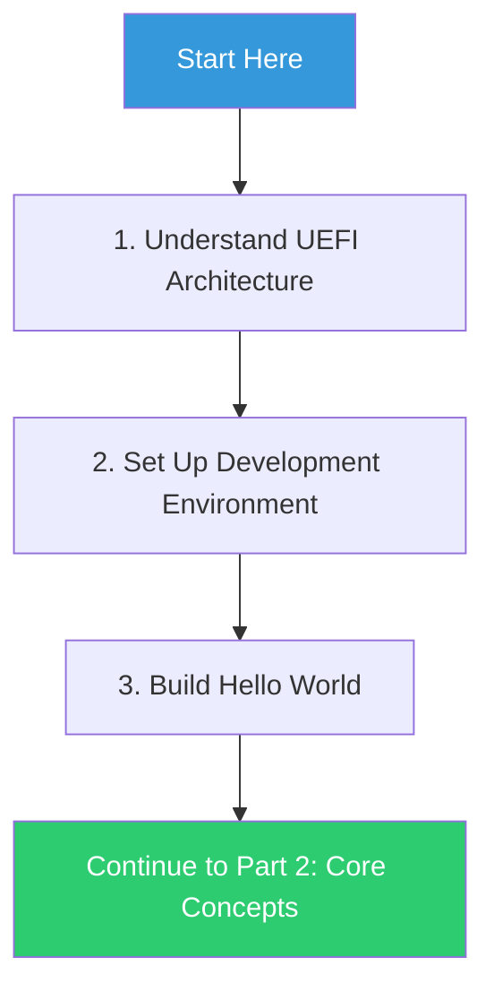

# Part 1: Getting Started
{: .fs-9 }

Your journey into UEFI development begins here.
{: .fs-6 .fw-300 }

---

## What You'll Learn

In this section, you'll build a solid foundation for UEFI development:

| Chapter | Topics |
|:--------|:-------|
| **[1. Introduction]()** | UEFI architecture, boot stages, services overview |
| **[2. Environment Setup]()** | EDK2, toolchains, QEMU/OVMF configuration |
| **[3. Hello World]()** | Your first UEFI application |

## Prerequisites

Before starting, ensure you have:

- **Basic C programming knowledge** - pointers, structures, functions
- **Command-line familiarity** - navigating directories, running commands
- **A development machine** - Windows 10/11, Ubuntu 22.04+, or macOS 13+

## Learning Path

## Time Investment

| Chapter | Estimated Time |
|:--------|:---------------|
| Introduction | 30-45 minutes reading |
| Environment Setup | 1-2 hours (varies by platform) |
| Hello World | 30 minutes |

---

{: .note }
> **Skill Level:** Beginner
> **Prerequisites:** Basic C programming, command-line familiarity
