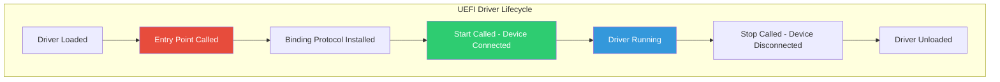
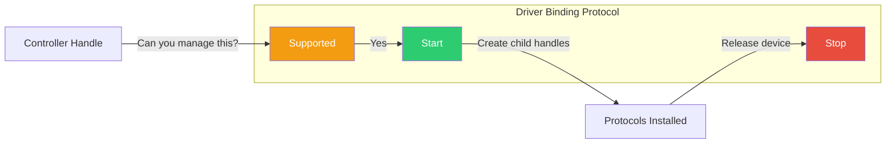

# Chapter 4: UEFI Driver Model
{: .fs-9 }

Understanding how UEFI drivers manage devices and provide services.
{: .fs-6 .fw-300 }

---

## Overview

### When to Use the Driver Model

{: .important }
> **Use the UEFI Driver Model when you need to:**
> - Manage hardware devices (storage controllers, network cards, graphics adapters)
> - Provide services that persist throughout boot (remain loaded after entry point returns)
> - Create reusable device abstractions that work across different platforms
> - Implement hot-plug support where devices can be connected/disconnected

| Scenario | Use Driver Model? | Reason |
|:---------|:------------------|:-------|
| **PCI network card driver** | Yes | Hardware management, stays resident |
| **USB mass storage driver** | Yes | Device binding, hot-plug support |
| **One-time diagnostic tool** | No | Use UEFI_APPLICATION instead |
| **Boot menu application** | No | Runs once and exits |
| **Platform initialization** | Maybe | Use DXE_DRIVER (no binding) for services |
| **Runtime variable access** | Yes | Use DXE_RUNTIME_DRIVER |

**Common Driver Development Scenarios:**
- **OEM/ODM**: Writing drivers for custom hardware on your platform
- **IHV (Independent Hardware Vendor)**: Creating drivers for add-in cards (GPUs, NICs, RAID controllers)
- **Platform developers**: Initializing SoC peripherals during DXE phase
- **Firmware engineers**: Porting existing drivers to new platforms

### What is a UEFI Driver?

A **UEFI Driver** is code that:
- Manages one or more devices or provides services
- Stays resident in memory after loading
- Installs protocols on handles for other code to use
- Follows the UEFI Driver Model for device binding



### Driver vs Application

| Aspect | Application | Driver |
|:-------|:------------|:-------|
| **Purpose** | Perform a task, then exit | Manage devices, stay resident |
| **Entry Point** | `UefiMain` | `DriverEntryPoint` |
| **MODULE_TYPE** | `UEFI_APPLICATION` | `UEFI_DRIVER` or `DXE_DRIVER` |
| **Memory** | Released when app exits | Stays allocated |
| **Protocols** | Consumer (uses protocols) | Producer (installs protocols) |
| **Lifetime** | Runs once | Until Stop() or unload |

### Driver Types

| Type | MODULE_TYPE | Phase | Description |
|:-----|:------------|:------|:------------|
| **UEFI Driver** | `UEFI_DRIVER` | BDS | Follows UEFI Driver Model (binding) |
| **DXE Driver** | `DXE_DRIVER` | DXE | Platform initialization, no binding |
| **DXE Runtime** | `DXE_RUNTIME_DRIVER` | DXE→RT | Survives ExitBootServices |
| **SMM Driver** | `DXE_SMM_DRIVER` | DXE | Runs in System Management Mode |
| **PEIM** | `PEIM` | PEI | Pre-EFI Initialization Module |

### The Driver Binding Protocol

UEFI drivers implement three key functions:



---

## Initialization

### Driver Entry Point

The entry point installs the Driver Binding Protocol:

```c
EFI_STATUS
EFIAPI
MyDriverEntryPoint (
  IN EFI_HANDLE        ImageHandle,
  IN EFI_SYSTEM_TABLE  *SystemTable
  )
{
  EFI_STATUS Status;

  //
  // Install Driver Binding Protocol
  //
  Status = EfiLibInstallDriverBindingComponentName2(
             ImageHandle,
             SystemTable,
             &gMyDriverBinding,
             ImageHandle,
             &gMyComponentName,
             &gMyComponentName2
           );

  return Status;
}
```

### The Driver Binding Structure

```c
EFI_DRIVER_BINDING_PROTOCOL gMyDriverBinding = {
  MyDriverSupported,    // Supported() function
  MyDriverStart,        // Start() function
  MyDriverStop,         // Stop() function
  0x10,                 // Version (higher = preferred)
  NULL,                 // ImageHandle (filled by install)
  NULL                  // DriverBindingHandle (filled by install)
};
```

### Supported() Function

Determines if this driver can manage a controller:

```c
EFI_STATUS
EFIAPI
MyDriverSupported (
  IN EFI_DRIVER_BINDING_PROTOCOL  *This,
  IN EFI_HANDLE                   ControllerHandle,
  IN EFI_DEVICE_PATH_PROTOCOL     *RemainingDevicePath OPTIONAL
  )
{
  EFI_STATUS Status;
  EFI_PCI_IO_PROTOCOL *PciIo;

  //
  // Check if this controller has a protocol we need
  //
  Status = gBS->OpenProtocol(
             ControllerHandle,
             &gEfiPciIoProtocolGuid,
             (VOID **)&PciIo,
             This->DriverBindingHandle,
             ControllerHandle,
             EFI_OPEN_PROTOCOL_BY_DRIVER
           );

  if (EFI_ERROR(Status)) {
    return Status;
  }

  //
  // Check if this is our device (e.g., check Vendor/Device ID)
  //
  // ... device-specific checks ...

  //
  // Close protocol - we're just checking, not using yet
  //
  gBS->CloseProtocol(
         ControllerHandle,
         &gEfiPciIoProtocolGuid,
         This->DriverBindingHandle,
         ControllerHandle
       );

  return EFI_SUCCESS;  // or EFI_UNSUPPORTED
}
```

### Start() Function

Takes control of the device and installs protocols:

```c
EFI_STATUS
EFIAPI
MyDriverStart (
  IN EFI_DRIVER_BINDING_PROTOCOL  *This,
  IN EFI_HANDLE                   ControllerHandle,
  IN EFI_DEVICE_PATH_PROTOCOL     *RemainingDevicePath OPTIONAL
  )
{
  EFI_STATUS Status;
  MY_DEVICE_DATA *DeviceData;

  //
  // Allocate device context
  //
  DeviceData = AllocateZeroPool(sizeof(MY_DEVICE_DATA));
  if (DeviceData == NULL) {
    return EFI_OUT_OF_RESOURCES;
  }

  //
  // Initialize device
  //
  DeviceData->Signature = MY_DEVICE_SIGNATURE;
  DeviceData->ControllerHandle = ControllerHandle;

  //
  // Open required protocols
  //
  Status = gBS->OpenProtocol(
             ControllerHandle,
             &gEfiPciIoProtocolGuid,
             (VOID **)&DeviceData->PciIo,
             This->DriverBindingHandle,
             ControllerHandle,
             EFI_OPEN_PROTOCOL_BY_DRIVER
           );

  //
  // Install our protocol
  //
  Status = gBS->InstallProtocolInterface(
             &ControllerHandle,
             &gMyProtocolGuid,
             EFI_NATIVE_INTERFACE,
             &DeviceData->MyProtocol
           );

  return Status;
}
```

### Stop() Function

Releases the device and cleans up:

```c
EFI_STATUS
EFIAPI
MyDriverStop (
  IN EFI_DRIVER_BINDING_PROTOCOL  *This,
  IN EFI_HANDLE                   ControllerHandle,
  IN UINTN                        NumberOfChildren,
  IN EFI_HANDLE                   *ChildHandleBuffer OPTIONAL
  )
{
  EFI_STATUS Status;
  MY_PROTOCOL *MyProtocol;
  MY_DEVICE_DATA *DeviceData;

  //
  // Get our protocol to find device context
  //
  Status = gBS->OpenProtocol(
             ControllerHandle,
             &gMyProtocolGuid,
             (VOID **)&MyProtocol,
             This->DriverBindingHandle,
             ControllerHandle,
             EFI_OPEN_PROTOCOL_GET_PROTOCOL
           );

  if (EFI_ERROR(Status)) {
    return Status;
  }

  //
  // Get device data from protocol
  //
  DeviceData = MY_DEVICE_DATA_FROM_PROTOCOL(MyProtocol);

  //
  // Uninstall our protocol
  //
  Status = gBS->UninstallProtocolInterface(
             ControllerHandle,
             &gMyProtocolGuid,
             &DeviceData->MyProtocol
           );

  //
  // Close protocols we opened
  //
  gBS->CloseProtocol(
         ControllerHandle,
         &gEfiPciIoProtocolGuid,
         This->DriverBindingHandle,
         ControllerHandle
       );

  //
  // Free device context
  //
  FreePool(DeviceData);

  return EFI_SUCCESS;
}
```

---

## Configuration

### INF File for Drivers

```ini
[Defines]
  INF_VERSION                    = 0x00010017
  BASE_NAME                      = MyDriver
  FILE_GUID                      = 12345678-1234-1234-1234-123456789abc
  MODULE_TYPE                    = UEFI_DRIVER
  VERSION_STRING                 = 1.0
  ENTRY_POINT                    = MyDriverEntryPoint

[Sources]
  MyDriver.c
  MyDriver.h
  ComponentName.c

[Packages]
  MdePkg/MdePkg.dec

[LibraryClasses]
  UefiDriverEntryPoint
  UefiBootServicesTableLib
  UefiLib
  MemoryAllocationLib
  BaseMemoryLib
  DebugLib

[Protocols]
  gEfiDriverBindingProtocolGuid          ## PRODUCES
  gEfiComponentNameProtocolGuid          ## PRODUCES
  gEfiComponentName2ProtocolGuid         ## PRODUCES
  gEfiPciIoProtocolGuid                  ## CONSUMES
  gMyProtocolGuid                        ## PRODUCES

[Depex]
  TRUE
```

### MODULE_TYPE Options

| MODULE_TYPE | Description | Entry Library |
|:------------|:------------|:--------------|
| `UEFI_DRIVER` | UEFI driver with binding | `UefiDriverEntryPoint` |
| `DXE_DRIVER` | DXE phase driver | `UefiDriverEntryPoint` |
| `DXE_RUNTIME_DRIVER` | Runtime driver | `UefiDriverEntryPoint` |
| `DXE_SMM_DRIVER` | SMM driver | `SmmDriverEntryPoint` |

### Dependency Expressions (DEPEX)

Control driver load order:

```ini
[Depex]
  gEfiPciRootBridgeIoProtocolGuid AND
  gEfiVariableArchProtocolGuid
```

Common DEPEX patterns:

| Pattern | Meaning |
|:--------|:--------|
| `TRUE` | No dependencies, load anytime |
| `gProtocolGuid` | Wait for protocol |
| `A AND B` | Wait for both |
| `A OR B` | Wait for either |

---

## Porting Guide

### Platform Considerations

| Platform | Notes |
|:---------|:------|
| **x64** | Standard calling convention (MS ABI) |
| **ARM64** | AAPCS64 calling convention |
| **RISCV64** | RISC-V calling convention |

### Hardware Abstraction

Create a Hardware Abstraction Layer (HAL) for portability:

```c
// Platform-independent interface
typedef struct _MY_HW_INTERFACE {
  EFI_STATUS (*ReadRegister)(UINT32 Offset, UINT32 *Value);
  EFI_STATUS (*WriteRegister)(UINT32 Offset, UINT32 Value);
} MY_HW_INTERFACE;

// x64 PCI implementation
EFI_STATUS
X64PciReadRegister(
  UINT32 Offset,
  UINT32 *Value
  )
{
  return PciIo->Mem.Read(PciIo, EfiPciIoWidthUint32, 0, Offset, 1, Value);
}
```

### Runtime Driver Considerations

For `DXE_RUNTIME_DRIVER`:

```c
// Convert pointers when OS calls SetVirtualAddressMap
VOID
EFIAPI
MyDriverVirtualAddressChange (
  IN EFI_EVENT  Event,
  IN VOID       *Context
  )
{
  EfiConvertPointer(0, (VOID **)&gMyDeviceBase);
  EfiConvertPointer(0, (VOID **)&gRT);
}

// Register for virtual address change notification
gBS->CreateEventEx(
       EVT_NOTIFY_SIGNAL,
       TPL_NOTIFY,
       MyDriverVirtualAddressChange,
       NULL,
       &gEfiEventVirtualAddressChangeGuid,
       &VirtualAddressChangeEvent
     );
```

---

## Example: Minimal Driver

### MinimalDriver.c

```c
/** @file
  Minimal UEFI Driver Example

  Demonstrates the basic structure of a UEFI driver with
  Driver Binding Protocol implementation.

  Copyright (c) 2024, UEFI Guide Contributors.
  SPDX-License-Identifier: BSD-2-Clause-Patent
**/

#include <Uefi.h>
#include <Library/UefiDriverEntryPoint.h>
#include <Library/UefiBootServicesTableLib.h>
#include <Library/UefiLib.h>
#include <Library/DebugLib.h>
#include <Protocol/DriverBinding.h>

//
// Driver Binding Protocol functions
//
EFI_STATUS
EFIAPI
MinimalDriverSupported (
  IN EFI_DRIVER_BINDING_PROTOCOL  *This,
  IN EFI_HANDLE                   ControllerHandle,
  IN EFI_DEVICE_PATH_PROTOCOL     *RemainingDevicePath OPTIONAL
  )
{
  DEBUG((DEBUG_INFO, "MinimalDriver: Supported() called\n"));

  // For demonstration, support no controllers
  return EFI_UNSUPPORTED;
}

EFI_STATUS
EFIAPI
MinimalDriverStart (
  IN EFI_DRIVER_BINDING_PROTOCOL  *This,
  IN EFI_HANDLE                   ControllerHandle,
  IN EFI_DEVICE_PATH_PROTOCOL     *RemainingDevicePath OPTIONAL
  )
{
  DEBUG((DEBUG_INFO, "MinimalDriver: Start() called\n"));
  return EFI_SUCCESS;
}

EFI_STATUS
EFIAPI
MinimalDriverStop (
  IN EFI_DRIVER_BINDING_PROTOCOL  *This,
  IN EFI_HANDLE                   ControllerHandle,
  IN UINTN                        NumberOfChildren,
  IN EFI_HANDLE                   *ChildHandleBuffer OPTIONAL
  )
{
  DEBUG((DEBUG_INFO, "MinimalDriver: Stop() called\n"));
  return EFI_SUCCESS;
}

//
// Driver Binding Protocol instance
//
EFI_DRIVER_BINDING_PROTOCOL gMinimalDriverBinding = {
  MinimalDriverSupported,
  MinimalDriverStart,
  MinimalDriverStop,
  0x10,    // Version
  NULL,    // ImageHandle
  NULL     // DriverBindingHandle
};

/**
  Driver entry point.
**/
EFI_STATUS
EFIAPI
MinimalDriverEntryPoint (
  IN EFI_HANDLE        ImageHandle,
  IN EFI_SYSTEM_TABLE  *SystemTable
  )
{
  EFI_STATUS Status;

  DEBUG((DEBUG_INFO, "MinimalDriver: Entry point\n"));

  //
  // Install Driver Binding Protocol
  //
  Status = gBS->InstallMultipleProtocolInterfaces(
             &ImageHandle,
             &gEfiDriverBindingProtocolGuid,
             &gMinimalDriverBinding,
             NULL
           );

  if (EFI_ERROR(Status)) {
    DEBUG((DEBUG_ERROR, "MinimalDriver: Failed to install binding: %r\n", Status));
  }

  return Status;
}
```

---

## UEFI Specification Reference

- **UEFI Spec Section 11**: Protocols - UEFI Driver Model
- **UEFI Spec Section 11.1**: Driver Binding Protocol
- **UEFI Spec Section 11.2**: Platform to Driver Configuration
- **UEFI Spec Section 11.3**: Driver Diagnostics
- **UEFI Spec Section 11.4**: Component Name Protocol

---

## Summary

1. **Drivers stay resident** and manage devices via protocols
2. **Driver Binding Protocol** has three functions: Supported, Start, Stop
3. **Supported()** checks if driver can manage a controller
4. **Start()** takes control and installs protocols
5. **Stop()** releases device and cleans up
6. **MODULE_TYPE** determines driver category and entry point library

---

## Next Steps

- [Chapter 5: Protocols and Handles](05-protocols-handles.html) - Deep dive into protocol architecture
- [Chapter 6: Memory Services](06-memory-services.html) - Memory allocation in UEFI

---

{: .note }
> **Source Code**: See [`examples/UefiGuidePkg/DriverExample/`](https://github.com/MichaelTien8901/uefi-guide-tutorial/tree/main/examples/UefiGuidePkg/DriverExample) for complete driver examples.
