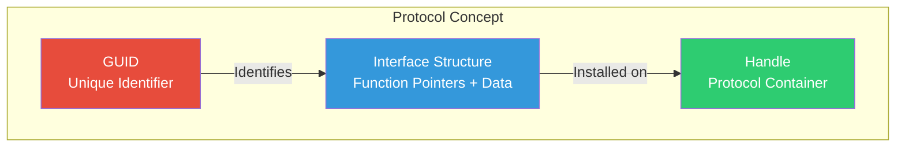
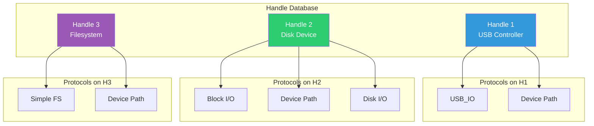
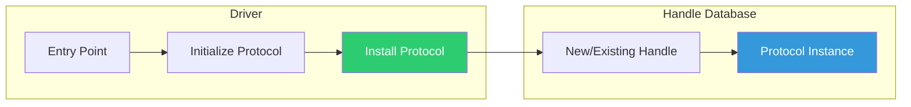

# Chapter 5: Protocols and Handles
{: .fs-9 }

The fundamental building blocks of UEFI's object-oriented architecture.
{: .fs-6 .fw-300 }

---

## Overview

### When to Use Protocols and Handles

{: .important }
> **Use Protocols when you need to:**
> - Expose functionality from a driver to other code (install protocol)
> - Access hardware or services provided by drivers (consume protocol)
> - Discover available devices or services in the system
> - Implement communication between different firmware components

| Scenario | Protocol Action | Common Pattern |
|:---------|:----------------|:---------------|
| **Writing a disk driver** | Install BlockIo protocol | Producer - provides block read/write |
| **Building a boot loader** | Locate SimpleFileSystem | Consumer - reads kernel from disk |
| **Creating a graphics driver** | Install GOP protocol | Producer - provides framebuffer access |
| **Displaying boot menu** | Locate GOP protocol | Consumer - draws graphics on screen |
| **Implementing a network stack** | Install/Consume multiple | Layered protocols (SNP→MNP→IP4→TCP4) |
| **Finding all USB devices** | LocateHandleBuffer(ByProtocol) | Enumerate all UsbIo handles |

**When to Install vs. Consume Protocols:**

| Role | Action | Typical MODULE_TYPE |
|:-----|:-------|:--------------------|
| **Driver developer** | Install protocols on device handles | UEFI_DRIVER, DXE_DRIVER |
| **Application developer** | Locate and use existing protocols | UEFI_APPLICATION |
| **Platform developer** | Both - install platform services, consume hardware | DXE_DRIVER |

**Key Protocol Usage Patterns:**
- **LocateProtocol**: Find first (or only) instance of a service (e.g., RNG, Security)
- **LocateHandleBuffer**: Find all instances (e.g., all block devices, all network interfaces)
- **OpenProtocol**: Exclusive access with proper resource tracking (drivers)
- **HandleProtocol**: Quick read-only access (applications)

### What are Protocols?

A **Protocol** in UEFI is a named interface - a structure containing function pointers and data that provides specific functionality. Protocols are identified by GUIDs and installed on handles.



### What are Handles?

A **Handle** is an opaque pointer that represents a collection of protocols. Think of it as:
- A device (controller handle)
- A loaded image (image handle)
- A driver (driver handle)

### The Handle Database

UEFI maintains a central **Handle Database** that tracks all handles and their protocols:



### Key Concepts

| Concept | Description |
|:--------|:------------|
| **GUID** | 128-bit globally unique identifier for protocols |
| **Handle** | Container for related protocols |
| **Interface** | The actual protocol structure with functions |
| **Producer** | Driver that installs a protocol |
| **Consumer** | Code that uses a protocol |

### Protocol Interface Structure

A typical protocol looks like:

```c
typedef struct _EFI_SIMPLE_TEXT_OUTPUT_PROTOCOL {
  EFI_TEXT_RESET           Reset;
  EFI_TEXT_STRING          OutputString;
  EFI_TEXT_TEST_STRING     TestString;
  EFI_TEXT_QUERY_MODE      QueryMode;
  EFI_TEXT_SET_MODE        SetMode;
  EFI_TEXT_SET_ATTRIBUTE   SetAttribute;
  EFI_TEXT_CLEAR_SCREEN    ClearScreen;
  EFI_TEXT_SET_CURSOR_POSITION SetCursorPosition;
  EFI_TEXT_ENABLE_CURSOR   EnableCursor;
  SIMPLE_TEXT_OUTPUT_MODE  *Mode;
} EFI_SIMPLE_TEXT_OUTPUT_PROTOCOL;
```

---

## Initialization

### Installing a Protocol

Drivers install protocols to provide services:

```c
EFI_STATUS
InstallMyProtocol (
  IN EFI_HANDLE  ControllerHandle
  )
{
  EFI_STATUS Status;
  MY_PROTOCOL *Protocol;

  //
  // Allocate protocol structure
  //
  Protocol = AllocateZeroPool(sizeof(MY_PROTOCOL));
  if (Protocol == NULL) {
    return EFI_OUT_OF_RESOURCES;
  }

  //
  // Initialize function pointers
  //
  Protocol->Revision = MY_PROTOCOL_REVISION;
  Protocol->DoSomething = MyDoSomething;
  Protocol->GetStatus = MyGetStatus;

  //
  // Install on the handle
  //
  Status = gBS->InstallProtocolInterface(
             &ControllerHandle,
             &gMyProtocolGuid,
             EFI_NATIVE_INTERFACE,
             Protocol
           );

  return Status;
}
```

### InstallMultipleProtocolInterfaces

Install multiple protocols atomically:

```c
Status = gBS->InstallMultipleProtocolInterfaces(
           &Handle,
           &gEfiDevicePathProtocolGuid, DevicePath,
           &gEfiBlockIoProtocolGuid, BlockIo,
           &gEfiDiskIoProtocolGuid, DiskIo,
           NULL  // Terminator
         );
```

### Protocol Registration Patterns



---

## Configuration

### GUID Definition

Define protocol GUIDs in header files:

```c
// In MyProtocol.h
#define MY_PROTOCOL_GUID \
  { 0x12345678, 0x1234, 0x5678, \
    { 0x12, 0x34, 0x56, 0x78, 0x9a, 0xbc, 0xde, 0xf0 } }

extern EFI_GUID gMyProtocolGuid;

// In MyProtocol.c or a GUID file
EFI_GUID gMyProtocolGuid = MY_PROTOCOL_GUID;
```

### Protocol Structure Definition

```c
// Protocol revision for versioning
#define MY_PROTOCOL_REVISION  0x00010000

// Forward declaration
typedef struct _MY_PROTOCOL MY_PROTOCOL;

// Function pointer types
typedef
EFI_STATUS
(EFIAPI *MY_DO_SOMETHING)(
  IN MY_PROTOCOL  *This,
  IN UINT32       Parameter
  );

typedef
EFI_STATUS
(EFIAPI *MY_GET_STATUS)(
  IN  MY_PROTOCOL  *This,
  OUT UINT32       *Status
  );

// Protocol structure
struct _MY_PROTOCOL {
  UINT32            Revision;
  MY_DO_SOMETHING   DoSomething;
  MY_GET_STATUS     GetStatus;
};
```

### INF Protocol Declarations

```ini
[Protocols]
  gMyProtocolGuid                ## PRODUCES
  gEfiPciIoProtocolGuid          ## CONSUMES
  gEfiDevicePathProtocolGuid     ## SOMETIMES_CONSUMES

[Guids]
  gMyDataGuid                    ## PRODUCES
```

### Protocol Declaration Comments

| Keyword | Meaning |
|:--------|:--------|
| `PRODUCES` | Driver installs this protocol |
| `CONSUMES` | Driver opens/uses this protocol |
| `SOMETIMES_PRODUCES` | May install depending on conditions |
| `SOMETIMES_CONSUMES` | May use depending on conditions |
| `TO_START` | Required to start managing device |
| `BY_START` | Opened in Start() function |

---

## Porting Guide

### Cross-Platform Considerations

Protocols are architecture-independent, but consider:

| Aspect | Consideration |
|:-------|:--------------|
| **Pointer Size** | Use `UINTN` for pointer-sized values |
| **Alignment** | Ensure proper structure alignment |
| **Calling Convention** | Always use `EFIAPI` |
| **Endianness** | UEFI is little-endian on all platforms |

### Optional Protocol Handling

Not all protocols exist on all platforms:

```c
EFI_STATUS
UseOptionalProtocol (
  VOID
  )
{
  EFI_STATUS Status;
  OPTIONAL_PROTOCOL *Protocol;

  Status = gBS->LocateProtocol(
             &gOptionalProtocolGuid,
             NULL,
             (VOID **)&Protocol
           );

  if (EFI_ERROR(Status)) {
    //
    // Protocol not available - use fallback
    //
    DEBUG((DEBUG_INFO, "Optional protocol not found, using fallback\n"));
    return UseFallbackMethod();
  }

  //
  // Protocol available - use it
  //
  return Protocol->DoSomething(Protocol);
}
```

### Platform-Specific Protocols

```c
#if defined(MDE_CPU_X64)
  // x86-specific protocol usage
  Status = gBS->LocateProtocol(&gEfiLegacyBiosProtocolGuid, ...);
#elif defined(MDE_CPU_AARCH64)
  // ARM-specific protocol usage
  Status = gBS->LocateProtocol(&gArmScmiProtocolGuid, ...);
#endif
```

---

## Using Protocols

### LocateProtocol - Find First Instance

Find any instance of a protocol (useful for singleton protocols):

```c
EFI_STATUS
FindSimpleFilesystem (
  OUT EFI_SIMPLE_FILE_SYSTEM_PROTOCOL  **FileSystem
  )
{
  EFI_STATUS Status;

  Status = gBS->LocateProtocol(
             &gEfiSimpleFileSystemProtocolGuid,
             NULL,       // Optional registration key
             (VOID **)FileSystem
           );

  return Status;
}
```

### LocateHandleBuffer - Find All Instances

Find all handles with a specific protocol:

```c
EFI_STATUS
FindAllBlockDevices (
  VOID
  )
{
  EFI_STATUS Status;
  EFI_HANDLE *HandleBuffer;
  UINTN HandleCount;
  UINTN Index;
  EFI_BLOCK_IO_PROTOCOL *BlockIo;

  //
  // Find all handles with Block I/O protocol
  //
  Status = gBS->LocateHandleBuffer(
             ByProtocol,
             &gEfiBlockIoProtocolGuid,
             NULL,
             &HandleCount,
             &HandleBuffer
           );

  if (EFI_ERROR(Status)) {
    return Status;
  }

  Print(L"Found %d block devices\n", HandleCount);

  //
  // Iterate through handles
  //
  for (Index = 0; Index < HandleCount; Index++) {
    Status = gBS->HandleProtocol(
               HandleBuffer[Index],
               &gEfiBlockIoProtocolGuid,
               (VOID **)&BlockIo
             );

    if (!EFI_ERROR(Status)) {
      Print(L"  Device %d: MediaId=%d, BlockSize=%d\n",
        Index,
        BlockIo->Media->MediaId,
        BlockIo->Media->BlockSize
      );
    }
  }

  //
  // Free the handle buffer
  //
  FreePool(HandleBuffer);

  return EFI_SUCCESS;
}
```

### OpenProtocol - Controlled Access

Use OpenProtocol for proper resource management:

```c
EFI_STATUS
OpenBlockIo (
  IN  EFI_HANDLE              ControllerHandle,
  IN  EFI_HANDLE              AgentHandle,
  OUT EFI_BLOCK_IO_PROTOCOL   **BlockIo
  )
{
  EFI_STATUS Status;

  Status = gBS->OpenProtocol(
             ControllerHandle,
             &gEfiBlockIoProtocolGuid,
             (VOID **)BlockIo,
             AgentHandle,           // Who is opening
             ControllerHandle,      // For which controller
             EFI_OPEN_PROTOCOL_BY_DRIVER  // Open mode
           );

  return Status;
}
```

### OpenProtocol Modes

| Mode | Description |
|:-----|:------------|
| `BY_HANDLE_PROTOCOL` | Simple access (like HandleProtocol) |
| `GET_PROTOCOL` | Get without tracking |
| `TEST_PROTOCOL` | Check existence only |
| `BY_CHILD_CONTROLLER` | Child controller access |
| `BY_DRIVER` | Exclusive driver access |
| `EXCLUSIVE` | Exclusive access (disconnects others) |

### CloseProtocol

Always close protocols you opened:

```c
gBS->CloseProtocol(
       ControllerHandle,
       &gEfiBlockIoProtocolGuid,
       AgentHandle,
       ControllerHandle
     );
```

---

## Protocol Notification

### RegisterProtocolNotify

Get notified when a protocol is installed:

```c
EFI_EVENT  ProtocolEvent;
VOID       *Registration;

//
// Create event for notification
//
Status = gBS->CreateEvent(
           EVT_NOTIFY_SIGNAL,
           TPL_CALLBACK,
           MyProtocolNotifyCallback,
           NULL,
           &ProtocolEvent
         );

//
// Register for protocol notification
//
Status = gBS->RegisterProtocolNotify(
           &gMyWatchedProtocolGuid,
           ProtocolEvent,
           &Registration
         );

//
// Callback function
//
VOID
EFIAPI
MyProtocolNotifyCallback (
  IN EFI_EVENT  Event,
  IN VOID       *Context
  )
{
  EFI_STATUS Status;
  EFI_HANDLE Handle;
  UINTN BufferSize;
  MY_WATCHED_PROTOCOL *Protocol;

  while (TRUE) {
    BufferSize = sizeof(Handle);
    Status = gBS->LocateHandle(
               ByRegisterNotify,
               NULL,
               Registration,
               &BufferSize,
               &Handle
             );

    if (EFI_ERROR(Status)) {
      break;
    }

    // Handle the new protocol instance
    Status = gBS->HandleProtocol(Handle, &gMyWatchedProtocolGuid, (VOID **)&Protocol);
    if (!EFI_ERROR(Status)) {
      DEBUG((DEBUG_INFO, "New protocol instance found!\n"));
    }
  }
}
```

---

## Common Protocols Reference

### Core Protocols

| Protocol | GUID | Purpose |
|:---------|:-----|:--------|
| Device Path | `gEfiDevicePathProtocolGuid` | Device location |
| Driver Binding | `gEfiDriverBindingProtocolGuid` | Driver management |
| Component Name | `gEfiComponentName2ProtocolGuid` | Driver names |

### I/O Protocols

| Protocol | GUID | Purpose |
|:---------|:-----|:--------|
| Simple Text In | `gEfiSimpleTextInputExProtocolGuid` | Keyboard |
| Simple Text Out | `gEfiSimpleTextOutputProtocolGuid` | Console |
| Graphics Output | `gEfiGraphicsOutputProtocolGuid` | Display |
| Block I/O | `gEfiBlockIoProtocolGuid` | Disk access |
| Simple FS | `gEfiSimpleFileSystemProtocolGuid` | File system |

### Hardware Protocols

| Protocol | GUID | Purpose |
|:---------|:-----|:--------|
| PCI I/O | `gEfiPciIoProtocolGuid` | PCI device access |
| USB I/O | `gEfiUsbIoProtocolGuid` | USB device access |
| SCSI I/O | `gEfiScsiIoProtocolGuid` | SCSI device access |

---

## Example: Protocol Consumer

```c
/** @file
  Protocol Consumer Example - Lists all block devices
**/

#include <Uefi.h>
#include <Library/UefiLib.h>
#include <Library/UefiBootServicesTableLib.h>
#include <Library/MemoryAllocationLib.h>
#include <Protocol/BlockIo.h>
#include <Protocol/DevicePath.h>
#include <Library/DevicePathLib.h>

EFI_STATUS
EFIAPI
UefiMain (
  IN EFI_HANDLE        ImageHandle,
  IN EFI_SYSTEM_TABLE  *SystemTable
  )
{
  EFI_STATUS                Status;
  EFI_HANDLE                *Handles;
  UINTN                     HandleCount;
  UINTN                     Index;
  EFI_BLOCK_IO_PROTOCOL     *BlockIo;
  EFI_DEVICE_PATH_PROTOCOL  *DevicePath;

  Print(L"Block Device Enumeration\n");
  Print(L"========================\n\n");

  //
  // Find all Block I/O handles
  //
  Status = gBS->LocateHandleBuffer(
             ByProtocol,
             &gEfiBlockIoProtocolGuid,
             NULL,
             &HandleCount,
             &Handles
           );

  if (EFI_ERROR(Status)) {
    Print(L"No block devices found: %r\n", Status);
    return Status;
  }

  Print(L"Found %d block device(s)\n\n", HandleCount);

  for (Index = 0; Index < HandleCount; Index++) {
    //
    // Get Block I/O protocol
    //
    Status = gBS->HandleProtocol(
               Handles[Index],
               &gEfiBlockIoProtocolGuid,
               (VOID **)&BlockIo
             );

    if (EFI_ERROR(Status)) {
      continue;
    }

    Print(L"Device %d:\n", Index);
    Print(L"  Media ID:     %d\n", BlockIo->Media->MediaId);
    Print(L"  Block Size:   %d bytes\n", BlockIo->Media->BlockSize);
    Print(L"  Last Block:   %ld\n", BlockIo->Media->LastBlock);
    Print(L"  Removable:    %s\n", BlockIo->Media->RemovableMedia ? L"Yes" : L"No");
    Print(L"  Read Only:    %s\n", BlockIo->Media->ReadOnly ? L"Yes" : L"No");

    //
    // Get Device Path (optional)
    //
    Status = gBS->HandleProtocol(
               Handles[Index],
               &gEfiDevicePathProtocolGuid,
               (VOID **)&DevicePath
             );

    if (!EFI_ERROR(Status)) {
      Print(L"  Path: %s\n", ConvertDevicePathToText(DevicePath, FALSE, FALSE));
    }

    Print(L"\n");
  }

  FreePool(Handles);
  return EFI_SUCCESS;
}
```

---

## UEFI Specification Reference

- **UEFI Spec Section 7.3**: Protocol Handler Services
- **UEFI Spec Section 10**: Protocols - Device Path Protocol
- **UEFI Spec Section 11**: Protocols - UEFI Driver Model
- **UEFI Spec Section 12**: Protocols - Console Support

---

## Summary

1. **Protocols are interfaces** identified by GUIDs
2. **Handles are containers** for related protocols
3. **Drivers install protocols** to provide services
4. **Applications consume protocols** to access functionality
5. **OpenProtocol/CloseProtocol** for proper resource management
6. **LocateHandleBuffer** to find all instances of a protocol

---

## Next Steps

- [Chapter 6: Memory Services](06-memory-services.html) - Memory allocation and management
- [Chapter 7: Boot & Runtime Services](07-boot-runtime-services.html) - Service availability

---

{: .note }
> **Source Code**: See `examples/UefiGuidePkg/ProtocolExample/` for complete examples.
