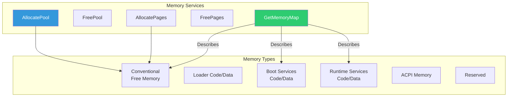

# Chapter 6: Memory Services
{: .fs-9 }

Understanding UEFI memory allocation, types, and the memory map.
{: .fs-6 .fw-300 }

---

## Overview

### When to Use Memory Services

{: .important }
> **Use Memory Services when you need to:**
> - Allocate temporary buffers for data processing
> - Create persistent data structures for drivers
> - Get the system memory map before booting an OS
> - Allocate memory with specific type requirements (runtime, reserved)

| Scenario | Memory Function | Memory Type |
|:---------|:----------------|:------------|
| **Small buffer (<4KB)** | AllocatePool | EfiBootServicesData |
| **Large buffer or aligned memory** | AllocatePages | EfiBootServicesData |
| **Buffer for runtime use** | AllocatePages | EfiRuntimeServicesData |
| **DMA buffer for device** | AllocatePages | EfiBootServicesData (or device-specific) |
| **OS handoff preparation** | GetMemoryMap | N/A (read-only) |
| **ACPI table allocation** | AllocatePages | EfiACPIMemoryNVS |

**Choosing Pool vs Pages:**

| Factor | Use Pool | Use Pages |
|:-------|:---------|:----------|
| **Size** | < 4KB | >= 4KB or alignment needed |
| **Alignment** | No guarantee | 4KB aligned |
| **Fragmentation** | Possible | Less fragmented |
| **Runtime drivers** | Never | Required for runtime memory |
| **Performance** | Faster for small allocs | Better for large allocs |

**Common Memory Usage Patterns:**
- **Application developers**: Pool allocation for temporary buffers, GetMemoryMap before ExitBootServices
- **Driver developers**: Pages for device contexts, runtime memory for persistent state
- **Boot loader developers**: GetMemoryMap to pass memory info to OS kernel
- **Platform developers**: Reserved memory for firmware features, ACPI NVS for sleep states

### Memory in UEFI

UEFI provides comprehensive memory management through Boot Services. Understanding memory is critical because:

- Memory types determine how memory is used
- The memory map must be passed to the OS
- Incorrect allocation can cause boot failures
- Runtime drivers need special memory handling



### Pool vs Pages

| Method | Unit | Use Case |
|:-------|:-----|:---------|
| **Pool** | Bytes | Small allocations (<4KB) |
| **Pages** | 4KB pages | Large allocations, aligned memory |

### Memory Types

| Type | Value | Description | After ExitBootServices |
|:-----|:------|:------------|:----------------------|
| `EfiReservedMemoryType` | 0 | Reserved, do not use | Preserved |
| `EfiLoaderCode` | 1 | UEFI application code | Usable |
| `EfiLoaderData` | 2 | UEFI application data | Usable |
| `EfiBootServicesCode` | 3 | Boot services code | Usable |
| `EfiBootServicesData` | 4 | Boot services data | Usable |
| `EfiRuntimeServicesCode` | 5 | Runtime services code | Preserved |
| `EfiRuntimeServicesData` | 6 | Runtime services data | Preserved |
| `EfiConventionalMemory` | 7 | Free memory | Usable |
| `EfiUnusableMemory` | 8 | Memory with errors | Unusable |
| `EfiACPIReclaimMemory` | 9 | ACPI tables (reclaimable) | Reclaimable |
| `EfiACPIMemoryNVS` | 10 | ACPI NVS (preserved) | Preserved |
| `EfiMemoryMappedIO` | 11 | MMIO regions | Preserved |
| `EfiMemoryMappedIOPortSpace` | 12 | Port I/O | Preserved |
| `EfiPalCode` | 13 | Itanium PAL | Preserved |
| `EfiPersistentMemory` | 14 | NVDIMM | Usable |

---

## Initialization

### Memory Service Availability

Memory services are available in different phases:


| Phase | Memory Services |
|:------|:----------------|
| **SEC** | None (stack only) |
| **PEI** | Limited (CAR, then permanent memory) |
| **DXE** | Full AllocatePool/AllocatePages |
| **Runtime** | None (pre-allocate everything) |

### Early Allocation Patterns

For DXE drivers that need memory early:

```c
EFI_STATUS
DriverEntryPoint (
  IN EFI_HANDLE        ImageHandle,
  IN EFI_SYSTEM_TABLE  *SystemTable
  )
{
  EFI_STATUS Status;
  VOID *Buffer;

  //
  // Allocate pool memory (small allocations)
  //
  Status = gBS->AllocatePool(
             EfiBootServicesData,  // Type
             1024,                  // Size in bytes
             &Buffer
           );

  if (EFI_ERROR(Status)) {
    return Status;
  }

  //
  // Use memory...
  //

  //
  // Free when done (or keep for driver lifetime)
  //
  gBS->FreePool(Buffer);

  return EFI_SUCCESS;
}
```

---

## Configuration

### AllocatePool

Allocate a buffer of arbitrary size:

```c
EFI_STATUS Status;
VOID *Buffer;
UINTN Size = 256;

Status = gBS->AllocatePool(
           EfiBootServicesData,  // Memory type
           Size,                  // Size in bytes
           &Buffer               // Output pointer
         );

if (EFI_ERROR(Status)) {
  DEBUG((DEBUG_ERROR, "AllocatePool failed: %r\n", Status));
  return Status;
}

// Use Buffer...
ZeroMem(Buffer, Size);

// Don't forget to free
gBS->FreePool(Buffer);
```

### AllocatePages

Allocate page-aligned memory:

```c
EFI_STATUS Status;
EFI_PHYSICAL_ADDRESS Address;
UINTN Pages = 4;  // 4 pages = 16KB

//
// Allocate anywhere
//
Status = gBS->AllocatePages(
           AllocateAnyPages,        // Allocation type
           EfiBootServicesData,     // Memory type
           Pages,                   // Number of 4KB pages
           &Address                 // Output address
         );

//
// Or allocate at specific address
//
Address = 0x100000;  // 1MB
Status = gBS->AllocatePages(
           AllocateAddress,         // At specific address
           EfiRuntimeServicesData,  // For runtime driver
           Pages,
           &Address
         );

//
// Or allocate below a limit
//
Address = 0xFFFFFFFF;  // Below 4GB
Status = gBS->AllocatePages(
           AllocateMaxAddress,      // At or below address
           EfiBootServicesData,
           Pages,
           &Address
         );
```

### Allocation Types

| Type | Description |
|:-----|:------------|
| `AllocateAnyPages` | Anywhere in memory |
| `AllocateMaxAddress` | At or below specified address |
| `AllocateAddress` | At exact specified address |

### Memory Type Selection

| Use Case | Memory Type |
|:---------|:------------|
| Temporary buffer | `EfiBootServicesData` |
| Application heap | `EfiLoaderData` |
| Runtime driver data | `EfiRuntimeServicesData` |
| DMA buffer | `EfiBootServicesData` (with alignment) |
| ACPI tables | `EfiACPIReclaimMemory` or `EfiACPIMemoryNVS` |

### Alignment Requirements

For DMA or specific hardware requirements:

```c
//
// Allocate aligned memory using pages
// Pages are always 4KB aligned
//
UINTN Alignment = 0x10000;  // 64KB alignment
UINTN Size = 0x8000;        // 32KB needed
UINTN Pages = EFI_SIZE_TO_PAGES(Size + Alignment);
EFI_PHYSICAL_ADDRESS RawAddress;
EFI_PHYSICAL_ADDRESS AlignedAddress;

Status = gBS->AllocatePages(
           AllocateAnyPages,
           EfiBootServicesData,
           Pages,
           &RawAddress
         );

// Align up to boundary
AlignedAddress = (RawAddress + Alignment - 1) & ~(Alignment - 1);
```

---

## Porting Guide

### Platform Memory Map Differences

Different platforms have different memory layouts:

| Platform | Typical Considerations |
|:---------|:-----------------------|
| **x64 PC** | Hole at 640KB-1MB, MMIO at top of 4GB |
| **ARM Server** | Device tree memory nodes, potentially sparse |
| **Embedded** | Limited memory, specific reserved regions |

### Architecture-Specific Memory

```c
#if defined(MDE_CPU_X64) || defined(MDE_CPU_IA32)
  //
  // x86: Avoid legacy regions
  //
  if (Address < 0x100000) {
    DEBUG((DEBUG_WARN, "Allocation in legacy region\n"));
  }
#elif defined(MDE_CPU_AARCH64)
  //
  // ARM64: Check against device tree reserved regions
  //
#endif
```

### Memory Attributes

Some platforms require specific attributes:

```c
EFI_STATUS
SetMemoryAttributes (
  IN EFI_PHYSICAL_ADDRESS  Address,
  IN UINT64                Length,
  IN UINT64                Attributes
  )
{
  EFI_STATUS Status;
  EFI_GCD_MEMORY_SPACE_DESCRIPTOR Descriptor;

  Status = gDS->GetMemorySpaceDescriptor(Address, &Descriptor);
  if (EFI_ERROR(Status)) {
    return Status;
  }

  return gDS->SetMemorySpaceAttributes(
           Address,
           Length,
           Attributes  // EFI_MEMORY_UC, EFI_MEMORY_WC, EFI_MEMORY_WT, EFI_MEMORY_WB
         );
}
```

---

## Memory Map

### GetMemoryMap

The memory map describes all memory regions:

```c
EFI_STATUS
PrintMemoryMap (
  VOID
  )
{
  EFI_STATUS Status;
  EFI_MEMORY_DESCRIPTOR *MemoryMap;
  EFI_MEMORY_DESCRIPTOR *Entry;
  UINTN MemoryMapSize;
  UINTN MapKey;
  UINTN DescriptorSize;
  UINT32 DescriptorVersion;
  UINTN Index;
  UINTN EntryCount;

  //
  // Get required size
  //
  MemoryMapSize = 0;
  Status = gBS->GetMemoryMap(
             &MemoryMapSize,
             NULL,
             &MapKey,
             &DescriptorSize,
             &DescriptorVersion
           );

  if (Status != EFI_BUFFER_TOO_SMALL) {
    return Status;
  }

  //
  // Allocate buffer (add extra for the allocation itself)
  //
  MemoryMapSize += 2 * DescriptorSize;
  MemoryMap = AllocatePool(MemoryMapSize);
  if (MemoryMap == NULL) {
    return EFI_OUT_OF_RESOURCES;
  }

  //
  // Get the map
  //
  Status = gBS->GetMemoryMap(
             &MemoryMapSize,
             MemoryMap,
             &MapKey,
             &DescriptorSize,
             &DescriptorVersion
           );

  if (EFI_ERROR(Status)) {
    FreePool(MemoryMap);
    return Status;
  }

  //
  // Print entries
  //
  EntryCount = MemoryMapSize / DescriptorSize;
  Print(L"Memory Map (%d entries):\n", EntryCount);
  Print(L"Type       PhysStart        VirtStart        Pages      Attr\n");

  Entry = MemoryMap;
  for (Index = 0; Index < EntryCount; Index++) {
    Print(L"%-10d %016lx %016lx %010lx %016lx\n",
      Entry->Type,
      Entry->PhysicalStart,
      Entry->VirtualStart,
      Entry->NumberOfPages,
      Entry->Attribute
    );

    Entry = NEXT_MEMORY_DESCRIPTOR(Entry, DescriptorSize);
  }

  FreePool(MemoryMap);
  return EFI_SUCCESS;
}
```

### Memory Map for OS Handoff

Before calling ExitBootServices:

```c
EFI_STATUS
PrepareForOsHandoff (
  OUT UINTN  *MapKey
  )
{
  EFI_STATUS Status;
  EFI_MEMORY_DESCRIPTOR *MemoryMap;
  UINTN MemoryMapSize;
  UINTN DescriptorSize;
  UINT32 DescriptorVersion;

  //
  // Get memory map size
  //
  MemoryMapSize = 0;
  gBS->GetMemoryMap(&MemoryMapSize, NULL, MapKey, &DescriptorSize, &DescriptorVersion);

  //
  // Allocate and get map
  //
  MemoryMapSize += 2 * DescriptorSize;  // Extra space
  MemoryMap = AllocatePool(MemoryMapSize);

  Status = gBS->GetMemoryMap(
             &MemoryMapSize,
             MemoryMap,
             MapKey,
             &DescriptorSize,
             &DescriptorVersion
           );

  //
  // IMPORTANT: MapKey must match when calling ExitBootServices
  // Any allocation after GetMemoryMap invalidates MapKey!
  //

  return Status;
}
```

---

## Example: Memory Demo

```c
/** @file
  Memory Services Demonstration
**/

#include <Uefi.h>
#include <Library/UefiLib.h>
#include <Library/UefiBootServicesTableLib.h>
#include <Library/MemoryAllocationLib.h>
#include <Library/BaseMemoryLib.h>

CHAR16 *
MemoryTypeName (
  IN UINT32  Type
  )
{
  switch (Type) {
    case EfiReservedMemoryType:      return L"Reserved";
    case EfiLoaderCode:              return L"LoaderCode";
    case EfiLoaderData:              return L"LoaderData";
    case EfiBootServicesCode:        return L"BS_Code";
    case EfiBootServicesData:        return L"BS_Data";
    case EfiRuntimeServicesCode:     return L"RT_Code";
    case EfiRuntimeServicesData:     return L"RT_Data";
    case EfiConventionalMemory:      return L"Conventional";
    case EfiUnusableMemory:          return L"Unusable";
    case EfiACPIReclaimMemory:       return L"ACPI_Reclaim";
    case EfiACPIMemoryNVS:           return L"ACPI_NVS";
    case EfiMemoryMappedIO:          return L"MMIO";
    case EfiMemoryMappedIOPortSpace: return L"MMIO_Port";
    case EfiPalCode:                 return L"PAL";
    case EfiPersistentMemory:        return L"Persistent";
    default:                         return L"Unknown";
  }
}

EFI_STATUS
EFIAPI
UefiMain (
  IN EFI_HANDLE        ImageHandle,
  IN EFI_SYSTEM_TABLE  *SystemTable
  )
{
  EFI_STATUS Status;
  VOID *PoolBuffer;
  EFI_PHYSICAL_ADDRESS PageAddress;
  UINTN Pages;

  Print(L"=== Memory Services Demo ===\n\n");

  //
  // Pool allocation
  //
  Print(L"1. Pool Allocation:\n");
  Status = gBS->AllocatePool(EfiBootServicesData, 1024, &PoolBuffer);
  if (!EFI_ERROR(Status)) {
    Print(L"   Allocated 1024 bytes at %p\n", PoolBuffer);
    ZeroMem(PoolBuffer, 1024);
    gBS->FreePool(PoolBuffer);
    Print(L"   Freed successfully\n\n");
  }

  //
  // Page allocation
  //
  Print(L"2. Page Allocation:\n");
  Pages = 4;
  Status = gBS->AllocatePages(AllocateAnyPages, EfiBootServicesData, Pages, &PageAddress);
  if (!EFI_ERROR(Status)) {
    Print(L"   Allocated %d pages (0x%x bytes) at 0x%lx\n",
      Pages, Pages * EFI_PAGE_SIZE, PageAddress);
    gBS->FreePages(PageAddress, Pages);
    Print(L"   Freed successfully\n\n");
  }

  //
  // Memory map summary
  //
  Print(L"3. Memory Map Summary:\n");
  {
    EFI_MEMORY_DESCRIPTOR *Map, *Entry;
    UINTN MapSize = 0, Key, DescSize;
    UINT32 DescVer;
    UINTN Count, i;
    UINT64 TotalConventional = 0;
    UINT64 TotalRuntime = 0;

    gBS->GetMemoryMap(&MapSize, NULL, &Key, &DescSize, &DescVer);
    MapSize += 2 * DescSize;
    Map = AllocatePool(MapSize);
    gBS->GetMemoryMap(&MapSize, Map, &Key, &DescSize, &DescVer);

    Count = MapSize / DescSize;
    Entry = Map;

    for (i = 0; i < Count; i++) {
      if (Entry->Type == EfiConventionalMemory) {
        TotalConventional += Entry->NumberOfPages * EFI_PAGE_SIZE;
      }
      if (Entry->Type == EfiRuntimeServicesCode ||
          Entry->Type == EfiRuntimeServicesData) {
        TotalRuntime += Entry->NumberOfPages * EFI_PAGE_SIZE;
      }
      Entry = NEXT_MEMORY_DESCRIPTOR(Entry, DescSize);
    }

    Print(L"   Total entries: %d\n", Count);
    Print(L"   Conventional memory: %ld MB\n", TotalConventional / (1024 * 1024));
    Print(L"   Runtime memory: %ld KB\n", TotalRuntime / 1024);

    FreePool(Map);
  }

  Print(L"\nPress any key to exit...\n");
  {
    EFI_INPUT_KEY Key;
    UINTN Index;
    gBS->WaitForEvent(1, &gST->ConIn->WaitForKey, &Index);
    gST->ConIn->ReadKeyStroke(gST->ConIn, &Key);
  }

  return EFI_SUCCESS;
}
```

---

## UEFI Specification Reference

- **UEFI Spec Section 7.2**: Memory Allocation Services
- **UEFI Spec Section 7.2.1**: AllocatePages
- **UEFI Spec Section 7.2.3**: GetMemoryMap
- **UEFI Spec Section 7.2.4**: AllocatePool

---

## Summary

1. **Pool** for small allocations, **Pages** for large/aligned
2. **Memory types** determine usage and OS visibility
3. **GetMemoryMap** required before ExitBootServices
4. **Runtime memory** survives into OS
5. **MapKey** changes with any allocation

---

## Next Steps

- [Chapter 7: Boot & Runtime Services](07-boot-runtime-services.html) - Service availability and transitions

---

{: .note }
> **Source Code**: See [`examples/UefiGuidePkg/MemoryExample/`](https://github.com/MichaelTien8901/uefi-guide-tutorial/tree/main/examples/UefiGuidePkg/MemoryExample) for complete examples.
