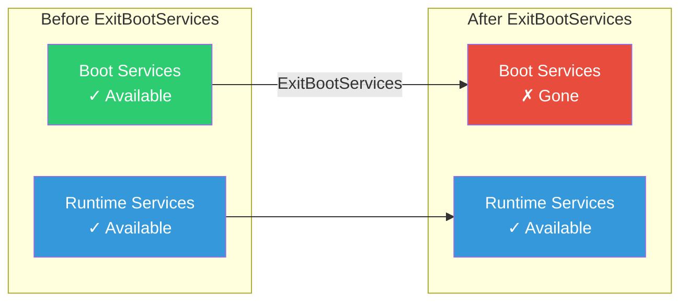
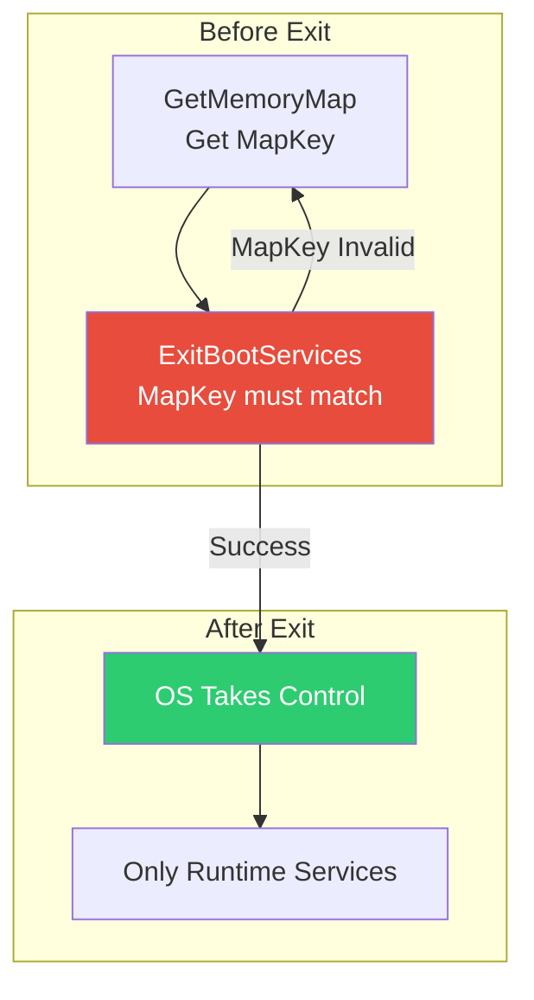

# Chapter 7: Boot & Runtime Services
{: .fs-9 }

Understanding the two service tables and the critical ExitBootServices transition.
{: .fs-6 .fw-300 }

---

## Overview

### When to Use Boot vs Runtime Services

{: .important }
> **Use Boot Services when you need to:**
> - Allocate memory, load images, manage protocols (most firmware operations)
> - Access hardware during boot phase
> - Perform any operation that won't be needed after OS takes control
>
> **Use Runtime Services when you need to:**
> - Access UEFI variables from the OS (GetVariable, SetVariable)
> - Get/set system time from the OS
> - Trigger system reset or capsule update from the OS

| Operation | Service Type | Why |
|:----------|:-------------|:----|
| **Install a driver** | Boot Services | Protocol database gone after EBS |
| **Read BootOrder variable** | Either | Boot or Runtime both work |
| **Write a variable from OS** | Runtime Services | Only runtime available after EBS |
| **Allocate memory** | Boot Services | Use before ExitBootServices |
| **Reset system from OS** | Runtime Services | ResetSystem() works anytime |
| **Load UEFI shell** | Boot Services | LoadImage/StartImage |

**Who Uses What:**

| Role | Primary Services | Typical Operations |
|:-----|:-----------------|:-------------------|
| **UEFI Application** | Boot Services | Everything during boot |
| **DXE Driver** | Boot Services | Protocol installation, memory |
| **Runtime Driver** | Both → Runtime only | Variable access from OS |
| **Boot Loader** | Boot → GetMemoryMap → Exit | Memory map, ExitBootServices |
| **OS Kernel** | Runtime Services | Variables, time, reset |

**Critical ExitBootServices Transition:**
- Boot Services terminate permanently - no more protocol access
- Memory map becomes final - OS takes memory ownership
- Runtime drivers convert to virtual addresses if OS requests
- Only Runtime Services remain callable

### Two Service Tables

UEFI provides two distinct sets of services:

| Service Table | Available | Purpose |
|:--------------|:----------|:--------|
| **Boot Services** | DXE → ExitBootServices | Full system access, drivers, protocols |
| **Runtime Services** | Always (after DXE) | Limited OS-accessible services |



### Boot Services Overview

Boot Services are only available during boot:

| Category | Services |
|:---------|:---------|
| **Task Priority** | RaiseTPL, RestoreTPL |
| **Memory** | AllocatePages, FreePages, AllocatePool, FreePool, GetMemoryMap |
| **Events** | CreateEvent, SetTimer, WaitForEvent, SignalEvent, CloseEvent |
| **Protocols** | InstallProtocol, OpenProtocol, LocateProtocol, etc. |
| **Images** | LoadImage, StartImage, UnloadImage, Exit |
| **Misc** | SetWatchdogTimer, Stall, CopyMem, SetMem |

### Runtime Services Overview

Runtime Services survive ExitBootServices:

| Category | Services |
|:---------|:---------|
| **Variable** | GetVariable, SetVariable, GetNextVariableName, QueryVariableInfo |
| **Time** | GetTime, SetTime, GetWakeupTime, SetWakeupTime |
| **Virtual Memory** | SetVirtualAddressMap, ConvertPointer |
| **Misc** | ResetSystem, GetNextHighMonotonicCount, UpdateCapsule |

---

## Initialization

### Service Table Setup

The System Table provides access to both service tables:

```c
//
// In your UEFI application or driver
//
EFI_STATUS
EFIAPI
UefiMain (
  IN EFI_HANDLE        ImageHandle,
  IN EFI_SYSTEM_TABLE  *SystemTable
  )
{
  //
  // Boot Services
  //
  EFI_BOOT_SERVICES *BS = SystemTable->BootServices;

  //
  // Runtime Services
  //
  EFI_RUNTIME_SERVICES *RS = SystemTable->RuntimeServices;

  //
  // Or use global variables (from libraries)
  //
  // gBS = Boot Services (from UefiBootServicesTableLib)
  // gRT = Runtime Services (from UefiRuntimeServicesTableLib)
  // gST = System Table (from UefiLib)
  //

  return EFI_SUCCESS;
}
```

### Global Variables from Libraries

```c
#include <Library/UefiBootServicesTableLib.h>
#include <Library/UefiRuntimeServicesTableLib.h>
#include <Library/UefiLib.h>

// These are initialized by the entry point library:
// gBS  - EFI_BOOT_SERVICES*
// gRT  - EFI_RUNTIME_SERVICES*
// gST  - EFI_SYSTEM_TABLE*
```

### ExitBootServices Transition

The critical moment when boot ends:



```c
EFI_STATUS
CallExitBootServices (
  IN EFI_HANDLE  ImageHandle
  )
{
  EFI_STATUS Status;
  EFI_MEMORY_DESCRIPTOR *MemoryMap;
  UINTN MemoryMapSize;
  UINTN MapKey;
  UINTN DescriptorSize;
  UINT32 DescriptorVersion;

RetryExit:
  //
  // Get the memory map
  //
  MemoryMapSize = 0;
  gBS->GetMemoryMap(&MemoryMapSize, NULL, &MapKey, &DescriptorSize, &DescriptorVersion);

  MemoryMapSize += 2 * DescriptorSize;
  MemoryMap = AllocatePool(MemoryMapSize);

  Status = gBS->GetMemoryMap(
             &MemoryMapSize,
             MemoryMap,
             &MapKey,
             &DescriptorSize,
             &DescriptorVersion
           );

  if (EFI_ERROR(Status)) {
    FreePool(MemoryMap);
    return Status;
  }

  //
  // Exit Boot Services
  // CRITICAL: No allocations between GetMemoryMap and ExitBootServices!
  //
  Status = gBS->ExitBootServices(ImageHandle, MapKey);

  if (Status == EFI_INVALID_PARAMETER) {
    //
    // MapKey was invalid - memory map changed
    // Must retry (do NOT free MemoryMap - Boot Services are gone!)
    //
    goto RetryExit;
  }

  //
  // Boot Services are now GONE
  // Only Runtime Services available from here
  //

  return Status;
}
```

### Virtual Address Conversion

Runtime drivers must handle virtual address conversion:

```c
VOID *gMyRuntimeData;

VOID
EFIAPI
VirtualAddressChangeCallback (
  IN EFI_EVENT  Event,
  IN VOID       *Context
  )
{
  //
  // Convert runtime data pointers from physical to virtual
  //
  EfiConvertPointer(0, (VOID **)&gMyRuntimeData);
  EfiConvertPointer(0, (VOID **)&gRT);
}

//
// Register during driver init
//
EFI_EVENT VirtualAddressChangeEvent;

gBS->CreateEventEx(
       EVT_NOTIFY_SIGNAL,
       TPL_NOTIFY,
       VirtualAddressChangeCallback,
       NULL,
       &gEfiEventVirtualAddressChangeGuid,
       &VirtualAddressChangeEvent
     );
```

---

## Configuration

### Runtime Driver Requirements

For MODULE_TYPE = DXE_RUNTIME_DRIVER:

```ini
[Defines]
  MODULE_TYPE     = DXE_RUNTIME_DRIVER
  ENTRY_POINT     = RuntimeDriverEntryPoint

[LibraryClasses]
  UefiDriverEntryPoint
  UefiRuntimeLib           # For EfiConvertPointer
  UefiRuntimeServicesTableLib

[Depex]
  gEfiVariableArchProtocolGuid AND
  gEfiVariableWriteArchProtocolGuid
```

### Memory for Runtime

Runtime drivers must use special memory:

```c
//
// Allocate runtime memory (survives ExitBootServices)
//
Status = gBS->AllocatePool(
           EfiRuntimeServicesData,  // NOT EfiBootServicesData!
           Size,
           &RuntimeBuffer
         );

//
// Or for code
//
Status = gBS->AllocatePages(
           AllocateAnyPages,
           EfiRuntimeServicesCode,  // For executable runtime code
           Pages,
           &CodeAddress
         );
```

### SetVirtualAddressMap Handling

```c
//
// Runtime data structure
//
typedef struct {
  UINT32    Signature;
  VOID      *PhysicalBase;   // Will be converted
  VOID      *VirtualBase;    // Set by OS
  UINTN     Size;
} MY_RUNTIME_DATA;

MY_RUNTIME_DATA *gRuntimeData;

VOID
EFIAPI
ConvertPointers (
  IN EFI_EVENT  Event,
  IN VOID       *Context
  )
{
  //
  // Convert internal pointers
  //
  gRT->ConvertPointer(0, (VOID **)&gRuntimeData->PhysicalBase);
  gRT->ConvertPointer(0, (VOID **)&gRuntimeData);
}
```

---

## Porting Guide

### OS-Specific Considerations

Different operating systems handle runtime services differently:

| OS | Virtual Addressing | Notes |
|:---|:-------------------|:------|
| **Linux** | Uses SetVirtualAddressMap | Calls with kernel virtual addresses |
| **Windows** | Uses SetVirtualAddressMap | Maps runtime regions into kernel |
| **Bare Metal** | May use physical | Some don't call SetVirtualAddressMap |

### Platform Differences

```c
//
// Platform-specific runtime considerations
//
#if defined(MDE_CPU_X64)
  //
  // x64: Runtime services use MS ABI calling convention
  // even on Linux (which normally uses System V ABI)
  //
#elif defined(MDE_CPU_AARCH64)
  //
  // ARM64: Runtime services must handle:
  // - MMU state changes
  // - Cache maintenance
  // - EL1 vs EL2 execution
  //
#endif
```

### Runtime Service Availability

Not all runtime services are always available:

| Service | Availability Notes |
|:--------|:-------------------|
| GetTime | May not work without RTC hardware |
| SetTime | May be restricted |
| GetVariable | Always available |
| SetVariable | May be read-only after boot |
| ResetSystem | Always available |
| UpdateCapsule | Platform-dependent |

---

## Using Runtime Services

### Variable Services

```c
//
// Read a variable
//
EFI_STATUS
ReadMyVariable (
  OUT UINT32  *Value
  )
{
  EFI_STATUS Status;
  UINTN Size = sizeof(UINT32);

  Status = gRT->GetVariable(
             L"MyVariable",
             &gMyVendorGuid,
             NULL,        // Attributes (optional)
             &Size,
             Value
           );

  return Status;
}

//
// Write a variable
//
EFI_STATUS
WriteMyVariable (
  IN UINT32  Value
  )
{
  return gRT->SetVariable(
           L"MyVariable",
           &gMyVendorGuid,
           EFI_VARIABLE_NON_VOLATILE |
           EFI_VARIABLE_BOOTSERVICE_ACCESS |
           EFI_VARIABLE_RUNTIME_ACCESS,
           sizeof(Value),
           &Value
         );
}
```

### Time Services

```c
//
// Get current time
//
EFI_STATUS
GetCurrentTime (
  OUT EFI_TIME  *Time
  )
{
  return gRT->GetTime(Time, NULL);
}

//
// Set time
//
EFI_STATUS
SetCurrentTime (
  IN EFI_TIME  *Time
  )
{
  return gRT->SetTime(Time);
}
```

### Reset System

```c
//
// Reboot the system
//
VOID
RebootSystem (
  VOID
  )
{
  gRT->ResetSystem(EfiResetCold, EFI_SUCCESS, 0, NULL);
  // Does not return
}

//
// Shutdown
//
VOID
ShutdownSystem (
  VOID
  )
{
  gRT->ResetSystem(EfiResetShutdown, EFI_SUCCESS, 0, NULL);
  // Does not return
}
```

---

## Example: Services Demo

```c
/** @file
  Boot and Runtime Services Demonstration
**/

#include <Uefi.h>
#include <Library/UefiLib.h>
#include <Library/UefiBootServicesTableLib.h>
#include <Library/UefiRuntimeServicesTableLib.h>

EFI_STATUS
EFIAPI
UefiMain (
  IN EFI_HANDLE        ImageHandle,
  IN EFI_SYSTEM_TABLE  *SystemTable
  )
{
  EFI_STATUS Status;
  EFI_TIME Time;
  UINT32 Counter;
  UINTN Size;

  Print(L"=== Boot & Runtime Services Demo ===\n\n");

  //
  // Boot Services demo
  //
  Print(L"Boot Services (available now):\n");

  // Timer
  Print(L"  Stalling for 1 second...\n");
  gBS->Stall(1000000);  // 1 second in microseconds
  Print(L"  Done.\n\n");

  //
  // Runtime Services demo
  //
  Print(L"Runtime Services (available now and after OS boot):\n");

  // Get time
  Status = gRT->GetTime(&Time, NULL);
  if (!EFI_ERROR(Status)) {
    Print(L"  Current Time: %04d-%02d-%02d %02d:%02d:%02d\n",
      Time.Year, Time.Month, Time.Day,
      Time.Hour, Time.Minute, Time.Second
    );
  }

  // Get monotonic counter
  Status = gRT->GetNextHighMonotonicCount(&Counter);
  if (!EFI_ERROR(Status)) {
    Print(L"  Monotonic Counter: 0x%08x\n", Counter);
  }

  // Query variable info
  {
    UINT64 MaxStorage, RemainingStorage, MaxSize;

    Status = gRT->QueryVariableInfo(
               EFI_VARIABLE_NON_VOLATILE |
               EFI_VARIABLE_BOOTSERVICE_ACCESS,
               &MaxStorage,
               &RemainingStorage,
               &MaxSize
             );

    if (!EFI_ERROR(Status)) {
      Print(L"  Variable Storage:\n");
      Print(L"    Max Storage: %ld bytes\n", MaxStorage);
      Print(L"    Remaining:   %ld bytes\n", RemainingStorage);
      Print(L"    Max Var Size: %ld bytes\n", MaxSize);
    }
  }

  Print(L"\n");

  //
  // Show service table versions
  //
  Print(L"Service Table Info:\n");
  Print(L"  Boot Services Revision:    0x%08x\n", gBS->Hdr.Revision);
  Print(L"  Runtime Services Revision: 0x%08x\n", gRT->Hdr.Revision);
  Print(L"  System Table Revision:     0x%08x\n", gST->Hdr.Revision);

  Print(L"\nPress 'R' to reboot, 'S' to shutdown, or any other key to exit...\n");

  {
    EFI_INPUT_KEY Key;
    UINTN Index;

    gBS->WaitForEvent(1, &gST->ConIn->WaitForKey, &Index);
    gST->ConIn->ReadKeyStroke(gST->ConIn, &Key);

    if (Key.UnicodeChar == L'R' || Key.UnicodeChar == L'r') {
      Print(L"Rebooting...\n");
      gRT->ResetSystem(EfiResetCold, EFI_SUCCESS, 0, NULL);
    } else if (Key.UnicodeChar == L'S' || Key.UnicodeChar == L's') {
      Print(L"Shutting down...\n");
      gRT->ResetSystem(EfiResetShutdown, EFI_SUCCESS, 0, NULL);
    }
  }

  return EFI_SUCCESS;
}
```

---

## Service Reference

### Boot Services Summary

| Service | Category | Description |
|:--------|:---------|:------------|
| `AllocatePool` | Memory | Allocate buffer |
| `FreePool` | Memory | Free buffer |
| `AllocatePages` | Memory | Allocate pages |
| `FreePages` | Memory | Free pages |
| `GetMemoryMap` | Memory | Get memory layout |
| `CreateEvent` | Event | Create event object |
| `SetTimer` | Event | Configure timer |
| `WaitForEvent` | Event | Wait for events |
| `SignalEvent` | Event | Trigger event |
| `InstallProtocolInterface` | Protocol | Add protocol |
| `LocateProtocol` | Protocol | Find protocol |
| `OpenProtocol` | Protocol | Access protocol |
| `LoadImage` | Image | Load EFI file |
| `StartImage` | Image | Execute image |
| `Exit` | Image | Return from image |
| `ExitBootServices` | Transition | End boot phase |

### Runtime Services Summary

| Service | Description |
|:--------|:------------|
| `GetVariable` | Read UEFI variable |
| `SetVariable` | Write UEFI variable |
| `GetNextVariableName` | Enumerate variables |
| `QueryVariableInfo` | Get storage info |
| `GetTime` | Get RTC time |
| `SetTime` | Set RTC time |
| `GetWakeupTime` | Get alarm |
| `SetWakeupTime` | Set alarm |
| `SetVirtualAddressMap` | Enable virtual addressing |
| `ConvertPointer` | Convert address |
| `ResetSystem` | Reboot/shutdown |
| `GetNextHighMonotonicCount` | Counter |
| `UpdateCapsule` | Firmware update |

---

## UEFI Specification Reference

- **UEFI Spec Section 7**: Services - Boot Services
- **UEFI Spec Section 8**: Services - Runtime Services
- **UEFI Spec Section 7.4**: Event, Timer, and Task Priority Services
- **UEFI Spec Section 8.5**: Variable Services

---

## Summary

1. **Boot Services** available during boot, gone after ExitBootServices
2. **Runtime Services** available always (after DXE)
3. **ExitBootServices** is the critical transition point
4. **MapKey must match** when calling ExitBootServices
5. **Runtime drivers** must handle virtual address conversion
6. **Use correct memory types** for runtime data

---

## Next Steps

- [Part 3: Essential Services](../part3/) - Console, Graphics, File System
- [Chapter 8: Console I/O](../part3/08-console-io.html) - Text input/output

---

{: .note }
> **Source Code**: See `examples/UefiGuidePkg/ServicesExample/` for complete examples.
