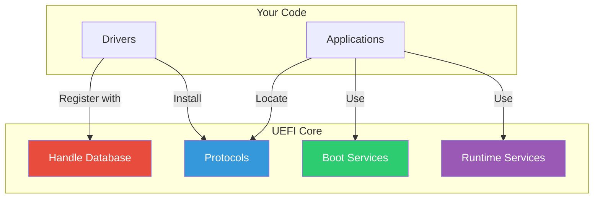

# Part 2: Core Concepts
{: .fs-9 }

Master the fundamental building blocks of UEFI firmware.
{: .fs-6 .fw-300 }

---

## What You'll Learn

| Chapter | Topics |
|:--------|:-------|
| **[4. Driver Model](04-driver-model/)** | Drivers vs applications, binding protocol, driver types |
| **[5. Protocols and Handles](05-protocols-handles/)** | Handle database, GUIDs, protocol installation |
| **[6. Memory Services](06-memory-services/)** | Pool/page allocation, memory map, memory types |
| **[7. Boot & Runtime Services](07-boot-runtime-services/)** | Service tables, ExitBootServices, runtime access |

## Key Concepts

## Prerequisites

Before starting this section:
- Complete Part 1 (environment setup and Hello World)
- Understand basic UEFI boot flow

---

{: .note }
> **Skill Level:** Intermediate
> **Prerequisites:** Part 1 complete, basic C programming
