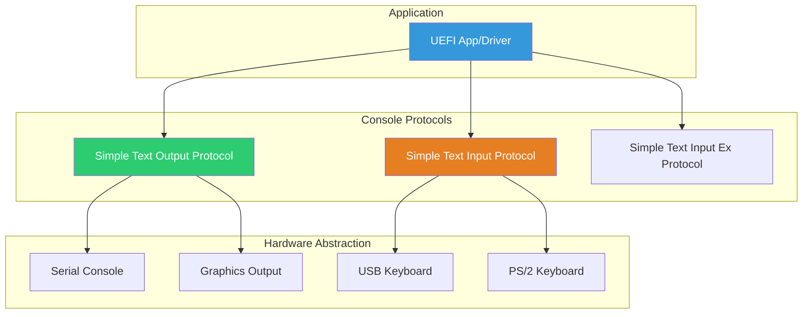

# Chapter 8: Console I/O
{: .fs-9 }

Text input and output using Simple Text protocols.
{: .fs-6 .fw-300 }

---

## Overview

### When to Use Console I/O

{: .important }
> **Use Console I/O when you need to:**
> - Display text messages, menus, or prompts to the user
> - Read keyboard input for user interaction
> - Create text-based user interfaces (setup utilities, boot menus)
> - Output debug or status information during boot

| Scenario | Protocol | Function |
|:---------|:---------|:---------|
| **Display status messages** | SimpleTextOut | OutputString, Print |
| **Wait for keypress** | SimpleTextIn | WaitForKey + ReadKeyStroke |
| **Detect modifier keys (Ctrl, Alt)** | SimpleTextInputEx | ReadKeyStrokeEx |
| **Register hotkeys** | SimpleTextInputEx | RegisterKeyNotify |
| **Create colored menus** | SimpleTextOut | SetAttribute |
| **Position cursor for UI** | SimpleTextOut | SetCursorPosition |

**Console I/O vs Graphics Output:**

| Factor | Console I/O | Graphics Output (GOP) |
|:-------|:------------|:---------------------|
| **Content type** | Text only | Pixels/graphics |
| **Complexity** | Simple | Complex |
| **Font control** | None | Full control |
| **Use case** | Diagnostics, menus | Boot splash, graphical UI |
| **Availability** | Almost always | May not exist (servers) |

**Typical Console Users:**
- **Setup utilities**: BIOS/UEFI configuration menus
- **Boot managers**: Text-based boot selection (GRUB menu)
- **Diagnostic tools**: Memory test, hardware info display
- **Shell applications**: Interactive command-line tools
- **Debug output**: Development and troubleshooting messages

### Console Architecture

UEFI provides a unified console abstraction that works across different hardware:



### Console Protocols

| Protocol | GUID | Purpose |
|:---------|:-----|:--------|
| **Simple Text Input** | `387477c1-69c7-11d2-8e39-00a0c969723b` | Basic keyboard input |
| **Simple Text Input Ex** | `dd9e7534-7762-4698-8c14-f58517a625aa` | Extended input with modifiers |
| **Simple Text Output** | `387477c2-69c7-11d2-8e39-00a0c969723b` | Text display output |

### Console Handles

The System Table provides direct access to standard consoles:

```c
//
// Standard console handles from System Table
//
EFI_SYSTEM_TABLE *gST;

// Input console
EFI_SIMPLE_TEXT_INPUT_PROTOCOL  *ConIn  = gST->ConIn;
EFI_HANDLE                      ConInHandle = gST->ConsoleInHandle;

// Output console
EFI_SIMPLE_TEXT_OUTPUT_PROTOCOL *ConOut = gST->ConOut;
EFI_HANDLE                      ConOutHandle = gST->ConsoleOutHandle;

// Error output (may be same as ConOut)
EFI_SIMPLE_TEXT_OUTPUT_PROTOCOL *StdErr = gST->StdErr;
EFI_HANDLE                      StdErrHandle = gST->StandardErrorHandle;
```

---

## Initialization

### Basic Console Access

```c
#include <Uefi.h>
#include <Library/UefiLib.h>
#include <Library/UefiBootServicesTableLib.h>
#include <Protocol/SimpleTextIn.h>
#include <Protocol/SimpleTextOut.h>

EFI_STATUS
EFIAPI
InitializeConsole (
  IN EFI_SYSTEM_TABLE  *SystemTable
  )
{
  //
  // Console protocols are already available via System Table
  // No additional initialization needed for basic use
  //
  if (SystemTable->ConOut == NULL) {
    return EFI_NOT_READY;
  }

  if (SystemTable->ConIn == NULL) {
    return EFI_NOT_READY;
  }

  //
  // Reset consoles to known state
  //
  SystemTable->ConOut->Reset(SystemTable->ConOut, FALSE);
  SystemTable->ConIn->Reset(SystemTable->ConIn, FALSE);

  return EFI_SUCCESS;
}
```

### Locating Additional Consoles

```c
EFI_STATUS
FindAllTextOutputDevices (
  VOID
  )
{
  EFI_STATUS Status;
  EFI_HANDLE *HandleBuffer;
  UINTN HandleCount;
  UINTN Index;
  EFI_SIMPLE_TEXT_OUTPUT_PROTOCOL *TextOut;

  //
  // Find all handles with Simple Text Output Protocol
  //
  Status = gBS->LocateHandleBuffer(
             ByProtocol,
             &gEfiSimpleTextOutProtocolGuid,
             NULL,
             &HandleCount,
             &HandleBuffer
           );

  if (EFI_ERROR(Status)) {
    return Status;
  }

  Print(L"Found %d text output devices:\n", HandleCount);

  for (Index = 0; Index < HandleCount; Index++) {
    Status = gBS->HandleProtocol(
               HandleBuffer[Index],
               &gEfiSimpleTextOutProtocolGuid,
               (VOID **)&TextOut
             );

    if (!EFI_ERROR(Status)) {
      //
      // Query device capabilities
      //
      UINTN Columns, Rows;
      Status = TextOut->QueryMode(TextOut, TextOut->Mode->Mode, &Columns, &Rows);

      if (!EFI_ERROR(Status)) {
        Print(L"  Device %d: %dx%d\n", Index, Columns, Rows);
      }
    }
  }

  gBS->FreePool(HandleBuffer);
  return EFI_SUCCESS;
}
```

### Extended Input Protocol

```c
#include <Protocol/SimpleTextInEx.h>

EFI_SIMPLE_TEXT_INPUT_EX_PROTOCOL *gTextInputEx;

EFI_STATUS
InitializeExtendedInput (
  VOID
  )
{
  EFI_STATUS Status;

  //
  // Locate Extended Input Protocol
  //
  Status = gBS->LocateProtocol(
             &gEfiSimpleTextInputExProtocolGuid,
             NULL,
             (VOID **)&gTextInputEx
           );

  if (EFI_ERROR(Status)) {
    Print(L"Extended Input not available\n");
    return Status;
  }

  return EFI_SUCCESS;
}
```

---

## Configuration

### Output Mode Configuration

```c
EFI_STATUS
ConfigureOutputMode (
  IN EFI_SIMPLE_TEXT_OUTPUT_PROTOCOL  *TextOut,
  IN UINTN                            DesiredColumns,
  IN UINTN                            DesiredRows
  )
{
  EFI_STATUS Status;
  UINTN ModeNumber;
  UINTN Columns, Rows;
  UINTN BestMode = 0;
  UINTN BestColumns = 0;
  UINTN BestRows = 0;

  //
  // Enumerate all supported modes
  //
  for (ModeNumber = 0; ModeNumber < (UINTN)TextOut->Mode->MaxMode; ModeNumber++) {
    Status = TextOut->QueryMode(TextOut, ModeNumber, &Columns, &Rows);

    if (EFI_ERROR(Status)) {
      continue;
    }

    Print(L"Mode %d: %dx%d\n", ModeNumber, Columns, Rows);

    //
    // Find best match for desired size
    //
    if (Columns >= DesiredColumns && Rows >= DesiredRows) {
      if (Columns <= BestColumns || BestColumns == 0) {
        BestMode = ModeNumber;
        BestColumns = Columns;
        BestRows = Rows;
      }
    }
  }

  //
  // Set the best mode
  //
  if (BestColumns > 0) {
    Status = TextOut->SetMode(TextOut, BestMode);
    if (!EFI_ERROR(Status)) {
      Print(L"Set mode %d (%dx%d)\n", BestMode, BestColumns, BestRows);
    }
  }

  return Status;
}
```

### Text Attributes

```c
//
// Text attribute values
//
// Foreground colors (bits 0-3)
#define EFI_BLACK         0x00
#define EFI_BLUE          0x01
#define EFI_GREEN         0x02
#define EFI_CYAN          0x03
#define EFI_RED           0x04
#define EFI_MAGENTA       0x05
#define EFI_BROWN         0x06
#define EFI_LIGHTGRAY     0x07
#define EFI_DARKGRAY      0x08
#define EFI_LIGHTBLUE     0x09
#define EFI_LIGHTGREEN    0x0A
#define EFI_LIGHTCYAN     0x0B
#define EFI_LIGHTRED      0x0C
#define EFI_LIGHTMAGENTA  0x0D
#define EFI_YELLOW        0x0E
#define EFI_WHITE         0x0F

// Background colors (bits 4-6)
#define EFI_BACKGROUND_BLACK      0x00
#define EFI_BACKGROUND_BLUE       0x10
#define EFI_BACKGROUND_GREEN      0x20
#define EFI_BACKGROUND_CYAN       0x30
#define EFI_BACKGROUND_RED        0x40
#define EFI_BACKGROUND_MAGENTA    0x50
#define EFI_BACKGROUND_BROWN      0x60
#define EFI_BACKGROUND_LIGHTGRAY  0x70

//
// Macro to create attribute
//
#define EFI_TEXT_ATTR(Foreground, Background) \
  ((Foreground) | ((Background) << 4))

EFI_STATUS
SetTextColors (
  IN EFI_SIMPLE_TEXT_OUTPUT_PROTOCOL  *TextOut,
  IN UINTN                            Foreground,
  IN UINTN                            Background
  )
{
  return TextOut->SetAttribute(
           TextOut,
           EFI_TEXT_ATTR(Foreground, Background)
         );
}
```

### Cursor Control

```c
EFI_STATUS
ConfigureCursor (
  IN EFI_SIMPLE_TEXT_OUTPUT_PROTOCOL  *TextOut,
  IN BOOLEAN                          Visible,
  IN UINTN                            Column,
  IN UINTN                            Row
  )
{
  EFI_STATUS Status;

  //
  // Set cursor visibility
  //
  Status = TextOut->EnableCursor(TextOut, Visible);
  if (EFI_ERROR(Status)) {
    return Status;
  }

  //
  // Set cursor position
  //
  Status = TextOut->SetCursorPosition(TextOut, Column, Row);

  return Status;
}

//
// Get current cursor position from Mode structure
//
VOID
GetCursorPosition (
  IN  EFI_SIMPLE_TEXT_OUTPUT_PROTOCOL  *TextOut,
  OUT UINTN                            *Column,
  OUT UINTN                            *Row
  )
{
  *Column = TextOut->Mode->CursorColumn;
  *Row = TextOut->Mode->CursorRow;
}
```

---

## Porting Guide

### Platform Console Configuration

Different platforms configure consoles differently:

| Platform Type | Primary Console | Configuration |
|:--------------|:----------------|:--------------|
| **Server** | Serial (COM port) | PcdDefaultTerminal |
| **Desktop** | GOP (Graphics) | Video output |
| **Embedded** | Serial or None | May have no console |
| **Virtual** | Serial or virtio | QEMU uses serial |

### Serial Console Setup

```c
//
// Platform DSC settings for serial console
//
// [PcdsFixedAtBuild]
//   gEfiMdeModulePkgTokenSpaceGuid.PcdConOutGopSupport|FALSE
//   gEfiMdeModulePkgTokenSpaceGuid.PcdConOutUgaSupport|FALSE
//   gEfiMdePkgTokenSpaceGuid.PcdUartDefaultBaudRate|115200
//   gEfiMdePkgTokenSpaceGuid.PcdUartDefaultDataBits|8
//   gEfiMdePkgTokenSpaceGuid.PcdUartDefaultParity|1
//   gEfiMdePkgTokenSpaceGuid.PcdUartDefaultStopBits|1
//
```

### Console Redirection

```c
//
// Redirect output to multiple devices (splitter)
//
// ConSplitter driver handles multiple output devices
// All registered consoles receive output simultaneously
//

//
// Add custom console device
//
EFI_STATUS
RegisterCustomConsole (
  IN EFI_HANDLE                        DeviceHandle,
  IN EFI_SIMPLE_TEXT_OUTPUT_PROTOCOL   *CustomTextOut
  )
{
  EFI_STATUS Status;

  //
  // Install protocol on device handle
  //
  Status = gBS->InstallProtocolInterface(
             &DeviceHandle,
             &gEfiSimpleTextOutProtocolGuid,
             EFI_NATIVE_INTERFACE,
             CustomTextOut
           );

  //
  // ConSplitter will automatically detect and add to splitter
  //

  return Status;
}
```

### Terminal Types

```c
//
// Supported terminal emulation types
//
typedef enum {
  PCANSI,      // PC ANSI
  VT100,       // DEC VT100
  VT100Plus,   // VT100+
  VTUTF8,      // VT-UTF8
  TTYTerm,     // TTY Terminal
  LINUX,       // Linux console
  XTERM,       // XTerm
  SCO          // SCO console
} TERMINAL_TYPE;

//
// Set via PCDs:
// gEfiMdePkgTokenSpaceGuid.PcdDefaultTerminalType|0
// 0 = PCANSI, 1 = VT100, 2 = VT100+, 3 = VTUTF8
//
```

### Hot-Plug Console Support

```c
//
// Register for console connect events
//
EFI_STATUS
RegisterConsoleCallback (
  VOID
  )
{
  EFI_STATUS Status;
  EFI_EVENT ConnectEvent;
  VOID *Registration;

  //
  // Create event for protocol notification
  //
  Status = gBS->CreateEvent(
             EVT_NOTIFY_SIGNAL,
             TPL_CALLBACK,
             ConsoleConnectCallback,
             NULL,
             &ConnectEvent
           );

  if (EFI_ERROR(Status)) {
    return Status;
  }

  //
  // Register for Simple Text Output protocol installations
  //
  Status = gBS->RegisterProtocolNotify(
             &gEfiSimpleTextOutProtocolGuid,
             ConnectEvent,
             &Registration
           );

  return Status;
}

VOID
EFIAPI
ConsoleConnectCallback (
  IN EFI_EVENT  Event,
  IN VOID       *Context
  )
{
  //
  // New console device connected
  // Could update console splitter, refresh display, etc.
  //
}
```

---

## Using Console I/O

### Basic Output

```c
//
// Simple text output
//
gST->ConOut->OutputString(gST->ConOut, L"Hello, World!\r\n");

//
// Using Print (requires UefiLib)
//
Print(L"Value: %d\n", 42);
Print(L"String: %s\n", L"test");
Print(L"Hex: 0x%08x\n", 0xDEADBEEF);

//
// Clear screen
//
gST->ConOut->ClearScreen(gST->ConOut);
```

### Formatted Output

```c
#include <Library/PrintLib.h>

CHAR16 Buffer[256];

//
// Format to buffer
//
UnicodeSPrint(Buffer, sizeof(Buffer), L"Count: %d, Name: %s\n", Count, Name);
gST->ConOut->OutputString(gST->ConOut, Buffer);

//
// Print with colors
//
gST->ConOut->SetAttribute(gST->ConOut, EFI_YELLOW | EFI_BACKGROUND_BLUE);
Print(L"Warning: Something happened\n");
gST->ConOut->SetAttribute(gST->ConOut, EFI_LIGHTGRAY | EFI_BACKGROUND_BLACK);
```

### Basic Input

```c
EFI_STATUS
ReadKey (
  OUT EFI_INPUT_KEY  *Key
  )
{
  EFI_STATUS Status;
  UINTN Index;

  //
  // Wait for key press
  //
  Status = gBS->WaitForEvent(1, &gST->ConIn->WaitForKey, &Index);
  if (EFI_ERROR(Status)) {
    return Status;
  }

  //
  // Read the key
  //
  Status = gST->ConIn->ReadKeyStroke(gST->ConIn, Key);

  return Status;
}

//
// Check for key without waiting
//
EFI_STATUS
CheckKey (
  OUT EFI_INPUT_KEY  *Key
  )
{
  return gST->ConIn->ReadKeyStroke(gST->ConIn, Key);
}
```

### Extended Input with Modifiers

```c
EFI_STATUS
ReadKeyEx (
  OUT EFI_KEY_DATA  *KeyData
  )
{
  EFI_STATUS Status;
  UINTN Index;

  if (gTextInputEx == NULL) {
    return EFI_NOT_READY;
  }

  //
  // Wait for key
  //
  Status = gBS->WaitForEvent(1, &gTextInputEx->WaitForKeyEx, &Index);
  if (EFI_ERROR(Status)) {
    return Status;
  }

  //
  // Read key with state information
  //
  Status = gTextInputEx->ReadKeyStrokeEx(gTextInputEx, KeyData);

  if (!EFI_ERROR(Status)) {
    //
    // Check modifier keys
    //
    if (KeyData->KeyState.KeyShiftState & EFI_SHIFT_STATE_VALID) {
      if (KeyData->KeyState.KeyShiftState & EFI_LEFT_CONTROL_PRESSED) {
        Print(L"[Ctrl] ");
      }
      if (KeyData->KeyState.KeyShiftState & EFI_LEFT_ALT_PRESSED) {
        Print(L"[Alt] ");
      }
      if (KeyData->KeyState.KeyShiftState & EFI_LEFT_SHIFT_PRESSED) {
        Print(L"[Shift] ");
      }
    }
  }

  return Status;
}
```

### Key Registration (Hotkeys)

```c
EFI_HANDLE gHotkeyHandle;

VOID
EFIAPI
HotkeyCallback (
  IN EFI_KEY_DATA  *KeyData
  )
{
  Print(L"\nHotkey pressed!\n");
}

EFI_STATUS
RegisterHotkey (
  IN UINT16  ScanCode,
  IN CHAR16  UnicodeChar,
  IN UINT32  KeyShiftState
  )
{
  EFI_STATUS Status;
  EFI_KEY_DATA KeyData;

  if (gTextInputEx == NULL) {
    return EFI_NOT_READY;
  }

  ZeroMem(&KeyData, sizeof(KeyData));
  KeyData.Key.ScanCode = ScanCode;
  KeyData.Key.UnicodeChar = UnicodeChar;
  KeyData.KeyState.KeyShiftState = KeyShiftState | EFI_SHIFT_STATE_VALID;

  Status = gTextInputEx->RegisterKeyNotify(
             gTextInputEx,
             &KeyData,
             HotkeyCallback,
             &gHotkeyHandle
           );

  return Status;
}

EFI_STATUS
UnregisterHotkey (
  VOID
  )
{
  if (gTextInputEx == NULL || gHotkeyHandle == NULL) {
    return EFI_NOT_READY;
  }

  return gTextInputEx->UnregisterKeyNotify(gTextInputEx, gHotkeyHandle);
}
```

---

## Example: Console Demo

```c
/** @file
  Console I/O Demonstration
**/

#include <Uefi.h>
#include <Library/UefiLib.h>
#include <Library/UefiBootServicesTableLib.h>
#include <Protocol/SimpleTextInEx.h>

EFI_STATUS
EFIAPI
UefiMain (
  IN EFI_HANDLE        ImageHandle,
  IN EFI_SYSTEM_TABLE  *SystemTable
  )
{
  EFI_STATUS Status;
  EFI_INPUT_KEY Key;
  UINTN Columns, Rows;
  UINTN Index;

  //
  // Get console size
  //
  Status = gST->ConOut->QueryMode(
             gST->ConOut,
             gST->ConOut->Mode->Mode,
             &Columns,
             &Rows
           );

  Print(L"=== Console I/O Demo ===\n\n");
  Print(L"Console size: %dx%d\n", Columns, Rows);
  Print(L"Current mode: %d (Max: %d)\n\n",
    gST->ConOut->Mode->Mode,
    gST->ConOut->Mode->MaxMode - 1
  );

  //
  // Demonstrate colors
  //
  Print(L"Color demonstration:\n");

  UINTN Colors[] = {
    EFI_RED, EFI_GREEN, EFI_BLUE,
    EFI_YELLOW, EFI_CYAN, EFI_MAGENTA
  };
  CHAR16 *ColorNames[] = {
    L"Red", L"Green", L"Blue",
    L"Yellow", L"Cyan", L"Magenta"
  };

  for (Index = 0; Index < 6; Index++) {
    gST->ConOut->SetAttribute(gST->ConOut, Colors[Index]);
    Print(L"  %s\n", ColorNames[Index]);
  }

  gST->ConOut->SetAttribute(gST->ConOut, EFI_LIGHTGRAY);
  Print(L"\n");

  //
  // Demonstrate cursor positioning
  //
  Print(L"Cursor positioning demo:\n");

  gST->ConOut->SetCursorPosition(gST->ConOut, 10, Rows - 3);
  Print(L"<-- This text is positioned");

  gST->ConOut->SetCursorPosition(gST->ConOut, 0, Rows - 2);

  //
  // Input demonstration
  //
  Print(L"\nPress keys (ESC to exit):\n");

  while (TRUE) {
    Status = gBS->WaitForEvent(1, &gST->ConIn->WaitForKey, &Index);

    Status = gST->ConIn->ReadKeyStroke(gST->ConIn, &Key);
    if (EFI_ERROR(Status)) {
      continue;
    }

    //
    // ESC key exits
    //
    if (Key.ScanCode == SCAN_ESC) {
      Print(L"\nExiting...\n");
      break;
    }

    //
    // Display key information
    //
    if (Key.UnicodeChar != 0) {
      Print(L"Char: '%c' (0x%04x) ", Key.UnicodeChar, Key.UnicodeChar);
    }
    if (Key.ScanCode != 0) {
      Print(L"Scan: 0x%04x ", Key.ScanCode);
    }
    Print(L"\n");
  }

  return EFI_SUCCESS;
}
```

---

## Protocol Reference

### Simple Text Output Protocol

```c
typedef struct _EFI_SIMPLE_TEXT_OUTPUT_PROTOCOL {
  EFI_TEXT_RESET           Reset;
  EFI_TEXT_STRING          OutputString;
  EFI_TEXT_TEST_STRING     TestString;
  EFI_TEXT_QUERY_MODE      QueryMode;
  EFI_TEXT_SET_MODE        SetMode;
  EFI_TEXT_SET_ATTRIBUTE   SetAttribute;
  EFI_TEXT_CLEAR_SCREEN    ClearScreen;
  EFI_TEXT_SET_CURSOR_POSITION SetCursorPosition;
  EFI_TEXT_ENABLE_CURSOR   EnableCursor;
  SIMPLE_TEXT_OUTPUT_MODE  *Mode;
} EFI_SIMPLE_TEXT_OUTPUT_PROTOCOL;
```

### Simple Text Input Protocol

```c
typedef struct _EFI_SIMPLE_TEXT_INPUT_PROTOCOL {
  EFI_INPUT_RESET     Reset;
  EFI_INPUT_READ_KEY  ReadKeyStroke;
  EFI_EVENT           WaitForKey;
} EFI_SIMPLE_TEXT_INPUT_PROTOCOL;
```

### Key Scan Codes

| Scan Code | Key |
|:----------|:----|
| `0x00` | No scan code (use UnicodeChar) |
| `0x01` | Up Arrow |
| `0x02` | Down Arrow |
| `0x03` | Right Arrow |
| `0x04` | Left Arrow |
| `0x05` | Home |
| `0x06` | End |
| `0x07` | Insert |
| `0x08` | Delete |
| `0x09` | Page Up |
| `0x0A` | Page Down |
| `0x0B`-`0x14` | F1-F10 |
| `0x17` | Escape |

---

## UEFI Specification Reference

- **UEFI Spec Section 12.3**: Simple Text Input Protocol
- **UEFI Spec Section 12.4**: Simple Text Input Ex Protocol
- **UEFI Spec Section 12.5**: Simple Text Output Protocol

---

## Summary

1. **Console protocols** provide hardware-independent text I/O
2. **System Table** provides direct access to ConIn/ConOut
3. **Extended Input** protocol supports modifier keys and hotkeys
4. **Text attributes** control foreground and background colors
5. **Cursor control** allows positioning and visibility
6. **Platform configuration** determines serial vs graphics console

---

## Next Steps

- [Chapter 9: Graphics Output](09-graphics-output.md) - Graphics and video
- [Chapter 10: File System Access](10-file-system.md) - File operations

---

{: .note }
> **Source Code**: See [`examples/UefiGuidePkg/ConsoleExample/`](https://github.com/MichaelTien8901/uefi-guide-tutorial/tree/main/examples/UefiGuidePkg/ConsoleExample) for complete examples.
