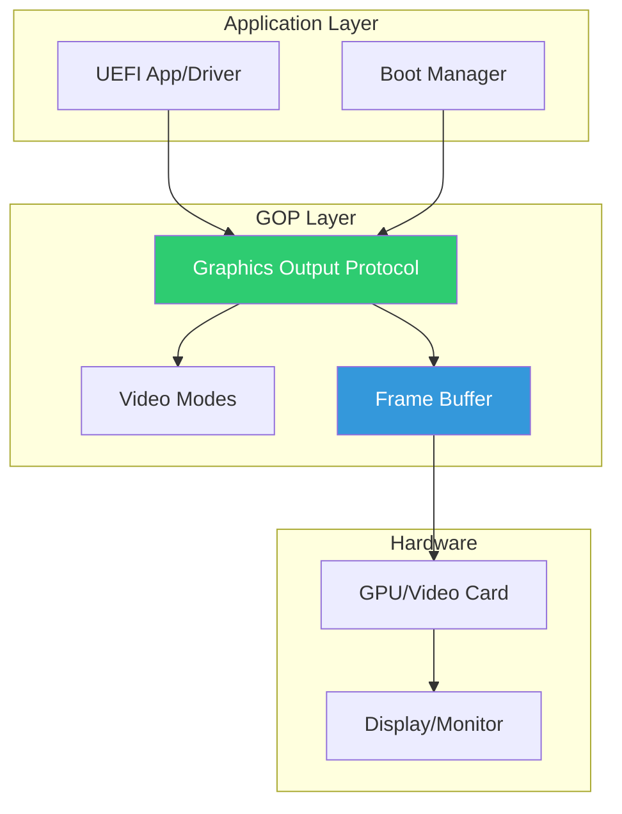

# Chapter 9: Graphics Output
{: .fs-9 }

Working with the Graphics Output Protocol (GOP) for graphical displays.
{: .fs-6 .fw-300 }

---

## Overview

### When to Use Graphics Output

{: .important }
> **Use GOP when you need to:**
> - Display graphical boot splash screens or logos
> - Create graphical user interfaces (boot menus with icons)
> - Draw progress bars, images, or complex visual elements
> - Access the raw framebuffer for custom rendering

| Scenario | GOP Feature | Example |
|:---------|:------------|:--------|
| **Boot splash screen** | Blt (BltBufferToVideo) | Display OEM logo |
| **Graphical boot menu** | Framebuffer + Blt | rEFInd, systemd-boot |
| **Progress indicator** | Blt (EfiBltVideoFill) | Draw colored rectangles |
| **Screenshot capture** | Blt (BltVideoToBltBuffer) | Save screen to file |
| **Video mode selection** | QueryMode/SetMode | Match display resolution |
| **Pass framebuffer to OS** | Mode->FrameBufferBase | Kernel early console |

**GOP vs Console I/O Decision:**

| Need | Use GOP | Use Console |
|:-----|:--------|:------------|
| **Simple text messages** | No | Yes |
| **Color text menus** | Either | Simpler |
| **Images or logos** | Yes | No |
| **Pixel-level control** | Yes | No |
| **Headless systems** | N/A | Yes |
| **Fast text output** | No | Yes |

**Typical GOP Users:**
- **OEM/ODM firmware**: Custom boot splash with company logo
- **Boot managers**: Graphical boot selection (rEFInd, Clover)
- **Diagnostic tools**: Visual memory maps, progress bars
- **Secure boot UI**: Graphical key enrollment interfaces
- **OS loaders**: Early framebuffer console before full driver

### Graphics Architecture

UEFI provides hardware-independent graphics through GOP:



### GOP vs UGA

| Feature | GOP (Modern) | UGA (Legacy) |
|:--------|:-------------|:-------------|
| **Introduced** | UEFI 2.0 | EFI 1.10 |
| **Frame Buffer** | Direct access | Abstracted |
| **Mode Query** | Detailed info | Limited |
| **Recommended** | Yes | No (deprecated) |

### GOP Capabilities

```c
//
// GOP provides:
// - Hardware-independent video mode setting
// - Direct frame buffer access
// - Blt (Block Transfer) operations
// - Multiple display support
//
```

---

## Initialization

### Locating GOP

```c
#include <Uefi.h>
#include <Library/UefiLib.h>
#include <Library/UefiBootServicesTableLib.h>
#include <Protocol/GraphicsOutput.h>

EFI_GRAPHICS_OUTPUT_PROTOCOL *gGop;

EFI_STATUS
InitializeGraphics (
  VOID
  )
{
  EFI_STATUS Status;
  EFI_HANDLE *HandleBuffer;
  UINTN HandleCount;

  //
  // Method 1: Locate any GOP instance
  //
  Status = gBS->LocateProtocol(
             &gEfiGraphicsOutputProtocolGuid,
             NULL,
             (VOID **)&gGop
           );

  if (!EFI_ERROR(Status)) {
    return EFI_SUCCESS;
  }

  //
  // Method 2: Find all GOP handles
  //
  Status = gBS->LocateHandleBuffer(
             ByProtocol,
             &gEfiGraphicsOutputProtocolGuid,
             NULL,
             &HandleCount,
             &HandleBuffer
           );

  if (EFI_ERROR(Status)) {
    Print(L"No graphics device found\n");
    return Status;
  }

  //
  // Use first available GOP
  //
  Status = gBS->HandleProtocol(
             HandleBuffer[0],
             &gEfiGraphicsOutputProtocolGuid,
             (VOID **)&gGop
           );

  gBS->FreePool(HandleBuffer);
  return Status;
}
```

### GOP on Console Output Handle

```c
EFI_STATUS
GetGopFromConsole (
  VOID
  )
{
  EFI_STATUS Status;

  //
  // GOP is often on the ConsoleOutHandle
  //
  Status = gBS->HandleProtocol(
             gST->ConsoleOutHandle,
             &gEfiGraphicsOutputProtocolGuid,
             (VOID **)&gGop
           );

  return Status;
}
```

### Multiple Displays

```c
EFI_STATUS
EnumerateDisplays (
  VOID
  )
{
  EFI_STATUS Status;
  EFI_HANDLE *HandleBuffer;
  UINTN HandleCount;
  UINTN Index;
  EFI_GRAPHICS_OUTPUT_PROTOCOL *Gop;

  Status = gBS->LocateHandleBuffer(
             ByProtocol,
             &gEfiGraphicsOutputProtocolGuid,
             NULL,
             &HandleCount,
             &HandleBuffer
           );

  if (EFI_ERROR(Status)) {
    return Status;
  }

  Print(L"Found %d display(s):\n", HandleCount);

  for (Index = 0; Index < HandleCount; Index++) {
    Status = gBS->HandleProtocol(
               HandleBuffer[Index],
               &gEfiGraphicsOutputProtocolGuid,
               (VOID **)&Gop
             );

    if (!EFI_ERROR(Status)) {
      Print(L"  Display %d: %dx%d\n",
        Index,
        Gop->Mode->Info->HorizontalResolution,
        Gop->Mode->Info->VerticalResolution
      );
    }
  }

  gBS->FreePool(HandleBuffer);
  return EFI_SUCCESS;
}
```

---

## Configuration

### Querying Video Modes

```c
EFI_STATUS
ListVideoModes (
  IN EFI_GRAPHICS_OUTPUT_PROTOCOL  *Gop
  )
{
  EFI_STATUS Status;
  UINTN ModeNumber;
  UINTN SizeOfInfo;
  EFI_GRAPHICS_OUTPUT_MODE_INFORMATION *Info;

  Print(L"Available video modes:\n");

  for (ModeNumber = 0; ModeNumber < Gop->Mode->MaxMode; ModeNumber++) {
    Status = Gop->QueryMode(Gop, ModeNumber, &SizeOfInfo, &Info);

    if (EFI_ERROR(Status)) {
      continue;
    }

    Print(L"  Mode %d: %dx%d ",
      ModeNumber,
      Info->HorizontalResolution,
      Info->VerticalResolution
    );

    //
    // Pixel format
    //
    switch (Info->PixelFormat) {
      case PixelRedGreenBlueReserved8BitPerColor:
        Print(L"(RGBX)\n");
        break;
      case PixelBlueGreenRedReserved8BitPerColor:
        Print(L"(BGRX)\n");
        break;
      case PixelBitMask:
        Print(L"(BitMask)\n");
        break;
      case PixelBltOnly:
        Print(L"(BltOnly - no framebuffer)\n");
        break;
      default:
        Print(L"(Unknown)\n");
        break;
    }

    gBS->FreePool(Info);
  }

  Print(L"Current mode: %d\n", Gop->Mode->Mode);

  return EFI_SUCCESS;
}
```

### Setting Video Mode

```c
EFI_STATUS
SetVideoMode (
  IN EFI_GRAPHICS_OUTPUT_PROTOCOL  *Gop,
  IN UINT32                        DesiredWidth,
  IN UINT32                        DesiredHeight
  )
{
  EFI_STATUS Status;
  UINTN ModeNumber;
  UINTN SizeOfInfo;
  EFI_GRAPHICS_OUTPUT_MODE_INFORMATION *Info;
  UINTN BestMode = 0;
  UINT32 BestWidth = 0;
  UINT32 BestHeight = 0;

  //
  // Find best matching mode
  //
  for (ModeNumber = 0; ModeNumber < Gop->Mode->MaxMode; ModeNumber++) {
    Status = Gop->QueryMode(Gop, ModeNumber, &SizeOfInfo, &Info);

    if (EFI_ERROR(Status)) {
      continue;
    }

    //
    // Skip BltOnly modes (no framebuffer)
    //
    if (Info->PixelFormat == PixelBltOnly) {
      gBS->FreePool(Info);
      continue;
    }

    //
    // Find closest match to desired resolution
    //
    if (Info->HorizontalResolution >= DesiredWidth &&
        Info->VerticalResolution >= DesiredHeight) {
      if (BestWidth == 0 ||
          Info->HorizontalResolution < BestWidth) {
        BestMode = ModeNumber;
        BestWidth = Info->HorizontalResolution;
        BestHeight = Info->VerticalResolution;
      }
    }

    gBS->FreePool(Info);
  }

  if (BestWidth == 0) {
    return EFI_NOT_FOUND;
  }

  //
  // Set the mode
  //
  Status = Gop->SetMode(Gop, BestMode);

  if (!EFI_ERROR(Status)) {
    Print(L"Set mode %d: %dx%d\n", BestMode, BestWidth, BestHeight);
  }

  return Status;
}
```

### Native Resolution

```c
EFI_STATUS
SetNativeResolution (
  IN EFI_GRAPHICS_OUTPUT_PROTOCOL  *Gop
  )
{
  EFI_STATUS Status;
  UINTN ModeNumber;
  UINTN SizeOfInfo;
  EFI_GRAPHICS_OUTPUT_MODE_INFORMATION *Info;
  UINTN NativeMode = 0;
  UINT32 MaxPixels = 0;

  //
  // Find mode with highest resolution (usually native)
  //
  for (ModeNumber = 0; ModeNumber < Gop->Mode->MaxMode; ModeNumber++) {
    Status = Gop->QueryMode(Gop, ModeNumber, &SizeOfInfo, &Info);

    if (EFI_ERROR(Status) || Info->PixelFormat == PixelBltOnly) {
      if (!EFI_ERROR(Status)) gBS->FreePool(Info);
      continue;
    }

    UINT32 Pixels = Info->HorizontalResolution * Info->VerticalResolution;
    if (Pixels > MaxPixels) {
      MaxPixels = Pixels;
      NativeMode = ModeNumber;
    }

    gBS->FreePool(Info);
  }

  return Gop->SetMode(Gop, NativeMode);
}
```

---

## Porting Guide

### Platform Graphics Configuration

```c
//
// DSC file settings for graphics support
//
// [PcdsFixedAtBuild]
//   # Enable GOP support for console
//   gEfiMdeModulePkgTokenSpaceGuid.PcdConOutGopSupport|TRUE
//
//   # Video resolution settings
//   gEfiMdeModulePkgTokenSpaceGuid.PcdVideoHorizontalResolution|1920
//   gEfiMdeModulePkgTokenSpaceGuid.PcdVideoVerticalResolution|1080
//
//   # Set GOP as preferred graphics protocol
//   gEfiMdeModulePkgTokenSpaceGuid.PcdUgaConsumeSupport|FALSE
//
```

### Headless Systems

```c
//
// For servers/embedded without display
//
// [PcdsFixedAtBuild]
//   gEfiMdeModulePkgTokenSpaceGuid.PcdConOutGopSupport|FALSE
//   gEfiMdeModulePkgTokenSpaceGuid.PcdVideoHorizontalResolution|0
//   gEfiMdeModulePkgTokenSpaceGuid.PcdVideoVerticalResolution|0
//

EFI_STATUS
CheckGraphicsAvailable (
  VOID
  )
{
  EFI_STATUS Status;
  EFI_GRAPHICS_OUTPUT_PROTOCOL *Gop;

  Status = gBS->LocateProtocol(
             &gEfiGraphicsOutputProtocolGuid,
             NULL,
             (VOID **)&Gop
           );

  if (EFI_ERROR(Status)) {
    //
    // No graphics - use serial console only
    //
    Print(L"Running in headless mode\n");
    return EFI_NOT_FOUND;
  }

  return EFI_SUCCESS;
}
```

### Virtual Machine Graphics

```c
//
// QEMU/VM graphics notes:
// - QEMU: Uses bochs-display or virtio-gpu
// - VMware: Uses SVGA driver
// - VirtualBox: Uses VBoxVGA
//
// All provide GOP, but with different capabilities
//

//
// Detect virtual environment
//
BOOLEAN
IsVirtualMachine (
  VOID
  )
{
  //
  // Check SMBIOS for VM indicators
  // This is a simplified check
  //
  EFI_STATUS Status;
  EFI_SMBIOS_PROTOCOL *Smbios;

  Status = gBS->LocateProtocol(
             &gEfiSmbiosProtocolGuid,
             NULL,
             (VOID **)&Smbios
           );

  //
  // Implementation would check SMBIOS strings for
  // "QEMU", "VMware", "VirtualBox", etc.
  //

  return FALSE;
}
```

---

## Drawing Operations

### Frame Buffer Access

```c
//
// GOP Mode Information
//
typedef struct {
  UINT32                       Version;
  UINT32                       HorizontalResolution;
  UINT32                       VerticalResolution;
  EFI_GRAPHICS_PIXEL_FORMAT    PixelFormat;
  EFI_PIXEL_BITMASK            PixelInformation;
  UINT32                       PixelsPerScanLine;
} EFI_GRAPHICS_OUTPUT_MODE_INFORMATION;

VOID
GetFrameBufferInfo (
  IN EFI_GRAPHICS_OUTPUT_PROTOCOL  *Gop
  )
{
  Print(L"Frame Buffer:\n");
  Print(L"  Base: 0x%lx\n", Gop->Mode->FrameBufferBase);
  Print(L"  Size: %ld bytes\n", Gop->Mode->FrameBufferSize);
  Print(L"  Resolution: %dx%d\n",
    Gop->Mode->Info->HorizontalResolution,
    Gop->Mode->Info->VerticalResolution
  );
  Print(L"  Pixels Per Scan Line: %d\n",
    Gop->Mode->Info->PixelsPerScanLine
  );
}
```

### Direct Pixel Drawing

```c
typedef struct {
  UINT8  Blue;
  UINT8  Green;
  UINT8  Red;
  UINT8  Reserved;
} EFI_GRAPHICS_OUTPUT_BLT_PIXEL;

VOID
DrawPixel (
  IN EFI_GRAPHICS_OUTPUT_PROTOCOL  *Gop,
  IN UINTN                         X,
  IN UINTN                         Y,
  IN UINT8                         Red,
  IN UINT8                         Green,
  IN UINT8                         Blue
  )
{
  EFI_GRAPHICS_OUTPUT_BLT_PIXEL Pixel;
  EFI_GRAPHICS_OUTPUT_BLT_PIXEL *FrameBuffer;
  UINTN Offset;

  //
  // Using Blt operation (recommended)
  //
  Pixel.Red = Red;
  Pixel.Green = Green;
  Pixel.Blue = Blue;
  Pixel.Reserved = 0;

  Gop->Blt(
    Gop,
    &Pixel,
    EfiBltVideoFill,
    0, 0,           // Source X, Y (not used for Fill)
    X, Y,           // Destination X, Y
    1, 1,           // Width, Height
    0               // Delta (not used for single pixel)
  );
}

VOID
DrawPixelDirect (
  IN EFI_GRAPHICS_OUTPUT_PROTOCOL  *Gop,
  IN UINTN                         X,
  IN UINTN                         Y,
  IN UINT32                        Color
  )
{
  //
  // Direct frame buffer access (faster but format-dependent)
  //
  UINT32 *FrameBuffer = (UINT32 *)(UINTN)Gop->Mode->FrameBufferBase;
  UINTN PixelsPerLine = Gop->Mode->Info->PixelsPerScanLine;

  FrameBuffer[Y * PixelsPerLine + X] = Color;
}
```

### Blt Operations

```c
//
// EFI_GRAPHICS_OUTPUT_BLT_OPERATION values:
//
// EfiBltVideoFill      - Fill rectangle with color
// EfiBltVideoToBltBuffer - Copy from screen to buffer
// EfiBltBufferToVideo  - Copy from buffer to screen
// EfiBltVideoToVideo   - Copy screen region to screen
//

EFI_STATUS
FillRectangle (
  IN EFI_GRAPHICS_OUTPUT_PROTOCOL  *Gop,
  IN UINTN                         X,
  IN UINTN                         Y,
  IN UINTN                         Width,
  IN UINTN                         Height,
  IN EFI_GRAPHICS_OUTPUT_BLT_PIXEL *Color
  )
{
  return Gop->Blt(
           Gop,
           Color,
           EfiBltVideoFill,
           0, 0,         // Source (not used)
           X, Y,         // Destination
           Width, Height,
           0             // Delta (not used for fill)
         );
}

EFI_STATUS
ClearScreen (
  IN EFI_GRAPHICS_OUTPUT_PROTOCOL  *Gop,
  IN EFI_GRAPHICS_OUTPUT_BLT_PIXEL *BackgroundColor
  )
{
  return Gop->Blt(
           Gop,
           BackgroundColor,
           EfiBltVideoFill,
           0, 0,
           0, 0,
           Gop->Mode->Info->HorizontalResolution,
           Gop->Mode->Info->VerticalResolution,
           0
         );
}

EFI_STATUS
DrawImage (
  IN EFI_GRAPHICS_OUTPUT_PROTOCOL  *Gop,
  IN EFI_GRAPHICS_OUTPUT_BLT_PIXEL *ImageBuffer,
  IN UINTN                         ImageWidth,
  IN UINTN                         ImageHeight,
  IN UINTN                         DestX,
  IN UINTN                         DestY
  )
{
  return Gop->Blt(
           Gop,
           ImageBuffer,
           EfiBltBufferToVideo,
           0, 0,                    // Source offset in buffer
           DestX, DestY,            // Destination on screen
           ImageWidth, ImageHeight,
           ImageWidth * sizeof(EFI_GRAPHICS_OUTPUT_BLT_PIXEL)
         );
}
```

### Drawing Primitives

```c
VOID
DrawLine (
  IN EFI_GRAPHICS_OUTPUT_PROTOCOL  *Gop,
  IN INTN                          X1,
  IN INTN                          Y1,
  IN INTN                          X2,
  IN INTN                          Y2,
  IN EFI_GRAPHICS_OUTPUT_BLT_PIXEL *Color
  )
{
  //
  // Bresenham's line algorithm
  //
  INTN dx = (X2 > X1) ? (X2 - X1) : (X1 - X2);
  INTN dy = (Y2 > Y1) ? (Y2 - Y1) : (Y1 - Y2);
  INTN sx = (X1 < X2) ? 1 : -1;
  INTN sy = (Y1 < Y2) ? 1 : -1;
  INTN err = dx - dy;
  INTN e2;

  while (TRUE) {
    Gop->Blt(Gop, Color, EfiBltVideoFill, 0, 0, X1, Y1, 1, 1, 0);

    if (X1 == X2 && Y1 == Y2) {
      break;
    }

    e2 = 2 * err;
    if (e2 > -dy) {
      err -= dy;
      X1 += sx;
    }
    if (e2 < dx) {
      err += dx;
      Y1 += sy;
    }
  }
}

VOID
DrawRectangle (
  IN EFI_GRAPHICS_OUTPUT_PROTOCOL  *Gop,
  IN UINTN                         X,
  IN UINTN                         Y,
  IN UINTN                         Width,
  IN UINTN                         Height,
  IN EFI_GRAPHICS_OUTPUT_BLT_PIXEL *Color
  )
{
  //
  // Draw four lines for outline
  //
  DrawLine(Gop, X, Y, X + Width - 1, Y, Color);
  DrawLine(Gop, X + Width - 1, Y, X + Width - 1, Y + Height - 1, Color);
  DrawLine(Gop, X + Width - 1, Y + Height - 1, X, Y + Height - 1, Color);
  DrawLine(Gop, X, Y + Height - 1, X, Y, Color);
}
```

---

## Example: Graphics Demo

```c
/** @file
  Graphics Output Protocol Demonstration
**/

#include <Uefi.h>
#include <Library/UefiLib.h>
#include <Library/UefiBootServicesTableLib.h>
#include <Protocol/GraphicsOutput.h>

EFI_GRAPHICS_OUTPUT_PROTOCOL *gGop;

VOID
DrawColorBars (
  VOID
  )
{
  EFI_GRAPHICS_OUTPUT_BLT_PIXEL Colors[] = {
    {0x00, 0x00, 0xFF, 0x00},  // Red
    {0x00, 0xFF, 0x00, 0x00},  // Green
    {0xFF, 0x00, 0x00, 0x00},  // Blue
    {0xFF, 0xFF, 0x00, 0x00},  // Cyan
    {0xFF, 0x00, 0xFF, 0x00},  // Magenta
    {0x00, 0xFF, 0xFF, 0x00},  // Yellow
    {0xFF, 0xFF, 0xFF, 0x00},  // White
    {0x00, 0x00, 0x00, 0x00},  // Black
  };

  UINTN Width = gGop->Mode->Info->HorizontalResolution;
  UINTN Height = gGop->Mode->Info->VerticalResolution;
  UINTN BarWidth = Width / 8;
  UINTN Index;

  for (Index = 0; Index < 8; Index++) {
    gGop->Blt(
      gGop,
      &Colors[Index],
      EfiBltVideoFill,
      0, 0,
      Index * BarWidth, 0,
      BarWidth, Height,
      0
    );
  }
}

VOID
DrawGradient (
  VOID
  )
{
  UINTN Width = gGop->Mode->Info->HorizontalResolution;
  UINTN Height = gGop->Mode->Info->VerticalResolution;
  EFI_GRAPHICS_OUTPUT_BLT_PIXEL Pixel;
  UINTN X;

  for (X = 0; X < Width; X++) {
    Pixel.Red = (UINT8)((X * 255) / Width);
    Pixel.Green = 0;
    Pixel.Blue = (UINT8)(255 - (X * 255) / Width);
    Pixel.Reserved = 0;

    gGop->Blt(
      gGop,
      &Pixel,
      EfiBltVideoFill,
      0, 0,
      X, 0,
      1, Height,
      0
    );
  }
}

EFI_STATUS
EFIAPI
UefiMain (
  IN EFI_HANDLE        ImageHandle,
  IN EFI_SYSTEM_TABLE  *SystemTable
  )
{
  EFI_STATUS Status;
  EFI_INPUT_KEY Key;
  UINTN Index;

  //
  // Locate GOP
  //
  Status = gBS->LocateProtocol(
             &gEfiGraphicsOutputProtocolGuid,
             NULL,
             (VOID **)&gGop
           );

  if (EFI_ERROR(Status)) {
    Print(L"GOP not available\n");
    return Status;
  }

  Print(L"=== Graphics Demo ===\n\n");
  Print(L"Resolution: %dx%d\n",
    gGop->Mode->Info->HorizontalResolution,
    gGop->Mode->Info->VerticalResolution
  );
  Print(L"Frame Buffer: 0x%lx (%ld KB)\n",
    gGop->Mode->FrameBufferBase,
    gGop->Mode->FrameBufferSize / 1024
  );

  Print(L"\nPress any key for color bars...\n");
  gBS->WaitForEvent(1, &gST->ConIn->WaitForKey, &Index);
  gST->ConIn->ReadKeyStroke(gST->ConIn, &Key);

  DrawColorBars();

  Print(L"\nPress any key for gradient...\n");
  gBS->WaitForEvent(1, &gST->ConIn->WaitForKey, &Index);
  gST->ConIn->ReadKeyStroke(gST->ConIn, &Key);

  DrawGradient();

  Print(L"\nPress any key to exit...\n");
  gBS->WaitForEvent(1, &gST->ConIn->WaitForKey, &Index);
  gST->ConIn->ReadKeyStroke(gST->ConIn, &Key);

  //
  // Clear screen before exit
  //
  EFI_GRAPHICS_OUTPUT_BLT_PIXEL Black = {0, 0, 0, 0};
  gGop->Blt(
    gGop,
    &Black,
    EfiBltVideoFill,
    0, 0, 0, 0,
    gGop->Mode->Info->HorizontalResolution,
    gGop->Mode->Info->VerticalResolution,
    0
  );

  return EFI_SUCCESS;
}
```

---

## Protocol Reference

### Graphics Output Protocol

```c
typedef struct _EFI_GRAPHICS_OUTPUT_PROTOCOL {
  EFI_GRAPHICS_OUTPUT_PROTOCOL_QUERY_MODE  QueryMode;
  EFI_GRAPHICS_OUTPUT_PROTOCOL_SET_MODE    SetMode;
  EFI_GRAPHICS_OUTPUT_PROTOCOL_BLT         Blt;
  EFI_GRAPHICS_OUTPUT_PROTOCOL_MODE        *Mode;
} EFI_GRAPHICS_OUTPUT_PROTOCOL;
```

### Mode Structure

```c
typedef struct {
  UINT32                                 MaxMode;
  UINT32                                 Mode;
  EFI_GRAPHICS_OUTPUT_MODE_INFORMATION   *Info;
  UINTN                                  SizeOfInfo;
  EFI_PHYSICAL_ADDRESS                   FrameBufferBase;
  UINTN                                  FrameBufferSize;
} EFI_GRAPHICS_OUTPUT_PROTOCOL_MODE;
```

### Pixel Formats

| Format | Description |
|:-------|:------------|
| `PixelRedGreenBlueReserved8BitPerColor` | 32-bit RGBX |
| `PixelBlueGreenRedReserved8BitPerColor` | 32-bit BGRX |
| `PixelBitMask` | Custom bit layout |
| `PixelBltOnly` | No frame buffer access |

---

## UEFI Specification Reference

- **UEFI Spec Section 12.9**: Graphics Output Protocol

---

## Summary

1. **GOP** provides hardware-independent graphics
2. **Query modes** before setting resolution
3. **Blt operations** are preferred over direct frame buffer access
4. **Frame buffer** access is available for performance-critical code
5. **Platform configuration** determines graphics availability
6. **Headless systems** may not have GOP available

---

## Next Steps

- [Chapter 10: File System Access](10-file-system.md) - File operations
- [Chapter 11: Block I/O](11-block-io.md) - Block device access

---

{: .note }
> **Source Code**: See [`examples/UefiGuidePkg/GopExample/`](https://github.com/MichaelTien8901/uefi-guide-tutorial/tree/main/examples/UefiGuidePkg/GopExample) for complete examples.
