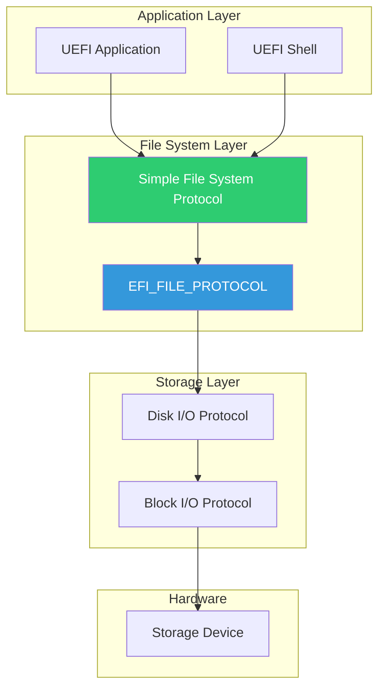

# Chapter 10: File System Access
{: .fs-9 }

Reading and writing files using Simple File System Protocol.
{: .fs-6 .fw-300 }

---

## Overview

### When to Use File System Access

{: .important }
> **Use File System protocols when you need to:**
> - Load configuration files, kernels, or initrd images
> - Read/write log files or persistent data
> - Enumerate directory contents (boot options discovery)
> - Access files on the EFI System Partition (ESP)

| Scenario | Protocol | Function |
|:---------|:---------|:---------|
| **Load kernel image** | SimpleFileSystem → File | Open, Read, Close |
| **Write log file** | SimpleFileSystem → File | Create, Write, Close |
| **List boot options** | SimpleFileSystem → File | Open(dir), Read(entries) |
| **Check file exists** | SimpleFileSystem → File | Open with read mode |
| **Get file size** | File → GetInfo | EFI_FILE_INFO |
| **Delete temp file** | File | Delete |

**File System vs Block I/O:**

| Need | Use File System | Use Block I/O |
|:-----|:----------------|:--------------|
| **Read a config file** | Yes | No (too low-level) |
| **Load kernel from FAT** | Yes | No |
| **Read raw disk sectors** | No | Yes |
| **Implement a FS driver** | No | Yes |
| **Access partition table** | No | Yes |
| **Portable file access** | Yes | No |

**Typical File System Users:**
- **Boot loaders**: Load kernel, initrd, config from ESP
- **Setup utilities**: Save/load configuration files
- **Shell commands**: File manipulation (cp, ls, cat)
- **Diagnostic tools**: Write test logs, read test data
- **Firmware updates**: Read capsule files from filesystem

**Important Considerations:**
- ESP must be FAT32 (or FAT12/16 for smaller partitions)
- Always close file handles to prevent resource leaks
- Check return values - removable media may be ejected
- Use GetInfo for file size before allocating read buffers

### File System Architecture

UEFI provides file system access through a layered protocol stack:



### Supported File Systems

| File System | Support Level | Notes |
|:------------|:--------------|:------|
| **FAT12/16/32** | Required | ESP must be FAT |
| **NTFS** | Optional | Read-only typically |
| **ext2/3/4** | Optional | Third-party drivers |
| **ISO9660** | Optional | CD/DVD support |

### Key Protocols

| Protocol | GUID | Purpose |
|:---------|:-----|:--------|
| **Simple File System** | `964e5b22-6459-11d2-8e39-00a0c969723b` | File system access |
| **EFI_FILE_PROTOCOL** | N/A (interface) | File operations |
| **File Info** | `09576e92-6d3f-11d2-8e39-00a0c969723b` | File metadata |
| **File System Info** | `09576e93-6d3f-11d2-8e39-00a0c969723b` | Volume info |

---

## Initialization

### Locating File Systems

```c
#include <Uefi.h>
#include <Library/UefiLib.h>
#include <Library/UefiBootServicesTableLib.h>
#include <Library/MemoryAllocationLib.h>
#include <Protocol/SimpleFileSystem.h>
#include <Guid/FileInfo.h>

EFI_STATUS
FindFileSystemVolumes (
  OUT UINTN                              *VolumeCount,
  OUT EFI_SIMPLE_FILE_SYSTEM_PROTOCOL    ***Volumes
  )
{
  EFI_STATUS Status;
  EFI_HANDLE *HandleBuffer;
  UINTN HandleCount;
  UINTN Index;
  EFI_SIMPLE_FILE_SYSTEM_PROTOCOL **VolumeArray;

  //
  // Find all handles with Simple File System Protocol
  //
  Status = gBS->LocateHandleBuffer(
             ByProtocol,
             &gEfiSimpleFileSystemProtocolGuid,
             NULL,
             &HandleCount,
             &HandleBuffer
           );

  if (EFI_ERROR(Status)) {
    return Status;
  }

  //
  // Allocate array for volume protocols
  //
  VolumeArray = AllocatePool(HandleCount * sizeof(EFI_SIMPLE_FILE_SYSTEM_PROTOCOL *));
  if (VolumeArray == NULL) {
    gBS->FreePool(HandleBuffer);
    return EFI_OUT_OF_RESOURCES;
  }

  //
  // Get protocol for each handle
  //
  for (Index = 0; Index < HandleCount; Index++) {
    Status = gBS->HandleProtocol(
               HandleBuffer[Index],
               &gEfiSimpleFileSystemProtocolGuid,
               (VOID **)&VolumeArray[Index]
             );
  }

  gBS->FreePool(HandleBuffer);

  *VolumeCount = HandleCount;
  *Volumes = VolumeArray;

  return EFI_SUCCESS;
}
```

### Opening Root Directory

```c
EFI_STATUS
OpenRootDirectory (
  IN  EFI_SIMPLE_FILE_SYSTEM_PROTOCOL  *FileSystem,
  OUT EFI_FILE_PROTOCOL                **RootDir
  )
{
  return FileSystem->OpenVolume(FileSystem, RootDir);
}
```

### Opening Files from Image

```c
#include <Protocol/LoadedImage.h>
#include <Protocol/DevicePath.h>

EFI_STATUS
GetFileSystemFromLoadedImage (
  IN  EFI_HANDLE                        ImageHandle,
  OUT EFI_SIMPLE_FILE_SYSTEM_PROTOCOL   **FileSystem
  )
{
  EFI_STATUS Status;
  EFI_LOADED_IMAGE_PROTOCOL *LoadedImage;

  //
  // Get the Loaded Image Protocol
  //
  Status = gBS->HandleProtocol(
             ImageHandle,
             &gEfiLoadedImageProtocolGuid,
             (VOID **)&LoadedImage
           );

  if (EFI_ERROR(Status)) {
    return Status;
  }

  //
  // Get Simple File System from the device we loaded from
  //
  Status = gBS->HandleProtocol(
             LoadedImage->DeviceHandle,
             &gEfiSimpleFileSystemProtocolGuid,
             (VOID **)FileSystem
           );

  return Status;
}
```

---

## Configuration

### File Open Modes

```c
//
// Open mode flags
//
#define EFI_FILE_MODE_READ    0x0000000000000001ULL
#define EFI_FILE_MODE_WRITE   0x0000000000000002ULL
#define EFI_FILE_MODE_CREATE  0x8000000000000000ULL

//
// File attributes
//
#define EFI_FILE_READ_ONLY    0x0000000000000001ULL
#define EFI_FILE_HIDDEN       0x0000000000000002ULL
#define EFI_FILE_SYSTEM       0x0000000000000004ULL
#define EFI_FILE_RESERVED     0x0000000000000008ULL
#define EFI_FILE_DIRECTORY    0x0000000000000010ULL
#define EFI_FILE_ARCHIVE      0x0000000000000020ULL
#define EFI_FILE_VALID_ATTR   0x0000000000000037ULL
```

### Opening Files

```c
EFI_STATUS
OpenFile (
  IN  EFI_FILE_PROTOCOL  *Directory,
  IN  CHAR16             *FileName,
  IN  UINT64             OpenMode,
  IN  UINT64             Attributes,
  OUT EFI_FILE_PROTOCOL  **File
  )
{
  return Directory->Open(
           Directory,
           File,
           FileName,
           OpenMode,
           Attributes
         );
}

//
// Example: Open file for reading
//
EFI_STATUS
OpenFileForRead (
  IN  EFI_FILE_PROTOCOL  *RootDir,
  IN  CHAR16             *FilePath,
  OUT EFI_FILE_PROTOCOL  **File
  )
{
  return RootDir->Open(
           RootDir,
           File,
           FilePath,
           EFI_FILE_MODE_READ,
           0
         );
}

//
// Example: Create new file
//
EFI_STATUS
CreateNewFile (
  IN  EFI_FILE_PROTOCOL  *RootDir,
  IN  CHAR16             *FilePath,
  OUT EFI_FILE_PROTOCOL  **File
  )
{
  return RootDir->Open(
           RootDir,
           File,
           FilePath,
           EFI_FILE_MODE_READ | EFI_FILE_MODE_WRITE | EFI_FILE_MODE_CREATE,
           0  // Normal file, no special attributes
         );
}
```

### File Information

```c
#include <Guid/FileInfo.h>

EFI_STATUS
GetFileSize (
  IN  EFI_FILE_PROTOCOL  *File,
  OUT UINT64             *FileSize
  )
{
  EFI_STATUS Status;
  EFI_FILE_INFO *FileInfo;
  UINTN InfoSize;

  //
  // First call to get required size
  //
  InfoSize = 0;
  Status = File->GetInfo(File, &gEfiFileInfoGuid, &InfoSize, NULL);

  if (Status != EFI_BUFFER_TOO_SMALL) {
    return Status;
  }

  //
  // Allocate buffer
  //
  FileInfo = AllocatePool(InfoSize);
  if (FileInfo == NULL) {
    return EFI_OUT_OF_RESOURCES;
  }

  //
  // Get file info
  //
  Status = File->GetInfo(File, &gEfiFileInfoGuid, &InfoSize, FileInfo);

  if (!EFI_ERROR(Status)) {
    *FileSize = FileInfo->FileSize;
  }

  FreePool(FileInfo);
  return Status;
}

EFI_STATUS
GetFileInfo (
  IN  EFI_FILE_PROTOCOL  *File,
  OUT EFI_FILE_INFO      **FileInfo
  )
{
  EFI_STATUS Status;
  UINTN InfoSize;

  InfoSize = 0;
  Status = File->GetInfo(File, &gEfiFileInfoGuid, &InfoSize, NULL);

  if (Status != EFI_BUFFER_TOO_SMALL) {
    return Status;
  }

  *FileInfo = AllocatePool(InfoSize);
  if (*FileInfo == NULL) {
    return EFI_OUT_OF_RESOURCES;
  }

  Status = File->GetInfo(File, &gEfiFileInfoGuid, &InfoSize, *FileInfo);

  if (EFI_ERROR(Status)) {
    FreePool(*FileInfo);
    *FileInfo = NULL;
  }

  return Status;
}
```

---

## Porting Guide

### Platform File System Support

```c
//
// DSC file settings for file system support
//
// [Components]
//   # FAT file system driver (required for ESP)
//   FatPkg/EnhancedFatDxe/Fat.inf
//
//   # Optional: Additional file system drivers
//   # Ext4Pkg/Ext4Dxe/Ext4Dxe.inf
//

//
// Check if file system is available
//
EFI_STATUS
CheckFileSystemAvailable (
  VOID
  )
{
  EFI_STATUS Status;
  EFI_HANDLE *Handles;
  UINTN HandleCount;

  Status = gBS->LocateHandleBuffer(
             ByProtocol,
             &gEfiSimpleFileSystemProtocolGuid,
             NULL,
             &HandleCount,
             &Handles
           );

  if (EFI_ERROR(Status) || HandleCount == 0) {
    Print(L"No file systems available\n");
    return EFI_NOT_FOUND;
  }

  Print(L"Found %d file system(s)\n", HandleCount);
  gBS->FreePool(Handles);

  return EFI_SUCCESS;
}
```

### Removable Media Handling

```c
#include <Protocol/BlockIo.h>

EFI_STATUS
CheckMediaPresent (
  IN EFI_HANDLE  DeviceHandle
  )
{
  EFI_STATUS Status;
  EFI_BLOCK_IO_PROTOCOL *BlockIo;

  Status = gBS->HandleProtocol(
             DeviceHandle,
             &gEfiBlockIoProtocolGuid,
             (VOID **)&BlockIo
           );

  if (EFI_ERROR(Status)) {
    return Status;
  }

  if (!BlockIo->Media->MediaPresent) {
    return EFI_NO_MEDIA;
  }

  return EFI_SUCCESS;
}
```

### Path Handling

```c
//
// UEFI uses backslash as path separator
// Paths are relative to volume root
//
// Examples:
//   L"\\EFI\\Boot\\bootx64.efi"
//   L"\\config.txt"
//   L"subdirectory\\file.txt"
//

CHAR16 *
NormalizePath (
  IN CHAR16  *Path
  )
{
  CHAR16 *Normalized;
  UINTN Index;

  Normalized = AllocateCopyPool(StrSize(Path), Path);
  if (Normalized == NULL) {
    return NULL;
  }

  //
  // Convert forward slashes to backslashes
  //
  for (Index = 0; Normalized[Index] != L'\0'; Index++) {
    if (Normalized[Index] == L'/') {
      Normalized[Index] = L'\\';
    }
  }

  return Normalized;
}
```

---

## File Operations

### Reading Files

```c
EFI_STATUS
ReadEntireFile (
  IN  EFI_FILE_PROTOCOL  *File,
  OUT VOID               **Buffer,
  OUT UINTN              *BufferSize
  )
{
  EFI_STATUS Status;
  UINT64 FileSize;
  VOID *FileBuffer;
  UINTN ReadSize;

  //
  // Get file size
  //
  Status = GetFileSize(File, &FileSize);
  if (EFI_ERROR(Status)) {
    return Status;
  }

  //
  // Allocate buffer
  //
  FileBuffer = AllocatePool((UINTN)FileSize);
  if (FileBuffer == NULL) {
    return EFI_OUT_OF_RESOURCES;
  }

  //
  // Read file
  //
  ReadSize = (UINTN)FileSize;
  Status = File->Read(File, &ReadSize, FileBuffer);

  if (EFI_ERROR(Status)) {
    FreePool(FileBuffer);
    return Status;
  }

  *Buffer = FileBuffer;
  *BufferSize = ReadSize;

  return EFI_SUCCESS;
}

EFI_STATUS
ReadFileChunk (
  IN     EFI_FILE_PROTOCOL  *File,
  IN     UINT64             Offset,
  IN OUT UINTN              *Size,
  OUT    VOID               *Buffer
  )
{
  EFI_STATUS Status;

  //
  // Seek to offset
  //
  Status = File->SetPosition(File, Offset);
  if (EFI_ERROR(Status)) {
    return Status;
  }

  //
  // Read data
  //
  return File->Read(File, Size, Buffer);
}
```

### Writing Files

```c
EFI_STATUS
WriteEntireFile (
  IN EFI_FILE_PROTOCOL  *File,
  IN VOID               *Buffer,
  IN UINTN              BufferSize
  )
{
  EFI_STATUS Status;
  UINTN WriteSize;

  //
  // Seek to beginning
  //
  Status = File->SetPosition(File, 0);
  if (EFI_ERROR(Status)) {
    return Status;
  }

  //
  // Write data
  //
  WriteSize = BufferSize;
  Status = File->Write(File, &WriteSize, Buffer);

  if (EFI_ERROR(Status)) {
    return Status;
  }

  //
  // Flush to ensure data is written
  //
  return File->Flush(File);
}

EFI_STATUS
AppendToFile (
  IN EFI_FILE_PROTOCOL  *File,
  IN VOID               *Buffer,
  IN UINTN              BufferSize
  )
{
  EFI_STATUS Status;
  UINTN WriteSize;

  //
  // Seek to end
  //
  Status = File->SetPosition(File, 0xFFFFFFFFFFFFFFFFULL);
  if (EFI_ERROR(Status)) {
    return Status;
  }

  //
  // Write data
  //
  WriteSize = BufferSize;
  Status = File->Write(File, &WriteSize, Buffer);

  if (EFI_ERROR(Status)) {
    return Status;
  }

  return File->Flush(File);
}
```

### Directory Operations

```c
EFI_STATUS
ListDirectory (
  IN EFI_FILE_PROTOCOL  *Directory
  )
{
  EFI_STATUS Status;
  EFI_FILE_INFO *FileInfo;
  UINTN BufferSize;

  //
  // Allocate buffer for file info
  //
  BufferSize = SIZE_OF_EFI_FILE_INFO + 256 * sizeof(CHAR16);
  FileInfo = AllocatePool(BufferSize);
  if (FileInfo == NULL) {
    return EFI_OUT_OF_RESOURCES;
  }

  //
  // Reset directory position
  //
  Directory->SetPosition(Directory, 0);

  //
  // Read directory entries
  //
  while (TRUE) {
    UINTN Size = BufferSize;

    Status = Directory->Read(Directory, &Size, FileInfo);

    if (EFI_ERROR(Status) || Size == 0) {
      break;
    }

    //
    // Print entry info
    //
    if (FileInfo->Attribute & EFI_FILE_DIRECTORY) {
      Print(L"[DIR]  %s\n", FileInfo->FileName);
    } else {
      Print(L"       %s (%ld bytes)\n",
        FileInfo->FileName,
        FileInfo->FileSize
      );
    }
  }

  FreePool(FileInfo);
  return EFI_SUCCESS;
}

EFI_STATUS
CreateDirectory (
  IN EFI_FILE_PROTOCOL  *ParentDir,
  IN CHAR16             *DirName
  )
{
  EFI_STATUS Status;
  EFI_FILE_PROTOCOL *NewDir;

  Status = ParentDir->Open(
             ParentDir,
             &NewDir,
             DirName,
             EFI_FILE_MODE_READ | EFI_FILE_MODE_WRITE | EFI_FILE_MODE_CREATE,
             EFI_FILE_DIRECTORY
           );

  if (!EFI_ERROR(Status)) {
    NewDir->Close(NewDir);
  }

  return Status;
}
```

### File Deletion

```c
EFI_STATUS
DeleteFile (
  IN EFI_FILE_PROTOCOL  *File
  )
{
  //
  // Delete closes the file handle
  //
  return File->Delete(File);
}

EFI_STATUS
DeleteFileByPath (
  IN EFI_FILE_PROTOCOL  *RootDir,
  IN CHAR16             *FilePath
  )
{
  EFI_STATUS Status;
  EFI_FILE_PROTOCOL *File;

  Status = RootDir->Open(
             RootDir,
             &File,
             FilePath,
             EFI_FILE_MODE_READ | EFI_FILE_MODE_WRITE,
             0
           );

  if (EFI_ERROR(Status)) {
    return Status;
  }

  return File->Delete(File);
}
```

---

## Example: File System Demo

```c
/** @file
  File System Access Demonstration
**/

#include <Uefi.h>
#include <Library/UefiLib.h>
#include <Library/UefiBootServicesTableLib.h>
#include <Library/MemoryAllocationLib.h>
#include <Protocol/SimpleFileSystem.h>
#include <Protocol/LoadedImage.h>
#include <Guid/FileInfo.h>

EFI_STATUS
EFIAPI
UefiMain (
  IN EFI_HANDLE        ImageHandle,
  IN EFI_SYSTEM_TABLE  *SystemTable
  )
{
  EFI_STATUS Status;
  EFI_SIMPLE_FILE_SYSTEM_PROTOCOL *FileSystem;
  EFI_LOADED_IMAGE_PROTOCOL *LoadedImage;
  EFI_FILE_PROTOCOL *RootDir;
  EFI_FILE_PROTOCOL *File;

  Print(L"=== File System Demo ===\n\n");

  //
  // Get file system from our boot device
  //
  Status = gBS->HandleProtocol(
             ImageHandle,
             &gEfiLoadedImageProtocolGuid,
             (VOID **)&LoadedImage
           );

  if (EFI_ERROR(Status)) {
    Print(L"Failed to get LoadedImage: %r\n", Status);
    return Status;
  }

  Status = gBS->HandleProtocol(
             LoadedImage->DeviceHandle,
             &gEfiSimpleFileSystemProtocolGuid,
             (VOID **)&FileSystem
           );

  if (EFI_ERROR(Status)) {
    Print(L"Failed to get FileSystem: %r\n", Status);
    return Status;
  }

  //
  // Open root directory
  //
  Status = FileSystem->OpenVolume(FileSystem, &RootDir);
  if (EFI_ERROR(Status)) {
    Print(L"Failed to open volume: %r\n", Status);
    return Status;
  }

  Print(L"Root directory contents:\n");
  Print(L"------------------------\n");

  //
  // List root directory
  //
  {
    EFI_FILE_INFO *FileInfo;
    UINTN BufferSize = SIZE_OF_EFI_FILE_INFO + 256 * sizeof(CHAR16);

    FileInfo = AllocatePool(BufferSize);

    RootDir->SetPosition(RootDir, 0);

    while (TRUE) {
      UINTN Size = BufferSize;
      Status = RootDir->Read(RootDir, &Size, FileInfo);

      if (EFI_ERROR(Status) || Size == 0) {
        break;
      }

      if (FileInfo->Attribute & EFI_FILE_DIRECTORY) {
        Print(L"  [DIR]  %s\n", FileInfo->FileName);
      } else {
        Print(L"         %s (%ld bytes)\n",
          FileInfo->FileName, FileInfo->FileSize);
      }
    }

    FreePool(FileInfo);
  }

  Print(L"\n");

  //
  // Create a test file
  //
  Print(L"Creating test file...\n");

  Status = RootDir->Open(
             RootDir,
             &File,
             L"test.txt",
             EFI_FILE_MODE_READ | EFI_FILE_MODE_WRITE | EFI_FILE_MODE_CREATE,
             0
           );

  if (!EFI_ERROR(Status)) {
    CHAR8 *Message = "Hello from UEFI!\r\n";
    UINTN MessageLen = AsciiStrLen(Message);

    Status = File->Write(File, &MessageLen, Message);

    if (!EFI_ERROR(Status)) {
      Print(L"Wrote %d bytes to test.txt\n", MessageLen);
    }

    File->Flush(File);
    File->Close(File);

    //
    // Read it back
    //
    Status = RootDir->Open(
               RootDir,
               &File,
               L"test.txt",
               EFI_FILE_MODE_READ,
               0
             );

    if (!EFI_ERROR(Status)) {
      CHAR8 Buffer[256];
      UINTN ReadSize = sizeof(Buffer) - 1;

      Status = File->Read(File, &ReadSize, Buffer);

      if (!EFI_ERROR(Status)) {
        Buffer[ReadSize] = '\0';
        Print(L"Read back: %a", Buffer);
      }

      File->Close(File);
    }
  } else {
    Print(L"Failed to create file: %r\n", Status);
  }

  RootDir->Close(RootDir);

  Print(L"\nPress any key to exit...\n");
  {
    EFI_INPUT_KEY Key;
    UINTN Index;
    gBS->WaitForEvent(1, &gST->ConIn->WaitForKey, &Index);
    gST->ConIn->ReadKeyStroke(gST->ConIn, &Key);
  }

  return EFI_SUCCESS;
}
```

---

## Protocol Reference

### Simple File System Protocol

```c
typedef struct _EFI_SIMPLE_FILE_SYSTEM_PROTOCOL {
  UINT64                                   Revision;
  EFI_SIMPLE_FILE_SYSTEM_PROTOCOL_OPEN_VOLUME OpenVolume;
} EFI_SIMPLE_FILE_SYSTEM_PROTOCOL;
```

### EFI File Protocol

```c
typedef struct _EFI_FILE_PROTOCOL {
  UINT64                Revision;
  EFI_FILE_OPEN         Open;
  EFI_FILE_CLOSE        Close;
  EFI_FILE_DELETE       Delete;
  EFI_FILE_READ         Read;
  EFI_FILE_WRITE        Write;
  EFI_FILE_GET_POSITION GetPosition;
  EFI_FILE_SET_POSITION SetPosition;
  EFI_FILE_GET_INFO     GetInfo;
  EFI_FILE_SET_INFO     SetInfo;
  EFI_FILE_FLUSH        Flush;
  // Revision 2+
  EFI_FILE_OPEN_EX      OpenEx;
  EFI_FILE_READ_EX      ReadEx;
  EFI_FILE_WRITE_EX     WriteEx;
  EFI_FILE_FLUSH_EX     FlushEx;
} EFI_FILE_PROTOCOL;
```

### EFI File Info

```c
typedef struct {
  UINT64    Size;           // Size of this structure
  UINT64    FileSize;       // File size in bytes
  UINT64    PhysicalSize;   // Physical size on media
  EFI_TIME  CreateTime;
  EFI_TIME  LastAccessTime;
  EFI_TIME  ModificationTime;
  UINT64    Attribute;
  CHAR16    FileName[1];    // Null-terminated name
} EFI_FILE_INFO;
```

---

## UEFI Specification Reference

- **UEFI Spec Section 13.4**: Simple File System Protocol
- **UEFI Spec Section 13.5**: EFI File Protocol

---

## Summary

1. **Simple File System Protocol** provides volume access
2. **EFI_FILE_PROTOCOL** handles all file operations
3. **Open modes** control read, write, and create behavior
4. **File info** provides metadata (size, attributes, timestamps)
5. **FAT is required** for EFI System Partition
6. **Always close** file handles when done

---

## Next Steps

- [Chapter 11: Block I/O](11-block-io/) - Low-level storage access
- [Chapter 12: Network Stack](12-network/) - Network protocols

---

{: .note }
> **Source Code**: See [`examples/UefiGuidePkg/FileSystemExample/`](https://github.com/MichaelTien8901/uefi-guide-tutorial/tree/main/examples/UefiGuidePkg/FileSystemExample) for complete examples.
