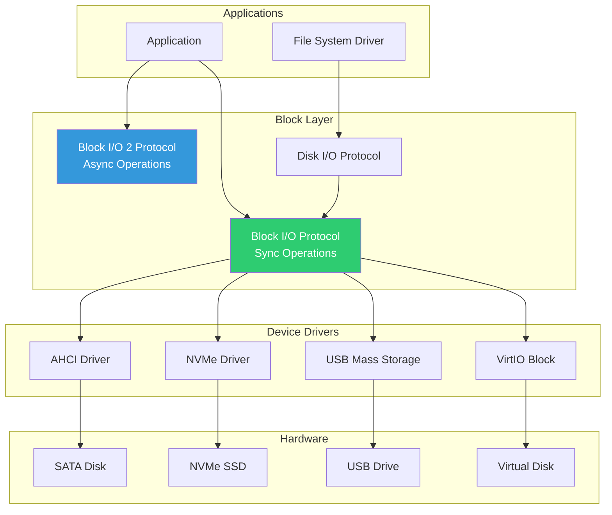

# Chapter 11: Block I/O
{: .fs-9 }

Low-level storage device access using Block I/O Protocol.
{: .fs-6 .fw-300 }

---

## Overview

### When to Use Block I/O

{: .important }
> **Use Block I/O when you need to:**
> - Implement a file system driver (consume BlockIo to provide SimpleFileSystem)
> - Access raw disk sectors (MBR, GPT, partition data)
> - Write a storage device driver (provide BlockIo for your device)
> - Perform low-level disk operations (secure erase, partition creation)

| Scenario | Protocol | Example |
|:---------|:---------|:--------|
| **Write FAT driver** | Consume BlockIo | Read sectors, parse FAT |
| **Read GPT partition table** | BlockIo.ReadBlocks | LBA 1 for GPT header |
| **Write NVMe driver** | Produce BlockIo | Expose NVMe as block device |
| **Disk cloning tool** | BlockIo Read/Write | Sector-by-sector copy |
| **Partition manager** | BlockIo + DiskIo | Modify partition table |
| **Async large transfers** | BlockIo2 | Non-blocking bulk I/O |

**Block I/O vs Higher-Level Protocols:**

| Task | Block I/O | Disk I/O | File System |
|:-----|:----------|:---------|:------------|
| **Read file content** | No | No | Yes |
| **Read specific sector** | Yes | Yes | No |
| **Byte-aligned access** | No | Yes | Yes |
| **Implement FS driver** | Yes | Maybe | No |
| **User-facing tools** | Rarely | Rarely | Usually |

**Typical Block I/O Users:**
- **Storage driver developers**: AHCI, NVMe, USB mass storage drivers
- **File system developers**: FAT, NTFS, ext4 driver implementations
- **Partitioning tools**: GPT/MBR manipulation utilities
- **Disk utilities**: Wiping, cloning, benchmarking tools
- **Boot loaders**: Sometimes read kernel directly from known sectors

**Key Concepts:**
- **MediaId**: Changes when media is swapped (removable devices)
- **LogicalBlocksPerPhysicalBlock**: Important for 4K-native drives
- **ReadOnly**: Check before attempting writes
- **BlockSize**: Usually 512 or 4096 bytes

### Storage Architecture

Block I/O provides the foundation for storage access in UEFI:



### Block I/O vs Disk I/O

| Feature | Block I/O | Disk I/O |
|:--------|:----------|:---------|
| **Access Unit** | Logical blocks | Bytes |
| **Alignment** | Block-aligned | Any offset |
| **Use Case** | Drivers, partitions | File systems |
| **Performance** | Direct | May buffer |

### Key Protocols

| Protocol | GUID | Purpose |
|:---------|:-----|:--------|
| **Block I/O** | `964e5b21-6459-11d2-8e39-00a0c969723b` | Basic block access |
| **Block I/O 2** | `a77b2472-e282-4e9f-a245-c2c0e27bbcc1` | Async block access |
| **Disk I/O** | `ce345171-ba0b-11d2-8e4f-00a0c969723b` | Byte-level access |
| **Disk I/O 2** | `151c8eae-7f2c-472c-9e54-9828194f6a88` | Async byte access |

---

## Initialization

### Locating Block Devices

```c
#include <Uefi.h>
#include <Library/UefiLib.h>
#include <Library/UefiBootServicesTableLib.h>
#include <Protocol/BlockIo.h>
#include <Protocol/BlockIo2.h>

EFI_STATUS
EnumerateBlockDevices (
  VOID
  )
{
  EFI_STATUS Status;
  EFI_HANDLE *HandleBuffer;
  UINTN HandleCount;
  UINTN Index;
  EFI_BLOCK_IO_PROTOCOL *BlockIo;

  //
  // Find all Block I/O handles
  //
  Status = gBS->LocateHandleBuffer(
             ByProtocol,
             &gEfiBlockIoProtocolGuid,
             NULL,
             &HandleCount,
             &HandleBuffer
           );

  if (EFI_ERROR(Status)) {
    Print(L"No block devices found\n");
    return Status;
  }

  Print(L"Found %d block device(s):\n\n", HandleCount);

  for (Index = 0; Index < HandleCount; Index++) {
    Status = gBS->HandleProtocol(
               HandleBuffer[Index],
               &gEfiBlockIoProtocolGuid,
               (VOID **)&BlockIo
             );

    if (EFI_ERROR(Status)) {
      continue;
    }

    Print(L"Device %d:\n", Index);
    Print(L"  Media ID:        0x%08x\n", BlockIo->Media->MediaId);
    Print(L"  Removable:       %s\n", BlockIo->Media->RemovableMedia ? L"Yes" : L"No");
    Print(L"  Media Present:   %s\n", BlockIo->Media->MediaPresent ? L"Yes" : L"No");
    Print(L"  Logical Partition: %s\n", BlockIo->Media->LogicalPartition ? L"Yes" : L"No");
    Print(L"  Read Only:       %s\n", BlockIo->Media->ReadOnly ? L"Yes" : L"No");
    Print(L"  Block Size:      %d bytes\n", BlockIo->Media->BlockSize);
    Print(L"  Last Block:      0x%lx\n", BlockIo->Media->LastBlock);

    UINT64 SizeInMB = ((BlockIo->Media->LastBlock + 1) * BlockIo->Media->BlockSize) / (1024 * 1024);
    Print(L"  Total Size:      %ld MB\n\n", SizeInMB);
  }

  gBS->FreePool(HandleBuffer);
  return EFI_SUCCESS;
}
```

### Locating Specific Devices

```c
EFI_STATUS
FindBootDevice (
  IN  EFI_HANDLE               ImageHandle,
  OUT EFI_BLOCK_IO_PROTOCOL    **BlockIo
  )
{
  EFI_STATUS Status;
  EFI_LOADED_IMAGE_PROTOCOL *LoadedImage;

  //
  // Get our loaded image protocol
  //
  Status = gBS->HandleProtocol(
             ImageHandle,
             &gEfiLoadedImageProtocolGuid,
             (VOID **)&LoadedImage
           );

  if (EFI_ERROR(Status)) {
    return Status;
  }

  //
  // Get Block I/O from our boot device
  //
  Status = gBS->HandleProtocol(
             LoadedImage->DeviceHandle,
             &gEfiBlockIoProtocolGuid,
             (VOID **)BlockIo
           );

  return Status;
}

EFI_STATUS
FindNonRemovableDevice (
  OUT EFI_BLOCK_IO_PROTOCOL  **BlockIo
  )
{
  EFI_STATUS Status;
  EFI_HANDLE *HandleBuffer;
  UINTN HandleCount;
  UINTN Index;
  EFI_BLOCK_IO_PROTOCOL *TempBlockIo;

  Status = gBS->LocateHandleBuffer(
             ByProtocol,
             &gEfiBlockIoProtocolGuid,
             NULL,
             &HandleCount,
             &HandleBuffer
           );

  if (EFI_ERROR(Status)) {
    return Status;
  }

  for (Index = 0; Index < HandleCount; Index++) {
    Status = gBS->HandleProtocol(
               HandleBuffer[Index],
               &gEfiBlockIoProtocolGuid,
               (VOID **)&TempBlockIo
             );

    if (EFI_ERROR(Status)) {
      continue;
    }

    //
    // Find first non-removable, non-partition device
    //
    if (!TempBlockIo->Media->RemovableMedia &&
        !TempBlockIo->Media->LogicalPartition &&
        TempBlockIo->Media->MediaPresent) {
      *BlockIo = TempBlockIo;
      gBS->FreePool(HandleBuffer);
      return EFI_SUCCESS;
    }
  }

  gBS->FreePool(HandleBuffer);
  return EFI_NOT_FOUND;
}
```

---

## Configuration

### Media Information

```c
//
// EFI_BLOCK_IO_MEDIA structure
//
typedef struct {
  UINT32   MediaId;           // Current media identifier
  BOOLEAN  RemovableMedia;    // TRUE if removable
  BOOLEAN  MediaPresent;      // TRUE if media present
  BOOLEAN  LogicalPartition;  // TRUE if logical partition
  BOOLEAN  ReadOnly;          // TRUE if read-only
  BOOLEAN  WriteCaching;      // TRUE if write caching
  UINT32   BlockSize;         // Block size in bytes
  UINT32   IoAlign;           // I/O buffer alignment
  EFI_LBA  LastBlock;         // Last valid LBA
  // Revision 2+
  EFI_LBA  LowestAlignedLba;
  UINT32   LogicalBlocksPerPhysicalBlock;
  // Revision 3+
  UINT32   OptimalTransferLengthGranularity;
} EFI_BLOCK_IO_MEDIA;

VOID
PrintMediaInfo (
  IN EFI_BLOCK_IO_MEDIA  *Media
  )
{
  Print(L"Media Information:\n");
  Print(L"  Block Size:    %d bytes\n", Media->BlockSize);
  Print(L"  Total Blocks:  %ld\n", Media->LastBlock + 1);
  Print(L"  IO Alignment:  %d\n", Media->IoAlign);

  if (Media->IoAlign > 1) {
    Print(L"  Note: Buffers must be %d-byte aligned\n", Media->IoAlign);
  }
}
```

### Buffer Alignment

```c
#include <Library/MemoryAllocationLib.h>

VOID *
AllocateAlignedBuffer (
  IN EFI_BLOCK_IO_PROTOCOL  *BlockIo,
  IN UINTN                  Size
  )
{
  UINT32 Alignment = BlockIo->Media->IoAlign;

  if (Alignment <= 1) {
    //
    // No special alignment needed
    //
    return AllocatePool(Size);
  }

  //
  // Allocate aligned buffer
  //
  return AllocateAlignedPages(
           EFI_SIZE_TO_PAGES(Size),
           Alignment
         );
}

VOID
FreeAlignedBuffer (
  IN EFI_BLOCK_IO_PROTOCOL  *BlockIo,
  IN VOID                   *Buffer,
  IN UINTN                  Size
  )
{
  UINT32 Alignment = BlockIo->Media->IoAlign;

  if (Alignment <= 1) {
    FreePool(Buffer);
  } else {
    FreeAlignedPages(Buffer, EFI_SIZE_TO_PAGES(Size));
  }
}
```

---

## Porting Guide

### Storage Controller Drivers

```c
//
// DSC file: Include appropriate storage drivers
//
// [Components]
//   # AHCI/SATA support
//   MdeModulePkg/Bus/Ata/AtaAtapiPassThru/AtaAtapiPassThru.inf
//   MdeModulePkg/Bus/Ata/AtaBusDxe/AtaBusDxe.inf
//   MdeModulePkg/Bus/Pci/SataControllerDxe/SataControllerDxe.inf
//
//   # NVMe support
//   MdeModulePkg/Bus/Pci/NvmExpressDxe/NvmExpressDxe.inf
//
//   # USB Mass Storage
//   MdeModulePkg/Bus/Usb/UsbMassStorageDxe/UsbMassStorageDxe.inf
//
//   # Partition and Disk I/O
//   MdeModulePkg/Universal/Disk/PartitionDxe/PartitionDxe.inf
//   MdeModulePkg/Universal/Disk/DiskIoDxe/DiskIoDxe.inf
//
```

### Platform-Specific Considerations

```c
//
// Virtual machines may use different storage
//
// QEMU:
//   - virtio-blk (VirtIO Block Device)
//   - ide-hd (IDE/ATA)
//   - nvme (NVMe)
//
// VMware:
//   - PVSCSI (Paravirtual SCSI)
//   - LSI Logic
//
// [Components]
//   # VirtIO Block for QEMU
//   OvmfPkg/VirtioBlkDxe/VirtioBlkDxe.inf
//

//
// Check for VirtIO device
//
#include <IndustryStandard/Virtio.h>

BOOLEAN
IsVirtioBlockDevice (
  IN EFI_HANDLE  Handle
  )
{
  EFI_STATUS Status;
  EFI_PCI_IO_PROTOCOL *PciIo;
  UINT16 VendorId, DeviceId;

  Status = gBS->HandleProtocol(
             Handle,
             &gEfiPciIoProtocolGuid,
             (VOID **)&PciIo
           );

  if (EFI_ERROR(Status)) {
    return FALSE;
  }

  PciIo->Pci.Read(PciIo, EfiPciIoWidthUint16, 0, 1, &VendorId);
  PciIo->Pci.Read(PciIo, EfiPciIoWidthUint16, 2, 1, &DeviceId);

  //
  // VirtIO vendor ID and block device ID
  //
  return (VendorId == 0x1AF4 && (DeviceId >= 0x1000 && DeviceId <= 0x103F));
}
```

### Media Change Detection

```c
EFI_STATUS
HandleMediaChange (
  IN EFI_BLOCK_IO_PROTOCOL  *BlockIo,
  IN UINT32                 ExpectedMediaId
  )
{
  //
  // Check if media has changed
  //
  if (BlockIo->Media->MediaId != ExpectedMediaId) {
    Print(L"Media changed! Old ID: 0x%x, New ID: 0x%x\n",
      ExpectedMediaId, BlockIo->Media->MediaId);

    if (!BlockIo->Media->MediaPresent) {
      return EFI_NO_MEDIA;
    }

    //
    // Caller should re-read partition table, etc.
    //
    return EFI_MEDIA_CHANGED;
  }

  return EFI_SUCCESS;
}
```

---

## Block Operations

### Reading Blocks

```c
EFI_STATUS
ReadBlocks (
  IN  EFI_BLOCK_IO_PROTOCOL  *BlockIo,
  IN  EFI_LBA                StartLba,
  IN  UINTN                  NumBlocks,
  OUT VOID                   *Buffer
  )
{
  UINTN BufferSize;

  BufferSize = NumBlocks * BlockIo->Media->BlockSize;

  return BlockIo->ReadBlocks(
           BlockIo,
           BlockIo->Media->MediaId,
           StartLba,
           BufferSize,
           Buffer
         );
}

EFI_STATUS
ReadMBR (
  IN  EFI_BLOCK_IO_PROTOCOL  *BlockIo,
  OUT VOID                   *MbrBuffer
  )
{
  //
  // MBR is at LBA 0
  //
  return BlockIo->ReadBlocks(
           BlockIo,
           BlockIo->Media->MediaId,
           0,
           BlockIo->Media->BlockSize,
           MbrBuffer
         );
}
```

### Writing Blocks

```c
EFI_STATUS
WriteBlocks (
  IN EFI_BLOCK_IO_PROTOCOL  *BlockIo,
  IN EFI_LBA                StartLba,
  IN UINTN                  NumBlocks,
  IN VOID                   *Buffer
  )
{
  UINTN BufferSize;

  //
  // Check if device is read-only
  //
  if (BlockIo->Media->ReadOnly) {
    return EFI_WRITE_PROTECTED;
  }

  BufferSize = NumBlocks * BlockIo->Media->BlockSize;

  return BlockIo->WriteBlocks(
           BlockIo,
           BlockIo->Media->MediaId,
           StartLba,
           BufferSize,
           Buffer
         );
}

EFI_STATUS
FlushBlocks (
  IN EFI_BLOCK_IO_PROTOCOL  *BlockIo
  )
{
  return BlockIo->FlushBlocks(BlockIo);
}
```

### Async Operations (Block I/O 2)

```c
#include <Protocol/BlockIo2.h>

typedef struct {
  EFI_BLOCK_IO2_TOKEN    Token;
  VOID                   *Buffer;
  EFI_LBA                Lba;
  BOOLEAN                Complete;
} ASYNC_READ_CONTEXT;

VOID
EFIAPI
AsyncReadCallback (
  IN EFI_EVENT  Event,
  IN VOID       *Context
  )
{
  ASYNC_READ_CONTEXT *ReadContext = (ASYNC_READ_CONTEXT *)Context;

  Print(L"Async read complete, Status: %r\n",
    ReadContext->Token.TransactionStatus);

  ReadContext->Complete = TRUE;
}

EFI_STATUS
ReadBlocksAsync (
  IN  EFI_BLOCK_IO2_PROTOCOL  *BlockIo2,
  IN  EFI_LBA                 Lba,
  IN  UINTN                   BufferSize,
  OUT VOID                    *Buffer
  )
{
  EFI_STATUS Status;
  ASYNC_READ_CONTEXT Context;

  ZeroMem(&Context, sizeof(Context));
  Context.Buffer = Buffer;
  Context.Lba = Lba;
  Context.Complete = FALSE;

  //
  // Create completion event
  //
  Status = gBS->CreateEvent(
             EVT_NOTIFY_SIGNAL,
             TPL_CALLBACK,
             AsyncReadCallback,
             &Context,
             &Context.Token.Event
           );

  if (EFI_ERROR(Status)) {
    return Status;
  }

  //
  // Start async read
  //
  Status = BlockIo2->ReadBlocksEx(
             BlockIo2,
             BlockIo2->Media->MediaId,
             Lba,
             &Context.Token,
             BufferSize,
             Buffer
           );

  if (EFI_ERROR(Status)) {
    gBS->CloseEvent(Context.Token.Event);
    return Status;
  }

  //
  // Wait for completion (or do other work)
  //
  while (!Context.Complete) {
    gBS->Stall(1000);  // 1ms
  }

  gBS->CloseEvent(Context.Token.Event);

  return Context.Token.TransactionStatus;
}
```

### Using Disk I/O for Byte Access

```c
#include <Protocol/DiskIo.h>

EFI_STATUS
ReadBytes (
  IN  EFI_DISK_IO_PROTOCOL  *DiskIo,
  IN  UINT32                MediaId,
  IN  UINT64                Offset,
  IN  UINTN                 Size,
  OUT VOID                  *Buffer
  )
{
  return DiskIo->ReadDisk(DiskIo, MediaId, Offset, Size, Buffer);
}

EFI_STATUS
ReadPartitionHeader (
  IN  EFI_HANDLE            BlockHandle,
  IN  UINT64                Offset,
  OUT VOID                  *HeaderBuffer,
  IN  UINTN                 HeaderSize
  )
{
  EFI_STATUS Status;
  EFI_DISK_IO_PROTOCOL *DiskIo;
  EFI_BLOCK_IO_PROTOCOL *BlockIo;

  Status = gBS->HandleProtocol(
             BlockHandle,
             &gEfiDiskIoProtocolGuid,
             (VOID **)&DiskIo
           );

  if (EFI_ERROR(Status)) {
    return Status;
  }

  Status = gBS->HandleProtocol(
             BlockHandle,
             &gEfiBlockIoProtocolGuid,
             (VOID **)&BlockIo
           );

  if (EFI_ERROR(Status)) {
    return Status;
  }

  return DiskIo->ReadDisk(
           DiskIo,
           BlockIo->Media->MediaId,
           Offset,
           HeaderSize,
           HeaderBuffer
         );
}
```

---

## Example: Block I/O Demo

```c
/** @file
  Block I/O Protocol Demonstration
**/

#include <Uefi.h>
#include <Library/UefiLib.h>
#include <Library/UefiBootServicesTableLib.h>
#include <Library/MemoryAllocationLib.h>
#include <Protocol/BlockIo.h>

//
// MBR signature location
//
#define MBR_SIGNATURE_OFFSET  510
#define MBR_SIGNATURE         0xAA55

EFI_STATUS
EFIAPI
UefiMain (
  IN EFI_HANDLE        ImageHandle,
  IN EFI_SYSTEM_TABLE  *SystemTable
  )
{
  EFI_STATUS Status;
  EFI_HANDLE *HandleBuffer;
  UINTN HandleCount;
  UINTN Index;
  EFI_BLOCK_IO_PROTOCOL *BlockIo;
  UINT8 *SectorBuffer;

  Print(L"=== Block I/O Demo ===\n\n");

  //
  // Find all block devices
  //
  Status = gBS->LocateHandleBuffer(
             ByProtocol,
             &gEfiBlockIoProtocolGuid,
             NULL,
             &HandleCount,
             &HandleBuffer
           );

  if (EFI_ERROR(Status)) {
    Print(L"No block devices found: %r\n", Status);
    return Status;
  }

  Print(L"Found %d block device(s)\n\n", HandleCount);

  //
  // Examine each device
  //
  for (Index = 0; Index < HandleCount; Index++) {
    Status = gBS->HandleProtocol(
               HandleBuffer[Index],
               &gEfiBlockIoProtocolGuid,
               (VOID **)&BlockIo
             );

    if (EFI_ERROR(Status)) {
      continue;
    }

    //
    // Skip logical partitions, show only physical devices
    //
    if (BlockIo->Media->LogicalPartition) {
      continue;
    }

    if (!BlockIo->Media->MediaPresent) {
      Print(L"Device %d: No media present\n\n", Index);
      continue;
    }

    UINT64 SizeMB = ((BlockIo->Media->LastBlock + 1) *
                     BlockIo->Media->BlockSize) / (1024 * 1024);

    Print(L"Device %d:\n", Index);
    Print(L"  Size: %ld MB\n", SizeMB);
    Print(L"  Block Size: %d bytes\n", BlockIo->Media->BlockSize);
    Print(L"  Removable: %s\n",
      BlockIo->Media->RemovableMedia ? L"Yes" : L"No");

    //
    // Allocate sector buffer
    //
    SectorBuffer = AllocatePool(BlockIo->Media->BlockSize);
    if (SectorBuffer == NULL) {
      Print(L"  Failed to allocate buffer\n\n");
      continue;
    }

    //
    // Read first sector (MBR/GPT header location)
    //
    Status = BlockIo->ReadBlocks(
               BlockIo,
               BlockIo->Media->MediaId,
               0,
               BlockIo->Media->BlockSize,
               SectorBuffer
             );

    if (!EFI_ERROR(Status)) {
      //
      // Check for MBR signature
      //
      UINT16 Signature = *(UINT16 *)(SectorBuffer + MBR_SIGNATURE_OFFSET);

      if (Signature == MBR_SIGNATURE) {
        Print(L"  MBR Signature: Found (0x%04x)\n", Signature);

        //
        // Check if GPT (protective MBR)
        //
        if (SectorBuffer[0x1C2] == 0xEE) {
          Print(L"  Partition Type: GPT\n");
        } else {
          Print(L"  Partition Type: MBR\n");
        }
      } else {
        Print(L"  MBR Signature: Not found\n");
      }

      //
      // Show first 16 bytes of sector
      //
      Print(L"  First 16 bytes: ");
      for (UINTN i = 0; i < 16; i++) {
        Print(L"%02x ", SectorBuffer[i]);
      }
      Print(L"\n");
    } else {
      Print(L"  Read failed: %r\n", Status);
    }

    FreePool(SectorBuffer);
    Print(L"\n");
  }

  gBS->FreePool(HandleBuffer);

  Print(L"Press any key to exit...\n");
  {
    EFI_INPUT_KEY Key;
    UINTN EventIndex;
    gBS->WaitForEvent(1, &gST->ConIn->WaitForKey, &EventIndex);
    gST->ConIn->ReadKeyStroke(gST->ConIn, &Key);
  }

  return EFI_SUCCESS;
}
```

---

## Protocol Reference

### Block I/O Protocol

```c
typedef struct _EFI_BLOCK_IO_PROTOCOL {
  UINT64              Revision;
  EFI_BLOCK_IO_MEDIA  *Media;
  EFI_BLOCK_RESET     Reset;
  EFI_BLOCK_READ      ReadBlocks;
  EFI_BLOCK_WRITE     WriteBlocks;
  EFI_BLOCK_FLUSH     FlushBlocks;
} EFI_BLOCK_IO_PROTOCOL;
```

### Block I/O 2 Protocol (Async)

```c
typedef struct _EFI_BLOCK_IO2_PROTOCOL {
  EFI_BLOCK_IO_MEDIA  *Media;
  EFI_BLOCK_RESET_EX  Reset;
  EFI_BLOCK_READ_EX   ReadBlocksEx;
  EFI_BLOCK_WRITE_EX  WriteBlocksEx;
  EFI_BLOCK_FLUSH_EX  FlushBlocksEx;
} EFI_BLOCK_IO2_PROTOCOL;
```

---

## UEFI Specification Reference

- **UEFI Spec Section 13.8**: Block I/O Protocol
- **UEFI Spec Section 13.9**: Block I/O 2 Protocol
- **UEFI Spec Section 13.10**: Disk I/O Protocol

---

## Summary

1. **Block I/O** provides low-level sector access
2. **Block I/O 2** adds asynchronous operations
3. **Disk I/O** allows byte-level access
4. **Media structure** contains device information
5. **Buffer alignment** may be required (check IoAlign)
6. **Media changes** must be handled for removable devices

---

## Next Steps

- [Chapter 12: Network Stack](12-network/) - Network protocols
- [Chapter 13: UEFI Variables](13-variables/) - Variable storage

---

{: .note }
> **Source Code**: See [`examples/UefiGuidePkg/BlockIoExample/`](https://github.com/MichaelTien8901/uefi-guide-tutorial/tree/main/examples/UefiGuidePkg/BlockIoExample) for complete examples.
