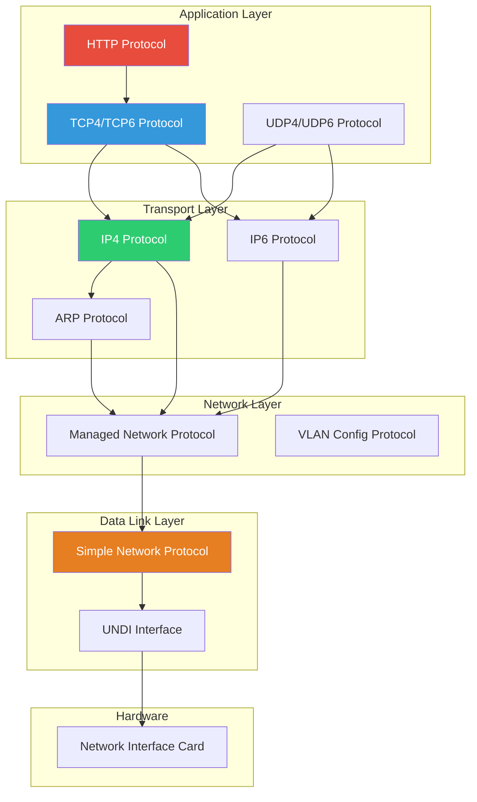

# Chapter 12: Network Stack
{: .fs-9 }

Network programming using UEFI network protocols.
{: .fs-6 .fw-300 }

---

## Overview

### When to Use Network Protocols

{: .important }
> **Use Network protocols when you need to:**
> - Boot from network (PXE boot, HTTP boot)
> - Download files or updates over network
> - Implement network diagnostics (ping, connectivity tests)
> - Access remote management services (Redfish)

| Scenario | Protocol(s) | Example |
|:---------|:------------|:--------|
| **PXE network boot** | DHCP4 + MTFTP | Download NBP from TFTP server |
| **HTTP boot** | DHCP4 + DNS4 + HTTP | Boot kernel via HTTP URL |
| **Download firmware update** | TCP4 or HTTP | Fetch capsule from server |
| **Network diagnostic** | IP4 + ICMP | Ping test implementation |
| **REST API access** | HTTP + TLS | Redfish BMC communication |
| **Custom network app** | TCP4 or UDP4 | Client/server applications |

**Choosing the Right Protocol Layer:**

| Need | Protocol | Complexity |
|:-----|:---------|:-----------|
| **Web/REST requests** | HTTP | Easiest - handles HTTP semantics |
| **Reliable data transfer** | TCP4/TCP6 | Medium - connection-oriented |
| **Low-latency, no guarantee** | UDP4/UDP6 | Medium - connectionless |
| **Custom protocol over IP** | IP4/IP6 raw | Complex - build your own |
| **Direct frame access** | SNP/MNP | Complex - NIC driver level |

**Typical Network Users:**
- **PXE/HTTP boot implementations**: Network boot infrastructure
- **Firmware update tools**: Download updates from corporate servers
- **Remote management**: Redfish-based configuration from BMC
- **Diagnostic utilities**: Network connectivity testing
- **Diskless workstations**: Boot entirely from network

**Important Considerations:**
- Network drivers may not be present on all systems
- DHCP configuration required before most operations
- Service binding model - create child handles for connections
- Timeouts and error handling critical for reliability

### Network Protocol Stack

UEFI provides a complete network stack from hardware to application layer:



### Key Protocols

| Layer | Protocol | Purpose |
|:------|:---------|:--------|
| **Application** | HTTP, MTFTP | Web, file transfer |
| **Transport** | TCP4/6, UDP4/6 | Reliable/unreliable transport |
| **Network** | IP4, IP6, ARP | Addressing, routing |
| **Data Link** | MNP, SNP | Frame handling |

### Service Binding Model

```c
//
// Network protocols use Service Binding
// 1. Locate ServiceBinding protocol
// 2. CreateChild() to get protocol instance
// 3. Use the protocol
// 4. DestroyChild() when done
//
```

---

## Initialization

### Simple Network Protocol (SNP)

```c
#include <Uefi.h>
#include <Library/UefiLib.h>
#include <Library/UefiBootServicesTableLib.h>
#include <Protocol/SimpleNetwork.h>

EFI_SIMPLE_NETWORK_PROTOCOL *gSnp;

EFI_STATUS
InitializeSimpleNetwork (
  VOID
  )
{
  EFI_STATUS Status;
  EFI_HANDLE *HandleBuffer;
  UINTN HandleCount;

  //
  // Find SNP handles
  //
  Status = gBS->LocateHandleBuffer(
             ByProtocol,
             &gEfiSimpleNetworkProtocolGuid,
             NULL,
             &HandleCount,
             &HandleBuffer
           );

  if (EFI_ERROR(Status) || HandleCount == 0) {
    Print(L"No network interfaces found\n");
    return EFI_NOT_FOUND;
  }

  Print(L"Found %d network interface(s)\n", HandleCount);

  //
  // Get first SNP instance
  //
  Status = gBS->HandleProtocol(
             HandleBuffer[0],
             &gEfiSimpleNetworkProtocolGuid,
             (VOID **)&gSnp
           );

  gBS->FreePool(HandleBuffer);

  if (EFI_ERROR(Status)) {
    return Status;
  }

  //
  // Initialize the interface
  //
  if (gSnp->Mode->State == EfiSimpleNetworkStopped) {
    Status = gSnp->Start(gSnp);
    if (EFI_ERROR(Status)) {
      Print(L"Failed to start SNP: %r\n", Status);
      return Status;
    }
  }

  if (gSnp->Mode->State == EfiSimpleNetworkStarted) {
    Status = gSnp->Initialize(gSnp, 0, 0);
    if (EFI_ERROR(Status)) {
      Print(L"Failed to initialize SNP: %r\n", Status);
      return Status;
    }
  }

  //
  // Print MAC address
  //
  Print(L"MAC Address: %02x:%02x:%02x:%02x:%02x:%02x\n",
    gSnp->Mode->CurrentAddress.Addr[0],
    gSnp->Mode->CurrentAddress.Addr[1],
    gSnp->Mode->CurrentAddress.Addr[2],
    gSnp->Mode->CurrentAddress.Addr[3],
    gSnp->Mode->CurrentAddress.Addr[4],
    gSnp->Mode->CurrentAddress.Addr[5]
  );

  return EFI_SUCCESS;
}

VOID
ShutdownSimpleNetwork (
  VOID
  )
{
  if (gSnp != NULL) {
    gSnp->Shutdown(gSnp);
    gSnp->Stop(gSnp);
  }
}
```

### TCP4 Protocol Setup

```c
#include <Protocol/Tcp4.h>
#include <Protocol/ServiceBinding.h>

EFI_TCP4_PROTOCOL *gTcp4;
EFI_HANDLE gTcp4ChildHandle;
EFI_SERVICE_BINDING_PROTOCOL *gTcp4ServiceBinding;

EFI_STATUS
InitializeTcp4 (
  IN EFI_HANDLE  NicHandle
  )
{
  EFI_STATUS Status;

  //
  // Get TCP4 Service Binding Protocol
  //
  Status = gBS->HandleProtocol(
             NicHandle,
             &gEfiTcp4ServiceBindingProtocolGuid,
             (VOID **)&gTcp4ServiceBinding
           );

  if (EFI_ERROR(Status)) {
    Print(L"TCP4 ServiceBinding not found: %r\n", Status);
    return Status;
  }

  //
  // Create TCP4 child instance
  //
  gTcp4ChildHandle = NULL;
  Status = gTcp4ServiceBinding->CreateChild(
             gTcp4ServiceBinding,
             &gTcp4ChildHandle
           );

  if (EFI_ERROR(Status)) {
    Print(L"Failed to create TCP4 child: %r\n", Status);
    return Status;
  }

  //
  // Get TCP4 Protocol from child handle
  //
  Status = gBS->HandleProtocol(
             gTcp4ChildHandle,
             &gEfiTcp4ProtocolGuid,
             (VOID **)&gTcp4
           );

  return Status;
}

VOID
CleanupTcp4 (
  VOID
  )
{
  if (gTcp4ServiceBinding != NULL && gTcp4ChildHandle != NULL) {
    gTcp4ServiceBinding->DestroyChild(
      gTcp4ServiceBinding,
      gTcp4ChildHandle
    );
  }
}
```

### IP Configuration (DHCP)

```c
#include <Protocol/Dhcp4.h>

EFI_STATUS
ConfigureWithDhcp (
  IN EFI_HANDLE  NicHandle
  )
{
  EFI_STATUS Status;
  EFI_SERVICE_BINDING_PROTOCOL *Dhcp4ServiceBinding;
  EFI_DHCP4_PROTOCOL *Dhcp4;
  EFI_HANDLE Dhcp4Handle = NULL;

  //
  // Get DHCP4 Service Binding
  //
  Status = gBS->HandleProtocol(
             NicHandle,
             &gEfiDhcp4ServiceBindingProtocolGuid,
             (VOID **)&Dhcp4ServiceBinding
           );

  if (EFI_ERROR(Status)) {
    return Status;
  }

  //
  // Create DHCP4 child
  //
  Status = Dhcp4ServiceBinding->CreateChild(Dhcp4ServiceBinding, &Dhcp4Handle);
  if (EFI_ERROR(Status)) {
    return Status;
  }

  Status = gBS->HandleProtocol(
             Dhcp4Handle,
             &gEfiDhcp4ProtocolGuid,
             (VOID **)&Dhcp4
           );

  if (EFI_ERROR(Status)) {
    Dhcp4ServiceBinding->DestroyChild(Dhcp4ServiceBinding, Dhcp4Handle);
    return Status;
  }

  //
  // Start DHCP process
  //
  Status = Dhcp4->Start(Dhcp4, NULL);

  if (!EFI_ERROR(Status)) {
    EFI_DHCP4_MODE_DATA ModeData;

    Status = Dhcp4->GetModeData(Dhcp4, &ModeData);

    if (!EFI_ERROR(Status)) {
      Print(L"DHCP Configuration:\n");
      Print(L"  IP Address:  %d.%d.%d.%d\n",
        ModeData.ClientAddress.Addr[0],
        ModeData.ClientAddress.Addr[1],
        ModeData.ClientAddress.Addr[2],
        ModeData.ClientAddress.Addr[3]
      );
      Print(L"  Subnet Mask: %d.%d.%d.%d\n",
        ModeData.SubnetMask.Addr[0],
        ModeData.SubnetMask.Addr[1],
        ModeData.SubnetMask.Addr[2],
        ModeData.SubnetMask.Addr[3]
      );
    }
  }

  Dhcp4ServiceBinding->DestroyChild(Dhcp4ServiceBinding, Dhcp4Handle);
  return Status;
}
```

---

## Configuration

### TCP4 Configuration

```c
EFI_STATUS
ConfigureTcp4 (
  IN EFI_TCP4_PROTOCOL  *Tcp4,
  IN EFI_IPv4_ADDRESS   *LocalIp,
  IN UINT16             LocalPort
  )
{
  EFI_STATUS Status;
  EFI_TCP4_CONFIG_DATA ConfigData;

  ZeroMem(&ConfigData, sizeof(ConfigData));

  //
  // Access point configuration
  //
  ConfigData.AccessPoint.UseDefaultAddress = TRUE;  // Use DHCP address
  ConfigData.AccessPoint.StationPort = LocalPort;   // 0 for any port
  ConfigData.AccessPoint.ActiveFlag = TRUE;         // Active open

  //
  // Control options
  //
  ConfigData.ControlOption = NULL;  // Use defaults

  //
  // Type of service
  //
  ConfigData.TypeOfService = 0;
  ConfigData.TimeToLive = 64;

  Status = Tcp4->Configure(Tcp4, &ConfigData);

  return Status;
}

EFI_STATUS
ConfigureTcp4Static (
  IN EFI_TCP4_PROTOCOL  *Tcp4,
  IN UINT8              *LocalIp,
  IN UINT8              *SubnetMask,
  IN UINT8              *Gateway,
  IN UINT16             LocalPort
  )
{
  EFI_TCP4_CONFIG_DATA ConfigData;

  ZeroMem(&ConfigData, sizeof(ConfigData));

  //
  // Static IP configuration
  //
  ConfigData.AccessPoint.UseDefaultAddress = FALSE;
  CopyMem(&ConfigData.AccessPoint.StationAddress, LocalIp, 4);
  CopyMem(&ConfigData.AccessPoint.SubnetMask, SubnetMask, 4);
  ConfigData.AccessPoint.StationPort = LocalPort;
  ConfigData.AccessPoint.ActiveFlag = TRUE;

  ConfigData.TypeOfService = 0;
  ConfigData.TimeToLive = 64;

  return Tcp4->Configure(Tcp4, &ConfigData);
}
```

### UDP4 Configuration

```c
#include <Protocol/Udp4.h>

EFI_STATUS
ConfigureUdp4 (
  IN EFI_UDP4_PROTOCOL  *Udp4,
  IN UINT16             LocalPort
  )
{
  EFI_UDP4_CONFIG_DATA ConfigData;

  ZeroMem(&ConfigData, sizeof(ConfigData));

  ConfigData.AcceptBroadcast = TRUE;
  ConfigData.AcceptPromiscuous = FALSE;
  ConfigData.AcceptAnyPort = FALSE;
  ConfigData.AllowDuplicatePort = FALSE;
  ConfigData.TimeToLive = 64;
  ConfigData.TypeOfService = 0;
  ConfigData.DoNotFragment = FALSE;
  ConfigData.ReceiveTimeout = 0;  // No timeout
  ConfigData.TransmitTimeout = 0;

  //
  // Use DHCP address
  //
  ConfigData.UseDefaultAddress = TRUE;
  ConfigData.StationPort = LocalPort;

  return Udp4->Configure(Udp4, &ConfigData);
}
```

---

## Porting Guide

### Network Driver Configuration

```c
//
// DSC file: Include network stack components
//
// [Components]
//   # Network stack
//   NetworkPkg/SnpDxe/SnpDxe.inf
//   NetworkPkg/MnpDxe/MnpDxe.inf
//   NetworkPkg/ArpDxe/ArpDxe.inf
//   NetworkPkg/Ip4Dxe/Ip4Dxe.inf
//   NetworkPkg/Udp4Dxe/Udp4Dxe.inf
//   NetworkPkg/Tcp4Dxe/Tcp4Dxe.inf
//   NetworkPkg/Dhcp4Dxe/Dhcp4Dxe.inf
//
//   # Optional: HTTP support
//   NetworkPkg/HttpDxe/HttpDxe.inf
//   NetworkPkg/HttpBootDxe/HttpBootDxe.inf
//
//   # Optional: TLS support
//   NetworkPkg/TlsDxe/TlsDxe.inf
//

//
// PCDs for network configuration
//
// [PcdsFixedAtBuild]
//   gEfiNetworkPkgTokenSpaceGuid.PcdAllowHttpConnections|TRUE
//
```

### Platform-Specific NIC Drivers

```c
//
// Virtual machine network drivers
//
// QEMU:
//   OvmfPkg/VirtioNetDxe/VirtioNet.inf    # VirtIO network
//   NetworkPkg/E1000NetworkDriverDxe/E1000.inf  # Intel e1000
//
// VMware:
//   # VMXNET3 driver needed
//
// Physical hardware:
//   # Intel NICs: IntelUndiDxe
//   # Realtek: Realtek drivers
//   # Broadcom: Broadcom UNDI
//

BOOLEAN
IsNetworkAvailable (
  VOID
  )
{
  EFI_STATUS Status;
  EFI_HANDLE *Handles;
  UINTN HandleCount;

  Status = gBS->LocateHandleBuffer(
             ByProtocol,
             &gEfiSimpleNetworkProtocolGuid,
             NULL,
             &HandleCount,
             &Handles
           );

  if (!EFI_ERROR(Status)) {
    gBS->FreePool(Handles);
    return HandleCount > 0;
  }

  return FALSE;
}
```

### PXE Boot Support

```c
#include <Protocol/PxeBaseCode.h>

EFI_STATUS
InitializePxe (
  IN  EFI_HANDLE                   NicHandle,
  OUT EFI_PXE_BASE_CODE_PROTOCOL   **Pxe
  )
{
  EFI_STATUS Status;

  Status = gBS->HandleProtocol(
             NicHandle,
             &gEfiPxeBaseCodeProtocolGuid,
             (VOID **)Pxe
           );

  if (EFI_ERROR(Status)) {
    return Status;
  }

  //
  // Start PXE
  //
  if (!(*Pxe)->Mode->Started) {
    Status = (*Pxe)->Start(*Pxe, FALSE);  // FALSE = IPv4
  }

  return Status;
}
```

---

## Network Operations

### TCP Client Connection

```c
EFI_TCP4_CONNECTION_TOKEN gConnectToken;
EFI_TCP4_CLOSE_TOKEN gCloseToken;
BOOLEAN gConnected = FALSE;

VOID
EFIAPI
TcpConnectCallback (
  IN EFI_EVENT  Event,
  IN VOID       *Context
  )
{
  gConnected = TRUE;
}

EFI_STATUS
TcpConnect (
  IN EFI_TCP4_PROTOCOL  *Tcp4,
  IN UINT8              *RemoteIp,
  IN UINT16             RemotePort
  )
{
  EFI_STATUS Status;

  //
  // Create completion event
  //
  Status = gBS->CreateEvent(
             EVT_NOTIFY_SIGNAL,
             TPL_CALLBACK,
             TcpConnectCallback,
             NULL,
             &gConnectToken.CompletionToken.Event
           );

  if (EFI_ERROR(Status)) {
    return Status;
  }

  //
  // Initiate connection
  //
  gConnected = FALSE;
  Status = Tcp4->Connect(Tcp4, &gConnectToken);

  if (EFI_ERROR(Status)) {
    gBS->CloseEvent(gConnectToken.CompletionToken.Event);
    return Status;
  }

  //
  // Wait for connection
  //
  while (!gConnected) {
    Tcp4->Poll(Tcp4);
  }

  Status = gConnectToken.CompletionToken.Status;
  gBS->CloseEvent(gConnectToken.CompletionToken.Event);

  return Status;
}
```

### TCP Send/Receive

```c
EFI_TCP4_IO_TOKEN gTxToken;
EFI_TCP4_IO_TOKEN gRxToken;
BOOLEAN gTxComplete;
BOOLEAN gRxComplete;

VOID EFIAPI TxCallback(IN EFI_EVENT Event, IN VOID *Context) {
  gTxComplete = TRUE;
}

VOID EFIAPI RxCallback(IN EFI_EVENT Event, IN VOID *Context) {
  gRxComplete = TRUE;
}

EFI_STATUS
TcpSend (
  IN EFI_TCP4_PROTOCOL  *Tcp4,
  IN VOID               *Data,
  IN UINTN              DataLength
  )
{
  EFI_STATUS Status;
  EFI_TCP4_TRANSMIT_DATA TxData;

  ZeroMem(&gTxToken, sizeof(gTxToken));
  ZeroMem(&TxData, sizeof(TxData));

  //
  // Setup transmit data
  //
  TxData.Push = TRUE;
  TxData.Urgent = FALSE;
  TxData.DataLength = (UINT32)DataLength;
  TxData.FragmentCount = 1;
  TxData.FragmentTable[0].FragmentLength = (UINT32)DataLength;
  TxData.FragmentTable[0].FragmentBuffer = Data;

  gTxToken.Packet.TxData = &TxData;

  Status = gBS->CreateEvent(
             EVT_NOTIFY_SIGNAL,
             TPL_CALLBACK,
             TxCallback,
             NULL,
             &gTxToken.CompletionToken.Event
           );

  if (EFI_ERROR(Status)) {
    return Status;
  }

  gTxComplete = FALSE;
  Status = Tcp4->Transmit(Tcp4, &gTxToken);

  if (EFI_ERROR(Status)) {
    gBS->CloseEvent(gTxToken.CompletionToken.Event);
    return Status;
  }

  while (!gTxComplete) {
    Tcp4->Poll(Tcp4);
  }

  Status = gTxToken.CompletionToken.Status;
  gBS->CloseEvent(gTxToken.CompletionToken.Event);

  return Status;
}

EFI_STATUS
TcpReceive (
  IN  EFI_TCP4_PROTOCOL  *Tcp4,
  OUT VOID               *Buffer,
  IN  UINTN              BufferSize,
  OUT UINTN              *ReceivedLength
  )
{
  EFI_STATUS Status;
  EFI_TCP4_RECEIVE_DATA RxData;

  ZeroMem(&gRxToken, sizeof(gRxToken));
  ZeroMem(&RxData, sizeof(RxData));

  RxData.UrgentFlag = FALSE;
  RxData.DataLength = (UINT32)BufferSize;
  RxData.FragmentCount = 1;
  RxData.FragmentTable[0].FragmentLength = (UINT32)BufferSize;
  RxData.FragmentTable[0].FragmentBuffer = Buffer;

  gRxToken.Packet.RxData = &RxData;

  Status = gBS->CreateEvent(
             EVT_NOTIFY_SIGNAL,
             TPL_CALLBACK,
             RxCallback,
             NULL,
             &gRxToken.CompletionToken.Event
           );

  if (EFI_ERROR(Status)) {
    return Status;
  }

  gRxComplete = FALSE;
  Status = Tcp4->Receive(Tcp4, &gRxToken);

  if (EFI_ERROR(Status)) {
    gBS->CloseEvent(gRxToken.CompletionToken.Event);
    return Status;
  }

  while (!gRxComplete) {
    Tcp4->Poll(Tcp4);
  }

  Status = gRxToken.CompletionToken.Status;

  if (!EFI_ERROR(Status)) {
    *ReceivedLength = gRxToken.Packet.RxData->DataLength;
  }

  gBS->CloseEvent(gRxToken.CompletionToken.Event);

  return Status;
}
```

### UDP Send/Receive

```c
#include <Protocol/Udp4.h>

EFI_STATUS
UdpSend (
  IN EFI_UDP4_PROTOCOL  *Udp4,
  IN EFI_IPv4_ADDRESS   *DestIp,
  IN UINT16             DestPort,
  IN VOID               *Data,
  IN UINTN              DataLength
  )
{
  EFI_STATUS Status;
  EFI_UDP4_COMPLETION_TOKEN TxToken;
  EFI_UDP4_TRANSMIT_DATA TxData;
  EFI_UDP4_SESSION_DATA SessionData;
  BOOLEAN Complete = FALSE;

  ZeroMem(&TxToken, sizeof(TxToken));
  ZeroMem(&TxData, sizeof(TxData));
  ZeroMem(&SessionData, sizeof(SessionData));

  //
  // Setup session (destination)
  //
  CopyMem(&SessionData.DestinationAddress, DestIp, sizeof(EFI_IPv4_ADDRESS));
  SessionData.DestinationPort = DestPort;

  //
  // Setup transmit data
  //
  TxData.UdpSessionData = &SessionData;
  TxData.DataLength = (UINT32)DataLength;
  TxData.FragmentCount = 1;
  TxData.FragmentTable[0].FragmentLength = (UINT32)DataLength;
  TxData.FragmentTable[0].FragmentBuffer = Data;

  TxToken.Packet.TxData = &TxData;

  Status = gBS->CreateEvent(
             EVT_NOTIFY_SIGNAL,
             TPL_CALLBACK,
             NULL,
             &Complete,
             &TxToken.Event
           );

  if (EFI_ERROR(Status)) {
    return Status;
  }

  Status = Udp4->Transmit(Udp4, &TxToken);

  if (!EFI_ERROR(Status)) {
    while (!Complete) {
      Udp4->Poll(Udp4);
    }
    Status = TxToken.Status;
  }

  gBS->CloseEvent(TxToken.Event);
  return Status;
}
```

---

## Example: Network Info

```c
/** @file
  Network Information Display
**/

#include <Uefi.h>
#include <Library/UefiLib.h>
#include <Library/UefiBootServicesTableLib.h>
#include <Protocol/SimpleNetwork.h>

EFI_STATUS
EFIAPI
UefiMain (
  IN EFI_HANDLE        ImageHandle,
  IN EFI_SYSTEM_TABLE  *SystemTable
  )
{
  EFI_STATUS Status;
  EFI_HANDLE *HandleBuffer;
  UINTN HandleCount;
  UINTN Index;
  EFI_SIMPLE_NETWORK_PROTOCOL *Snp;

  Print(L"=== Network Information ===\n\n");

  Status = gBS->LocateHandleBuffer(
             ByProtocol,
             &gEfiSimpleNetworkProtocolGuid,
             NULL,
             &HandleCount,
             &HandleBuffer
           );

  if (EFI_ERROR(Status)) {
    Print(L"No network interfaces found\n");
    return Status;
  }

  Print(L"Found %d network interface(s):\n\n", HandleCount);

  for (Index = 0; Index < HandleCount; Index++) {
    Status = gBS->HandleProtocol(
               HandleBuffer[Index],
               &gEfiSimpleNetworkProtocolGuid,
               (VOID **)&Snp
             );

    if (EFI_ERROR(Status)) {
      continue;
    }

    Print(L"Interface %d:\n", Index);

    //
    // State
    //
    CHAR16 *StateStr;
    switch (Snp->Mode->State) {
      case EfiSimpleNetworkStopped:
        StateStr = L"Stopped";
        break;
      case EfiSimpleNetworkStarted:
        StateStr = L"Started";
        break;
      case EfiSimpleNetworkInitialized:
        StateStr = L"Initialized";
        break;
      default:
        StateStr = L"Unknown";
    }
    Print(L"  State: %s\n", StateStr);

    //
    // MAC Address
    //
    Print(L"  MAC Address: ");
    for (UINTN i = 0; i < Snp->Mode->HwAddressSize; i++) {
      Print(L"%02x", Snp->Mode->CurrentAddress.Addr[i]);
      if (i < Snp->Mode->HwAddressSize - 1) {
        Print(L":");
      }
    }
    Print(L"\n");

    //
    // Media info
    //
    Print(L"  Media Present: %s\n",
      Snp->Mode->MediaPresent ? L"Yes" : L"No");

    //
    // Capabilities
    //
    Print(L"  Max Packet Size: %d bytes\n", Snp->Mode->MaxPacketSize);
    Print(L"  Receive Filters: 0x%08x\n", Snp->Mode->ReceiveFilterSetting);

    Print(L"\n");
  }

  gBS->FreePool(HandleBuffer);

  Print(L"Press any key to exit...\n");
  {
    EFI_INPUT_KEY Key;
    UINTN EventIndex;
    gBS->WaitForEvent(1, &gST->ConIn->WaitForKey, &EventIndex);
    gST->ConIn->ReadKeyStroke(gST->ConIn, &Key);
  }

  return EFI_SUCCESS;
}
```

---

## Protocol Reference

### Simple Network Protocol

```c
typedef struct _EFI_SIMPLE_NETWORK_PROTOCOL {
  UINT64                       Revision;
  EFI_SIMPLE_NETWORK_START     Start;
  EFI_SIMPLE_NETWORK_STOP      Stop;
  EFI_SIMPLE_NETWORK_INITIALIZE Initialize;
  EFI_SIMPLE_NETWORK_RESET     Reset;
  EFI_SIMPLE_NETWORK_SHUTDOWN  Shutdown;
  EFI_SIMPLE_NETWORK_RECEIVE_FILTERS ReceiveFilters;
  EFI_SIMPLE_NETWORK_STATION_ADDRESS StationAddress;
  EFI_SIMPLE_NETWORK_STATISTICS Statistics;
  EFI_SIMPLE_NETWORK_MCAST_IP_TO_MAC MCastIpToMac;
  EFI_SIMPLE_NETWORK_NVDATA    NvData;
  EFI_SIMPLE_NETWORK_GET_STATUS GetStatus;
  EFI_SIMPLE_NETWORK_TRANSMIT  Transmit;
  EFI_SIMPLE_NETWORK_RECEIVE   Receive;
  EFI_EVENT                    WaitForPacket;
  EFI_SIMPLE_NETWORK_MODE      *Mode;
} EFI_SIMPLE_NETWORK_PROTOCOL;
```

---

## UEFI Specification Reference

- **UEFI Spec Section 24**: Network Protocols
- **UEFI Spec Section 24.1**: Simple Network Protocol
- **UEFI Spec Section 27**: TCP4 Protocol
- **UEFI Spec Section 28**: UDP4 Protocol

---

## Summary

1. **Service Binding** model creates protocol instances
2. **SNP** provides low-level NIC access
3. **DHCP4** configures IP automatically
4. **TCP4/UDP4** provide transport layer services
5. **Asynchronous operations** use completion tokens
6. **Poll()** must be called for event processing

---

## Next Steps

- [Chapter 13: UEFI Variables](13-variables.html) - Variable storage
- [Part 4: Advanced Topics](../part4/) - PEI, DXE, SMM

---

{: .note }
> **Source Code**: See [`examples/UefiGuidePkg/NetworkExample/`](https://github.com/MichaelTien8901/uefi-guide-tutorial/tree/main/examples/UefiGuidePkg/NetworkExample) for complete examples.
