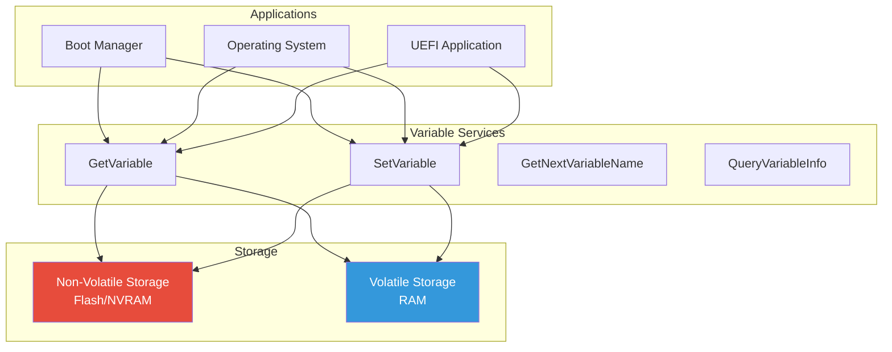

# Chapter 13: UEFI Variables
{: .fs-9 }

Persistent storage using UEFI variable services.
{: .fs-6 .fw-300 }

---

## Overview

### When to Use UEFI Variables

{: .important }
> **Use UEFI Variables when you need to:**
> - Store persistent configuration that survives reboots
> - Read or modify boot options (BootOrder, BootXXXX)
> - Access Secure Boot settings (PK, KEK, db, dbx)
> - Share data between UEFI and operating system

| Scenario | Variable | Attributes |
|:---------|:---------|:-----------|
| **Read boot timeout** | Timeout | NV+BS+RT |
| **Modify boot order** | BootOrder | NV+BS+RT |
| **Add boot entry** | Boot0001 (etc.) | NV+BS+RT |
| **Check Secure Boot status** | SecureBoot | BS+RT (read-only) |
| **Store driver config** | VendorVariable | NV+BS or NV+BS+RT |
| **Temporary data** | VolatileVar | BS only (RAM) |
| **OS-to-firmware data** | OsIndications | NV+BS+RT |

**Variable Attribute Combinations:**

| Attributes | When to Use |
|:-----------|:------------|
| **NV + BS** | Firmware-only persistent config |
| **NV + BS + RT** | Config accessible from OS (most common) |
| **BS only** | Temporary boot-time data |
| **BS + RT** | Temporary data, OS-accessible |
| **NV + BS + RT + AUTH** | Secure Boot variables |

**Typical Variable Users:**
- **Boot managers**: Manage boot entries, read BootOrder
- **Setup utilities**: Store user configuration choices
- **OS installers**: Add new boot entries
- **Secure Boot tools**: Enroll keys (requires authentication)
- **Runtime drivers**: Access config from OS (GetVariable from kernel)
- **Diagnostics**: Read system info (platform variables)

**Important Considerations:**
- Limited NVRAM space - don't store large data
- Authenticated variables require signing (Secure Boot)
- QueryVariableInfo to check available space
- Runtime access only for RT-accessible variables
- Some variables are read-only (SecureBoot, SetupMode)

### Variable Architecture

UEFI variables provide persistent key-value storage:



### Variable Namespaces

Variables are identified by GUID + Name:

| Namespace | GUID | Purpose |
|:----------|:-----|:--------|
| **Global** | `8BE4DF61-93CA-11D2-AA0D-00E098032B8C` | Standard UEFI variables |
| **Secure Boot** | `D719B2CB-3D3A-4596-A3BC-DAD00E67656F` | Security database |
| **Shell** | `158DEF5A-F656-419C-B027-7A3192C079D2` | Shell settings |
| **Vendor** | Custom | OEM/application variables |

### Variable Attributes

```c
//
// Variable attribute flags
//
#define EFI_VARIABLE_NON_VOLATILE                           0x00000001
#define EFI_VARIABLE_BOOTSERVICE_ACCESS                     0x00000002
#define EFI_VARIABLE_RUNTIME_ACCESS                         0x00000004
#define EFI_VARIABLE_HARDWARE_ERROR_RECORD                  0x00000008
#define EFI_VARIABLE_AUTHENTICATED_WRITE_ACCESS             0x00000010  // Deprecated
#define EFI_VARIABLE_TIME_BASED_AUTHENTICATED_WRITE_ACCESS  0x00000020
#define EFI_VARIABLE_APPEND_WRITE                           0x00000040
```

| Attribute | Meaning |
|:----------|:--------|
| `NON_VOLATILE` | Persists across reboots (stored in flash) |
| `BOOTSERVICE_ACCESS` | Accessible during boot services |
| `RUNTIME_ACCESS` | Accessible after ExitBootServices (OS) |
| `TIME_BASED_AUTHENTICATED_WRITE_ACCESS` | Requires signature for writes |
| `APPEND_WRITE` | Append to existing data |

---

## Initialization

### Using Variable Services

```c
#include <Uefi.h>
#include <Library/UefiLib.h>
#include <Library/UefiRuntimeServicesTableLib.h>
#include <Guid/GlobalVariable.h>

//
// Variable services are available via gRT (Runtime Services)
// No initialization needed - always available after DXE
//

EFI_STATUS
CheckVariableServices (
  VOID
  )
{
  //
  // gRT is globally available
  //
  if (gRT == NULL) {
    return EFI_NOT_READY;
  }

  if (gRT->GetVariable == NULL ||
      gRT->SetVariable == NULL ||
      gRT->GetNextVariableName == NULL) {
    return EFI_UNSUPPORTED;
  }

  return EFI_SUCCESS;
}
```

### Querying Variable Storage Info

```c
EFI_STATUS
GetVariableStorageInfo (
  VOID
  )
{
  EFI_STATUS Status;
  UINT64 MaxStorageSize;
  UINT64 RemainingStorage;
  UINT64 MaxVariableSize;

  //
  // Query non-volatile variable storage
  //
  Status = gRT->QueryVariableInfo(
             EFI_VARIABLE_NON_VOLATILE |
             EFI_VARIABLE_BOOTSERVICE_ACCESS,
             &MaxStorageSize,
             &RemainingStorage,
             &MaxVariableSize
           );

  if (!EFI_ERROR(Status)) {
    Print(L"Non-Volatile Variable Storage:\n");
    Print(L"  Maximum Storage:   %ld bytes\n", MaxStorageSize);
    Print(L"  Remaining Storage: %ld bytes\n", RemainingStorage);
    Print(L"  Max Variable Size: %ld bytes\n", MaxVariableSize);
  }

  //
  // Query volatile variable storage
  //
  Status = gRT->QueryVariableInfo(
             EFI_VARIABLE_BOOTSERVICE_ACCESS,
             &MaxStorageSize,
             &RemainingStorage,
             &MaxVariableSize
           );

  if (!EFI_ERROR(Status)) {
    Print(L"\nVolatile Variable Storage:\n");
    Print(L"  Maximum Storage:   %ld bytes\n", MaxStorageSize);
    Print(L"  Remaining Storage: %ld bytes\n", RemainingStorage);
    Print(L"  Max Variable Size: %ld bytes\n", MaxVariableSize);
  }

  return Status;
}
```

---

## Configuration

### Reading Variables

```c
EFI_STATUS
ReadVariable (
  IN  CHAR16    *VariableName,
  IN  EFI_GUID  *VendorGuid,
  OUT UINT32    *Attributes,  // Optional, can be NULL
  OUT VOID      **Data,
  OUT UINTN     *DataSize
  )
{
  EFI_STATUS Status;
  UINTN BufferSize;

  //
  // First call to get required size
  //
  BufferSize = 0;
  Status = gRT->GetVariable(
             VariableName,
             VendorGuid,
             NULL,
             &BufferSize,
             NULL
           );

  if (Status != EFI_BUFFER_TOO_SMALL) {
    return Status;
  }

  //
  // Allocate buffer
  //
  *Data = AllocatePool(BufferSize);
  if (*Data == NULL) {
    return EFI_OUT_OF_RESOURCES;
  }

  //
  // Read variable
  //
  Status = gRT->GetVariable(
             VariableName,
             VendorGuid,
             Attributes,
             &BufferSize,
             *Data
           );

  if (EFI_ERROR(Status)) {
    FreePool(*Data);
    *Data = NULL;
    return Status;
  }

  *DataSize = BufferSize;
  return EFI_SUCCESS;
}

//
// Read a UINT32 variable
//
EFI_STATUS
ReadUint32Variable (
  IN  CHAR16    *VariableName,
  IN  EFI_GUID  *VendorGuid,
  OUT UINT32    *Value
  )
{
  EFI_STATUS Status;
  UINTN DataSize = sizeof(UINT32);

  Status = gRT->GetVariable(
             VariableName,
             VendorGuid,
             NULL,
             &DataSize,
             Value
           );

  return Status;
}
```

### Writing Variables

```c
EFI_STATUS
WriteVariable (
  IN CHAR16    *VariableName,
  IN EFI_GUID  *VendorGuid,
  IN UINT32    Attributes,
  IN VOID      *Data,
  IN UINTN     DataSize
  )
{
  return gRT->SetVariable(
           VariableName,
           VendorGuid,
           Attributes,
           DataSize,
           Data
         );
}

//
// Write persistent variable (survives reboot)
//
EFI_STATUS
WritePersistentVariable (
  IN CHAR16    *VariableName,
  IN EFI_GUID  *VendorGuid,
  IN VOID      *Data,
  IN UINTN     DataSize
  )
{
  return gRT->SetVariable(
           VariableName,
           VendorGuid,
           EFI_VARIABLE_NON_VOLATILE |
           EFI_VARIABLE_BOOTSERVICE_ACCESS |
           EFI_VARIABLE_RUNTIME_ACCESS,
           DataSize,
           Data
         );
}

//
// Write volatile variable (lost on reboot)
//
EFI_STATUS
WriteVolatileVariable (
  IN CHAR16    *VariableName,
  IN EFI_GUID  *VendorGuid,
  IN VOID      *Data,
  IN UINTN     DataSize
  )
{
  return gRT->SetVariable(
           VariableName,
           VendorGuid,
           EFI_VARIABLE_BOOTSERVICE_ACCESS,
           DataSize,
           Data
         );
}
```

### Deleting Variables

```c
EFI_STATUS
DeleteVariable (
  IN CHAR16    *VariableName,
  IN EFI_GUID  *VendorGuid
  )
{
  //
  // Delete by setting DataSize to 0
  //
  return gRT->SetVariable(
           VariableName,
           VendorGuid,
           0,   // Attributes don't matter for delete
           0,   // DataSize = 0 means delete
           NULL
         );
}
```

### Enumerating Variables

```c
EFI_STATUS
ListAllVariables (
  VOID
  )
{
  EFI_STATUS Status;
  CHAR16 VariableName[256];
  EFI_GUID VendorGuid;
  UINTN NameSize;
  UINTN Count = 0;

  //
  // Initialize for first call
  //
  VariableName[0] = L'\0';

  Print(L"All UEFI Variables:\n");
  Print(L"-------------------\n");

  while (TRUE) {
    NameSize = sizeof(VariableName);

    Status = gRT->GetNextVariableName(
               &NameSize,
               VariableName,
               &VendorGuid
             );

    if (Status == EFI_NOT_FOUND) {
      //
      // No more variables
      //
      break;
    }

    if (EFI_ERROR(Status)) {
      Print(L"Error: %r\n", Status);
      break;
    }

    //
    // Print variable info
    //
    Print(L"%d. %g:%s\n", ++Count, &VendorGuid, VariableName);

    //
    // Optionally get attributes
    //
    UINT32 Attributes;
    UINTN DataSize = 0;

    gRT->GetVariable(VariableName, &VendorGuid, &Attributes, &DataSize, NULL);

    Print(L"   Attributes: ");
    if (Attributes & EFI_VARIABLE_NON_VOLATILE) Print(L"NV ");
    if (Attributes & EFI_VARIABLE_BOOTSERVICE_ACCESS) Print(L"BS ");
    if (Attributes & EFI_VARIABLE_RUNTIME_ACCESS) Print(L"RT ");
    if (Attributes & EFI_VARIABLE_TIME_BASED_AUTHENTICATED_WRITE_ACCESS) {
      Print(L"AUTH ");
    }
    Print(L"Size: %d\n", DataSize);
  }

  Print(L"\nTotal: %d variables\n", Count);

  return EFI_SUCCESS;
}
```

---

## Porting Guide

### Platform Variable Storage

```c
//
// DSC file: Variable driver configuration
//
// [Components]
//   # Variable services
//   MdeModulePkg/Universal/Variable/RuntimeDxe/VariableRuntimeDxe.inf
//
//   # Or for SMM-protected variables
//   MdeModulePkg/Universal/Variable/RuntimeDxe/VariableSmmRuntimeDxe.inf
//
// [PcdsFixedAtBuild]
//   # Variable storage location in flash
//   gEfiMdeModulePkgTokenSpaceGuid.PcdFlashNvStorageVariableBase|0xFFF00000
//   gEfiMdeModulePkgTokenSpaceGuid.PcdFlashNvStorageVariableSize|0x10000
//
//   # Maximum variable size
//   gEfiMdeModulePkgTokenSpaceGuid.PcdMaxVariableSize|0x8000
//
```

### Emulated Variable Storage (QEMU)

```c
//
// QEMU/OVMF uses emulated flash
//
// [Components]
//   OvmfPkg/EmuVariableFvbRuntimeDxe/Fvb.inf
//
// Variables stored in pflash device
// OVMF_VARS.fd contains variable storage
//
```

### Variable Policies

```c
#include <Protocol/VariablePolicy.h>

//
// Lock a variable (prevent modification)
//
EFI_STATUS
LockVariable (
  IN CHAR16    *VariableName,
  IN EFI_GUID  *VendorGuid
  )
{
  EFI_STATUS Status;
  EDKII_VARIABLE_POLICY_PROTOCOL *VariablePolicy;

  Status = gBS->LocateProtocol(
             &gEdkiiVariablePolicyProtocolGuid,
             NULL,
             (VOID **)&VariablePolicy
           );

  if (EFI_ERROR(Status)) {
    return Status;
  }

  //
  // Register policy to lock variable
  //
  // This would typically be done during platform initialization
  //

  return EFI_SUCCESS;
}
```

---

## Standard Variables

### Boot Variables

```c
//
// Read BootOrder
//
EFI_STATUS
GetBootOrder (
  OUT UINT16  **BootOrder,
  OUT UINTN   *BootOrderCount
  )
{
  EFI_STATUS Status;
  VOID *Data;
  UINTN DataSize;

  Status = ReadVariable(
             L"BootOrder",
             &gEfiGlobalVariableGuid,
             NULL,
             &Data,
             &DataSize
           );

  if (EFI_ERROR(Status)) {
    return Status;
  }

  *BootOrder = (UINT16 *)Data;
  *BootOrderCount = DataSize / sizeof(UINT16);

  return EFI_SUCCESS;
}

//
// Read a Boot option (Boot0000, Boot0001, etc.)
//
EFI_STATUS
GetBootOption (
  IN  UINT16                    OptionNumber,
  OUT EFI_LOAD_OPTION           **LoadOption,
  OUT UINTN                     *LoadOptionSize
  )
{
  CHAR16 VariableName[16];
  VOID *Data;
  UINTN DataSize;
  EFI_STATUS Status;

  UnicodeSPrint(VariableName, sizeof(VariableName), L"Boot%04x", OptionNumber);

  Status = ReadVariable(
             VariableName,
             &gEfiGlobalVariableGuid,
             NULL,
             &Data,
             &DataSize
           );

  if (EFI_ERROR(Status)) {
    return Status;
  }

  *LoadOption = (EFI_LOAD_OPTION *)Data;
  *LoadOptionSize = DataSize;

  return EFI_SUCCESS;
}
```

### Secure Boot Variables

```c
//
// Check if Secure Boot is enabled
//
BOOLEAN
IsSecureBootEnabled (
  VOID
  )
{
  EFI_STATUS Status;
  UINT8 SecureBoot;
  UINTN DataSize = sizeof(SecureBoot);

  Status = gRT->GetVariable(
             L"SecureBoot",
             &gEfiGlobalVariableGuid,
             NULL,
             &DataSize,
             &SecureBoot
           );

  if (EFI_ERROR(Status)) {
    return FALSE;
  }

  return (SecureBoot == 1);
}

//
// Check Setup Mode
//
BOOLEAN
IsInSetupMode (
  VOID
  )
{
  EFI_STATUS Status;
  UINT8 SetupMode;
  UINTN DataSize = sizeof(SetupMode);

  Status = gRT->GetVariable(
             L"SetupMode",
             &gEfiGlobalVariableGuid,
             NULL,
             &DataSize,
             &SetupMode
           );

  if (EFI_ERROR(Status)) {
    return FALSE;
  }

  return (SetupMode == 1);
}
```

### Timeout and Other Settings

```c
//
// Get/Set boot timeout
//
EFI_STATUS
GetBootTimeout (
  OUT UINT16  *Timeout
  )
{
  UINTN DataSize = sizeof(UINT16);

  return gRT->GetVariable(
           L"Timeout",
           &gEfiGlobalVariableGuid,
           NULL,
           &DataSize,
           Timeout
         );
}

EFI_STATUS
SetBootTimeout (
  IN UINT16  Timeout
  )
{
  return gRT->SetVariable(
           L"Timeout",
           &gEfiGlobalVariableGuid,
           EFI_VARIABLE_NON_VOLATILE |
           EFI_VARIABLE_BOOTSERVICE_ACCESS |
           EFI_VARIABLE_RUNTIME_ACCESS,
           sizeof(Timeout),
           &Timeout
         );
}
```

---

## Example: Variable Demo

```c
/** @file
  UEFI Variables Demonstration
**/

#include <Uefi.h>
#include <Library/UefiLib.h>
#include <Library/UefiRuntimeServicesTableLib.h>
#include <Library/MemoryAllocationLib.h>
#include <Guid/GlobalVariable.h>

//
// Custom vendor GUID for demo
//
EFI_GUID gDemoVendorGuid = {
  0x12345678, 0xabcd, 0xef01,
  {0x23, 0x45, 0x67, 0x89, 0xab, 0xcd, 0xef, 0x01}
};

EFI_STATUS
EFIAPI
UefiMain (
  IN EFI_HANDLE        ImageHandle,
  IN EFI_SYSTEM_TABLE  *SystemTable
  )
{
  EFI_STATUS Status;
  UINT16 Timeout;
  UINTN DataSize;
  UINT32 DemoValue;
  UINT32 Attributes;

  Print(L"=== UEFI Variables Demo ===\n\n");

  //
  // Query variable storage info
  //
  {
    UINT64 MaxStorage, Remaining, MaxSize;

    Status = gRT->QueryVariableInfo(
               EFI_VARIABLE_NON_VOLATILE | EFI_VARIABLE_BOOTSERVICE_ACCESS,
               &MaxStorage,
               &Remaining,
               &MaxSize
             );

    if (!EFI_ERROR(Status)) {
      Print(L"NV Storage: %ld KB total, %ld KB free\n",
        MaxStorage / 1024, Remaining / 1024);
      Print(L"Max variable size: %ld bytes\n\n", MaxSize);
    }
  }

  //
  // Read standard variables
  //
  Print(L"Standard Variables:\n");

  DataSize = sizeof(Timeout);
  Status = gRT->GetVariable(
             L"Timeout",
             &gEfiGlobalVariableGuid,
             NULL,
             &DataSize,
             &Timeout
           );

  if (!EFI_ERROR(Status)) {
    Print(L"  Boot Timeout: %d seconds\n", Timeout);
  }

  //
  // Secure Boot status
  //
  {
    UINT8 SecureBoot = 0;
    DataSize = sizeof(SecureBoot);

    Status = gRT->GetVariable(
               L"SecureBoot",
               &gEfiGlobalVariableGuid,
               NULL,
               &DataSize,
               &SecureBoot
             );

    Print(L"  Secure Boot: %s\n",
      (!EFI_ERROR(Status) && SecureBoot) ? L"Enabled" : L"Disabled");
  }

  Print(L"\n");

  //
  // Create a demo variable
  //
  Print(L"Creating demo variable...\n");

  DemoValue = 0x12345678;
  Status = gRT->SetVariable(
             L"DemoCounter",
             &gDemoVendorGuid,
             EFI_VARIABLE_NON_VOLATILE |
             EFI_VARIABLE_BOOTSERVICE_ACCESS,
             sizeof(DemoValue),
             &DemoValue
           );

  if (!EFI_ERROR(Status)) {
    Print(L"  Created DemoCounter = 0x%08x\n", DemoValue);
  } else {
    Print(L"  Failed to create: %r\n", Status);
  }

  //
  // Read it back
  //
  DataSize = sizeof(DemoValue);
  Status = gRT->GetVariable(
             L"DemoCounter",
             &gDemoVendorGuid,
             &Attributes,
             &DataSize,
             &DemoValue
           );

  if (!EFI_ERROR(Status)) {
    Print(L"  Read back: 0x%08x, Attributes: 0x%x\n", DemoValue, Attributes);
  }

  //
  // Increment and update
  //
  DemoValue++;
  Status = gRT->SetVariable(
             L"DemoCounter",
             &gDemoVendorGuid,
             EFI_VARIABLE_NON_VOLATILE |
             EFI_VARIABLE_BOOTSERVICE_ACCESS,
             sizeof(DemoValue),
             &DemoValue
           );

  if (!EFI_ERROR(Status)) {
    Print(L"  Updated to: 0x%08x\n", DemoValue);
  }

  //
  // Delete the variable
  //
  Print(L"\nDeleting demo variable...\n");
  Status = gRT->SetVariable(
             L"DemoCounter",
             &gDemoVendorGuid,
             0,
             0,
             NULL
           );

  Print(L"  Delete result: %r\n", Status);

  //
  // Count all variables
  //
  Print(L"\nCounting all variables...\n");
  {
    CHAR16 Name[256];
    EFI_GUID Guid;
    UINTN NameSize;
    UINTN Count = 0;

    Name[0] = L'\0';

    while (TRUE) {
      NameSize = sizeof(Name);
      Status = gRT->GetNextVariableName(&NameSize, Name, &Guid);

      if (Status == EFI_NOT_FOUND) {
        break;
      }

      if (EFI_ERROR(Status)) {
        break;
      }

      Count++;
    }

    Print(L"  Total variables: %d\n", Count);
  }

  Print(L"\nPress any key to exit...\n");
  {
    EFI_INPUT_KEY Key;
    UINTN Index;
    gBS->WaitForEvent(1, &gST->ConIn->WaitForKey, &Index);
    gST->ConIn->ReadKeyStroke(gST->ConIn, &Key);
  }

  return EFI_SUCCESS;
}
```

---

## Service Reference

### Runtime Services

```c
//
// Variable-related Runtime Services
//
EFI_STATUS GetVariable(
  IN     CHAR16    *VariableName,
  IN     EFI_GUID  *VendorGuid,
  OUT    UINT32    *Attributes OPTIONAL,
  IN OUT UINTN     *DataSize,
  OUT    VOID      *Data OPTIONAL
);

EFI_STATUS SetVariable(
  IN CHAR16    *VariableName,
  IN EFI_GUID  *VendorGuid,
  IN UINT32    Attributes,
  IN UINTN     DataSize,
  IN VOID      *Data
);

EFI_STATUS GetNextVariableName(
  IN OUT UINTN     *VariableNameSize,
  IN OUT CHAR16    *VariableName,
  IN OUT EFI_GUID  *VendorGuid
);

EFI_STATUS QueryVariableInfo(
  IN  UINT32  Attributes,
  OUT UINT64  *MaximumVariableStorageSize,
  OUT UINT64  *RemainingVariableStorageSize,
  OUT UINT64  *MaximumVariableSize
);
```

---

## UEFI Specification Reference

- **UEFI Spec Section 8.2**: Variable Services
- **UEFI Spec Section 3.3**: Globally Defined Variables

---

## Summary

1. **Variables** are identified by GUID + Name
2. **Attributes** control persistence and access
3. **NON_VOLATILE** variables survive reboot
4. **RUNTIME_ACCESS** allows OS access
5. **Standard variables** (BootOrder, Timeout) use Global GUID
6. **Delete** by calling SetVariable with DataSize = 0

---

## Next Steps

- [Part 4: Advanced Topics](../part4/) - PEI, DXE, SMM, Security
- [Chapter 14: PEI Phase](../part4/14-pei-phase.html) - Pre-EFI Initialization

---

{: .note }
> **Source Code**: See [`examples/UefiGuidePkg/VariableExample/`](https://github.com/MichaelTien8901/uefi-guide-tutorial/tree/main/examples/UefiGuidePkg/VariableExample) for complete examples.
