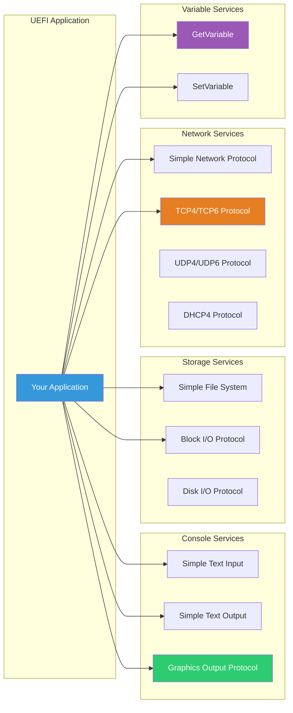
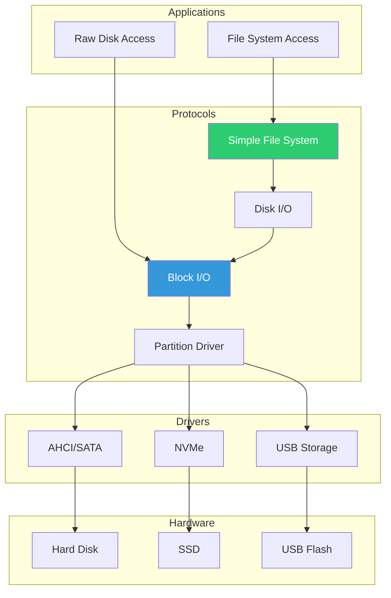
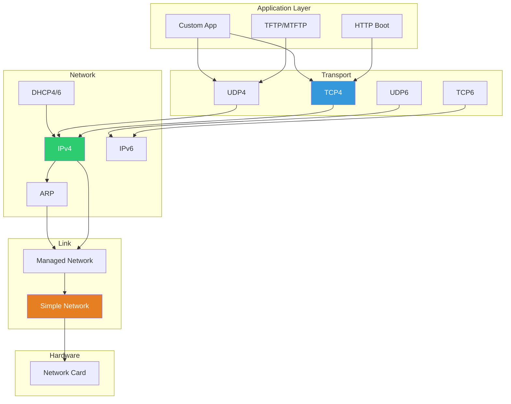

# Part 3: Essential Services
{: .fs-9 }

Working with UEFI I/O, storage, network, and variable services.
{: .fs-6 .fw-300 }

---

## What You'll Learn

| Chapter | Topics |
|:--------|:-------|
| **[8. Console I/O]()** | Text input/output, cursor control, colors |
| **[9. Graphics (GOP)]()** | Framebuffer, video modes, drawing operations |
| **[10. File System]()** | Reading/writing files, directory operations |
| **[11. Block I/O]()** | Sector access, storage devices, partitions |
| **[12. Network Stack]()** | TCP/UDP, DHCP, network configuration |
| **[13. UEFI Variables]()** | Persistent storage, boot options, Secure Boot |

## Service Architecture



## Storage Stack



## Network Protocol Stack



---

## Key Concepts

### Protocol Discovery Pattern

All services follow a consistent pattern:

```c
EFI_STATUS
UseService (VOID)
{
  EFI_STATUS Status;
  EFI_HANDLE *Handles;
  UINTN HandleCount;
  SOME_PROTOCOL *Protocol;

  // 1. Find handles with the protocol
  Status = gBS->LocateHandleBuffer(
             ByProtocol,
             &gSomeProtocolGuid,
             NULL,
             &HandleCount,
             &Handles
           );

  // 2. Get protocol from handle
  Status = gBS->HandleProtocol(
             Handles[0],
             &gSomeProtocolGuid,
             (VOID **)&Protocol
           );

  // 3. Use the protocol
  Protocol->SomeFunction(...);

  // 4. Cleanup
  gBS->FreePool(Handles);

  return Status;
}
```

### Service Binding Pattern

Network protocols use Service Binding:

```c
// 1. Get Service Binding
gBS->HandleProtocol(Handle, &gServiceBindingGuid, &ServiceBinding);

// 2. Create child instance
ServiceBinding->CreateChild(ServiceBinding, &ChildHandle);

// 3. Get protocol from child
gBS->HandleProtocol(ChildHandle, &gProtocolGuid, &Protocol);

// 4. Use protocol...

// 5. Destroy child when done
ServiceBinding->DestroyChild(ServiceBinding, ChildHandle);
```

---

{: .note }
> **Practical Focus:** This section emphasizes working code examples. Each chapter includes complete, buildable examples you can run in QEMU.

{: .warning }
> **Prerequisites:** Ensure you have completed Parts 1 and 2. You should be comfortable with the UEFI driver model and protocol system.
