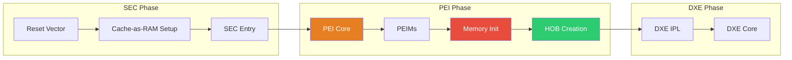

# Chapter 14: PEI Phase
{: .fs-9 }

Pre-EFI Initialization - memory initialization and early platform setup.
{: .fs-6 .fw-300 }

---

## Overview

### When to Work with PEI Phase

{: .important }
> **Work with PEI phase when you need to:**
> - Initialize memory controllers (DRAM training, SPD detection)
> - Perform early platform initialization before main memory is available
> - Configure CPU and chipset for DXE phase
> - Pass hardware discovery data to later boot phases via HOBs

| Scenario | PEI Component | Example |
|:---------|:--------------|:--------|
| **Memory controller init** | MRC PEIM | Intel FSP MemoryInit |
| **Early CPU setup** | CPU PEIM | Microcode loading, cache config |
| **Chipset configuration** | Chipset PEIM | PCH/SoC initialization |
| **Recovery mode** | Recovery PEIM | Load recovery firmware |
| **S3 resume** | S3 PEIMs | Restore saved state quickly |
| **Pass info to DXE** | HOB producer | Memory map, CPU info HOBs |

**Who Works with PEI:**

| Role | PEI Involvement | Typical Tasks |
|:-----|:----------------|:--------------|
| **Silicon vendor** | Heavy | Memory training, FSP development |
| **Platform developer** | Moderate | Platform PEIMs, PCD configuration |
| **BIOS engineer** | Moderate | Integration, debug, customization |
| **Application developer** | None | PEI complete before apps run |
| **Driver developer** | Rare | Only for early hardware init |

**Key PEI Constraints:**
- Very limited stack space (use sparingly)
- No permanent memory until MRC completes
- CAR (Cache-as-RAM) for initial execution
- Simple API (PPIs, not full protocols)
- Must be fast (affects boot time)

**Common PEI Mistakes to Avoid:**
- Large stack allocations (limited CAR space)
- Assuming memory is available early
- Complex algorithms before memory init
- Missing HOBs that DXE needs

### PEI in the Boot Flow

PEI (Pre-EFI Initialization) runs immediately after SEC with minimal resources:



### PEI Characteristics

| Aspect | Description |
|:-------|:------------|
| **Memory** | Initially runs from CAR (Cache-as-RAM), then permanent memory |
| **Stack** | Very limited (typically 64KB or less) |
| **Heap** | Small temporary RAM for allocations |
| **Services** | PEI Services (subset of Boot Services) |
| **Communication** | PPIs (PEIM-to-PEIM Interfaces) |
| **Data Passing** | HOBs (Hand-Off Blocks) to DXE |

### PEI Core Responsibilities

1. **Dispatch PEIMs** - Load and execute Pre-EFI Initialization Modules
2. **Provide PEI Services** - Memory allocation, PPI management
3. **Memory Discovery** - Coordinate permanent memory initialization
4. **HOB Creation** - Build data structures for DXE
5. **DXE IPL** - Load and transfer to DXE phase

---

## Initialization

### SEC to PEI Handoff

```c
//
// SEC passes control to PEI Core with this structure
//
typedef struct {
  UINTN                   BootFirmwareVolumeBase;
  UINTN                   BootFirmwareVolumeSize;
  UINTN                   TemporaryRamBase;
  UINTN                   TemporaryRamSize;
  UINTN                   PeiTemporaryRamBase;
  UINTN                   PeiTemporaryRamSize;
  UINTN                   StackBase;
  UINTN                   StackSize;
} EFI_SEC_PEI_HAND_OFF;

//
// SEC Entry Point calls PEI Core
//
VOID
EFIAPI
SecStartup (
  IN UINTN  BootFirmwareVolumePtr
  )
{
  EFI_SEC_PEI_HAND_OFF  SecCoreData;
  EFI_PEI_CORE_ENTRY_POINT  PeiCoreEntry;

  //
  // Initialize handoff structure
  //
  SecCoreData.BootFirmwareVolumeBase = BootFirmwareVolumePtr;
  SecCoreData.BootFirmwareVolumeSize = PcdGet32(PcdBfvSize);
  SecCoreData.TemporaryRamBase = PcdGet32(PcdTemporaryRamBase);
  SecCoreData.TemporaryRamSize = PcdGet32(PcdTemporaryRamSize);
  SecCoreData.PeiTemporaryRamBase = PcdGet32(PcdPeiTemporaryRamBase);
  SecCoreData.PeiTemporaryRamSize = PcdGet32(PcdPeiTemporaryRamSize);
  SecCoreData.StackBase = PcdGet32(PcdPeiStackBase);
  SecCoreData.StackSize = PcdGet32(PcdPeiStackSize);

  //
  // Find PEI Core entry point
  //
  FindPeiCoreEntry(&PeiCoreEntry);

  //
  // Transfer to PEI Core
  //
  (*PeiCoreEntry)(&SecCoreData, NULL);

  //
  // Should never return
  //
  CpuDeadLoop();
}
```

### PEIM Entry Point

```c
/** @file
  Sample PEIM (Pre-EFI Initialization Module)
**/

#include <PiPei.h>
#include <Library/PeiServicesLib.h>
#include <Library/DebugLib.h>

/**
  PEIM Entry Point

  @param  FileHandle  Handle of the PEIM FFS file
  @param  PeiServices Pointer to PEI Services table

  @retval EFI_SUCCESS PEIM executed successfully
**/
EFI_STATUS
EFIAPI
SamplePeimEntryPoint (
  IN EFI_PEI_FILE_HANDLE     FileHandle,
  IN CONST EFI_PEI_SERVICES  **PeiServices
  )
{
  EFI_STATUS Status;

  DEBUG((DEBUG_INFO, "SamplePeim: Entry\n"));

  //
  // Perform PEIM initialization
  //

  //
  // Install PPIs if needed
  //

  //
  // Create HOBs if needed
  //

  return EFI_SUCCESS;
}
```

### PEIM INF File

```ini
[Defines]
  INF_VERSION    = 0x00010017
  BASE_NAME      = SamplePeim
  FILE_GUID      = 12345678-1234-1234-1234-123456789ABC
  MODULE_TYPE    = PEIM
  VERSION_STRING = 1.0
  ENTRY_POINT    = SamplePeimEntryPoint

[Sources]
  SamplePeim.c

[Packages]
  MdePkg/MdePkg.dec
  MdeModulePkg/MdeModulePkg.dec

[LibraryClasses]
  PeimEntryPoint
  PeiServicesLib
  DebugLib

[Ppis]
  # PPIs this PEIM produces or consumes

[Depex]
  TRUE
  # Or specify PPI dependencies:
  # gEfiPeiMemoryDiscoveredPpiGuid
```

---

## Configuration

### PEI Services

```c
//
// PEI Services Table - subset of functionality available in PEI
//
typedef struct _EFI_PEI_SERVICES {
  EFI_TABLE_HEADER              Hdr;

  // PPI Functions
  EFI_PEI_INSTALL_PPI           InstallPpi;
  EFI_PEI_REINSTALL_PPI         ReInstallPpi;
  EFI_PEI_LOCATE_PPI            LocatePpi;
  EFI_PEI_NOTIFY_PPI            NotifyPpi;

  // Boot Mode
  EFI_PEI_GET_BOOT_MODE         GetBootMode;
  EFI_PEI_SET_BOOT_MODE         SetBootMode;

  // HOB Functions
  EFI_PEI_GET_HOB_LIST          GetHobList;
  EFI_PEI_CREATE_HOB            CreateHob;

  // Firmware Volume Functions
  EFI_PEI_FFS_FIND_NEXT_VOLUME2 FfsFindNextVolume;
  EFI_PEI_FFS_FIND_NEXT_FILE2   FfsFindNextFile;
  EFI_PEI_FFS_FIND_SECTION_DATA3 FfsFindSectionData3;

  // Memory Functions
  EFI_PEI_INSTALL_PEI_MEMORY    InstallPeiMemory;
  EFI_PEI_ALLOCATE_PAGES        AllocatePages;
  EFI_PEI_ALLOCATE_POOL         AllocatePool;
  EFI_PEI_COPY_MEM              CopyMem;
  EFI_PEI_SET_MEM               SetMem;

  // Reset
  EFI_PEI_RESET_SYSTEM          ResetSystem;
  EFI_PEI_RESET2_SYSTEM         ResetSystem2;
} EFI_PEI_SERVICES;

//
// Using PEI Services
//
EFI_STATUS
UsePeiServices (
  IN CONST EFI_PEI_SERVICES  **PeiServices
  )
{
  EFI_STATUS Status;
  EFI_BOOT_MODE BootMode;
  VOID *Buffer;

  //
  // Get boot mode
  //
  Status = (*PeiServices)->GetBootMode(PeiServices, &BootMode);

  //
  // Allocate memory (after memory discovered)
  //
  Status = (*PeiServices)->AllocatePool(
             PeiServices,
             256,
             &Buffer
           );

  return Status;
}
```

### PPIs (PEIM-to-PEIM Interfaces)

```c
//
// PPI = Protocol-like interface for PEI phase
//

//
// Define a custom PPI
//
typedef struct _MY_CUSTOM_PPI MY_CUSTOM_PPI;

typedef
EFI_STATUS
(EFIAPI *MY_PPI_FUNCTION)(
  IN MY_CUSTOM_PPI  *This,
  IN UINTN          Parameter
  );

struct _MY_CUSTOM_PPI {
  MY_PPI_FUNCTION  DoSomething;
};

//
// PPI GUID
//
EFI_GUID gMyCustomPpiGuid = {
  0x12345678, 0xabcd, 0xef01,
  {0x23, 0x45, 0x67, 0x89, 0xab, 0xcd, 0xef, 0x01}
};

//
// Installing a PPI
//
EFI_STATUS
InstallMyPpi (
  IN CONST EFI_PEI_SERVICES  **PeiServices
  )
{
  EFI_STATUS Status;
  EFI_PEI_PPI_DESCRIPTOR *PpiDescriptor;
  MY_CUSTOM_PPI *MyPpi;

  //
  // Allocate PPI structure
  //
  Status = (*PeiServices)->AllocatePool(
             PeiServices,
             sizeof(MY_CUSTOM_PPI),
             (VOID **)&MyPpi
           );

  //
  // Initialize PPI
  //
  MyPpi->DoSomething = MyPpiDoSomething;

  //
  // Allocate descriptor
  //
  Status = (*PeiServices)->AllocatePool(
             PeiServices,
             sizeof(EFI_PEI_PPI_DESCRIPTOR),
             (VOID **)&PpiDescriptor
           );

  PpiDescriptor->Flags = EFI_PEI_PPI_DESCRIPTOR_PPI |
                         EFI_PEI_PPI_DESCRIPTOR_TERMINATE_LIST;
  PpiDescriptor->Guid = &gMyCustomPpiGuid;
  PpiDescriptor->Ppi = MyPpi;

  //
  // Install PPI
  //
  Status = (*PeiServices)->InstallPpi(PeiServices, PpiDescriptor);

  return Status;
}

//
// Locating a PPI
//
EFI_STATUS
UseMyPpi (
  IN CONST EFI_PEI_SERVICES  **PeiServices
  )
{
  EFI_STATUS Status;
  MY_CUSTOM_PPI *MyPpi;

  Status = (*PeiServices)->LocatePpi(
             PeiServices,
             &gMyCustomPpiGuid,
             0,              // Instance
             NULL,           // PpiDescriptor (optional)
             (VOID **)&MyPpi
           );

  if (!EFI_ERROR(Status)) {
    MyPpi->DoSomething(MyPpi, 42);
  }

  return Status;
}
```

### HOBs (Hand-Off Blocks)

```c
#include <Pi/PiHob.h>
#include <Library/HobLib.h>

//
// HOBs pass information from PEI to DXE
//

//
// Creating a Memory Allocation HOB
//
EFI_STATUS
CreateMemoryHob (
  IN CONST EFI_PEI_SERVICES  **PeiServices,
  IN EFI_PHYSICAL_ADDRESS    MemoryBase,
  IN UINT64                  MemoryLength,
  IN EFI_MEMORY_TYPE         MemoryType
  )
{
  return BuildMemoryAllocationHob(
           MemoryBase,
           MemoryLength,
           MemoryType
         );
}

//
// Creating a Resource Descriptor HOB
//
EFI_STATUS
CreateResourceHob (
  IN EFI_RESOURCE_TYPE           ResourceType,
  IN EFI_RESOURCE_ATTRIBUTE_TYPE Attributes,
  IN EFI_PHYSICAL_ADDRESS        PhysicalStart,
  IN UINT64                      NumberOfBytes
  )
{
  BuildResourceDescriptorHob(
    ResourceType,
    Attributes,
    PhysicalStart,
    NumberOfBytes
  );

  return EFI_SUCCESS;
}

//
// Creating a GUID Extension HOB (custom data)
//
EFI_STATUS
CreateCustomHob (
  IN CONST EFI_PEI_SERVICES  **PeiServices,
  IN EFI_GUID                *HobGuid,
  IN VOID                    *Data,
  IN UINTN                   DataSize
  )
{
  VOID *Hob;

  Hob = BuildGuidHob(HobGuid, DataSize);
  if (Hob == NULL) {
    return EFI_OUT_OF_RESOURCES;
  }

  CopyMem(Hob, Data, DataSize);

  return EFI_SUCCESS;
}

//
// HOB Types
//
// EFI_HOB_TYPE_HANDOFF           - First HOB, describes HOB list
// EFI_HOB_TYPE_MEMORY_ALLOCATION - Memory allocation
// EFI_HOB_TYPE_RESOURCE_DESCRIPTOR - Memory/IO resource
// EFI_HOB_TYPE_GUID_EXTENSION    - Custom data
// EFI_HOB_TYPE_FV                - Firmware volume
// EFI_HOB_TYPE_CPU               - CPU info
// EFI_HOB_TYPE_MEMORY_POOL       - Memory pool
// EFI_HOB_TYPE_END_OF_HOB_LIST   - End marker
//
```

---

## Porting Guide

### Platform PEI Configuration

```ini
#
# Platform DSC file - PEI configuration
#

[PcdsFixedAtBuild]
  # Temporary RAM (CAR) configuration
  gEfiMdeModulePkgTokenSpaceGuid.PcdTemporaryRamBase|0xFEF00000
  gEfiMdeModulePkgTokenSpaceGuid.PcdTemporaryRamSize|0x10000

  # PEI stack
  gEfiMdeModulePkgTokenSpaceGuid.PcdPeiCoreMaxPeimPerFv|32
  gEfiMdeModulePkgTokenSpaceGuid.PcdPeiCoreMaxPpiSupported|64

  # Memory configuration
  gEfiMdeModulePkgTokenSpaceGuid.PcdPeiMemorySize|0x1000000

[Components]
  # PEI Core
  MdeModulePkg/Core/Pei/PeiMain.inf

  # Platform PEIMs
  $(PLATFORM_PKG)/PlatformPei/PlatformPei.inf

  # Memory Init PEIM
  $(PLATFORM_PKG)/MemoryInit/MemoryInit.inf

  # DXE IPL (loads DXE)
  MdeModulePkg/Core/DxeIplPeim/DxeIpl.inf
```

### Memory Initialization PEIM

```c
/** @file
  Memory Initialization PEIM
**/

#include <PiPei.h>
#include <Ppi/MemoryDiscovered.h>
#include <Library/PeiServicesLib.h>
#include <Library/HobLib.h>

//
// Memory Discovered PPI (signals memory is ready)
//
EFI_PEI_PPI_DESCRIPTOR mMemoryDiscoveredPpi = {
  EFI_PEI_PPI_DESCRIPTOR_PPI | EFI_PEI_PPI_DESCRIPTOR_TERMINATE_LIST,
  &gEfiPeiMemoryDiscoveredPpiGuid,
  NULL
};

EFI_STATUS
EFIAPI
MemoryInitEntryPoint (
  IN EFI_PEI_FILE_HANDLE     FileHandle,
  IN CONST EFI_PEI_SERVICES  **PeiServices
  )
{
  EFI_STATUS Status;
  EFI_PHYSICAL_ADDRESS MemoryBase;
  UINT64 MemorySize;

  DEBUG((DEBUG_INFO, "MemoryInit: Starting memory initialization\n"));

  //
  // Platform-specific memory initialization
  // - Configure memory controller
  // - Train memory
  // - Detect memory size
  //
  Status = PlatformMemoryInit(&MemoryBase, &MemorySize);
  if (EFI_ERROR(Status)) {
    DEBUG((DEBUG_ERROR, "Memory init failed: %r\n", Status));
    return Status;
  }

  DEBUG((DEBUG_INFO, "Memory: Base=0x%lx Size=0x%lx\n", MemoryBase, MemorySize));

  //
  // Report memory to PEI Core
  //
  Status = (*PeiServices)->InstallPeiMemory(PeiServices, MemoryBase, MemorySize);
  if (EFI_ERROR(Status)) {
    return Status;
  }

  //
  // Build memory resource HOB
  //
  BuildResourceDescriptorHob(
    EFI_RESOURCE_SYSTEM_MEMORY,
    EFI_RESOURCE_ATTRIBUTE_PRESENT |
    EFI_RESOURCE_ATTRIBUTE_INITIALIZED |
    EFI_RESOURCE_ATTRIBUTE_TESTED |
    EFI_RESOURCE_ATTRIBUTE_UNCACHEABLE |
    EFI_RESOURCE_ATTRIBUTE_WRITE_COMBINEABLE |
    EFI_RESOURCE_ATTRIBUTE_WRITE_THROUGH_CACHEABLE |
    EFI_RESOURCE_ATTRIBUTE_WRITE_BACK_CACHEABLE,
    MemoryBase,
    MemorySize
  );

  //
  // Install Memory Discovered PPI
  //
  Status = (*PeiServices)->InstallPpi(PeiServices, &mMemoryDiscoveredPpi);

  DEBUG((DEBUG_INFO, "MemoryInit: Complete\n"));

  return Status;
}
```

### CAR (Cache-as-RAM) Considerations

```c
//
// CAR limitations:
// - Size is limited (typically 32KB-256KB depending on CPU)
// - No permanent storage - lost on CAR teardown
// - Stack must fit in CAR
// - All PEI allocations before memory init use CAR
//

//
// Stack usage in PEI must be minimal
//
#define PEI_STACK_SIZE  0x10000  // 64KB typical

//
// After InstallPeiMemory, PEI Core:
// 1. Migrates HOB list to permanent memory
// 2. Moves stack to permanent memory
// 3. Tears down CAR
// 4. Re-dispatches PEIMs that need to run after memory
//
```

### PEIM Dependency Expressions

```ini
#
# DEPEX section in INF file
#

[Depex]
  # Run unconditionally
  TRUE

  # Run after specific PPI is available
  gEfiPeiMemoryDiscoveredPpiGuid

  # Complex dependency
  gPpiAGuid AND gPpiBGuid

  # Run after memory AND another PPI
  gEfiPeiMemoryDiscoveredPpiGuid AND gMyPlatformPpiGuid
```

---

## Common PPIs

### Standard PPIs

| PPI | Purpose |
|:----|:--------|
| `gEfiPeiMemoryDiscoveredPpiGuid` | Signals permanent memory is available |
| `gEfiPeiMasterBootModePpiGuid` | Boot mode determination |
| `gEfiPeiResetPpiGuid` | System reset |
| `gEfiPeiReadOnlyVariable2PpiGuid` | Variable access in PEI |
| `gEfiPeiStallPpiGuid` | Microsecond delay |
| `gEfiPeiCpuIoPpiGuid` | CPU I/O access |
| `gEfiPeiSmbus2PpiGuid` | SMBus access |

### Using Standard PPIs

```c
#include <Ppi/ReadOnlyVariable2.h>

EFI_STATUS
ReadVariableInPei (
  IN CONST EFI_PEI_SERVICES  **PeiServices,
  IN CHAR16                  *VariableName,
  IN EFI_GUID                *VendorGuid,
  OUT VOID                   *Data,
  IN OUT UINTN               *DataSize
  )
{
  EFI_STATUS Status;
  EFI_PEI_READ_ONLY_VARIABLE2_PPI *VariablePpi;

  Status = (*PeiServices)->LocatePpi(
             PeiServices,
             &gEfiPeiReadOnlyVariable2PpiGuid,
             0,
             NULL,
             (VOID **)&VariablePpi
           );

  if (EFI_ERROR(Status)) {
    return Status;
  }

  return VariablePpi->GetVariable(
           VariablePpi,
           VariableName,
           VendorGuid,
           NULL,
           DataSize,
           Data
         );
}
```

---

## Example: Platform PEI

```c
/** @file
  Platform PEI Module
**/

#include <PiPei.h>
#include <Library/PeiServicesLib.h>
#include <Library/HobLib.h>
#include <Library/DebugLib.h>
#include <Library/IoLib.h>
#include <Ppi/MasterBootMode.h>

//
// Boot Mode PPI
//
EFI_PEI_PPI_DESCRIPTOR mBootModePpi = {
  EFI_PEI_PPI_DESCRIPTOR_PPI | EFI_PEI_PPI_DESCRIPTOR_TERMINATE_LIST,
  &gEfiPeiMasterBootModePpiGuid,
  NULL
};

EFI_STATUS
DetectBootMode (
  IN CONST EFI_PEI_SERVICES  **PeiServices,
  OUT EFI_BOOT_MODE          *BootMode
  )
{
  //
  // Platform-specific boot mode detection
  //
  // Check for:
  // - S3 resume (ACPI sleep)
  // - Recovery mode
  // - Flash update mode
  // - Normal boot
  //

  UINT8 SleepType = IoRead8(ACPI_PM1_CNT) & 0x1C;

  if (SleepType == 0x14) {  // S3
    *BootMode = BOOT_ON_S3_RESUME;
  } else if (CheckRecoveryJumper()) {
    *BootMode = BOOT_IN_RECOVERY_MODE;
  } else {
    *BootMode = BOOT_WITH_FULL_CONFIGURATION;
  }

  return EFI_SUCCESS;
}

EFI_STATUS
EFIAPI
PlatformPeiEntryPoint (
  IN EFI_PEI_FILE_HANDLE     FileHandle,
  IN CONST EFI_PEI_SERVICES  **PeiServices
  )
{
  EFI_STATUS Status;
  EFI_BOOT_MODE BootMode;

  DEBUG((DEBUG_INFO, "PlatformPei: Entry\n"));

  //
  // Detect and set boot mode
  //
  Status = DetectBootMode(PeiServices, &BootMode);
  if (EFI_ERROR(Status)) {
    BootMode = BOOT_WITH_FULL_CONFIGURATION;
  }

  Status = (*PeiServices)->SetBootMode(PeiServices, BootMode);
  ASSERT_EFI_ERROR(Status);

  //
  // Install boot mode PPI
  //
  Status = (*PeiServices)->InstallPpi(PeiServices, &mBootModePpi);

  DEBUG((DEBUG_INFO, "PlatformPei: BootMode = %d\n", BootMode));

  //
  // Create platform-specific HOBs
  //
  // CPU HOB
  BuildCpuHob(48, 16);  // Physical/Virtual address bits

  // Platform info HOB
  {
    PLATFORM_INFO PlatformInfo;
    PlatformInfo.BoardId = GetBoardId();
    PlatformInfo.BoardRevision = GetBoardRevision();

    BuildGuidDataHob(&gPlatformInfoHobGuid, &PlatformInfo, sizeof(PlatformInfo));
  }

  DEBUG((DEBUG_INFO, "PlatformPei: Complete\n"));

  return EFI_SUCCESS;
}
```

---

## UEFI/PI Specification Reference

- **PI Spec Volume 1**: PEI Core Interface Specification
- **PI Spec Volume 1 Section 2**: PEI Services
- **PI Spec Volume 1 Section 3**: PEI Dispatcher
- **PI Spec Volume 3**: HOB Specification

---

## Summary

1. **PEI runs early** with limited resources (CAR)
2. **PEIMs** are dispatched based on dependency expressions
3. **PPIs** enable PEIM-to-PEIM communication
4. **Memory Init** is the critical task - enables permanent memory
5. **HOBs** pass data from PEI to DXE phase
6. **Boot Mode** determines system behavior (normal, S3, recovery)

---

## Next Steps

- [Chapter 15: DXE Phase](15-dxe-phase/) - Driver execution environment
- [Chapter 16: SMM](16-smm/) - System Management Mode

---

{: .warning }
> **Advanced Topic:** PEI development requires deep platform knowledge. Most developers work with DXE drivers rather than PEIMs.

{: .note }
> **Debug Tip:** Use `DEBUG()` macros extensively - serial output is often the only debug mechanism in PEI.
