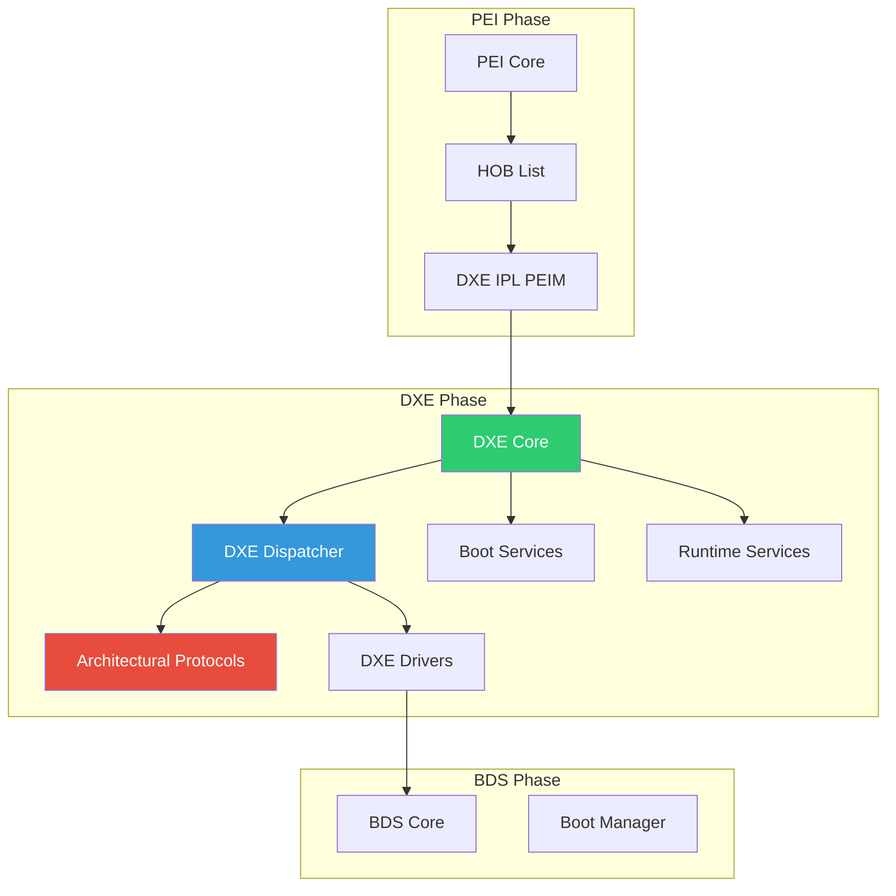
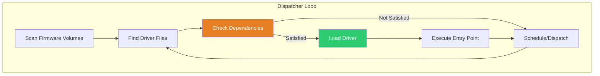

# Chapter 15: DXE Phase
{: .fs-9 }

Driver Execution Environment - full system initialization and driver loading.
{: .fs-6 .fw-300 }

---

## Overview

### When to Work with DXE Phase

{: .important }
> **Work with DXE phase when you need to:**
> - Write device drivers (storage, network, graphics)
> - Implement platform services (console, variables)
> - Add custom firmware functionality (diagnostics, setup)
> - Most UEFI development happens in DXE phase

| Scenario | DXE Component | Example |
|:---------|:--------------|:--------|
| **Storage device support** | DXE_DRIVER | AHCI, NVMe, USB mass storage |
| **Network boot** | DXE_DRIVER | Network stack, PXE |
| **Graphics display** | DXE_DRIVER | GOP driver for GPU |
| **Boot manager** | UEFI_APPLICATION | Boot option selection |
| **Platform setup** | DXE_DRIVER | HII-based setup utility |
| **Runtime variable access** | DXE_RUNTIME_DRIVER | Variable storage driver |

**DXE vs Other Phases:**

| Factor | PEI | DXE | BDS |
|:-------|:----|:----|:----|
| **Memory** | Limited (CAR) | Full DRAM | Full DRAM |
| **Drivers** | PEIMs | Full drivers | Apps only |
| **Protocols** | PPIs | Full protocol database | Consume protocols |
| **Typical use** | HW init | Everything | Boot selection |

**Who Works with DXE:**

| Role | DXE Involvement | Typical Tasks |
|:-----|:----------------|:--------------|
| **Driver developer** | Heavy | Device drivers, protocol implementation |
| **Platform developer** | Heavy | Platform-specific drivers, configuration |
| **Application developer** | Moderate | UEFI applications run after DXE |
| **Silicon vendor** | Moderate | Reference drivers, validation |

**Key DXE Concepts:**
- **Dispatcher**: Loads drivers based on dependencies (DEPEX)
- **Architectural Protocols**: Required protocols for OS boot
- **Driver Binding**: Hot-plug capable device management
- **Event/Timer**: Asynchronous operations support

### DXE in the Boot Flow

DXE (Driver Execution Environment) is where most firmware functionality is implemented:



### DXE Characteristics

| Aspect | Description |
|:-------|:------------|
| **Memory** | Full system memory available |
| **Services** | Complete Boot Services and Runtime Services |
| **Drivers** | Full protocol-based driver model |
| **Events** | Timer, signal, and notification events |
| **Communication** | Protocols on handles |

### DXE Core Components

1. **DXE Dispatcher** - Loads and executes drivers based on dependencies
2. **Boot Services** - Memory, events, protocols, images
3. **Runtime Services** - Variables, time, reset (survive to OS)
4. **Architectural Protocols** - Platform abstraction layer
5. **Handle Database** - Protocol instances on handles

---

## Initialization

### DXE Core Startup

```c
//
// DXE Core receives HOB list from DXE IPL
//
VOID
EFIAPI
DxeMain (
  IN VOID  *HobStart
  )
{
  EFI_STATUS Status;
  EFI_HOB_HANDOFF_INFO_TABLE *HandoffHob;

  //
  // 1. Process HOB list from PEI
  //
  HandoffHob = HobStart;

  //
  // 2. Initialize memory services from HOBs
  //
  CoreInitializeMemoryServices(HandoffHob);

  //
  // 3. Initialize Boot Services table
  //
  CoreInitializeBootServices();

  //
  // 4. Initialize Runtime Services table
  //
  CoreInitializeRuntimeServices();

  //
  // 5. Initialize handle database
  //
  CoreInitializeHandleServices();

  //
  // 6. Create DXE Services table
  //
  CoreInitializeDxeServices();

  //
  // 7. Start the DXE Dispatcher
  //
  CoreDispatcher();

  //
  // 8. Transfer to BDS
  //
  // (Happens when gEfiDxeSmmReadyToLockProtocolGuid is installed)
  //
}
```

### DXE Driver Entry Point

```c
/** @file
  Sample DXE Driver
**/

#include <Uefi.h>
#include <Library/UefiLib.h>
#include <Library/UefiBootServicesTableLib.h>
#include <Library/DebugLib.h>

/**
  DXE Driver Entry Point

  @param  ImageHandle  Handle for this driver image
  @param  SystemTable  Pointer to EFI System Table

  @retval EFI_SUCCESS  Driver initialized successfully
**/
EFI_STATUS
EFIAPI
SampleDxeDriverEntryPoint (
  IN EFI_HANDLE        ImageHandle,
  IN EFI_SYSTEM_TABLE  *SystemTable
  )
{
  EFI_STATUS Status;

  DEBUG((DEBUG_INFO, "SampleDxeDriver: Entry\n"));

  //
  // Initialize driver
  //

  //
  // Install protocols
  //

  //
  // Register for events/notifications if needed
  //

  return EFI_SUCCESS;
}
```

### DXE Driver INF File

```ini
[Defines]
  INF_VERSION    = 0x00010017
  BASE_NAME      = SampleDxeDriver
  FILE_GUID      = 87654321-4321-4321-4321-CBA987654321
  MODULE_TYPE    = DXE_DRIVER
  VERSION_STRING = 1.0
  ENTRY_POINT    = SampleDxeDriverEntryPoint

[Sources]
  SampleDxeDriver.c

[Packages]
  MdePkg/MdePkg.dec
  MdeModulePkg/MdeModulePkg.dec

[LibraryClasses]
  UefiDriverEntryPoint
  UefiBootServicesTableLib
  UefiLib
  DebugLib

[Protocols]
  # Protocols this driver produces or consumes

[Guids]
  # GUIDs used by this driver

[Depex]
  TRUE
  # Or specify protocol dependencies
```

---

## Configuration

### Architectural Protocols

DXE Core requires these protocols to be installed before full operation:

```c
//
// Architectural Protocols - platform abstraction layer
//
// These must be installed by platform drivers:
//

// CPU Architecture
gEfiCpuArchProtocolGuid          // CPU services

// Memory
gEfiMetronomeArchProtocolGuid    // Timing
gEfiTimerArchProtocolGuid        // Timer interrupt
gEfiWatchdogTimerArchProtocolGuid // Watchdog

// Boot Device Selection
gEfiBdsArchProtocolGuid          // BDS entry

// Runtime
gEfiRuntimeArchProtocolGuid      // Runtime services
gEfiVariableArchProtocolGuid     // Variable read
gEfiVariableWriteArchProtocolGuid // Variable write
gEfiMonotonicCounterArchProtocolGuid // Counter
gEfiRealTimeClockArchProtocolGuid // RTC

// Reset
gEfiResetArchProtocolGuid        // System reset

// Security
gEfiSecurityArchProtocolGuid     // Image verification
gEfiSecurity2ArchProtocolGuid    // File verification

// Console (optional)
gEfiCapsuleArchProtocolGuid      // Capsule support
```

### DXE Dispatcher Operation



```c
//
// Driver dispatch states
//
// 1. NEVER_LOADED - Not yet attempted
// 2. LOAD_PENDING - Dependency not met, try later
// 3. INITIALIZED - Entry point executed
// 4. FAILED - Load or init failed
//

//
// Dependency expressions control dispatch order
//
// [Depex]
//   gProtocolAGuid AND gProtocolBGuid
//
// Means: "Don't load until both protocols are installed"
//
```

### Events and Timers

```c
//
// Event types in DXE
//
#define EVT_TIMER                         0x80000000
#define EVT_RUNTIME                       0x40000000
#define EVT_NOTIFY_WAIT                   0x00000100
#define EVT_NOTIFY_SIGNAL                 0x00000200
#define EVT_SIGNAL_EXIT_BOOT_SERVICES     0x00000201
#define EVT_SIGNAL_VIRTUAL_ADDRESS_CHANGE 0x60000202

//
// Create a timer event
//
EFI_STATUS
CreateTimerEvent (
  OUT EFI_EVENT  *TimerEvent
  )
{
  EFI_STATUS Status;

  Status = gBS->CreateEvent(
             EVT_TIMER | EVT_NOTIFY_SIGNAL,
             TPL_CALLBACK,
             TimerCallback,
             NULL,
             TimerEvent
           );

  if (!EFI_ERROR(Status)) {
    //
    // Set periodic timer (100ms = 1000000 * 100ns)
    //
    Status = gBS->SetTimer(
               *TimerEvent,
               TimerPeriodic,
               1000000  // 100ms
             );
  }

  return Status;
}

//
// Create protocol notification
//
EFI_STATUS
RegisterProtocolNotification (
  IN EFI_GUID                *ProtocolGuid,
  IN EFI_EVENT_NOTIFY        NotifyFunction
  )
{
  EFI_STATUS Status;
  EFI_EVENT Event;
  VOID *Registration;

  Status = gBS->CreateEvent(
             EVT_NOTIFY_SIGNAL,
             TPL_CALLBACK,
             NotifyFunction,
             NULL,
             &Event
           );

  if (!EFI_ERROR(Status)) {
    Status = gBS->RegisterProtocolNotify(
               ProtocolGuid,
               Event,
               &Registration
             );
  }

  return Status;
}
```

### Task Priority Levels (TPL)

```c
//
// TPL values - higher = higher priority
//
#define TPL_APPLICATION  4   // Normal application code
#define TPL_CALLBACK     8   // Event callbacks
#define TPL_NOTIFY       16  // Notifications
#define TPL_HIGH_LEVEL   31  // Highest (interrupts disabled)

//
// Raise TPL for critical section
//
EFI_STATUS
CriticalSection (
  VOID
  )
{
  EFI_TPL OldTpl;

  //
  // Raise to prevent interruption
  //
  OldTpl = gBS->RaiseTPL(TPL_HIGH_LEVEL);

  //
  // Critical code here
  // No events will fire, no re-entrancy
  //

  //
  // Restore TPL
  //
  gBS->RestoreTPL(OldTpl);

  return EFI_SUCCESS;
}
```

---

## Porting Guide

### Platform DXE Configuration

```ini
#
# Platform DSC file - DXE configuration
#

[PcdsFixedAtBuild]
  # DXE memory configuration
  gEfiMdeModulePkgTokenSpaceGuid.PcdMemoryTypeEfiRuntimeServicesData|128
  gEfiMdeModulePkgTokenSpaceGuid.PcdMemoryTypeEfiRuntimeServicesCode|64

  # Driver dispatch settings
  gEfiMdeModulePkgTokenSpaceGuid.PcdMaximumDxeDriverCount|256

[Components]
  # DXE Core
  MdeModulePkg/Core/Dxe/DxeMain.inf

  # Architectural Protocol Drivers
  UefiCpuPkg/CpuDxe/CpuDxe.inf
  MdeModulePkg/Universal/Metronome/Metronome.inf
  PcAtChipsetPkg/8254TimerDxe/8254Timer.inf
  MdeModulePkg/Universal/WatchdogTimerDxe/WatchdogTimer.inf
  MdeModulePkg/Universal/MonotonicCounterRuntimeDxe/MonotonicCounterRuntimeDxe.inf
  PcAtChipsetPkg/PcatRealTimeClockRuntimeDxe/PcatRealTimeClockRuntimeDxe.inf
  MdeModulePkg/Universal/Variable/RuntimeDxe/VariableRuntimeDxe.inf
  MdeModulePkg/Universal/CapsuleRuntimeDxe/CapsuleRuntimeDxe.inf
  MdeModulePkg/Universal/ResetSystemRuntimeDxe/ResetSystemRuntimeDxe.inf

  # BDS
  MdeModulePkg/Universal/BdsDxe/BdsDxe.inf
```

### Apriori Files

```c
//
// APRIORI files control driver dispatch order
//
// DXE Apriori file lists drivers to load FIRST
// before normal dependency-based dispatch
//

//
// In FDF file:
//
// APRIORI DXE {
//   INF  MdeModulePkg/Universal/PCD/Dxe/Pcd.inf
//   INF  MdeModulePkg/Universal/DevicePathDxe/DevicePathDxe.inf
//   INF  UefiCpuPkg/CpuDxe/CpuDxe.inf
// }
//
```

### HOB Consumption in DXE

```c
#include <Library/HobLib.h>

EFI_STATUS
ProcessPlatformHobs (
  VOID
  )
{
  EFI_PEI_HOB_POINTERS Hob;
  PLATFORM_INFO *PlatformInfo;

  //
  // Find platform info HOB created by PEI
  //
  Hob.Raw = GetFirstGuidHob(&gPlatformInfoHobGuid);

  if (Hob.Raw != NULL) {
    PlatformInfo = GET_GUID_HOB_DATA(Hob.Guid);

    DEBUG((DEBUG_INFO, "Board ID: %d, Rev: %d\n",
      PlatformInfo->BoardId,
      PlatformInfo->BoardRevision
    ));
  }

  //
  // Process memory HOBs
  //
  for (Hob.Raw = GetHobList(); !END_OF_HOB_LIST(Hob); Hob.Raw = GET_NEXT_HOB(Hob)) {
    if (GET_HOB_TYPE(Hob) == EFI_HOB_TYPE_RESOURCE_DESCRIPTOR) {
      if (Hob.ResourceDescriptor->ResourceType == EFI_RESOURCE_SYSTEM_MEMORY) {
        DEBUG((DEBUG_INFO, "Memory: 0x%lx - 0x%lx\n",
          Hob.ResourceDescriptor->PhysicalStart,
          Hob.ResourceDescriptor->PhysicalStart +
          Hob.ResourceDescriptor->ResourceLength
        ));
      }
    }
  }

  return EFI_SUCCESS;
}
```

---

## DXE Services

### DXE Services Table

```c
//
// DXE Services - additional services beyond Boot/Runtime Services
//
typedef struct {
  EFI_TABLE_HEADER                Hdr;

  // GCD (Global Coherency Domain) Services
  EFI_ADD_MEMORY_SPACE            AddMemorySpace;
  EFI_ALLOCATE_MEMORY_SPACE       AllocateMemorySpace;
  EFI_FREE_MEMORY_SPACE           FreeMemorySpace;
  EFI_REMOVE_MEMORY_SPACE         RemoveMemorySpace;
  EFI_GET_MEMORY_SPACE_DESCRIPTOR GetMemorySpaceDescriptor;
  EFI_SET_MEMORY_SPACE_ATTRIBUTES SetMemorySpaceAttributes;
  EFI_GET_MEMORY_SPACE_MAP        GetMemorySpaceMap;

  EFI_ADD_IO_SPACE                AddIoSpace;
  EFI_ALLOCATE_IO_SPACE           AllocateIoSpace;
  EFI_FREE_IO_SPACE               FreeIoSpace;
  EFI_REMOVE_IO_SPACE             RemoveIoSpace;
  EFI_GET_IO_SPACE_DESCRIPTOR     GetIoSpaceDescriptor;
  EFI_GET_IO_SPACE_MAP            GetIoSpaceMap;

  // Dispatcher Services
  EFI_DISPATCH                    Dispatch;
  EFI_SCHEDULE                    Schedule;
  EFI_TRUST                       Trust;

  // Service to process a single firmware volume
  EFI_PROCESS_FIRMWARE_VOLUME     ProcessFirmwareVolume;

  // Later additions
  EFI_SET_MEMORY_SPACE_CAPABILITIES SetMemorySpaceCapabilities;
} DXE_SERVICES;

//
// Access DXE Services via configuration table
//
EFI_STATUS
GetDxeServices (
  OUT DXE_SERVICES  **DxeServices
  )
{
  return EfiGetSystemConfigurationTable(
           &gDxeServicesTableGuid,
           (VOID **)DxeServices
         );
}
```

### GCD (Global Coherency Domain)

```c
//
// GCD manages system-wide memory and I/O space
//

EFI_STATUS
AddMmioRegion (
  IN EFI_PHYSICAL_ADDRESS  Base,
  IN UINT64                Length
  )
{
  DXE_SERVICES *DxeServices;
  EFI_STATUS Status;

  Status = GetDxeServices(&DxeServices);
  if (EFI_ERROR(Status)) {
    return Status;
  }

  //
  // Add MMIO region to GCD
  //
  Status = DxeServices->AddMemorySpace(
             EfiGcdMemoryTypeMemoryMappedIo,
             Base,
             Length,
             EFI_MEMORY_UC | EFI_MEMORY_RUNTIME
           );

  return Status;
}
```

---

## Example: Platform DXE Driver

```c
/** @file
  Platform DXE Driver - initializes platform hardware
**/

#include <Uefi.h>
#include <Library/UefiLib.h>
#include <Library/UefiBootServicesTableLib.h>
#include <Library/DebugLib.h>
#include <Library/HobLib.h>
#include <Protocol/PciIo.h>

//
// Protocol notification context
//
VOID *mPciNotifyRegistration;

VOID
EFIAPI
PciDeviceCallback (
  IN EFI_EVENT  Event,
  IN VOID       *Context
  )
{
  EFI_STATUS Status;
  EFI_HANDLE Handle;
  UINTN BufferSize;
  EFI_PCI_IO_PROTOCOL *PciIo;

  //
  // Process newly installed PCI devices
  //
  while (TRUE) {
    BufferSize = sizeof(Handle);
    Status = gBS->LocateHandle(
               ByRegisterNotify,
               NULL,
               mPciNotifyRegistration,
               &BufferSize,
               &Handle
             );

    if (EFI_ERROR(Status)) {
      break;
    }

    Status = gBS->HandleProtocol(
               Handle,
               &gEfiPciIoProtocolGuid,
               (VOID **)&PciIo
             );

    if (!EFI_ERROR(Status)) {
      // Configure PCI device as needed
      DEBUG((DEBUG_INFO, "PCI device discovered\n"));
    }
  }
}

EFI_STATUS
EFIAPI
PlatformDxeEntryPoint (
  IN EFI_HANDLE        ImageHandle,
  IN EFI_SYSTEM_TABLE  *SystemTable
  )
{
  EFI_STATUS Status;
  EFI_EVENT PciEvent;

  DEBUG((DEBUG_INFO, "PlatformDxe: Entry\n"));

  //
  // Process HOBs from PEI
  //
  ProcessPlatformHobs();

  //
  // Register for PCI device notifications
  //
  Status = gBS->CreateEvent(
             EVT_NOTIFY_SIGNAL,
             TPL_CALLBACK,
             PciDeviceCallback,
             NULL,
             &PciEvent
           );

  if (!EFI_ERROR(Status)) {
    Status = gBS->RegisterProtocolNotify(
               &gEfiPciIoProtocolGuid,
               PciEvent,
               &mPciNotifyRegistration
             );
  }

  //
  // Install platform-specific protocols
  //

  DEBUG((DEBUG_INFO, "PlatformDxe: Complete\n"));

  return EFI_SUCCESS;
}
```

---

## PI Specification Reference

- **PI Spec Volume 2**: DXE Core Interface Specification
- **PI Spec Volume 2 Section 2**: DXE Services
- **PI Spec Volume 2 Section 3**: DXE Dispatcher
- **UEFI Spec Section 7**: Boot Services
- **UEFI Spec Section 8**: Runtime Services

---

## Summary

1. **DXE Core** provides full Boot and Runtime Services
2. **DXE Dispatcher** loads drivers based on dependencies
3. **Architectural Protocols** abstract platform hardware
4. **Events and Timers** enable async operation
5. **HOBs** carry data from PEI to DXE
6. **GCD** manages system memory and I/O space

---

## Next Steps

- [Chapter 16: SMM](16-smm/) - System Management Mode
- [Chapter 17: Security](17-security/) - Secure Boot, TPM

---

{: .note }
> **Driver Development:** Most UEFI firmware development happens in DXE. Understanding the dispatcher and events is essential.
