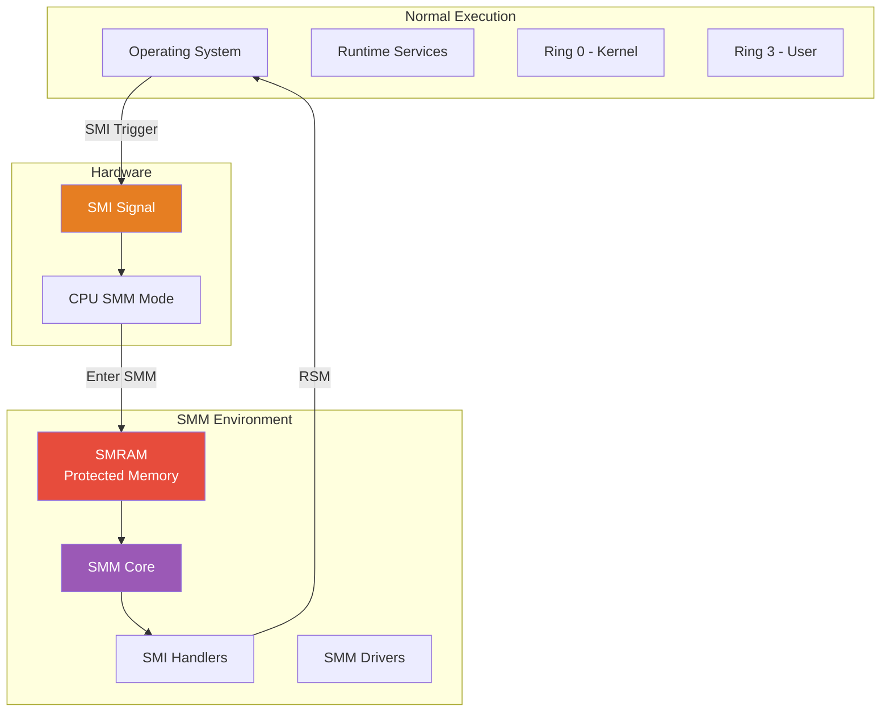
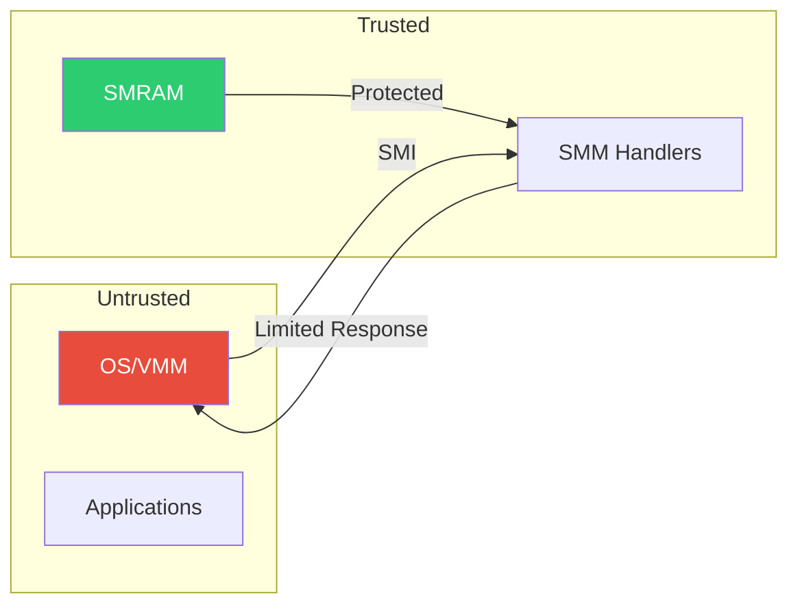

# Chapter 16: SMM
{: .fs-9 }

System Management Mode - isolated execution environment for firmware services.
{: .fs-6 .fw-300 }

---

## Overview

### When to Use SMM

{: .important }
> **Use SMM when you need to:**
> - Handle hardware events invisible to the OS (power button, thermal events)
> - Provide secure firmware services that OS cannot tamper with
> - Implement legacy hardware emulation (PS/2 keyboard, floppy)
> - Protect security-critical code from OS-level attacks

| Scenario | SMI Handler | Example |
|:---------|:------------|:--------|
| **Power button handling** | Power SMI | Graceful shutdown sequence |
| **Thermal management** | Thermal SMI | CPU throttling, fan control |
| **Variable write protection** | SW SMI | Secure variable storage |
| **Legacy USB keyboard** | USB SMI | PS/2 emulation for BIOS |
| **Hardware error handling** | MCA SMI | Log and recover from errors |
| **BIOS flash protection** | Write SMI | Prevent unauthorized flashing |

**SMM vs DXE Runtime Decision:**

| Factor | Use SMM | Use Runtime Driver |
|:-------|:--------|:-------------------|
| **OS visibility** | Hidden | Visible |
| **Security level** | Ring -2 (highest) | Ring 0 (kernel level) |
| **Performance** | Interrupt overhead | Direct call |
| **Complexity** | Complex (isolation) | Simpler |
| **Use when** | Security critical | Performance critical |

**Who Works with SMM:**

| Role | SMM Involvement | Typical Tasks |
|:-----|:----------------|:--------------|
| **Security engineer** | Heavy | Variable protection, flash protection |
| **Platform developer** | Moderate | Power management, error handling |
| **BIOS engineer** | Moderate | SMI handler integration |
| **Driver developer** | Rare | Only for SMM-resident services |
| **Application developer** | None | SMM invisible to applications |

**SMM Security Considerations:**
- SMRAM must be locked before OS boot
- Validate all inputs from untrusted sources (OS, peripherals)
- Minimize SMM attack surface
- SMM vulnerabilities are severe (Ring -2 compromise)

### SMM Architecture

SMM provides a hidden, isolated execution environment separate from the OS:



### SMM Characteristics

| Aspect | Description |
|:-------|:------------|
| **Isolation** | Runs in protected SMRAM, invisible to OS |
| **Privilege** | Higher than Ring 0 (Ring -2) |
| **Entry** | Triggered by SMI (System Management Interrupt) |
| **Exit** | RSM instruction returns to interrupted code |
| **Use Cases** | Power management, hardware emulation, security |

### SMM Security Model



---

## Initialization

### SMM Infrastructure Setup

```c
//
// SMM initialization happens during DXE phase
//
// 1. SMM IPL (Initial Program Loader) locates SMRAM
// 2. SMM Core is loaded into SMRAM
// 3. SMM Drivers are dispatched
// 4. SMI handlers are registered
//

//
// Key protocols for SMM setup:
//
// gEfiSmmBase2ProtocolGuid      - SMM base protocol
// gEfiSmmAccess2ProtocolGuid    - SMRAM access control
// gEfiSmmControl2ProtocolGuid   - SMI generation
// gEfiSmmCommunicationProtocolGuid - DXE-SMM communication
//
```

### SMM Driver Entry Point

```c
/** @file
  Sample SMM Driver
**/

#include <PiSmm.h>
#include <Library/SmmServicesTableLib.h>
#include <Library/DebugLib.h>

/**
  SMM Driver Entry Point

  @param  ImageHandle  Handle for this driver image
  @param  SystemTable  Pointer to EFI System Table

  @retval EFI_SUCCESS  Driver initialized successfully
**/
EFI_STATUS
EFIAPI
SampleSmmDriverEntryPoint (
  IN EFI_HANDLE        ImageHandle,
  IN EFI_SYSTEM_TABLE  *SystemTable
  )
{
  EFI_STATUS Status;

  DEBUG((DEBUG_INFO, "SampleSmmDriver: Entry\n"));

  //
  // gSmst is the SMM System Table (SMM Services)
  //
  if (gSmst == NULL) {
    return EFI_UNSUPPORTED;
  }

  //
  // Register SMI handlers
  //
  Status = RegisterSmiHandlers();

  //
  // Install SMM protocols if needed
  //

  DEBUG((DEBUG_INFO, "SampleSmmDriver: Complete\n"));

  return Status;
}
```

### SMM Driver INF File

```ini
[Defines]
  INF_VERSION    = 0x00010017
  BASE_NAME      = SampleSmmDriver
  FILE_GUID      = AABBCCDD-1122-3344-5566-778899AABBCC
  MODULE_TYPE    = DXE_SMM_DRIVER
  VERSION_STRING = 1.0
  PI_SPECIFICATION_VERSION = 0x0001000A
  ENTRY_POINT    = SampleSmmDriverEntryPoint

[Sources]
  SampleSmmDriver.c

[Packages]
  MdePkg/MdePkg.dec
  MdeModulePkg/MdeModulePkg.dec

[LibraryClasses]
  UefiDriverEntryPoint
  SmmServicesTableLib
  DebugLib
  BaseMemoryLib

[Protocols]
  gEfiSmmBase2ProtocolGuid      ## CONSUMES
  gEfiSmmSwDispatch2ProtocolGuid ## CONSUMES

[Depex]
  gEfiSmmBase2ProtocolGuid AND
  gEfiSmmSwDispatch2ProtocolGuid
```

---

## Configuration

### SMM Services Table

```c
//
// SMM System Table (gSmst) - services available in SMM
//
typedef struct _EFI_SMM_SYSTEM_TABLE2 {
  EFI_TABLE_HEADER                 Hdr;
  CHAR16                           *SmmFirmwareVendor;
  UINT32                           SmmFirmwareRevision;

  // Install/Uninstall protocols in SMM
  EFI_SMM_INSTALL_PROTOCOL_INTERFACE   SmmInstallProtocolInterface;
  EFI_SMM_UNINSTALL_PROTOCOL_INTERFACE SmmUninstallProtocolInterface;
  EFI_SMM_HANDLE_PROTOCOL              SmmHandleProtocol;
  EFI_SMM_REGISTER_PROTOCOL_NOTIFY     SmmRegisterProtocolNotify;
  EFI_SMM_LOCATE_HANDLE                SmmLocateHandle;
  EFI_SMM_LOCATE_PROTOCOL              SmmLocateProtocol;

  // SMI Management
  EFI_SMM_INTERRUPT_MANAGE             SmiManage;
  EFI_SMM_INTERRUPT_REGISTER           SmiHandlerRegister;
  EFI_SMM_INTERRUPT_UNREGISTER         SmiHandlerUnRegister;

  // Memory services
  EFI_ALLOCATE_POOL                    SmmAllocatePool;
  EFI_FREE_POOL                        SmmFreePool;
  EFI_ALLOCATE_PAGES                   SmmAllocatePages;
  EFI_FREE_PAGES                       SmmFreePages;

  // Startup registration
  EFI_SMM_STARTUP_THIS_AP              SmmStartupThisAp;

  // CPU I/O and save state
  EFI_SMM_CPU_IO2_PROTOCOL             *SmmIo;
  EFI_SMM_CPU_SAVE_STATE_PROTOCOL      *CpuSaveState;

  // Number of CPUs
  UINTN                                CurrentlyExecutingCpu;
  UINTN                                NumberOfCpus;
  EFI_SMM_CPU_PROTOCOL                 *CpuSaveStateSize;
  VOID                                 *CpuSaveState2;

  // Tables
  UINTN                                NumberOfTableEntries;
  EFI_CONFIGURATION_TABLE              *SmmConfigurationTable;
} EFI_SMM_SYSTEM_TABLE2;
```

### SMI Handler Registration

```c
#include <Protocol/SmmSwDispatch2.h>

EFI_SMM_SW_DISPATCH2_PROTOCOL *mSwDispatch;
EFI_HANDLE mSwHandle;

//
// Software SMI Handler
//
EFI_STATUS
EFIAPI
SoftwareSmiHandler (
  IN EFI_HANDLE  DispatchHandle,
  IN CONST VOID  *Context         OPTIONAL,
  IN OUT VOID    *CommBuffer      OPTIONAL,
  IN OUT UINTN   *CommBufferSize  OPTIONAL
  )
{
  EFI_SMM_SW_CONTEXT *SwContext = (EFI_SMM_SW_CONTEXT *)Context;

  DEBUG((DEBUG_INFO, "SW SMI received: 0x%x\n", SwContext->SwSmiInputValue));

  //
  // Handle the SMI
  //

  return EFI_SUCCESS;
}

EFI_STATUS
RegisterSwSmiHandler (
  IN UINTN  SwSmiValue
  )
{
  EFI_STATUS Status;
  EFI_SMM_SW_REGISTER_CONTEXT SwContext;

  //
  // Locate SW Dispatch protocol
  //
  Status = gSmst->SmmLocateProtocol(
             &gEfiSmmSwDispatch2ProtocolGuid,
             NULL,
             (VOID **)&mSwDispatch
           );

  if (EFI_ERROR(Status)) {
    return Status;
  }

  //
  // Register for specific SW SMI value
  //
  SwContext.SwSmiInputValue = SwSmiValue;

  Status = mSwDispatch->Register(
             mSwDispatch,
             SoftwareSmiHandler,
             &SwContext,
             &mSwHandle
           );

  return Status;
}
```

### Root SMI Handler

```c
//
// Root SMI Handler - receives ALL SMIs
//
EFI_STATUS
EFIAPI
RootSmiHandler (
  IN EFI_HANDLE  DispatchHandle,
  IN CONST VOID  *Context         OPTIONAL,
  IN OUT VOID    *CommBuffer      OPTIONAL,
  IN OUT UINTN   *CommBufferSize  OPTIONAL
  )
{
  //
  // This handler is called for every SMI
  // Use for logging, security checks, etc.
  //

  return EFI_SUCCESS;
}

EFI_STATUS
RegisterRootSmiHandler (
  VOID
  )
{
  EFI_HANDLE Handle;

  return gSmst->SmiHandlerRegister(
           RootSmiHandler,
           NULL,      // NULL GUID = root handler
           &Handle
         );
}
```

---

## Porting Guide

### Platform SMM Configuration

```ini
#
# Platform DSC file - SMM configuration
#

[PcdsFixedAtBuild]
  # SMRAM configuration
  gUefiCpuPkgTokenSpaceGuid.PcdCpuSmmStackSize|0x4000
  gEfiMdeModulePkgTokenSpaceGuid.PcdMaxSizeNonPopulateCapsule|0x1400000

[Components]
  # SMM IPL
  MdeModulePkg/Core/PiSmmCore/PiSmmIpl.inf
  MdeModulePkg/Core/PiSmmCore/PiSmmCore.inf

  # SMM CPU driver
  UefiCpuPkg/PiSmmCpuDxeSmm/PiSmmCpuDxeSmm.inf

  # SMM Access/Control
  $(PLATFORM_PKG)/SmmAccess/SmmAccess.inf
  $(PLATFORM_PKG)/SmmControl/SmmControl.inf

  # SMM Drivers
  MdeModulePkg/Universal/Variable/RuntimeDxe/VariableSmmRuntimeDxe.inf
```

### SMRAM Regions

```c
//
// SMRAM is typically located at:
// - TSEG (Top Segment) - common on Intel platforms
// - ASEG (A-segment, legacy 0xA0000-0xBFFFF)
//

//
// SMRAM access protocol controls SMRAM visibility
//
typedef struct _EFI_SMM_ACCESS2_PROTOCOL {
  EFI_SMM_OPEN2           Open;
  EFI_SMM_CLOSE2          Close;
  EFI_SMM_LOCK2           Lock;
  EFI_SMM_CAPABILITIES2   GetCapabilities;
  BOOLEAN                 LockState;
  BOOLEAN                 OpenState;
} EFI_SMM_ACCESS2_PROTOCOL;

//
// SMRAM must be locked before OS boot
//
EFI_STATUS
LockSmram (
  VOID
  )
{
  EFI_STATUS Status;
  EFI_SMM_ACCESS2_PROTOCOL *SmmAccess;

  Status = gBS->LocateProtocol(
             &gEfiSmmAccess2ProtocolGuid,
             NULL,
             (VOID **)&SmmAccess
           );

  if (!EFI_ERROR(Status)) {
    Status = SmmAccess->Lock(SmmAccess);
  }

  return Status;
}
```

### SMM Communication

```c
#include <Protocol/SmmCommunication.h>

//
// DXE/Runtime to SMM communication
//
// Uses a communication buffer in non-SMRAM memory
// SMM validates buffer before processing
//

typedef struct {
  EFI_GUID  HeaderGuid;
  UINTN     MessageLength;
  // Data follows...
} EFI_SMM_COMMUNICATE_HEADER;

EFI_STATUS
CommunicateWithSmm (
  IN EFI_GUID  *HandlerGuid,
  IN VOID      *Data,
  IN UINTN     DataSize
  )
{
  EFI_STATUS Status;
  EFI_SMM_COMMUNICATION_PROTOCOL *SmmComm;
  EFI_SMM_COMMUNICATE_HEADER *CommBuffer;
  UINTN CommSize;

  Status = gBS->LocateProtocol(
             &gEfiSmmCommunicationProtocolGuid,
             NULL,
             (VOID **)&SmmComm
           );

  if (EFI_ERROR(Status)) {
    return Status;
  }

  //
  // Prepare communication buffer
  //
  CommSize = sizeof(EFI_SMM_COMMUNICATE_HEADER) + DataSize;
  CommBuffer = AllocatePool(CommSize);

  CopyGuid(&CommBuffer->HeaderGuid, HandlerGuid);
  CommBuffer->MessageLength = DataSize;
  CopyMem(CommBuffer + 1, Data, DataSize);

  //
  // Trigger SMI with communication buffer
  //
  Status = SmmComm->Communicate(
             SmmComm,
             CommBuffer,
             &CommSize
           );

  FreePool(CommBuffer);
  return Status;
}
```

---

## SMI Types

### Hardware SMI Sources

| SMI Source | Dispatch Protocol | Purpose |
|:-----------|:------------------|:--------|
| **Software SMI** | SmmSwDispatch2 | I/O port write (typically 0xB2) |
| **Periodic Timer** | SmmPeriodicTimerDispatch2 | Timed events |
| **USB** | SmmUsbDispatch2 | USB legacy emulation |
| **GPIO** | SmmGpiDispatch2 | GPIO pin events |
| **Power Button** | SmmPowerButtonDispatch2 | Power button press |
| **Standby Button** | SmmStandbyButtonDispatch2 | Sleep button |
| **I/O Trap** | SmmIoTrapDispatch2 | I/O port access trap |

### Handler Registration Example

```c
#include <Protocol/SmmPeriodicTimerDispatch2.h>

EFI_STATUS
RegisterPeriodicTimer (
  VOID
  )
{
  EFI_STATUS Status;
  EFI_SMM_PERIODIC_TIMER_DISPATCH2_PROTOCOL *PeriodicTimer;
  EFI_SMM_PERIODIC_TIMER_REGISTER_CONTEXT Context;
  EFI_HANDLE Handle;

  Status = gSmst->SmmLocateProtocol(
             &gEfiSmmPeriodicTimerDispatch2ProtocolGuid,
             NULL,
             (VOID **)&PeriodicTimer
           );

  if (EFI_ERROR(Status)) {
    return Status;
  }

  //
  // Register for 1 second periodic timer
  //
  Context.Period = 10000000;   // 100ns units = 1 second
  Context.SmiTickInterval = 0; // Use default

  Status = PeriodicTimer->Register(
             PeriodicTimer,
             PeriodicTimerHandler,
             &Context,
             &Handle
           );

  return Status;
}
```

---

## Security Considerations

### SMM Security Best Practices

```c
//
// 1. VALIDATE ALL INPUT from communication buffer
//
EFI_STATUS
EFIAPI
SecureSmiHandler (
  IN EFI_HANDLE  DispatchHandle,
  IN CONST VOID  *Context,
  IN OUT VOID    *CommBuffer,
  IN OUT UINTN   *CommBufferSize
  )
{
  //
  // Validate CommBuffer is outside SMRAM
  //
  if (!IsBufferOutsideSmram(CommBuffer, *CommBufferSize)) {
    return EFI_SECURITY_VIOLATION;
  }

  //
  // Validate buffer size
  //
  if (*CommBufferSize < sizeof(MY_COMM_STRUCT)) {
    return EFI_INVALID_PARAMETER;
  }

  //
  // Validate any pointers in the buffer
  //
  MY_COMM_STRUCT *Input = (MY_COMM_STRUCT *)CommBuffer;

  if (!IsAddressValid(Input->DataPointer)) {
    return EFI_SECURITY_VIOLATION;
  }

  //
  // Safe to process
  //

  return EFI_SUCCESS;
}

//
// 2. LOCK SMRAM before OS boot
//
// 3. MINIMIZE SMI handler complexity
//
// 4. DON'T TRUST runtime addresses/pointers
//
// 5. USE SmmMemLib for buffer validation
//
#include <Library/SmmMemLib.h>

BOOLEAN
ValidateCommBuffer (
  IN VOID   *Buffer,
  IN UINTN  Size
  )
{
  return SmmIsBufferOutsideSmmValid((EFI_PHYSICAL_ADDRESS)(UINTN)Buffer, Size);
}
```

---

## Example: Variable SMM Driver

```c
/** @file
  SMM Variable Driver - protects UEFI variables
**/

#include <PiSmm.h>
#include <Library/SmmServicesTableLib.h>
#include <Library/DebugLib.h>
#include <Protocol/SmmVariable.h>

EFI_SMM_VARIABLE_PROTOCOL mSmmVariable;

EFI_STATUS
EFIAPI
SmmGetVariable (
  IN      CHAR16    *VariableName,
  IN      EFI_GUID  *VendorGuid,
  OUT     UINT32    *Attributes OPTIONAL,
  IN OUT  UINTN     *DataSize,
  OUT     VOID      *Data OPTIONAL
  )
{
  //
  // SMM-protected variable read
  //
  return InternalGetVariable(VariableName, VendorGuid, Attributes, DataSize, Data);
}

EFI_STATUS
EFIAPI
SmmSetVariable (
  IN CHAR16    *VariableName,
  IN EFI_GUID  *VendorGuid,
  IN UINT32    Attributes,
  IN UINTN     DataSize,
  IN VOID      *Data
  )
{
  //
  // SMM-protected variable write
  // Only SMM can write to flash
  //
  return InternalSetVariable(VariableName, VendorGuid, Attributes, DataSize, Data);
}

EFI_STATUS
EFIAPI
VariableSmmEntryPoint (
  IN EFI_HANDLE        ImageHandle,
  IN EFI_SYSTEM_TABLE  *SystemTable
  )
{
  EFI_STATUS Status;
  EFI_HANDLE Handle;

  //
  // Initialize variable storage
  //
  Status = InitializeVariableStore();
  if (EFI_ERROR(Status)) {
    return Status;
  }

  //
  // Install SMM Variable protocol
  //
  mSmmVariable.SmmGetVariable = SmmGetVariable;
  mSmmVariable.SmmSetVariable = SmmSetVariable;
  mSmmVariable.SmmGetNextVariableName = SmmGetNextVariableName;
  mSmmVariable.SmmQueryVariableInfo = SmmQueryVariableInfo;

  Handle = NULL;
  Status = gSmst->SmmInstallProtocolInterface(
             &Handle,
             &gEfiSmmVariableProtocolGuid,
             EFI_NATIVE_INTERFACE,
             &mSmmVariable
           );

  return Status;
}
```

---

## PI Specification Reference

- **PI Spec Volume 4**: SMM Core Interface Specification
- **PI Spec Volume 4 Section 2**: SMM Services
- **PI Spec Volume 4 Section 3**: SMM Protocols
- **PI Spec Volume 4 Section 4**: SMI Handler Dispatch

---

## Summary

1. **SMM** is an isolated execution environment (Ring -2)
2. **SMRAM** is protected memory invisible to OS
3. **SMI handlers** process system management events
4. **Communication buffer** enables DXE-SMM data exchange
5. **Security** is critical - validate all input
6. **Lock SMRAM** before ExitBootServices

---

## Next Steps

- [Chapter 17: Security](17-security/) - Secure Boot, TPM
- [Chapter 18: ACPI](18-acpi/) - ACPI tables

---

{: .warning }
> **Security Critical:** SMM has highest privilege. Vulnerabilities can bypass all OS security. Always validate inputs thoroughly.

{: .note }
> **Debug Tip:** SMM debugging is difficult. Use serial debug output and hardware debuggers when available.
