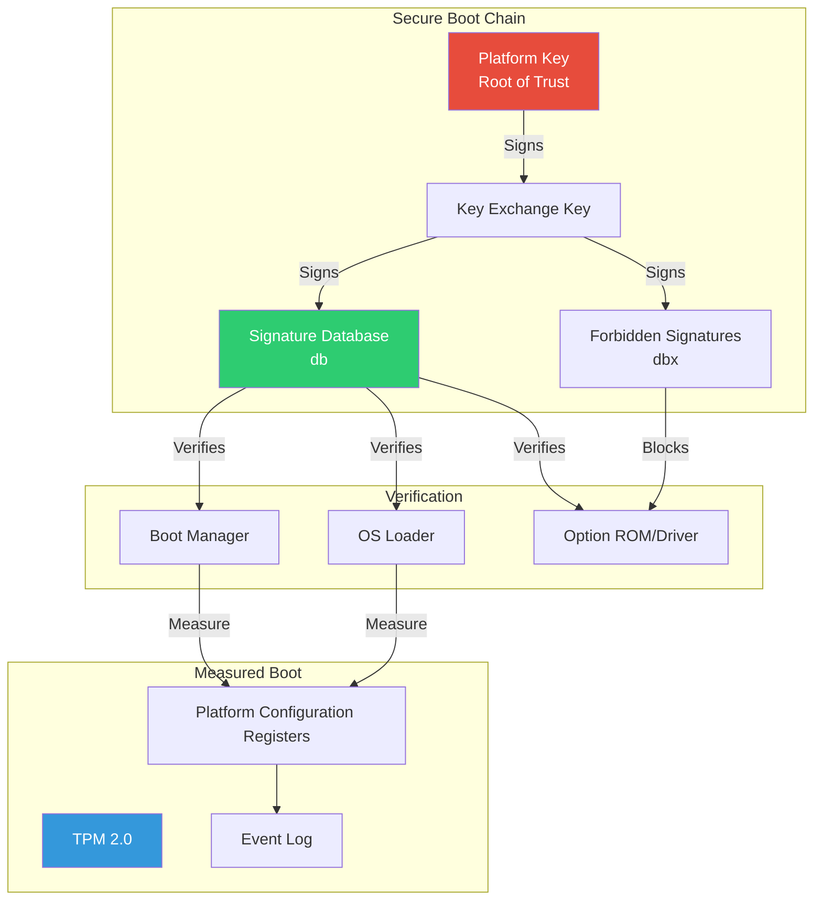

# Chapter 17: Security
{: .fs-9 }

Secure Boot, TPM integration, and measured boot.
{: .fs-6 .fw-300 }

---

## Overview

### UEFI Security Architecture



### Security Components

| Component | Purpose |
|:----------|:--------|
| **Secure Boot** | Verify signatures before executing code |
| **Measured Boot** | Record boot components in TPM PCRs |
| **TPM** | Hardware root of trust, key storage |
| **Authenticated Variables** | Protect critical UEFI variables |

### Secure Boot Keys

| Key | Variable | Purpose |
|:----|:---------|:--------|
| **Platform Key (PK)** | `PK` | Root of trust, owned by platform vendor |
| **Key Exchange Key (KEK)** | `KEK` | Can modify db/dbx, owned by OS vendor |
| **Signature Database (db)** | `db` | Allowed signatures/hashes |
| **Forbidden Database (dbx)** | `dbx` | Revoked signatures/hashes |
| **dbr** | `dbr` | Recovery database (optional) |
| **dbt** | `dbt` | Timestamp database (optional) |

---

## Initialization

### Checking Secure Boot Status

```c
#include <Uefi.h>
#include <Library/UefiLib.h>
#include <Library/UefiRuntimeServicesTableLib.h>
#include <Guid/GlobalVariable.h>
#include <Guid/ImageAuthentication.h>

BOOLEAN
IsSecureBootEnabled (
  VOID
  )
{
  EFI_STATUS Status;
  UINT8 SecureBoot;
  UINTN DataSize = sizeof(SecureBoot);

  Status = gRT->GetVariable(
             L"SecureBoot",
             &gEfiGlobalVariableGuid,
             NULL,
             &DataSize,
             &SecureBoot
           );

  return (!EFI_ERROR(Status) && SecureBoot == 1);
}

BOOLEAN
IsSetupMode (
  VOID
  )
{
  EFI_STATUS Status;
  UINT8 SetupMode;
  UINTN DataSize = sizeof(SetupMode);

  Status = gRT->GetVariable(
             L"SetupMode",
             &gEfiGlobalVariableGuid,
             NULL,
             &DataSize,
             &SetupMode
           );

  return (!EFI_ERROR(Status) && SetupMode == 1);
}

VOID
PrintSecureBootStatus (
  VOID
  )
{
  Print(L"Secure Boot Status:\n");
  Print(L"  Secure Boot: %s\n", IsSecureBootEnabled() ? L"Enabled" : L"Disabled");
  Print(L"  Setup Mode:  %s\n", IsSetupMode() ? L"Yes" : L"No");
}
```

### Security Architectural Protocol

```c
#include <Protocol/Security.h>
#include <Protocol/Security2.h>

//
// Security Architectural Protocol verifies images
//
// EFI_SECURITY_ARCH_PROTOCOL - file path based
// EFI_SECURITY2_ARCH_PROTOCOL - file buffer based (preferred)
//

EFI_SECURITY2_ARCH_PROTOCOL *gSecurity2;

EFI_STATUS
InitializeSecurity (
  VOID
  )
{
  EFI_STATUS Status;

  Status = gBS->LocateProtocol(
             &gEfiSecurity2ArchProtocolGuid,
             NULL,
             (VOID **)&gSecurity2
           );

  return Status;
}

//
// Custom security handler (for platform customization)
//
EFI_STATUS
EFIAPI
CustomFileAuthentication (
  IN CONST EFI_SECURITY2_ARCH_PROTOCOL *This,
  IN CONST EFI_DEVICE_PATH_PROTOCOL    *DevicePath OPTIONAL,
  IN VOID                              *FileBuffer,
  IN UINTN                             FileSize,
  IN BOOLEAN                           BootPolicy
  )
{
  //
  // Called for every image load when Secure Boot enabled
  //
  // Return EFI_SUCCESS to allow
  // Return EFI_SECURITY_VIOLATION to deny
  //

  //
  // Verify signature...
  //

  return EFI_SUCCESS;
}
```

---

## Configuration

### Secure Boot Variables Structure

```c
//
// Signature database entry format
//
typedef struct {
  EFI_GUID  SignatureType;
  UINT32    SignatureListSize;
  UINT32    SignatureHeaderSize;
  UINT32    SignatureSize;
  // UINT8  SignatureHeader[SignatureHeaderSize];
  // EFI_SIGNATURE_DATA Signatures[];
} EFI_SIGNATURE_LIST;

typedef struct {
  EFI_GUID  SignatureOwner;
  // UINT8  SignatureData[];
} EFI_SIGNATURE_DATA;

//
// Common signature types
//
// EFI_CERT_SHA256_GUID        - SHA256 hash
// EFI_CERT_RSA2048_GUID       - RSA-2048 key
// EFI_CERT_X509_GUID          - X.509 certificate
// EFI_CERT_X509_SHA256_GUID   - SHA256 of X.509 cert
//
```

### Reading Signature Databases

```c
EFI_STATUS
ReadSignatureDatabase (
  IN  CHAR16             *VariableName,  // L"db" or L"dbx"
  OUT EFI_SIGNATURE_LIST **SignatureList,
  OUT UINTN              *SignatureListSize
  )
{
  EFI_STATUS Status;
  UINTN DataSize = 0;
  VOID *Data;

  //
  // Get size
  //
  Status = gRT->GetVariable(
             VariableName,
             &gEfiImageSecurityDatabaseGuid,
             NULL,
             &DataSize,
             NULL
           );

  if (Status != EFI_BUFFER_TOO_SMALL) {
    return Status;
  }

  Data = AllocatePool(DataSize);
  if (Data == NULL) {
    return EFI_OUT_OF_RESOURCES;
  }

  Status = gRT->GetVariable(
             VariableName,
             &gEfiImageSecurityDatabaseGuid,
             NULL,
             &DataSize,
             Data
           );

  if (EFI_ERROR(Status)) {
    FreePool(Data);
    return Status;
  }

  *SignatureList = Data;
  *SignatureListSize = DataSize;

  return EFI_SUCCESS;
}

VOID
EnumerateSignatures (
  IN EFI_SIGNATURE_LIST  *SigList,
  IN UINTN               SigListSize
  )
{
  EFI_SIGNATURE_LIST *Current;
  EFI_SIGNATURE_DATA *SigData;
  UINTN Offset = 0;
  UINTN SigCount;

  while (Offset < SigListSize) {
    Current = (EFI_SIGNATURE_LIST *)((UINT8 *)SigList + Offset);

    Print(L"Signature Type: %g\n", &Current->SignatureType);

    SigCount = (Current->SignatureListSize - sizeof(EFI_SIGNATURE_LIST) -
                Current->SignatureHeaderSize) / Current->SignatureSize;

    Print(L"  Entries: %d\n", SigCount);

    //
    // Iterate through signatures
    //
    SigData = (EFI_SIGNATURE_DATA *)((UINT8 *)Current +
              sizeof(EFI_SIGNATURE_LIST) + Current->SignatureHeaderSize);

    for (UINTN i = 0; i < SigCount; i++) {
      Print(L"  Owner: %g\n", &SigData->SignatureOwner);
      SigData = (EFI_SIGNATURE_DATA *)((UINT8 *)SigData + Current->SignatureSize);
    }

    Offset += Current->SignatureListSize;
  }
}
```

### Authenticated Variable Writes

```c
#include <Guid/ImageAuthentication.h>

//
// Time-based authenticated variables require:
// 1. EFI_VARIABLE_TIME_BASED_AUTHENTICATED_WRITE_ACCESS attribute
// 2. WIN_CERTIFICATE_UEFI_GUID structure prepended to data
// 3. Valid signature over (VariableName + VendorGuid + Attributes + Timestamp + Data)
//

typedef struct {
  EFI_TIME                    Timestamp;
  WIN_CERTIFICATE_UEFI_GUID   AuthInfo;
  // UINT8                    Data[];
} EFI_VARIABLE_AUTHENTICATION_2;

//
// Writing authenticated variable (simplified)
//
EFI_STATUS
WriteAuthenticatedVariable (
  IN CHAR16    *VariableName,
  IN EFI_GUID  *VendorGuid,
  IN VOID      *Data,
  IN UINTN     DataSize,
  IN VOID      *Certificate,
  IN UINTN     CertificateSize
  )
{
  //
  // This requires proper signing with private key
  // Usually done offline with signing tools
  //
  // 1. Create authentication header
  // 2. Sign (Name + GUID + Attrs + Timestamp + Data) with private key
  // 3. Prepend header + signature to data
  // 4. Call SetVariable with TIME_BASED_AUTHENTICATED_WRITE_ACCESS
  //

  return EFI_UNSUPPORTED;  // Simplified example
}
```

---

## Porting Guide

### Platform Security Configuration

```ini
#
# Platform DSC file - Security configuration
#

[PcdsFixedAtBuild]
  # Enable Secure Boot support
  gEfiMdeModulePkgTokenSpaceGuid.PcdEnableSecureBoot|TRUE

  # Security policy
  gEfiSecurityPkgTokenSpaceGuid.PcdOptionRomImageVerificationPolicy|0x04

[Components]
  # Security infrastructure
  SecurityPkg/VariableAuthenticated/SecureBootConfigDxe/SecureBootConfigDxe.inf
  SecurityPkg/VariableAuthenticated/SecureBootDefaultKeysDxe/SecureBootDefaultKeysDxe.inf

  # Image verification
  SecurityPkg/Library/DxeImageVerificationLib/DxeImageVerificationLib.inf

  # TPM support
  SecurityPkg/Tcg/Tcg2Dxe/Tcg2Dxe.inf
  SecurityPkg/Tcg/Tcg2Config/Tcg2ConfigDxe.inf
```

### Enrolling Secure Boot Keys

```c
//
// Key enrollment process:
//
// 1. Enter Setup Mode (clear PK or use physical presence)
// 2. Enroll db (allowed signatures)
// 3. Enroll dbx (forbidden signatures) - optional
// 4. Enroll KEK (key exchange key)
// 5. Enroll PK (platform key) - exits Setup Mode
//

//
// Example: Enroll PK to enable Secure Boot
//
EFI_STATUS
EnrollPlatformKey (
  IN UINT8   *Certificate,
  IN UINTN   CertificateSize
  )
{
  EFI_SIGNATURE_LIST *SigList;
  EFI_SIGNATURE_DATA *SigData;
  UINTN DataSize;
  EFI_STATUS Status;

  //
  // Build signature list
  //
  DataSize = sizeof(EFI_SIGNATURE_LIST) + sizeof(EFI_GUID) + CertificateSize;
  SigList = AllocateZeroPool(DataSize);

  CopyGuid(&SigList->SignatureType, &gEfiCertX509Guid);
  SigList->SignatureListSize = (UINT32)DataSize;
  SigList->SignatureSize = (UINT32)(sizeof(EFI_GUID) + CertificateSize);

  SigData = (EFI_SIGNATURE_DATA *)(SigList + 1);
  CopyGuid(&SigData->SignatureOwner, &gMyVendorGuid);
  CopyMem(SigData->SignatureData, Certificate, CertificateSize);

  //
  // Must be in Setup Mode to write PK without authentication
  //
  Status = gRT->SetVariable(
             L"PK",
             &gEfiGlobalVariableGuid,
             EFI_VARIABLE_NON_VOLATILE |
             EFI_VARIABLE_RUNTIME_ACCESS |
             EFI_VARIABLE_BOOTSERVICE_ACCESS |
             EFI_VARIABLE_TIME_BASED_AUTHENTICATED_WRITE_ACCESS,
             DataSize,
             SigList
           );

  FreePool(SigList);
  return Status;
}
```

---

## TPM Integration

### TPM 2.0 Protocol

```c
#include <IndustryStandard/Tpm20.h>
#include <Protocol/Tcg2Protocol.h>

EFI_TCG2_PROTOCOL *gTcg2;

EFI_STATUS
InitializeTpm (
  VOID
  )
{
  EFI_STATUS Status;
  EFI_TCG2_BOOT_SERVICE_CAPABILITY Capability;

  Status = gBS->LocateProtocol(
             &gEfiTcg2ProtocolGuid,
             NULL,
             (VOID **)&gTcg2
           );

  if (EFI_ERROR(Status)) {
    Print(L"TPM 2.0 not available\n");
    return Status;
  }

  //
  // Get TPM capabilities
  //
  Capability.Size = sizeof(Capability);
  Status = gTcg2->GetCapability(gTcg2, &Capability);

  if (!EFI_ERROR(Status)) {
    Print(L"TPM 2.0 Present: %s\n",
      Capability.TPMPresentFlag ? L"Yes" : L"No");
    Print(L"Supported Hash Algorithms: 0x%x\n",
      Capability.HashAlgorithmBitmap);
    Print(L"Active PCR Banks: 0x%x\n",
      Capability.ActivePcrBanks);
  }

  return Status;
}
```

### Measuring Boot Components

```c
//
// Extend a measurement to PCR
//
EFI_STATUS
ExtendPcr (
  IN UINT32  PcrIndex,
  IN UINT8   *Data,
  IN UINTN   DataSize
  )
{
  EFI_STATUS Status;
  EFI_TCG2_EVENT *Tcg2Event;
  UINTN EventSize;

  if (gTcg2 == NULL) {
    return EFI_NOT_READY;
  }

  //
  // Build TCG2 event
  //
  EventSize = sizeof(EFI_TCG2_EVENT) + DataSize;
  Tcg2Event = AllocateZeroPool(EventSize);

  Tcg2Event->Size = (UINT32)EventSize;
  Tcg2Event->Header.HeaderSize = sizeof(EFI_TCG2_EVENT_HEADER);
  Tcg2Event->Header.HeaderVersion = EFI_TCG2_EVENT_HEADER_VERSION;
  Tcg2Event->Header.PCRIndex = PcrIndex;
  Tcg2Event->Header.EventType = EV_POST_CODE;
  CopyMem(Tcg2Event->Event, Data, DataSize);

  //
  // Hash and extend
  //
  Status = gTcg2->HashLogExtendEvent(
             gTcg2,
             0,                           // Flags
             (EFI_PHYSICAL_ADDRESS)(UINTN)Data,
             DataSize,
             Tcg2Event
           );

  FreePool(Tcg2Event);
  return Status;
}

//
// PCR allocations for UEFI:
//
// PCR 0: SRTM, firmware code
// PCR 1: Platform configuration
// PCR 2: Option ROM code
// PCR 3: Option ROM data
// PCR 4: Boot manager code
// PCR 5: Boot manager data
// PCR 6: Host platform manufacturer specific
// PCR 7: Secure Boot policy
//
```

### Reading PCR Values

```c
EFI_STATUS
ReadPcr (
  IN  UINT32  PcrIndex,
  OUT UINT8   *PcrValue,
  OUT UINTN   *PcrValueSize
  )
{
  EFI_STATUS Status;
  TPML_DIGEST_VALUES Digests;
  TPML_PCR_SELECTION PcrSelection;

  if (gTcg2 == NULL) {
    return EFI_NOT_READY;
  }

  //
  // Select PCR and hash algorithm
  //
  PcrSelection.count = 1;
  PcrSelection.pcrSelections[0].hash = TPM_ALG_SHA256;
  PcrSelection.pcrSelections[0].sizeofSelect = 3;
  ZeroMem(PcrSelection.pcrSelections[0].pcrSelect, 3);
  PcrSelection.pcrSelections[0].pcrSelect[PcrIndex / 8] = 1 << (PcrIndex % 8);

  //
  // Read PCR
  //
  // Note: This is simplified - actual implementation
  // would use TPM2 command directly
  //

  return EFI_SUCCESS;
}
```

---

## Example: Security Status Display

```c
/** @file
  Security Status Display Application
**/

#include <Uefi.h>
#include <Library/UefiLib.h>
#include <Library/UefiBootServicesTableLib.h>
#include <Library/UefiRuntimeServicesTableLib.h>
#include <Guid/GlobalVariable.h>
#include <Guid/ImageAuthentication.h>
#include <Protocol/Tcg2Protocol.h>

EFI_STATUS
EFIAPI
UefiMain (
  IN EFI_HANDLE        ImageHandle,
  IN EFI_SYSTEM_TABLE  *SystemTable
  )
{
  EFI_STATUS Status;
  UINT8 Value8;
  UINTN DataSize;
  EFI_TCG2_PROTOCOL *Tcg2;
  EFI_TCG2_BOOT_SERVICE_CAPABILITY Capability;

  Print(L"=== UEFI Security Status ===\n\n");

  //
  // Secure Boot Status
  //
  Print(L"Secure Boot:\n");

  DataSize = sizeof(Value8);
  Status = gRT->GetVariable(L"SecureBoot", &gEfiGlobalVariableGuid,
                            NULL, &DataSize, &Value8);
  Print(L"  SecureBoot:   %s\n",
    (!EFI_ERROR(Status) && Value8) ? L"Enabled" : L"Disabled");

  DataSize = sizeof(Value8);
  Status = gRT->GetVariable(L"SetupMode", &gEfiGlobalVariableGuid,
                            NULL, &DataSize, &Value8);
  Print(L"  SetupMode:    %s\n",
    (!EFI_ERROR(Status) && Value8) ? L"Yes (keys can be modified)" : L"No");

  DataSize = sizeof(Value8);
  Status = gRT->GetVariable(L"AuditMode", &gEfiGlobalVariableGuid,
                            NULL, &DataSize, &Value8);
  Print(L"  AuditMode:    %s\n",
    (!EFI_ERROR(Status) && Value8) ? L"Yes" : L"No");

  DataSize = sizeof(Value8);
  Status = gRT->GetVariable(L"DeployedMode", &gEfiGlobalVariableGuid,
                            NULL, &DataSize, &Value8);
  Print(L"  DeployedMode: %s\n",
    (!EFI_ERROR(Status) && Value8) ? L"Yes" : L"No");

  //
  // Key presence check
  //
  Print(L"\nSecure Boot Keys:\n");

  DataSize = 0;
  Status = gRT->GetVariable(L"PK", &gEfiGlobalVariableGuid, NULL, &DataSize, NULL);
  Print(L"  PK:   %s\n", (Status == EFI_BUFFER_TOO_SMALL) ? L"Present" : L"Not enrolled");

  DataSize = 0;
  Status = gRT->GetVariable(L"KEK", &gEfiGlobalVariableGuid, NULL, &DataSize, NULL);
  Print(L"  KEK:  %s\n", (Status == EFI_BUFFER_TOO_SMALL) ? L"Present" : L"Not enrolled");

  DataSize = 0;
  Status = gRT->GetVariable(L"db", &gEfiImageSecurityDatabaseGuid, NULL, &DataSize, NULL);
  Print(L"  db:   %s (%d bytes)\n",
    (Status == EFI_BUFFER_TOO_SMALL) ? L"Present" : L"Empty",
    (Status == EFI_BUFFER_TOO_SMALL) ? DataSize : 0);

  DataSize = 0;
  Status = gRT->GetVariable(L"dbx", &gEfiImageSecurityDatabaseGuid, NULL, &DataSize, NULL);
  Print(L"  dbx:  %s (%d bytes)\n",
    (Status == EFI_BUFFER_TOO_SMALL) ? L"Present" : L"Empty",
    (Status == EFI_BUFFER_TOO_SMALL) ? DataSize : 0);

  //
  // TPM Status
  //
  Print(L"\nTPM Status:\n");

  Status = gBS->LocateProtocol(&gEfiTcg2ProtocolGuid, NULL, (VOID **)&Tcg2);

  if (!EFI_ERROR(Status)) {
    Capability.Size = sizeof(Capability);
    Status = Tcg2->GetCapability(Tcg2, &Capability);

    if (!EFI_ERROR(Status)) {
      Print(L"  TPM Present:     %s\n",
        Capability.TPMPresentFlag ? L"Yes" : L"No");
      Print(L"  TPM Version:     2.0\n");
      Print(L"  Hash Algorithms: 0x%04x\n", Capability.HashAlgorithmBitmap);
      Print(L"  Active PCRs:     0x%04x\n", Capability.ActivePcrBanks);
    }
  } else {
    Print(L"  TPM: Not available\n");
  }

  Print(L"\nPress any key to exit...\n");
  {
    EFI_INPUT_KEY Key;
    UINTN Index;
    gBS->WaitForEvent(1, &gST->ConIn->WaitForKey, &Index);
    gST->ConIn->ReadKeyStroke(gST->ConIn, &Key);
  }

  return EFI_SUCCESS;
}
```

---

## UEFI Specification Reference

- **UEFI Spec Section 32**: Secure Boot and Driver Signing
- **UEFI Spec Section 32.4**: Firmware/OS Key Exchange
- **UEFI Spec Section 32.5**: Signature Database
- **TCG EFI Protocol Specification**: TPM integration

---

## Summary

1. **Secure Boot** verifies signatures before executing code
2. **PK** is the root of trust; **db/dbx** contain allowed/forbidden signatures
3. **Setup Mode** allows key enrollment without authentication
4. **TPM 2.0** provides hardware root of trust and measured boot
5. **PCRs** record measurements of boot components
6. **Authenticated variables** protect security databases

---

## Next Steps

- [Chapter 18: ACPI](18-acpi.html) - ACPI table management
- [Chapter 19: Capsule Updates](19-capsule-updates.html) - Firmware updates

---

{: .warning }
> **Security Critical:** Secure Boot configuration affects system security. Incorrect key enrollment can prevent booting.

{: .note }
> **Testing:** Use `mokutil` and `sbsigntool` on Linux for Secure Boot testing and key management.
