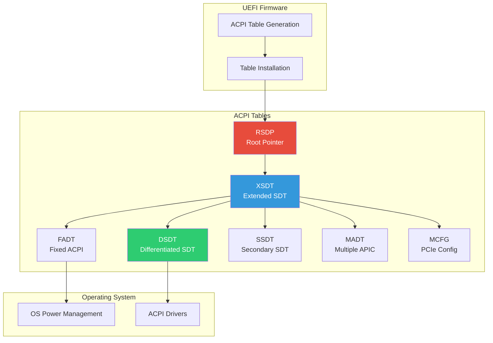

# Chapter 18: ACPI
{: .fs-9 }

Advanced Configuration and Power Interface tables in UEFI.
{: .fs-6 .fw-300 }

---

## Overview

### When to Work with ACPI

{: .important }
> **Work with ACPI when you need to:**
> - Describe platform hardware to the operating system
> - Implement power management (sleep states, CPU power states)
> - Configure interrupt routing and device resources
> - Support hot-plug devices or dynamic platform configuration

| Scenario | ACPI Table | Purpose |
|:---------|:-----------|:--------|
| **CPU/interrupt topology** | MADT | Describe CPUs, IOAPICs, GICs |
| **PCIe configuration** | MCFG | ECAM base address for PCIe |
| **Device enumeration** | DSDT/SSDT | Non-discoverable devices |
| **Power management** | FADT, _PSS, _CST | Sleep states, P-states, C-states |
| **Memory-mapped devices** | DSDT (Device nodes) | GPIO, I2C, SPI controllers |
| **Hot-plug support** | DSDT (_EJ0, _OST) | Device ejection methods |

**ACPI vs Device Tree (ARM):**

| Factor | ACPI | Device Tree |
|:-------|:-----|:------------|
| **Platform** | x86, ARM servers | ARM embedded, Linux |
| **Complexity** | Higher | Lower |
| **Power management** | Full support | Limited |
| **OS support** | Windows, Linux | Primarily Linux |
| **Standardization** | UEFI Forum spec | Less formal |

**Who Works with ACPI:**

| Role | ACPI Tasks |
|:-----|:-----------|
| **Platform developer** | Generate tables, define devices, power states |
| **Silicon vendor** | Reference DSDT, chipset-specific tables |
| **BIOS engineer** | Table customization, ASL debugging |
| **OS developer** | Consume tables, debug ACPI issues |

**Key ACPI Concepts:**
- **ASL (ACPI Source Language)**: High-level language for DSDT/SSDT
- **AML (ACPI Machine Language)**: Compiled bytecode in tables
- **Control Methods**: Executable code for dynamic behavior
- **Namespace**: Hierarchical device/object organization

### ACPI Architecture

ACPI provides platform configuration data and power management to the operating system:



### Key ACPI Tables

| Table | Full Name | Purpose |
|:------|:----------|:--------|
| **RSDP** | Root System Description Pointer | Entry point, locates RSDT/XSDT |
| **XSDT** | Extended System Description Table | 64-bit pointers to other tables |
| **RSDT** | Root System Description Table | 32-bit pointers (legacy) |
| **FADT** | Fixed ACPI Description Table | Fixed hardware addresses |
| **DSDT** | Differentiated System Description Table | AML code for device tree |
| **SSDT** | Secondary System Description Table | Additional AML code |
| **MADT** | Multiple APIC Description Table | Interrupt controllers |
| **MCFG** | Memory Mapped Configuration | PCIe ECAM base |
| **HPET** | High Precision Event Timer | Timer configuration |
| **BGRT** | Boot Graphics Resource Table | Boot logo |

---

## Initialization

### ACPI Table Protocol

```c
#include <Uefi.h>
#include <Library/UefiLib.h>
#include <Library/UefiBootServicesTableLib.h>
#include <Protocol/AcpiTable.h>
#include <IndustryStandard/Acpi.h>

EFI_ACPI_TABLE_PROTOCOL *gAcpiTable;

EFI_STATUS
InitializeAcpi (
  VOID
  )
{
  return gBS->LocateProtocol(
           &gEfiAcpiTableProtocolGuid,
           NULL,
           (VOID **)&gAcpiTable
         );
}
```

### Finding ACPI Tables

```c
#include <Guid/Acpi.h>

EFI_STATUS
FindAcpiTables (
  OUT EFI_ACPI_2_0_ROOT_SYSTEM_DESCRIPTION_POINTER **Rsdp
  )
{
  EFI_STATUS Status;
  VOID *Table;

  //
  // Look in EFI Configuration Table
  //
  Status = EfiGetSystemConfigurationTable(
             &gEfiAcpi20TableGuid,
             &Table
           );

  if (!EFI_ERROR(Status)) {
    *Rsdp = (EFI_ACPI_2_0_ROOT_SYSTEM_DESCRIPTION_POINTER *)Table;
    return EFI_SUCCESS;
  }

  //
  // Try ACPI 1.0 GUID
  //
  Status = EfiGetSystemConfigurationTable(
             &gEfiAcpi10TableGuid,
             &Table
           );

  if (!EFI_ERROR(Status)) {
    *Rsdp = (EFI_ACPI_2_0_ROOT_SYSTEM_DESCRIPTION_POINTER *)Table;
    return EFI_SUCCESS;
  }

  return EFI_NOT_FOUND;
}

EFI_STATUS
FindTableBySignature (
  IN  UINT32                                 Signature,
  OUT EFI_ACPI_DESCRIPTION_HEADER            **Table
  )
{
  EFI_ACPI_2_0_ROOT_SYSTEM_DESCRIPTION_POINTER *Rsdp;
  EFI_ACPI_SDT_HEADER *Xsdt;
  UINT64 *Entry;
  UINTN EntryCount;
  UINTN Index;
  EFI_ACPI_DESCRIPTION_HEADER *Header;

  if (FindAcpiTables(&Rsdp) != EFI_SUCCESS) {
    return EFI_NOT_FOUND;
  }

  Xsdt = (EFI_ACPI_SDT_HEADER *)(UINTN)Rsdp->XsdtAddress;
  EntryCount = (Xsdt->Length - sizeof(EFI_ACPI_SDT_HEADER)) / sizeof(UINT64);
  Entry = (UINT64 *)(Xsdt + 1);

  for (Index = 0; Index < EntryCount; Index++) {
    Header = (EFI_ACPI_DESCRIPTION_HEADER *)(UINTN)Entry[Index];

    if (Header->Signature == Signature) {
      *Table = Header;
      return EFI_SUCCESS;
    }
  }

  return EFI_NOT_FOUND;
}
```

---

## Configuration

### Installing ACPI Tables

```c
EFI_STATUS
InstallAcpiTable (
  IN VOID   *Table,
  IN UINTN  TableSize
  )
{
  EFI_STATUS Status;
  UINTN TableKey;

  if (gAcpiTable == NULL) {
    Status = InitializeAcpi();
    if (EFI_ERROR(Status)) {
      return Status;
    }
  }

  Status = gAcpiTable->InstallAcpiTable(
             gAcpiTable,
             Table,
             TableSize,
             &TableKey
           );

  return Status;
}

EFI_STATUS
UninstallAcpiTable (
  IN UINTN  TableKey
  )
{
  return gAcpiTable->UninstallAcpiTable(gAcpiTable, TableKey);
}
```

### Building ACPI Table Header

```c
//
// Common ACPI table header
//
typedef struct {
  UINT32  Signature;
  UINT32  Length;
  UINT8   Revision;
  UINT8   Checksum;
  UINT8   OemId[6];
  UINT64  OemTableId;
  UINT32  OemRevision;
  UINT32  CreatorId;
  UINT32  CreatorRevision;
} EFI_ACPI_DESCRIPTION_HEADER;

VOID
InitializeAcpiHeader (
  OUT EFI_ACPI_DESCRIPTION_HEADER  *Header,
  IN  UINT32                       Signature,
  IN  UINT8                        Revision,
  IN  UINT32                       Length
  )
{
  ZeroMem(Header, sizeof(EFI_ACPI_DESCRIPTION_HEADER));

  Header->Signature = Signature;
  Header->Length = Length;
  Header->Revision = Revision;
  CopyMem(Header->OemId, "OEMID ", 6);
  Header->OemTableId = SIGNATURE_64('O','E','M','T','A','B','L','E');
  Header->OemRevision = 1;
  Header->CreatorId = SIGNATURE_32('E','D','K','2');
  Header->CreatorRevision = 1;

  //
  // Checksum calculated after table is complete
  //
}

UINT8
CalculateChecksum (
  IN UINT8  *Buffer,
  IN UINTN  Size
  )
{
  UINT8 Sum = 0;
  UINTN Index;

  for (Index = 0; Index < Size; Index++) {
    Sum = (UINT8)(Sum + Buffer[Index]);
  }

  return (UINT8)(0 - Sum);
}
```

### MADT (Multiple APIC Description Table)

```c
#include <IndustryStandard/Acpi62.h>

#pragma pack(1)

typedef struct {
  EFI_ACPI_6_2_MULTIPLE_APIC_DESCRIPTION_TABLE_HEADER Header;
  EFI_ACPI_6_2_PROCESSOR_LOCAL_APIC_STRUCTURE LocalApic[MAX_CPU];
  EFI_ACPI_6_2_IO_APIC_STRUCTURE IoApic;
  EFI_ACPI_6_2_INTERRUPT_SOURCE_OVERRIDE_STRUCTURE IntOverride[16];
} MY_MADT_TABLE;

#pragma pack()

EFI_STATUS
BuildMadtTable (
  OUT MY_MADT_TABLE  *Madt,
  IN  UINTN          CpuCount
  )
{
  UINTN Index;
  UINTN Offset;

  ZeroMem(Madt, sizeof(MY_MADT_TABLE));

  //
  // Header
  //
  Madt->Header.Header.Signature = EFI_ACPI_6_2_MULTIPLE_APIC_DESCRIPTION_TABLE_SIGNATURE;
  Madt->Header.Header.Revision = EFI_ACPI_6_2_MULTIPLE_APIC_DESCRIPTION_TABLE_REVISION;
  CopyMem(Madt->Header.Header.OemId, "OEMID ", 6);
  Madt->Header.Header.OemTableId = SIGNATURE_64('M','A','D','T','T','B','L',' ');
  Madt->Header.Header.OemRevision = 1;
  Madt->Header.Header.CreatorId = SIGNATURE_32('E','D','K','2');
  Madt->Header.Header.CreatorRevision = 1;

  Madt->Header.LocalApicAddress = 0xFEE00000;  // Default LAPIC address
  Madt->Header.Flags = EFI_ACPI_6_2_PCAT_COMPAT;

  //
  // Local APIC entries
  //
  for (Index = 0; Index < CpuCount; Index++) {
    Madt->LocalApic[Index].Type = EFI_ACPI_6_2_PROCESSOR_LOCAL_APIC;
    Madt->LocalApic[Index].Length = sizeof(EFI_ACPI_6_2_PROCESSOR_LOCAL_APIC_STRUCTURE);
    Madt->LocalApic[Index].AcpiProcessorUid = (UINT8)Index;
    Madt->LocalApic[Index].ApicId = (UINT8)Index;
    Madt->LocalApic[Index].Flags = EFI_ACPI_6_2_LOCAL_APIC_ENABLED;
  }

  //
  // I/O APIC
  //
  Madt->IoApic.Type = EFI_ACPI_6_2_IO_APIC;
  Madt->IoApic.Length = sizeof(EFI_ACPI_6_2_IO_APIC_STRUCTURE);
  Madt->IoApic.IoApicId = 0;
  Madt->IoApic.IoApicAddress = 0xFEC00000;  // Default IOAPIC address
  Madt->IoApic.GlobalSystemInterruptBase = 0;

  //
  // Calculate total size and checksum
  //
  Madt->Header.Header.Length = sizeof(MY_MADT_TABLE);
  Madt->Header.Header.Checksum = CalculateChecksum((UINT8 *)Madt,
                                   Madt->Header.Header.Length);

  return EFI_SUCCESS;
}
```

---

## Porting Guide

### Platform ACPI Configuration

```ini
#
# Platform DSC file - ACPI configuration
#

[PcdsFixedAtBuild]
  # ACPI table settings
  gEfiMdeModulePkgTokenSpaceGuid.PcdAcpiDefaultOemId|"OEMID "
  gEfiMdeModulePkgTokenSpaceGuid.PcdAcpiDefaultOemTableId|0x454C424154454D45
  gEfiMdeModulePkgTokenSpaceGuid.PcdAcpiDefaultCreatorId|0x32333234
  gEfiMdeModulePkgTokenSpaceGuid.PcdAcpiDefaultCreatorRevision|0x01000001

[Components]
  # ACPI infrastructure
  MdeModulePkg/Universal/Acpi/AcpiTableDxe/AcpiTableDxe.inf
  MdeModulePkg/Universal/Acpi/AcpiPlatformDxe/AcpiPlatformDxe.inf

  # Platform ACPI tables
  $(PLATFORM_PKG)/AcpiTables/AcpiTables.inf
```

### ASL (ACPI Source Language)

```asl
/*
 * Example DSDT (Differentiated System Description Table)
 */
DefinitionBlock ("DSDT.aml", "DSDT", 2, "OEMID", "DSDT", 0x00000001)
{
    //
    // Root scope
    //
    Scope (\_SB)
    {
        //
        // Processor declaration
        //
        Device (PR00)
        {
            Name (_HID, "ACPI0007")  // Processor Device
            Name (_UID, 0)
        }

        //
        // PCI Root Bridge
        //
        Device (PCI0)
        {
            Name (_HID, EISAID("PNP0A08"))  // PCI Express Root Bridge
            Name (_CID, EISAID("PNP0A03"))  // PCI Bus
            Name (_SEG, 0)
            Name (_BBN, 0)
            Name (_UID, 0)

            //
            // PCI routing table
            //
            Name (_PRT, Package()
            {
                // Device, Pin, Source, Source Index
                Package() { 0x0000FFFF, 0, LNKA, 0 },
                Package() { 0x0000FFFF, 1, LNKB, 0 },
                Package() { 0x0000FFFF, 2, LNKC, 0 },
                Package() { 0x0000FFFF, 3, LNKD, 0 },
            })

            //
            // Resources
            //
            Name (_CRS, ResourceTemplate()
            {
                WordBusNumber(ResourceProducer, MinFixed, MaxFixed, PosDecode,
                    0x0000, 0x0000, 0x00FF, 0x0000, 0x0100)
                DWordMemory(ResourceProducer, PosDecode, MinFixed, MaxFixed,
                    Cacheable, ReadWrite,
                    0x00000000, 0x000A0000, 0x000BFFFF, 0x00000000, 0x00020000)
                DWordMemory(ResourceProducer, PosDecode, MinFixed, MaxFixed,
                    Cacheable, ReadWrite,
                    0x00000000, 0x80000000, 0xFEBFFFFF, 0x00000000, 0x7EC00000)
            })
        }
    }

    //
    // Power management
    //
    Scope (\_SB)
    {
        Device (PWRB)
        {
            Name (_HID, EISAID("PNP0C0C"))  // Power Button
        }

        Device (SLPB)
        {
            Name (_HID, EISAID("PNP0C0E"))  // Sleep Button
        }
    }
}
```

### Compiling ASL to AML

```bash
#
# IASL (Intel ACPI compiler) usage
#

# Compile ASL to AML
iasl -tc Dsdt.asl

# Output:
# Dsdt.aml - Binary table
# Dsdt.hex - C header with table bytes

#
# Include compiled table in firmware
#
# In INF file:
# [Sources]
#   Dsdt.asl
#
# Build system runs IASL automatically
#
```

---

## Dynamic ACPI Tables

### ACPI SDT Protocol

```c
#include <Protocol/AcpiSdt.h>

EFI_ACPI_SDT_PROTOCOL *gAcpiSdt;

EFI_STATUS
ModifyAcpiTable (
  IN UINT32  Signature,
  IN VOID    (*ModifyCallback)(EFI_ACPI_DESCRIPTION_HEADER *)
  )
{
  EFI_STATUS Status;
  UINTN Index;
  EFI_ACPI_SDT_HEADER *Table;
  EFI_ACPI_TABLE_VERSION Version;
  UINTN TableKey;

  Status = gBS->LocateProtocol(
             &gEfiAcpiSdtProtocolGuid,
             NULL,
             (VOID **)&gAcpiSdt
           );

  if (EFI_ERROR(Status)) {
    return Status;
  }

  //
  // Find table
  //
  Index = 0;
  while (TRUE) {
    Status = gAcpiSdt->GetAcpiTable(
               Index,
               &Table,
               &Version,
               &TableKey
             );

    if (EFI_ERROR(Status)) {
      break;
    }

    if (Table->Signature == Signature) {
      //
      // Modify table in place
      //
      ModifyCallback((EFI_ACPI_DESCRIPTION_HEADER *)Table);

      //
      // Update checksum
      //
      Table->Checksum = 0;
      Table->Checksum = CalculateChecksum((UINT8 *)Table, Table->Length);

      return EFI_SUCCESS;
    }

    Index++;
  }

  return EFI_NOT_FOUND;
}
```

---

## Example: ACPI Table Dump

```c
/** @file
  ACPI Table Information Display
**/

#include <Uefi.h>
#include <Library/UefiLib.h>
#include <Library/UefiBootServicesTableLib.h>
#include <Guid/Acpi.h>
#include <IndustryStandard/Acpi.h>

VOID
PrintSignature (
  IN UINT32  Signature
  )
{
  CHAR8 Sig[5];
  Sig[0] = (CHAR8)(Signature & 0xFF);
  Sig[1] = (CHAR8)((Signature >> 8) & 0xFF);
  Sig[2] = (CHAR8)((Signature >> 16) & 0xFF);
  Sig[3] = (CHAR8)((Signature >> 24) & 0xFF);
  Sig[4] = 0;
  Print(L"%a", Sig);
}

EFI_STATUS
EFIAPI
UefiMain (
  IN EFI_HANDLE        ImageHandle,
  IN EFI_SYSTEM_TABLE  *SystemTable
  )
{
  EFI_STATUS Status;
  EFI_ACPI_2_0_ROOT_SYSTEM_DESCRIPTION_POINTER *Rsdp;
  EFI_ACPI_SDT_HEADER *Xsdt;
  UINT64 *Entry;
  UINTN EntryCount;
  UINTN Index;
  EFI_ACPI_DESCRIPTION_HEADER *Table;

  Print(L"=== ACPI Tables ===\n\n");

  //
  // Find RSDP
  //
  Status = EfiGetSystemConfigurationTable(&gEfiAcpi20TableGuid, (VOID **)&Rsdp);

  if (EFI_ERROR(Status)) {
    Print(L"ACPI 2.0 tables not found\n");
    return Status;
  }

  Print(L"RSDP at 0x%p\n", Rsdp);
  Print(L"  Revision: %d\n", Rsdp->Revision);
  Print(L"  RSDT: 0x%08x\n", Rsdp->RsdtAddress);
  Print(L"  XSDT: 0x%016lx\n", Rsdp->XsdtAddress);

  //
  // Parse XSDT
  //
  Xsdt = (EFI_ACPI_SDT_HEADER *)(UINTN)Rsdp->XsdtAddress;
  EntryCount = (Xsdt->Length - sizeof(EFI_ACPI_SDT_HEADER)) / sizeof(UINT64);
  Entry = (UINT64 *)(Xsdt + 1);

  Print(L"\nXSDT contains %d tables:\n\n", EntryCount);

  Print(L"  Signature  Address            Length   Rev\n");
  Print(L"  ---------  -----------------  -------  ---\n");

  for (Index = 0; Index < EntryCount; Index++) {
    Table = (EFI_ACPI_DESCRIPTION_HEADER *)(UINTN)Entry[Index];

    Print(L"  ");
    PrintSignature(Table->Signature);
    Print(L"      0x%016lx  %7d  %3d\n",
      Entry[Index],
      Table->Length,
      Table->Revision
    );
  }

  //
  // Show FADT details
  //
  for (Index = 0; Index < EntryCount; Index++) {
    Table = (EFI_ACPI_DESCRIPTION_HEADER *)(UINTN)Entry[Index];

    if (Table->Signature == EFI_ACPI_6_2_FIXED_ACPI_DESCRIPTION_TABLE_SIGNATURE) {
      EFI_ACPI_6_2_FIXED_ACPI_DESCRIPTION_TABLE *Fadt =
        (EFI_ACPI_6_2_FIXED_ACPI_DESCRIPTION_TABLE *)Table;

      Print(L"\nFADT Details:\n");
      Print(L"  DSDT: 0x%016lx\n", Fadt->XDsdt);
      Print(L"  PM1a Event Block: 0x%x\n", Fadt->Pm1aEvtBlk);
      Print(L"  PM1a Control Block: 0x%x\n", Fadt->Pm1aCntBlk);
      Print(L"  PM Timer Block: 0x%x\n", Fadt->PmTmrBlk);
      Print(L"  Flags: 0x%08x\n", Fadt->Flags);
      break;
    }
  }

  Print(L"\nPress any key to exit...\n");
  {
    EFI_INPUT_KEY Key;
    UINTN EventIndex;
    gBS->WaitForEvent(1, &gST->ConIn->WaitForKey, &EventIndex);
    gST->ConIn->ReadKeyStroke(gST->ConIn, &Key);
  }

  return EFI_SUCCESS;
}
```

---

## ACPI Specification Reference

- **ACPI Spec 6.4**: Full ACPI specification
- **ACPI Spec Chapter 5**: ACPI Software Programming Model
- **ACPI Spec Chapter 19**: ASL Reference

---

## Summary

1. **RSDP** is the entry point to ACPI tables
2. **XSDT** contains pointers to all other tables
3. **DSDT/SSDT** contain AML code describing the platform
4. **MADT** describes interrupt controllers
5. **ACPI Table Protocol** installs tables to firmware
6. **ASL** is compiled to AML bytecode

---

## Next Steps

- [Chapter 19: Capsule Updates](19-capsule-updates/) - Firmware updates
- [Chapter 20: BMC Integration](20-bmc-integration/) - Server management

---

{: .note }
> **Tool:** Use `acpidump` and `iasl -d` on Linux to dump and disassemble ACPI tables for debugging.
