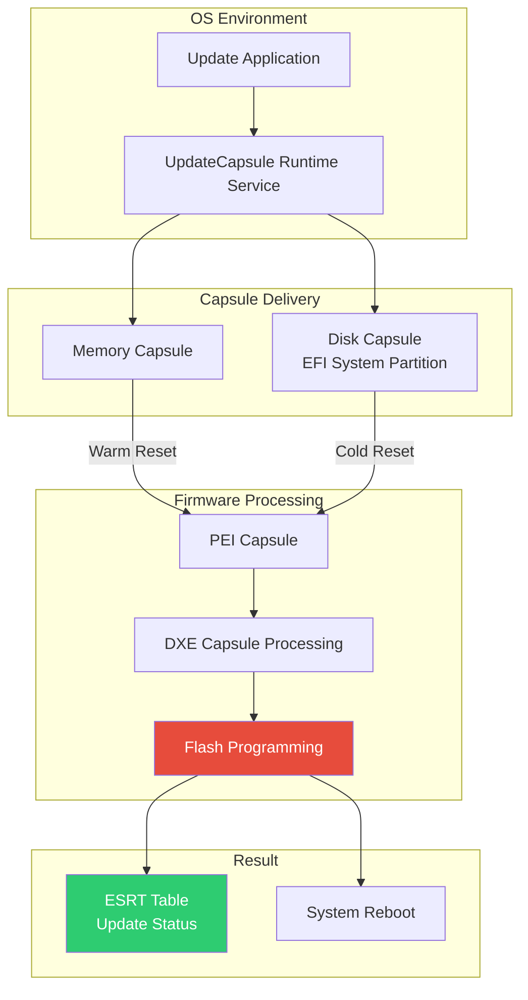

# Chapter 19: Capsule Updates
{: .fs-9 }

Firmware update mechanisms using UEFI Capsule.
{: .fs-6 .fw-300 }

---

## Overview

### When to Use Capsule Updates

{: .important }
> **Use Capsule Updates when you need to:**
> - Deliver firmware updates from the operating system
> - Update BIOS/UEFI firmware in a standard, OS-agnostic way
> - Support Windows Update for firmware (WSUS/WU)
> - Implement secure, authenticated firmware updates

| Scenario | Capsule Method | Delivery |
|:---------|:---------------|:---------|
| **Windows Update** | UpdateCapsule() | Memory-based, WU integration |
| **Linux fwupd** | UpdateCapsule() or ESP | LVFS integration |
| **Standalone update** | ESP capsule file | User copies to EFI partition |
| **Recovery update** | ESP or flash tool | Failsafe fallback |
| **Device firmware** | FMP capsule | Update peripherals (Thunderbolt, etc.) |

**Capsule vs Other Update Methods:**

| Factor | UEFI Capsule | Flash Tool | BMC-based |
|:-------|:-------------|:-----------|:----------|
| **OS integration** | Excellent | Poor | Excellent |
| **Standardization** | UEFI spec | Vendor-specific | IPMI/Redfish |
| **Security** | Signed capsules | Varies | Varies |
| **User experience** | Seamless reboot | Boot to DOS/shell | Remote |

**Who Implements Capsule Updates:**

| Role | Capsule Tasks |
|:-----|:--------------|
| **Firmware developer** | Implement capsule processing, FMP driver |
| **Platform developer** | ESRT configuration, flash layout |
| **OS vendor** | UpdateCapsule caller, fwupd/WU |
| **IT administrator** | Deploy updates via management tools |

**Key Capsule Concepts:**
- **FMP (Firmware Management Protocol)**: Interface for updates
- **ESRT (EFI System Resource Table)**: Describes updateable components
- **Signed capsules**: Authentication prevents malicious updates
- **Scatter-gather**: Handle large updates in fragments

### Capsule Update Architecture



### Capsule Types

| Type | Purpose | Processing Time |
|:-----|:--------|:----------------|
| **Firmware Update** | Update BIOS/UEFI firmware | PEI or DXE phase |
| **FMP (Firmware Management)** | Standardized updates via protocol | DXE phase |
| **System Reset** | Trigger specific reset type | Immediate |
| **Vendor Specific** | Custom OEM updates | Platform-dependent |

### ESRT (EFI System Resource Table)

```c
//
// ESRT tracks firmware components and update status
//
typedef struct {
  EFI_GUID  FirmwareClass;      // Component identifier
  UINT32    FirmwareType;       // System/Device firmware
  UINT32    FirmwareVersion;    // Current version
  UINT32    LowestSupportedVersion;
  UINT32    CapsuleFlags;       // Required capsule flags
  UINT32    LastAttemptVersion; // Last attempted update version
  UINT32    LastAttemptStatus;  // Result of last attempt
} EFI_SYSTEM_RESOURCE_ENTRY;
```

---

## Initialization

### Capsule Runtime Service

```c
#include <Uefi.h>
#include <Library/UefiLib.h>
#include <Library/UefiRuntimeServicesTableLib.h>
#include <Guid/CapsuleReport.h>

//
// UpdateCapsule - submit capsule for processing
//
EFI_STATUS
SubmitCapsule (
  IN EFI_CAPSULE_HEADER  **CapsuleHeaderArray,
  IN UINTN               CapsuleCount,
  IN EFI_PHYSICAL_ADDRESS ScatterGatherList OPTIONAL
  )
{
  return gRT->UpdateCapsule(
           CapsuleHeaderArray,
           CapsuleCount,
           ScatterGatherList
         );
}

//
// QueryCapsuleCapabilities - check if capsule is supported
//
EFI_STATUS
CheckCapsuleSupport (
  IN  EFI_CAPSULE_HEADER  **CapsuleHeaderArray,
  IN  UINTN               CapsuleCount,
  OUT UINT64              *MaximumCapsuleSize,
  OUT EFI_RESET_TYPE      *ResetType
  )
{
  return gRT->QueryCapsuleCapabilities(
           CapsuleHeaderArray,
           CapsuleCount,
           MaximumCapsuleSize,
           ResetType
         );
}
```

### Firmware Management Protocol

```c
#include <Protocol/FirmwareManagement.h>

EFI_FIRMWARE_MANAGEMENT_PROTOCOL *gFmp;

EFI_STATUS
InitializeFmp (
  VOID
  )
{
  EFI_STATUS Status;
  EFI_HANDLE *HandleBuffer;
  UINTN HandleCount;

  Status = gBS->LocateHandleBuffer(
             ByProtocol,
             &gEfiFirmwareManagementProtocolGuid,
             NULL,
             &HandleCount,
             &HandleBuffer
           );

  if (EFI_ERROR(Status) || HandleCount == 0) {
    return EFI_NOT_FOUND;
  }

  //
  // Get first FMP instance
  //
  Status = gBS->HandleProtocol(
             HandleBuffer[0],
             &gEfiFirmwareManagementProtocolGuid,
             (VOID **)&gFmp
           );

  gBS->FreePool(HandleBuffer);
  return Status;
}

EFI_STATUS
GetFirmwareInfo (
  VOID
  )
{
  EFI_STATUS Status;
  EFI_FIRMWARE_IMAGE_DESCRIPTOR *ImageInfo;
  UINTN ImageInfoSize;
  UINT32 DescriptorVersion;
  UINT8 DescriptorCount;
  UINTN DescriptorSize;
  UINT32 PackageVersion;
  CHAR16 *PackageVersionName;

  if (gFmp == NULL) {
    return EFI_NOT_READY;
  }

  //
  // Get size first
  //
  ImageInfoSize = 0;
  Status = gFmp->GetImageInfo(
             gFmp,
             &ImageInfoSize,
             NULL,
             &DescriptorVersion,
             &DescriptorCount,
             &DescriptorSize,
             &PackageVersion,
             &PackageVersionName
           );

  if (Status != EFI_BUFFER_TOO_SMALL) {
    return Status;
  }

  ImageInfo = AllocatePool(ImageInfoSize);

  Status = gFmp->GetImageInfo(
             gFmp,
             &ImageInfoSize,
             ImageInfo,
             &DescriptorVersion,
             &DescriptorCount,
             &DescriptorSize,
             &PackageVersion,
             &PackageVersionName
           );

  if (!EFI_ERROR(Status)) {
    Print(L"Firmware Images:\n");
    for (UINT8 i = 0; i < DescriptorCount; i++) {
      EFI_FIRMWARE_IMAGE_DESCRIPTOR *Desc =
        (EFI_FIRMWARE_IMAGE_DESCRIPTOR *)((UINT8 *)ImageInfo + i * DescriptorSize);

      Print(L"  Image %d:\n", i);
      Print(L"    Name: %s\n", Desc->ImageIdName);
      Print(L"    Version: 0x%08x (%s)\n", Desc->Version, Desc->VersionName);
      Print(L"    Type: %g\n", &Desc->ImageTypeId);
    }
  }

  FreePool(ImageInfo);
  return Status;
}
```

---

## Configuration

### Capsule Header Structure

```c
//
// EFI Capsule Header
//
typedef struct {
  EFI_GUID  CapsuleGuid;
  UINT32    HeaderSize;
  UINT32    Flags;
  UINT32    CapsuleImageSize;
} EFI_CAPSULE_HEADER;

//
// Capsule Flags
//
#define CAPSULE_FLAGS_PERSIST_ACROSS_RESET  0x00010000
#define CAPSULE_FLAGS_POPULATE_SYSTEM_TABLE 0x00020000
#define CAPSULE_FLAGS_INITIATE_RESET        0x00040000

//
// Common capsule GUIDs
//
// gEfiFmpCapsuleGuid           - FMP capsule format
// gEfiCapsuleReportGuid        - Capsule result reporting
// gWindowsUxCapsuleGuid        - Windows UX capsule
//
```

### Building a Capsule

```c
EFI_STATUS
BuildFmpCapsule (
  IN  EFI_GUID  *ImageTypeId,
  IN  VOID      *FirmwareImage,
  IN  UINTN     FirmwareImageSize,
  OUT VOID      **Capsule,
  OUT UINTN     *CapsuleSize
  )
{
  EFI_CAPSULE_HEADER *CapsuleHeader;
  EFI_FIRMWARE_MANAGEMENT_CAPSULE_HEADER *FmpHeader;
  EFI_FIRMWARE_MANAGEMENT_CAPSULE_IMAGE_HEADER *ImageHeader;
  UINT64 *ItemOffsetList;
  UINTN TotalSize;
  UINT8 *Buffer;

  //
  // Calculate sizes
  //
  TotalSize = sizeof(EFI_CAPSULE_HEADER) +
              sizeof(EFI_FIRMWARE_MANAGEMENT_CAPSULE_HEADER) +
              sizeof(UINT64) +  // ItemOffsetList[1]
              sizeof(EFI_FIRMWARE_MANAGEMENT_CAPSULE_IMAGE_HEADER) +
              FirmwareImageSize;

  Buffer = AllocateZeroPool(TotalSize);
  if (Buffer == NULL) {
    return EFI_OUT_OF_RESOURCES;
  }

  //
  // Fill capsule header
  //
  CapsuleHeader = (EFI_CAPSULE_HEADER *)Buffer;
  CopyGuid(&CapsuleHeader->CapsuleGuid, &gEfiFmpCapsuleGuid);
  CapsuleHeader->HeaderSize = sizeof(EFI_CAPSULE_HEADER);
  CapsuleHeader->Flags = CAPSULE_FLAGS_PERSIST_ACROSS_RESET |
                         CAPSULE_FLAGS_INITIATE_RESET;
  CapsuleHeader->CapsuleImageSize = (UINT32)TotalSize;

  //
  // Fill FMP capsule header
  //
  FmpHeader = (EFI_FIRMWARE_MANAGEMENT_CAPSULE_HEADER *)
              (Buffer + sizeof(EFI_CAPSULE_HEADER));
  FmpHeader->Version = EFI_FIRMWARE_MANAGEMENT_CAPSULE_HEADER_INIT_VERSION;
  FmpHeader->EmbeddedDriverCount = 0;
  FmpHeader->PayloadItemCount = 1;

  //
  // Item offset list
  //
  ItemOffsetList = (UINT64 *)(FmpHeader + 1);
  ItemOffsetList[0] = sizeof(EFI_FIRMWARE_MANAGEMENT_CAPSULE_HEADER) +
                      sizeof(UINT64);

  //
  // Image header
  //
  ImageHeader = (EFI_FIRMWARE_MANAGEMENT_CAPSULE_IMAGE_HEADER *)
                ((UINT8 *)FmpHeader + ItemOffsetList[0]);
  ImageHeader->Version = EFI_FIRMWARE_MANAGEMENT_CAPSULE_IMAGE_HEADER_INIT_VERSION;
  CopyGuid(&ImageHeader->UpdateImageTypeId, ImageTypeId);
  ImageHeader->UpdateImageIndex = 1;
  ImageHeader->UpdateImageSize = (UINT32)FirmwareImageSize;
  ImageHeader->UpdateVendorCodeSize = 0;

  //
  // Copy firmware image
  //
  CopyMem(ImageHeader + 1, FirmwareImage, FirmwareImageSize);

  *Capsule = Buffer;
  *CapsuleSize = TotalSize;

  return EFI_SUCCESS;
}
```

---

## Porting Guide

### Platform Capsule Configuration

```ini
#
# Platform DSC file - Capsule configuration
#

[PcdsFixedAtBuild]
  # Capsule settings
  gEfiMdeModulePkgTokenSpaceGuid.PcdCapsuleOnDiskSupport|TRUE
  gEfiMdeModulePkgTokenSpaceGuid.PcdCapsuleInRamSupport|TRUE
  gEfiMdeModulePkgTokenSpaceGuid.PcdMaxSizeNonPopulateCapsule|0x1000000

[Components]
  # Capsule infrastructure
  MdeModulePkg/Universal/CapsuleRuntimeDxe/CapsuleRuntimeDxe.inf
  MdeModulePkg/Universal/CapsulePei/CapsulePei.inf

  # ESRT
  MdeModulePkg/Universal/EsrtDxe/EsrtDxe.inf
  MdeModulePkg/Universal/EsrtFmpDxe/EsrtFmpDxe.inf

  # FMP driver
  $(PLATFORM_PKG)/FmpDxe/FmpDxe.inf {
    <LibraryClasses>
      FmpAuthenticationLib|SecurityPkg/Library/FmpAuthenticationLibPkcs7/FmpAuthenticationLibPkcs7.inf
  }
```

### FMP Driver Implementation

```c
/** @file
  Firmware Management Protocol Driver
**/

#include <Uefi.h>
#include <Library/UefiLib.h>
#include <Library/UefiBootServicesTableLib.h>
#include <Protocol/FirmwareManagement.h>

//
// Firmware type GUID
//
EFI_GUID gSystemFirmwareGuid = {
  0x12345678, 0xabcd, 0xef01,
  {0x23, 0x45, 0x67, 0x89, 0xab, 0xcd, 0xef, 0x01}
};

EFI_FIRMWARE_IMAGE_DESCRIPTOR mImageDescriptor = {
  1,                          // ImageIndex
  { 0 },                      // ImageTypeId (filled at runtime)
  1,                          // ImageId
  L"System Firmware",         // ImageIdName
  0x00010000,                 // Version
  L"1.0",                     // VersionName
  0x400000,                   // Size
  IMAGE_ATTRIBUTE_IMAGE_UPDATABLE |
  IMAGE_ATTRIBUTE_RESET_REQUIRED, // AttributesSupported
  IMAGE_ATTRIBUTE_IMAGE_UPDATABLE |
  IMAGE_ATTRIBUTE_RESET_REQUIRED, // AttributesSetting
  0,                          // Compatibilities
  0x00010000,                 // LowestSupportedImageVersion
  0,                          // LastAttemptVersion
  0,                          // LastAttemptStatus
  0                           // HardwareInstance
};

EFI_STATUS
EFIAPI
FmpGetImageInfo (
  IN     EFI_FIRMWARE_MANAGEMENT_PROTOCOL  *This,
  IN OUT UINTN                             *ImageInfoSize,
  IN OUT EFI_FIRMWARE_IMAGE_DESCRIPTOR     *ImageInfo,
  OUT    UINT32                            *DescriptorVersion,
  OUT    UINT8                             *DescriptorCount,
  OUT    UINTN                             *DescriptorSize,
  OUT    UINT32                            *PackageVersion,
  OUT    CHAR16                            **PackageVersionName
  )
{
  if (*ImageInfoSize < sizeof(EFI_FIRMWARE_IMAGE_DESCRIPTOR)) {
    *ImageInfoSize = sizeof(EFI_FIRMWARE_IMAGE_DESCRIPTOR);
    return EFI_BUFFER_TOO_SMALL;
  }

  CopyMem(ImageInfo, &mImageDescriptor, sizeof(EFI_FIRMWARE_IMAGE_DESCRIPTOR));
  CopyGuid(&ImageInfo->ImageTypeId, &gSystemFirmwareGuid);

  *DescriptorVersion = EFI_FIRMWARE_IMAGE_DESCRIPTOR_VERSION;
  *DescriptorCount = 1;
  *DescriptorSize = sizeof(EFI_FIRMWARE_IMAGE_DESCRIPTOR);
  *PackageVersion = 0xFFFFFFFF;
  *PackageVersionName = NULL;

  return EFI_SUCCESS;
}

EFI_STATUS
EFIAPI
FmpSetImage (
  IN  EFI_FIRMWARE_MANAGEMENT_PROTOCOL               *This,
  IN  UINT8                                          ImageIndex,
  IN  CONST VOID                                     *Image,
  IN  UINTN                                          ImageSize,
  IN  CONST VOID                                     *VendorCode,
  IN  EFI_FIRMWARE_MANAGEMENT_UPDATE_IMAGE_PROGRESS  Progress,
  OUT CHAR16                                         **AbortReason
  )
{
  EFI_STATUS Status;

  //
  // Validate image
  //
  if (ImageIndex != 1 || Image == NULL || ImageSize == 0) {
    return EFI_INVALID_PARAMETER;
  }

  //
  // Update progress
  //
  if (Progress != NULL) {
    Progress(10);  // 10% - Starting
  }

  //
  // Verify signature (if authenticated)
  //
  Status = VerifyFirmwareImage(Image, ImageSize);
  if (EFI_ERROR(Status)) {
    return EFI_SECURITY_VIOLATION;
  }

  if (Progress != NULL) {
    Progress(30);  // 30% - Verified
  }

  //
  // Write to flash
  //
  Status = WriteFirmwareToFlash(Image, ImageSize, Progress);

  if (Progress != NULL) {
    Progress(100);  // 100% - Complete
  }

  return Status;
}

EFI_FIRMWARE_MANAGEMENT_PROTOCOL mFmp = {
  FmpGetImageInfo,
  NULL,            // GetImage (optional)
  FmpSetImage,
  NULL,            // CheckImage (optional)
  NULL,            // GetPackageInfo (optional)
  NULL             // SetPackageInfo (optional)
};
```

---

## Capsule Delivery Methods

### Memory-Based Capsule (Runtime)

```c
EFI_STATUS
DeliverCapsuleViaRuntime (
  IN VOID   *CapsuleBuffer,
  IN UINTN  CapsuleSize
  )
{
  EFI_STATUS Status;
  EFI_CAPSULE_HEADER *CapsuleHeader;
  EFI_CAPSULE_HEADER *CapsuleArray[1];
  UINT64 MaxSize;
  EFI_RESET_TYPE ResetType;

  CapsuleHeader = (EFI_CAPSULE_HEADER *)CapsuleBuffer;
  CapsuleArray[0] = CapsuleHeader;

  //
  // Check capabilities
  //
  Status = gRT->QueryCapsuleCapabilities(
             CapsuleArray,
             1,
             &MaxSize,
             &ResetType
           );

  if (EFI_ERROR(Status)) {
    Print(L"Capsule not supported: %r\n", Status);
    return Status;
  }

  if (CapsuleSize > MaxSize) {
    Print(L"Capsule too large\n");
    return EFI_UNSUPPORTED;
  }

  Print(L"Submitting capsule, reset type: %d\n", ResetType);

  //
  // Submit capsule
  //
  Status = gRT->UpdateCapsule(
             CapsuleArray,
             1,
             0  // ScatterGatherList not used
           );

  if (!EFI_ERROR(Status)) {
    //
    // If INITIATE_RESET flag is set, UpdateCapsule triggers reset
    // Otherwise, caller must reset
    //
    if (!(CapsuleHeader->Flags & CAPSULE_FLAGS_INITIATE_RESET)) {
      gRT->ResetSystem(ResetType, EFI_SUCCESS, 0, NULL);
    }
  }

  return Status;
}
```

### Disk-Based Capsule

```c
//
// Capsule on disk - stored in EFI System Partition
//
// Path: \EFI\UpdateCapsule\*.cap
//
// Firmware discovers capsules at next boot
//

EFI_STATUS
WriteCapsuleToDisk (
  IN VOID   *CapsuleBuffer,
  IN UINTN  CapsuleSize,
  IN CHAR16 *FileName
  )
{
  EFI_STATUS Status;
  EFI_FILE_PROTOCOL *Root;
  EFI_FILE_PROTOCOL *CapsuleDir;
  EFI_FILE_PROTOCOL *CapsuleFile;
  CHAR16 FilePath[256];

  //
  // Open root of ESP
  //
  Status = OpenEspRoot(&Root);
  if (EFI_ERROR(Status)) {
    return Status;
  }

  //
  // Create/Open UpdateCapsule directory
  //
  Status = Root->Open(
             Root,
             &CapsuleDir,
             L"\\EFI\\UpdateCapsule",
             EFI_FILE_MODE_READ | EFI_FILE_MODE_WRITE | EFI_FILE_MODE_CREATE,
             EFI_FILE_DIRECTORY
           );

  if (EFI_ERROR(Status)) {
    Root->Close(Root);
    return Status;
  }

  //
  // Create capsule file
  //
  UnicodeSPrint(FilePath, sizeof(FilePath), L"%s.cap", FileName);

  Status = CapsuleDir->Open(
             CapsuleDir,
             &CapsuleFile,
             FilePath,
             EFI_FILE_MODE_READ | EFI_FILE_MODE_WRITE | EFI_FILE_MODE_CREATE,
             0
           );

  if (!EFI_ERROR(Status)) {
    UINTN WriteSize = CapsuleSize;
    Status = CapsuleFile->Write(CapsuleFile, &WriteSize, CapsuleBuffer);
    CapsuleFile->Flush(CapsuleFile);
    CapsuleFile->Close(CapsuleFile);
  }

  CapsuleDir->Close(CapsuleDir);
  Root->Close(Root);

  //
  // Set OsIndications to request capsule processing
  //
  UINT64 OsIndications;
  UINTN Size = sizeof(OsIndications);

  Status = gRT->GetVariable(
             L"OsIndicationsSupported",
             &gEfiGlobalVariableGuid,
             NULL,
             &Size,
             &OsIndications
           );

  if (!EFI_ERROR(Status) &&
      (OsIndications & EFI_OS_INDICATIONS_FILE_CAPSULE_DELIVERY_SUPPORTED)) {

    OsIndications = EFI_OS_INDICATIONS_FILE_CAPSULE_DELIVERY_SUPPORTED;

    gRT->SetVariable(
      L"OsIndications",
      &gEfiGlobalVariableGuid,
      EFI_VARIABLE_BOOTSERVICE_ACCESS |
      EFI_VARIABLE_RUNTIME_ACCESS |
      EFI_VARIABLE_NON_VOLATILE,
      sizeof(OsIndications),
      &OsIndications
    );
  }

  return Status;
}
```

---

## UEFI Specification Reference

- **UEFI Spec Section 8.5.3**: UpdateCapsule
- **UEFI Spec Section 8.5.4**: QueryCapsuleCapabilities
- **UEFI Spec Section 23**: Firmware Management Protocol
- **UEFI Spec Section 23.4**: EFI System Resource Table (ESRT)

---

## Summary

1. **Capsule** is the UEFI firmware update mechanism
2. **UpdateCapsule** runtime service submits updates
3. **FMP** (Firmware Management Protocol) provides standardized interface
4. **ESRT** tracks firmware versions and update status
5. **Memory or disk** delivery methods available
6. **System reset** typically required after update

---

## Next Steps

- [Chapter 20: BMC Integration]() - Server management
- [Chapter 21: RAS Features]() - Reliability features

---

{: .warning }
> **Critical:** Firmware updates can brick systems if interrupted. Ensure power stability and proper validation before deploying updates.
