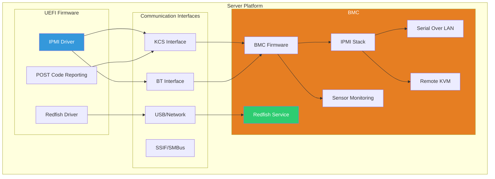

# Chapter 20: BMC Integration
{: .fs-9 }

IPMI, Redfish, and BMC-UEFI communication for server platforms.
{: .fs-6 .fw-300 }

---

## Overview

### When to Use BMC Integration

{: .important }
> **Use BMC Integration when you need to:**
> - Report boot progress (POST codes) to remote management
> - Enable Serial-over-LAN for remote console access
> - Log sensor data and hardware events during boot
> - Support Redfish-based configuration from management software

| Scenario | Protocol | UEFI Component |
|:---------|:---------|:---------------|
| **POST code reporting** | IPMI (KCS/BT) | Status Code driver |
| **Remote console** | IPMI SOL | Serial redirection |
| **Sensor reading** | IPMI | Sensor driver |
| **REST-based management** | Redfish | REST_EX protocol |
| **Firmware update via BMC** | Redfish | UpdateService |
| **Boot option from BMC** | Redfish | BootOptionRegistry |

**BMC Protocol Comparison:**

| Factor | IPMI | Redfish |
|:-------|:-----|:--------|
| **Interface** | Low-level binary | RESTful JSON |
| **Complexity** | Simpler | More complex |
| **Extensibility** | OEM commands | Standard schemas |
| **Security** | Limited | TLS, authentication |
| **Modern systems** | Legacy | Preferred |

**Who Implements BMC Integration:**

| Role | BMC Tasks |
|:-----|:----------|
| **Platform developer** | IPMI driver, interface selection |
| **Server OEM** | BMC firmware, UEFI integration |
| **Data center operator** | Redfish clients, automation |
| **Firmware engineer** | POST codes, SOL, health monitoring |

**Platform Considerations:**
- Server platforms: Full BMC integration expected
- Client platforms: Usually no BMC (use EC instead)
- Embedded: May have lightweight management controller
- IPMI interface (KCS, BT, SSIF) determined by hardware

### BMC Architecture

The Baseboard Management Controller (BMC) provides out-of-band management:



### BMC Communication Methods

| Interface | Protocol | Speed | Use Case |
|:----------|:---------|:------|:---------|
| **KCS** | IPMI | Slow | Standard IPMI, POST codes |
| **BT** | IPMI | Medium | Higher throughput IPMI |
| **SSIF** | SMBus | Slow | I2C-based systems |
| **USB** | Redfish/MCTP | Fast | High-bandwidth, modern |
| **Network** | Redfish | Fast | Out-of-band management |

---

## Initialization

### IPMI Protocol

```c
#include <IndustryStandard/Ipmi.h>
#include <Protocol/IpmiProtocol.h>

IPMI_PROTOCOL *gIpmi;

EFI_STATUS
InitializeIpmi (
  VOID
  )
{
  return gBS->LocateProtocol(
           &gIpmiProtocolGuid,
           NULL,
           (VOID **)&gIpmi
         );
}

//
// Send IPMI command
//
EFI_STATUS
SendIpmiCommand (
  IN  UINT8   NetFunction,
  IN  UINT8   Command,
  IN  UINT8   *RequestData,
  IN  UINT32  RequestSize,
  OUT UINT8   *ResponseData,
  OUT UINT32  *ResponseSize
  )
{
  if (gIpmi == NULL) {
    return EFI_NOT_READY;
  }

  return gIpmi->IpmiSubmitCommand(
           gIpmi,
           NetFunction,
           0,  // Lun
           Command,
           RequestData,
           RequestSize,
           ResponseData,
           ResponseSize
         );
}
```

### KCS Interface Direct Access

```c
#include <IndustryStandard/IpmiKcs.h>

//
// KCS I/O ports (common addresses)
//
#define KCS_DATA_PORT     0xCA2
#define KCS_STATUS_PORT   0xCA3

//
// KCS Status bits
//
#define KCS_STATUS_OBF    0x01  // Output Buffer Full
#define KCS_STATUS_IBF    0x02  // Input Buffer Full
#define KCS_STATUS_STATE  0xC0  // State machine bits

//
// KCS States
//
#define KCS_STATE_IDLE    0x00
#define KCS_STATE_READ    0x40
#define KCS_STATE_WRITE   0x80
#define KCS_STATE_ERROR   0xC0

EFI_STATUS
KcsWaitInputBufferEmpty (
  IN UINT16  StatusPort
  )
{
  UINTN Timeout = 100000;  // 100ms
  UINT8 Status;

  while (Timeout > 0) {
    Status = IoRead8(StatusPort);

    if ((Status & KCS_STATUS_IBF) == 0) {
      return EFI_SUCCESS;
    }

    gBS->Stall(10);
    Timeout -= 10;
  }

  return EFI_TIMEOUT;
}

EFI_STATUS
KcsSendCommand (
  IN UINT16  DataPort,
  IN UINT16  StatusPort,
  IN UINT8   NetFn,
  IN UINT8   Cmd,
  IN UINT8   *Data,
  IN UINTN   DataSize
  )
{
  EFI_STATUS Status;
  UINTN Index;

  //
  // Wait for IBF clear
  //
  Status = KcsWaitInputBufferEmpty(StatusPort);
  if (EFI_ERROR(Status)) {
    return Status;
  }

  //
  // Write WRITE_START command
  //
  IoWrite8(StatusPort, KCS_WRITE_START);

  Status = KcsWaitInputBufferEmpty(StatusPort);
  if (EFI_ERROR(Status)) {
    return Status;
  }

  //
  // Write NetFn/LUN
  //
  IoWrite8(DataPort, (NetFn << 2));

  //
  // Write command
  //
  Status = KcsWaitInputBufferEmpty(StatusPort);
  if (EFI_ERROR(Status)) {
    return Status;
  }

  IoWrite8(DataPort, Cmd);

  //
  // Write data
  //
  for (Index = 0; Index < DataSize; Index++) {
    Status = KcsWaitInputBufferEmpty(StatusPort);
    if (EFI_ERROR(Status)) {
      return Status;
    }

    if (Index == DataSize - 1) {
      //
      // Last byte - send WRITE_END
      //
      IoWrite8(StatusPort, KCS_WRITE_END);
    }

    IoWrite8(DataPort, Data[Index]);
  }

  return EFI_SUCCESS;
}
```

---

## Configuration

### IPMI Commands

```c
//
// Common IPMI Network Functions
//
#define IPMI_NETFN_CHASSIS        0x00
#define IPMI_NETFN_BRIDGE         0x02
#define IPMI_NETFN_SENSOR         0x04
#define IPMI_NETFN_APP            0x06
#define IPMI_NETFN_FIRMWARE       0x08
#define IPMI_NETFN_STORAGE        0x0A
#define IPMI_NETFN_TRANSPORT      0x0C

//
// Get Device ID
//
EFI_STATUS
IpmiGetDeviceId (
  OUT IPMI_GET_DEVICE_ID_RESPONSE  *DeviceId
  )
{
  UINT32 ResponseSize = sizeof(IPMI_GET_DEVICE_ID_RESPONSE);

  return SendIpmiCommand(
           IPMI_NETFN_APP,
           IPMI_APP_GET_DEVICE_ID,
           NULL,
           0,
           (UINT8 *)DeviceId,
           &ResponseSize
         );
}

//
// Chassis Control (Power On/Off/Cycle/Reset)
//
EFI_STATUS
IpmiChassisControl (
  IN UINT8  Control  // 0=Off, 1=On, 2=Cycle, 3=Reset
  )
{
  UINT8 Response[2];
  UINT32 ResponseSize = sizeof(Response);

  return SendIpmiCommand(
           IPMI_NETFN_CHASSIS,
           IPMI_CHASSIS_CONTROL,
           &Control,
           1,
           Response,
           &ResponseSize
         );
}

//
// Get Sensor Reading
//
EFI_STATUS
IpmiGetSensorReading (
  IN  UINT8   SensorNumber,
  OUT UINT8   *Reading,
  OUT UINT8   *Status
  )
{
  IPMI_GET_SENSOR_READING_RESPONSE Response;
  UINT32 ResponseSize = sizeof(Response);
  EFI_STATUS EfiStatus;

  EfiStatus = SendIpmiCommand(
                IPMI_NETFN_SENSOR,
                IPMI_SENSOR_GET_SENSOR_READING,
                &SensorNumber,
                1,
                (UINT8 *)&Response,
                &ResponseSize
              );

  if (!EFI_ERROR(EfiStatus)) {
    *Reading = Response.SensorReading;
    *Status = Response.SensorStatus;
  }

  return EfiStatus;
}
```

### POST Code Reporting

```c
//
// Send POST code to BMC
//
EFI_STATUS
ReportPostCode (
  IN UINT32  PostCode
  )
{
  UINT8 Data[2];
  UINT8 Response[2];
  UINT32 ResponseSize = sizeof(Response);

  //
  // OEM command format varies by vendor
  // This is a simplified example
  //
  Data[0] = (UINT8)(PostCode & 0xFF);
  Data[1] = (UINT8)((PostCode >> 8) & 0xFF);

  return SendIpmiCommand(
           IPMI_NETFN_OEM,
           0x01,  // OEM POST code command
           Data,
           2,
           Response,
           &ResponseSize
         );
}

//
// Report progress during boot
//
VOID
ReportBootProgress (
  IN EFI_STATUS_CODE_TYPE   Type,
  IN EFI_STATUS_CODE_VALUE  Value
  )
{
  UINT32 PostCode;

  //
  // Convert status code to POST code
  //
  PostCode = (Value & 0xFFFF);

  ReportPostCode(PostCode);
}
```

---

## Redfish Integration

### Redfish Host Interface

```c
#include <Protocol/RedfishDiscover.h>
#include <Protocol/RestEx.h>

//
// SMBIOS Type 42 - Redfish Host Interface
//
// Defines how UEFI communicates with BMC Redfish service
//

EFI_REST_EX_PROTOCOL *gRestEx;

EFI_STATUS
InitializeRedfish (
  VOID
  )
{
  EFI_STATUS Status;
  EFI_HANDLE *HandleBuffer;
  UINTN HandleCount;

  Status = gBS->LocateHandleBuffer(
             ByProtocol,
             &gEfiRestExProtocolGuid,
             NULL,
             &HandleCount,
             &HandleBuffer
           );

  if (EFI_ERROR(Status) || HandleCount == 0) {
    return EFI_NOT_FOUND;
  }

  Status = gBS->HandleProtocol(
             HandleBuffer[0],
             &gEfiRestExProtocolGuid,
             (VOID **)&gRestEx
           );

  gBS->FreePool(HandleBuffer);
  return Status;
}
```

### Redfish REST Operations

```c
//
// Perform Redfish GET request
//
EFI_STATUS
RedfishGet (
  IN  CHAR8   *Uri,
  OUT CHAR8   **Response,
  OUT UINTN   *ResponseSize
  )
{
  EFI_STATUS Status;
  EFI_HTTP_MESSAGE Request;
  EFI_HTTP_MESSAGE ResponseMsg;
  EFI_REST_EX_TOKEN Token;

  if (gRestEx == NULL) {
    return EFI_NOT_READY;
  }

  ZeroMem(&Request, sizeof(Request));
  ZeroMem(&ResponseMsg, sizeof(ResponseMsg));
  ZeroMem(&Token, sizeof(Token));

  //
  // Build request
  //
  Request.Data.Request = AllocateZeroPool(sizeof(EFI_HTTP_REQUEST_DATA));
  Request.Data.Request->Method = HttpMethodGet;
  Request.Data.Request->Url = AllocatePool(AsciiStrLen(Uri) + 1);
  AsciiStrCpyS(Request.Data.Request->Url, AsciiStrLen(Uri) + 1, Uri);

  //
  // Send request
  //
  Token.Event = NULL;
  Token.Status = EFI_NOT_READY;
  Token.Message = &ResponseMsg;

  Status = gRestEx->SendReceive(gRestEx, &Request, &Token);

  if (!EFI_ERROR(Status) && !EFI_ERROR(Token.Status)) {
    if (ResponseMsg.Body != NULL && ResponseMsg.BodyLength > 0) {
      *Response = AllocatePool(ResponseMsg.BodyLength + 1);
      CopyMem(*Response, ResponseMsg.Body, ResponseMsg.BodyLength);
      (*Response)[ResponseMsg.BodyLength] = '\0';
      *ResponseSize = ResponseMsg.BodyLength;
    }
  }

  //
  // Cleanup
  //
  if (Request.Data.Request->Url != NULL) {
    FreePool(Request.Data.Request->Url);
  }
  FreePool(Request.Data.Request);

  return Status;
}

//
// Example: Get system inventory
//
EFI_STATUS
GetSystemInventory (
  VOID
  )
{
  EFI_STATUS Status;
  CHAR8 *Response;
  UINTN ResponseSize;

  Status = RedfishGet("/redfish/v1/Systems/1", &Response, &ResponseSize);

  if (!EFI_ERROR(Status)) {
    //
    // Parse JSON response
    // Contains: Manufacturer, Model, SerialNumber, etc.
    //
    DEBUG((DEBUG_INFO, "System Info:\n%a\n", Response));
    FreePool(Response);
  }

  return Status;
}
```

---

## Porting Guide

### Platform BMC Configuration

```ini
#
# Platform DSC file - BMC configuration
#

[PcdsFixedAtBuild]
  # KCS interface address
  gEfiIpmiPkgTokenSpaceGuid.PcdIpmiKcsIoBaseAddress|0xCA2

  # BT interface address
  gEfiIpmiPkgTokenSpaceGuid.PcdIpmiBtIoBaseAddress|0xE4

  # Interface type: 1=KCS, 2=BT, 3=SSIF
  gEfiIpmiPkgTokenSpaceGuid.PcdIpmiInterfaceType|1

[Components]
  # IPMI infrastructure
  IpmiFeaturePkg/GenericIpmi/Dxe/GenericIpmi.inf
  IpmiFeaturePkg/BmcAcpi/BmcAcpi.inf

  # Redfish support
  RedfishPkg/RedfishDiscoverDxe/RedfishDiscoverDxe.inf
  RedfishPkg/RedfishRestExDxe/RedfishRestExDxe.inf
  RedfishPkg/RedfishCredentialDxe/RedfishCredentialDxe.inf
```

### SMBIOS Type 42 (Redfish Host Interface)

```c
//
// SMBIOS Type 42 tells OS/UEFI how to reach Redfish service
//

#pragma pack(1)

typedef struct {
  SMBIOS_STRUCTURE  Hdr;
  UINT8             InterfaceType;
  UINT8             InterfaceTypeSpecificDataLength;
  // Interface-specific data follows
  // For USB: Device descriptor info
  // For Network: IP configuration
} SMBIOS_TABLE_TYPE42;

#pragma pack()

EFI_STATUS
CreateRedfishHostInterfaceSmbios (
  VOID
  )
{
  EFI_STATUS Status;
  EFI_SMBIOS_PROTOCOL *Smbios;
  SMBIOS_TABLE_TYPE42 *Type42;
  EFI_SMBIOS_HANDLE Handle;

  Status = gBS->LocateProtocol(
             &gEfiSmbiosProtocolGuid,
             NULL,
             (VOID **)&Smbios
           );

  if (EFI_ERROR(Status)) {
    return Status;
  }

  //
  // Build Type 42 structure
  // Actual implementation depends on interface type
  //

  Handle = SMBIOS_HANDLE_PI_RESERVED;
  Status = Smbios->Add(Smbios, NULL, &Handle, (EFI_SMBIOS_TABLE_HEADER *)Type42);

  return Status;
}
```

---

## BMC Use Cases

### Serial Over LAN (SOL)

```c
//
// Configure SOL for remote console
//
EFI_STATUS
ConfigureSerialOverLan (
  IN BOOLEAN  Enable
  )
{
  UINT8 Request[4];
  UINT8 Response[2];
  UINT32 ResponseSize = sizeof(Response);

  //
  // Set SOL configuration parameters
  //
  Request[0] = 0x01;  // Channel (usually 1)
  Request[1] = 0x00;  // Parameter selector: Set In Progress
  Request[2] = Enable ? 0x01 : 0x00;

  return SendIpmiCommand(
           IPMI_NETFN_TRANSPORT,
           IPMI_TRANSPORT_SET_SOL_CONFIG_PARAM,
           Request,
           3,
           Response,
           &ResponseSize
         );
}
```

### Sensor Monitoring

```c
//
// Read all SDR (Sensor Data Records)
//
EFI_STATUS
EnumerateSensors (
  VOID
  )
{
  UINT16 ReservationId;
  UINT16 RecordId = 0;
  UINT8 Response[64];
  UINT32 ResponseSize;

  //
  // Get SDR repository reservation
  //
  ResponseSize = sizeof(ReservationId);
  SendIpmiCommand(
    IPMI_NETFN_STORAGE,
    IPMI_STORAGE_RESERVE_SDR_REPOSITORY,
    NULL, 0,
    (UINT8 *)&ReservationId,
    &ResponseSize
  );

  Print(L"Sensors:\n");

  //
  // Iterate through SDR records
  //
  while (RecordId != 0xFFFF) {
    UINT8 Request[6];
    IPMI_SDR_RECORD_HEADER *SdrHeader;

    Request[0] = ReservationId & 0xFF;
    Request[1] = (ReservationId >> 8) & 0xFF;
    Request[2] = RecordId & 0xFF;
    Request[3] = (RecordId >> 8) & 0xFF;
    Request[4] = 0;   // Offset
    Request[5] = 64;  // Bytes to read

    ResponseSize = sizeof(Response);
    SendIpmiCommand(
      IPMI_NETFN_STORAGE,
      IPMI_STORAGE_GET_SDR,
      Request, 6,
      Response,
      &ResponseSize
    );

    //
    // Parse SDR record
    //
    RecordId = (Response[1] << 8) | Response[0];
    SdrHeader = (IPMI_SDR_RECORD_HEADER *)&Response[2];

    if (SdrHeader->RecordType == 0x01) {  // Full Sensor Record
      IPMI_SDR_RECORD_STRUCT_1 *FullSensor =
        (IPMI_SDR_RECORD_STRUCT_1 *)SdrHeader;

      Print(L"  Sensor %d: %a\n",
        FullSensor->SensorNumber,
        FullSensor->IdString);
    }
  }

  return EFI_SUCCESS;
}
```

---

## Example: BMC Info Display

```c
/** @file
  BMC Information Display
**/

#include <Uefi.h>
#include <Library/UefiLib.h>
#include <Library/UefiBootServicesTableLib.h>
#include <Protocol/IpmiProtocol.h>
#include <IndustryStandard/Ipmi.h>

EFI_STATUS
EFIAPI
UefiMain (
  IN EFI_HANDLE        ImageHandle,
  IN EFI_SYSTEM_TABLE  *SystemTable
  )
{
  EFI_STATUS Status;
  IPMI_PROTOCOL *Ipmi;
  IPMI_GET_DEVICE_ID_RESPONSE DeviceId;
  UINT32 ResponseSize;

  Print(L"=== BMC Information ===\n\n");

  //
  // Locate IPMI protocol
  //
  Status = gBS->LocateProtocol(&gIpmiProtocolGuid, NULL, (VOID **)&Ipmi);

  if (EFI_ERROR(Status)) {
    Print(L"IPMI not available: %r\n", Status);
    Print(L"(BMC may not be present on this system)\n");
    goto Exit;
  }

  //
  // Get Device ID
  //
  ResponseSize = sizeof(DeviceId);
  Status = Ipmi->IpmiSubmitCommand(
             Ipmi,
             IPMI_NETFN_APP,
             0,
             IPMI_APP_GET_DEVICE_ID,
             NULL, 0,
             (UINT8 *)&DeviceId,
             &ResponseSize
           );

  if (!EFI_ERROR(Status)) {
    Print(L"BMC Device ID:\n");
    Print(L"  Device ID:       0x%02x\n", DeviceId.DeviceId);
    Print(L"  Device Revision: 0x%02x\n", DeviceId.DeviceRevision);
    Print(L"  Firmware Rev:    %d.%d\n",
      DeviceId.FirmwareMajorRevision,
      DeviceId.FirmwareMinorRevision);
    Print(L"  IPMI Version:    %d.%d\n",
      (DeviceId.IpmiVersion >> 4) & 0x0F,
      DeviceId.IpmiVersion & 0x0F);
    Print(L"  Manufacturer ID: 0x%06x\n",
      DeviceId.ManufacturerId[0] |
      (DeviceId.ManufacturerId[1] << 8) |
      (DeviceId.ManufacturerId[2] << 16));
  }

  //
  // Get Self Test Results
  //
  {
    UINT8 Response[4];
    ResponseSize = sizeof(Response);

    Status = Ipmi->IpmiSubmitCommand(
               Ipmi,
               IPMI_NETFN_APP,
               0,
               IPMI_APP_GET_SELFTEST_RESULTS,
               NULL, 0,
               Response,
               &ResponseSize
             );

    if (!EFI_ERROR(Status)) {
      Print(L"\nSelf Test Results:\n");
      Print(L"  Result: 0x%02x ", Response[0]);

      switch (Response[0]) {
        case 0x55:
          Print(L"(No error)\n");
          break;
        case 0x56:
          Print(L"(Self test not implemented)\n");
          break;
        case 0x57:
          Print(L"(Corrupted device)\n");
          break;
        case 0x58:
          Print(L"(Fatal hardware error)\n");
          break;
        default:
          Print(L"(Device-specific error)\n");
      }
    }
  }

Exit:
  Print(L"\nPress any key to exit...\n");
  {
    EFI_INPUT_KEY Key;
    UINTN Index;
    gBS->WaitForEvent(1, &gST->ConIn->WaitForKey, &Index);
    gST->ConIn->ReadKeyStroke(gST->ConIn, &Key);
  }

  return EFI_SUCCESS;
}
```

---

## Specification Reference

- **IPMI 2.0 Specification**: Intelligent Platform Management Interface
- **Redfish Specification**: DMTF Redfish API
- **SMBIOS Specification**: Type 42 - Management Controller Host Interface

---

## Summary

1. **BMC** provides out-of-band server management
2. **IPMI** is the traditional low-level interface (KCS, BT)
3. **Redfish** is the modern REST API approach
4. **POST codes** report boot progress to BMC
5. **SOL** enables remote console access
6. **Sensors** provide hardware health monitoring

---

## Next Steps

- [Chapter 21: RAS Features]() - Reliability features
- [Chapter 22: eSPI Interface]() - Enhanced SPI

---

{: .note }
> **Server-Specific:** BMC integration is primarily for server platforms. Desktop/laptop systems typically don't have BMC.
