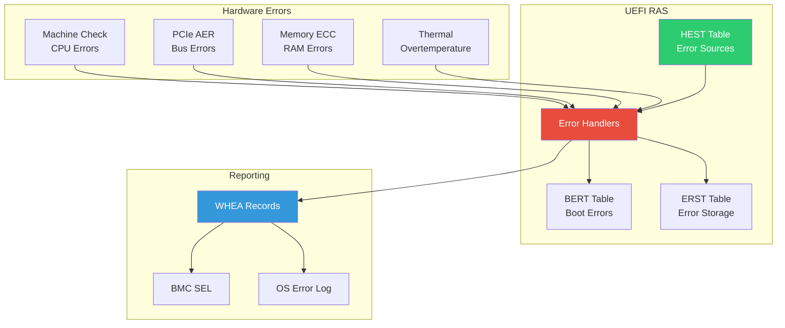
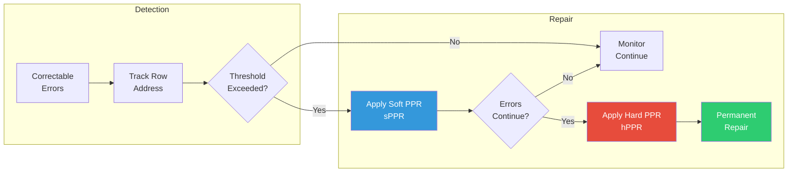
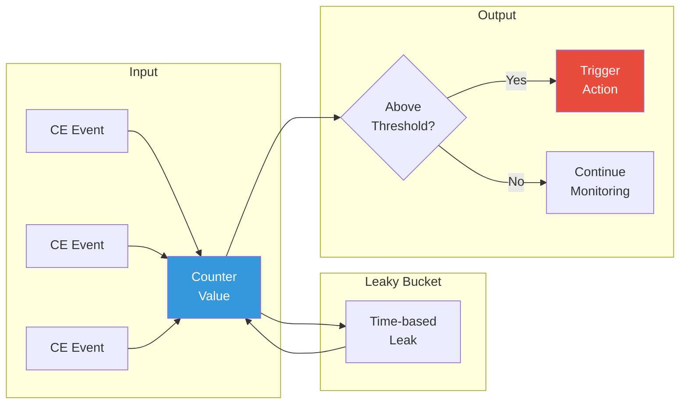
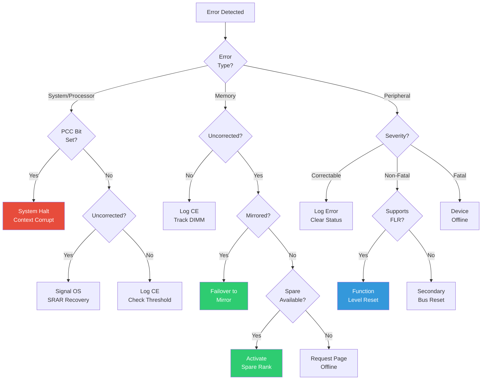

# Chapter 21: RAS Features
{: .fs-9 }

Reliability, Availability, and Serviceability - WHEA, APEI, and error handling.
{: .fs-6 .fw-300 }

---

## Overview

### When to Use RAS Features

{: .important }
> **Use RAS features when you need to:**
> - Handle hardware errors (CPU, memory, PCIe) gracefully
> - Log errors for post-mortem analysis and reporting
> - Support error injection for validation testing
> - Meet enterprise/server reliability requirements

| Scenario | APEI Table | Purpose |
|:---------|:-----------|:--------|
| **Error source enumeration** | HEST | Define CPU, memory, PCIe error sources |
| **Boot error recording** | BERT | Report errors from previous boot |
| **Persistent error storage** | ERST | Non-volatile error log |
| **Error injection testing** | EINJ | Trigger synthetic errors |
| **Error severity handling** | HEST | Correctable vs fatal classification |

**RAS Feature Selection:**

| Platform Type | RAS Level | Features |
|:--------------|:----------|:---------|
| **Client** | Minimal | Basic MCA, no APEI |
| **Workstation** | Moderate | MCA, ECC reporting |
| **Server** | Full | Complete APEI, WHEA, hot-plug |
| **Mission-critical** | Maximum | Redundancy, live migration |

**Who Implements RAS:**

| Role | RAS Tasks |
|:-----|:----------|
| **Silicon vendor** | MCA, AER, error detection logic |
| **Platform developer** | APEI tables, error handlers |
| **BIOS engineer** | Error handling integration |
| **OS vendor** | WHEA consumer, error reporting |
| **Reliability engineer** | EINJ testing, validation |

**Key RAS Concepts:**
- **WHEA**: Windows Hardware Error Architecture
- **MCA/MCE**: Machine Check Architecture/Exception
- **AER**: Advanced Error Reporting (PCIe)
- **ECC**: Error Correcting Code (memory)
- **Correctable vs Uncorrectable**: Severity determines handling

### RAS Architecture

RAS features ensure system reliability through error detection, logging, and recovery:



### APEI Tables

| Table | Full Name | Purpose |
|:------|:----------|:--------|
| **HEST** | Hardware Error Source Table | Describes error sources |
| **BERT** | Boot Error Record Table | Boot-time errors |
| **ERST** | Error Record Serialization Table | Persistent error storage |
| **EINJ** | Error Injection Table | Error injection for testing |

### Error Severity Levels

| Severity | Action | Example |
|:---------|:-------|:--------|
| **Corrected** | Log only | Single-bit ECC |
| **Recoverable** | OS handles | PCIe non-fatal |
| **Fatal** | System halt | Uncorrectable memory |
| **Informational** | Advisory | Predictive failure |

---

## RAS Error Types and Handling

Understanding the different categories of RAS errors and their specific handling requirements is critical for platform developers. Each error type has unique detection mechanisms, containment strategies, and recovery options.

### Error Type Categories

```mermaid
flowchart TB
    subgraph System["System/Processor Errors"]
        MCA[Machine Check<br/>Architecture]
        CACHE[Cache Errors]
        TLB[TLB Errors]
        BUS_SYS[Internal Bus<br/>Errors]
    end

    subgraph Memory["Memory Errors"]
        ECC_SE[Single-bit ECC<br/>Correctable]
        ECC_ME[Multi-bit ECC<br/>Uncorrectable]
        PATROL[Patrol Scrub<br/>Errors]
        ADDR[Address/Command<br/>Parity]
    end

    subgraph Peripheral["Peripheral/PCIe Errors"]
        AER_CE[AER Correctable<br/>Bad TLP, Bad DLLP]
        AER_UE[AER Uncorrectable<br/>Poisoned TLP]
        AER_FE[AER Fatal<br/>ECRC, Link Down]
        DMA[DMA Errors]
    end

    MCA --> HANDLER[Error Handler]
    CACHE --> HANDLER
    TLB --> HANDLER
    BUS_SYS --> HANDLER
    ECC_SE --> HANDLER
    ECC_ME --> HANDLER
    PATROL --> HANDLER
    ADDR --> HANDLER
    AER_CE --> HANDLER
    AER_UE --> HANDLER
    AER_FE --> HANDLER
    DMA --> HANDLER

    style System fill:#e74c3c,color:#fff
    style Memory fill:#3498db,color:#fff
    style Peripheral fill:#2ecc71,color:#fff
```



### System/Processor Errors

{: .important }
> **System errors** originate from CPU cores, caches, and internal processor buses. They are detected via Machine Check Architecture (MCA) and require immediate attention due to potential data corruption.

| Error Type | Source | Detection | Severity | Handling |
|:-----------|:-------|:----------|:---------|:---------|
| **Cache ECC** | L1/L2/L3 cache | MCA bank | Correctable/Fatal | Log, possible core isolation |
| **TLB Parity** | Translation Lookaside Buffer | MCA bank | Fatal | Core reset required |
| **Internal Bus** | QPI/UPI/Infinity Fabric | MCA bank | Fatal | System halt |
| **Microcode** | Instruction decode | MCA bank | Fatal | Immediate halt |
| **Register File** | CPU registers | MCA bank | Fatal | Core offline |

**System Error Handling Characteristics:**

```c
//
// System/Processor Error Handling
//
typedef struct {
  UINT32    BankNumber;           // MCA bank that detected error
  UINT64    McaStatus;            // MC_STATUS register
  UINT64    McaAddress;           // MC_ADDR register (faulting address)
  UINT64    McaMisc;              // MC_MISC register (additional info)
  BOOLEAN   Overflow;             // Multiple errors pending
  BOOLEAN   Uncorrected;          // UC bit - uncorrectable
  BOOLEAN   EnabledError;         // EN bit - error was enabled
  BOOLEAN   ProcessorContextCorrupt;  // PCC bit - context corrupted
} SYSTEM_ERROR_INFO;

EFI_STATUS
HandleSystemError (
  IN SYSTEM_ERROR_INFO  *ErrorInfo
  )
{
  //
  // Check if processor context is corrupted (PCC bit)
  // If PCC=1, no reliable recovery is possible
  //
  if (ErrorInfo->ProcessorContextCorrupt) {
    //
    // FATAL: System must halt - context cannot be trusted
    //
    LogFatalError(ERROR_TYPE_PROCESSOR, ErrorInfo);
    return EFI_DEVICE_ERROR;  // Signal system halt
  }

  //
  // Uncorrected but recoverable (UC=1, PCC=0)
  // OS can attempt recovery (e.g., kill affected process)
  //
  if (ErrorInfo->Uncorrected) {
    CreateWheaRecord(ERROR_TYPE_PROCESSOR,
                     ErrorInfo->McaAddress,
                     ErrorInfo,
                     sizeof(SYSTEM_ERROR_INFO));
    //
    // Signal OS for SRAR (Software Recoverable Action Required)
    //
    return EFI_WARN_STALE_DATA;
  }

  //
  // Corrected error - log and continue
  //
  LogCorrectableError(ERROR_TYPE_PROCESSOR, ErrorInfo);
  IncrementCeCounter(ErrorInfo->BankNumber);

  //
  // Check threshold - too many correctable errors may indicate
  // impending failure
  //
  if (CheckCeThreshold(ErrorInfo->BankNumber)) {
    TriggerPredictiveFailureAlert(ErrorInfo->BankNumber);
  }

  return EFI_SUCCESS;
}
```

**Key System Error Differences:**
- **Immediacy**: System errors often require immediate handling (SMI/NMI)
- **Context corruption**: PCC bit indicates if processor state can be trusted
- **Recovery scope**: May require core isolation or full system reset
- **WHEA section**: `gEfiProcessorGenericErrorSectionGuid`

### Memory Errors

{: .important }
> **Memory errors** occur in DRAM, memory controllers, or memory buses. ECC (Error Correcting Code) is the primary detection mechanism. Memory errors are the most common RAS events in server environments.

| Error Type | Source | Detection | Severity | Handling |
|:-----------|:-------|:----------|:---------|:---------|
| **Single-bit ECC** | DRAM cell | Memory controller | Correctable | Log, continue |
| **Multi-bit ECC** | DRAM cells | Memory controller | Uncorrectable | Page offline |
| **Address parity** | Command/Address bus | Memory controller | Fatal | Channel offline |
| **Patrol scrub** | Background scrubbing | Memory controller | Correctable | Log, schedule replacement |
| **Memory mirror failover** | Redundant channel | Memory controller | Recoverable | Failover to mirror |
| **DIMM thermal** | Over-temperature | Thermal sensor | Recoverable | Throttle or offline |

**Memory Error Handling Characteristics:**

```c
//
// Memory Error Handling
//
typedef struct {
  UINT64    PhysicalAddress;      // Faulting physical address
  UINT64    PhysicalAddressMask;  // Mask for affected range
  UINT16    Node;                 // NUMA node
  UINT16    Card;                 // Memory card/riser
  UINT16    Module;               // DIMM slot
  UINT16    Bank;                 // Bank within DIMM
  UINT16    Row;                  // Row address
  UINT16    Column;               // Column address
  UINT8     BitPosition;          // Failed bit (if single-bit)
  UINT8     ErrorType;            // Single-bit, multi-bit, etc.
  BOOLEAN   Corrected;            // Was error corrected by ECC?
} MEMORY_ERROR_INFO;

EFI_STATUS
HandleMemoryError (
  IN MEMORY_ERROR_INFO  *ErrorInfo
  )
{
  //
  // Memory error handling differs based on correctability
  //

  if (ErrorInfo->Corrected) {
    //
    // CORRECTABLE: Single-bit ECC corrected by hardware
    // - Log for trend analysis
    // - Track per-DIMM CE counts
    // - No immediate action required
    //
    LogCorrectableMemoryError(ErrorInfo);
    IncrementDimmCeCount(ErrorInfo->Node, ErrorInfo->Card, ErrorInfo->Module);

    //
    // Check CE threshold for predictive failure
    // (e.g., 24 CEs in 24 hours = likely DIMM failure)
    //
    if (CheckDimmCeThreshold(ErrorInfo->Node, ErrorInfo->Card, ErrorInfo->Module)) {
      //
      // Request proactive DIMM replacement
      //
      TriggerPredictiveFailure(ErrorInfo);
      NotifyBmcDimmFailing(ErrorInfo);
    }

    return EFI_SUCCESS;
  }

  //
  // UNCORRECTABLE: Multi-bit error - cannot recover data
  //
  CreateWheaRecord(ERROR_TYPE_MEMORY,
                   ErrorInfo->PhysicalAddress,
                   ErrorInfo,
                   sizeof(MEMORY_ERROR_INFO));

  //
  // Memory-specific recovery options:
  //

  //
  // Option 1: Page offline (if OS supports memory hot-remove)
  // Mark page as bad so OS won't use it
  //
  if (SupportsPageOffline()) {
    RequestPageOffline(ErrorInfo->PhysicalAddress);
    return EFI_SUCCESS;  // Recoverable
  }

  //
  // Option 2: Memory mirroring failover
  //
  if (IsMemoryMirrored(ErrorInfo->Node, ErrorInfo->Card)) {
    FailoverToMirror(ErrorInfo);
    return EFI_SUCCESS;  // Recoverable via redundancy
  }

  //
  // Option 3: Rank sparing
  //
  if (HasSpareRank(ErrorInfo->Node, ErrorInfo->Card)) {
    ActivateSpareRank(ErrorInfo);
    return EFI_SUCCESS;  // Recoverable via sparing
  }

  //
  // No recovery possible - signal fatal
  //
  return EFI_DEVICE_ERROR;
}
```

**Key Memory Error Differences:**
- **Gradual degradation**: Memory errors often increase over time before failure
- **Physical location**: Errors map to specific DIMM/rank/bank for replacement
- **Recovery options**: Page offline, mirroring, rank sparing, DIMM replacement
- **Threshold tracking**: CE counts predict impending UE failures
- **WHEA section**: `gEfiPlatformMemoryErrorSectionGuid`

### Post Package Repair (PPR)

{: .important }
> **Post Package Repair (PPR)** is a DRAM technology that allows faulty memory rows to be replaced with spare rows within the DRAM package itself. This enables in-field repair without physical DIMM replacement.

PPR is defined in JEDEC standards (DDR4/DDR5) and provides two repair modes:

| PPR Type | Name | Persistence | Usage | Limitations |
|:---------|:-----|:------------|:------|:------------|
| **sPPR** | Soft PPR | Until power cycle | Runtime repair | Lost on reboot, limited repairs |
| **hPPR** | Hard PPR | Permanent | Manufacturing/BIOS | One-time per row, irreversible |

**When to Use PPR:**

| Scenario | PPR Type | Rationale |
|:---------|:---------|:----------|
| **Repeated CE on same row** | sPPR first | Test repair before committing |
| **Confirmed bad row** | hPPR | Permanent fix, survives reboot |
| **Runtime error mitigation** | sPPR | Quick fix, evaluate later |
| **DIMM qualification** | hPPR | Factory repair of weak cells |
| **Pre-boot repair** | hPPR | Fix known bad rows at POST |



**PPR Implementation:**

```c
//
// Post Package Repair (PPR) Implementation
//

//
// PPR Mode Register definitions (DDR4/DDR5)
//
#define MR4_PPR_SOFT_MODE      BIT5    // sPPR mode select
#define MR4_PPR_HARD_MODE      BIT4    // hPPR mode select

//
// PPR Guard Key sequence (vendor-specific, example)
//
#define PPR_GUARD_KEY_0        0x0F
#define PPR_GUARD_KEY_1        0xF0
#define PPR_GUARD_KEY_2        0x55
#define PPR_GUARD_KEY_3        0xAA

typedef struct {
  UINT8     Socket;
  UINT8     Channel;
  UINT8     Dimm;
  UINT8     Rank;
  UINT8     BankGroup;
  UINT8     Bank;
  UINT32    Row;              // Failing row address
  UINT8     PprType;          // 0=sPPR, 1=hPPR
  BOOLEAN   GuardKeyRequired; // Vendor-specific protection
} PPR_ADDRESS;

typedef enum {
  PprTypeSoft = 0,            // Soft PPR - temporary
  PprTypeHard = 1             // Hard PPR - permanent
} PPR_TYPE;

typedef enum {
  PprSuccess = 0,
  PprResourceExhausted,       // No spare rows available
  PprAlreadyRepaired,         // Row already repaired (hPPR)
  PprNotSupported,            // DIMM doesn't support PPR
  PprGuardKeyFailed,          // Guard key sequence failed
  PprVerifyFailed             // Post-repair verification failed
} PPR_STATUS;

//
// Check if DIMM supports PPR
//
BOOLEAN
IsPprSupported (
  IN UINT8  Socket,
  IN UINT8  Channel,
  IN UINT8  Dimm,
  OUT BOOLEAN *SoftPprSupported,
  OUT BOOLEAN *HardPprSupported
  )
{
  SPD_DATA *Spd;

  //
  // Read SPD to check PPR support
  // DDR4: SPD byte 9 (bits 7:6)
  // DDR5: SPD byte 9
  //
  Spd = GetDimmSpd(Socket, Channel, Dimm);
  if (Spd == NULL) {
    return FALSE;
  }

  //
  // Check soft PPR support
  //
  *SoftPprSupported = (Spd->ModuleType.Bits.SoftPpr == 1);

  //
  // Check hard PPR support (one row per bank group)
  //
  *HardPprSupported = (Spd->ModuleType.Bits.HardPpr == 1);

  return (*SoftPprSupported || *HardPprSupported);
}

//
// Get available PPR resources
//
EFI_STATUS
GetPprResources (
  IN  UINT8   Socket,
  IN  UINT8   Channel,
  IN  UINT8   Dimm,
  OUT UINT32  *SpareRowsAvailable,
  OUT UINT32  *SpareRowsUsed
  )
{
  //
  // Query memory controller for PPR resource status
  // This is platform/silicon-specific
  //
  *SpareRowsAvailable = ReadMcPprSpareCount(Socket, Channel, Dimm);
  *SpareRowsUsed = ReadMcPprUsedCount(Socket, Channel, Dimm);

  return EFI_SUCCESS;
}

//
// Execute Soft PPR (runtime, temporary)
//
PPR_STATUS
ExecuteSoftPpr (
  IN PPR_ADDRESS  *Address
  )
{
  PPR_STATUS Status;

  DEBUG((DEBUG_INFO, "sPPR: Socket%d Ch%d Dimm%d Rank%d BG%d Bank%d Row0x%x\n",
    Address->Socket, Address->Channel, Address->Dimm,
    Address->Rank, Address->BankGroup, Address->Bank, Address->Row));

  //
  // 1. Enter PPR mode via MR4
  //
  WriteModeRegister(Address, MR4, MR4_PPR_SOFT_MODE);

  //
  // 2. Issue guard key sequence (if required by vendor)
  //
  if (Address->GuardKeyRequired) {
    WriteModeRegister(Address, MR0, PPR_GUARD_KEY_0);
    WriteModeRegister(Address, MR0, PPR_GUARD_KEY_1);
    WriteModeRegister(Address, MR0, PPR_GUARD_KEY_2);
    WriteModeRegister(Address, MR0, PPR_GUARD_KEY_3);
  }

  //
  // 3. Activate the failing row (WRA command to target row)
  //
  IssueActivate(Address->Socket, Address->Channel, Address->Dimm,
                Address->Rank, Address->BankGroup, Address->Bank,
                Address->Row);

  //
  // 4. Wait for tPPR (PPR time, typically 1-2us for sPPR)
  //
  MicroSecondDelay(2);

  //
  // 5. Exit PPR mode
  //
  WriteModeRegister(Address, MR4, 0);

  //
  // 6. Verify repair by reading the row
  //
  Status = VerifyPprRepair(Address);
  if (Status != PprSuccess) {
    DEBUG((DEBUG_ERROR, "sPPR verification failed\n"));
    return PprVerifyFailed;
  }

  //
  // Log successful repair
  //
  LogPprEvent(Address, PprTypeSoft, PprSuccess);

  return PprSuccess;
}

//
// Execute Hard PPR (permanent, requires special handling)
//
PPR_STATUS
ExecuteHardPpr (
  IN PPR_ADDRESS  *Address
  )
{
  UINT32 SpareAvailable;
  UINT32 SpareUsed;
  PPR_STATUS Status;

  DEBUG((DEBUG_WARN, "hPPR: Socket%d Ch%d Dimm%d Rank%d BG%d Bank%d Row0x%x\n",
    Address->Socket, Address->Channel, Address->Dimm,
    Address->Rank, Address->BankGroup, Address->Bank, Address->Row));

  //
  // 1. Check if spare rows are available
  //
  GetPprResources(Address->Socket, Address->Channel, Address->Dimm,
                  &SpareAvailable, &SpareUsed);

  if (SpareAvailable == 0) {
    DEBUG((DEBUG_ERROR, "hPPR: No spare rows available\n"));
    return PprResourceExhausted;
  }

  //
  // 2. CRITICAL: hPPR requires system in specific state
  //    - Typically done during POST or maintenance window
  //    - Requires write leveling to be disabled
  //    - May require elevated voltage (tPPR_H timing)
  //
  PrepareForHardPpr(Address);

  //
  // 3. Enter hPPR mode via MR4
  //
  WriteModeRegister(Address, MR4, MR4_PPR_HARD_MODE);

  //
  // 4. Issue guard key sequence (always required for hPPR)
  //
  WriteModeRegister(Address, MR0, PPR_GUARD_KEY_0);
  WriteModeRegister(Address, MR0, PPR_GUARD_KEY_1);
  WriteModeRegister(Address, MR0, PPR_GUARD_KEY_2);
  WriteModeRegister(Address, MR0, PPR_GUARD_KEY_3);

  //
  // 5. Activate the failing row
  //
  IssueActivate(Address->Socket, Address->Channel, Address->Dimm,
                Address->Rank, Address->BankGroup, Address->Bank,
                Address->Row);

  //
  // 6. Wait for tPPR_H (hPPR time, typically 250ms-1s for eFuse programming)
  //
  MilliSecondDelay(500);

  //
  // 7. Exit PPR mode
  //
  WriteModeRegister(Address, MR4, 0);

  //
  // 8. Restore normal operation
  //
  RestoreAfterHardPpr(Address);

  //
  // 9. Verify repair
  //
  Status = VerifyPprRepair(Address);
  if (Status != PprSuccess) {
    DEBUG((DEBUG_ERROR, "hPPR verification failed - spare row may be bad\n"));
    return PprVerifyFailed;
  }

  //
  // 10. Record repair in persistent storage (for inventory tracking)
  //
  RecordHardPprInNvram(Address);
  LogPprEvent(Address, PprTypeHard, PprSuccess);

  DEBUG((DEBUG_INFO, "hPPR: Success - Spare rows remaining: %d\n",
    SpareAvailable - 1));

  return PprSuccess;
}

//
// Integrate PPR with memory error handling
//
EFI_STATUS
HandleMemoryErrorWithPpr (
  IN MEMORY_ERROR_INFO  *ErrorInfo
  )
{
  PPR_ADDRESS PprAddr;
  PPR_STATUS PprStatus;
  BOOLEAN SoftSupported, HardSupported;

  //
  // Check if this row has excessive correctable errors
  //
  if (!ShouldAttemptPpr(ErrorInfo)) {
    return HandleMemoryError(ErrorInfo);  // Standard handling
  }

  //
  // Build PPR address from error info
  //
  PprAddr.Socket = ErrorInfo->Node;
  PprAddr.Channel = GetChannelFromAddress(ErrorInfo->PhysicalAddress);
  PprAddr.Dimm = ErrorInfo->Module;
  PprAddr.Rank = GetRankFromAddress(ErrorInfo->PhysicalAddress);
  PprAddr.BankGroup = GetBankGroupFromAddress(ErrorInfo->PhysicalAddress);
  PprAddr.Bank = ErrorInfo->Bank;
  PprAddr.Row = ErrorInfo->Row;

  //
  // Check PPR support
  //
  if (!IsPprSupported(PprAddr.Socket, PprAddr.Channel, PprAddr.Dimm,
                      &SoftSupported, &HardSupported)) {
    DEBUG((DEBUG_WARN, "PPR not supported on this DIMM\n"));
    return HandleMemoryError(ErrorInfo);
  }

  //
  // Try soft PPR first (reversible, faster)
  //
  if (SoftSupported) {
    PprStatus = ExecuteSoftPpr(&PprAddr);
    if (PprStatus == PprSuccess) {
      //
      // Monitor for continued errors - if they persist,
      // may need hPPR on next boot
      //
      SchedulePprFollowUp(&PprAddr);
      return EFI_SUCCESS;
    }
  }

  //
  // If sPPR failed or not supported, schedule hPPR for next boot
  // (hPPR typically requires controlled environment - POST)
  //
  if (HardSupported) {
    ScheduleHardPprOnNextBoot(&PprAddr);
    DEBUG((DEBUG_INFO, "hPPR scheduled for next boot\n"));
  }

  //
  // Fall back to standard memory error handling
  //
  return HandleMemoryError(ErrorInfo);
}
```

**PPR Comparison Table:**

| Aspect | Soft PPR (sPPR) | Hard PPR (hPPR) |
|:-------|:----------------|:----------------|
| **Persistence** | Lost on power cycle | Permanent (eFuse) |
| **Timing** | ~2µs | ~250ms-1s |
| **When to use** | Runtime, testing | POST, confirmed failures |
| **Reversible** | Yes | No |
| **Spare rows** | Unlimited reuse | One per bank group |
| **Guard key** | Optional | Required |
| **System state** | Normal operation | Controlled (POST) |
| **Risk level** | Low | Moderate (irreversible) |

**PPR Best Practices:**

{: .note }
> **PPR Strategy:**
> 1. Track row-level CE counts (not just DIMM-level)
> 2. Apply sPPR first to verify repair effectiveness
> 3. Schedule hPPR during maintenance windows
> 4. Record all hPPR operations for DIMM lifetime tracking
> 5. Consider DIMM replacement if hPPR resources exhausted

### Leaky Bucket Error Counting

{: .important }
> **Leaky Bucket Algorithm** is a rate-limiting technique for error threshold management. It prevents false positives from transient error bursts while detecting persistent degradation patterns that indicate hardware failure.

The leaky bucket works by:
1. **Incrementing** a counter when errors occur
2. **Decrementing** (leaking) the counter over time
3. **Triggering** action when the counter exceeds a threshold



**Why Leaky Bucket vs Simple Counting:**

| Scenario | Simple Counter | Leaky Bucket | Correct Action |
|:---------|:---------------|:-------------|:---------------|
| **10 CEs in 1 second, then none** | Threshold hit | Counter drains | No action (transient) |
| **1 CE per hour for 24 hours** | Below threshold | Steady accumulation | Action needed (degrading) |
| **Burst during stress test** | False positive | Drains after test | No action (expected) |
| **Gradual increase over weeks** | May miss pattern | Detects trend | Action needed |

**Leaky Bucket Implementation:**

```c
//
// Leaky Bucket Error Counter Implementation
//

typedef struct {
  UINT32    Count;              // Current error count (bucket level)
  UINT32    Threshold;          // Action threshold
  UINT32    LeakRate;           // Decrements per leak interval
  UINT32    LeakIntervalMs;     // Time between leaks (milliseconds)
  UINT64    LastLeakTimestamp;  // Last leak time (TSC or timer)
  UINT32    IncrementValue;     // How much each error adds
  UINT32    MaxCount;           // Bucket capacity (ceiling)
  BOOLEAN   ThresholdReached;   // Latched threshold indicator
} LEAKY_BUCKET;

//
// Initialize a leaky bucket
//
VOID
InitializeLeakyBucket (
  OUT LEAKY_BUCKET  *Bucket,
  IN  UINT32        Threshold,
  IN  UINT32        LeakRate,
  IN  UINT32        LeakIntervalMs,
  IN  UINT32        IncrementValue,
  IN  UINT32        MaxCount
  )
{
  ZeroMem(Bucket, sizeof(LEAKY_BUCKET));

  Bucket->Threshold = Threshold;
  Bucket->LeakRate = LeakRate;
  Bucket->LeakIntervalMs = LeakIntervalMs;
  Bucket->IncrementValue = IncrementValue;
  Bucket->MaxCount = MaxCount;
  Bucket->LastLeakTimestamp = GetCurrentTimestampMs();
}

//
// Apply time-based leak to the bucket
//
VOID
ApplyLeak (
  IN OUT LEAKY_BUCKET  *Bucket
  )
{
  UINT64 CurrentTime;
  UINT64 ElapsedMs;
  UINT32 LeakAmount;

  CurrentTime = GetCurrentTimestampMs();
  ElapsedMs = CurrentTime - Bucket->LastLeakTimestamp;

  //
  // Calculate how many leak intervals have passed
  //
  if (ElapsedMs >= Bucket->LeakIntervalMs) {
    LeakAmount = (UINT32)(ElapsedMs / Bucket->LeakIntervalMs) * Bucket->LeakRate;

    //
    // Apply leak (don't go below zero)
    //
    if (Bucket->Count > LeakAmount) {
      Bucket->Count -= LeakAmount;
    } else {
      Bucket->Count = 0;
    }

    //
    // Update last leak time (account for partial intervals)
    //
    Bucket->LastLeakTimestamp = CurrentTime -
                                (ElapsedMs % Bucket->LeakIntervalMs);
  }
}

//
// Record an error in the leaky bucket
// Returns TRUE if threshold exceeded
//
BOOLEAN
LeakyBucketRecordError (
  IN OUT LEAKY_BUCKET  *Bucket,
  IN     UINT32        ErrorWeight  OPTIONAL  // 0 = use default IncrementValue
  )
{
  UINT32 Increment;

  //
  // First, apply any pending leak based on elapsed time
  //
  ApplyLeak(Bucket);

  //
  // Add error to bucket
  //
  Increment = (ErrorWeight != 0) ? ErrorWeight : Bucket->IncrementValue;
  Bucket->Count += Increment;

  //
  // Cap at maximum (bucket overflow protection)
  //
  if (Bucket->Count > Bucket->MaxCount) {
    Bucket->Count = Bucket->MaxCount;
  }

  //
  // Check threshold
  //
  if (Bucket->Count >= Bucket->Threshold) {
    Bucket->ThresholdReached = TRUE;
    return TRUE;
  }

  return FALSE;
}

//
// Query current bucket status
//
VOID
GetLeakyBucketStatus (
  IN  LEAKY_BUCKET  *Bucket,
  OUT UINT32        *CurrentCount,
  OUT UINT32        *PercentFull,
  OUT BOOLEAN       *ThresholdReached
  )
{
  //
  // Apply leak before reporting status
  //
  ApplyLeak((LEAKY_BUCKET *)Bucket);

  *CurrentCount = Bucket->Count;
  *PercentFull = (Bucket->Count * 100) / Bucket->Threshold;
  *ThresholdReached = Bucket->ThresholdReached;
}

//
// Reset bucket (after repair action taken)
//
VOID
ResetLeakyBucket (
  IN OUT LEAKY_BUCKET  *Bucket
  )
{
  Bucket->Count = 0;
  Bucket->ThresholdReached = FALSE;
  Bucket->LastLeakTimestamp = GetCurrentTimestampMs();
}
```

**Per-Component Leaky Buckets:**

```c
//
// Maintain separate leaky buckets for different error sources
//

//
// Memory: Per-DIMM and per-Row buckets
//
typedef struct {
  LEAKY_BUCKET  DimmBucket;       // DIMM-level CE tracking
  LEAKY_BUCKET  RowBuckets[MAX_TRACKED_ROWS];  // Row-level for PPR
  UINT32        RowAddresses[MAX_TRACKED_ROWS];
  UINT32        TrackedRowCount;
} DIMM_ERROR_TRACKING;

DIMM_ERROR_TRACKING mDimmTracking[MAX_SOCKET][MAX_CHANNEL][MAX_DIMM];

//
// Initialize memory error tracking with recommended thresholds
//
VOID
InitializeMemoryErrorTracking (
  VOID
  )
{
  UINT32 Socket, Channel, Dimm;

  for (Socket = 0; Socket < MAX_SOCKET; Socket++) {
    for (Channel = 0; Channel < MAX_CHANNEL; Channel++) {
      for (Dimm = 0; Dimm < MAX_DIMM; Dimm++) {
        //
        // DIMM-level bucket: 24 CEs in 24 hours triggers alert
        // Leak 1 CE per hour
        //
        InitializeLeakyBucket(
          &mDimmTracking[Socket][Channel][Dimm].DimmBucket,
          24,           // Threshold: 24 CEs
          1,            // Leak rate: 1 CE
          3600000,      // Leak interval: 1 hour (3600000 ms)
          1,            // Each CE adds 1
          48            // Max capacity: 48 (2x threshold)
        );

        //
        // Row-level buckets: 8 CEs on same row triggers PPR
        // Leak 1 CE per 4 hours (more aggressive for row-level)
        //
        for (UINT32 i = 0; i < MAX_TRACKED_ROWS; i++) {
          InitializeLeakyBucket(
            &mDimmTracking[Socket][Channel][Dimm].RowBuckets[i],
            8,            // Threshold: 8 CEs on same row
            1,            // Leak rate: 1 CE
            14400000,     // Leak interval: 4 hours
            1,            // Each CE adds 1
            16            // Max capacity
          );
        }
      }
    }
  }
}

//
// Handle correctable memory error with leaky bucket
//
EFI_STATUS
HandleCorrectableMemoryError (
  IN MEMORY_ERROR_INFO  *ErrorInfo
  )
{
  DIMM_ERROR_TRACKING *Tracking;
  BOOLEAN DimmThreshold, RowThreshold;
  UINT32 RowIndex;

  Tracking = &mDimmTracking[ErrorInfo->Node]
                           [GetChannelFromDimm(ErrorInfo->Module)]
                           [ErrorInfo->Module];

  //
  // Record in DIMM-level bucket
  //
  DimmThreshold = LeakyBucketRecordError(&Tracking->DimmBucket, 0);

  if (DimmThreshold) {
    DEBUG((DEBUG_WARN, "DIMM CE threshold exceeded: Socket%d Ch%d Dimm%d\n",
      ErrorInfo->Node, GetChannelFromDimm(ErrorInfo->Module),
      ErrorInfo->Module));

    //
    // Trigger predictive failure alert
    //
    TriggerPredictiveFailure(ErrorInfo);
    NotifyBmcDimmFailing(ErrorInfo);

    //
    // Reset bucket after taking action
    //
    ResetLeakyBucket(&Tracking->DimmBucket);
  }

  //
  // Record in row-level bucket (for PPR decision)
  //
  RowIndex = FindOrAddRowTracking(Tracking, ErrorInfo->Row);
  if (RowIndex < MAX_TRACKED_ROWS) {
    RowThreshold = LeakyBucketRecordError(&Tracking->RowBuckets[RowIndex], 0);

    if (RowThreshold) {
      DEBUG((DEBUG_WARN, "Row CE threshold exceeded: Row 0x%x\n",
        ErrorInfo->Row));

      //
      // Attempt PPR on this row
      //
      AttemptPprOnRow(ErrorInfo);

      //
      // Reset row bucket after PPR attempt
      //
      ResetLeakyBucket(&Tracking->RowBuckets[RowIndex]);
    }
  }

  //
  // Log the CE regardless of threshold
  //
  LogCorrectableMemoryError(ErrorInfo);

  return EFI_SUCCESS;
}

//
// PCIe: Per-device leaky bucket
//
typedef struct {
  UINT16        Segment;
  UINT8         Bus;
  UINT8         Device;
  UINT8         Function;
  LEAKY_BUCKET  CeBucket;         // Correctable error tracking
  LEAKY_BUCKET  LinkRetrainBucket; // Link retrain tracking
} PCIE_DEVICE_TRACKING;

//
// Initialize PCIe device error tracking
// Different thresholds for different error types
//
VOID
InitializePcieDeviceTracking (
  IN  UINT16              Segment,
  IN  UINT8               Bus,
  IN  UINT8               Device,
  IN  UINT8               Function,
  OUT PCIE_DEVICE_TRACKING *Tracking
  )
{
  Tracking->Segment = Segment;
  Tracking->Bus = Bus;
  Tracking->Device = Device;
  Tracking->Function = Function;

  //
  // Correctable errors: 100 in 1 hour before link degradation warning
  //
  InitializeLeakyBucket(
    &Tracking->CeBucket,
    100,          // Threshold
    10,           // Leak 10 per interval
    360000,       // Leak interval: 6 minutes
    1,            // Each CE adds 1
    200           // Max capacity
  );

  //
  // Link retrains: 5 in 10 minutes indicates unstable link
  //
  InitializeLeakyBucket(
    &Tracking->LinkRetrainBucket,
    5,            // Threshold
    1,            // Leak 1 per interval
    120000,       // Leak interval: 2 minutes
    1,            // Each retrain adds 1
    10            // Max capacity
  );
}
```

**Leaky Bucket Configuration Guidelines:**

| Error Source | Threshold | Leak Rate | Leak Interval | Rationale |
|:-------------|:----------|:----------|:--------------|:----------|
| **DIMM CE** | 24 | 1 | 1 hour | Industry standard (24 in 24h) |
| **Row CE** | 8 | 1 | 4 hours | Aggressive for PPR trigger |
| **Processor CE** | 10 | 1 | 1 hour | Lower tolerance for CPU |
| **PCIe CE** | 100 | 10 | 6 minutes | Higher tolerance, noisier |
| **Link Retrain** | 5 | 1 | 2 minutes | Link stability check |

{: .note }
> **Tuning Tips:**
> - **Higher threshold** = fewer false positives, may miss degradation
> - **Lower threshold** = more sensitive, more false positives
> - **Faster leak** = requires sustained errors to trigger
> - **Slower leak** = catches spread-out patterns better
> - Start with industry standards, adjust based on fleet telemetry

### Peripheral/PCIe Errors

{: .important }
> **Peripheral errors** occur on I/O devices, PCIe buses, and device DMA operations. Advanced Error Reporting (AER) is the primary detection mechanism for PCIe devices.

| Error Type | Source | Detection | Severity | Handling |
|:-----------|:-------|:----------|:---------|:---------|
| **Bad TLP** | Transaction layer | AER | Correctable | Log, device continues |
| **Bad DLLP** | Data link layer | AER | Correctable | Log, retransmit |
| **Replay timeout** | Link retrain | AER | Correctable | Log, link retrain |
| **Poisoned TLP** | Data corruption | AER | Uncorrectable | Device reset |
| **Completion timeout** | Request timeout | AER | Uncorrectable | Device reset |
| **ECRC error** | End-to-end CRC | AER | Uncorrectable | Device reset |
| **Surprise link down** | Hot-remove/failure | AER | Fatal | Device offline |
| **DL protocol error** | Link layer | AER | Fatal | Link down |

**Peripheral Error Handling Characteristics:**

```c
//
// Peripheral/PCIe Error Handling
//
typedef struct {
  UINT16    SegmentNumber;        // PCIe segment
  UINT8     BusNumber;            // PCIe bus
  UINT8     DeviceNumber;         // PCIe device
  UINT8     FunctionNumber;       // PCIe function
  UINT32    UncorrectableStatus;  // AER uncorrectable status
  UINT32    CorrectableStatus;    // AER correctable status
  UINT32    HeaderLog[4];         // TLP header log
  UINT16    DeviceId;             // Device ID
  UINT16    VendorId;             // Vendor ID
  UINT8     DeviceSerialNumber[8]; // Device serial (if available)
} PCIE_ERROR_INFO;

EFI_STATUS
HandlePcieError (
  IN PCIE_ERROR_INFO  *ErrorInfo
  )
{
  //
  // PCIe error handling based on error type
  //

  //
  // CORRECTABLE ERRORS: Log and continue
  // - Bad TLP, Bad DLLP, Replay Timer, Receiver Error
  // Hardware handles recovery via retransmission
  //
  if (ErrorInfo->CorrectableStatus != 0) {
    LogCorrectablePcieError(ErrorInfo);

    //
    // Check for excessive correctable errors (link degradation)
    //
    if (CheckPcieCeThreshold(ErrorInfo)) {
      TriggerLinkDegradationWarning(ErrorInfo);
    }

    //
    // Clear correctable status
    //
    ClearAerCorrectableStatus(ErrorInfo);
    return EFI_SUCCESS;
  }

  //
  // UNCORRECTABLE NON-FATAL: Device-specific recovery
  // - Poisoned TLP, Completion Timeout, Unexpected Completion
  //
  if (IsNonFatalUncorrectable(ErrorInfo->UncorrectableStatus)) {
    CreateWheaRecord(ERROR_TYPE_PCIE,
                     0,  // No specific address
                     ErrorInfo,
                     sizeof(PCIE_ERROR_INFO));

    //
    // Device-specific recovery options:
    //

    //
    // Option 1: Function Level Reset (FLR)
    // Preferred for devices that support it
    //
    if (SupportsFunctionLevelReset(ErrorInfo)) {
      PerformFunctionLevelReset(ErrorInfo);
      ReinitializeDevice(ErrorInfo);
      return EFI_SUCCESS;  // Recovered via FLR
    }

    //
    // Option 2: Secondary Bus Reset
    // Resets device and all downstream devices
    //
    if (!IsRootPort(ErrorInfo)) {
      PerformSecondaryBusReset(ErrorInfo);
      ReinitializeDevice(ErrorInfo);
      return EFI_SUCCESS;  // Recovered via bus reset
    }

    //
    // Option 3: Hot-reset link
    //
    PerformHotReset(ErrorInfo);
    return EFI_SUCCESS;
  }

  //
  // FATAL ERRORS: Device/link offline
  // - Surprise Down, DL Protocol Error, Flow Control Protocol
  //
  LogFatalPcieError(ErrorInfo);
  CreateWheaRecord(ERROR_TYPE_PCIE, 0, ErrorInfo, sizeof(PCIE_ERROR_INFO));

  //
  // Contain the error - isolate the device
  //
  DisableDeviceIo(ErrorInfo);
  MarkDeviceOffline(ErrorInfo);

  //
  // Notify OS for device removal
  //
  NotifyDeviceRemoval(ErrorInfo);

  return EFI_DEVICE_ERROR;
}
```

**Key Peripheral Error Differences:**
- **Device isolation**: Errors can be contained to specific devices
- **Hot-plug support**: Devices can be reset/replaced without system reboot
- **Recovery hierarchy**: FLR → Bus Reset → Hot Reset → Device Offline
- **Link-level vs device-level**: Some errors affect the link, others just the device
- **WHEA section**: `gEfiPcieErrorSectionGuid`

### Error Type Comparison Summary

| Aspect | System/Processor | Memory | Peripheral/PCIe |
|:-------|:-----------------|:-------|:----------------|
| **Detection** | MCA banks, MCE | Memory controller, ECC | AER capability |
| **Scope** | Core/socket | DIMM/rank/page | Device/link |
| **Isolation** | Core offline | Page offline, sparing | Device offline |
| **Hot-repair** | Rarely | DIMM replacement | Device hot-swap |
| **Containment** | Difficult | Moderate | Excellent |
| **Recovery** | Limited | Good (redundancy) | Good (reset) |
| **WHEA section** | Processor Generic | Platform Memory | PCIe Error |
| **Typical CE rate** | Low | High | Moderate |

### Error Handling Decision Flow



---

## Initialization

### HEST (Hardware Error Source Table)

```c
#include <IndustryStandard/Acpi62.h>

//
// HEST describes all hardware error sources in the system
//

#pragma pack(1)

typedef struct {
  EFI_ACPI_6_2_HARDWARE_ERROR_SOURCE_TABLE_HEADER  Header;
  // Error source structures follow
} MY_HEST_TABLE;

//
// Generic Hardware Error Source (GHES)
//
typedef struct {
  UINT16  Type;                       // 9 = Generic Hardware Error Source
  UINT16  SourceId;
  UINT16  RelatedSourceId;
  UINT8   Flags;
  UINT8   Enabled;
  UINT32  NumberOfRecordsToPreallocate;
  UINT32  MaxSectionsPerRecord;
  UINT32  MaxRawDataLength;
  EFI_ACPI_6_2_GENERIC_ADDRESS_STRUCTURE ErrorStatusAddress;
  EFI_ACPI_6_2_HARDWARE_ERROR_NOTIFICATION_STRUCTURE Notify;
  UINT32  ErrorStatusBlockLength;
} ACPI_HEST_GENERIC_HARDWARE_ERROR_SOURCE;

#pragma pack()

EFI_STATUS
BuildHestTable (
  OUT MY_HEST_TABLE  **Hest,
  OUT UINTN          *HestSize
  )
{
  MY_HEST_TABLE *Table;
  UINTN Size;
  ACPI_HEST_GENERIC_HARDWARE_ERROR_SOURCE *Ghes;

  //
  // Calculate size
  //
  Size = sizeof(EFI_ACPI_6_2_HARDWARE_ERROR_SOURCE_TABLE_HEADER) +
         sizeof(ACPI_HEST_GENERIC_HARDWARE_ERROR_SOURCE);

  Table = AllocateZeroPool(Size);
  if (Table == NULL) {
    return EFI_OUT_OF_RESOURCES;
  }

  //
  // Fill header
  //
  Table->Header.Header.Signature = EFI_ACPI_6_2_HARDWARE_ERROR_SOURCE_TABLE_SIGNATURE;
  Table->Header.Header.Length = (UINT32)Size;
  Table->Header.Header.Revision = EFI_ACPI_6_2_HARDWARE_ERROR_SOURCE_TABLE_REVISION;
  CopyMem(Table->Header.Header.OemId, "OEMID ", 6);
  Table->Header.Header.OemTableId = SIGNATURE_64('H','E','S','T','T','B','L',' ');
  Table->Header.ErrorSourceCount = 1;

  //
  // Add Generic Hardware Error Source
  //
  Ghes = (ACPI_HEST_GENERIC_HARDWARE_ERROR_SOURCE *)(&Table->Header + 1);
  Ghes->Type = EFI_ACPI_6_2_GENERIC_HARDWARE_ERROR;
  Ghes->SourceId = 0;
  Ghes->Enabled = 1;
  Ghes->NumberOfRecordsToPreallocate = 1;
  Ghes->MaxSectionsPerRecord = 1;

  //
  // Error status address (where firmware writes error info)
  //
  Ghes->ErrorStatusAddress.AddressSpaceId = EFI_ACPI_6_2_SYSTEM_MEMORY;
  Ghes->ErrorStatusAddress.RegisterBitWidth = 64;
  Ghes->ErrorStatusAddress.Address = AllocateErrorStatusBlock();

  //
  // Notification method
  //
  Ghes->Notify.Type = EFI_ACPI_6_2_HARDWARE_ERROR_NOTIFICATION_SCI;
  Ghes->Notify.Length = sizeof(EFI_ACPI_6_2_HARDWARE_ERROR_NOTIFICATION_STRUCTURE);

  //
  // Calculate checksum
  //
  Table->Header.Header.Checksum = CalculateChecksum((UINT8 *)Table, Size);

  *Hest = Table;
  *HestSize = Size;

  return EFI_SUCCESS;
}
```

### Error Handler Registration

```c
//
// Register platform error handler (typically in SMM)
//
typedef
EFI_STATUS
(EFIAPI *PLATFORM_ERROR_HANDLER)(
  IN UINT32  ErrorType,
  IN UINT64  ErrorAddress,
  IN VOID    *ErrorData,
  IN UINTN   ErrorDataSize
  );

PLATFORM_ERROR_HANDLER mErrorHandler;

EFI_STATUS
RegisterErrorHandler (
  IN PLATFORM_ERROR_HANDLER  Handler
  )
{
  mErrorHandler = Handler;
  return EFI_SUCCESS;
}

//
// Error handler implementation
//
EFI_STATUS
EFIAPI
PlatformErrorHandler (
  IN UINT32  ErrorType,
  IN UINT64  ErrorAddress,
  IN VOID    *ErrorData,
  IN UINTN   ErrorDataSize
  )
{
  //
  // 1. Log error to persistent storage (ERST)
  //
  LogErrorToErst(ErrorType, ErrorAddress, ErrorData, ErrorDataSize);

  //
  // 2. Send error to BMC (if available)
  //
  ReportErrorToBmc(ErrorType, ErrorAddress);

  //
  // 3. Create WHEA error record
  //
  CreateWheaRecord(ErrorType, ErrorAddress, ErrorData, ErrorDataSize);

  //
  // 4. Determine recovery action
  //
  if (ErrorType == ERROR_TYPE_FATAL) {
    //
    // Fatal error - system halt required
    //
    return EFI_DEVICE_ERROR;
  }

  //
  // Correctable/recoverable - continue
  //
  return EFI_SUCCESS;
}
```

---

## Configuration

### BERT (Boot Error Record Table)

```c
//
// BERT reports errors that occurred during boot
//

#pragma pack(1)

typedef struct {
  EFI_ACPI_6_2_BOOT_ERROR_RECORD_TABLE_HEADER  Header;
} MY_BERT_TABLE;

typedef struct {
  UINT32  BlockStatus;
  UINT32  RawDataOffset;
  UINT32  RawDataLength;
  UINT32  DataLength;
  UINT32  ErrorSeverity;
  // Generic Error Data Entry follows
} BOOT_ERROR_REGION;

#pragma pack()

EFI_STATUS
CreateBootErrorRecord (
  IN UINT32  ErrorType,
  IN UINT8   *ErrorData,
  IN UINTN   ErrorDataSize
  )
{
  BOOT_ERROR_REGION *ErrorRegion;
  EFI_ACPI_6_2_GENERIC_ERROR_DATA_ENTRY_STRUCTURE *DataEntry;

  //
  // Allocate boot error region
  //
  ErrorRegion = AllocateReservedPool(
                  sizeof(BOOT_ERROR_REGION) +
                  sizeof(EFI_ACPI_6_2_GENERIC_ERROR_DATA_ENTRY_STRUCTURE) +
                  ErrorDataSize
                );

  if (ErrorRegion == NULL) {
    return EFI_OUT_OF_RESOURCES;
  }

  //
  // Fill error region
  //
  ErrorRegion->BlockStatus = 1;  // Uncorrectable error present
  ErrorRegion->ErrorSeverity = EFI_ACPI_6_2_ERROR_SEVERITY_FATAL;
  ErrorRegion->DataLength = sizeof(EFI_ACPI_6_2_GENERIC_ERROR_DATA_ENTRY_STRUCTURE) +
                            ErrorDataSize;

  //
  // Fill data entry
  //
  DataEntry = (EFI_ACPI_6_2_GENERIC_ERROR_DATA_ENTRY_STRUCTURE *)(ErrorRegion + 1);
  // Set SectionType GUID based on error type
  DataEntry->ErrorDataLength = (UINT32)ErrorDataSize;
  DataEntry->ErrorSeverity = EFI_ACPI_6_2_ERROR_SEVERITY_FATAL;

  //
  // Copy error data
  //
  CopyMem(DataEntry + 1, ErrorData, ErrorDataSize);

  //
  // Update BERT table pointer
  //
  UpdateBertTable(ErrorRegion);

  return EFI_SUCCESS;
}
```

### ERST (Error Record Serialization Table)

```c
//
// ERST provides persistent storage for error records
//

//
// ERST Actions
//
#define ERST_BEGIN_WRITE_OPERATION        0x00
#define ERST_BEGIN_READ_OPERATION         0x01
#define ERST_BEGIN_CLEAR_OPERATION        0x02
#define ERST_END_OPERATION                0x03
#define ERST_SET_RECORD_OFFSET            0x04
#define ERST_EXECUTE_OPERATION            0x05
#define ERST_CHECK_BUSY_STATUS            0x06
#define ERST_GET_COMMAND_STATUS           0x07
#define ERST_GET_RECORD_IDENTIFIER        0x08
#define ERST_SET_RECORD_IDENTIFIER        0x09
#define ERST_GET_RECORD_COUNT             0x0A
#define ERST_BEGIN_DUMMY_WRITE            0x0B
#define ERST_GET_ERROR_LOG_ADDRESS_RANGE  0x0D
#define ERST_GET_ERROR_LOG_ADDRESS_LENGTH 0x0E
#define ERST_GET_ERROR_LOG_ADDRESS_ATTR   0x0F
#define ERST_EXECUTE_TIMINGS              0x10

//
// ERST serialization entry
//
typedef struct {
  UINT8   SerializationAction;
  UINT8   Instruction;
  UINT8   Flags;
  UINT8   Reserved;
  EFI_ACPI_6_2_GENERIC_ADDRESS_STRUCTURE RegisterRegion;
  UINT64  Value;
  UINT64  Mask;
} ACPI_ERST_SERIALIZATION_INSTRUCTION_ENTRY;

EFI_STATUS
PersistErrorRecord (
  IN UINT64  RecordId,
  IN VOID    *ErrorRecord,
  IN UINTN   RecordSize
  )
{
  //
  // Implementation uses ERST actions:
  // 1. BEGIN_WRITE_OPERATION
  // 2. SET_RECORD_IDENTIFIER
  // 3. Write data to error log address range
  // 4. EXECUTE_OPERATION
  // 5. CHECK_BUSY_STATUS until complete
  // 6. GET_COMMAND_STATUS to verify success
  // 7. END_OPERATION
  //

  return EFI_SUCCESS;
}
```

### EINJ (Error Injection)

```c
//
// EINJ enables error injection for RAS testing
//

//
// EINJ Actions
//
#define EINJ_BEGIN_INJECTION_OPERATION  0x00
#define EINJ_GET_TRIGGER_ERROR_ACTION   0x01
#define EINJ_SET_ERROR_TYPE             0x02
#define EINJ_GET_ERROR_TYPE             0x03
#define EINJ_END_OPERATION              0x04
#define EINJ_EXECUTE_OPERATION          0x05
#define EINJ_CHECK_BUSY_STATUS          0x06
#define EINJ_GET_COMMAND_STATUS         0x07
#define EINJ_SET_ERROR_TYPE_WITH_ADDR   0x08

//
// Error types for injection
//
#define EINJ_ERROR_PROCESSOR_CORRECTABLE         0x00000001
#define EINJ_ERROR_PROCESSOR_UNCORRECTABLE       0x00000002
#define EINJ_ERROR_PROCESSOR_FATAL               0x00000004
#define EINJ_ERROR_MEMORY_CORRECTABLE            0x00000008
#define EINJ_ERROR_MEMORY_UNCORRECTABLE          0x00000010
#define EINJ_ERROR_MEMORY_FATAL                  0x00000020
#define EINJ_ERROR_PCIE_CORRECTABLE              0x00000040
#define EINJ_ERROR_PCIE_UNCORRECTABLE            0x00000080
#define EINJ_ERROR_PCIE_FATAL                    0x00000100
#define EINJ_ERROR_PLATFORM_CORRECTABLE          0x00000200
#define EINJ_ERROR_PLATFORM_UNCORRECTABLE        0x00000400
#define EINJ_ERROR_PLATFORM_FATAL                0x00000800

EFI_STATUS
InjectError (
  IN UINT32  ErrorType,
  IN UINT64  Address  OPTIONAL
  )
{
  //
  // Error injection process:
  // 1. BEGIN_INJECTION_OPERATION
  // 2. SET_ERROR_TYPE or SET_ERROR_TYPE_WITH_ADDR
  // 3. EXECUTE_OPERATION
  // 4. GET_TRIGGER_ERROR_ACTION (if needed)
  // 5. Execute trigger action
  // 6. END_OPERATION
  //

  DEBUG((DEBUG_INFO, "Injecting error type 0x%x at 0x%lx\n", ErrorType, Address));

  return EFI_SUCCESS;
}
```

---

## Porting Guide

### Platform RAS Configuration

```ini
#
# Platform DSC file - RAS configuration
#

[PcdsFixedAtBuild]
  # Enable WHEA support
  gEfiMdeModulePkgTokenSpaceGuid.PcdWheaSupport|TRUE

  # Error log size
  gPlatformPkgTokenSpaceGuid.PcdErrorLogSize|0x10000

  # Enable error injection (debug only)
  gPlatformPkgTokenSpaceGuid.PcdEnableEinj|TRUE

[Components]
  # RAS infrastructure
  $(PLATFORM_PKG)/Ras/WheaDxe/WheaDxe.inf
  $(PLATFORM_PKG)/Ras/HestDxe/HestDxe.inf
  $(PLATFORM_PKG)/Ras/BertDxe/BertDxe.inf
  $(PLATFORM_PKG)/Ras/ErstDxe/ErstDxe.inf

  # SMM error handler
  $(PLATFORM_PKG)/Ras/RasSmm/RasSmm.inf
```

### MCA (Machine Check Architecture)

```c
//
// Machine Check Architecture error handling
//

#include <Register/Intel/Msr.h>

//
// Read Machine Check Bank registers
//
EFI_STATUS
ReadMcaBanks (
  VOID
  )
{
  UINT32 McaBankCount;
  UINT32 Bank;
  UINT64 McgCap;
  UINT64 McStatus;
  UINT64 McAddr;
  UINT64 McMisc;

  //
  // Get number of MCA banks
  //
  McgCap = AsmReadMsr64(MSR_IA32_MCG_CAP);
  McaBankCount = (UINT32)(McgCap & 0xFF);

  DEBUG((DEBUG_INFO, "MCA Banks: %d\n", McaBankCount));

  for (Bank = 0; Bank < McaBankCount; Bank++) {
    McStatus = AsmReadMsr64(MSR_IA32_MC0_STATUS + Bank * 4);

    if (McStatus & BIT63) {  // Valid bit
      McAddr = AsmReadMsr64(MSR_IA32_MC0_ADDR + Bank * 4);
      McMisc = AsmReadMsr64(MSR_IA32_MC0_MISC + Bank * 4);

      DEBUG((DEBUG_ERROR, "MCA Bank %d Error:\n", Bank));
      DEBUG((DEBUG_ERROR, "  Status: 0x%016lx\n", McStatus));
      DEBUG((DEBUG_ERROR, "  Address: 0x%016lx\n", McAddr));
      DEBUG((DEBUG_ERROR, "  Misc: 0x%016lx\n", McMisc));

      //
      // Process error based on MCA bank type
      //
      ProcessMcaError(Bank, McStatus, McAddr, McMisc);

      //
      // Clear error (write 0 to status)
      //
      AsmWriteMsr64(MSR_IA32_MC0_STATUS + Bank * 4, 0);
    }
  }

  return EFI_SUCCESS;
}
```

### PCIe AER (Advanced Error Reporting)

```c
//
// PCIe Advanced Error Reporting
//

#include <IndustryStandard/PciExpress31.h>

EFI_STATUS
HandlePcieAerError (
  IN UINT8  Bus,
  IN UINT8  Device,
  IN UINT8  Function
  )
{
  UINT32 UncorrectableStatus;
  UINT32 CorrectableStatus;
  PCI_EXPRESS_EXTENDED_CAPABILITIES_ADVANCED_ERROR_REPORTING *Aer;

  //
  // Find AER capability
  //
  Aer = FindPcieCapability(Bus, Device, Function,
                           PCI_EXPRESS_EXTENDED_CAPABILITY_ADVANCED_ERROR_REPORTING_ID);

  if (Aer == NULL) {
    return EFI_NOT_FOUND;
  }

  //
  // Read error status
  //
  UncorrectableStatus = Aer->UncorrectableErrorStatus;
  CorrectableStatus = Aer->CorrectableErrorStatus;

  if (UncorrectableStatus != 0) {
    DEBUG((DEBUG_ERROR, "PCIe Uncorrectable Error on %02x:%02x.%x: 0x%08x\n",
      Bus, Device, Function, UncorrectableStatus));

    //
    // Log error
    //
    LogPcieError(Bus, Device, Function, UncorrectableStatus, FALSE);

    //
    // Clear status
    //
    Aer->UncorrectableErrorStatus = UncorrectableStatus;
  }

  if (CorrectableStatus != 0) {
    DEBUG((DEBUG_INFO, "PCIe Correctable Error on %02x:%02x.%x: 0x%08x\n",
      Bus, Device, Function, CorrectableStatus));

    LogPcieError(Bus, Device, Function, CorrectableStatus, TRUE);
    Aer->CorrectableErrorStatus = CorrectableStatus;
  }

  return EFI_SUCCESS;
}
```

---

## WHEA Error Records

### Creating WHEA Records

```c
//
// WHEA (Windows Hardware Error Architecture) compatible error records
//

#include <Guid/Cper.h>

EFI_STATUS
CreateWheaRecord (
  IN UINT32                ErrorType,
  IN UINT64                ErrorAddress,
  IN VOID                  *ErrorData,
  IN UINTN                 ErrorDataSize
  )
{
  EFI_COMMON_ERROR_RECORD_HEADER *CperHeader;
  EFI_ERROR_SECTION_DESCRIPTOR *SectionDesc;
  VOID *SectionData;
  UINTN RecordSize;

  //
  // Calculate record size
  //
  RecordSize = sizeof(EFI_COMMON_ERROR_RECORD_HEADER) +
               sizeof(EFI_ERROR_SECTION_DESCRIPTOR) +
               ErrorDataSize;

  CperHeader = AllocateZeroPool(RecordSize);
  if (CperHeader == NULL) {
    return EFI_OUT_OF_RESOURCES;
  }

  //
  // Fill CPER header
  //
  CperHeader->SignatureStart = EFI_ERROR_RECORD_SIGNATURE_START;
  CperHeader->Revision = EFI_ERROR_RECORD_REVISION;
  CperHeader->SignatureEnd = EFI_ERROR_RECORD_SIGNATURE_END;
  CperHeader->SectionCount = 1;
  CperHeader->ErrorSeverity = GetErrorSeverity(ErrorType);
  CperHeader->ValidationBits = 0;
  CperHeader->RecordLength = (UINT32)RecordSize;

  //
  // Generate unique record ID
  //
  CperHeader->RecordID = GenerateRecordId();

  //
  // Get current time
  //
  GetTime(&CperHeader->TimeStamp);

  //
  // Fill section descriptor
  //
  SectionDesc = (EFI_ERROR_SECTION_DESCRIPTOR *)(CperHeader + 1);
  SectionDesc->SectionOffset = sizeof(EFI_COMMON_ERROR_RECORD_HEADER) +
                               sizeof(EFI_ERROR_SECTION_DESCRIPTOR);
  SectionDesc->SectionLength = (UINT32)ErrorDataSize;
  SectionDesc->Revision = EFI_ERROR_SECTION_REVISION;
  SectionDesc->SectionFlags = 0;

  //
  // Set section type based on error
  //
  switch (ErrorType) {
    case ERROR_TYPE_MEMORY:
      CopyGuid(&SectionDesc->SectionType, &gEfiPlatformMemoryErrorSectionGuid);
      break;
    case ERROR_TYPE_PCIE:
      CopyGuid(&SectionDesc->SectionType, &gEfiPcieErrorSectionGuid);
      break;
    case ERROR_TYPE_PROCESSOR:
      CopyGuid(&SectionDesc->SectionType, &gEfiProcessorGenericErrorSectionGuid);
      break;
    default:
      CopyGuid(&SectionDesc->SectionType, &gEfiFirmwareErrorSectionGuid);
  }

  //
  // Copy section data
  //
  SectionData = (VOID *)((UINT8 *)CperHeader + SectionDesc->SectionOffset);
  CopyMem(SectionData, ErrorData, ErrorDataSize);

  //
  // Persist record
  //
  PersistErrorRecord(CperHeader->RecordID, CperHeader, RecordSize);

  FreePool(CperHeader);

  return EFI_SUCCESS;
}
```

---

## Example: RAS Status Display

```c
/** @file
  RAS Status Display
**/

#include <Uefi.h>
#include <Library/UefiLib.h>
#include <Library/UefiBootServicesTableLib.h>
#include <IndustryStandard/Acpi62.h>

EFI_STATUS
EFIAPI
UefiMain (
  IN EFI_HANDLE        ImageHandle,
  IN EFI_SYSTEM_TABLE  *SystemTable
  )
{
  EFI_STATUS Status;
  VOID *Table;
  EFI_ACPI_6_2_ROOT_SYSTEM_DESCRIPTION_POINTER *Rsdp;

  Print(L"=== RAS Configuration ===\n\n");

  //
  // Find ACPI tables
  //
  Status = EfiGetSystemConfigurationTable(&gEfiAcpi20TableGuid, (VOID **)&Rsdp);
  if (EFI_ERROR(Status)) {
    Print(L"ACPI tables not found\n");
    return Status;
  }

  //
  // Check for HEST
  //
  Status = FindAcpiTable(EFI_ACPI_6_2_HARDWARE_ERROR_SOURCE_TABLE_SIGNATURE, &Table);
  if (!EFI_ERROR(Status)) {
    EFI_ACPI_6_2_HARDWARE_ERROR_SOURCE_TABLE_HEADER *Hest = Table;
    Print(L"HEST (Hardware Error Sources):\n");
    Print(L"  Error Source Count: %d\n", Hest->ErrorSourceCount);
    Print(L"  Table Length: %d bytes\n\n", Hest->Header.Length);
  } else {
    Print(L"HEST: Not present\n\n");
  }

  //
  // Check for BERT
  //
  Status = FindAcpiTable(EFI_ACPI_6_2_BOOT_ERROR_RECORD_TABLE_SIGNATURE, &Table);
  if (!EFI_ERROR(Status)) {
    EFI_ACPI_6_2_BOOT_ERROR_RECORD_TABLE_HEADER *Bert = Table;
    Print(L"BERT (Boot Error Record):\n");
    Print(L"  Error Region Length: %d bytes\n", Bert->BootErrorRegionLength);
    Print(L"  Error Region: 0x%016lx\n\n", Bert->BootErrorRegion);
  } else {
    Print(L"BERT: Not present (no boot errors)\n\n");
  }

  //
  // Check for ERST
  //
  Status = FindAcpiTable(EFI_ACPI_6_2_ERROR_RECORD_SERIALIZATION_TABLE_SIGNATURE, &Table);
  if (!EFI_ERROR(Status)) {
    EFI_ACPI_6_2_ERROR_RECORD_SERIALIZATION_TABLE_HEADER *Erst = Table;
    Print(L"ERST (Error Serialization):\n");
    Print(L"  Serialization Header Length: %d\n", Erst->SerializationHeaderLength);
    Print(L"  Instruction Entry Count: %d\n\n", Erst->InstructionEntryCount);
  } else {
    Print(L"ERST: Not present\n\n");
  }

  //
  // Check for EINJ
  //
  Status = FindAcpiTable(EFI_ACPI_6_2_ERROR_INJECTION_TABLE_SIGNATURE, &Table);
  if (!EFI_ERROR(Status)) {
    Print(L"EINJ (Error Injection): Present\n");
    Print(L"  (Error injection available for testing)\n\n");
  } else {
    Print(L"EINJ: Not present\n\n");
  }

  Print(L"Press any key to exit...\n");
  {
    EFI_INPUT_KEY Key;
    UINTN Index;
    gBS->WaitForEvent(1, &gST->ConIn->WaitForKey, &Index);
    gST->ConIn->ReadKeyStroke(gST->ConIn, &Key);
  }

  return EFI_SUCCESS;
}
```

---

## Specification Reference

- **ACPI 6.4 Specification**: Chapter 18 - APEI
- **UEFI Specification**: Platform Error Handling
- **WHEA Specification**: Windows Hardware Error Architecture

---

## Summary

1. **HEST** describes hardware error sources
2. **BERT** captures boot-time errors
3. **ERST** provides persistent error storage
4. **EINJ** enables error injection testing
5. **MCA/AER** handle CPU and PCIe errors
6. **WHEA records** standardize error reporting

---

## Next Steps

- [Chapter 22: eSPI Interface](22-espi/) - Enhanced SPI
- [Chapter 23: ARM UEFI](23-arm-uefi/) - ARM development

---

{: .note }
> **Server Focus:** RAS features are primarily for server and enterprise platforms where reliability is critical.
