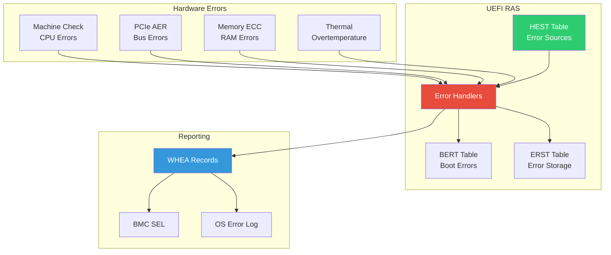

# Chapter 21: RAS Features
{: .fs-9 }

Reliability, Availability, and Serviceability - WHEA, APEI, and error handling.
{: .fs-6 .fw-300 }

---

## Overview

### RAS Architecture

RAS features ensure system reliability through error detection, logging, and recovery:



### APEI Tables

| Table | Full Name | Purpose |
|:------|:----------|:--------|
| **HEST** | Hardware Error Source Table | Describes error sources |
| **BERT** | Boot Error Record Table | Boot-time errors |
| **ERST** | Error Record Serialization Table | Persistent error storage |
| **EINJ** | Error Injection Table | Error injection for testing |

### Error Severity Levels

| Severity | Action | Example |
|:---------|:-------|:--------|
| **Corrected** | Log only | Single-bit ECC |
| **Recoverable** | OS handles | PCIe non-fatal |
| **Fatal** | System halt | Uncorrectable memory |
| **Informational** | Advisory | Predictive failure |

---

## Initialization

### HEST (Hardware Error Source Table)

```c
#include <IndustryStandard/Acpi62.h>

//
// HEST describes all hardware error sources in the system
//

#pragma pack(1)

typedef struct {
  EFI_ACPI_6_2_HARDWARE_ERROR_SOURCE_TABLE_HEADER  Header;
  // Error source structures follow
} MY_HEST_TABLE;

//
// Generic Hardware Error Source (GHES)
//
typedef struct {
  UINT16  Type;                       // 9 = Generic Hardware Error Source
  UINT16  SourceId;
  UINT16  RelatedSourceId;
  UINT8   Flags;
  UINT8   Enabled;
  UINT32  NumberOfRecordsToPreallocate;
  UINT32  MaxSectionsPerRecord;
  UINT32  MaxRawDataLength;
  EFI_ACPI_6_2_GENERIC_ADDRESS_STRUCTURE ErrorStatusAddress;
  EFI_ACPI_6_2_HARDWARE_ERROR_NOTIFICATION_STRUCTURE Notify;
  UINT32  ErrorStatusBlockLength;
} ACPI_HEST_GENERIC_HARDWARE_ERROR_SOURCE;

#pragma pack()

EFI_STATUS
BuildHestTable (
  OUT MY_HEST_TABLE  **Hest,
  OUT UINTN          *HestSize
  )
{
  MY_HEST_TABLE *Table;
  UINTN Size;
  ACPI_HEST_GENERIC_HARDWARE_ERROR_SOURCE *Ghes;

  //
  // Calculate size
  //
  Size = sizeof(EFI_ACPI_6_2_HARDWARE_ERROR_SOURCE_TABLE_HEADER) +
         sizeof(ACPI_HEST_GENERIC_HARDWARE_ERROR_SOURCE);

  Table = AllocateZeroPool(Size);
  if (Table == NULL) {
    return EFI_OUT_OF_RESOURCES;
  }

  //
  // Fill header
  //
  Table->Header.Header.Signature = EFI_ACPI_6_2_HARDWARE_ERROR_SOURCE_TABLE_SIGNATURE;
  Table->Header.Header.Length = (UINT32)Size;
  Table->Header.Header.Revision = EFI_ACPI_6_2_HARDWARE_ERROR_SOURCE_TABLE_REVISION;
  CopyMem(Table->Header.Header.OemId, "OEMID ", 6);
  Table->Header.Header.OemTableId = SIGNATURE_64('H','E','S','T','T','B','L',' ');
  Table->Header.ErrorSourceCount = 1;

  //
  // Add Generic Hardware Error Source
  //
  Ghes = (ACPI_HEST_GENERIC_HARDWARE_ERROR_SOURCE *)(&Table->Header + 1);
  Ghes->Type = EFI_ACPI_6_2_GENERIC_HARDWARE_ERROR;
  Ghes->SourceId = 0;
  Ghes->Enabled = 1;
  Ghes->NumberOfRecordsToPreallocate = 1;
  Ghes->MaxSectionsPerRecord = 1;

  //
  // Error status address (where firmware writes error info)
  //
  Ghes->ErrorStatusAddress.AddressSpaceId = EFI_ACPI_6_2_SYSTEM_MEMORY;
  Ghes->ErrorStatusAddress.RegisterBitWidth = 64;
  Ghes->ErrorStatusAddress.Address = AllocateErrorStatusBlock();

  //
  // Notification method
  //
  Ghes->Notify.Type = EFI_ACPI_6_2_HARDWARE_ERROR_NOTIFICATION_SCI;
  Ghes->Notify.Length = sizeof(EFI_ACPI_6_2_HARDWARE_ERROR_NOTIFICATION_STRUCTURE);

  //
  // Calculate checksum
  //
  Table->Header.Header.Checksum = CalculateChecksum((UINT8 *)Table, Size);

  *Hest = Table;
  *HestSize = Size;

  return EFI_SUCCESS;
}
```

### Error Handler Registration

```c
//
// Register platform error handler (typically in SMM)
//
typedef
EFI_STATUS
(EFIAPI *PLATFORM_ERROR_HANDLER)(
  IN UINT32  ErrorType,
  IN UINT64  ErrorAddress,
  IN VOID    *ErrorData,
  IN UINTN   ErrorDataSize
  );

PLATFORM_ERROR_HANDLER mErrorHandler;

EFI_STATUS
RegisterErrorHandler (
  IN PLATFORM_ERROR_HANDLER  Handler
  )
{
  mErrorHandler = Handler;
  return EFI_SUCCESS;
}

//
// Error handler implementation
//
EFI_STATUS
EFIAPI
PlatformErrorHandler (
  IN UINT32  ErrorType,
  IN UINT64  ErrorAddress,
  IN VOID    *ErrorData,
  IN UINTN   ErrorDataSize
  )
{
  //
  // 1. Log error to persistent storage (ERST)
  //
  LogErrorToErst(ErrorType, ErrorAddress, ErrorData, ErrorDataSize);

  //
  // 2. Send error to BMC (if available)
  //
  ReportErrorToBmc(ErrorType, ErrorAddress);

  //
  // 3. Create WHEA error record
  //
  CreateWheaRecord(ErrorType, ErrorAddress, ErrorData, ErrorDataSize);

  //
  // 4. Determine recovery action
  //
  if (ErrorType == ERROR_TYPE_FATAL) {
    //
    // Fatal error - system halt required
    //
    return EFI_DEVICE_ERROR;
  }

  //
  // Correctable/recoverable - continue
  //
  return EFI_SUCCESS;
}
```

---

## Configuration

### BERT (Boot Error Record Table)

```c
//
// BERT reports errors that occurred during boot
//

#pragma pack(1)

typedef struct {
  EFI_ACPI_6_2_BOOT_ERROR_RECORD_TABLE_HEADER  Header;
} MY_BERT_TABLE;

typedef struct {
  UINT32  BlockStatus;
  UINT32  RawDataOffset;
  UINT32  RawDataLength;
  UINT32  DataLength;
  UINT32  ErrorSeverity;
  // Generic Error Data Entry follows
} BOOT_ERROR_REGION;

#pragma pack()

EFI_STATUS
CreateBootErrorRecord (
  IN UINT32  ErrorType,
  IN UINT8   *ErrorData,
  IN UINTN   ErrorDataSize
  )
{
  BOOT_ERROR_REGION *ErrorRegion;
  EFI_ACPI_6_2_GENERIC_ERROR_DATA_ENTRY_STRUCTURE *DataEntry;

  //
  // Allocate boot error region
  //
  ErrorRegion = AllocateReservedPool(
                  sizeof(BOOT_ERROR_REGION) +
                  sizeof(EFI_ACPI_6_2_GENERIC_ERROR_DATA_ENTRY_STRUCTURE) +
                  ErrorDataSize
                );

  if (ErrorRegion == NULL) {
    return EFI_OUT_OF_RESOURCES;
  }

  //
  // Fill error region
  //
  ErrorRegion->BlockStatus = 1;  // Uncorrectable error present
  ErrorRegion->ErrorSeverity = EFI_ACPI_6_2_ERROR_SEVERITY_FATAL;
  ErrorRegion->DataLength = sizeof(EFI_ACPI_6_2_GENERIC_ERROR_DATA_ENTRY_STRUCTURE) +
                            ErrorDataSize;

  //
  // Fill data entry
  //
  DataEntry = (EFI_ACPI_6_2_GENERIC_ERROR_DATA_ENTRY_STRUCTURE *)(ErrorRegion + 1);
  // Set SectionType GUID based on error type
  DataEntry->ErrorDataLength = (UINT32)ErrorDataSize;
  DataEntry->ErrorSeverity = EFI_ACPI_6_2_ERROR_SEVERITY_FATAL;

  //
  // Copy error data
  //
  CopyMem(DataEntry + 1, ErrorData, ErrorDataSize);

  //
  // Update BERT table pointer
  //
  UpdateBertTable(ErrorRegion);

  return EFI_SUCCESS;
}
```

### ERST (Error Record Serialization Table)

```c
//
// ERST provides persistent storage for error records
//

//
// ERST Actions
//
#define ERST_BEGIN_WRITE_OPERATION        0x00
#define ERST_BEGIN_READ_OPERATION         0x01
#define ERST_BEGIN_CLEAR_OPERATION        0x02
#define ERST_END_OPERATION                0x03
#define ERST_SET_RECORD_OFFSET            0x04
#define ERST_EXECUTE_OPERATION            0x05
#define ERST_CHECK_BUSY_STATUS            0x06
#define ERST_GET_COMMAND_STATUS           0x07
#define ERST_GET_RECORD_IDENTIFIER        0x08
#define ERST_SET_RECORD_IDENTIFIER        0x09
#define ERST_GET_RECORD_COUNT             0x0A
#define ERST_BEGIN_DUMMY_WRITE            0x0B
#define ERST_GET_ERROR_LOG_ADDRESS_RANGE  0x0D
#define ERST_GET_ERROR_LOG_ADDRESS_LENGTH 0x0E
#define ERST_GET_ERROR_LOG_ADDRESS_ATTR   0x0F
#define ERST_EXECUTE_TIMINGS              0x10

//
// ERST serialization entry
//
typedef struct {
  UINT8   SerializationAction;
  UINT8   Instruction;
  UINT8   Flags;
  UINT8   Reserved;
  EFI_ACPI_6_2_GENERIC_ADDRESS_STRUCTURE RegisterRegion;
  UINT64  Value;
  UINT64  Mask;
} ACPI_ERST_SERIALIZATION_INSTRUCTION_ENTRY;

EFI_STATUS
PersistErrorRecord (
  IN UINT64  RecordId,
  IN VOID    *ErrorRecord,
  IN UINTN   RecordSize
  )
{
  //
  // Implementation uses ERST actions:
  // 1. BEGIN_WRITE_OPERATION
  // 2. SET_RECORD_IDENTIFIER
  // 3. Write data to error log address range
  // 4. EXECUTE_OPERATION
  // 5. CHECK_BUSY_STATUS until complete
  // 6. GET_COMMAND_STATUS to verify success
  // 7. END_OPERATION
  //

  return EFI_SUCCESS;
}
```

### EINJ (Error Injection)

```c
//
// EINJ enables error injection for RAS testing
//

//
// EINJ Actions
//
#define EINJ_BEGIN_INJECTION_OPERATION  0x00
#define EINJ_GET_TRIGGER_ERROR_ACTION   0x01
#define EINJ_SET_ERROR_TYPE             0x02
#define EINJ_GET_ERROR_TYPE             0x03
#define EINJ_END_OPERATION              0x04
#define EINJ_EXECUTE_OPERATION          0x05
#define EINJ_CHECK_BUSY_STATUS          0x06
#define EINJ_GET_COMMAND_STATUS         0x07
#define EINJ_SET_ERROR_TYPE_WITH_ADDR   0x08

//
// Error types for injection
//
#define EINJ_ERROR_PROCESSOR_CORRECTABLE         0x00000001
#define EINJ_ERROR_PROCESSOR_UNCORRECTABLE       0x00000002
#define EINJ_ERROR_PROCESSOR_FATAL               0x00000004
#define EINJ_ERROR_MEMORY_CORRECTABLE            0x00000008
#define EINJ_ERROR_MEMORY_UNCORRECTABLE          0x00000010
#define EINJ_ERROR_MEMORY_FATAL                  0x00000020
#define EINJ_ERROR_PCIE_CORRECTABLE              0x00000040
#define EINJ_ERROR_PCIE_UNCORRECTABLE            0x00000080
#define EINJ_ERROR_PCIE_FATAL                    0x00000100
#define EINJ_ERROR_PLATFORM_CORRECTABLE          0x00000200
#define EINJ_ERROR_PLATFORM_UNCORRECTABLE        0x00000400
#define EINJ_ERROR_PLATFORM_FATAL                0x00000800

EFI_STATUS
InjectError (
  IN UINT32  ErrorType,
  IN UINT64  Address  OPTIONAL
  )
{
  //
  // Error injection process:
  // 1. BEGIN_INJECTION_OPERATION
  // 2. SET_ERROR_TYPE or SET_ERROR_TYPE_WITH_ADDR
  // 3. EXECUTE_OPERATION
  // 4. GET_TRIGGER_ERROR_ACTION (if needed)
  // 5. Execute trigger action
  // 6. END_OPERATION
  //

  DEBUG((DEBUG_INFO, "Injecting error type 0x%x at 0x%lx\n", ErrorType, Address));

  return EFI_SUCCESS;
}
```

---

## Porting Guide

### Platform RAS Configuration

```ini
#
# Platform DSC file - RAS configuration
#

[PcdsFixedAtBuild]
  # Enable WHEA support
  gEfiMdeModulePkgTokenSpaceGuid.PcdWheaSupport|TRUE

  # Error log size
  gPlatformPkgTokenSpaceGuid.PcdErrorLogSize|0x10000

  # Enable error injection (debug only)
  gPlatformPkgTokenSpaceGuid.PcdEnableEinj|TRUE

[Components]
  # RAS infrastructure
  $(PLATFORM_PKG)/Ras/WheaDxe/WheaDxe.inf
  $(PLATFORM_PKG)/Ras/HestDxe/HestDxe.inf
  $(PLATFORM_PKG)/Ras/BertDxe/BertDxe.inf
  $(PLATFORM_PKG)/Ras/ErstDxe/ErstDxe.inf

  # SMM error handler
  $(PLATFORM_PKG)/Ras/RasSmm/RasSmm.inf
```

### MCA (Machine Check Architecture)

```c
//
// Machine Check Architecture error handling
//

#include <Register/Intel/Msr.h>

//
// Read Machine Check Bank registers
//
EFI_STATUS
ReadMcaBanks (
  VOID
  )
{
  UINT32 McaBankCount;
  UINT32 Bank;
  UINT64 McgCap;
  UINT64 McStatus;
  UINT64 McAddr;
  UINT64 McMisc;

  //
  // Get number of MCA banks
  //
  McgCap = AsmReadMsr64(MSR_IA32_MCG_CAP);
  McaBankCount = (UINT32)(McgCap & 0xFF);

  DEBUG((DEBUG_INFO, "MCA Banks: %d\n", McaBankCount));

  for (Bank = 0; Bank < McaBankCount; Bank++) {
    McStatus = AsmReadMsr64(MSR_IA32_MC0_STATUS + Bank * 4);

    if (McStatus & BIT63) {  // Valid bit
      McAddr = AsmReadMsr64(MSR_IA32_MC0_ADDR + Bank * 4);
      McMisc = AsmReadMsr64(MSR_IA32_MC0_MISC + Bank * 4);

      DEBUG((DEBUG_ERROR, "MCA Bank %d Error:\n", Bank));
      DEBUG((DEBUG_ERROR, "  Status: 0x%016lx\n", McStatus));
      DEBUG((DEBUG_ERROR, "  Address: 0x%016lx\n", McAddr));
      DEBUG((DEBUG_ERROR, "  Misc: 0x%016lx\n", McMisc));

      //
      // Process error based on MCA bank type
      //
      ProcessMcaError(Bank, McStatus, McAddr, McMisc);

      //
      // Clear error (write 0 to status)
      //
      AsmWriteMsr64(MSR_IA32_MC0_STATUS + Bank * 4, 0);
    }
  }

  return EFI_SUCCESS;
}
```

### PCIe AER (Advanced Error Reporting)

```c
//
// PCIe Advanced Error Reporting
//

#include <IndustryStandard/PciExpress31.h>

EFI_STATUS
HandlePcieAerError (
  IN UINT8  Bus,
  IN UINT8  Device,
  IN UINT8  Function
  )
{
  UINT32 UncorrectableStatus;
  UINT32 CorrectableStatus;
  PCI_EXPRESS_EXTENDED_CAPABILITIES_ADVANCED_ERROR_REPORTING *Aer;

  //
  // Find AER capability
  //
  Aer = FindPcieCapability(Bus, Device, Function,
                           PCI_EXPRESS_EXTENDED_CAPABILITY_ADVANCED_ERROR_REPORTING_ID);

  if (Aer == NULL) {
    return EFI_NOT_FOUND;
  }

  //
  // Read error status
  //
  UncorrectableStatus = Aer->UncorrectableErrorStatus;
  CorrectableStatus = Aer->CorrectableErrorStatus;

  if (UncorrectableStatus != 0) {
    DEBUG((DEBUG_ERROR, "PCIe Uncorrectable Error on %02x:%02x.%x: 0x%08x\n",
      Bus, Device, Function, UncorrectableStatus));

    //
    // Log error
    //
    LogPcieError(Bus, Device, Function, UncorrectableStatus, FALSE);

    //
    // Clear status
    //
    Aer->UncorrectableErrorStatus = UncorrectableStatus;
  }

  if (CorrectableStatus != 0) {
    DEBUG((DEBUG_INFO, "PCIe Correctable Error on %02x:%02x.%x: 0x%08x\n",
      Bus, Device, Function, CorrectableStatus));

    LogPcieError(Bus, Device, Function, CorrectableStatus, TRUE);
    Aer->CorrectableErrorStatus = CorrectableStatus;
  }

  return EFI_SUCCESS;
}
```

---

## WHEA Error Records

### Creating WHEA Records

```c
//
// WHEA (Windows Hardware Error Architecture) compatible error records
//

#include <Guid/Cper.h>

EFI_STATUS
CreateWheaRecord (
  IN UINT32                ErrorType,
  IN UINT64                ErrorAddress,
  IN VOID                  *ErrorData,
  IN UINTN                 ErrorDataSize
  )
{
  EFI_COMMON_ERROR_RECORD_HEADER *CperHeader;
  EFI_ERROR_SECTION_DESCRIPTOR *SectionDesc;
  VOID *SectionData;
  UINTN RecordSize;

  //
  // Calculate record size
  //
  RecordSize = sizeof(EFI_COMMON_ERROR_RECORD_HEADER) +
               sizeof(EFI_ERROR_SECTION_DESCRIPTOR) +
               ErrorDataSize;

  CperHeader = AllocateZeroPool(RecordSize);
  if (CperHeader == NULL) {
    return EFI_OUT_OF_RESOURCES;
  }

  //
  // Fill CPER header
  //
  CperHeader->SignatureStart = EFI_ERROR_RECORD_SIGNATURE_START;
  CperHeader->Revision = EFI_ERROR_RECORD_REVISION;
  CperHeader->SignatureEnd = EFI_ERROR_RECORD_SIGNATURE_END;
  CperHeader->SectionCount = 1;
  CperHeader->ErrorSeverity = GetErrorSeverity(ErrorType);
  CperHeader->ValidationBits = 0;
  CperHeader->RecordLength = (UINT32)RecordSize;

  //
  // Generate unique record ID
  //
  CperHeader->RecordID = GenerateRecordId();

  //
  // Get current time
  //
  GetTime(&CperHeader->TimeStamp);

  //
  // Fill section descriptor
  //
  SectionDesc = (EFI_ERROR_SECTION_DESCRIPTOR *)(CperHeader + 1);
  SectionDesc->SectionOffset = sizeof(EFI_COMMON_ERROR_RECORD_HEADER) +
                               sizeof(EFI_ERROR_SECTION_DESCRIPTOR);
  SectionDesc->SectionLength = (UINT32)ErrorDataSize;
  SectionDesc->Revision = EFI_ERROR_SECTION_REVISION;
  SectionDesc->SectionFlags = 0;

  //
  // Set section type based on error
  //
  switch (ErrorType) {
    case ERROR_TYPE_MEMORY:
      CopyGuid(&SectionDesc->SectionType, &gEfiPlatformMemoryErrorSectionGuid);
      break;
    case ERROR_TYPE_PCIE:
      CopyGuid(&SectionDesc->SectionType, &gEfiPcieErrorSectionGuid);
      break;
    case ERROR_TYPE_PROCESSOR:
      CopyGuid(&SectionDesc->SectionType, &gEfiProcessorGenericErrorSectionGuid);
      break;
    default:
      CopyGuid(&SectionDesc->SectionType, &gEfiFirmwareErrorSectionGuid);
  }

  //
  // Copy section data
  //
  SectionData = (VOID *)((UINT8 *)CperHeader + SectionDesc->SectionOffset);
  CopyMem(SectionData, ErrorData, ErrorDataSize);

  //
  // Persist record
  //
  PersistErrorRecord(CperHeader->RecordID, CperHeader, RecordSize);

  FreePool(CperHeader);

  return EFI_SUCCESS;
}
```

---

## Example: RAS Status Display

```c
/** @file
  RAS Status Display
**/

#include <Uefi.h>
#include <Library/UefiLib.h>
#include <Library/UefiBootServicesTableLib.h>
#include <IndustryStandard/Acpi62.h>

EFI_STATUS
EFIAPI
UefiMain (
  IN EFI_HANDLE        ImageHandle,
  IN EFI_SYSTEM_TABLE  *SystemTable
  )
{
  EFI_STATUS Status;
  VOID *Table;
  EFI_ACPI_6_2_ROOT_SYSTEM_DESCRIPTION_POINTER *Rsdp;

  Print(L"=== RAS Configuration ===\n\n");

  //
  // Find ACPI tables
  //
  Status = EfiGetSystemConfigurationTable(&gEfiAcpi20TableGuid, (VOID **)&Rsdp);
  if (EFI_ERROR(Status)) {
    Print(L"ACPI tables not found\n");
    return Status;
  }

  //
  // Check for HEST
  //
  Status = FindAcpiTable(EFI_ACPI_6_2_HARDWARE_ERROR_SOURCE_TABLE_SIGNATURE, &Table);
  if (!EFI_ERROR(Status)) {
    EFI_ACPI_6_2_HARDWARE_ERROR_SOURCE_TABLE_HEADER *Hest = Table;
    Print(L"HEST (Hardware Error Sources):\n");
    Print(L"  Error Source Count: %d\n", Hest->ErrorSourceCount);
    Print(L"  Table Length: %d bytes\n\n", Hest->Header.Length);
  } else {
    Print(L"HEST: Not present\n\n");
  }

  //
  // Check for BERT
  //
  Status = FindAcpiTable(EFI_ACPI_6_2_BOOT_ERROR_RECORD_TABLE_SIGNATURE, &Table);
  if (!EFI_ERROR(Status)) {
    EFI_ACPI_6_2_BOOT_ERROR_RECORD_TABLE_HEADER *Bert = Table;
    Print(L"BERT (Boot Error Record):\n");
    Print(L"  Error Region Length: %d bytes\n", Bert->BootErrorRegionLength);
    Print(L"  Error Region: 0x%016lx\n\n", Bert->BootErrorRegion);
  } else {
    Print(L"BERT: Not present (no boot errors)\n\n");
  }

  //
  // Check for ERST
  //
  Status = FindAcpiTable(EFI_ACPI_6_2_ERROR_RECORD_SERIALIZATION_TABLE_SIGNATURE, &Table);
  if (!EFI_ERROR(Status)) {
    EFI_ACPI_6_2_ERROR_RECORD_SERIALIZATION_TABLE_HEADER *Erst = Table;
    Print(L"ERST (Error Serialization):\n");
    Print(L"  Serialization Header Length: %d\n", Erst->SerializationHeaderLength);
    Print(L"  Instruction Entry Count: %d\n\n", Erst->InstructionEntryCount);
  } else {
    Print(L"ERST: Not present\n\n");
  }

  //
  // Check for EINJ
  //
  Status = FindAcpiTable(EFI_ACPI_6_2_ERROR_INJECTION_TABLE_SIGNATURE, &Table);
  if (!EFI_ERROR(Status)) {
    Print(L"EINJ (Error Injection): Present\n");
    Print(L"  (Error injection available for testing)\n\n");
  } else {
    Print(L"EINJ: Not present\n\n");
  }

  Print(L"Press any key to exit...\n");
  {
    EFI_INPUT_KEY Key;
    UINTN Index;
    gBS->WaitForEvent(1, &gST->ConIn->WaitForKey, &Index);
    gST->ConIn->ReadKeyStroke(gST->ConIn, &Key);
  }

  return EFI_SUCCESS;
}
```

---

## Specification Reference

- **ACPI 6.4 Specification**: Chapter 18 - APEI
- **UEFI Specification**: Platform Error Handling
- **WHEA Specification**: Windows Hardware Error Architecture

---

## Summary

1. **HEST** describes hardware error sources
2. **BERT** captures boot-time errors
3. **ERST** provides persistent error storage
4. **EINJ** enables error injection testing
5. **MCA/AER** handle CPU and PCIe errors
6. **WHEA records** standardize error reporting

---

## Next Steps

- [Chapter 22: eSPI Interface](22-espi.html) - Enhanced SPI
- [Chapter 23: ARM UEFI](23-arm-uefi/) - ARM development

---

{: .note }
> **Server Focus:** RAS features are primarily for server and enterprise platforms where reliability is critical.
