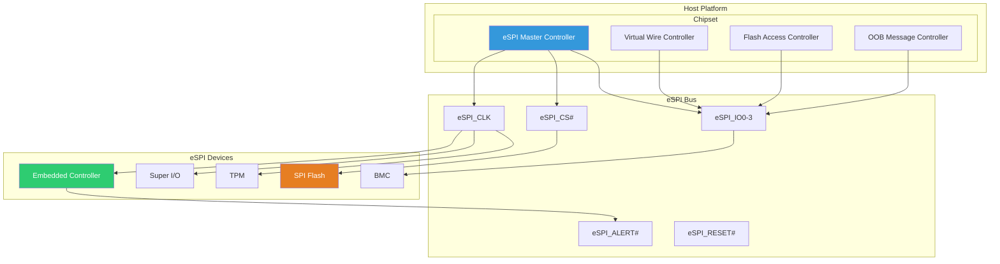

# Chapter 22: eSPI Interface
{: .fs-9 }

Enhanced Serial Peripheral Interface for EC, flash, and BMC communication.
{: .fs-6 .fw-300 }

---

## Overview

### When to Use eSPI Interface

{: .important }
> **Use eSPI when you need to:**
> - Communicate with Embedded Controller (EC) on modern Intel platforms
> - Access SPI flash through the chipset
> - Handle virtual wire interrupts and platform signals
> - Support TPM, Super I/O, or BMC over eSPI

| Scenario | eSPI Channel | Purpose |
|:---------|:-------------|:--------|
| **EC keyboard/battery** | Peripheral | Legacy LPC-like I/O |
| **Platform signals** | Virtual Wire | Power states, interrupts |
| **BIOS flash access** | Flash | Read/write firmware |
| **BMC communication** | OOB | Out-of-band messages |
| **TPM commands** | Peripheral | TPM 2.0 interface |

**eSPI vs LPC Comparison:**

| Factor | eSPI | LPC |
|:-------|:-----|:----|
| **Speed** | Up to 66 MHz | 33 MHz max |
| **Pins** | Fewer (shared) | More dedicated |
| **Power** | Lower | Higher |
| **Modern Intel** | Required | Deprecated |
| **Channels** | 4 (multiplexed) | Separate buses |

**Who Works with eSPI:**

| Role | eSPI Tasks |
|:-----|:-----------|
| **Platform developer** | EC driver, flash access configuration |
| **EC firmware developer** | eSPI slave implementation |
| **Silicon vendor** | eSPI controller, Virtual Wire mapping |
| **Security engineer** | Flash protection, authenticated access |

**eSPI Channels:**
- **Peripheral**: LPC-compatible I/O and memory cycles
- **Virtual Wire**: Sideband signals (IRQ, power states)
- **Flash**: Direct flash read/write (MAFS/SAF modes)
- **OOB (Out-of-Band)**: SMBus-like tunneled messages

**Platform Considerations:**
- Intel 100-series and later require eSPI
- AMD platforms may use LPC or eSPI
- EC must support eSPI for modern laptops
- Flash channel mode affects boot security

### eSPI Architecture

eSPI (Enhanced SPI) replaces LPC for connecting peripherals to the chipset:



### eSPI vs LPC Comparison

| Feature | eSPI | LPC |
|:--------|:-----|:----|
| **Speed** | Up to 66 MHz | 33 MHz max |
| **Data Width** | 1/2/4-bit | 4-bit |
| **Signals** | ~7 | ~13 |
| **Power** | Lower | Higher |
| **Flash Access** | Native support | Requires FWH |
| **Virtual Wires** | Yes | No (uses GPIO) |

### eSPI Channels

| Channel | Purpose | Use Case |
|:--------|:--------|:---------|
| **Peripheral** | I/O and memory cycles | EC, Super I/O access |
| **Virtual Wire** | Sideband signals | Interrupts, power signals |
| **OOB (Out-of-Band)** | SMBus tunneling | BMC communication |
| **Flash Access** | SPI flash read/write | Boot flash, BIOS updates |

---

## Initialization

### eSPI Controller Setup

```c
#include <IndustryStandard/Espi.h>
#include <Register/PchRegs.h>

//
// eSPI controller registers (Intel PCH example)
//
#define R_ESPI_CFG_PCBC           0x00  // Peripheral Channel Configuration
#define R_ESPI_CFG_VWCFG          0x04  // Virtual Wire Configuration
#define R_ESPI_CFG_OOBCFG         0x08  // OOB Channel Configuration
#define R_ESPI_CFG_FLASHCFG       0x0C  // Flash Channel Configuration
#define R_ESPI_CFG_GENCFG         0x10  // General Configuration

EFI_STATUS
InitializeEspiController (
  IN UINTN  EspiBase
  )
{
  UINT32 Value;

  //
  // Check eSPI slave presence
  //
  Value = MmioRead32(EspiBase + R_ESPI_CFG_GENCFG);
  if ((Value & B_ESPI_SLAVE_PRESENT) == 0) {
    DEBUG((DEBUG_WARN, "No eSPI slave detected\n"));
    return EFI_NOT_FOUND;
  }

  //
  // Configure eSPI frequency
  // Bits [27:25] = Operating frequency
  // 000b = 20 MHz, 001b = 25 MHz, 010b = 33 MHz
  // 011b = 50 MHz, 100b = 66 MHz
  //
  Value = MmioRead32(EspiBase + R_ESPI_CFG_GENCFG);
  Value &= ~(BIT27 | BIT26 | BIT25);
  Value |= (0x2 << 25);  // 33 MHz
  MmioWrite32(EspiBase + R_ESPI_CFG_GENCFG, Value);

  //
  // Configure I/O mode
  // Bits [29:28] = I/O mode (00b=1-bit, 01b=2-bit, 10b=4-bit)
  //
  Value = MmioRead32(EspiBase + R_ESPI_CFG_GENCFG);
  Value &= ~(BIT29 | BIT28);
  Value |= (0x2 << 28);  // Quad I/O
  MmioWrite32(EspiBase + R_ESPI_CFG_GENCFG, Value);

  DEBUG((DEBUG_INFO, "eSPI Controller initialized\n"));

  return EFI_SUCCESS;
}
```

### Peripheral Channel Configuration

```c
//
// Configure eSPI peripheral channel for EC/Super I/O access
//
EFI_STATUS
ConfigurePeripheralChannel (
  IN UINTN  EspiBase
  )
{
  UINT32 Value;

  //
  // Enable peripheral channel
  //
  Value = MmioRead32(EspiBase + R_ESPI_CFG_PCBC);
  Value |= B_ESPI_PC_ENABLE;
  MmioWrite32(EspiBase + R_ESPI_CFG_PCBC, Value);

  //
  // Configure decode ranges for EC
  // Example: Enable decode for 62h/66h (EC command/data ports)
  //
  ConfigureIoDecodeRange(EspiBase, 0x62, 0x66);

  //
  // Enable memory decode if needed
  //
  ConfigureMemoryDecodeRange(EspiBase, EC_MEMORY_BASE, EC_MEMORY_SIZE);

  return EFI_SUCCESS;
}

VOID
ConfigureIoDecodeRange (
  IN UINTN   EspiBase,
  IN UINT16  BaseAddress,
  IN UINT16  EndAddress
  )
{
  //
  // Platform-specific I/O decode configuration
  // Enables eSPI peripheral channel to handle I/O cycles
  // in the specified range
  //
}
```

---

## Configuration

### Virtual Wire Channel

```c
//
// Virtual Wires replace LPC sideband signals
//
// System Virtual Wires (defined by spec):
// - IRQ interrupts (IRQ1-14)
// - SLP_S3#, SLP_S4#, SLP_S5# (sleep states)
// - SUS_STAT#, PLTRST#, OOB_RST_WARN
// - SUS_ACK, HOST_RST_ACK, OOB_RST_ACK
// - WAKE#, PME#, SCI#, SMI#
//
// Platform Virtual Wires (OEM defined):
// - GPIO states, custom signals
//

#define VW_INDEX_IRQ           0x00  // IRQ[7:0]
#define VW_INDEX_SLP_S3        0x02  // Sleep states
#define VW_INDEX_SUS_STAT      0x03  // Suspend status
#define VW_INDEX_PME           0x05  // Power management events
#define VW_INDEX_PLATFORM      0x40  // Platform-specific start

//
// Read virtual wire state
//
EFI_STATUS
ReadVirtualWire (
  IN  UINTN   EspiBase,
  IN  UINT8   VwIndex,
  OUT UINT8   *VwState
  )
{
  UINT32 Value;

  //
  // Read from Virtual Wire status register
  //
  Value = MmioRead32(EspiBase + R_ESPI_VW_STATUS + (VwIndex / 4) * 4);
  *VwState = (UINT8)((Value >> ((VwIndex % 4) * 8)) & 0xFF);

  return EFI_SUCCESS;
}

//
// Write virtual wire (host to slave)
//
EFI_STATUS
WriteVirtualWire (
  IN UINTN  EspiBase,
  IN UINT8  VwIndex,
  IN UINT8  VwState
  )
{
  UINT32 Value;
  UINT32 Offset;

  Offset = R_ESPI_VW_CONTROL + (VwIndex / 4) * 4;

  Value = MmioRead32(EspiBase + Offset);
  Value &= ~(0xFF << ((VwIndex % 4) * 8));
  Value |= ((UINT32)VwState << ((VwIndex % 4) * 8));
  MmioWrite32(EspiBase + Offset, Value);

  return EFI_SUCCESS;
}

//
// Example: Signal SLP_S3# assertion
//
EFI_STATUS
SignalSleepState (
  IN UINTN   EspiBase,
  IN UINT8   SleepState  // 3 = S3, 4 = S4, 5 = S5
  )
{
  UINT8 VwState;

  //
  // VW[2] contains SLP_S3#, SLP_S4#, SLP_S5#
  // Bit 0 = SLP_S3#, Bit 1 = SLP_S4#, Bit 2 = SLP_S5#
  // 0 = Asserted (entering sleep), 1 = Deasserted
  //

  ReadVirtualWire(EspiBase, VW_INDEX_SLP_S3, &VwState);

  switch (SleepState) {
    case 3:
      VwState &= ~BIT0;  // Assert SLP_S3#
      break;
    case 4:
      VwState &= ~BIT1;  // Assert SLP_S4#
      break;
    case 5:
      VwState &= ~BIT2;  // Assert SLP_S5#
      break;
  }

  return WriteVirtualWire(EspiBase, VW_INDEX_SLP_S3, VwState);
}
```

### Flash Access Channel

```c
//
// eSPI Flash Access modes:
// - MAFS (Master Attached Flash Sharing)
// - SAF (Slave Attached Flash)
//

//
// MAFS: Flash connected to PCH, shared with EC
//
EFI_STATUS
ConfigureMafsMode (
  IN UINTN  EspiBase
  )
{
  UINT32 Value;

  //
  // Enable Flash Access channel
  //
  Value = MmioRead32(EspiBase + R_ESPI_CFG_FLASHCFG);
  Value |= B_ESPI_FLASH_ENABLE;

  //
  // Set MAFS mode
  //
  Value &= ~B_ESPI_FLASH_SAF_MODE;

  //
  // Configure flash access size and erase block size
  //
  Value &= ~(0xF << 8);
  Value |= (0x3 << 8);  // 4KB erase block

  MmioWrite32(EspiBase + R_ESPI_CFG_FLASHCFG, Value);

  return EFI_SUCCESS;
}

//
// SAF: Flash connected to eSPI slave (EC)
//
EFI_STATUS
ConfigureSafMode (
  IN UINTN  EspiBase,
  IN UINT32 FlashBaseAddress,
  IN UINT32 FlashSize
  )
{
  UINT32 Value;

  //
  // Enable SAF mode
  //
  Value = MmioRead32(EspiBase + R_ESPI_CFG_FLASHCFG);
  Value |= B_ESPI_FLASH_ENABLE | B_ESPI_FLASH_SAF_MODE;
  MmioWrite32(EspiBase + R_ESPI_CFG_FLASHCFG, Value);

  //
  // Configure SAF protection ranges
  //
  ConfigureSafProtection(EspiBase, FlashBaseAddress, FlashSize);

  return EFI_SUCCESS;
}
```

### OOB (Out-of-Band) Channel

```c
//
// OOB channel for BMC/ME communication
// Tunnels SMBus messages over eSPI
//

typedef struct {
  UINT8   CycleType;      // SMBus command type
  UINT8   Tag;            // Transaction tag
  UINT8   Length;         // Data length
  UINT8   SlaveAddress;   // Target SMBus address
  UINT8   Command;        // SMBus command code
  UINT8   Data[32];       // Data payload
} ESPI_OOB_MESSAGE;

EFI_STATUS
SendOobMessage (
  IN UINTN            EspiBase,
  IN ESPI_OOB_MESSAGE *Message
  )
{
  UINT32 Value;

  //
  // Check if OOB channel is enabled
  //
  Value = MmioRead32(EspiBase + R_ESPI_CFG_OOBCFG);
  if ((Value & B_ESPI_OOB_ENABLE) == 0) {
    return EFI_NOT_READY;
  }

  //
  // Wait for OOB buffer available
  //
  while (MmioRead32(EspiBase + R_ESPI_OOB_STATUS) & B_ESPI_OOB_BUSY) {
    //
    // Timeout handling...
    //
  }

  //
  // Write message to OOB buffer
  //
  for (UINTN i = 0; i < sizeof(ESPI_OOB_MESSAGE); i += 4) {
    MmioWrite32(EspiBase + R_ESPI_OOB_BUFFER + i,
                *(UINT32 *)((UINT8 *)Message + i));
  }

  //
  // Trigger transmission
  //
  MmioWrite32(EspiBase + R_ESPI_OOB_CONTROL, B_ESPI_OOB_START);

  return EFI_SUCCESS;
}
```

---

## Porting Guide

### Platform eSPI Configuration

```ini
#
# Platform DSC file - eSPI configuration
#

[PcdsFixedAtBuild]
  # eSPI controller base address
  gPlatformPkgTokenSpaceGuid.PcdEspiBaseAddress|0xFE010000

  # eSPI frequency (MHz)
  gPlatformPkgTokenSpaceGuid.PcdEspiFrequency|33

  # I/O mode (1, 2, or 4)
  gPlatformPkgTokenSpaceGuid.PcdEspiIoMode|4

  # Enable channels
  gPlatformPkgTokenSpaceGuid.PcdEspiPeripheralChannelEnable|TRUE
  gPlatformPkgTokenSpaceGuid.PcdEspiVirtualWireChannelEnable|TRUE
  gPlatformPkgTokenSpaceGuid.PcdEspiOobChannelEnable|TRUE
  gPlatformPkgTokenSpaceGuid.PcdEspiFlashChannelEnable|TRUE

  # Flash access mode (0=MAFS, 1=SAF)
  gPlatformPkgTokenSpaceGuid.PcdEspiFlashAccessMode|0

[Components]
  # eSPI drivers
  $(PLATFORM_PKG)/Espi/EspiDxe/EspiDxe.inf
  $(PLATFORM_PKG)/Espi/EspiSmm/EspiSmm.inf
```

### EC Communication

```c
//
// Embedded Controller communication over eSPI
//
// Standard ACPI EC interface (ports 62h/66h)
//

#define EC_DATA_PORT    0x62
#define EC_CMD_PORT     0x66

#define EC_SC_IBF       0x02  // Input Buffer Full
#define EC_SC_OBF       0x01  // Output Buffer Full

EFI_STATUS
EcWaitInputBufferEmpty (
  VOID
  )
{
  UINTN Timeout = 100000;

  while (Timeout > 0) {
    if ((IoRead8(EC_CMD_PORT) & EC_SC_IBF) == 0) {
      return EFI_SUCCESS;
    }
    gBS->Stall(10);
    Timeout -= 10;
  }

  return EFI_TIMEOUT;
}

EFI_STATUS
EcWaitOutputBufferFull (
  VOID
  )
{
  UINTN Timeout = 100000;

  while (Timeout > 0) {
    if ((IoRead8(EC_CMD_PORT) & EC_SC_OBF) != 0) {
      return EFI_SUCCESS;
    }
    gBS->Stall(10);
    Timeout -= 10;
  }

  return EFI_TIMEOUT;
}

EFI_STATUS
EcReadByte (
  IN  UINT8  Address,
  OUT UINT8  *Data
  )
{
  EFI_STATUS Status;

  //
  // Send read command
  //
  Status = EcWaitInputBufferEmpty();
  if (EFI_ERROR(Status)) return Status;

  IoWrite8(EC_CMD_PORT, 0x80);  // Read Embedded Controller

  //
  // Send address
  //
  Status = EcWaitInputBufferEmpty();
  if (EFI_ERROR(Status)) return Status;

  IoWrite8(EC_DATA_PORT, Address);

  //
  // Read data
  //
  Status = EcWaitOutputBufferFull();
  if (EFI_ERROR(Status)) return Status;

  *Data = IoRead8(EC_DATA_PORT);

  return EFI_SUCCESS;
}

EFI_STATUS
EcWriteByte (
  IN UINT8  Address,
  IN UINT8  Data
  )
{
  EFI_STATUS Status;

  //
  // Send write command
  //
  Status = EcWaitInputBufferEmpty();
  if (EFI_ERROR(Status)) return Status;

  IoWrite8(EC_CMD_PORT, 0x81);  // Write Embedded Controller

  //
  // Send address
  //
  Status = EcWaitInputBufferEmpty();
  if (EFI_ERROR(Status)) return Status;

  IoWrite8(EC_DATA_PORT, Address);

  //
  // Send data
  //
  Status = EcWaitInputBufferEmpty();
  if (EFI_ERROR(Status)) return Status;

  IoWrite8(EC_DATA_PORT, Data);

  return EFI_SUCCESS;
}
```

### Boot Impact

```c
//
// eSPI affects boot timing and initialization
//

EFI_STATUS
EspiBootSequence (
  VOID
  )
{
  //
  // 1. Wait for eSPI slave (EC) ready
  //    EC must complete its initialization before host
  //    Virtual Wire: SLAVE_BOOT_LOAD_DONE
  //
  WaitForSlaveReady();

  //
  // 2. Configure eSPI channels based on slave capabilities
  //    Read slave configuration from device
  //
  GetSlaveConfiguration();

  //
  // 3. Enable flash access (if MAFS/SAF)
  //    Required before reading BIOS from flash
  //
  EnableFlashAccess();

  //
  // 4. Set up Virtual Wires for runtime operation
  //    Configure interrupt routing, power signals
  //
  ConfigureVirtualWires();

  //
  // 5. Signal host boot complete
  //    Virtual Wire: HOST_RST_ACK
  //
  SignalHostReady();

  return EFI_SUCCESS;
}

EFI_STATUS
WaitForSlaveReady (
  VOID
  )
{
  UINT8 VwState;
  UINTN Timeout = 5000000;  // 5 seconds

  while (Timeout > 0) {
    ReadVirtualWire(gEspiBase, VW_INDEX_SLAVE_BOOT_STATUS, &VwState);

    if (VwState & B_SLAVE_BOOT_LOAD_DONE) {
      DEBUG((DEBUG_INFO, "eSPI slave ready\n"));
      return EFI_SUCCESS;
    }

    gBS->Stall(1000);
    Timeout -= 1000;
  }

  DEBUG((DEBUG_ERROR, "Timeout waiting for eSPI slave\n"));
  return EFI_TIMEOUT;
}
```

---

## Security Considerations

### eSPI Flash Protection

```c
//
// Protect BIOS region from unauthorized modification
//
EFI_STATUS
ConfigureFlashProtection (
  IN UINTN   EspiBase,
  IN UINT32  BiosBase,
  IN UINT32  BiosSize
  )
{
  //
  // Configure write protection for BIOS region
  //
  // Protection mechanisms:
  // 1. Flash Protection Range Registers (PRR)
  // 2. SPI Flash command filtering
  // 3. SMM-based flash protection
  //

  //
  // Set Protected Range Register
  //
  MmioWrite32(EspiBase + R_ESPI_FLASH_PRR0_BASE, BiosBase);
  MmioWrite32(EspiBase + R_ESPI_FLASH_PRR0_LIMIT, BiosBase + BiosSize - 1);
  MmioWrite32(EspiBase + R_ESPI_FLASH_PRR0_CONTROL,
              B_ESPI_FLASH_PRR_WRITE_PROTECT);

  //
  // Lock configuration
  //
  MmioOr32(EspiBase + R_ESPI_CFG_FLASHCFG, B_ESPI_FLASH_CFG_LOCK);

  return EFI_SUCCESS;
}
```

---

## Specification Reference

- **Intel eSPI Specification**: Enhanced Serial Peripheral Interface
- **eSPI Base Specification 1.0**: Base protocol definition
- **Platform-specific**: Intel PCH/SoC documentation

---

## Summary

1. **eSPI** replaces LPC with higher speed and fewer signals
2. **Four channels**: Peripheral, Virtual Wire, OOB, Flash
3. **Virtual Wires** replace sideband signals for interrupts/power
4. **Flash Access** supports MAFS (shared) and SAF (slave) modes
5. **EC communication** uses standard ACPI interface over eSPI
6. **Boot timing** depends on eSPI slave initialization

---

## Next Steps

- [Chapter 23: ARM UEFI]() - ARM development
- [Part 5: Practical Projects]() - Hands-on examples

---

{: .note }
> **Modern Platforms:** eSPI is standard on Intel 100-series (Skylake) and newer platforms, replacing LPC.
