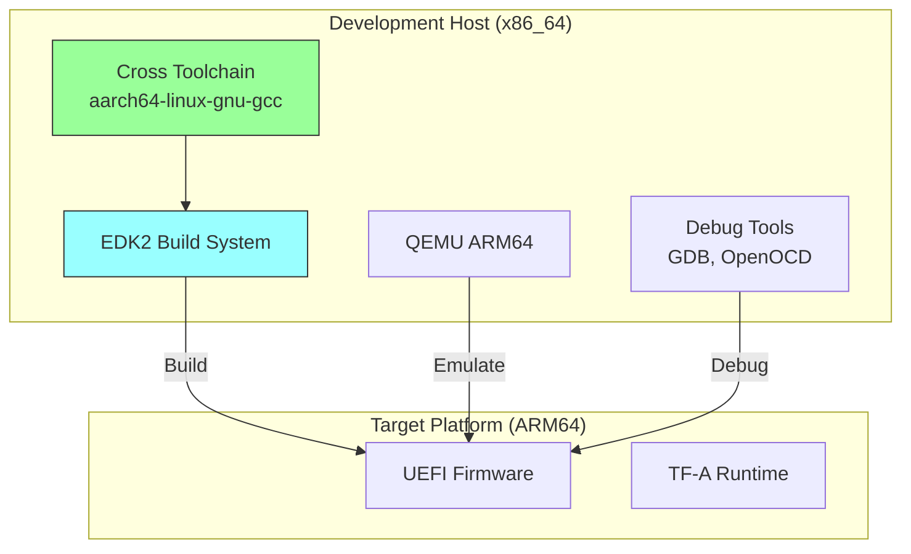

# Section 23.1: ARM Development Environment Setup

Setting up a proper ARM UEFI development environment requires cross-compilation toolchains, emulation tools, and debugging infrastructure. This section covers the complete setup process.

## Overview

ARM UEFI development differs from x86 in several key ways:



## Toolchain Installation

### Option 1: Distribution Packages (Recommended)

```bash
# Ubuntu/Debian
sudo apt update
sudo apt install -y \
    gcc-aarch64-linux-gnu \
    g++-aarch64-linux-gnu \
    binutils-aarch64-linux-gnu \
    qemu-system-arm \
    device-tree-compiler \
    acpica-tools \
    uuid-dev \
    python3 \
    python3-distutils \
    git \
    make \
    gcc \
    g++

# Verify installation
aarch64-linux-gnu-gcc --version
qemu-system-aarch64 --version
```

### Option 2: ARM Official Toolchain

```bash
# Download ARM GNU Toolchain (recommended for production)
TOOLCHAIN_VER="12.3.rel1"
TOOLCHAIN_URL="https://developer.arm.com/-/media/Files/downloads/gnu"

wget "${TOOLCHAIN_URL}/${TOOLCHAIN_VER}/binrel/arm-gnu-toolchain-${TOOLCHAIN_VER}-x86_64-aarch64-none-elf.tar.xz"
sudo tar xf arm-gnu-toolchain-${TOOLCHAIN_VER}-x86_64-aarch64-none-elf.tar.xz -C /opt/

# Add to PATH
echo 'export PATH=/opt/arm-gnu-toolchain-12.3.rel1-x86_64-aarch64-none-elf/bin:$PATH' >> ~/.bashrc
source ~/.bashrc

# Verify
aarch64-none-elf-gcc --version
```

### Option 3: Linaro Toolchain

```bash
# Linaro toolchain (alternative)
LINARO_VER="7.5-2019.12"
wget https://releases.linaro.org/components/toolchain/binaries/${LINARO_VER}/aarch64-linux-gnu/gcc-linaro-${LINARO_VER}-x86_64_aarch64-linux-gnu.tar.xz

sudo tar xf gcc-linaro-${LINARO_VER}-x86_64_aarch64-linux-gnu.tar.xz -C /opt/
export PATH=/opt/gcc-linaro-${LINARO_VER}-x86_64_aarch64-linux-gnu/bin:$PATH
```

## EDK2 Environment Setup

### Clone Required Repositories

```bash
# Create workspace directory
mkdir -p ~/arm-uefi-workspace
cd ~/arm-uefi-workspace

# Clone EDK2 and submodules
git clone https://github.com/tianocore/edk2.git
cd edk2
git submodule update --init

# Clone edk2-platforms for real hardware
cd ..
git clone https://github.com/tianocore/edk2-platforms.git

# Clone edk2-non-osi for binary blobs (some platforms)
git clone https://github.com/tianocore/edk2-non-osi.git
```

### Configure Build Environment

```bash
# Set up EDK2 environment
cd ~/arm-uefi-workspace/edk2
source edksetup.sh

# Build BaseTools
make -C BaseTools

# Create Conf/target.txt for ARM64
cat > Conf/target.txt << 'EOF'
ACTIVE_PLATFORM       = ArmVirtPkg/ArmVirtQemu.dsc
TARGET                = DEBUG
TARGET_ARCH           = AARCH64
TOOL_CHAIN_CONF       = Conf/tools_def.txt
TOOL_CHAIN_TAG        = GCC5
BUILD_RULE_CONF       = Conf/build_rule.txt
EOF
```

### GCC5 Toolchain Configuration

EDK2 expects specific toolchain prefixes. Configure in `Conf/tools_def.txt`:

```bash
# Verify GCC5 settings in tools_def.txt
grep -A5 "GCC5_AARCH64" Conf/tools_def.txt

# If using distribution gcc, create symlinks or set prefix
export GCC5_AARCH64_PREFIX=aarch64-linux-gnu-

# Alternatively, for ARM official toolchain
export GCC5_AARCH64_PREFIX=aarch64-none-elf-
```

## Building ArmVirtQemu

### Basic Build

```bash
cd ~/arm-uefi-workspace/edk2
source edksetup.sh

# Build DEBUG version
build -a AARCH64 -t GCC5 -p ArmVirtPkg/ArmVirtQemu.dsc -b DEBUG

# Build RELEASE version
build -a AARCH64 -t GCC5 -p ArmVirtPkg/ArmVirtQemu.dsc -b RELEASE

# Output location
ls Build/ArmVirtQemu-AARCH64/DEBUG_GCC5/FV/
# QEMU_EFI.fd - Combined SEC + UEFI firmware
# QEMU_VARS.fd - Variable store template
```

### Build Options

```bash
# Enable Secure Boot support
build -a AARCH64 -t GCC5 -p ArmVirtPkg/ArmVirtQemu.dsc \
    -D SECURE_BOOT_ENABLE=TRUE

# Enable TPM2 support
build -a AARCH64 -t GCC5 -p ArmVirtPkg/ArmVirtQemu.dsc \
    -D TPM2_ENABLE=TRUE

# Enable HTTP Boot
build -a AARCH64 -t GCC5 -p ArmVirtPkg/ArmVirtQemu.dsc \
    -D NETWORK_HTTP_BOOT_ENABLE=TRUE

# Combined options
build -a AARCH64 -t GCC5 -p ArmVirtPkg/ArmVirtQemu.dsc -b DEBUG \
    -D SECURE_BOOT_ENABLE=TRUE \
    -D TPM2_ENABLE=TRUE \
    -D NETWORK_HTTP_BOOT_ENABLE=TRUE \
    -D DEBUG_ON_SERIAL_PORT=TRUE
```

## QEMU Setup and Testing

### Basic QEMU Invocation

```bash
# Create flash images
FLASH_SIZE=$((64 * 1024 * 1024))  # 64MB
dd if=/dev/zero of=flash0.img bs=1 count=$FLASH_SIZE
dd if=/dev/zero of=flash1.img bs=1 count=$FLASH_SIZE
dd if=Build/ArmVirtQemu-AARCH64/DEBUG_GCC5/FV/QEMU_EFI.fd of=flash0.img conv=notrunc

# Run QEMU
qemu-system-aarch64 \
    -M virt \
    -cpu cortex-a72 \
    -m 2G \
    -drive if=pflash,format=raw,file=flash0.img \
    -drive if=pflash,format=raw,file=flash1.img \
    -serial stdio \
    -net none
```

### Advanced QEMU Configuration

```bash
#!/bin/bash
# run-qemu-arm.sh - Comprehensive QEMU launch script

WORKSPACE=~/arm-uefi-workspace
FW_DIR=${WORKSPACE}/edk2/Build/ArmVirtQemu-AARCH64/DEBUG_GCC5/FV

# Create working directory
mkdir -p ${WORKSPACE}/qemu-run
cd ${WORKSPACE}/qemu-run

# Prepare flash images
cp ${FW_DIR}/QEMU_EFI.fd flash0.img
dd if=/dev/zero of=flash1.img bs=64M count=1

# Create a small FAT filesystem for EFI Shell scripts
dd if=/dev/zero of=esp.img bs=1M count=64
mkfs.vfat esp.img
mkdir -p mnt
sudo mount esp.img mnt
sudo mkdir -p mnt/EFI/BOOT
sudo cp ${FW_DIR}/../Shell.efi mnt/EFI/BOOT/BOOTAA64.EFI 2>/dev/null || true
sudo umount mnt

# Run QEMU with full options
qemu-system-aarch64 \
    -M virt,secure=on,virtualization=on,gic-version=3 \
    -cpu cortex-a76 \
    -smp cpus=4 \
    -m 4G \
    -drive if=pflash,format=raw,file=flash0.img,readonly=on \
    -drive if=pflash,format=raw,file=flash1.img \
    -drive if=virtio,format=raw,file=esp.img \
    -device virtio-net-pci,netdev=net0 \
    -netdev user,id=net0,hostfwd=tcp::2222-:22 \
    -device virtio-gpu-pci \
    -device usb-ehci \
    -device usb-kbd \
    -device usb-mouse \
    -serial stdio \
    -monitor telnet:127.0.0.1:4444,server,nowait \
    -d guest_errors \
    "$@"
```

### QEMU GIC Versions

```bash
# GICv2 (older platforms)
-M virt,gic-version=2

# GICv3 (modern servers)
-M virt,gic-version=3

# GICv4 (virtualization optimized)
-M virt,gic-version=max
```

## Debugging Setup

### GDB with QEMU

```bash
# Terminal 1: Run QEMU with GDB server
qemu-system-aarch64 \
    -M virt \
    -cpu cortex-a72 \
    -m 2G \
    -drive if=pflash,format=raw,file=flash0.img \
    -serial stdio \
    -s -S  # -s: GDB on port 1234, -S: pause at start

# Terminal 2: Connect GDB
aarch64-linux-gnu-gdb

# In GDB
(gdb) target remote localhost:1234
(gdb) add-symbol-file Build/ArmVirtQemu-AARCH64/DEBUG_GCC5/AARCH64/ArmVirtPkg/PrePi/ArmVirtPrePiUniCoreRelocatable/DEBUG/ArmVirtPrePiUniCoreRelocatable.debug 0x40000000
(gdb) break CEntryPoint
(gdb) continue
```

### Debug Print Configuration

```c
// In platform DSC file, configure debug output
[PcdsFixedAtBuild]
  # Serial debug output
  gEfiMdePkgTokenSpaceGuid.PcdDebugPropertyMask|0x2F
  gEfiMdePkgTokenSpaceGuid.PcdDebugPrintErrorLevel|0x8040004F
  gEfiMdePkgTokenSpaceGuid.PcdReportStatusCodePropertyMask|0x07

  # UART configuration for QEMU virt
  gArmPlatformTokenSpaceGuid.PcdSerialDbgRegisterBase|0x09000000
  gEfiMdeModulePkgTokenSpaceGuid.PcdSerialRegisterBase|0x09000000
```

### OpenOCD for Hardware Debugging

```bash
# Install OpenOCD
sudo apt install openocd

# Example OpenOCD configuration for Raspberry Pi 4
# rpi4.cfg
source [find interface/ftdi/olimex-arm-usb-ocd-h.cfg]
adapter speed 1000

set _CHIPNAME bcm2711
set _DAP_TAPID 0x4ba00477

transport select jtag

jtag newtap $_CHIPNAME cpu -irlen 4 -expected-id $_DAP_TAPID

set _TARGETNAME $_CHIPNAME.a72
dap create $_CHIPNAME.dap -chain-position $_CHIPNAME.cpu
target create $_TARGETNAME.0 aarch64 -dap $_CHIPNAME.dap -coreid 0
target create $_TARGETNAME.1 aarch64 -dap $_CHIPNAME.dap -coreid 1
target create $_TARGETNAME.2 aarch64 -dap $_CHIPNAME.dap -coreid 2
target create $_TARGETNAME.3 aarch64 -dap $_CHIPNAME.dap -coreid 3

# Run OpenOCD
openocd -f rpi4.cfg
```

## Docker-Based Development

```dockerfile
# Dockerfile for ARM UEFI development
FROM ubuntu:22.04

ENV DEBIAN_FRONTEND=noninteractive

RUN apt-get update && apt-get install -y \
    build-essential \
    uuid-dev \
    iasl \
    git \
    gcc-aarch64-linux-gnu \
    g++-aarch64-linux-gnu \
    python3 \
    python3-distutils \
    qemu-system-arm \
    device-tree-compiler \
    && rm -rf /var/lib/apt/lists/*

ENV GCC5_AARCH64_PREFIX=aarch64-linux-gnu-

WORKDIR /workspace

# Clone EDK2
RUN git clone https://github.com/tianocore/edk2.git && \
    cd edk2 && \
    git submodule update --init && \
    make -C BaseTools

COPY build.sh /workspace/
RUN chmod +x /workspace/build.sh

ENTRYPOINT ["/workspace/build.sh"]
```

```bash
# build.sh
#!/bin/bash
cd /workspace/edk2
source edksetup.sh
build -a AARCH64 -t GCC5 -p ArmVirtPkg/ArmVirtQemu.dsc -b DEBUG "$@"
```

```bash
# Build and run container
docker build -t arm-uefi-dev .
docker run -v $(pwd)/output:/workspace/output arm-uefi-dev
```

## VS Code Configuration

### Extensions

```json
// .vscode/extensions.json
{
    "recommendations": [
        "ms-vscode.cpptools",
        "webfreak.debug",
        "marus25.cortex-debug",
        "dan-c-underwood.arm"
    ]
}
```

### Launch Configuration

```json
// .vscode/launch.json
{
    "version": "0.2.0",
    "configurations": [
        {
            "name": "QEMU ARM64 Debug",
            "type": "cppdbg",
            "request": "launch",
            "program": "${workspaceFolder}/edk2/Build/ArmVirtQemu-AARCH64/DEBUG_GCC5/FV/QEMU_EFI.fd",
            "miDebuggerServerAddress": "localhost:1234",
            "miDebuggerPath": "aarch64-linux-gnu-gdb",
            "cwd": "${workspaceFolder}",
            "setupCommands": [
                {
                    "text": "set architecture aarch64"
                },
                {
                    "text": "add-symbol-file ${workspaceFolder}/edk2/Build/ArmVirtQemu-AARCH64/DEBUG_GCC5/AARCH64/ArmVirtPkg/PrePi/ArmVirtPrePiUniCoreRelocatable/DEBUG/ArmVirtPrePiUniCoreRelocatable.debug"
                }
            ]
        }
    ]
}
```

### Build Tasks

```json
// .vscode/tasks.json
{
    "version": "2.0.0",
    "tasks": [
        {
            "label": "Build ARM64 DEBUG",
            "type": "shell",
            "command": "source edksetup.sh && build -a AARCH64 -t GCC5 -p ArmVirtPkg/ArmVirtQemu.dsc -b DEBUG",
            "options": {
                "cwd": "${workspaceFolder}/edk2"
            },
            "group": {
                "kind": "build",
                "isDefault": true
            }
        },
        {
            "label": "Run QEMU",
            "type": "shell",
            "command": "${workspaceFolder}/scripts/run-qemu.sh",
            "problemMatcher": []
        }
    ]
}
```

## Environment Variables Summary

```bash
# Add to ~/.bashrc or ~/.profile
export WORKSPACE=~/arm-uefi-workspace
export EDK2_PATH=${WORKSPACE}/edk2
export PACKAGES_PATH=${WORKSPACE}/edk2:${WORKSPACE}/edk2-platforms:${WORKSPACE}/edk2-non-osi
export GCC5_AARCH64_PREFIX=aarch64-linux-gnu-

# Build aliases
alias edk2-setup='cd ${EDK2_PATH} && source edksetup.sh'
alias build-arm64='build -a AARCH64 -t GCC5'
alias build-virt='build-arm64 -p ArmVirtPkg/ArmVirtQemu.dsc -b DEBUG'
```

## Verification Checklist

```bash
# Verify complete environment
echo "=== Toolchain ===" && aarch64-linux-gnu-gcc --version | head -1
echo "=== QEMU ===" && qemu-system-aarch64 --version | head -1
echo "=== Python ===" && python3 --version
echo "=== IASL ===" && iasl -v | head -1
echo "=== DTC ===" && dtc --version
echo "=== EDK2 ===" && [ -d ~/arm-uefi-workspace/edk2 ] && echo "OK" || echo "Missing"
echo "=== BaseTools ===" && [ -f ~/arm-uefi-workspace/edk2/BaseTools/Source/C/bin/GenFw ] && echo "OK" || echo "Need to build"
```

## Common Issues and Solutions

| Issue | Cause | Solution |
|-------|-------|----------|
| "No rule to make target 'GenFw'" | BaseTools not built | Run `make -C BaseTools` |
| "aarch64-linux-gnu-gcc: not found" | Toolchain not in PATH | Export GCC5_AARCH64_PREFIX |
| QEMU hangs at startup | Wrong flash image size | Ensure 64MB flash images |
| GDB cannot connect | QEMU not started with -s | Add `-s -S` to QEMU command |
| "ASSERT_EFI_ERROR" | Debug assertion | Check serial output for details |

## References

- [EDK2 Getting Started - ARM](https://github.com/tianocore/tianocore.github.io/wiki/Using-EDK-II-with-Native-GCC)
- [ARM GNU Toolchain Downloads](https://developer.arm.com/downloads/-/arm-gnu-toolchain-downloads)
- [QEMU ARM Documentation](https://www.qemu.org/docs/master/system/arm/virt.html)

---

*Next: [Section 23.2: ARM Boot Architecture]() - Understanding ARM exception levels and boot flow.*
