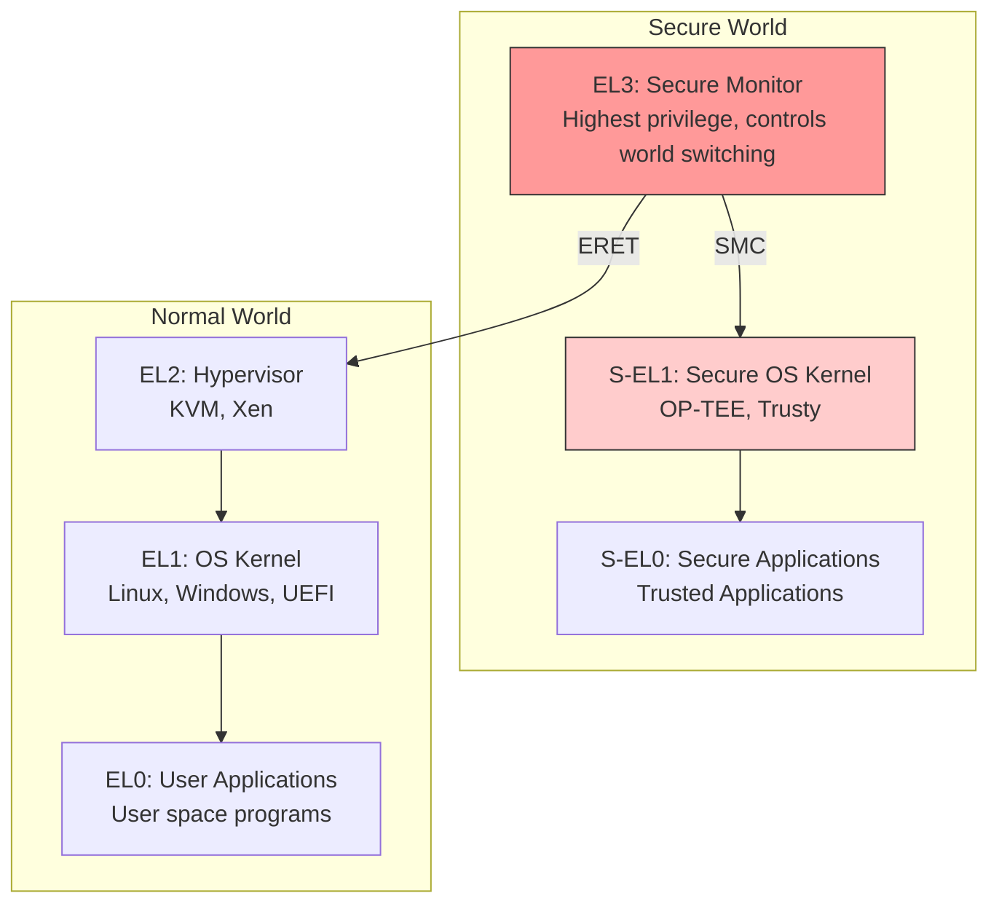
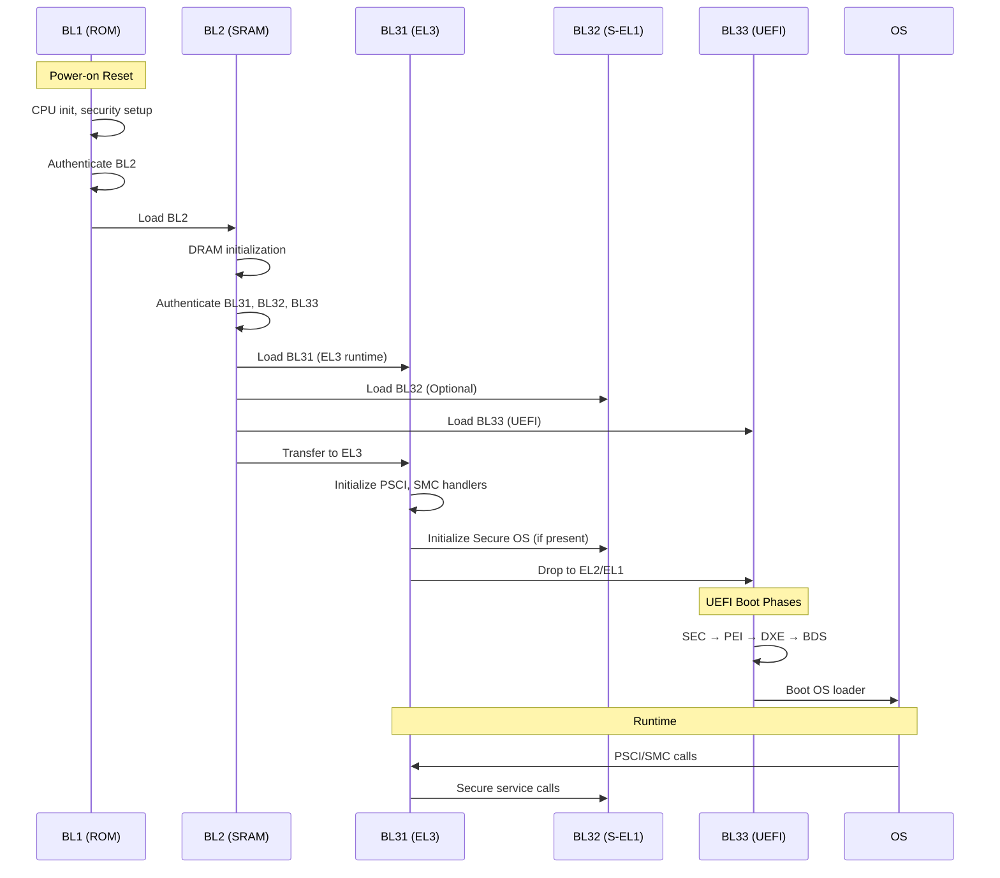
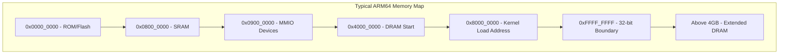
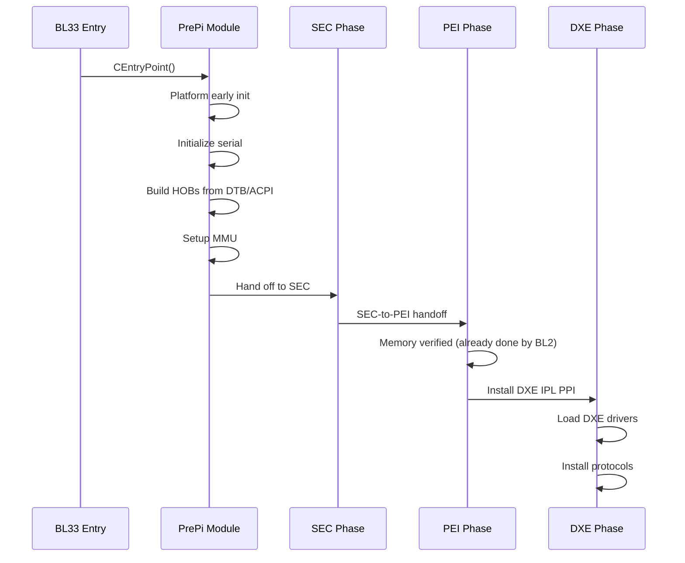

# Section 23.2: ARM Boot Architecture

ARM boot architecture fundamentally differs from x86, using Exception Levels for privilege separation and Trusted Firmware-A (TF-A) for secure boot chain establishment.

## Exception Levels (EL0-EL3)

ARM processors implement hierarchical Exception Levels for security and privilege separation:



### Exception Level Properties

| EL | Purpose | Typical Software | Key Features |
|----|---------|------------------|--------------|
| EL3 | Secure Monitor | TF-A BL31 | Controls TrustZone, world switching |
| S-EL1 | Secure OS | OP-TEE | Isolated secure services |
| S-EL0 | Secure Apps | Trusted Apps | DRM, key storage |
| EL2 | Hypervisor | KVM, Xen, UEFI (VHE) | Virtual machine management |
| EL1 | OS Kernel | Linux, UEFI | Privileged OS operations |
| EL0 | User Apps | Applications | Unprivileged execution |

## ARM Boot Flow



## Boot Loader Stages

### BL1 (Boot ROM)

BL1 resides in ROM and is the first code executed:

```c
// BL1 Responsibilities (Conceptual)
void bl1_main(void)
{
    // 1. CPU Early Initialization
    el3_arch_init();

    // 2. Minimal Platform Init
    platform_setup();

    // 3. Security Configuration
    configure_tzc();        // TrustZone Controller
    configure_gic();        // GIC security groups

    // 4. Authenticate BL2
    auth_mod_verify_img(BL2_IMAGE_ID, &bl2_info);

    // 5. Load and run BL2
    bl1_load_bl2();
    bl1_run_next_image();   // Jump to BL2
}
```

### BL2 (Trusted Boot Firmware)

BL2 runs in SRAM and initializes DRAM:

```c
// BL2 Flow (Conceptual)
void bl2_main(void)
{
    // 1. Console initialization
    console_init();

    // 2. Platform security setup
    bl2_plat_arch_setup();

    // 3. DRAM Initialization
    plat_dram_init();

    // 4. Load all subsequent images
    bl2_load_images();
    /*
     * Loads:
     * - BL31 (EL3 runtime services)
     * - BL32 (Secure OS, optional)
     * - BL33 (UEFI firmware)
     */

    // 5. Authenticate all images
    for_each_image(image) {
        auth_mod_verify_img(image->id, image->info);
    }

    // 6. Transfer to BL31
    bl2_run_next_image();   // SMC to BL31
}
```

### BL31 (EL3 Runtime)

BL31 provides runtime services at EL3:

```c
// BL31 Runtime Services
void bl31_main(void)
{
    // 1. EL3 Initialization
    bl31_arch_setup();

    // 2. Platform setup
    bl31_platform_setup();

    // 3. Register SMC handlers
    // PSCI handlers
    psci_setup();

    // Vendor-specific SMC handlers
    plat_smc_handler_setup();

    // 4. Initialize BL32 if present
    if (bl32_image_present()) {
        bl31_init_bl32(bl32_ep_info);
    }

    // 5. Prepare BL33 entry
    bl31_prepare_next_image_entry();

    // 6. Exit to BL33 (drop to EL2/EL1)
    el3_exit();
}

// SMC Dispatcher
uint64_t smc_handler(uint32_t smc_fid,
                     uint64_t x1, uint64_t x2,
                     uint64_t x3, uint64_t x4)
{
    switch (GET_SMC_TYPE(smc_fid)) {
    case SMC_TYPE_PSCI:
        return psci_smc_handler(smc_fid, x1, x2, x3, x4);

    case SMC_TYPE_SIP:
        return plat_sip_handler(smc_fid, x1, x2, x3, x4);

    case SMC_TYPE_STD:
        return std_svc_smc_handler(smc_fid, x1, x2, x3, x4);

    default:
        return SMC_UNK;
    }
}
```

### BL33 (UEFI Firmware)

UEFI runs as BL33 at EL2 or EL1:

```c
// UEFI Entry from TF-A (ArmPkg/Library/ArmLib)
VOID
EFIAPI
CEntryPoint (
  IN  UINTN  MpId,
  IN  UINTN  SecBootMode
  )
{
    // Entry point from BL31
    // MpId: CPU identifier (MPIDR)
    // SecBootMode: Boot mode flags

    // Initialize minimal platform
    ArmPlatformInitialize(MpId);

    // Set up serial console
    SerialPortInitialize();

    // Initialize MMU and caches
    ArmEnableDataCache();
    ArmEnableInstructionCache();

    // Transition to PEI or DXE
    ProcessModuleEntryPointList();
}
```

## Exception Level Transitions

### EL3 Entry (SMC)

```c
// Triggering SMC from UEFI (EL1/EL2)
VOID
ArmCallSmc (
  IN OUT ARM_SMC_ARGS *Args
  )
{
    __asm__ __volatile__ (
        "ldr x0, %0\n"
        "ldr x1, %1\n"
        "ldr x2, %2\n"
        "ldr x3, %3\n"
        "smc #0\n"
        "str x0, %0\n"
        "str x1, %1\n"
        "str x2, %2\n"
        "str x3, %3\n"
        : "+m" (Args->Arg0), "+m" (Args->Arg1),
          "+m" (Args->Arg2), "+m" (Args->Arg3)
        :
        : "x0", "x1", "x2", "x3", "x4", "x5", "x6", "x7",
          "x8", "x9", "x10", "x11", "x12", "x13", "x14",
          "x15", "x16", "x17"
    );
}

// Example: PSCI CPU_OFF call
EFI_STATUS
CpuOff (VOID)
{
    ARM_SMC_ARGS  Args;

    Args.Arg0 = ARM_SMC_ID_PSCI_CPU_OFF;
    ArmCallSmc(&Args);

    // Should not return
    return EFI_DEVICE_ERROR;
}
```

### Hypervisor Calls (HVC)

```c
// HVC for hypervisor interaction
VOID
ArmCallHvc (
  IN OUT ARM_HVC_ARGS *Args
  )
{
    __asm__ __volatile__ (
        "ldr x0, %0\n"
        "ldr x1, %1\n"
        "ldr x2, %2\n"
        "ldr x3, %3\n"
        "hvc #0\n"
        "str x0, %0\n"
        "str x1, %1\n"
        "str x2, %2\n"
        "str x3, %3\n"
        : "+m" (Args->Arg0), "+m" (Args->Arg1),
          "+m" (Args->Arg2), "+m" (Args->Arg3)
    );
}
```

## CPU Register Context

### System Registers by EL

```c
// Key System Registers

// EL0 accessible
// TPIDR_EL0     - Thread ID register
// NZCV          - Condition flags

// EL1 accessible
// SCTLR_EL1     - System Control Register
// TTBR0_EL1     - Translation Table Base 0
// TTBR1_EL1     - Translation Table Base 1
// TCR_EL1       - Translation Control Register
// MAIR_EL1      - Memory Attribute Indirection Register
// VBAR_EL1      - Vector Base Address Register

// EL2 accessible (when present)
// HCR_EL2       - Hypervisor Configuration Register
// VTTBR_EL2     - Virtualization TTBR
// VTCR_EL2      - Virtualization TCR

// EL3 accessible
// SCR_EL3       - Secure Configuration Register
// SCTLR_EL3     - System Control Register EL3
// VBAR_EL3      - Vector Base Address Register EL3

// Reading current EL
STATIC
UINTN
GetCurrentEL (VOID)
{
    UINTN CurrentEL;
    __asm__ volatile ("mrs %0, CurrentEL" : "=r" (CurrentEL));
    return (CurrentEL >> 2) & 0x3;
}
```

### UEFI Runtime Exception Level

```c
// Determine if running at EL2 or EL1
BOOLEAN
RunningAtEL2 (VOID)
{
    return GetCurrentEL() == 2;
}

// UEFI can run at:
// - EL2: With VHE (Virtualization Host Extensions)
// - EL1: Traditional mode, EL2 used by hypervisor
```

## Memory Map Considerations

### ARM Address Space Layout



### UEFI Memory Initialization

```c
// Platform memory map from HOBs (received from BL2/TF-A)
VOID
BuildMemoryHobs (VOID)
{
    // System RAM
    BuildResourceDescriptorHob (
        EFI_RESOURCE_SYSTEM_MEMORY,
        EFI_RESOURCE_ATTRIBUTE_PRESENT |
        EFI_RESOURCE_ATTRIBUTE_INITIALIZED |
        EFI_RESOURCE_ATTRIBUTE_TESTED,
        PcdGet64 (PcdSystemMemoryBase),
        PcdGet64 (PcdSystemMemorySize)
    );

    // Reserved for TF-A/EL3
    BuildMemoryAllocationHob (
        FixedPcdGet64 (PcdTrustedFirmwareMemoryBase),
        FixedPcdGet64 (PcdTrustedFirmwareMemorySize),
        EfiReservedMemoryType
    );

    // Reserved for Secure OS (if present)
    BuildMemoryAllocationHob (
        FixedPcdGet64 (PcdSecureMemoryBase),
        FixedPcdGet64 (PcdSecureMemorySize),
        EfiReservedMemoryType
    );
}
```

## TrustZone Integration

### Secure/Non-Secure World Separation

```c
// TrustZone Controller (TZC-400) Configuration
// Done in BL2 before UEFI

typedef struct {
    UINT32  Base;
    UINT32  Top;
    UINT32  SecureAttr;
    UINT32  NsaidPermission;
} TZC_REGION;

// Example: Configure DRAM regions
TZC_REGION regions[] = {
    // Secure DRAM for TF-A and OP-TEE
    { 0x80000000, 0x82000000, TZC_REGION_S_RD | TZC_REGION_S_WR, 0 },

    // Non-secure DRAM for UEFI and OS
    { 0x82000000, 0xFFFFFFFF, TZC_REGION_S_RD | TZC_REGION_S_WR,
      TZC_REGION_NS_RD | TZC_REGION_NS_WR },
};
```

### Secure Service Calls from UEFI

```c
// Calling secure world service (OP-TEE example)
#define OPTEE_SMC_CALL_WITH_ARG  0x32000004

EFI_STATUS
CallSecureService (
    IN UINT32  CommandId,
    IN VOID    *InBuffer,
    IN UINTN   InSize,
    OUT VOID   *OutBuffer,
    OUT UINTN  *OutSize
    )
{
    ARM_SMC_ARGS  Args;
    OPTEE_MESSAGE *Msg;

    // Prepare shared memory message
    Msg = AllocateSharedMemory(sizeof(OPTEE_MESSAGE));
    Msg->Command = CommandId;
    CopyMem(Msg->Params, InBuffer, InSize);

    // SMC to secure world
    Args.Arg0 = OPTEE_SMC_CALL_WITH_ARG;
    Args.Arg1 = (UINT64)Msg;
    Args.Arg2 = 0;

    ArmCallSmc(&Args);

    if (Args.Arg0 == OPTEE_SMC_RETURN_OK) {
        CopyMem(OutBuffer, Msg->Params, Msg->ParamsSize);
        *OutSize = Msg->ParamsSize;
        return EFI_SUCCESS;
    }

    return EFI_DEVICE_ERROR;
}
```

## Multi-Processor Boot

### PSCI CPU_ON Implementation

```c
// Bringing up secondary CPUs
EFI_STATUS
StartSecondaryCpu (
    IN UINTN  CpuId,
    IN UINTN  EntryPoint
    )
{
    ARM_SMC_ARGS  Args;

    Args.Arg0 = ARM_SMC_ID_PSCI_CPU_ON_AARCH64;
    Args.Arg1 = CpuId;          // Target CPU MPIDR
    Args.Arg2 = EntryPoint;     // Entry address
    Args.Arg3 = 0;              // Context ID

    ArmCallSmc(&Args);

    switch (Args.Arg0) {
    case PSCI_SUCCESS:
        return EFI_SUCCESS;
    case PSCI_ALREADY_ON:
        return EFI_ALREADY_STARTED;
    case PSCI_INVALID_PARAMS:
        return EFI_INVALID_PARAMETER;
    default:
        return EFI_DEVICE_ERROR;
    }
}

// Secondary CPU entry point
VOID
SecondaryCpuEntry (
    IN UINTN  MpId
    )
{
    // Initialize CPU-specific registers
    ArmEnableDataCache();
    ArmEnableInstructionCache();

    // Wait for synchronization
    while (!gMpSyncFlag) {
        WFE();  // Wait for event
    }

    // CPU is now available for MP services
    RegisterCpu(MpId);
}
```

## Boot Mode Detection

```c
// Detecting boot mode in UEFI
typedef enum {
    BOOT_MODE_COLD,
    BOOT_MODE_WARM,
    BOOT_MODE_RECOVERY,
    BOOT_MODE_CAPSULE
} PLATFORM_BOOT_MODE;

PLATFORM_BOOT_MODE
GetPlatformBootMode (VOID)
{
    UINT32  ResetReason;

    // Read platform-specific reset reason register
    ResetReason = MmioRead32(PLATFORM_RST_REASON_REG);

    if (ResetReason & RST_REASON_POR) {
        return BOOT_MODE_COLD;
    } else if (ResetReason & RST_REASON_WARM) {
        return BOOT_MODE_WARM;
    } else if (ResetReason & RST_REASON_RECOVERY) {
        return BOOT_MODE_RECOVERY;
    } else if (DetectCapsuleUpdate()) {
        return BOOT_MODE_CAPSULE;
    }

    return BOOT_MODE_COLD;
}
```

## Exception Vectors

```c
// UEFI Exception Vector Table (ArmPkg)
// Located at VBAR_EL1 or VBAR_EL2

.align 11  // 2KB aligned
VectorTable:
    // Current EL with SP_EL0
    .align 7
    b   SynchronousExceptionSP0
    .align 7
    b   IrqSP0
    .align 7
    b   FiqSP0
    .align 7
    b   SErrorSP0

    // Current EL with SP_ELx
    .align 7
    b   SynchronousExceptionSPx
    .align 7
    b   IrqSPx
    .align 7
    b   FiqSPx
    .align 7
    b   SErrorSPx

    // Lower EL using AArch64
    .align 7
    b   SynchronousExceptionLowerA64
    .align 7
    b   IrqLowerA64
    .align 7
    b   FiqLowerA64
    .align 7
    b   SErrorLowerA64

    // Lower EL using AArch32
    .align 7
    b   SynchronousExceptionLowerA32
    .align 7
    b   IrqLowerA32
    .align 7
    b   FiqLowerA32
    .align 7
    b   SErrorLowerA32
```

## Platform Initialization Sequence



## References

- [ARM Architecture Reference Manual ARMv8](https://developer.arm.com/documentation/ddi0487/latest)
- [ARM Exception Model](https://developer.arm.com/documentation/den0024/a/AArch64-Exception-Model)
- [Trusted Firmware-A Design](https://trustedfirmware-a.readthedocs.io/en/latest/design/firmware-design.html)
- [PSCI Specification](https://developer.arm.com/documentation/den0022/latest)

---

*Next: [Section 23.3: Trusted Firmware-A](../23-3-trusted-firmware/) - Deep dive into TF-A integration.*
