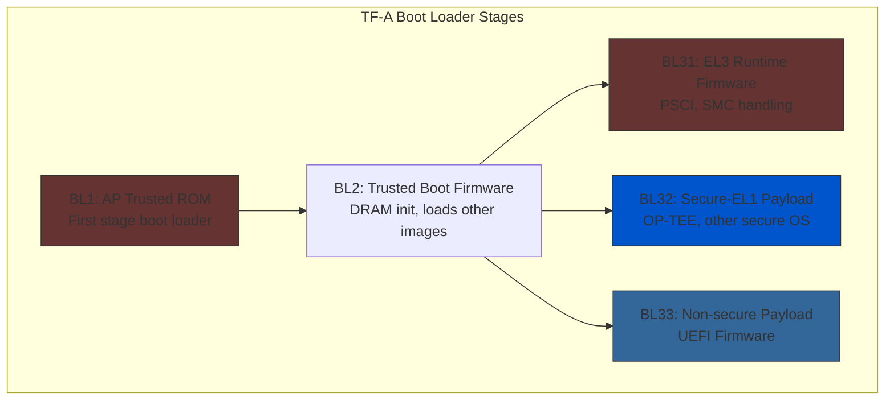
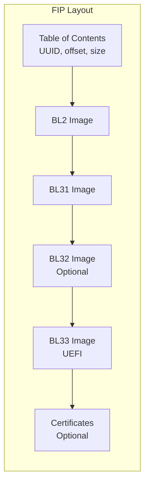
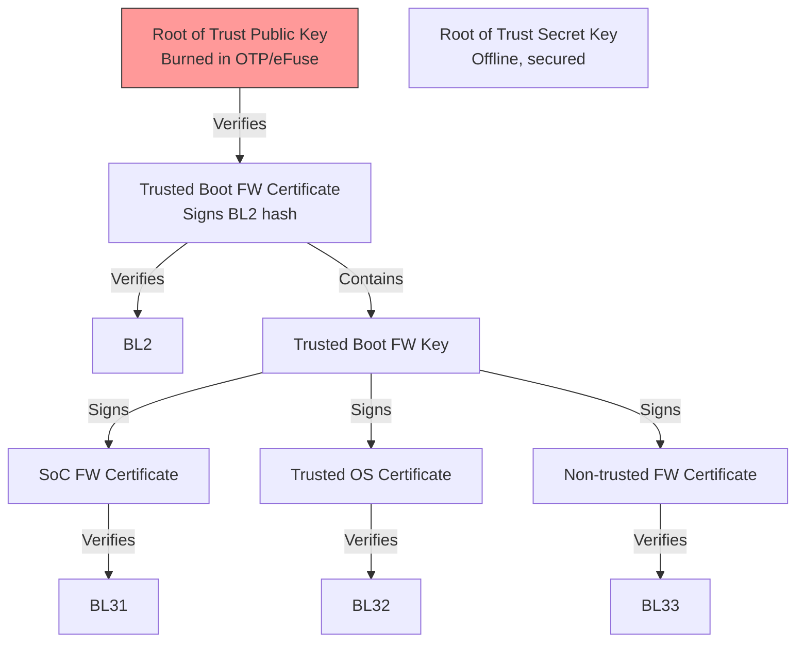

# Section 23.3: Trusted Firmware-A (TF-A)

Trusted Firmware-A is the reference implementation of secure world software for ARMv8-A platforms. Understanding TF-A is essential for ARM UEFI development as it provides the boot foundation and runtime services.

## TF-A Overview



## Building TF-A

### Prerequisites

```bash
# Install dependencies
sudo apt install -y \
    git \
    build-essential \
    gcc-aarch64-linux-gnu \
    device-tree-compiler \
    openssl \
    libssl-dev

# Clone TF-A repository
git clone https://github.com/ARM-software/arm-trusted-firmware.git
cd arm-trusted-firmware
```

### Basic Build for QEMU

```bash
# Build for QEMU virt platform
make PLAT=qemu \
     CROSS_COMPILE=aarch64-linux-gnu- \
     BL33=/path/to/QEMU_EFI.fd \
     DEBUG=1 \
     all fip

# Output files:
# build/qemu/debug/bl1.bin
# build/qemu/debug/fip.bin (contains BL2, BL31, BL33)
```

### Build Options Reference

```bash
# Common build variables
make PLAT=<platform>           \  # Target platform (qemu, rpi4, fvp, etc.)
     CROSS_COMPILE=aarch64-linux-gnu- \
     BL33=/path/to/uefi.fd     \  # UEFI firmware path
     BL32=/path/to/optee.bin   \  # Secure OS (optional)
     SPD=opteed                \  # Secure Payload Dispatcher
     DEBUG=1                   \  # Debug build
     LOG_LEVEL=40              \  # Verbose logging (0-50)
     ENABLE_STACK_PROTECTOR=strong \
     MEASURED_BOOT=1           \  # TPM measured boot
     TRUSTED_BOARD_BOOT=1      \  # Authenticated boot
     ARM_ROTPK_LOCATION=devel_rsa \
     ROT_KEY=plat/arm/board/common/rotpk/arm_rotprivk_rsa.pem \
     all fip
```

## Platform-Specific Builds

### Raspberry Pi 4

```bash
# Clone RPI firmware for GPU blobs
git clone --depth=1 https://github.com/raspberrypi/firmware rpi-firmware

# Build TF-A for RPi4
make PLAT=rpi4 \
     CROSS_COMPILE=aarch64-linux-gnu- \
     RPI3_PRELOADED_DTB_BASE=0x1F0000 \
     BL33=/path/to/RPI_EFI.fd \
     DEBUG=1 \
     all

# Deploy to SD card
cp build/rpi4/debug/bl31.bin /boot/
# Modify config.txt:
# enable_uart=1
# arm_64bit=1
# enable_gic=1
# armstub=bl31.bin
```

### NXP i.MX8

```bash
# Build for i.MX8M Mini
make PLAT=imx8mm \
     CROSS_COMPILE=aarch64-linux-gnu- \
     BL33=/path/to/imx8mm_uefi.fd \
     SPD=opteed \
     BL32=/path/to/tee.bin \
     DEBUG=1 \
     all

# Combine with i.MX boot container
# Uses NXP's mkimage_imx8 tool
```

### NVIDIA Tegra

```bash
# Build for Jetson platforms
make PLAT=tegra \
     TARGET_SOC=t194 \
     CROSS_COMPILE=aarch64-linux-gnu- \
     BL33=/path/to/uefi_jetson.bin \
     DEBUG=1 \
     all

# Flash using NVIDIA tools
```

## BL1 Details

BL1 is the root of trust, running from ROM:

```c
// bl1/bl1_main.c - Simplified flow
void bl1_main(void)
{
    // 1. Architecture setup
    bl1_arch_setup();

    // 2. Platform early setup
    bl1_early_platform_setup();

    // 3. Enable MMU
    bl1_plat_arch_setup();

    // 4. Print version
    NOTICE("BL1: %s\n", version_string);

    // 5. Perform platform setup
    bl1_platform_setup();

    // 6. Load and authenticate BL2
    bl1_load_bl2();

    // 7. Run BL2
    bl1_run_bl2(&bl2_ep);
}
```

### Platform Porting for BL1

```c
// plat/<platform>/bl1_plat_setup.c
void bl1_early_platform_setup(void)
{
    // Watchdog disable/configuration
    watchdog_disable();

    // Console initialization
    console_pl011_register(
        PLAT_UART_BASE,
        PLAT_UART_CLK_IN_HZ,
        PLAT_CONSOLE_BAUDRATE,
        &console
    );

    // Platform-specific security setup
    platform_security_setup();
}

void bl1_plat_arch_setup(void)
{
    // Configure MMU
    const mmap_region_t bl1_regions[] = {
        MAP_REGION_FLAT(
            PLAT_ROM_BASE, PLAT_ROM_SIZE,
            MT_CODE | MT_SECURE),
        MAP_REGION_FLAT(
            PLAT_SRAM_BASE, PLAT_SRAM_SIZE,
            MT_MEMORY | MT_RW | MT_SECURE),
        {0}
    };

    setup_page_tables(bl1_regions);
    enable_mmu_el3(0);
}
```

## BL2 Details

BL2 handles memory initialization and image loading:

```c
// bl2/bl2_main.c - Simplified flow
void bl2_main(void)
{
    // 1. Architecture setup
    bl2_arch_setup();

    // 2. Platform setup (DRAM init happens here)
    bl2_platform_setup();

    // 3. Load images from FIP
    bl2_load_images();

    // 4. Transfer to BL31 via SMC
    smc(BL1_SMC_RUN_IMAGE, (u_register_t)&bl31_ep_info,
        0, 0, 0, 0, 0, 0);
}

void bl2_platform_setup(void)
{
    // Memory controller initialization
    dram_init();

    // I/O setup for loading images
    plat_io_setup();

    // Security region configuration
    configure_tzc400();
}
```

### DDR Training in BL2

```c
// Example: DDR4 initialization sequence
void dram_init(void)
{
    // 1. Configure DDR PLL
    ddr_pll_init(DDR_FREQ_MHZ);

    // 2. Configure DDR controller
    ddr_ctrl_init();

    // 3. Configure PHY
    ddr_phy_init();

    // 4. Run training algorithms
    ddr_write_leveling();
    ddr_read_gate_training();
    ddr_read_eye_training();
    ddr_write_eye_training();

    // 5. Verify memory
    ddr_self_test();

    INFO("DRAM: %llu MB initialized\n",
         dram_size / (1024 * 1024));
}
```

## BL31 Runtime Services

BL31 provides runtime services at EL3:

```c
// bl31/bl31_main.c
void bl31_main(void)
{
    // 1. EL3 architecture setup
    bl31_arch_setup();

    // 2. Platform setup
    bl31_platform_setup();

    // 3. Initialize runtime services
    runtime_svc_init();

    // 4. Initialize BL32 (Secure Payload)
    if (bl32_init)
        bl32_init();

    // 5. Prepare BL33 entry
    bl31_prepare_next_image_entry();

    // 6. Exit to BL33
    bl31_plat_runtime_setup();
    el3_exit();
}
```

### SMC Handler Registration

```c
// Registering SMC handlers
DECLARE_RT_SVC(
    psci_svc,                   // Service name
    OEN_STD_START,              // Owning entity range start
    OEN_STD_END,                // Owning entity range end
    SMC_TYPE_FAST,              // SMC type
    psci_smc_setup,             // Init function
    psci_smc_handler            // SMC handler
);

// Handler implementation
uintptr_t psci_smc_handler(
    uint32_t smc_fid,
    u_register_t x1,
    u_register_t x2,
    u_register_t x3,
    u_register_t x4,
    void *cookie,
    void *handle,
    u_register_t flags)
{
    switch (smc_fid) {
    case PSCI_VERSION:
        return psci_version();

    case PSCI_CPU_ON_AARCH64:
        return psci_cpu_on(x1, x2, x3);

    case PSCI_CPU_OFF:
        return psci_cpu_off();

    case PSCI_AFFINITY_INFO_AARCH64:
        return psci_affinity_info(x1, x2);

    case PSCI_SYSTEM_RESET:
        psci_system_reset();
        /* Should not return */
        break;

    case PSCI_SYSTEM_OFF:
        psci_system_off();
        /* Should not return */
        break;

    default:
        WARN("Unknown PSCI function: 0x%x\n", smc_fid);
        return SMC_UNK;
    }
}
```

### Platform-Specific SMC Handlers

```c
// Silicon vendor SiP (SoC Implementation Specific) services
DECLARE_RT_SVC(
    plat_sip_svc,
    OEN_SIP_START,
    OEN_SIP_END,
    SMC_TYPE_FAST,
    plat_sip_setup,
    plat_sip_handler
);

uintptr_t plat_sip_handler(
    uint32_t smc_fid,
    u_register_t x1,
    u_register_t x2,
    u_register_t x3,
    u_register_t x4,
    void *cookie,
    void *handle,
    u_register_t flags)
{
    switch (smc_fid) {
    case SIP_SVC_UID:
        // Return SIP service UUID
        SMC_RET4(handle, SIP_UID_0, SIP_UID_1, SIP_UID_2, SIP_UID_3);

    case SIP_SVC_VERSION:
        SMC_RET2(handle, SIP_VERSION_MAJOR, SIP_VERSION_MINOR);

    case SIP_CONFIGURE_CLOCKS:
        return plat_configure_clocks(x1, x2);

    case SIP_GET_SOC_VERSION:
        return plat_get_soc_version();

    default:
        return SMC_UNK;
    }
}
```

## PSCI Implementation

### Power Domain Topology

```c
// Platform power domain tree
// plat/<platform>/platform.h

#define PLAT_MAX_PWR_LVL        2
#define PLAT_NUM_PWR_DOMAINS    (PLATFORM_CLUSTER_COUNT + \
                                 PLATFORM_CORE_COUNT + 1)

// Example: 2 clusters, 4 cores each
static const unsigned char plat_power_domain_tree_desc[] = {
    /* System level */
    1,
    /* Cluster level */
    PLATFORM_CLUSTER_COUNT,
    /* CPU cores per cluster */
    PLATFORM_CLUSTER0_CORE_COUNT,
    PLATFORM_CLUSTER1_CORE_COUNT,
};

const unsigned char *plat_get_power_domain_tree_desc(void)
{
    return plat_power_domain_tree_desc;
}
```

### PSCI Platform Operations

```c
// plat/<platform>/plat_psci.c
static const plat_psci_ops_t plat_psci_ops = {
    .cpu_standby          = plat_cpu_standby,
    .pwr_domain_on        = plat_pwr_domain_on,
    .pwr_domain_off       = plat_pwr_domain_off,
    .pwr_domain_suspend   = plat_pwr_domain_suspend,
    .pwr_domain_on_finish = plat_pwr_domain_on_finish,
    .pwr_domain_suspend_finish = plat_pwr_domain_suspend_finish,
    .system_off           = plat_system_off,
    .system_reset         = plat_system_reset,
    .validate_power_state = plat_validate_power_state,
    .get_sys_suspend_power_state = plat_get_sys_suspend_power_state,
};

int plat_pwr_domain_on(u_register_t mpidr)
{
    unsigned int cpu_id = plat_core_pos_by_mpidr(mpidr);

    // Set CPU entry point
    mmio_write_64(PLAT_RVBAR_BASE + cpu_id * 8,
                  (uint64_t)bl31_warm_entrypoint);

    // Power on CPU
    plat_power_on_cpu(cpu_id);

    // De-assert reset
    plat_release_cpu(cpu_id);

    return PSCI_E_SUCCESS;
}

void plat_system_reset(void)
{
    // Trigger system reset via watchdog or reset controller
    mmio_write_32(PLAT_RST_CTRL, PLAT_RST_TRIGGER);

    wfi();
}
```

## Firmware Image Package (FIP)

### FIP Structure



### Creating FIP

```bash
# Using fiptool
./tools/fiptool/fiptool create \
    --tb-fw build/qemu/debug/bl2.bin \
    --soc-fw build/qemu/debug/bl31.bin \
    --tos-fw /path/to/optee/tee.bin \
    --nt-fw /path/to/uefi/QEMU_EFI.fd \
    fip.bin

# Inspect FIP contents
./tools/fiptool/fiptool info fip.bin

# Update single image in FIP
./tools/fiptool/fiptool update \
    --nt-fw /path/to/new_uefi.fd \
    fip.bin
```

### FIP UUID Definitions


```c
// include/tools_share/firmware_image_package.h
#define UUID_TRUSTED_BOOT_FIRMWARE_BL2 \
    {{0x5f, 0xf9, 0xec, 0x0b}, {0x4d, 0x22}, {0x3e, 0x4d}, \
     0xa5, 0x44, {0xc3, 0x9d, 0x81, 0xc7, 0x3f, 0x0a}}

#define UUID_EL3_RUNTIME_FIRMWARE_BL31 \
    {{0x47, 0xd4, 0x08, 0x6d}, {0x4c, 0xfe}, {0x98, 0x46}, \
     0x9b, 0x95, {0x29, 0x50, 0xcb, 0xbd, 0x5a, 0x00}}

#define UUID_SECURE_PAYLOAD_BL32 \
    {{0x05, 0xd0, 0xe1, 0x89}, {0x53, 0xdc}, {0x13, 0x47}, \
     0x8d, 0x2b, {0x50, 0x0a, 0x4b, 0x7a, 0x3e, 0x38}}

#define UUID_NON_TRUSTED_FIRMWARE_BL33 \
    {{0xd6, 0xd0, 0xee, 0xa7}, {0xfc, 0xea}, {0xd5, 0x4b}, \
     0x97, 0x82, {0x99, 0x34, 0xf2, 0x34, 0xb6, 0xe4}}
```


## Authenticated Boot

### Certificate Chain



### Building with Trusted Boot

```bash
# Generate keys (one-time setup)
openssl genrsa -out rot_key.pem 2048
openssl genrsa -out trusted_world_pk.pem 2048
openssl genrsa -out non_trusted_world_pk.pem 2048

# Build with authenticated boot
make PLAT=qemu \
     CROSS_COMPILE=aarch64-linux-gnu- \
     TRUSTED_BOARD_BOOT=1 \
     GENERATE_COT=1 \
     CREATE_KEYS=1 \
     ROT_KEY=rot_key.pem \
     TRUSTED_WORLD_KEY=trusted_world_pk.pem \
     NON_TRUSTED_WORLD_KEY=non_trusted_world_pk.pem \
     BL33=/path/to/QEMU_EFI.fd \
     all fip
```

## Running TF-A with QEMU

```bash
#!/bin/bash
# run-tfa-qemu.sh

TFA_DIR=~/arm-trusted-firmware
EDK2_DIR=~/edk2

# Build TF-A
cd $TFA_DIR
make PLAT=qemu \
     CROSS_COMPILE=aarch64-linux-gnu- \
     BL33=$EDK2_DIR/Build/ArmVirtQemu-AARCH64/DEBUG_GCC5/FV/QEMU_EFI.fd \
     DEBUG=1 \
     all fip

# Create flash images
dd if=build/qemu/debug/bl1.bin of=flash.bin bs=4096 conv=notrunc
dd if=build/qemu/debug/fip.bin of=flash.bin bs=4096 seek=64 conv=notrunc

# Run QEMU
qemu-system-aarch64 \
    -M virt,secure=on,virtualization=on \
    -cpu cortex-a57 \
    -smp 2 \
    -m 1024 \
    -bios flash.bin \
    -serial stdio \
    -d unimp \
    -semihosting-config enable=on,target=native
```

## Debugging TF-A

### Debug Output Levels

```c
// Log levels in TF-A
#define LOG_LEVEL_NONE    0   // No output
#define LOG_LEVEL_ERROR   10  // Errors only
#define LOG_LEVEL_NOTICE  20  // Normal operation
#define LOG_LEVEL_WARNING 30  // Warnings
#define LOG_LEVEL_INFO    40  // Informational
#define LOG_LEVEL_VERBOSE 50  // Detailed debug

// Build with verbose logging
make PLAT=qemu LOG_LEVEL=50 ...
```

### GDB Debugging

```bash
# Run QEMU with debug
qemu-system-aarch64 -M virt,secure=on -cpu cortex-a57 \
    -bios flash.bin -nographic -s -S

# Connect GDB
aarch64-linux-gnu-gdb
(gdb) target remote :1234
(gdb) add-symbol-file build/qemu/debug/bl1/bl1.elf 0x0
(gdb) add-symbol-file build/qemu/debug/bl2/bl2.elf 0xe01b000
(gdb) add-symbol-file build/qemu/debug/bl31/bl31.elf 0xe040000
(gdb) break bl31_main
(gdb) continue
```

## Platform Porting Checklist

```markdown
- [ ] Platform directory structure
      plat/<vendor>/<platform>/
      ├── include/
      │   └── platform_def.h
      ├── aarch64/
      │   └── plat_helpers.S
      ├── bl1_plat_setup.c
      ├── bl2_plat_setup.c
      ├── bl31_plat_setup.c
      ├── plat_psci.c
      ├── plat_topology.c
      ├── plat_gic.c
      ├── plat_io_storage.c
      └── platform.mk

- [ ] Platform definition (platform_def.h)
- [ ] Memory map configuration
- [ ] GIC initialization
- [ ] UART/Console driver
- [ ] Clock and reset control
- [ ] PSCI power operations
- [ ] Secure world configuration (TZC)
- [ ] IO layer for image loading
- [ ] Build system integration
```

## References

- [TF-A Documentation](https://trustedfirmware-a.readthedocs.io/)
- [TF-A GitHub Repository](https://github.com/ARM-software/arm-trusted-firmware)
- [Porting Guide](https://trustedfirmware-a.readthedocs.io/en/latest/getting_started/porting-guide.html)
- [FIP Tool Documentation](https://trustedfirmware-a.readthedocs.io/en/latest/getting_started/tools-build.html)

---

*Next: [Section 23.4: SystemReady Compliance](../23-4-systemready/) - Certification requirements and testing.*
