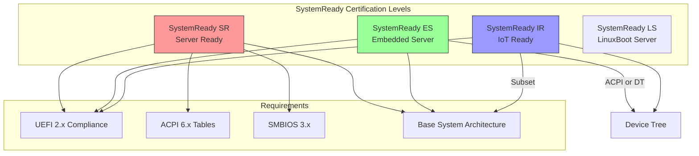
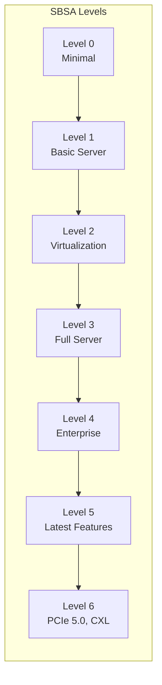
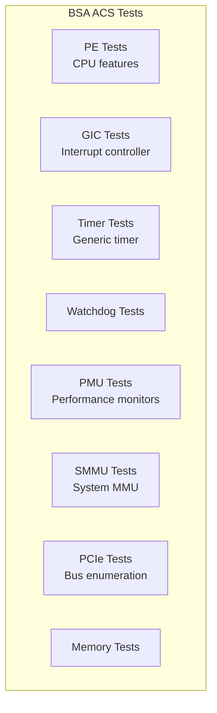
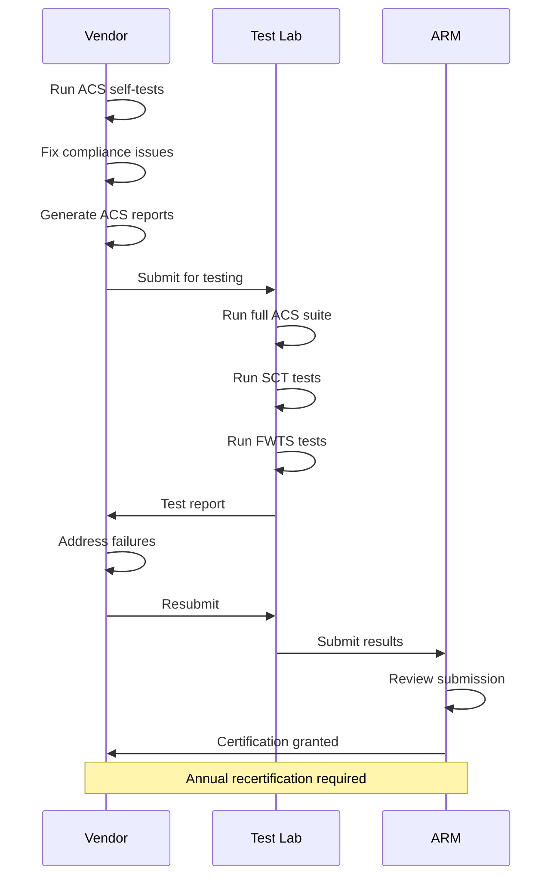

# Section 23.4: SystemReady Compliance

ARM SystemReady is a certification program ensuring ARM-based systems can run standard operating systems out of the box. This section covers compliance requirements and testing procedures.

## SystemReady Program Overview



## Certification Bands

| Band | Target Market | Firmware | HW Description | BSA Subset |
|------|--------------|----------|----------------|------------|
| SR | Servers | UEFI + ACPI | ACPI only | Full BSA |
| ES | Edge/Embedded | UEFI | ACPI or DT | BSA + SBSA |
| IR | IoT | UEFI | Device Tree | BSA subset |
| LS | Hyperscale | LinuxBoot | ACPI | Full BSA |

## Base System Architecture (BSA)

### BSA Requirements Summary

```c
// Key BSA requirements for UEFI firmware

// 1. Generic Timer
// - CNTFRQ_EL0 must be programmed
// - Timer interrupt connected to GIC

// 2. GIC (v2 or v3)
// - All cores see same interrupt configuration
// - SPIs for peripherals

// 3. UART
// - PL011 or SBSA Generic UART
// - Console accessible during boot

// 4. Watchdog Timer
// - SBSA-compliant watchdog
// - Two-stage timeout support

// 5. RTC
// - PL031 or SBSA Generic RTC

// BSA-compliant device base addresses
#define BSA_UART_BASE        0x09000000   // PL011 UART
#define BSA_GIC_DIST_BASE    0x08000000   // GICv3 Distributor
#define BSA_GIC_REDIST_BASE  0x080A0000   // GICv3 Redistributor
#define BSA_TIMER_BASE       0x09010000   // Generic Timer
#define BSA_WDT_BASE         0x09030000   // Watchdog
#define BSA_RTC_BASE         0x09040000   // RTC
```

### SBSA Level Compliance



| SBSA Level | Key Features |
|------------|--------------|
| Level 0 | Generic Timer, UART, basic interrupt controller |
| Level 1 | GICv3, PCIe, RTC, Watchdog |
| Level 2 | Virtualization support, GICv3 ITS |
| Level 3 | RAS, SMMU, System MMU |
| Level 4 | PMU extensions, Statistical profiling |
| Level 5 | MPAM, SVE support |
| Level 6 | PCIe 5.0, CXL, RME |

## Architecture Compliance Suite (ACS)

### Installing ACS

```bash
# Clone ACS repository
git clone https://github.com/ARM-software/arm-systemready.git
cd arm-systemready

# ACS components:
# - BSA-acs: Base System Architecture tests
# - SBSA-acs: Server BSA tests
# - FWTS: Firmware Test Suite
# - SCT: UEFI Self Certification Tests
```

### Building ACS for UEFI Shell

```bash
# Build BSA ACS UEFI application
cd arm-bsa-acs
git submodule update --init

# Using EDK2 build
export PACKAGES_PATH=/path/to/edk2:/path/to/arm-bsa-acs
cd /path/to/edk2
source edksetup.sh

build -a AARCH64 -t GCC5 -p ShellPkg/ShellPkg.dsc \
    -m /path/to/arm-bsa-acs/uefi_app/BsaAcs.inf

# Output: Bsa.efi
```

### Running ACS Tests

```bash
# In UEFI Shell
Shell> fs0:
FS0:\> Bsa.efi

# Run specific test levels
FS0:\> Bsa.efi -l 1        # Level 1 tests only
FS0:\> Bsa.efi -skip 1,3   # Skip tests 1 and 3

# Run SBSA tests (server platforms)
FS0:\> Sbsa.efi

# Full automation with SCT
FS0:\> Sct.efi -a          # Run all tests
FS0:\> Sct.efi -s test.seq # Run from sequence file
```

### ACS Test Categories



## UEFI Self Certification Tests (SCT)

### Building SCT

```bash
# Clone SCT repository
git clone https://github.com/tianocore/edk2-test.git
cd edk2-test/uefi-sct

# Build for AARCH64
./SctPkg/build.sh AARCH64 GCC

# Output in Build/UefiSct/
```

### SCT Test Suites

```c
// SCT test categories
typedef enum {
    EFI_TEST_CATEGORY_BOOT_SERVICES,
    EFI_TEST_CATEGORY_RUNTIME_SERVICES,
    EFI_TEST_CATEGORY_PROTOCOL,
    EFI_TEST_CATEGORY_CONFIGURATION,
    EFI_TEST_CATEGORY_LOAD_FILE,
} EFI_TEST_CATEGORY;

// Boot Services tests
// - Memory allocation
// - Event/Timer services
// - Protocol handler services
// - Image services

// Runtime Services tests
// - Variable services
// - Time services
// - Virtual memory
// - Reset system

// Protocol tests
// - Block I/O
// - Simple File System
// - Simple Text Input/Output
// - Graphics Output
// - Network protocols
```

### Running SCT

```bash
# Install SCT on USB/ESP
cp -r Build/UefiSct/DEBUG_GCC5/SctPackageAARCH64/ /mnt/esp/SCT/

# In UEFI Shell
Shell> fs0:
FS0:\> cd SCT
FS0:\SCT> Sct.efi

# SCT Menu options:
# 1. Standard test
# 2. Extended test
# 3. Interactive test
# 4. Generate report
```

## Firmware Test Suite (FWTS)

FWTS is a Linux-based test suite for firmware validation:

```bash
# Install FWTS
sudo apt install fwts

# Run all UEFI tests
sudo fwts uefi -

# Run ACPI tests
sudo fwts acpi -

# Run specific tests
sudo fwts uefirtmisc    # Runtime misc services
sudo fwts uefirtvariable # Variable services
sudo fwts madt          # MADT table check
sudo fwts gtdt          # Generic timer table

# Generate HTML report
sudo fwts --results-output=results.html

# ARM-specific tests
sudo fwts pptt           # Processor Properties Topology
sudo fwts iort           # IO Remapping Table
sudo fwts dbg2           # Debug Port Table 2
```

### FWTS Test Categories

```bash
# ACPI Table Tests
fwts facp    # Fixed ACPI Description Table
fwts madt    # Multiple APIC Description Table
fwts gtdt    # Generic Timer Description Table
fwts iort    # IO Remapping Table
fwts pptt    # Processor Properties Topology Table
fwts spcr    # Serial Port Console Redirection
fwts dbg2    # Debug Port Table 2

# UEFI Tests
fwts uefirtvariable      # Variable services
fwts uefirttime          # Time services
fwts uefibootpath        # Boot path validation

# SMBIOS Tests
fwts smbios              # SMBIOS structure validation
```

## Required ACPI Tables

### Mandatory Tables for SystemReady SR

```c
// Required ACPI tables for SystemReady SR
typedef struct {
    CHAR8   *TableName;
    BOOLEAN  Required;
} SYSTEMREADY_ACPI_TABLE;

SYSTEMREADY_ACPI_TABLE SrRequiredTables[] = {
    { "RSDP", TRUE },   // Root System Description Pointer
    { "XSDT", TRUE },   // Extended System Description Table
    { "FACP", TRUE },   // Fixed ACPI Description Table
    { "DSDT", TRUE },   // Differentiated System Description Table
    { "MADT", TRUE },   // Multiple APIC Description Table
    { "GTDT", TRUE },   // Generic Timer Description Table
    { "MCFG", TRUE },   // PCI Express config (if PCIe present)
    { "IORT", TRUE },   // IO Remapping Table
    { "PPTT", TRUE },   // Processor Properties Topology Table
    { "SPCR", TRUE },   // Serial Port Console Redirection
    { "DBG2", TRUE },   // Debug Port Table 2
    { "SSDT", FALSE },  // Secondary System Description Table
    { "BERT", FALSE },  // Boot Error Record Table
    { "HEST", FALSE },  // Hardware Error Source Table
    { "ERST", FALSE },  // Error Record Serialization Table
};
```

### ARM-Specific ACPI Tables

```c
// MADT for ARM GICv3
typedef struct {
    EFI_ACPI_6_3_MULTIPLE_APIC_DESCRIPTION_TABLE_HEADER Header;
    EFI_ACPI_6_3_GIC_STRUCTURE                          GicC[4];
    EFI_ACPI_6_3_GIC_DISTRIBUTOR_STRUCTURE              GicD;
    EFI_ACPI_6_3_GIC_ITS_STRUCTURE                      GicIts;
    EFI_ACPI_6_3_GIC_REDISTRIBUTOR_STRUCTURE            GicR;
} MADT_TABLE;

// GTDT - Generic Timer Description Table
typedef struct {
    EFI_ACPI_6_3_GENERIC_TIMER_DESCRIPTION_TABLE    Gtdt;
    EFI_ACPI_6_3_GTDT_GT_BLOCK_STRUCTURE           GtBlock;
    EFI_ACPI_6_3_GTDT_GT_BLOCK_TIMER_STRUCTURE     GtFrame0;
} GTDT_TABLE;

// IORT - IO Remapping Table
typedef struct {
    EFI_ACPI_6_0_IO_REMAPPING_TABLE        Header;
    EFI_ACPI_6_0_IO_REMAPPING_SMMU3_NODE   Smmu;
    EFI_ACPI_6_0_IO_REMAPPING_RC_NODE      RootComplex;
    EFI_ACPI_6_0_IO_REMAPPING_ITS_NODE     Its;
} IORT_TABLE;

// PPTT - Processor Properties Topology Table
typedef struct {
    EFI_ACPI_6_3_PPTT_HEADER              Header;
    EFI_ACPI_6_3_PPTT_STRUCTURE_PROCESSOR Package;
    EFI_ACPI_6_3_PPTT_STRUCTURE_PROCESSOR Cluster[2];
    EFI_ACPI_6_3_PPTT_STRUCTURE_PROCESSOR Cores[8];
    EFI_ACPI_6_3_PPTT_STRUCTURE_CACHE     L1ICache[8];
    EFI_ACPI_6_3_PPTT_STRUCTURE_CACHE     L1DCache[8];
    EFI_ACPI_6_3_PPTT_STRUCTURE_CACHE     L2Cache[8];
    EFI_ACPI_6_3_PPTT_STRUCTURE_CACHE     L3Cache[2];
} PPTT_TABLE;
```

## SMBIOS Requirements

```c
// Required SMBIOS structures
typedef enum {
    SMBIOS_TYPE_BIOS_INFO              = 0,   // Required
    SMBIOS_TYPE_SYSTEM_INFO            = 1,   // Required
    SMBIOS_TYPE_BASEBOARD_INFO         = 2,   // Required
    SMBIOS_TYPE_ENCLOSURE              = 3,   // Required
    SMBIOS_TYPE_PROCESSOR_INFO         = 4,   // Required
    SMBIOS_TYPE_CACHE_INFO             = 7,   // Required
    SMBIOS_TYPE_SYSTEM_SLOTS           = 9,   // If slots present
    SMBIOS_TYPE_PHYSICAL_MEMORY_ARRAY  = 16,  // Required
    SMBIOS_TYPE_MEMORY_DEVICE          = 17,  // Required
    SMBIOS_TYPE_MEMORY_ARRAY_MAPPED    = 19,  // Required
    SMBIOS_TYPE_SYSTEM_BOOT_INFO       = 32,  // Required
    SMBIOS_TYPE_IPMI_DEVICE            = 38,  // If IPMI present
    SMBIOS_TYPE_TPM_DEVICE             = 43,  // If TPM present
} SMBIOS_REQUIRED_TYPES;

// SMBIOS Type 4 for ARM
SMBIOS_TABLE_TYPE4 ProcessorInfo = {
    .Hdr = {
        .Type = SMBIOS_TYPE_PROCESSOR_INFO,
        .Length = sizeof(SMBIOS_TABLE_TYPE4),
    },
    .ProcessorType = CentralProcessor,
    .ProcessorFamily = ProcessorFamilyARMv8,
    .ProcessorManufacturer = 1,  // String index
    .ProcessorId = { 0 },        // Populated at runtime
    .ProcessorVersion = 2,       // String index
    .MaxSpeed = 2500,            // MHz
    .CurrentSpeed = 2500,
    .CoreCount = 8,
    .ThreadCount = 8,
    .ProcessorCharacteristics =
        PROCESSOR_64BIT_CAPABLE |
        PROCESSOR_MULTI_CORE |
        PROCESSOR_ARM64_SOC,
};
```

## Certification Process



### Self-Assessment Checklist

```markdown
## Pre-Certification Checklist

### UEFI Compliance
- [ ] UEFI 2.9+ implementation
- [ ] All required protocols present
- [ ] SCT passing rate > 95%
- [ ] Secure Boot capable

### ACPI Tables
- [ ] RSDP, XSDT, FACP, DSDT present
- [ ] MADT with correct GIC entries
- [ ] GTDT with timer config
- [ ] IORT for IO remapping
- [ ] PPTT for topology
- [ ] SPCR for console
- [ ] DBG2 for debug port
- [ ] FWTS ACPI tests pass

### BSA Compliance
- [ ] Generic Timer working
- [ ] GIC configured correctly
- [ ] UART accessible
- [ ] Watchdog functional
- [ ] BSA ACS tests pass

### SMBIOS
- [ ] Types 0,1,2,3,4,16,17,19,32 present
- [ ] Strings populated correctly
- [ ] FWTS SMBIOS tests pass

### Boot
- [ ] UEFI Shell boots
- [ ] OS installer boots
- [ ] Grub/systemd-boot work
- [ ] Distro boots correctly
```

## Common Compliance Issues

### Issue: GIC Configuration

```c
// Wrong: GIC not properly configured for all cores
// Fix: Ensure GICD and GICR are correctly set up

VOID
GicConfigureForCompliance (VOID)
{
    UINT32  Index;

    // 1. Configure Distributor
    GicV3DistributorInit(GIC_DISTRIBUTOR_BASE);

    // 2. Configure Redistributor for each CPU
    for (Index = 0; Index < CPU_COUNT; Index++) {
        GicV3RedistributorInit(
            GIC_REDISTRIBUTOR_BASE + Index * GICR_SIZE,
            Index
        );
    }

    // 3. Configure CPU interface
    GicV3CpuInterfaceInit();

    // 4. Verify with ACS
    // PE_GIC tests should pass
}
```

### Issue: Timer Frequency

```c
// Wrong: CNTFRQ_EL0 not programmed
// Fix: Set during early boot

VOID
ConfigureGenericTimer (VOID)
{
    // Must be done in EL3 or EL2
    UINT64 Freq = TIMER_FREQUENCY;  // e.g., 100MHz

    // Write counter frequency
    AsmWriteCntFrq(Freq);

    // Verify
    ASSERT(ArmGenericTimerGetTimerFreq() == Freq);
}
```

### Issue: Missing ACPI Tables

```c
// Common missing tables
// Fix: Ensure all required tables installed

EFI_STATUS
InstallSystemReadyTables (VOID)
{
    EFI_STATUS Status;

    // Must install: MADT, GTDT, IORT, PPTT, SPCR, DBG2

    Status = InstallMadtTable();
    ASSERT_EFI_ERROR(Status);

    Status = InstallGtdtTable();
    ASSERT_EFI_ERROR(Status);

    Status = InstallIortTable();
    ASSERT_EFI_ERROR(Status);

    Status = InstallPpttTable();
    ASSERT_EFI_ERROR(Status);

    Status = InstallSpcrTable();
    ASSERT_EFI_ERROR(Status);

    Status = InstallDbg2Table();
    ASSERT_EFI_ERROR(Status);

    return EFI_SUCCESS;
}
```

## Testing Automation

```bash
#!/bin/bash
# systemready-test.sh - Automated compliance testing

RESULTS_DIR=./results
mkdir -p $RESULTS_DIR

echo "=== SystemReady Compliance Testing ==="

# 1. Run BSA ACS
echo "Running BSA ACS..."
# Requires UEFI shell access or OS-level BSA tests
fwts bsa - --results-output=$RESULTS_DIR/bsa.html

# 2. Run FWTS
echo "Running FWTS..."
sudo fwts acpi uefi smbios --results-output=$RESULTS_DIR/fwts.html

# 3. Check ACPI tables
echo "Checking ACPI tables..."
for table in MADT GTDT IORT PPTT SPCR DBG2; do
    if [ -f /sys/firmware/acpi/tables/$table ]; then
        echo "  $table: FOUND"
    else
        echo "  $table: MISSING"
    fi
done

# 4. Check SMBIOS
echo "Checking SMBIOS..."
sudo dmidecode -t 0,1,2,3,4,16,17,19,32 > $RESULTS_DIR/smbios.txt

# 5. Generate summary
echo "Generating summary..."
cat > $RESULTS_DIR/summary.txt << EOF
SystemReady Compliance Test Results
====================================
Date: $(date)
Platform: $(cat /proc/device-tree/model 2>/dev/null || echo "Unknown")

BSA: See bsa.html
FWTS: See fwts.html
SMBIOS: See smbios.txt
EOF

echo "Results saved to $RESULTS_DIR/"
```

## References

- [ARM SystemReady Program](https://www.arm.com/architecture/system-architectures/systemready-certification-program)
- [BSA Specification](https://developer.arm.com/documentation/den0094/latest)
- [SBSA Specification](https://developer.arm.com/documentation/den0029/latest)
- [ACS GitHub Repository](https://github.com/ARM-software/arm-systemready)
- [FWTS Documentation](https://wiki.ubuntu.com/FirmwareTestSuite)

---

*Next: [Section 23.5: Platform Configuration]() - PCDs, memory map, and GIC setup.*
