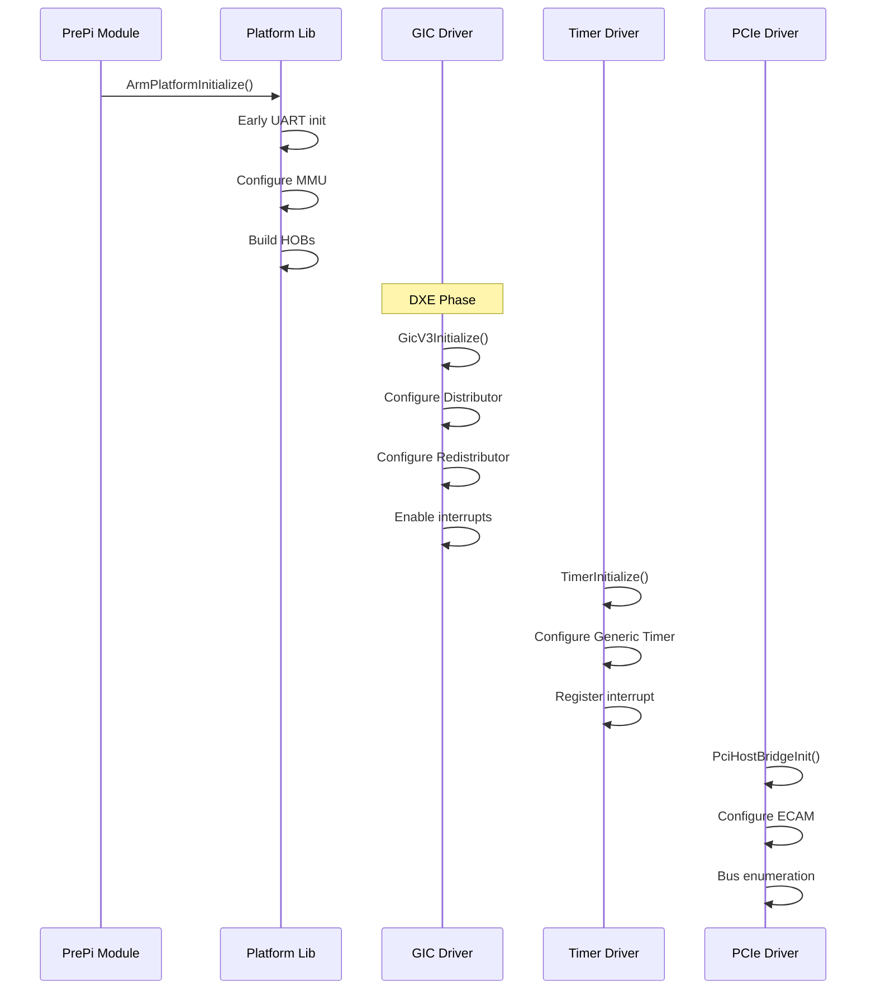

# Section 23.5: Platform Configuration

ARM platform configuration involves PCDs, memory mapping, GIC setup, and peripheral initialization. This section covers the key configuration areas for ARM UEFI platforms.

## Platform Configuration Database (PCD)

### Essential ARM PCDs

```ini
# Platform DSC file - [PcdsFixedAtBuild] section

[PcdsFixedAtBuild.common]
  #
  # System Memory Configuration
  #
  gArmTokenSpaceGuid.PcdSystemMemoryBase|0x80000000
  gArmTokenSpaceGuid.PcdSystemMemorySize|0x100000000    # 4GB

  #
  # CPU Configuration
  #
  gArmTokenSpaceGuid.PcdArmPrimaryCoreMask|0x0
  gArmTokenSpaceGuid.PcdArmPrimaryCore|0x0
  gArmTokenSpaceGuid.PcdCpuVectorBaseAddress|0x00000000

  #
  # GIC Configuration
  #
  gArmTokenSpaceGuid.PcdGicDistributorBase|0x08000000
  gArmTokenSpaceGuid.PcdGicRedistributorsBase|0x080A0000
  gArmTokenSpaceGuid.PcdGicInterruptInterfaceBase|0x08010000

  #
  # Generic Timer
  #
  gArmTokenSpaceGuid.PcdArmArchTimerSecIntrNum|29
  gArmTokenSpaceGuid.PcdArmArchTimerIntrNum|30
  gArmTokenSpaceGuid.PcdArmArchTimerVirtIntrNum|27
  gArmTokenSpaceGuid.PcdArmArchTimerHypIntrNum|26
  gArmTokenSpaceGuid.PcdArmArchTimerFreqInHz|100000000   # 100MHz

  #
  # UART Configuration
  #
  gEfiMdeModulePkgTokenSpaceGuid.PcdSerialRegisterBase|0x09000000
  gEfiMdePkgTokenSpaceGuid.PcdUartDefaultBaudRate|115200
  gEfiMdePkgTokenSpaceGuid.PcdUartDefaultDataBits|8
  gEfiMdePkgTokenSpaceGuid.PcdUartDefaultParity|1
  gEfiMdePkgTokenSpaceGuid.PcdUartDefaultStopBits|1
```

### Memory Map PCDs

```ini
[PcdsFixedAtBuild.common]
  #
  # UEFI Memory Regions
  #
  # FD (Firmware Device) location
  gArmTokenSpaceGuid.PcdFdBaseAddress|0x00000000
  gArmTokenSpaceGuid.PcdFdSize|0x00400000              # 4MB

  # FV (Firmware Volume) location
  gArmTokenSpaceGuid.PcdFvBaseAddress|0x00000000
  gArmTokenSpaceGuid.PcdFvSize|0x00400000

  # Stack configuration
  gArmPlatformTokenSpaceGuid.PcdCPUCorePrimaryStackSize|0x10000

  # Reserved regions
  gArmTokenSpaceGuid.PcdTrustedFirmwareMemoryBase|0x04000000
  gArmTokenSpaceGuid.PcdTrustedFirmwareMemorySize|0x01000000

  # MMIO Regions (for resource descriptors)
  gArmTokenSpaceGuid.PcdPciIoBase|0x00000000
  gArmTokenSpaceGuid.PcdPciIoSize|0x00010000
  gArmTokenSpaceGuid.PcdPciMmio32Base|0x10000000
  gArmTokenSpaceGuid.PcdPciMmio32Size|0x2EFF0000
  gArmTokenSpaceGuid.PcdPciMmio64Base|0x8000000000
  gArmTokenSpaceGuid.PcdPciMmio64Size|0x8000000000
```

### Dynamic PCDs

```ini
[PcdsDynamicDefault.common]
  #
  # Boot configuration (can be changed at runtime)
  #
  gEfiMdePkgTokenSpaceGuid.PcdPlatformBootTimeOut|3

  #
  # ConOut/ConIn configuration
  #
  gEfiMdeModulePkgTokenSpaceGuid.PcdConOutRow|0
  gEfiMdeModulePkgTokenSpaceGuid.PcdConOutColumn|0
  gEfiMdeModulePkgTokenSpaceGuid.PcdVideoHorizontalResolution|1920
  gEfiMdeModulePkgTokenSpaceGuid.PcdVideoVerticalResolution|1080
```

## Memory Map Configuration

### Memory Region Types

```c
// Platform memory map definition
// PlatformLib.c

#define MAX_VIRTUAL_MEMORY_MAP_DESCRIPTORS  16

ARM_MEMORY_REGION_DESCRIPTOR VirtualMemoryTable[] = {
    // System RAM
    {
        PcdGet64(PcdSystemMemoryBase),              // Base
        PcdGet64(PcdSystemMemoryBase),              // Virtual (same for 1:1)
        PcdGet64(PcdSystemMemorySize),              // Length
        ARM_MEMORY_REGION_ATTRIBUTE_WRITE_BACK      // Attributes
    },

    // Firmware Volume (Flash)
    {
        PcdGet64(PcdFdBaseAddress),
        PcdGet64(PcdFdBaseAddress),
        PcdGet64(PcdFdSize),
        ARM_MEMORY_REGION_ATTRIBUTE_WRITE_BACK_RO
    },

    // GIC Distributor
    {
        PcdGet64(PcdGicDistributorBase),
        PcdGet64(PcdGicDistributorBase),
        SIZE_64KB,
        ARM_MEMORY_REGION_ATTRIBUTE_DEVICE
    },

    // GIC Redistributors
    {
        PcdGet64(PcdGicRedistributorsBase),
        PcdGet64(PcdGicRedistributorsBase),
        SIZE_1MB,
        ARM_MEMORY_REGION_ATTRIBUTE_DEVICE
    },

    // UART
    {
        PcdGet64(PcdSerialRegisterBase),
        PcdGet64(PcdSerialRegisterBase),
        SIZE_4KB,
        ARM_MEMORY_REGION_ATTRIBUTE_DEVICE
    },

    // PCIe ECAM
    {
        PCIE_ECAM_BASE,
        PCIE_ECAM_BASE,
        PCIE_ECAM_SIZE,
        ARM_MEMORY_REGION_ATTRIBUTE_DEVICE
    },

    // PCIe MMIO
    {
        PCIE_MMIO_BASE,
        PCIE_MMIO_BASE,
        PCIE_MMIO_SIZE,
        ARM_MEMORY_REGION_ATTRIBUTE_DEVICE
    },

    // End of table
    { 0, 0, 0, 0 }
};

VOID
ArmPlatformGetVirtualMemoryMap (
    OUT ARM_MEMORY_REGION_DESCRIPTOR **VirtualMemoryMap
    )
{
    *VirtualMemoryMap = VirtualMemoryTable;
}
```

### Memory Attributes

```c
// Memory region attributes
typedef enum {
    // Device memory (non-cacheable, non-bufferable)
    ARM_MEMORY_REGION_ATTRIBUTE_DEVICE = 0,

    // Normal memory - Uncached
    ARM_MEMORY_REGION_ATTRIBUTE_UNCACHED_UNBUFFERED,

    // Normal memory - Write-Through
    ARM_MEMORY_REGION_ATTRIBUTE_WRITE_THROUGH,

    // Normal memory - Write-Back (default for RAM)
    ARM_MEMORY_REGION_ATTRIBUTE_WRITE_BACK,

    // Read-Only variants
    ARM_MEMORY_REGION_ATTRIBUTE_WRITE_BACK_RO,
    ARM_MEMORY_REGION_ATTRIBUTE_WRITE_THROUGH_RO,

    // Execute-Never variants
    ARM_MEMORY_REGION_ATTRIBUTE_WRITE_BACK_XN,
    ARM_MEMORY_REGION_ATTRIBUTE_DEVICE_XN,
} ARM_MEMORY_REGION_ATTRIBUTES;
```

## GIC Configuration

### GICv3 Initialization

```c
// GIC Driver - GicV3/GicV3Dxe.c

EFI_STATUS
EFIAPI
GicV3Initialize (
    IN EFI_HANDLE        ImageHandle,
    IN EFI_SYSTEM_TABLE  *SystemTable
    )
{
    UINTN   GicDistributorBase;
    UINTN   GicRedistributorBase;

    GicDistributorBase = PcdGet64(PcdGicDistributorBase);
    GicRedistributorBase = PcdGet64(PcdGicRedistributorsBase);

    // 1. Initialize Distributor
    GicV3DistributorInit(GicDistributorBase);

    // 2. Initialize Redistributor for BSP
    GicV3ReDistributorInit(GicRedistributorBase);

    // 3. Initialize CPU interface
    GicV3CpuIfInit();

    // 4. Install Hardware Interrupt Protocol
    return InstallAndRegisterInterruptProtocol();
}

STATIC
VOID
GicV3DistributorInit (
    IN UINTN  GicDistributorBase
    )
{
    UINT32  NumIt;
    UINT32  Index;

    // Wait for RWP to clear
    GicV3WaitForRwp(GicDistributorBase);

    // Get number of interrupt lines
    NumIt = MmioRead32(GicDistributorBase + GICD_TYPER);
    NumIt = ((NumIt & 0x1F) + 1) * 32;

    // Disable all interrupts
    for (Index = 0; Index < (NumIt / 32); Index++) {
        MmioWrite32(
            GicDistributorBase + GICD_ICENABLER + (Index * 4),
            0xFFFFFFFF
        );
    }

    // Set all SPIs to Group 1 Non-Secure
    for (Index = 1; Index < (NumIt / 32); Index++) {
        MmioWrite32(
            GicDistributorBase + GICD_IGROUPR + (Index * 4),
            0xFFFFFFFF
        );
    }

    // Enable Affinity Routing, ARE_S and ARE_NS
    MmioOr32(GicDistributorBase + GICD_CTLR,
             GICD_CTLR_ARE_S | GICD_CTLR_ARE_NS);

    // Enable Group 1 Non-Secure interrupts
    MmioOr32(GicDistributorBase + GICD_CTLR,
             GICD_CTLR_ENABLE_GRP1_NS);
}

STATIC
VOID
GicV3CpuIfInit (
    VOID
    )
{
    // Set priority mask (allow all priorities)
    ArmGicV3SetPriorityMask(0xFF);

    // Set Binary Point Register
    ArmGicV3SetBinaryPointer(0);

    // Enable Group 1 Non-Secure for EL1
    ArmGicV3EnableInterruptInterface();
}
```

### Interrupt Routing Configuration

```c
// Configure interrupt routing for specific SPI
EFI_STATUS
ConfigureInterrupt (
    IN UINTN   IntId,
    IN UINTN   Priority,
    IN UINTN   TargetCpu
    )
{
    UINTN  GicDistributorBase = PcdGet64(PcdGicDistributorBase);
    UINT64 Mpidr;

    // Get target CPU's MPIDR for affinity routing
    Mpidr = GetCpuMpidr(TargetCpu);

    // Configure priority
    MmioWrite8(
        GicDistributorBase + GICD_IPRIORITYR + IntId,
        (UINT8)Priority
    );

    // Configure affinity routing (GICv3)
    MmioWrite64(
        GicDistributorBase + GICD_IROUTER + (IntId * 8),
        Mpidr & 0xFF00FFFFFF  // Aff0, Aff1, Aff2, Aff3
    );

    // Configure as edge or level triggered
    GicV3SetTriggerType(IntId, TRIGGER_LEVEL);

    // Enable the interrupt
    GicV3EnableInterrupt(IntId);

    return EFI_SUCCESS;
}
```

## Timer Configuration

### Generic Timer Setup

```c
// Platform timer configuration
EFI_STATUS
EFIAPI
TimerInitialize (
    IN EFI_HANDLE        ImageHandle,
    IN EFI_SYSTEM_TABLE  *SystemTable
    )
{
    EFI_STATUS  Status;
    UINT64      TimerFreq;
    UINT32      TimerHypIntr;
    UINT32      TimerSecIntr;
    UINT32      TimerIntr;
    UINT32      TimerVirtIntr;

    // Get timer frequency
    TimerFreq = ArmGenericTimerGetTimerFreq();

    // Verify frequency matches PCD
    if (TimerFreq != PcdGet64(PcdArmArchTimerFreqInHz)) {
        DEBUG((DEBUG_WARN, "Timer frequency mismatch!\n"));
    }

    // Get interrupt numbers from PCDs
    TimerHypIntr  = PcdGet32(PcdArmArchTimerHypIntrNum);
    TimerSecIntr  = PcdGet32(PcdArmArchTimerSecIntrNum);
    TimerIntr     = PcdGet32(PcdArmArchTimerIntrNum);
    TimerVirtIntr = PcdGet32(PcdArmArchTimerVirtIntrNum);

    // Register timer interrupt handler
    Status = gInterrupt->RegisterInterruptSource(
        gInterrupt,
        TimerIntr,
        TimerInterruptHandler
    );

    // Enable timer interrupt
    Status = gInterrupt->EnableInterruptSource(
        gInterrupt,
        TimerIntr
    );

    return Status;
}
```

### Watchdog Configuration

```c
// SBSA Generic Watchdog
#define WATCHDOG_CONTROL_BASE    0x09050000
#define WATCHDOG_REFRESH_BASE    0x09060000

#define WDOG_CTRL_ENABLE         BIT0
#define WDOG_CTRL_INTR_ENABLE    BIT1

EFI_STATUS
WatchdogInitialize (
    IN UINT32  TimeoutMs
    )
{
    UINT64  TimerFreq;
    UINT64  WatchdogValue;

    TimerFreq = ArmGenericTimerGetTimerFreq();
    WatchdogValue = (TimerFreq * TimeoutMs) / 1000;

    // Set watchdog offset
    MmioWrite32(WATCHDOG_CONTROL_BASE + WDOG_WOR, WatchdogValue);

    // Enable watchdog
    MmioWrite32(WATCHDOG_CONTROL_BASE + WDOG_WCS,
                WDOG_CTRL_ENABLE);

    return EFI_SUCCESS;
}

VOID
WatchdogRefresh (
    VOID
    )
{
    // Writing any value refreshes the watchdog
    MmioWrite32(WATCHDOG_REFRESH_BASE + WDOG_WRR, 1);
}
```

## Serial Console Configuration

### PL011 UART Setup

```c
// PL011 UART initialization
#define PL011_UARTCR_UARTEN    BIT0
#define PL011_UARTCR_TXE       BIT8
#define PL011_UARTCR_RXE       BIT9

EFI_STATUS
Pl011UartInitialize (
    IN UINTN  UartBase,
    IN UINT32 ClockHz,
    IN UINT32 BaudRate
    )
{
    UINT32  Divider;
    UINT32  IntPart;
    UINT32  FracPart;

    // Disable UART
    MmioWrite32(UartBase + UARTCR, 0);

    // Set baud rate
    // Divider = Clock / (16 * BaudRate)
    Divider = (ClockHz * 4) / BaudRate;
    IntPart = Divider >> 6;
    FracPart = Divider & 0x3F;

    MmioWrite32(UartBase + UARTIBRD, IntPart);
    MmioWrite32(UartBase + UARTFBRD, FracPart);

    // Configure: 8-bit, no parity, 1 stop, FIFO enabled
    MmioWrite32(UartBase + UARTLCR_H,
                PL011_UARTLCR_H_WLEN_8 | PL011_UARTLCR_H_FEN);

    // Enable UART, TX, RX
    MmioWrite32(UartBase + UARTCR,
                PL011_UARTCR_UARTEN |
                PL011_UARTCR_TXE |
                PL011_UARTCR_RXE);

    return EFI_SUCCESS;
}
```

### SPCR Table Generation

```c
// Serial Port Console Redirection Table
STATIC
EFI_ACPI_SERIAL_PORT_CONSOLE_REDIRECTION_TABLE Spcr = {
    .Header = {
        .Signature = EFI_ACPI_6_3_SPCR_SIGNATURE,
        .Length = sizeof(EFI_ACPI_SERIAL_PORT_CONSOLE_REDIRECTION_TABLE),
        .Revision = 2,
    },
    .InterfaceType = EFI_ACPI_SERIAL_PORT_CONSOLE_REDIRECTION_TABLE_INTERFACE_TYPE_ARM_PL011,
    .BaseAddress = {
        .AddressSpaceId = EFI_ACPI_6_3_SYSTEM_MEMORY,
        .RegisterBitWidth = 32,
        .RegisterBitOffset = 0,
        .AccessSize = EFI_ACPI_6_3_DWORD,
        .Address = UART_BASE_ADDRESS,
    },
    .InterruptType = EFI_ACPI_SERIAL_PORT_CONSOLE_REDIRECTION_TABLE_INTERRUPT_TYPE_GIC,
    .Irq = 0,  // Not used for GIC
    .GlobalSystemInterrupt = UART_INTERRUPT,
    .BaudRate = EFI_ACPI_SERIAL_PORT_CONSOLE_REDIRECTION_TABLE_BAUD_RATE_115200,
    .Parity = EFI_ACPI_SERIAL_PORT_CONSOLE_REDIRECTION_TABLE_PARITY_NO_PARITY,
    .StopBits = EFI_ACPI_SERIAL_PORT_CONSOLE_REDIRECTION_TABLE_STOP_BITS_1,
    .FlowControl = 0,
    .TerminalType = EFI_ACPI_SERIAL_PORT_CONSOLE_REDIRECTION_TABLE_TERMINAL_TYPE_VT_UTF8,
    .PciDeviceId = 0xFFFF,
    .PciVendorId = 0xFFFF,
};
```

## PCIe Configuration

### ECAM Configuration

```c
// PCIe ECAM (Enhanced Configuration Access Mechanism)
#define PCIE_ECAM_BASE       0x4010000000ULL
#define PCIE_ECAM_SIZE       0x10000000ULL    // 256MB for 256 buses
#define PCIE_SEGMENT         0

// PCI Express configuration
[PcdsFixedAtBuild.common]
  gEfiMdePkgTokenSpaceGuid.PcdPciExpressBaseAddress|0x4010000000
  gArmTokenSpaceGuid.PcdPciBusMin|0
  gArmTokenSpaceGuid.PcdPciBusMax|255

// MCFG table for ECAM
STATIC
EFI_ACPI_MEMORY_MAPPED_CONFIGURATION_BASE_ADDRESS_TABLE_HEADER Mcfg = {
    .Header = {
        .Signature = EFI_ACPI_6_3_MCFG_SIGNATURE,
        .Length = sizeof(Mcfg) + sizeof(EFI_ACPI_MEMORY_MAPPED_ENHANCED_CONFIGURATION_SPACE_BASE_ADDRESS_ALLOCATION_STRUCTURE),
        .Revision = 1,
    },
};

EFI_ACPI_MEMORY_MAPPED_ENHANCED_CONFIGURATION_SPACE_BASE_ADDRESS_ALLOCATION_STRUCTURE McfgEntry = {
    .BaseAddress = PCIE_ECAM_BASE,
    .PciSegmentGroupNumber = PCIE_SEGMENT,
    .StartBusNumber = 0,
    .EndBusNumber = 255,
};
```

### Root Complex Configuration

```c
// PCIe Root Complex initialization
EFI_STATUS
PciHostBridgeInit (
    VOID
    )
{
    // 1. Configure SMMU for PCIe (if present)
    SmmuConfigurePcie();

    // 2. Enable root complex
    MmioOr32(PCIE_RC_BASE + RC_CONTROL, RC_ENABLE);

    // 3. Configure memory windows
    ConfigurePcieMemoryWindows();

    // 4. Wait for link training
    while (!(MmioRead32(PCIE_RC_BASE + RC_LINK_STATUS) & LINK_UP)) {
        // Timeout handling
    }

    // 5. Bus enumeration happens via PciHostBridgeDxe

    return EFI_SUCCESS;
}
```

## Platform Initialization Sequence



## Platform Configuration Checklist

```markdown
## ARM Platform Configuration Checklist

### Memory Map
- [ ] System RAM base and size
- [ ] Flash/FD location
- [ ] Reserved memory for TF-A
- [ ] MMIO regions for peripherals
- [ ] PCIe memory windows

### GIC
- [ ] Distributor base address
- [ ] Redistributor base address
- [ ] CPU interface configuration
- [ ] Interrupt routing

### Timer
- [ ] Timer frequency
- [ ] Timer interrupt numbers
- [ ] Watchdog configuration

### Serial Console
- [ ] UART base address
- [ ] UART clock frequency
- [ ] Baud rate settings
- [ ] SPCR table

### PCIe (if present)
- [ ] ECAM base address
- [ ] Bus range
- [ ] Memory windows (32-bit and 64-bit)
- [ ] MCFG table

### ACPI Tables
- [ ] All required tables configured
- [ ] Correct hardware addresses
- [ ] Valid interrupt mappings
```

## References

- [EDK2 ArmPkg PCDs](https://github.com/tianocore/edk2/blob/master/ArmPkg/ArmPkg.dec)
- [ARM GIC Architecture](https://developer.arm.com/documentation/ihi0069/latest)
- [ARM Generic Timer](https://developer.arm.com/documentation/ddi0487/latest)
- [PCI Express ECAM](https://pcisig.com/specifications)

---

*Next: [Section 23.6: Device Tree & ACPI](../23-6-dt-acpi/) - Hardware description for ARM platforms.*
