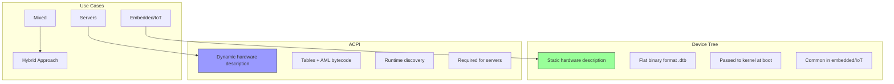

# Section 23.6: Device Tree & ACPI

ARM platforms support both Device Tree (DT) and ACPI for hardware description. Understanding when and how to use each is crucial for ARM UEFI development.

## Device Tree vs ACPI



### Comparison Table

| Aspect | Device Tree | ACPI |
|--------|-------------|------|
| Format | DTS (source) → DTB (binary) | ASL (source) → AML (binary) |
| Runtime | Static, passed at boot | Dynamic, queried at runtime |
| Power Mgmt | Minimal | Comprehensive (S-states, P-states) |
| Hotplug | Limited | Full support |
| SystemReady | IR (IoT) | SR (Server), ES (optional) |
| Complexity | Lower | Higher |
| Tooling | dtc, fdtdump | iasl, acpica |

## Device Tree in UEFI

### DT Source Structure

```dts
// Example platform device tree
/dts-v1/;

/ {
    compatible = "vendor,platform";
    model = "Vendor Platform Board";
    #address-cells = <2>;
    #size-cells = <2>;

    cpus {
        #address-cells = <1>;
        #size-cells = <0>;

        cpu@0 {
            device_type = "cpu";
            compatible = "arm,cortex-a76";
            reg = <0x0>;
            enable-method = "psci";
        };

        cpu@1 {
            device_type = "cpu";
            compatible = "arm,cortex-a76";
            reg = <0x1>;
            enable-method = "psci";
        };
    };

    psci {
        compatible = "arm,psci-1.0";
        method = "smc";
    };

    memory@80000000 {
        device_type = "memory";
        reg = <0x0 0x80000000 0x0 0x80000000>; /* 2GB at 0x80000000 */
    };

    timer {
        compatible = "arm,armv8-timer";
        interrupts = <GIC_PPI 13 IRQ_TYPE_LEVEL_LOW>,
                     <GIC_PPI 14 IRQ_TYPE_LEVEL_LOW>,
                     <GIC_PPI 11 IRQ_TYPE_LEVEL_LOW>,
                     <GIC_PPI 10 IRQ_TYPE_LEVEL_LOW>;
    };

    gic: interrupt-controller@8000000 {
        compatible = "arm,gic-v3";
        reg = <0x0 0x08000000 0x0 0x10000>,    /* GICD */
              <0x0 0x080a0000 0x0 0x200000>;   /* GICR */
        #interrupt-cells = <3>;
        interrupt-controller;
    };

    uart0: serial@9000000 {
        compatible = "arm,pl011", "arm,primecell";
        reg = <0x0 0x09000000 0x0 0x1000>;
        interrupts = <GIC_SPI 1 IRQ_TYPE_LEVEL_HIGH>;
        clocks = <&apb_clk>;
        clock-names = "apb_pclk";
    };

    pcie@10000000 {
        compatible = "pci-host-ecam-generic";
        reg = <0x0 0x4010000000 0x0 0x10000000>;
        bus-range = <0 255>;
        #address-cells = <3>;
        #size-cells = <2>;
        ranges = <0x01000000 0x0 0x00000000 0x0 0x3eff0000 0x0 0x10000>,
                 <0x02000000 0x0 0x10000000 0x0 0x10000000 0x0 0x2eff0000>,
                 <0x03000000 0x4 0x00000000 0x4 0x00000000 0x4 0x00000000>;
    };
};
```

### Compiling Device Tree

```bash
# Compile DTS to DTB
dtc -I dts -O dtb -o platform.dtb platform.dts

# Decompile DTB to DTS
dtc -I dtb -O dts -o platform.dts platform.dtb

# Include from fragments
dtc -@ -I dts -O dtb \
    -i /path/to/include \
    -o platform.dtb platform.dts

# Verify DTB
fdtdump platform.dtb
```

### UEFI DTB Handling

```c
// Loading and patching DTB in UEFI
EFI_STATUS
PrepareDtb (
    OUT VOID  **DtbBase,
    OUT UINTN  *DtbSize
    )
{
    EFI_STATUS  Status;
    VOID        *OriginalDtb;
    VOID        *UpdatedDtb;
    INT32       FdtErr;

    // Load DTB from FV or filesystem
    Status = GetSectionFromAnyFv(
        &gDtbFileGuid,
        EFI_SECTION_RAW,
        0,
        &OriginalDtb,
        DtbSize
    );

    // Create working copy with extra space
    UpdatedDtb = AllocatePages(EFI_SIZE_TO_PAGES(*DtbSize + DTB_PADDING));
    CopyMem(UpdatedDtb, OriginalDtb, *DtbSize);

    // Open for editing
    FdtErr = fdt_open_into(UpdatedDtb, UpdatedDtb, *DtbSize + DTB_PADDING);
    if (FdtErr != 0) {
        return EFI_DEVICE_ERROR;
    }

    // Patch memory node with actual detected memory
    PatchMemoryNode(UpdatedDtb);

    // Add chosen node with boot arguments
    PatchChosenNode(UpdatedDtb);

    // Add UEFI-specific nodes
    AddUefiNode(UpdatedDtb);

    // Pack the DTB
    fdt_pack(UpdatedDtb);

    *DtbBase = UpdatedDtb;
    *DtbSize = fdt_totalsize(UpdatedDtb);

    return EFI_SUCCESS;
}

STATIC
VOID
PatchMemoryNode (
    IN VOID  *Dtb
    )
{
    INT32   MemNode;
    UINT64  MemBase = PcdGet64(PcdSystemMemoryBase);
    UINT64  MemSize = PcdGet64(PcdSystemMemorySize);
    UINT64  RegProp[2];

    MemNode = fdt_path_offset(Dtb, "/memory");
    if (MemNode < 0) {
        return;
    }

    // Set memory base and size (big-endian)
    RegProp[0] = cpu_to_fdt64(MemBase);
    RegProp[1] = cpu_to_fdt64(MemSize);

    fdt_setprop(Dtb, MemNode, "reg", RegProp, sizeof(RegProp));
}

STATIC
VOID
PatchChosenNode (
    IN VOID  *Dtb
    )
{
    INT32  ChosenNode;
    CHAR8  *BootArgs = "console=ttyAMA0 earlycon=pl011,0x09000000";

    ChosenNode = fdt_path_offset(Dtb, "/chosen");
    if (ChosenNode < 0) {
        ChosenNode = fdt_add_subnode(Dtb, 0, "chosen");
    }

    fdt_setprop_string(Dtb, ChosenNode, "bootargs", BootArgs);

    // Set stdout-path
    fdt_setprop_string(Dtb, ChosenNode, "stdout-path", "serial0:115200n8");
}
```

### Installing DTB as Configuration Table

```c
// Install DTB for OS access
EFI_STATUS
InstallDtbConfigurationTable (
    IN VOID   *Dtb,
    IN UINTN   DtbSize
    )
{
    EFI_STATUS  Status;

    // Validate DTB
    if (fdt_check_header(Dtb) != 0) {
        return EFI_INVALID_PARAMETER;
    }

    // Install as UEFI configuration table
    Status = gBS->InstallConfigurationTable(
        &gFdtTableGuid,
        Dtb
    );

    return Status;
}
```

## ACPI Tables for ARM

### Required ARM ACPI Tables

```c
// ARM-specific ACPI tables
typedef struct {
    CHAR8   Signature[4];
    BOOLEAN Required;
    CHAR8   *Description;
} ARM_ACPI_TABLE_INFO;

ARM_ACPI_TABLE_INFO ArmAcpiTables[] = {
    // Standard tables
    { "XSDT", TRUE,  "Extended System Description Table" },
    { "FACP", TRUE,  "Fixed ACPI Description Table" },
    { "DSDT", TRUE,  "Differentiated System Description Table" },

    // ARM-mandatory tables
    { "MADT", TRUE,  "Multiple APIC Description Table (GIC)" },
    { "GTDT", TRUE,  "Generic Timer Description Table" },
    { "IORT", TRUE,  "IO Remapping Table" },
    { "PPTT", TRUE,  "Processor Properties Topology Table" },
    { "SPCR", TRUE,  "Serial Port Console Redirection" },
    { "DBG2", TRUE,  "Debug Port Table 2" },

    // Optional but common
    { "MCFG", FALSE, "PCI Express config (if PCIe)" },
    { "SSDT", FALSE, "Secondary System Description Table" },
    { "BERT", FALSE, "Boot Error Record Table" },
    { "HEST", FALSE, "Hardware Error Source Table" },
    { "SDEI", FALSE, "Software Delegated Exception Interface" },
};
```

### MADT for GICv3

```c
// MADT structure for ARM GICv3
#pragma pack(1)
typedef struct {
    EFI_ACPI_6_4_MULTIPLE_APIC_DESCRIPTION_TABLE_HEADER   Header;
    EFI_ACPI_6_4_GIC_STRUCTURE                            GicC[MAX_CPU_COUNT];
    EFI_ACPI_6_4_GIC_DISTRIBUTOR_STRUCTURE                GicD;
    EFI_ACPI_6_4_GIC_REDISTRIBUTOR_STRUCTURE              GicR;
    EFI_ACPI_6_4_GIC_ITS_STRUCTURE                        GicIts;
} MADT_TABLE;
#pragma pack()

STATIC MADT_TABLE Madt = {
    .Header = {
        .Header = {
            .Signature = EFI_ACPI_6_4_MULTIPLE_APIC_DESCRIPTION_TABLE_SIGNATURE,
            .Length = sizeof(MADT_TABLE),
            .Revision = 6,
        },
        .LocalApicAddress = 0,
        .Flags = 0,
    },

    // CPU interfaces (one per core)
    .GicC[0] = {
        .Type = EFI_ACPI_6_4_GIC,
        .Length = sizeof(EFI_ACPI_6_4_GIC_STRUCTURE),
        .CPUInterfaceNumber = 0,
        .AcpiProcessorUid = 0,
        .Flags = EFI_ACPI_6_4_GIC_ENABLED,
        .MPIDR = 0x00000000,
        .ParkedAddress = 0,
        .PhysicalBaseAddress = 0,        // GICv3: not used
        .GICV = 0,
        .GICH = 0,
        .VGICMaintenanceInterrupt = 25,
        .GICRBaseAddress = GICR_BASE + 0 * GICR_SIZE,
    },
    // ... more cores ...

    // Distributor
    .GicD = {
        .Type = EFI_ACPI_6_4_GICD,
        .Length = sizeof(EFI_ACPI_6_4_GIC_DISTRIBUTOR_STRUCTURE),
        .PhysicalBaseAddress = GICD_BASE,
        .SystemVectorBase = 0,
        .GicVersion = EFI_ACPI_6_4_GIC_V3,
    },

    // Redistributor
    .GicR = {
        .Type = EFI_ACPI_6_4_GICR,
        .Length = sizeof(EFI_ACPI_6_4_GIC_REDISTRIBUTOR_STRUCTURE),
        .DiscoveryRangeBaseAddress = GICR_BASE,
        .DiscoveryRangeLength = CPU_COUNT * GICR_SIZE,
    },

    // ITS (Interrupt Translation Service)
    .GicIts = {
        .Type = EFI_ACPI_6_4_GIC_ITS,
        .Length = sizeof(EFI_ACPI_6_4_GIC_ITS_STRUCTURE),
        .PhysicalBaseAddress = GITS_BASE,
    },
};
```

### GTDT (Generic Timer Description Table)

```c
#pragma pack(1)
typedef struct {
    EFI_ACPI_6_4_GENERIC_TIMER_DESCRIPTION_TABLE  Header;
    EFI_ACPI_6_4_GTDT_GT_BLOCK_STRUCTURE         GtBlock;
    EFI_ACPI_6_4_GTDT_GT_BLOCK_TIMER_STRUCTURE   Timer0;
    EFI_ACPI_6_4_GTDT_SBSA_GENERIC_WATCHDOG      Watchdog;
} GTDT_TABLE;
#pragma pack()

STATIC GTDT_TABLE Gtdt = {
    .Header = {
        .Header = {
            .Signature = EFI_ACPI_6_4_GTDT_SIGNATURE,
            .Length = sizeof(GTDT_TABLE),
            .Revision = 3,
        },
        .CntControlBasePhysicalAddress = 0xFFFFFFFFFFFFFFFF,
        .SecurePL1TimerGSIV = 29,
        .SecurePL1TimerFlags = EFI_ACPI_6_4_GTDT_GT_FLAG_TIMER_INTERRUPT_POLARITY,
        .NonSecurePL1TimerGSIV = 30,
        .NonSecurePL1TimerFlags = EFI_ACPI_6_4_GTDT_GT_FLAG_TIMER_INTERRUPT_POLARITY,
        .VirtualTimerGSIV = 27,
        .VirtualTimerFlags = EFI_ACPI_6_4_GTDT_GT_FLAG_TIMER_INTERRUPT_POLARITY,
        .NonSecurePL2TimerGSIV = 26,
        .NonSecurePL2TimerFlags = EFI_ACPI_6_4_GTDT_GT_FLAG_TIMER_INTERRUPT_POLARITY,
        .CntReadBasePhysicalAddress = 0xFFFFFFFFFFFFFFFF,
        .PlatformTimerCount = 2,
        .PlatformTimerOffset = sizeof(EFI_ACPI_6_4_GENERIC_TIMER_DESCRIPTION_TABLE),
    },

    // Memory-mapped timer block
    .GtBlock = {
        .Type = EFI_ACPI_6_4_GTDT_GT_BLOCK,
        .Length = sizeof(EFI_ACPI_6_4_GTDT_GT_BLOCK_STRUCTURE) +
                  sizeof(EFI_ACPI_6_4_GTDT_GT_BLOCK_TIMER_STRUCTURE),
        .PhysicalAddressCntCtlBase = 0x09010000,
        .GTBlockTimerCount = 1,
        .GTBlockTimerOffset = sizeof(EFI_ACPI_6_4_GTDT_GT_BLOCK_STRUCTURE),
    },

    .Timer0 = {
        .GTFrameNumber = 0,
        .PhysicalAddressCntBase = 0x09020000,
        .PhysicalAddressCntEL0Base = 0xFFFFFFFFFFFFFFFF,
        .PhysicalTimerGSIV = 42,
        .PhysicalTimerFlags = EFI_ACPI_6_4_GTDT_GT_FLAG_TIMER_INTERRUPT_POLARITY,
        .VirtualTimerGSIV = 43,
        .VirtualTimerFlags = EFI_ACPI_6_4_GTDT_GT_FLAG_TIMER_INTERRUPT_POLARITY,
        .CommonFlags = EFI_ACPI_6_4_GTDT_GT_BLOCK_COMMON_FLAG_SECURE_TIMER |
                       EFI_ACPI_6_4_GTDT_GT_BLOCK_COMMON_FLAG_ALWAYS_ON,
    },

    // SBSA Watchdog
    .Watchdog = {
        .Type = EFI_ACPI_6_4_GTDT_SBSA_GENERIC_WATCHDOG,
        .Length = sizeof(EFI_ACPI_6_4_GTDT_SBSA_GENERIC_WATCHDOG),
        .RefreshFramePhysicalAddress = 0x09030000,
        .WatchdogControlFramePhysicalAddress = 0x09040000,
        .WatchdogTimerGSIV = 48,
        .WatchdogTimerFlags = 0,
    },
};
```

### IORT (IO Remapping Table)

```c
// IORT for SMMU and PCIe
#pragma pack(1)
typedef struct {
    EFI_ACPI_6_4_IO_REMAPPING_TABLE               Header;
    EFI_ACPI_6_4_IO_REMAPPING_ITS_NODE            ItsNode;
    UINT32                                        ItsIdentifier;
    EFI_ACPI_6_4_IO_REMAPPING_SMMU3_NODE          SmmuNode;
    EFI_ACPI_6_4_IO_REMAPPING_ID_TABLE            SmmuIdMap;
    EFI_ACPI_6_4_IO_REMAPPING_RC_NODE             RcNode;
    EFI_ACPI_6_4_IO_REMAPPING_ID_TABLE            RcIdMap;
} IORT_TABLE;
#pragma pack()

STATIC IORT_TABLE Iort = {
    .Header = {
        .Header = {
            .Signature = EFI_ACPI_6_4_IORT_SIGNATURE,
            .Length = sizeof(IORT_TABLE),
            .Revision = 5,
        },
        .NumNodes = 3,
        .NodeOffset = sizeof(EFI_ACPI_6_4_IO_REMAPPING_TABLE),
    },

    // ITS Node
    .ItsNode = {
        .Node = {
            .Type = EFI_ACPI_IORT_TYPE_ITS_GROUP,
            .Length = sizeof(EFI_ACPI_6_4_IO_REMAPPING_ITS_NODE) + sizeof(UINT32),
            .NumIdMappings = 0,
            .IdReference = 0,
        },
        .NumItsIdentifiers = 1,
    },
    .ItsIdentifier = 0,  // ITS ID 0

    // SMMU Node
    .SmmuNode = {
        .Node = {
            .Type = EFI_ACPI_IORT_TYPE_SMMUv3,
            .Length = sizeof(EFI_ACPI_6_4_IO_REMAPPING_SMMU3_NODE) +
                      sizeof(EFI_ACPI_6_4_IO_REMAPPING_ID_TABLE),
            .NumIdMappings = 1,
            .IdReference = sizeof(EFI_ACPI_6_4_IO_REMAPPING_SMMU3_NODE),
        },
        .Base = SMMU_BASE,
        .Flags = EFI_ACPI_IORT_SMMUv3_FLAG_COHAC_OVERRIDE,
        .EventGsiv = SMMU_EVENT_IRQ,
        .PriGsiv = SMMU_PRI_IRQ,
        .GerrGsiv = SMMU_GERR_IRQ,
        .SyncGsiv = SMMU_SYNC_IRQ,
        .Model = EFI_ACPI_IORT_SMMUv3_MODEL_GENERIC,
    },
    .SmmuIdMap = {
        .InputBase = 0,
        .NumIds = 0x10000,
        .OutputBase = 0,
        .OutputReference = offsetof(IORT_TABLE, ItsNode),
        .Flags = 0,
    },

    // Root Complex Node
    .RcNode = {
        .Node = {
            .Type = EFI_ACPI_IORT_TYPE_ROOT_COMPLEX,
            .Length = sizeof(EFI_ACPI_6_4_IO_REMAPPING_RC_NODE) +
                      sizeof(EFI_ACPI_6_4_IO_REMAPPING_ID_TABLE),
            .NumIdMappings = 1,
            .IdReference = sizeof(EFI_ACPI_6_4_IO_REMAPPING_RC_NODE),
        },
        .CacheCoherent = EFI_ACPI_IORT_ROOT_COMPLEX_ATS_SUPPORTED,
        .AllocationHints = 0,
        .MemoryAccessFlags = EFI_ACPI_IORT_MEM_ACCESS_FLAGS_CPM |
                             EFI_ACPI_IORT_MEM_ACCESS_FLAGS_DACS,
        .AtsAttribute = EFI_ACPI_IORT_ROOT_COMPLEX_ATS_SUPPORTED,
        .PciSegmentNumber = 0,
        .MemoryAddressSize = 48,
    },
    .RcIdMap = {
        .InputBase = 0,
        .NumIds = 0x10000,
        .OutputBase = 0,
        .OutputReference = offsetof(IORT_TABLE, SmmuNode),
        .Flags = EFI_ACPI_IORT_ID_MAPPING_FLAGS_SINGLE,
    },
};
```

### PPTT (Processor Properties Topology Table)

```c
// PPTT for CPU topology
#pragma pack(1)
typedef struct {
    EFI_ACPI_6_4_PROCESSOR_PROPERTIES_TOPOLOGY_TABLE_HEADER  Header;

    // Package (socket)
    EFI_ACPI_6_4_PPTT_STRUCTURE_PROCESSOR  Package;

    // Clusters
    EFI_ACPI_6_4_PPTT_STRUCTURE_PROCESSOR  Cluster0;
    EFI_ACPI_6_4_PPTT_STRUCTURE_PROCESSOR  Cluster1;

    // Cores
    EFI_ACPI_6_4_PPTT_STRUCTURE_PROCESSOR  Core[8];

    // Caches
    EFI_ACPI_6_4_PPTT_STRUCTURE_CACHE      L1ICache[8];
    EFI_ACPI_6_4_PPTT_STRUCTURE_CACHE      L1DCache[8];
    EFI_ACPI_6_4_PPTT_STRUCTURE_CACHE      L2Cache[8];
    EFI_ACPI_6_4_PPTT_STRUCTURE_CACHE      L3Cache;
} PPTT_TABLE;
#pragma pack()

// Cache configuration
#define L1I_SIZE        (32 * 1024)
#define L1I_ASSOC       4
#define L1I_LINE_SIZE   64

#define L1D_SIZE        (32 * 1024)
#define L1D_ASSOC       4
#define L1D_LINE_SIZE   64

#define L2_SIZE         (256 * 1024)
#define L2_ASSOC        8
#define L2_LINE_SIZE    64

#define L3_SIZE         (4 * 1024 * 1024)
#define L3_ASSOC        16
#define L3_LINE_SIZE    64
```

## Hybrid DT/ACPI Approach

### Using DT for Discovery, ACPI for Runtime

```c
// Hybrid approach: Use DT from TF-A, generate ACPI
EFI_STATUS
CreateAcpiFromDtb (
    IN VOID  *Dtb
    )
{
    INT32   Node;
    INT32   Len;
    CONST VOID *Prop;

    // Parse CPU nodes from DTB
    Node = fdt_path_offset(Dtb, "/cpus");
    if (Node >= 0) {
        ParseCpuNodes(Dtb, Node);
    }

    // Parse memory from DTB
    Node = fdt_path_offset(Dtb, "/memory");
    if (Node >= 0) {
        Prop = fdt_getprop(Dtb, Node, "reg", &Len);
        ParseMemoryRegions(Prop, Len);
    }

    // Parse GIC from DTB
    Node = fdt_node_offset_by_compatible(Dtb, -1, "arm,gic-v3");
    if (Node >= 0) {
        ParseGicConfig(Dtb, Node);
    }

    // Generate ACPI tables from parsed data
    GenerateMadt();
    GenerateGtdt();
    GeneratePptt();

    return EFI_SUCCESS;
}
```

### Dynamic ACPI Table Generation

```c
// Dynamically generate MADT based on runtime CPU count
EFI_STATUS
GenerateDynamicMadt (
    OUT VOID   **MadtTable,
    OUT UINTN   *MadtSize
    )
{
    UINTN   CpuCount;
    UINTN   TableSize;
    MADT_HEADER  *Madt;
    GIC_CPU_INTERFACE *GicC;
    UINTN   i;

    // Get CPU count from PSCI or DT
    CpuCount = GetCpuCount();

    // Calculate table size
    TableSize = sizeof(MADT_HEADER) +
                CpuCount * sizeof(GIC_CPU_INTERFACE) +
                sizeof(GIC_DISTRIBUTOR) +
                sizeof(GIC_REDISTRIBUTOR);

    Madt = AllocateZeroPool(TableSize);

    // Fill header
    Madt->Header.Signature = EFI_ACPI_6_4_MADT_SIGNATURE;
    Madt->Header.Length = TableSize;
    Madt->Header.Revision = 6;

    // Add GIC CPU interfaces
    GicC = (GIC_CPU_INTERFACE *)(Madt + 1);
    for (i = 0; i < CpuCount; i++) {
        GicC[i].Type = EFI_ACPI_6_4_GIC;
        GicC[i].Length = sizeof(GIC_CPU_INTERFACE);
        GicC[i].CPUInterfaceNumber = i;
        GicC[i].AcpiProcessorUid = i;
        GicC[i].MPIDR = GetCpuMpidr(i);
        GicC[i].Flags = EFI_ACPI_6_4_GIC_ENABLED;
        GicC[i].GICRBaseAddress = GICR_BASE + i * GICR_SIZE;
    }

    // Add distributor and redistributor...

    *MadtTable = Madt;
    *MadtSize = TableSize;

    return EFI_SUCCESS;
}
```

## DSDT/SSDT for ARM

### ARM-Specific ASL

```asl
// ARM platform DSDT example
DefinitionBlock ("Dsdt.aml", "DSDT", 2, "VENDOR", "PLATFORM", 1) {
    Scope (\_SB) {
        // Processor container
        Device (CPUS) {
            Name (_HID, "ACPI0010")  // Processor Container
            Name (_UID, 0)

            // Individual CPUs
            Device (CPU0) {
                Name (_HID, "ACPI0007")  // Processor
                Name (_UID, 0)
                Method (_STA) { Return (0xF) }
            }

            Device (CPU1) {
                Name (_HID, "ACPI0007")
                Name (_UID, 1)
                Method (_STA) { Return (0xF) }
            }
        }

        // PL011 UART
        Device (COM0) {
            Name (_HID, "ARMH0011")  // ARM PL011
            Name (_UID, 0)
            Name (_CRS, ResourceTemplate () {
                Memory32Fixed (ReadWrite, 0x09000000, 0x1000)
                Interrupt (ResourceConsumer, Level, ActiveHigh, Exclusive) { 33 }
            })
        }

        // PCIe Root Complex
        Device (PCI0) {
            Name (_HID, "PNP0A08")  // PCI Express
            Name (_CID, "PNP0A03")  // PCI Bus
            Name (_SEG, 0)
            Name (_BBN, 0)

            Name (_CRS, ResourceTemplate () {
                // Bus number range
                WordBusNumber (ResourceProducer, MinFixed, MaxFixed, PosDecode,
                    0, 0, 255, 0, 256)

                // IO window
                DWordIO (ResourceProducer, MinFixed, MaxFixed, PosDecode, EntireRange,
                    0, 0x0000, 0xFFFF, 0x3eff0000, 0x10000)

                // 32-bit MMIO window
                DWordMemory (ResourceProducer, PosDecode, MinFixed, MaxFixed,
                    Cacheable, ReadWrite,
                    0, 0x10000000, 0x3EFEFFFF, 0, 0x2EFF0000)

                // 64-bit MMIO window
                QWordMemory (ResourceProducer, PosDecode, MinFixed, MaxFixed,
                    Cacheable, ReadWrite,
                    0, 0x8000000000, 0xFFFFFFFFFF, 0, 0x8000000000)
            })

            // _OSC method for OS capability negotiation
            Method (_OSC, 4) {
                // Handle PCIe _OSC
            }
        }

        // GPIO Controller
        Device (GPI0) {
            Name (_HID, "ARMH0061")  // ARM PL061
            Name (_UID, 0)
            Name (_CRS, ResourceTemplate () {
                Memory32Fixed (ReadWrite, 0x09030000, 0x1000)
                Interrupt (ResourceConsumer, Level, ActiveHigh, Exclusive) { 39 }
            })
        }
    }

    // Power Management
    Scope (\_SB) {
        Device (PWRB) {
            Name (_HID, "PNP0C0C")  // Power Button
        }
    }
}
```

### Compiling ASL

```bash
# Compile ASL to AML
iasl -tc platform.asl

# Output: platform.aml (binary), platform.hex (C array)

# Disassemble existing AML
iasl -d existing.aml

# Include multiple files
iasl -tc -I include/ main.asl
```

## Installing Tables

```c
// Install all ACPI tables
EFI_STATUS
InstallAcpiTables (
    VOID
    )
{
    EFI_STATUS                    Status;
    EFI_ACPI_TABLE_PROTOCOL       *AcpiTable;

    Status = gBS->LocateProtocol(
        &gEfiAcpiTableProtocolGuid,
        NULL,
        (VOID **)&AcpiTable
    );
    if (EFI_ERROR(Status)) {
        return Status;
    }

    // Install MADT
    UINTN MadtKey;
    Status = AcpiTable->InstallAcpiTable(
        AcpiTable,
        &Madt,
        sizeof(Madt),
        &MadtKey
    );

    // Install GTDT
    UINTN GtdtKey;
    Status = AcpiTable->InstallAcpiTable(
        AcpiTable,
        &Gtdt,
        sizeof(Gtdt),
        &GtdtKey
    );

    // Install IORT
    UINTN IortKey;
    Status = AcpiTable->InstallAcpiTable(
        AcpiTable,
        &Iort,
        sizeof(Iort),
        &IortKey
    );

    // Install DSDT (via FACP reference)
    InstallDsdt();

    return EFI_SUCCESS;
}
```

## References

- [Device Tree Specification](https://www.devicetree.org/specifications/)
- [ACPI Specification](https://uefi.org/specifications)
- [ARM ACPI Tables](https://developer.arm.com/documentation/den0049/latest)
- [ASL Reference](https://uefi.org/htmlspecs/ACPI_Spec_6_4_html/19_ASL_Reference/ACPI_Source_Language_Reference.html)

---

*Next: [Section 23.7: Debugging Techniques](../23-7-debugging/) - JTAG, ETM, and exception analysis.*
