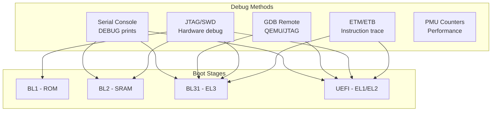

# Section 23.7: ARM UEFI Debugging Techniques

Debugging ARM UEFI firmware requires specialized techniques due to early boot stages, exception levels, and hardware dependencies. This section covers comprehensive debugging strategies.

## Debugging Methods Overview



## Serial Debug Output

### Configuring Debug Prints

```ini
# Platform DSC - Debug configuration
[PcdsFixedAtBuild.common]
  # Enable debug output
  gEfiMdePkgTokenSpaceGuid.PcdDebugPropertyMask|0x2F
  #  BIT0 - DEBUG_ASSERT
  #  BIT1 - DEBUG_PRINT
  #  BIT2 - DEBUG_CODE
  #  BIT3 - CLEAR_MEMORY
  #  BIT5 - DEBUG_ASSERT_DEADLOOP

  # Debug print error levels
  gEfiMdePkgTokenSpaceGuid.PcdDebugPrintErrorLevel|0x8040004F
  #  DEBUG_INIT      0x00000001
  #  DEBUG_WARN      0x00000002
  #  DEBUG_LOAD      0x00000004
  #  DEBUG_FS        0x00000008
  #  DEBUG_INFO      0x00000040
  #  DEBUG_DISPATCH  0x00000080
  #  DEBUG_ERROR     0x80000000

  # Serial port configuration
  gEfiMdeModulePkgTokenSpaceGuid.PcdSerialRegisterBase|0x09000000
  gEfiMdePkgTokenSpaceGuid.PcdUartDefaultBaudRate|115200

  # Report status codes to serial
  gEfiMdePkgTokenSpaceGuid.PcdReportStatusCodePropertyMask|0x07
```

### Debug Print Examples

```c
// Using DEBUG macro
DEBUG ((DEBUG_INFO, "Initializing platform...\n"));
DEBUG ((DEBUG_ERROR, "Error: Failed to allocate memory\n"));

// Print with parameters
DEBUG ((DEBUG_INFO, "Memory base: 0x%lx, size: 0x%lx\n",
        MemBase, MemSize));

// Hex dump
DEBUG_CODE_BEGIN ();
    UINTN  Index;
    UINT8  *Buffer = Data;

    DEBUG ((DEBUG_INFO, "Buffer dump:\n"));
    for (Index = 0; Index < Size; Index++) {
        if ((Index % 16) == 0) {
            DEBUG ((DEBUG_INFO, "%04x: ", Index));
        }
        DEBUG ((DEBUG_INFO, "%02x ", Buffer[Index]));
        if ((Index % 16) == 15) {
            DEBUG ((DEBUG_INFO, "\n"));
        }
    }
DEBUG_CODE_END ();

// Assert with message
ASSERT_EFI_ERROR (Status);
ASSERT (Pointer != NULL);

// Conditional assert
if (EFI_ERROR (Status)) {
    DEBUG ((DEBUG_ERROR, "Operation failed: %r\n", Status));
    ASSERT (FALSE);
}
```

### Early Boot Debug (Pre-UART)

```c
// LED or GPIO toggle for earliest debugging
// When UART isn't available yet

VOID
EarlyDebugPulse (
    IN UINTN  Count
    )
{
    UINTN  i;

    for (i = 0; i < Count; i++) {
        // Toggle GPIO pin
        MmioWrite32(GPIO_BASE + GPIO_SET, LED_PIN);
        ArmDataSynchronizationBarrier();

        // Delay
        volatile UINTN delay = 100000;
        while (delay--);

        MmioWrite32(GPIO_BASE + GPIO_CLR, LED_PIN);
        ArmDataSynchronizationBarrier();

        delay = 100000;
        while (delay--);
    }
}

// Usage at checkpoints
void bl1_main(void)
{
    EarlyDebugPulse(1);  // Checkpoint 1

    cpu_init();
    EarlyDebugPulse(2);  // Checkpoint 2

    uart_init();
    // Now can use printf
    printf("UART initialized\n");
}
```

## GDB Remote Debugging

### QEMU GDB Setup

```bash
# Terminal 1: Run QEMU with GDB server
qemu-system-aarch64 \
    -M virt \
    -cpu cortex-a72 \
    -m 2G \
    -drive if=pflash,format=raw,file=flash0.img \
    -serial stdio \
    -s -S  # -s: GDB on :1234, -S: pause at start

# Terminal 2: Connect GDB
aarch64-linux-gnu-gdb

# Or with multiarch GDB
gdb-multiarch
```

### GDB Commands for UEFI

```gdb
# Connect to target
(gdb) target remote localhost:1234

# Set architecture
(gdb) set architecture aarch64

# Load symbols for UEFI modules
(gdb) add-symbol-file Build/ArmVirtQemu-AARCH64/DEBUG_GCC5/AARCH64/ArmVirtPkg/PrePi/ArmVirtPrePiUniCoreRelocatable/DEBUG/ArmVirtPrePiUniCoreRelocatable.debug 0x40000000

# Find module load address and add symbols
# Address from DEBUG output: "Loading driver at 0x0000000047A00000"
(gdb) add-symbol-file Build/.../MyDriver.debug 0x47A00000

# Set breakpoints
(gdb) break CEntryPoint
(gdb) break ArmPlatformInitialize
(gdb) break DriverEntry

# Hardware breakpoints (limited number)
(gdb) hbreak *0x40001000

# Watchpoint on memory
(gdb) watch *0x47000000
(gdb) rwatch *0x47000000  # Read watch
(gdb) awatch *0x47000000  # Access watch

# Continue execution
(gdb) continue
(gdb) step
(gdb) next
(gdb) stepi  # Single instruction

# Examine registers
(gdb) info registers
(gdb) print $x0
(gdb) print $pc
(gdb) print $sp
(gdb) print $elr_el1  # Exception Link Register

# Examine memory
(gdb) x/16xg 0x40000000   # 16 giant words (64-bit)
(gdb) x/32xw 0x40000000   # 32 words (32-bit)
(gdb) x/s 0x40001000      # String
(gdb) x/i $pc             # Instruction at PC

# Backtrace
(gdb) backtrace
(gdb) frame 2
(gdb) info frame

# Thread/CPU info
(gdb) info threads
(gdb) thread 2

# System registers (requires target support)
(gdb) monitor info registers
```

### GDB Init Script

```gdb
# .gdbinit for UEFI debugging
set pagination off
set confirm off

define connect-qemu
    target remote localhost:1234
    set architecture aarch64
end

define load-uefi-syms
    # Load PrePi symbols
    add-symbol-file Build/ArmVirtQemu-AARCH64/DEBUG_GCC5/AARCH64/ArmVirtPkg/PrePi/ArmVirtPrePiUniCoreRelocatable/DEBUG/ArmVirtPrePiUniCoreRelocatable.debug 0x40000000
end

define show-exception
    printf "Exception: ELR_EL1 = 0x%lx\n", $elr_el1
    printf "ESR_EL1 = 0x%lx\n", $esr_el1
    printf "FAR_EL1 = 0x%lx\n", $far_el1
end

define dump-hob
    set $hob = (EFI_HOB_GENERIC_HEADER *)$arg0
    while $hob->HobType != 0xFFFF
        printf "HOB Type: 0x%x, Length: 0x%x\n", $hob->HobType, $hob->HobLength
        set $hob = (EFI_HOB_GENERIC_HEADER *)((char *)$hob + $hob->HobLength)
    end
end
```

## JTAG Debugging

### OpenOCD Configuration

```tcl
# openocd-arm.cfg
# JTAG adapter configuration
adapter driver ftdi
ftdi vid_pid 0x0403 0x6014
ftdi layout_init 0x0018 0x001b
ftdi layout_signal nSRST -data 0x0010

# Transport
transport select jtag
adapter speed 1000

# Target configuration
set _CHIPNAME arm_platform
set _DAP_TAPID 0x4ba00477

# JTAG chain
jtag newtap $_CHIPNAME cpu -irlen 4 -expected-id $_DAP_TAPID

# DAP
dap create $_CHIPNAME.dap -chain-position $_CHIPNAME.cpu

# Cores
set _TARGETNAME $_CHIPNAME.cpu

target create ${_TARGETNAME}0 aarch64 -dap $_CHIPNAME.dap -coreid 0
target create ${_TARGETNAME}1 aarch64 -dap $_CHIPNAME.dap -coreid 1
target create ${_TARGETNAME}2 aarch64 -dap $_CHIPNAME.dap -coreid 2
target create ${_TARGETNAME}3 aarch64 -dap $_CHIPNAME.dap -coreid 3

# Default target
targets ${_TARGETNAME}0

# Init procedure
proc init_target {} {
    # Halt all cores
    halt

    # Configure debug
    aarch64 dbginit
}
```

### OpenOCD Commands

```bash
# Start OpenOCD
openocd -f openocd-arm.cfg

# Terminal 2: Connect via telnet
telnet localhost 4444

# OpenOCD commands
> halt
> resume
> step

# Read registers
> reg
> reg pc
> reg x0

# Memory access
> mdw 0x40000000 16   # Read 16 words
> mww 0x40000000 0x12345678  # Write word

# Breakpoints
> bp 0x40001000 4 hw   # Hardware breakpoint
> rbp 0x40001000       # Remove breakpoint

# Flash operations (if supported)
> flash info 0
> flash write_image erase firmware.bin 0x0

# GDB server
# Connect GDB to port 3333
```

### DSTREAM/ULINKpro Configuration

```tcl
# ARM DS-5 / DSTREAM configuration
# platform.ds

# Define cluster configuration
cluster_config("ARM_Cortex-A76", 4, "SMP")

# Debug interface
debug_interface("JTAG")
jtag_frequency(10000000)  # 10 MHz

# Memory map
add_memory_region(0x00000000, 0x10000000, "ROM")
add_memory_region(0x40000000, 0x80000000, "RAM")
add_memory_region(0x08000000, 0x00100000, "GIC")
add_memory_region(0x09000000, 0x00001000, "UART")

# Exception level configuration
set_exception_level(EL1)
enable_secure_debug()
```

## Exception Analysis

### Exception Syndrome Register (ESR)

```c
// Exception syndrome decoding
typedef union {
    struct {
        UINT32  ISS  : 25;   // Instruction Specific Syndrome
        UINT32  IL   : 1;    // Instruction Length
        UINT32  EC   : 6;    // Exception Class
    } Bits;
    UINT32  Value;
} ESR_EL1;

// Exception classes
#define EC_UNKNOWN           0x00
#define EC_WFI_WFE           0x01
#define EC_CP15_MCR_MRC      0x03
#define EC_CP14_MCR_MRC      0x05
#define EC_ILLEGAL_STATE     0x0E
#define EC_SVC_A32           0x11
#define EC_SVC_A64           0x15
#define EC_SYS_A64           0x18
#define EC_INST_ABORT_EL0    0x20
#define EC_INST_ABORT_EL1    0x21
#define EC_PC_ALIGN          0x22
#define EC_DATA_ABORT_EL0    0x24
#define EC_DATA_ABORT_EL1    0x25
#define EC_SP_ALIGN          0x26
#define EC_FP_A32            0x28
#define EC_FP_A64            0x2C
#define EC_SERROR            0x2F
#define EC_BREAKPOINT_EL0    0x30
#define EC_BREAKPOINT_EL1    0x31
#define EC_STEP_EL0          0x32
#define EC_STEP_EL1          0x33
#define EC_WATCHPOINT_EL0    0x34
#define EC_WATCHPOINT_EL1    0x35
#define EC_BRK_A64           0x3C

VOID
DecodeException (
    VOID
    )
{
    ESR_EL1  Esr;
    UINT64   Elr;
    UINT64   Far;

    Esr.Value = ArmReadEsr();
    Elr = ArmReadElr();
    Far = ArmReadFar();

    DEBUG ((DEBUG_ERROR, "=== EXCEPTION ===\n"));
    DEBUG ((DEBUG_ERROR, "ESR_EL1: 0x%08x\n", Esr.Value));
    DEBUG ((DEBUG_ERROR, "ELR_EL1: 0x%016lx\n", Elr));
    DEBUG ((DEBUG_ERROR, "FAR_EL1: 0x%016lx\n", Far));

    switch (Esr.Bits.EC) {
    case EC_DATA_ABORT_EL1:
        DEBUG ((DEBUG_ERROR, "Data Abort at EL1\n"));
        DecodeDataAbort(Esr.Bits.ISS, Far);
        break;

    case EC_INST_ABORT_EL1:
        DEBUG ((DEBUG_ERROR, "Instruction Abort at EL1\n"));
        DecodeInstructionAbort(Esr.Bits.ISS, Far);
        break;

    case EC_UNKNOWN:
        DEBUG ((DEBUG_ERROR, "Unknown Exception\n"));
        break;

    case EC_SP_ALIGN:
        DEBUG ((DEBUG_ERROR, "SP Alignment Fault\n"));
        break;

    case EC_PC_ALIGN:
        DEBUG ((DEBUG_ERROR, "PC Alignment Fault\n"));
        break;

    default:
        DEBUG ((DEBUG_ERROR, "EC = 0x%x\n", Esr.Bits.EC));
    }
}

VOID
DecodeDataAbort (
    IN UINT32  ISS,
    IN UINT64  FAR
    )
{
    UINT32  DFSC = ISS & 0x3F;        // Data Fault Status Code
    BOOLEAN WnR = (ISS >> 6) & 1;     // Write not Read
    BOOLEAN CM = (ISS >> 8) & 1;      // Cache Maintenance
    BOOLEAN S1PTW = (ISS >> 7) & 1;   // Stage 1 page table walk

    DEBUG ((DEBUG_ERROR, "  Fault Address: 0x%016lx\n", FAR));
    DEBUG ((DEBUG_ERROR, "  %a access\n", WnR ? "Write" : "Read"));

    switch (DFSC) {
    case 0x04: DEBUG ((DEBUG_ERROR, "  Translation fault, level 0\n")); break;
    case 0x05: DEBUG ((DEBUG_ERROR, "  Translation fault, level 1\n")); break;
    case 0x06: DEBUG ((DEBUG_ERROR, "  Translation fault, level 2\n")); break;
    case 0x07: DEBUG ((DEBUG_ERROR, "  Translation fault, level 3\n")); break;
    case 0x09: DEBUG ((DEBUG_ERROR, "  Access flag fault, level 1\n")); break;
    case 0x0A: DEBUG ((DEBUG_ERROR, "  Access flag fault, level 2\n")); break;
    case 0x0B: DEBUG ((DEBUG_ERROR, "  Access flag fault, level 3\n")); break;
    case 0x0D: DEBUG ((DEBUG_ERROR, "  Permission fault, level 1\n")); break;
    case 0x0E: DEBUG ((DEBUG_ERROR, "  Permission fault, level 2\n")); break;
    case 0x0F: DEBUG ((DEBUG_ERROR, "  Permission fault, level 3\n")); break;
    case 0x10: DEBUG ((DEBUG_ERROR, "  External abort\n")); break;
    case 0x21: DEBUG ((DEBUG_ERROR, "  Alignment fault\n")); break;
    default:   DEBUG ((DEBUG_ERROR, "  DFSC = 0x%x\n", DFSC)); break;
    }
}
```

### Stack Unwinding

```c
// ARM64 stack frame walking
typedef struct {
    UINT64  FP;    // Frame Pointer (X29)
    UINT64  LR;    // Link Register (X30)
} ARM64_STACK_FRAME;

VOID
PrintBacktrace (
    VOID
    )
{
    ARM64_STACK_FRAME  *Frame;
    UINT64             Fp;
    UINTN              Depth = 0;
    UINTN              MaxDepth = 32;

    // Get current frame pointer
    __asm__ volatile ("mov %0, fp" : "=r" (Fp));

    DEBUG ((DEBUG_ERROR, "\n=== BACKTRACE ===\n"));

    Frame = (ARM64_STACK_FRAME *)Fp;

    while (Frame != NULL && Depth < MaxDepth) {
        // Validate frame pointer
        if (!IsValidPointer((VOID *)Frame)) {
            break;
        }

        DEBUG ((DEBUG_ERROR, "#%02d: 0x%016lx\n", Depth, Frame->LR));

        // Try to find module name
        PrintModuleForAddress(Frame->LR);

        // Move to next frame
        Frame = (ARM64_STACK_FRAME *)Frame->FP;
        Depth++;
    }
}

VOID
PrintModuleForAddress (
    IN UINT64  Address
    )
{
    // Walk loaded image list to find containing module
    EFI_DEBUG_IMAGE_INFO_TABLE_HEADER  *DebugTable;
    EFI_DEBUG_IMAGE_INFO               *DebugInfo;
    UINTN                              Index;

    DebugTable = GetDebugImageInfoTable();
    if (DebugTable == NULL) {
        return;
    }

    for (Index = 0; Index < DebugTable->TableSize; Index++) {
        DebugInfo = &DebugTable->EfiDebugImageInfoTable[Index];

        if (DebugInfo->ImageInfoType == EFI_DEBUG_IMAGE_INFO_TYPE_NORMAL) {
            UINTN ImageBase = (UINTN)DebugInfo->NormalImage->LoadedImageBase;
            UINTN ImageSize = DebugInfo->NormalImage->LoadedImageSize;

            if (Address >= ImageBase && Address < ImageBase + ImageSize) {
                DEBUG ((DEBUG_ERROR, "    [%g + 0x%lx]\n",
                        &DebugInfo->NormalImage->ImageGuid,
                        Address - ImageBase));
                return;
            }
        }
    }
}
```

## ETM Tracing

### CoreSight ETM Configuration

```c
// CoreSight ETM (Embedded Trace Macrocell)
#define ETM_BASE        0x41010000
#define ETB_BASE        0x41020000
#define TPIU_BASE       0x41030000
#define FUNNEL_BASE     0x41040000

// ETM registers
#define ETMCR           0x000   // Control
#define ETMSR           0x010   // Status
#define ETMTEEVR        0x020   // TraceEnable Event
#define ETMTECR1        0x024   // TraceEnable Control 1
#define ETMACVR(n)      (0x040 + (n) * 4)  // Address Comparator Value
#define ETMACTR(n)      (0x080 + (n) * 4)  // Address Comparator Access Type

// Enable ETM tracing
VOID
EtmEnable (
    VOID
    )
{
    // Unlock ETM
    MmioWrite32(ETM_BASE + 0xFB0, 0xC5ACCE55);

    // Configure trace
    MmioWrite32(ETM_BASE + ETMCR,
        ETM_CR_BRANCH_OUTPUT |
        ETM_CR_STALL_PROCESSOR);

    // Enable all instruction tracing
    MmioWrite32(ETM_BASE + ETMTEEVR, 0x6F);  // Always true

    // Enable trace output
    MmioWrite32(ETM_BASE + ETMCR,
        MmioRead32(ETM_BASE + ETMCR) | ETM_CR_PROGRAM);
}

// Configure address range filtering
VOID
EtmSetAddressRange (
    IN UINT64  Start,
    IN UINT64  End
    )
{
    // Address comparator 0: Start
    MmioWrite64(ETM_BASE + ETMACVR(0), Start);
    MmioWrite32(ETM_BASE + ETMACTR(0), 0x1);  // Instruction execute

    // Address comparator 1: End
    MmioWrite64(ETM_BASE + ETMACVR(1), End);
    MmioWrite32(ETM_BASE + ETMACTR(1), 0x1);

    // Enable address range include
    MmioWrite32(ETM_BASE + ETMTECR1, 0x1);  // Include range 0-1
}
```

### ETB (Embedded Trace Buffer)

```c
// ETB configuration
#define ETB_CR          0x000   // Control
#define ETB_SR          0x004   // Status
#define ETB_RRP         0x014   // Read Pointer
#define ETB_RWP         0x018   // Write Pointer
#define ETB_RRD         0x010   // Read Data

VOID
EtbEnable (
    VOID
    )
{
    // Unlock ETB
    MmioWrite32(ETB_BASE + 0xFB0, 0xC5ACCE55);

    // Enable trace capture
    MmioWrite32(ETB_BASE + ETB_CR, 0x1);
}

VOID
EtbDump (
    VOID
    )
{
    UINT32  WritePtr;
    UINT32  ReadPtr;
    UINT32  Data;

    // Stop capture
    MmioWrite32(ETB_BASE + ETB_CR, 0x0);

    WritePtr = MmioRead32(ETB_BASE + ETB_RWP);
    DEBUG ((DEBUG_INFO, "ETB captured %d bytes\n", WritePtr * 4));

    // Reset read pointer
    MmioWrite32(ETB_BASE + ETB_RRP, 0);

    // Dump trace data
    for (ReadPtr = 0; ReadPtr < WritePtr; ReadPtr++) {
        Data = MmioRead32(ETB_BASE + ETB_RRD);
        DEBUG ((DEBUG_INFO, "%08x ", Data));
        if ((ReadPtr & 7) == 7) {
            DEBUG ((DEBUG_INFO, "\n"));
        }
    }
}
```

## Performance Debugging

### PMU Counters

```c
// ARM PMU (Performance Monitor Unit)
#define PMU_PMCR        "pmcr_el0"
#define PMU_PMCNTENSET  "pmcntenset_el0"
#define PMU_PMCCNTR     "pmccntr_el0"
#define PMU_PMEVCNTR(n) "pmevcntr" #n "_el0"
#define PMU_PMEVTYPER(n) "pmevtyper" #n "_el0"

// PMU event types
#define PMU_EVENT_SW_INCR       0x00
#define PMU_EVENT_L1I_REFILL    0x01
#define PMU_EVENT_L1I_TLB_REFILL 0x02
#define PMU_EVENT_L1D_REFILL    0x03
#define PMU_EVENT_L1D_ACCESS    0x04
#define PMU_EVENT_L1D_TLB_REFILL 0x05
#define PMU_EVENT_INST_RETIRED  0x08
#define PMU_EVENT_EXC_TAKEN     0x09
#define PMU_EVENT_BR_RETIRED    0x21
#define PMU_EVENT_CPU_CYCLES    0x11
#define PMU_EVENT_MEM_ACCESS    0x13

VOID
PmuInit (
    VOID
    )
{
    UINT64  Pmcr;

    // Read PMCR
    __asm__ volatile ("mrs %0, pmcr_el0" : "=r" (Pmcr));

    // Reset counters and enable
    Pmcr |= (1 << 0) |  // Enable
            (1 << 1) |  // Reset event counters
            (1 << 2) |  // Reset cycle counter
            (1 << 4);   // Export enable

    __asm__ volatile ("msr pmcr_el0, %0" : : "r" (Pmcr));

    // Enable cycle counter
    __asm__ volatile ("msr pmcntenset_el0, %0" : : "r" (1UL << 31));
}

VOID
PmuConfigureEvent (
    IN UINTN  Counter,
    IN UINT32 Event
    )
{
    // Set event type
    switch (Counter) {
    case 0:
        __asm__ volatile ("msr pmevtyper0_el0, %0" : : "r" ((UINT64)Event));
        break;
    case 1:
        __asm__ volatile ("msr pmevtyper1_el0, %0" : : "r" ((UINT64)Event));
        break;
    // ... more counters
    }

    // Enable counter
    __asm__ volatile ("msr pmcntenset_el0, %0" : : "r" (1UL << Counter));
}

UINT64
PmuReadCycles (
    VOID
    )
{
    UINT64  Cycles;
    __asm__ volatile ("mrs %0, pmccntr_el0" : "=r" (Cycles));
    return Cycles;
}

// Usage example
VOID
ProfileFunction (
    VOID
    )
{
    UINT64  StartCycles, EndCycles;

    PmuInit();

    StartCycles = PmuReadCycles();

    // Code to profile
    DoSomething();

    EndCycles = PmuReadCycles();

    DEBUG ((DEBUG_INFO, "Function took %ld cycles\n",
            EndCycles - StartCycles));
}
```

## Debug Helpers

### Memory Dump Utility

```c
VOID
DumpMemory (
    IN VOID   *Address,
    IN UINTN   Size
    )
{
    UINT8   *Ptr = (UINT8 *)Address;
    UINTN   i, j;
    CHAR8   Ascii[17];

    DEBUG ((DEBUG_INFO, "Memory dump at 0x%p, size 0x%lx:\n",
            Address, Size));

    for (i = 0; i < Size; i += 16) {
        DEBUG ((DEBUG_INFO, "%08lx: ", (UINTN)Ptr + i));

        for (j = 0; j < 16 && (i + j) < Size; j++) {
            DEBUG ((DEBUG_INFO, "%02x ", Ptr[i + j]));
            Ascii[j] = (Ptr[i + j] >= 0x20 && Ptr[i + j] < 0x7F)
                       ? Ptr[i + j] : '.';
        }

        for (; j < 16; j++) {
            DEBUG ((DEBUG_INFO, "   "));
            Ascii[j] = ' ';
        }

        Ascii[16] = '\0';
        DEBUG ((DEBUG_INFO, " |%a|\n", Ascii));
    }
}
```

### Register Dump

```c
VOID
DumpSystemRegisters (
    VOID
    )
{
    UINT64  Value;

    DEBUG ((DEBUG_INFO, "=== System Registers ===\n"));

    __asm__ volatile ("mrs %0, CurrentEL" : "=r" (Value));
    DEBUG ((DEBUG_INFO, "CurrentEL: %d\n", (Value >> 2) & 3));

    __asm__ volatile ("mrs %0, sctlr_el1" : "=r" (Value));
    DEBUG ((DEBUG_INFO, "SCTLR_EL1: 0x%016lx\n", Value));
    DEBUG ((DEBUG_INFO, "  MMU: %a, D-Cache: %a, I-Cache: %a\n",
            (Value & 1) ? "ON" : "OFF",
            (Value & 4) ? "ON" : "OFF",
            (Value & (1<<12)) ? "ON" : "OFF"));

    __asm__ volatile ("mrs %0, tcr_el1" : "=r" (Value));
    DEBUG ((DEBUG_INFO, "TCR_EL1: 0x%016lx\n", Value));

    __asm__ volatile ("mrs %0, ttbr0_el1" : "=r" (Value));
    DEBUG ((DEBUG_INFO, "TTBR0_EL1: 0x%016lx\n", Value));

    __asm__ volatile ("mrs %0, ttbr1_el1" : "=r" (Value));
    DEBUG ((DEBUG_INFO, "TTBR1_EL1: 0x%016lx\n", Value));

    __asm__ volatile ("mrs %0, mair_el1" : "=r" (Value));
    DEBUG ((DEBUG_INFO, "MAIR_EL1: 0x%016lx\n", Value));

    __asm__ volatile ("mrs %0, vbar_el1" : "=r" (Value));
    DEBUG ((DEBUG_INFO, "VBAR_EL1: 0x%016lx\n", Value));
}
```

## Debugging Checklist

```markdown
## ARM UEFI Debug Checklist

### Serial Output
- [ ] UART base address correct
- [ ] UART clock configured
- [ ] Baud rate matches terminal
- [ ] Debug print level enabled

### GDB/JTAG
- [ ] Correct debug adapter config
- [ ] DAP accessible
- [ ] All cores visible
- [ ] Symbols loaded at correct addresses

### Exception Analysis
- [ ] Exception vectors installed
- [ ] ESR decoding implemented
- [ ] Stack unwinding working
- [ ] Module address lookup functional

### Common Issues
- [ ] Check SCTLR for MMU/cache state
- [ ] Verify memory attributes
- [ ] Check GIC configuration
- [ ] Validate interrupt routing
- [ ] Confirm EL transitions
```

## References

- [ARM Debug Architecture](https://developer.arm.com/documentation/ihi0031/latest)
- [CoreSight Architecture](https://developer.arm.com/documentation/ihi0029/latest)
- [ARM PMU Guide](https://developer.arm.com/documentation/ddi0500/latest)
- [OpenOCD Documentation](http://openocd.org/doc/html/index.html)

---

*Next: [Section 23.8: Porting Guide](../23-8-porting-guide/) - New platform bringup and validation.*
