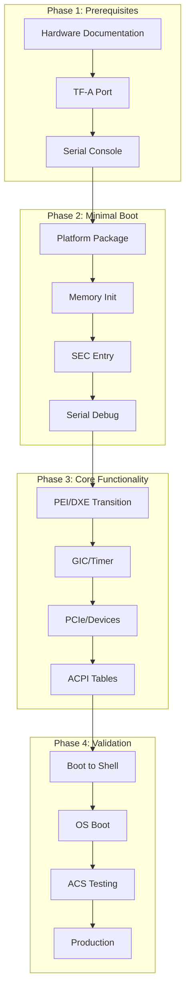

# Section 23.8: ARM UEFI Porting Guide

This section provides a comprehensive guide for porting UEFI to a new ARM platform, from initial bringup through production validation.

## Porting Overview



## Phase 1: Prerequisites

### Hardware Documentation Checklist

```markdown
## Required Documentation

### SoC/CPU Information
- [ ] ARM core type (Cortex-A76, Neoverse-N1, etc.)
- [ ] Number of cores and clusters
- [ ] Cache hierarchy (L1, L2, L3)
- [ ] Exception level capabilities (EL2, EL3 support)
- [ ] PSCI implementation details

### Memory Map
- [ ] Boot ROM location and size
- [ ] SRAM location and size
- [ ] DRAM base address and max size
- [ ] DDR controller type and configuration
- [ ] Memory-mapped peripheral addresses

### Interrupt Controller
- [ ] GIC version (v2, v3, v4)
- [ ] Distributor base address
- [ ] Redistributor base addresses (GICv3+)
- [ ] CPU interface base (GICv2)
- [ ] ITS base address (if present)
- [ ] Interrupt assignments (SPI numbers)

### Timer
- [ ] Generic timer availability
- [ ] Timer frequency
- [ ] Timer interrupt numbers (secure, non-secure, virtual, hyp)
- [ ] Watchdog timer details

### Serial Console
- [ ] UART type (PL011, 8250, vendor-specific)
- [ ] UART base address
- [ ] UART interrupt
- [ ] Input clock frequency

### Boot Media
- [ ] Flash type (SPI NOR, eMMC, etc.)
- [ ] Flash base address and size
- [ ] Boot device configuration

### PCIe (if present)
- [ ] Root complex base
- [ ] ECAM base and size
- [ ] Memory windows (32-bit, 64-bit)
- [ ] I/O window
- [ ] Interrupt routing
```

### TF-A Port

Before UEFI, ensure TF-A works on your platform:

```bash
# Minimal TF-A platform structure
arm-trusted-firmware/
└── plat/
    └── vendor/
        └── platform/
            ├── include/
            │   ├── platform_def.h     # Platform definitions
            │   └── plat_macros.S      # Debug macros
            ├── aarch64/
            │   └── platform_helpers.S # Assembly helpers
            ├── platform.mk            # Build configuration
            ├── bl1_plat_setup.c       # BL1 platform setup
            ├── bl2_plat_setup.c       # BL2 platform setup
            ├── bl31_plat_setup.c      # BL31 platform setup
            ├── plat_io_storage.c      # I/O layer
            ├── plat_psci.c            # PSCI implementation
            ├── plat_gic.c             # GIC setup
            └── plat_topology.c        # CPU topology
```

## Phase 2: Platform Package Structure

### Create EDK2 Platform Package

```bash
# Platform directory structure
edk2-platforms/
└── Platform/
    └── Vendor/
        └── PlatformPkg/
            ├── PlatformPkg.dec         # Package declaration
            ├── PlatformPkg.dsc         # Platform description
            ├── PlatformPkg.fdf         # Flash description
            ├── Include/
            │   └── Platform.h          # Platform definitions
            ├── Library/
            │   ├── PlatformLib/        # Platform initialization
            │   ├── PlatformPeiLib/     # PEI phase support
            │   └── PlatformSecLib/     # SEC phase support
            ├── Drivers/
            │   ├── PlatformDxe/        # Platform DXE driver
            │   └── UartDxe/            # UART driver (if custom)
            └── AcpiTables/
                ├── Madt.aslc           # MADT table
                ├── Gtdt.aslc           # GTDT table
                ├── Iort.aslc           # IORT table
                ├── Pptt.aslc           # PPTT table
                └── Dsdt.asl            # DSDT
```

### Package Declaration (DEC)

```ini
# PlatformPkg.dec

[Defines]
  DEC_SPECIFICATION = 0x0001001A
  PACKAGE_NAME      = PlatformPkg
  PACKAGE_GUID      = 12345678-1234-1234-1234-123456789ABC
  PACKAGE_VERSION   = 1.0

[Includes]
  Include

[Guids]
  gPlatformTokenSpaceGuid = { 0x12345678, 0x1234, 0x1234, { 0x12, 0x34, 0x56, 0x78, 0x9a, 0xbc, 0xde, 0xf0 }}

[PcdsFixedAtBuild]
  # Memory configuration
  gPlatformTokenSpaceGuid.PcdDramBase|0x80000000|UINT64|0x00000001
  gPlatformTokenSpaceGuid.PcdDramSize|0x80000000|UINT64|0x00000002

  # Peripheral bases
  gPlatformTokenSpaceGuid.PcdGicDistBase|0x08000000|UINT64|0x00000010
  gPlatformTokenSpaceGuid.PcdGicRedistBase|0x080A0000|UINT64|0x00000011
  gPlatformTokenSpaceGuid.PcdUartBase|0x09000000|UINT64|0x00000020
  gPlatformTokenSpaceGuid.PcdUartClkFreq|24000000|UINT32|0x00000021

  # PCIe configuration
  gPlatformTokenSpaceGuid.PcdPcieEcamBase|0x4010000000|UINT64|0x00000030
  gPlatformTokenSpaceGuid.PcdPcieEcamSize|0x10000000|UINT64|0x00000031
```

### Platform Description (DSC)

```ini
# PlatformPkg.dsc

[Defines]
  PLATFORM_NAME                  = Platform
  PLATFORM_GUID                  = 12345678-1234-1234-1234-123456789ABC
  PLATFORM_VERSION               = 1.0
  DSC_SPECIFICATION              = 0x0001001C
  OUTPUT_DIRECTORY               = Build/Platform
  SUPPORTED_ARCHITECTURES        = AARCH64
  BUILD_TARGETS                  = DEBUG|RELEASE
  SKUID_IDENTIFIER               = DEFAULT
  FLASH_DEFINITION               = Platform/Vendor/PlatformPkg/PlatformPkg.fdf

  # ARM core definitions
  DEFINE EDK2_ARMPLATFORMLIB     = Platform/Vendor/PlatformPkg/Library/PlatformLib

!include ArmVirtPkg/ArmVirt.dsc.inc
!include MdePkg/MdeLibs.dsc.inc

[LibraryClasses.common]
  # Platform libraries
  ArmPlatformLib|$(EDK2_ARMPLATFORMLIB)/PlatformLib.inf
  PlatformPeiLib|Platform/Vendor/PlatformPkg/Library/PlatformPeiLib/PlatformPeiLib.inf

  # Core ARM libraries
  ArmLib|ArmPkg/Library/ArmLib/ArmBaseLib.inf
  ArmMmuLib|ArmPkg/Library/ArmMmuLib/ArmMmuBaseLib.inf
  ArmGicLib|ArmPkg/Drivers/ArmGic/ArmGicLib.inf
  ArmGenericTimerCounterLib|ArmPkg/Library/ArmGenericTimerPhyCounterLib/ArmGenericTimerPhyCounterLib.inf

  # Serial
  SerialPortLib|ArmPlatformPkg/Library/PL011SerialPortLib/PL011SerialPortLib.inf
  PL011UartLib|ArmPlatformPkg/Library/PL011UartLib/PL011UartLib.inf
  PL011UartClockLib|ArmPlatformPkg/Library/PL011UartClockLib/PL011UartClockLib.inf

[LibraryClasses.common.SEC]
  PrePiLib|EmbeddedPkg/Library/PrePiLib/PrePiLib.inf
  ArmGicArchLib|ArmPkg/Library/ArmGicArchSecLib/ArmGicArchSecLib.inf

[LibraryClasses.common.DXE_DRIVER]
  ArmGicArchLib|ArmPkg/Library/ArmGicArchLib/ArmGicArchLib.inf

[PcdsFixedAtBuild.common]
  # Debug output
  gEfiMdePkgTokenSpaceGuid.PcdDebugPropertyMask|0x2F
  gEfiMdePkgTokenSpaceGuid.PcdDebugPrintErrorLevel|0x8040004F

  # Memory
  gArmTokenSpaceGuid.PcdSystemMemoryBase|0x80000000
  gArmTokenSpaceGuid.PcdSystemMemorySize|0x80000000

  # UART
  gEfiMdeModulePkgTokenSpaceGuid.PcdSerialRegisterBase|0x09000000
  gEfiMdePkgTokenSpaceGuid.PcdUartDefaultBaudRate|115200

  # GIC
  gArmTokenSpaceGuid.PcdGicDistributorBase|0x08000000
  gArmTokenSpaceGuid.PcdGicRedistributorsBase|0x080A0000

  # Timer
  gArmTokenSpaceGuid.PcdArmArchTimerFreqInHz|100000000
  gArmTokenSpaceGuid.PcdArmArchTimerSecIntrNum|29
  gArmTokenSpaceGuid.PcdArmArchTimerIntrNum|30
  gArmTokenSpaceGuid.PcdArmArchTimerVirtIntrNum|27
  gArmTokenSpaceGuid.PcdArmArchTimerHypIntrNum|26

  # Firmware volume
  gArmTokenSpaceGuid.PcdFdBaseAddress|0x00000000
  gArmTokenSpaceGuid.PcdFdSize|0x00400000
  gArmTokenSpaceGuid.PcdFvBaseAddress|0x00000000
  gArmTokenSpaceGuid.PcdFvSize|0x00400000

[Components.common]
  # SEC/PrePi
  Platform/Vendor/PlatformPkg/PrePi/PrePi.inf

  # DXE Core
  MdeModulePkg/Core/Dxe/DxeMain.inf

  # Architectural Protocols
  ArmPkg/Drivers/CpuDxe/CpuDxe.inf
  ArmPkg/Drivers/ArmGic/ArmGicDxe.inf
  ArmPkg/Drivers/TimerDxe/TimerDxe.inf

  # Platform driver
  Platform/Vendor/PlatformPkg/Drivers/PlatformDxe/PlatformDxe.inf

  # ACPI
  Platform/Vendor/PlatformPkg/AcpiTables/AcpiTables.inf
```

### Platform Library Implementation

```c
// Library/PlatformLib/PlatformLib.c

#include <Library/ArmPlatformLib.h>
#include <Library/DebugLib.h>
#include <Library/IoLib.h>
#include <Library/PcdLib.h>
#include <Ppi/ArmMpCoreInfo.h>

// CPU topology
STATIC ARM_CORE_INFO mCoreInfo[] = {
    { 0x0, 0x0, 0x0 },  // Cluster 0, Core 0
    { 0x0, 0x0, 0x1 },  // Cluster 0, Core 1
    { 0x0, 0x0, 0x2 },  // Cluster 0, Core 2
    { 0x0, 0x0, 0x3 },  // Cluster 0, Core 3
};

// Memory map
STATIC ARM_MEMORY_REGION_DESCRIPTOR mVirtualMemoryTable[] = {
    // System RAM
    {
        ARM_VE_DRAM_BASE,
        ARM_VE_DRAM_BASE,
        ARM_VE_DRAM_SIZE,
        ARM_MEMORY_REGION_ATTRIBUTE_WRITE_BACK
    },
    // GIC
    {
        PcdGet64(PcdGicDistributorBase),
        PcdGet64(PcdGicDistributorBase),
        SIZE_1MB,
        ARM_MEMORY_REGION_ATTRIBUTE_DEVICE
    },
    // UART
    {
        PcdGet64(PcdSerialRegisterBase),
        PcdGet64(PcdSerialRegisterBase),
        SIZE_4KB,
        ARM_MEMORY_REGION_ATTRIBUTE_DEVICE
    },
    // PCIe
    {
        PCIE_ECAM_BASE,
        PCIE_ECAM_BASE,
        PCIE_ECAM_SIZE,
        ARM_MEMORY_REGION_ATTRIBUTE_DEVICE
    },
    // End
    { 0, 0, 0, 0 }
};

RETURN_STATUS
ArmPlatformInitialize (
    IN UINTN  MpId
    )
{
    // Early platform initialization
    // Called before MMU is enabled

    // Platform-specific hardware init
    PlatformEarlyInit();

    return RETURN_SUCCESS;
}

VOID
ArmPlatformGetVirtualMemoryMap (
    OUT ARM_MEMORY_REGION_DESCRIPTOR **VirtualMemoryMap
    )
{
    *VirtualMemoryMap = mVirtualMemoryTable;
}

EFI_STATUS
PrePeiCoreGetMpCoreInfo (
    OUT UINTN          *CoreCount,
    OUT ARM_CORE_INFO  **ArmCoreTable
    )
{
    *CoreCount = ARRAY_SIZE(mCoreInfo);
    *ArmCoreTable = mCoreInfo;
    return EFI_SUCCESS;
}

ARM_CORE_INFO *
ArmCoreInfoTable (
    OUT UINTN  *Count
    )
{
    *Count = ARRAY_SIZE(mCoreInfo);
    return mCoreInfo;
}

EFI_BOOT_MODE
ArmPlatformGetBootMode (
    VOID
    )
{
    // Detect boot mode from hardware
    return BOOT_WITH_FULL_CONFIGURATION;
}
```

### SEC/PrePi Entry Point

```c
// PrePi/PrePi.c

#include <Library/PrePiLib.h>
#include <Library/ArmPlatformLib.h>
#include <Library/SerialPortLib.h>

VOID
CEntryPoint (
    IN UINTN  MpId,
    IN UINTN  UefiMemoryBase
    )
{
    EFI_STATUS  Status;
    UINTN       StackBase;
    UINTN       StackSize;

    // Initialize serial first for debug output
    SerialPortInitialize();
    DEBUG ((DEBUG_INFO, "Platform UEFI starting...\n"));
    DEBUG ((DEBUG_INFO, "MpId: 0x%lx\n", MpId));

    // Initialize platform
    Status = ArmPlatformInitialize(MpId);
    ASSERT_EFI_ERROR(Status);

    // Enable caches
    ArmEnableDataCache();
    ArmEnableInstructionCache();

    // Set up stack
    StackBase = UefiMemoryBase;
    StackSize = PcdGet32(PcdCPUCorePrimaryStackSize);

    // Build memory HOBs
    BuildMemoryHobs();

    // Build CPU HOBs
    BuildCpuHob(ArmGetPhysicalAddressBits(), ArmGetVirtualAddressBits());

    // Build stack HOB
    BuildStackHob(StackBase, StackSize);

    // Build FV HOBs
    BuildFvHob(PcdGet64(PcdFvBaseAddress), PcdGet64(PcdFvSize));

    // Build HOB for DTB if present
    if (DeviceTreeBase != 0) {
        BuildGuidDataHob(&gFdtHobGuid, &DeviceTreeBase, sizeof(UINT64));
    }

    // Transfer to DXE
    LoadDxeCoreFromFv(NULL, 0);

    // Should not return
    CpuDeadLoop();
}

VOID
BuildMemoryHobs (
    VOID
    )
{
    // System memory
    BuildResourceDescriptorHob(
        EFI_RESOURCE_SYSTEM_MEMORY,
        EFI_RESOURCE_ATTRIBUTE_PRESENT |
        EFI_RESOURCE_ATTRIBUTE_INITIALIZED |
        EFI_RESOURCE_ATTRIBUTE_WRITE_COMBINEABLE |
        EFI_RESOURCE_ATTRIBUTE_WRITE_THROUGH_CACHEABLE |
        EFI_RESOURCE_ATTRIBUTE_WRITE_BACK_CACHEABLE |
        EFI_RESOURCE_ATTRIBUTE_TESTED,
        PcdGet64(PcdSystemMemoryBase),
        PcdGet64(PcdSystemMemorySize)
    );

    // Reserved for TF-A
    BuildMemoryAllocationHob(
        TFA_MEMORY_BASE,
        TFA_MEMORY_SIZE,
        EfiReservedMemoryType
    );

    // MMIO
    BuildResourceDescriptorHob(
        EFI_RESOURCE_MEMORY_MAPPED_IO,
        EFI_RESOURCE_ATTRIBUTE_PRESENT,
        MMIO_BASE,
        MMIO_SIZE
    );
}
```

## Phase 3: Core Drivers

### GIC Driver Configuration

```c
// Drivers/PlatformDxe/Gic.c

EFI_STATUS
PlatformGicInit (
    VOID
    )
{
    // GICv3 specific initialization

    UINT64  GicDist = PcdGet64(PcdGicDistributorBase);
    UINT64  GicRedist = PcdGet64(PcdGicRedistributorsBase);
    UINT32  NumCpus = PcdGet32(PcdCoreCount);
    UINTN   i;

    // Initialize Distributor
    // - Enable Affinity Routing
    // - Configure SPI defaults
    MmioOr32(GicDist + GICD_CTLR, GICD_CTLR_ARE_S | GICD_CTLR_ARE_NS);

    // Initialize Redistributors for each CPU
    for (i = 0; i < NumCpus; i++) {
        UINT64 GicrBase = GicRedist + i * GICR_FRAME_SIZE;

        // Wake up redistributor
        MmioAnd32(GicrBase + GICR_WAKER, ~GICR_WAKER_PROCESSOR_SLEEP);

        // Wait for children to wake
        while (MmioRead32(GicrBase + GICR_WAKER) & GICR_WAKER_CHILDREN_ASLEEP);
    }

    // Enable Group 1 NS interrupts
    MmioOr32(GicDist + GICD_CTLR, GICD_CTLR_ENABLE_G1NS);

    return EFI_SUCCESS;
}
```

### ACPI Table Installation

```c
// AcpiTables/AcpiTables.c

EFI_STATUS
EFIAPI
AcpiTablesEntryPoint (
    IN EFI_HANDLE        ImageHandle,
    IN EFI_SYSTEM_TABLE  *SystemTable
    )
{
    EFI_STATUS             Status;
    EFI_ACPI_TABLE_PROTOCOL *AcpiTable;

    Status = gBS->LocateProtocol(
        &gEfiAcpiTableProtocolGuid,
        NULL,
        (VOID **)&AcpiTable
    );
    if (EFI_ERROR(Status)) {
        return Status;
    }

    // Install required tables
    UINTN TableKey;

    // MADT
    Status = AcpiTable->InstallAcpiTable(
        AcpiTable, &Madt, sizeof(Madt), &TableKey);
    ASSERT_EFI_ERROR(Status);

    // GTDT
    Status = AcpiTable->InstallAcpiTable(
        AcpiTable, &Gtdt, sizeof(Gtdt), &TableKey);
    ASSERT_EFI_ERROR(Status);

    // IORT
    Status = AcpiTable->InstallAcpiTable(
        AcpiTable, &Iort, sizeof(Iort), &TableKey);
    ASSERT_EFI_ERROR(Status);

    // PPTT
    Status = AcpiTable->InstallAcpiTable(
        AcpiTable, &Pptt, sizeof(Pptt), &TableKey);
    ASSERT_EFI_ERROR(Status);

    // SPCR
    Status = AcpiTable->InstallAcpiTable(
        AcpiTable, &Spcr, sizeof(Spcr), &TableKey);
    ASSERT_EFI_ERROR(Status);

    // DBG2
    Status = AcpiTable->InstallAcpiTable(
        AcpiTable, &Dbg2, Dbg2.Header.Length, &TableKey);
    ASSERT_EFI_ERROR(Status);

    // DSDT (installed via FADT reference)
    InstallDsdt(AcpiTable);

    return EFI_SUCCESS;
}
```

## Phase 4: Validation

### Boot Validation Checklist

```markdown
## Validation Checklist

### Stage 1: Serial Output
- [ ] TF-A boot messages visible
- [ ] UEFI debug output visible
- [ ] No garbage/corruption on serial

### Stage 2: Memory
- [ ] Correct DRAM detected
- [ ] HOB list valid
- [ ] Memory map correct
- [ ] No memory corruption

### Stage 3: Interrupts
- [ ] GIC initialized
- [ ] Timer interrupts working
- [ ] Serial RX interrupt (optional)

### Stage 4: UEFI Shell
- [ ] Shell prompt appears
- [ ] `memmap` shows correct memory
- [ ] `dh` lists handles
- [ ] `drivers` shows loaded drivers

### Stage 5: ACPI
- [ ] `acpiview` shows all tables
- [ ] No FWTS ACPI errors
- [ ] Tables checksum valid

### Stage 6: OS Boot
- [ ] GRUB loads
- [ ] Kernel starts
- [ ] Root filesystem mounts
- [ ] Console works in Linux

### Stage 7: Compliance
- [ ] BSA ACS passes
- [ ] SCT test suite passes
- [ ] FWTS tests pass
```

### Automated Validation Script

```bash
#!/bin/bash
# validate-platform.sh

set -e

PLATFORM="Platform/Vendor/PlatformPkg"
BUILD_DIR="Build/Platform/DEBUG_GCC5"

echo "=== Platform Validation ==="

# Build
echo "Building..."
build -a AARCH64 -t GCC5 -p $PLATFORM/PlatformPkg.dsc -b DEBUG

# Verify FD created
if [ ! -f "$BUILD_DIR/FV/PLATFORM.fd" ]; then
    echo "ERROR: FD not created"
    exit 1
fi
echo "FD created successfully"

# Check FD size
FD_SIZE=$(stat -c %s "$BUILD_DIR/FV/PLATFORM.fd")
echo "FD size: $FD_SIZE bytes"

# List included modules
echo "Modules in FV:"
$EDK_TOOLS_PATH/bin/VolInfo "$BUILD_DIR/FV/FVMAIN_COMPACT.fv" | grep -E "File Name|Type"

# Verify ACPI tables
echo "Checking ACPI tables..."
for table in Madt Gtdt Iort Pptt Spcr Dbg2; do
    if grep -q "$table" "$BUILD_DIR/AARCH64/AcpiTables/"; then
        echo "  $table: OK"
    else
        echo "  $table: MISSING"
    fi
done

echo "=== Validation Complete ==="
```

### QEMU Testing

```bash
#!/bin/bash
# test-qemu.sh

FD_FILE="Build/Platform/DEBUG_GCC5/FV/PLATFORM.fd"

# Create flash images
dd if=/dev/zero of=flash0.img bs=64M count=1
dd if=/dev/zero of=flash1.img bs=64M count=1
dd if="$FD_FILE" of=flash0.img conv=notrunc

# Run QEMU
qemu-system-aarch64 \
    -M virt \
    -cpu cortex-a72 \
    -m 2G \
    -drive if=pflash,format=raw,file=flash0.img \
    -drive if=pflash,format=raw,file=flash1.img \
    -serial stdio \
    -net none \
    -d guest_errors \
    2>&1 | tee qemu.log

# Check for expected output
if grep -q "UEFI firmware starting" qemu.log; then
    echo "Boot started successfully"
fi

if grep -q "Shell>" qemu.log; then
    echo "Reached UEFI Shell"
fi
```

## Common Porting Issues

### Issue: No Serial Output

```c
// Check UART initialization order
// Ensure UART is initialized before any DEBUG prints

// In PlatformLib.c
RETURN_STATUS
ArmPlatformInitialize (
    IN UINTN  MpId
    )
{
    // Initialize UART FIRST
    UINT64 UartBase = PcdGet64(PcdSerialRegisterBase);

    // Check if UART clock is enabled
    EnableUartClock();

    // Initialize UART
    Pl011UartInitialize(UartBase);

    // Now safe to use DEBUG
    DEBUG((DEBUG_INFO, "Platform Init\n"));

    return RETURN_SUCCESS;
}
```

### Issue: Exception on Memory Access

```c
// Ensure MMU is configured correctly
// Check memory regions are properly mapped

// Verify in ArmPlatformGetVirtualMemoryMap()
STATIC ARM_MEMORY_REGION_DESCRIPTOR mVirtualMemoryTable[] = {
    // All accessed regions must be mapped
    { DRAM_BASE, DRAM_BASE, DRAM_SIZE, ARM_MEMORY_REGION_ATTRIBUTE_WRITE_BACK },
    { GIC_BASE, GIC_BASE, GIC_SIZE, ARM_MEMORY_REGION_ATTRIBUTE_DEVICE },
    { UART_BASE, UART_BASE, UART_SIZE, ARM_MEMORY_REGION_ATTRIBUTE_DEVICE },
    // ... all other regions
    { 0, 0, 0, 0 }
};
```

### Issue: Timer Not Working

```c
// Verify timer frequency and interrupts
DEBUG((DEBUG_INFO, "Timer freq: %lu Hz\n", ArmGenericTimerGetTimerFreq()));

// Ensure timer interrupts are routed correctly
// PPIs 29, 30, 27, 26 for secure, NS, virtual, hyp timers

// Check GIC SPI/PPI routing
GicV3EnableInterruptSource(30);  // NS physical timer
```

## Production Hardening

```markdown
## Production Checklist

### Security
- [ ] Remove DEBUG prints in RELEASE build
- [ ] Disable serial console (or protect)
- [ ] Enable Secure Boot
- [ ] Validate TF-A chain of trust
- [ ] Lock flash write protection

### Stability
- [ ] Stress test with multiple reboots
- [ ] Test all boot paths (cold, warm, S3)
- [ ] Memory test full DRAM
- [ ] Test with various OS versions

### Compliance
- [ ] Pass BSA ACS at target level
- [ ] Pass SCT with >95% pass rate
- [ ] Pass FWTS with no critical failures
- [ ] SystemReady IR/ES/SR certification

### Documentation
- [ ] Platform configuration documented
- [ ] Build instructions complete
- [ ] Known issues documented
- [ ] Release notes prepared
```

## References

- [EDK2 Porting Guide](https://github.com/tianocore/tianocore.github.io/wiki/EDK-II-Platforms)
- [TF-A Porting Guide](https://trustedfirmware-a.readthedocs.io/en/latest/getting_started/porting-guide.html)
- [ArmPkg Documentation](https://github.com/tianocore/edk2/tree/master/ArmPkg)
- [ARM SystemReady](https://www.arm.com/architecture/system-architectures/systemready-certification-program)

---

*This concludes Chapter 23: ARM UEFI Development. Return to [Chapter Index](../index/) or continue to [Part 5: Practical Projects](/part5/).*
