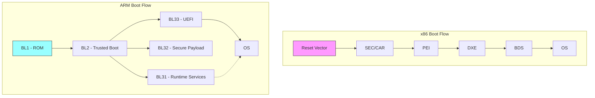
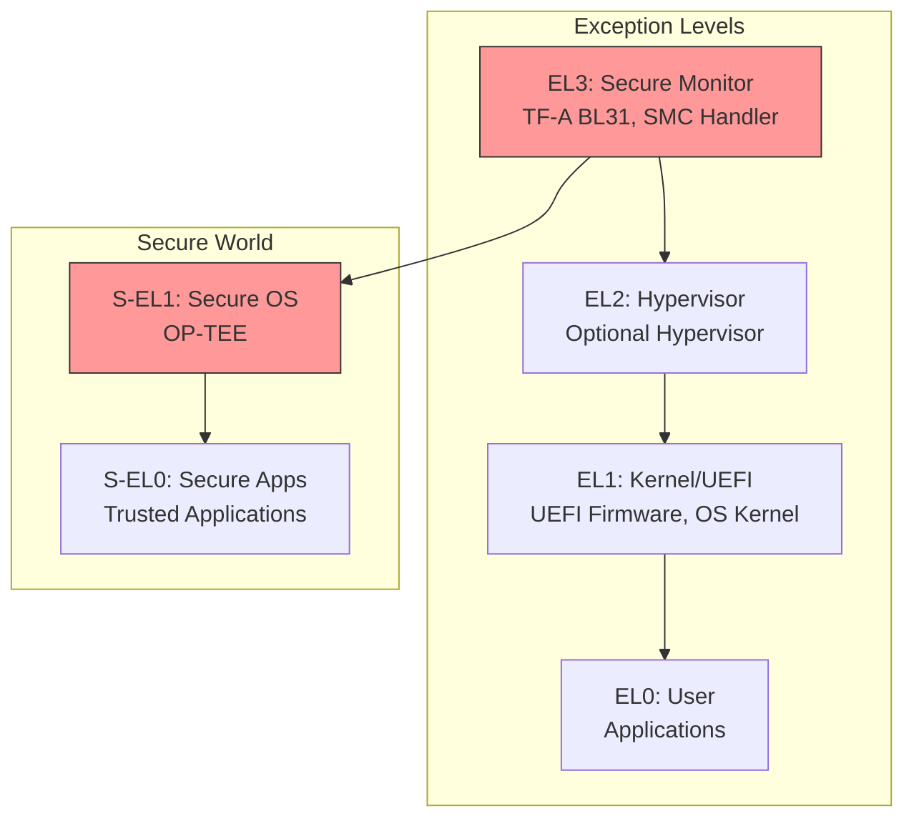
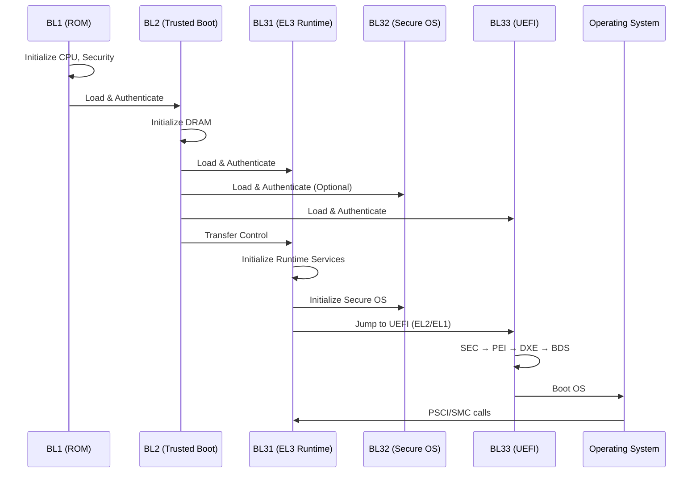
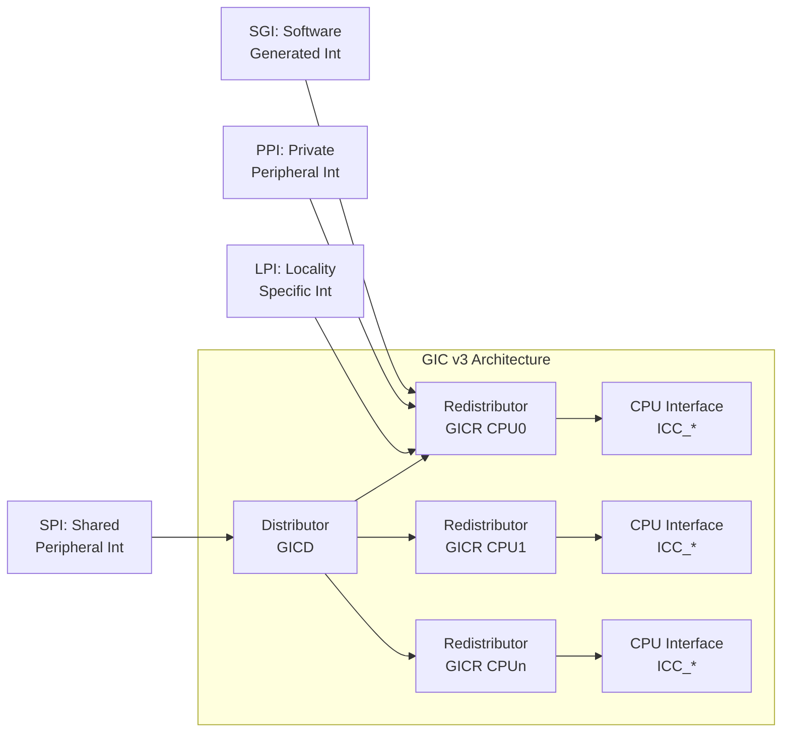

# Chapter 23: ARM UEFI Development

ARM-based UEFI development presents unique challenges and opportunities compared to x86 platforms. This comprehensive chapter covers the complete ARM UEFI development journey from environment setup through production porting.

## Chapter Overview

| Section | Topic | Focus |
|---------|-------|-------|
| [23.1](23-1-arm-environment/) | Environment Setup | Cross-compilation toolchains, QEMU, hardware debuggers |
| [23.2](23-2-boot-architecture/) | Boot Architecture | Exception levels, TF-A integration, BL stages |
| [23.3](23-3-trusted-firmware/) | Trusted Firmware-A | BL1-BL33 flow, secure world, PSCI |
| [23.4](23-4-systemready/) | SystemReady Compliance | IR/ES/SR certification, ACS testing |
| [23.5](23-5-configuration/) | Platform Configuration | PCD settings, memory map, GIC configuration |
| [23.6](23-6-dt-acpi/) | Device Tree & ACPI | DT bindings, ACPI tables, hybrid approaches |
| [23.7](23-7-debugging/) | Debugging Techniques | JTAG, ETM tracing, exception analysis |
| [23.8](23-8-porting-guide/) | Porting Guide | New platform bringup, validation checklist |

## ARM vs x86 UEFI Comparison



## Exception Level Architecture

ARM processors use Exception Levels (EL0-EL3) for privilege separation:



## Key Differences from x86

| Aspect | x86 UEFI | ARM UEFI |
|--------|----------|----------|
| Reset Vector | Fixed 0xFFFFFFF0 | Configurable (ROM defined) |
| Early Code | SEC phase in CAR | BL1 in ROM, BL2 in SRAM |
| Runtime Services | SMM-based | PSCI/SMC to EL3 |
| Memory Init | PEI phase | BL2 or separate firmware |
| Secure Services | SMM isolation | TrustZone (EL3/S-EL1) |
| Hardware Description | ACPI only | Device Tree, ACPI, or hybrid |
| Power Management | ACPI S-states | PSCI interface |
| Interrupt Controller | APIC/x2APIC | GIC v2/v3/v4 |

## Trusted Firmware-A Boot Stages



## PSCI (Power State Coordination Interface)

ARM platforms use PSCI for power management instead of SMM:

```c
// PSCI Function IDs (SMC64 versions)
#define PSCI_VERSION                 0x84000000
#define PSCI_CPU_SUSPEND_AARCH64     0xC4000001
#define PSCI_CPU_OFF                 0x84000002
#define PSCI_CPU_ON_AARCH64          0xC4000003
#define PSCI_SYSTEM_OFF              0x84000008
#define PSCI_SYSTEM_RESET            0x84000009
#define PSCI_SYSTEM_RESET2_AARCH64   0xC4000012

// Invoking PSCI from UEFI
EFI_STATUS
EFIAPI
ArmPsciCpuOn (
  IN UINTN  TargetCpu,
  IN UINTN  EntryPoint
  )
{
  ARM_SMC_ARGS  ArmSmcArgs;

  ArmSmcArgs.Arg0 = PSCI_CPU_ON_AARCH64;
  ArmSmcArgs.Arg1 = TargetCpu;      // MPIDR of target CPU
  ArmSmcArgs.Arg2 = EntryPoint;     // Entry point address
  ArmSmcArgs.Arg3 = 0;              // Context ID

  ArmCallSmc (&ArmSmcArgs);

  return (ArmSmcArgs.Arg0 == PSCI_SUCCESS) ? EFI_SUCCESS : EFI_DEVICE_ERROR;
}
```

## GIC (Generic Interrupt Controller)

ARM uses GIC for interrupt management:



## Platform Examples

| Platform | SoC | EDK2 Package | TF-A Support |
|----------|-----|--------------|--------------|
| Raspberry Pi 4 | BCM2711 | edk2-platforms/RPi4 | Community |
| NVIDIA Jetson | Tegra | edk2-nvidia | NVIDIA fork |
| NXP i.MX8 | i.MX8M | edk2-platforms/NXP | Mainline |
| Ampere Altra | Altra | edk2-platforms/Ampere | Mainline |
| QEMU ARM | virt | ArmVirtPkg | N/A |

## Quick Start with QEMU

```bash
# Build UEFI for QEMU ARM64
cd edk2
source edksetup.sh
build -a AARCH64 -t GCC5 -p ArmVirtPkg/ArmVirtQemu.dsc -b DEBUG

# Run with QEMU
qemu-system-aarch64 \
    -M virt \
    -cpu cortex-a72 \
    -m 2G \
    -drive if=pflash,format=raw,file=QEMU_EFI.fd \
    -serial stdio \
    -net none
```

## Learning Path


## EDK2 ARM Packages

| Package | Purpose |
|---------|---------|
| `ArmPkg` | Core ARM support (CPU, GIC, Timer, MMU) |
| `ArmPlatformPkg` | Platform abstraction layer |
| `ArmVirtPkg` | QEMU virtual machine support |
| `EmbeddedPkg` | Embedded systems utilities |

## References

- [ARM Architecture Reference Manual](https://developer.arm.com/documentation/ddi0487/latest)
- [TF-A Documentation](https://trustedfirmware-a.readthedocs.io/)
- [PSCI Specification](https://developer.arm.com/documentation/den0022/latest)
- [SystemReady Program](https://www.arm.com/architecture/system-architectures/systemready-certification-program)
- [EDK2 ArmPkg](https://github.com/tianocore/edk2/tree/master/ArmPkg)
- [EDK2 Platforms - ARM](https://github.com/tianocore/edk2-platforms/tree/master/Platform/ARM)

---

*Continue to [Section 23.1: Environment Setup](23-1-arm-environment/) to configure your ARM development environment.*
