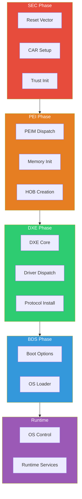
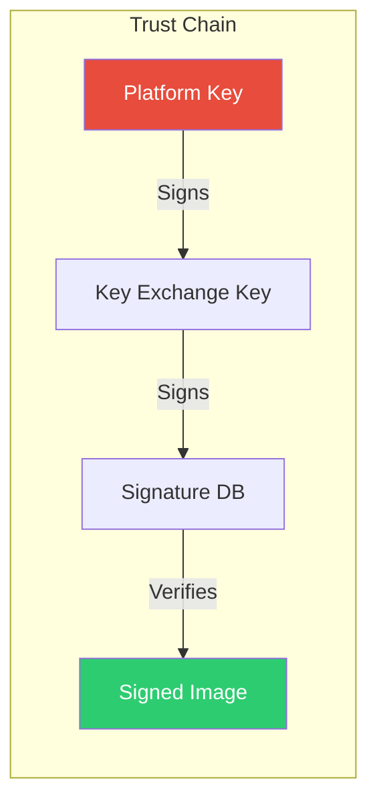
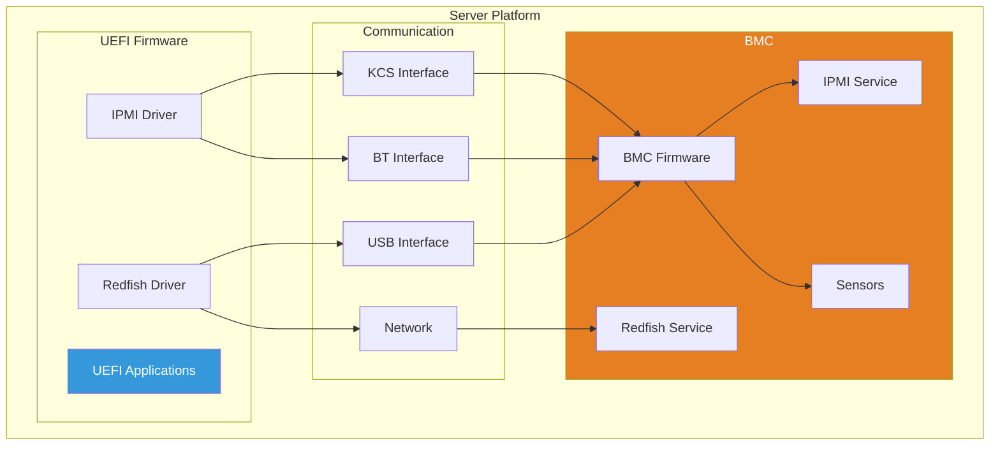
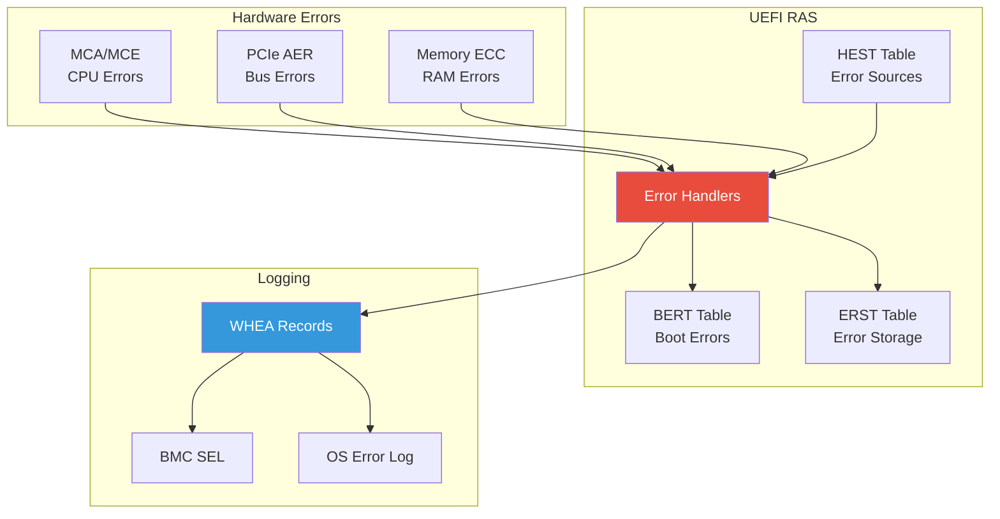
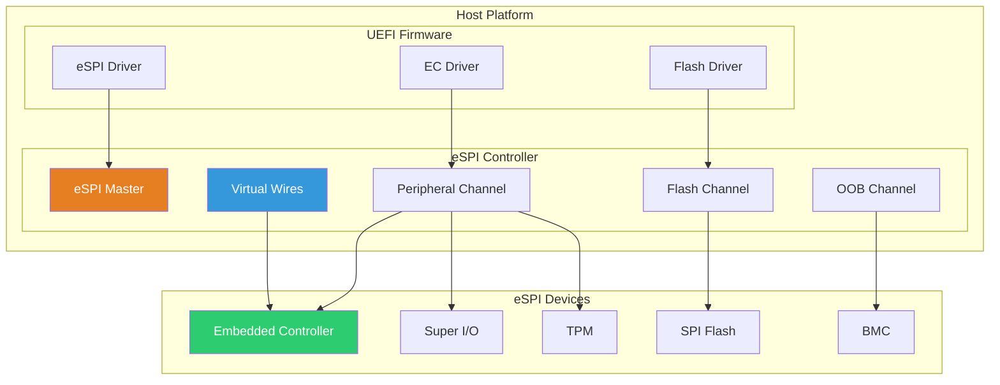
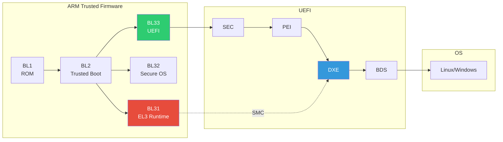
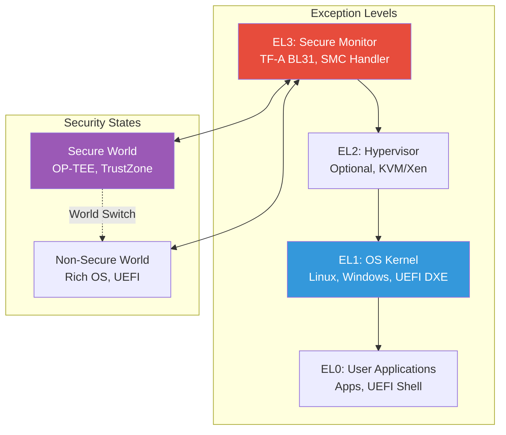

# Part 4: Advanced Topics
{: .fs-9 }

Dive deep into firmware internals and security.
{: .fs-6 .fw-300 }

---

## What You'll Learn

| Chapter | Topics |
|:--------|:-------|
| **[14. PEI Phase]()** | PEIMs, PPIs, HOBs, memory initialization |
| **[15. DXE Phase]()** | Dispatcher, architectural protocols, events |
| **[16. SMM]()** | System Management Mode, security isolation |
| **[17. Security]()** | Secure Boot, TPM, measured boot |
| **[18. ACPI]()** | Table installation, ASL basics |
| **[19. Capsule Updates]()** | Firmware update mechanism |
| **[20. BMC Integration]()** | IPMI, Redfish, BMC-UEFI communication |
| **[21. RAS Features]()** | WHEA, APEI, error handling, reliability |
| **[22. eSPI Interface]()** | Virtual wires, flash access, EC/BMC communication, eDAF |
| **[23. ARM UEFI]()** | Environment setup, TF-A, SystemReady, ARM debugging |

## Boot Phase Deep Dive

## Security Architecture

## BMC Integration Architecture

## RAS Architecture

## eSPI Architecture

## ARM Boot Flow

## ARM Exception Levels

---

{: .warning }
> **Advanced Content:** This section covers low-level firmware internals. A strong understanding of Parts 1-3 is required.

{: .note }
> **Skill Level:** Advanced / Professional
> **Prerequisites:** Parts 1-3 complete, understanding of x86/ARM64 architecture helpful
