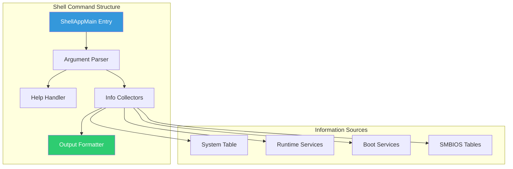

# Chapter 24: Custom Shell Command

Build a fully-featured UEFI Shell command with argument parsing, help text, and formatted output. This project demonstrates professional shell application development.

## Overview

### When to Build Custom Shell Commands

{: .important }
> **Build custom shell commands when you need to:**
> - Create diagnostic or debugging tools for firmware
> - Automate testing workflows in UEFI Shell
> - Provide administrators with platform-specific utilities
> - Prototype features before full driver implementation

| Use Case | Example Command | Purpose |
|:---------|:----------------|:--------|
| **System diagnostics** | `sysinfo`, `memtest` | Display/test hardware |
| **Manufacturing** | `hwcheck`, `sn-program` | Production line tools |
| **Debug utilities** | `dump`, `memdiff` | Developer debugging |
| **Configuration** | `nvconfig`, `bootctl` | Modify settings |
| **Validation** | `pcitest`, `usbtest` | Hardware validation |

**Shell Command vs UEFI Application:**

| Factor | Shell Command | Standalone App |
|:-------|:--------------|:---------------|
| **Execution** | From UEFI Shell | Direct boot or Shell |
| **Arguments** | Shell parses | Self-parsing |
| **Output** | Shell stdio | ConOut protocol |
| **Dependencies** | ShellPkg libraries | Minimal |
| **Best for** | Utilities, scripts | Boot managers, loaders |

**Who Builds Shell Commands:**
- **BIOS engineers**: Debug and manufacturing tools
- **Validation teams**: Hardware test utilities
- **Platform developers**: Configuration utilities
- **Support engineers**: Diagnostic tools for field issues

### What We're Building

A system information utility (`sysinfo`) that displays:
- Firmware information
- Memory statistics
- CPU details
- Boot configuration

```
Shell> sysinfo --help
Usage: sysinfo [options]

Options:
  -a, --all       Show all information
  -m, --memory    Show memory information
  -c, --cpu       Show CPU information
  -f, --firmware  Show firmware information
  -b, --boot      Show boot configuration
  -v, --verbose   Enable verbose output
  -h, --help      Show this help

Shell> sysinfo --all
================================================================================
                         System Information Utility v1.0
================================================================================

Firmware Information:
  Vendor:      EDK II
  Version:     0x00010000
  UEFI Rev:    2.80

Memory Information:
  Total:       4096 MB
  Available:   3584 MB
  Reserved:    512 MB

CPU Information:
  BSP ID:      0
  Architecture: X64

Boot Configuration:
  Timeout:     5 seconds
  Boot Order:  0001, 0002, 0003
================================================================================
```

### Architecture



## Initialization

### Project Structure

```
SysInfo/
├── SysInfo.c           # Main application
├── SysInfo.h           # Declarations
├── SysInfoLib.c        # Information gathering
├── SysInfo.inf         # Module definition
└── SysInfo.uni         # String resources (optional)
```

### INF File

```ini
# SysInfo.inf

[Defines]
  INF_VERSION    = 0x00010006
  BASE_NAME      = SysInfo
  FILE_GUID      = 12345678-1234-1234-1234-123456789ABC
  MODULE_TYPE    = UEFI_APPLICATION
  VERSION_STRING = 1.0
  ENTRY_POINT    = ShellCEntryLib

[Sources]
  SysInfo.c
  SysInfo.h
  SysInfoLib.c

[Packages]
  MdePkg/MdePkg.dec
  MdeModulePkg/MdeModulePkg.dec
  ShellPkg/ShellPkg.dec

[LibraryClasses]
  UefiLib
  ShellLib
  ShellCEntryLib
  BaseMemoryLib
  MemoryAllocationLib
  PrintLib
  UefiBootServicesTableLib
  UefiRuntimeServicesTableLib

[Protocols]
  gEfiSmbiosProtocolGuid

[Guids]
  gEfiGlobalVariableGuid
```

### Header File

```c
// SysInfo.h

#ifndef _SYSINFO_H_
#define _SYSINFO_H_

#include <Uefi.h>
#include <Library/UefiLib.h>
#include <Library/ShellLib.h>
#include <Library/ShellCEntryLib.h>
#include <Library/BaseMemoryLib.h>
#include <Library/MemoryAllocationLib.h>
#include <Library/PrintLib.h>
#include <Library/UefiBootServicesTableLib.h>
#include <Library/UefiRuntimeServicesTableLib.h>
#include <Protocol/Smbios.h>
#include <Guid/GlobalVariable.h>

#define SYSINFO_VERSION  L"1.0"

// Command options
typedef struct {
    BOOLEAN  ShowAll;
    BOOLEAN  ShowMemory;
    BOOLEAN  ShowCpu;
    BOOLEAN  ShowFirmware;
    BOOLEAN  ShowBoot;
    BOOLEAN  Verbose;
    BOOLEAN  ShowHelp;
} SYSINFO_OPTIONS;

// Function prototypes
EFI_STATUS
ParseArguments (
    IN  UINTN             Argc,
    IN  CHAR16            **Argv,
    OUT SYSINFO_OPTIONS   *Options
    );

VOID
PrintHelp (
    VOID
    );

EFI_STATUS
ShowFirmwareInfo (
    IN BOOLEAN  Verbose
    );

EFI_STATUS
ShowMemoryInfo (
    IN BOOLEAN  Verbose
    );

EFI_STATUS
ShowCpuInfo (
    IN BOOLEAN  Verbose
    );

EFI_STATUS
ShowBootInfo (
    IN BOOLEAN  Verbose
    );

VOID
PrintHeader (
    VOID
    );

VOID
PrintFooter (
    VOID
    );

#endif // _SYSINFO_H_
```

## Configuration

### Main Application

```c
// SysInfo.c

#include "SysInfo.h"

/**
  Shell application entry point.

  @param[in] Argc  Argument count
  @param[in] Argv  Argument values

  @retval SHELL_SUCCESS       Command succeeded
  @retval SHELL_INVALID_PARAMETER  Invalid argument
**/
SHELL_STATUS
EFIAPI
ShellAppMain (
    IN UINTN   Argc,
    IN CHAR16  **Argv
    )
{
    EFI_STATUS       Status;
    SYSINFO_OPTIONS  Options;

    // Initialize options
    ZeroMem(&Options, sizeof(Options));

    // Parse command line arguments
    Status = ParseArguments(Argc, Argv, &Options);
    if (EFI_ERROR(Status)) {
        ShellPrintEx(-1, -1, L"Error: Invalid arguments\r\n");
        PrintHelp();
        return SHELL_INVALID_PARAMETER;
    }

    // Handle help request
    if (Options.ShowHelp) {
        PrintHelp();
        return SHELL_SUCCESS;
    }

    // If no specific option, show all
    if (!Options.ShowMemory && !Options.ShowCpu &&
        !Options.ShowFirmware && !Options.ShowBoot) {
        Options.ShowAll = TRUE;
    }

    // Print header
    PrintHeader();

    // Show requested information
    if (Options.ShowAll || Options.ShowFirmware) {
        ShowFirmwareInfo(Options.Verbose);
    }

    if (Options.ShowAll || Options.ShowMemory) {
        ShowMemoryInfo(Options.Verbose);
    }

    if (Options.ShowAll || Options.ShowCpu) {
        ShowCpuInfo(Options.Verbose);
    }

    if (Options.ShowAll || Options.ShowBoot) {
        ShowBootInfo(Options.Verbose);
    }

    // Print footer
    PrintFooter();

    return SHELL_SUCCESS;
}

/**
  Parse command line arguments.
**/
EFI_STATUS
ParseArguments (
    IN  UINTN             Argc,
    IN  CHAR16            **Argv,
    OUT SYSINFO_OPTIONS   *Options
    )
{
    UINTN  Index;

    for (Index = 1; Index < Argc; Index++) {
        if (StrCmp(Argv[Index], L"-a") == 0 ||
            StrCmp(Argv[Index], L"--all") == 0) {
            Options->ShowAll = TRUE;
        }
        else if (StrCmp(Argv[Index], L"-m") == 0 ||
                 StrCmp(Argv[Index], L"--memory") == 0) {
            Options->ShowMemory = TRUE;
        }
        else if (StrCmp(Argv[Index], L"-c") == 0 ||
                 StrCmp(Argv[Index], L"--cpu") == 0) {
            Options->ShowCpu = TRUE;
        }
        else if (StrCmp(Argv[Index], L"-f") == 0 ||
                 StrCmp(Argv[Index], L"--firmware") == 0) {
            Options->ShowFirmware = TRUE;
        }
        else if (StrCmp(Argv[Index], L"-b") == 0 ||
                 StrCmp(Argv[Index], L"--boot") == 0) {
            Options->ShowBoot = TRUE;
        }
        else if (StrCmp(Argv[Index], L"-v") == 0 ||
                 StrCmp(Argv[Index], L"--verbose") == 0) {
            Options->Verbose = TRUE;
        }
        else if (StrCmp(Argv[Index], L"-h") == 0 ||
                 StrCmp(Argv[Index], L"--help") == 0 ||
                 StrCmp(Argv[Index], L"-?") == 0) {
            Options->ShowHelp = TRUE;
        }
        else {
            // Unknown argument
            return EFI_INVALID_PARAMETER;
        }
    }

    return EFI_SUCCESS;
}

/**
  Print help text.
**/
VOID
PrintHelp (
    VOID
    )
{
    ShellPrintEx(-1, -1,
        L"SysInfo - System Information Utility v%s\r\n"
        L"\r\n"
        L"Usage: sysinfo [options]\r\n"
        L"\r\n"
        L"Options:\r\n"
        L"  -a, --all       Show all information\r\n"
        L"  -m, --memory    Show memory information\r\n"
        L"  -c, --cpu       Show CPU information\r\n"
        L"  -f, --firmware  Show firmware information\r\n"
        L"  -b, --boot      Show boot configuration\r\n"
        L"  -v, --verbose   Enable verbose output\r\n"
        L"  -h, --help      Show this help\r\n"
        L"\r\n"
        L"Examples:\r\n"
        L"  sysinfo --all           Show all system information\r\n"
        L"  sysinfo -m -c           Show memory and CPU info\r\n"
        L"  sysinfo --firmware -v   Show verbose firmware info\r\n",
        SYSINFO_VERSION
    );
}

/**
  Print decorative header.
**/
VOID
PrintHeader (
    VOID
    )
{
    ShellPrintEx(-1, -1,
        L"\r\n"
        L"================================================================================\r\n"
        L"                         System Information Utility v%s\r\n"
        L"================================================================================\r\n"
        L"\r\n",
        SYSINFO_VERSION
    );
}

/**
  Print decorative footer.
**/
VOID
PrintFooter (
    VOID
    )
{
    ShellPrintEx(-1, -1,
        L"================================================================================\r\n"
        L"\r\n"
    );
}
```

### Information Library

```c
// SysInfoLib.c

#include "SysInfo.h"

/**
  Show firmware information from System Table.
**/
EFI_STATUS
ShowFirmwareInfo (
    IN BOOLEAN  Verbose
    )
{
    ShellPrintEx(-1, -1, L"Firmware Information:\r\n");
    ShellPrintEx(-1, -1, L"  Vendor:      %s\r\n", gST->FirmwareVendor);
    ShellPrintEx(-1, -1, L"  Version:     0x%08X\r\n", gST->FirmwareRevision);
    ShellPrintEx(-1, -1, L"  UEFI Rev:    %d.%02d\r\n",
        gST->Hdr.Revision >> 16,
        gST->Hdr.Revision & 0xFFFF
    );

    if (Verbose) {
        ShellPrintEx(-1, -1, L"  Table CRC:   0x%08X\r\n", gST->Hdr.CRC32);
        ShellPrintEx(-1, -1, L"  Config Tbl:  %d entries\r\n",
            gST->NumberOfTableEntries);

        // List configuration tables
        for (UINTN i = 0; i < gST->NumberOfTableEntries; i++) {
            ShellPrintEx(-1, -1, L"    [%d] %g\r\n",
                i, &gST->ConfigurationTable[i].VendorGuid);
        }
    }

    ShellPrintEx(-1, -1, L"\r\n");
    return EFI_SUCCESS;
}

/**
  Show memory information from memory map.
**/
EFI_STATUS
ShowMemoryInfo (
    IN BOOLEAN  Verbose
    )
{
    EFI_STATUS             Status;
    UINTN                  MemoryMapSize = 0;
    EFI_MEMORY_DESCRIPTOR  *MemoryMap = NULL;
    EFI_MEMORY_DESCRIPTOR  *Entry;
    UINTN                  MapKey;
    UINTN                  DescriptorSize;
    UINT32                 DescriptorVersion;
    UINT64                 TotalMemory = 0;
    UINT64                 ConventionalMemory = 0;
    UINT64                 ReservedMemory = 0;
    UINT64                 MmioMemory = 0;
    UINTN                  Index;

    // Get memory map size
    Status = gBS->GetMemoryMap(
        &MemoryMapSize,
        MemoryMap,
        &MapKey,
        &DescriptorSize,
        &DescriptorVersion
    );

    if (Status != EFI_BUFFER_TOO_SMALL) {
        return Status;
    }

    // Allocate buffer (add extra space)
    MemoryMapSize += 2 * DescriptorSize;
    MemoryMap = AllocatePool(MemoryMapSize);
    if (MemoryMap == NULL) {
        return EFI_OUT_OF_RESOURCES;
    }

    // Get actual memory map
    Status = gBS->GetMemoryMap(
        &MemoryMapSize,
        MemoryMap,
        &MapKey,
        &DescriptorSize,
        &DescriptorVersion
    );

    if (EFI_ERROR(Status)) {
        FreePool(MemoryMap);
        return Status;
    }

    // Calculate memory statistics
    Entry = MemoryMap;
    for (Index = 0; Index < MemoryMapSize / DescriptorSize; Index++) {
        UINT64 Size = Entry->NumberOfPages * EFI_PAGE_SIZE;

        switch (Entry->Type) {
        case EfiConventionalMemory:
        case EfiLoaderCode:
        case EfiLoaderData:
        case EfiBootServicesCode:
        case EfiBootServicesData:
            ConventionalMemory += Size;
            break;

        case EfiReservedMemoryType:
        case EfiRuntimeServicesCode:
        case EfiRuntimeServicesData:
        case EfiACPIReclaimMemory:
        case EfiACPIMemoryNVS:
            ReservedMemory += Size;
            break;

        case EfiMemoryMappedIO:
        case EfiMemoryMappedIOPortSpace:
            MmioMemory += Size;
            break;
        }

        TotalMemory += Size;
        Entry = (EFI_MEMORY_DESCRIPTOR *)((UINT8 *)Entry + DescriptorSize);
    }

    // Print summary
    ShellPrintEx(-1, -1, L"Memory Information:\r\n");
    ShellPrintEx(-1, -1, L"  Total:       %ld MB\r\n", TotalMemory / (1024 * 1024));
    ShellPrintEx(-1, -1, L"  Available:   %ld MB\r\n", ConventionalMemory / (1024 * 1024));
    ShellPrintEx(-1, -1, L"  Reserved:    %ld MB\r\n", ReservedMemory / (1024 * 1024));

    if (Verbose) {
        ShellPrintEx(-1, -1, L"  MMIO:        %ld MB\r\n", MmioMemory / (1024 * 1024));
        ShellPrintEx(-1, -1, L"  Descriptors: %d\r\n", MemoryMapSize / DescriptorSize);
        ShellPrintEx(-1, -1, L"  Desc Size:   %d bytes\r\n", DescriptorSize);

        // Detailed memory map
        ShellPrintEx(-1, -1, L"\r\n  Detailed Memory Map:\r\n");
        Entry = MemoryMap;
        for (Index = 0; Index < MemoryMapSize / DescriptorSize; Index++) {
            CHAR16 *TypeStr;

            switch (Entry->Type) {
            case EfiConventionalMemory:     TypeStr = L"Conventional"; break;
            case EfiLoaderCode:             TypeStr = L"LoaderCode"; break;
            case EfiLoaderData:             TypeStr = L"LoaderData"; break;
            case EfiBootServicesCode:       TypeStr = L"BSCode"; break;
            case EfiBootServicesData:       TypeStr = L"BSData"; break;
            case EfiRuntimeServicesCode:    TypeStr = L"RTCode"; break;
            case EfiRuntimeServicesData:    TypeStr = L"RTData"; break;
            case EfiReservedMemoryType:     TypeStr = L"Reserved"; break;
            case EfiACPIReclaimMemory:      TypeStr = L"ACPIReclaim"; break;
            case EfiACPIMemoryNVS:          TypeStr = L"ACPINVS"; break;
            case EfiMemoryMappedIO:         TypeStr = L"MMIO"; break;
            default:                        TypeStr = L"Other"; break;
            }

            ShellPrintEx(-1, -1,
                L"    %016lX - %016lX [%s]\r\n",
                Entry->PhysicalStart,
                Entry->PhysicalStart + Entry->NumberOfPages * EFI_PAGE_SIZE - 1,
                TypeStr
            );

            Entry = (EFI_MEMORY_DESCRIPTOR *)((UINT8 *)Entry + DescriptorSize);
        }
    }

    FreePool(MemoryMap);
    ShellPrintEx(-1, -1, L"\r\n");
    return EFI_SUCCESS;
}

/**
  Show CPU information.
**/
EFI_STATUS
ShowCpuInfo (
    IN BOOLEAN  Verbose
    )
{
    ShellPrintEx(-1, -1, L"CPU Information:\r\n");
    ShellPrintEx(-1, -1, L"  BSP ID:      0\r\n");

#if defined(MDE_CPU_X64)
    ShellPrintEx(-1, -1, L"  Architecture: X64\r\n");
#elif defined(MDE_CPU_IA32)
    ShellPrintEx(-1, -1, L"  Architecture: IA32\r\n");
#elif defined(MDE_CPU_AARCH64)
    ShellPrintEx(-1, -1, L"  Architecture: AArch64\r\n");
#elif defined(MDE_CPU_ARM)
    ShellPrintEx(-1, -1, L"  Architecture: ARM\r\n");
#else
    ShellPrintEx(-1, -1, L"  Architecture: Unknown\r\n");
#endif

    if (Verbose) {
        // Add CPUID information for x86 if available
#if defined(MDE_CPU_X64) || defined(MDE_CPU_IA32)
        UINT32 Eax, Ebx, Ecx, Edx;
        CHAR8  VendorString[13];

        // Get vendor string
        AsmCpuid(0, &Eax, &Ebx, &Ecx, &Edx);
        *(UINT32 *)&VendorString[0] = Ebx;
        *(UINT32 *)&VendorString[4] = Edx;
        *(UINT32 *)&VendorString[8] = Ecx;
        VendorString[12] = '\0';

        ShellPrintEx(-1, -1, L"  Vendor:      %a\r\n", VendorString);
        ShellPrintEx(-1, -1, L"  Max CPUID:   0x%X\r\n", Eax);
#endif
    }

    ShellPrintEx(-1, -1, L"\r\n");
    return EFI_SUCCESS;
}

/**
  Show boot configuration.
**/
EFI_STATUS
ShowBootInfo (
    IN BOOLEAN  Verbose
    )
{
    EFI_STATUS  Status;
    UINT16      Timeout;
    UINT16      *BootOrder = NULL;
    UINTN       BootOrderSize = 0;
    UINTN       Size;

    ShellPrintEx(-1, -1, L"Boot Configuration:\r\n");

    // Get boot timeout
    Size = sizeof(Timeout);
    Status = gRT->GetVariable(
        L"Timeout",
        &gEfiGlobalVariableGuid,
        NULL,
        &Size,
        &Timeout
    );

    if (!EFI_ERROR(Status)) {
        ShellPrintEx(-1, -1, L"  Timeout:     %d seconds\r\n", Timeout);
    }

    // Get boot order
    Status = gRT->GetVariable(
        L"BootOrder",
        &gEfiGlobalVariableGuid,
        NULL,
        &BootOrderSize,
        NULL
    );

    if (Status == EFI_BUFFER_TOO_SMALL) {
        BootOrder = AllocatePool(BootOrderSize);
        if (BootOrder != NULL) {
            Status = gRT->GetVariable(
                L"BootOrder",
                &gEfiGlobalVariableGuid,
                NULL,
                &BootOrderSize,
                BootOrder
            );

            if (!EFI_ERROR(Status)) {
                ShellPrintEx(-1, -1, L"  Boot Order:  ");
                for (UINTN i = 0; i < BootOrderSize / sizeof(UINT16); i++) {
                    ShellPrintEx(-1, -1, L"%04X", BootOrder[i]);
                    if (i < BootOrderSize / sizeof(UINT16) - 1) {
                        ShellPrintEx(-1, -1, L", ");
                    }
                }
                ShellPrintEx(-1, -1, L"\r\n");

                // Show boot option details in verbose mode
                if (Verbose) {
                    for (UINTN i = 0; i < BootOrderSize / sizeof(UINT16); i++) {
                        CHAR16  BootName[16];
                        UINT8   *BootOption = NULL;
                        UINTN   BootOptionSize = 0;

                        UnicodeSPrint(BootName, sizeof(BootName),
                            L"Boot%04X", BootOrder[i]);

                        Status = gRT->GetVariable(
                            BootName,
                            &gEfiGlobalVariableGuid,
                            NULL,
                            &BootOptionSize,
                            NULL
                        );

                        if (Status == EFI_BUFFER_TOO_SMALL) {
                            BootOption = AllocatePool(BootOptionSize);
                            if (BootOption != NULL) {
                                Status = gRT->GetVariable(
                                    BootName,
                                    &gEfiGlobalVariableGuid,
                                    NULL,
                                    &BootOptionSize,
                                    BootOption
                                );

                                if (!EFI_ERROR(Status)) {
                                    // EFI_LOAD_OPTION structure
                                    // Skip Attributes (4), FilePathListLength (2)
                                    CHAR16 *Description = (CHAR16 *)(BootOption + 6);
                                    ShellPrintEx(-1, -1,
                                        L"    [%04X] %s\r\n",
                                        BootOrder[i],
                                        Description
                                    );
                                }
                                FreePool(BootOption);
                            }
                        }
                    }
                }
            }
            FreePool(BootOrder);
        }
    }

    ShellPrintEx(-1, -1, L"\r\n");
    return EFI_SUCCESS;
}
```

## Porting Guide

### Platform Considerations

| Aspect | Consideration |
|--------|---------------|
| CPU Architecture | CPUID only available on x86; use #ifdef |
| Memory Map | Layout varies by platform |
| SMBIOS | May not be present on all systems |
| Boot Variables | Protected on Secure Boot enabled systems |

### Adding SMBIOS Support

```c
// Optional: Add SMBIOS information
EFI_STATUS
ShowSmbiosInfo (
    IN BOOLEAN  Verbose
    )
{
    EFI_STATUS            Status;
    EFI_SMBIOS_PROTOCOL   *Smbios;
    EFI_SMBIOS_HANDLE     Handle = SMBIOS_HANDLE_PI_RESERVED;
    EFI_SMBIOS_TABLE_HEADER *Record;
    EFI_SMBIOS_TYPE       Type;

    Status = gBS->LocateProtocol(
        &gEfiSmbiosProtocolGuid,
        NULL,
        (VOID **)&Smbios
    );

    if (EFI_ERROR(Status)) {
        ShellPrintEx(-1, -1, L"SMBIOS not available\r\n");
        return Status;
    }

    ShellPrintEx(-1, -1, L"SMBIOS Information:\r\n");

    // Get BIOS Information (Type 0)
    Type = 0;
    Status = Smbios->GetNext(Smbios, &Handle, &Type, &Record, NULL);
    if (!EFI_ERROR(Status)) {
        SMBIOS_TABLE_TYPE0 *Type0 = (SMBIOS_TABLE_TYPE0 *)Record;
        CHAR8 *Strings = (CHAR8 *)Record + Record->Length;

        // Get vendor string (index 1)
        if (Type0->Vendor > 0) {
            CHAR8 *Vendor = Strings;
            for (UINT8 i = 1; i < Type0->Vendor; i++) {
                Vendor += AsciiStrLen(Vendor) + 1;
            }
            ShellPrintEx(-1, -1, L"  BIOS Vendor: %a\r\n", Vendor);
        }
    }

    // Get System Information (Type 1)
    Handle = SMBIOS_HANDLE_PI_RESERVED;
    Type = 1;
    Status = Smbios->GetNext(Smbios, &Handle, &Type, &Record, NULL);
    if (!EFI_ERROR(Status)) {
        SMBIOS_TABLE_TYPE1 *Type1 = (SMBIOS_TABLE_TYPE1 *)Record;
        CHAR8 *Strings = (CHAR8 *)Record + Record->Length;

        // Get manufacturer string
        if (Type1->Manufacturer > 0) {
            CHAR8 *Mfr = Strings;
            for (UINT8 i = 1; i < Type1->Manufacturer; i++) {
                Mfr += AsciiStrLen(Mfr) + 1;
            }
            ShellPrintEx(-1, -1, L"  System Mfr:  %a\r\n", Mfr);
        }
    }

    ShellPrintEx(-1, -1, L"\r\n");
    return EFI_SUCCESS;
}
```

### Adding to Package DSC

```ini
# Add to UefiGuidePkg.dsc

[Components]
  UefiGuidePkg/SysInfo/SysInfo.inf
```

## Testing

### Build and Run

```bash
# Build
cd edk2
source edksetup.sh
build -a X64 -t GCC5 -p UefiGuidePkg/UefiGuidePkg.dsc

# Copy to ESP
cp Build/UefiGuidePkg/DEBUG_GCC5/X64/SysInfo.efi /path/to/esp/

# In UEFI Shell
Shell> fs0:
FS0:\> SysInfo.efi --help
FS0:\> SysInfo.efi --all
FS0:\> SysInfo.efi -m -v
```

### Expected Output

```
================================================================================
                         System Information Utility v1.0
================================================================================

Firmware Information:
  Vendor:      EDK II
  Version:     0x00010000
  UEFI Rev:    2.80

Memory Information:
  Total:       4096 MB
  Available:   3584 MB
  Reserved:    512 MB

CPU Information:
  BSP ID:      0
  Architecture: X64

Boot Configuration:
  Timeout:     5 seconds
  Boot Order:  0001, 0002, 0003
================================================================================
```

## Extension Ideas

1. **Color output**: Use console attributes for colored text
2. **Configuration file**: Read settings from a file
3. **Export options**: Save output to file in various formats (text, JSON)
4. **Interactive mode**: Add a menu-driven interface
5. **Network info**: Show network interface configuration

---

{: .note }
> **Source Code**: See [`examples/UefiGuidePkg/ShellCommand/`](https://github.com/MichaelTien8901/uefi-guide-tutorial/tree/main/examples/UefiGuidePkg/ShellCommand) for the complete buildable example.

## References

- [EDK2 ShellPkg](https://github.com/tianocore/edk2/tree/master/ShellPkg)
- [UEFI Shell Specification](https://uefi.org/sites/default/files/resources/UEFI_Shell_2_2.pdf)
- [ShellLib Documentation](https://github.com/tianocore/edk2/blob/master/ShellPkg/Include/Library/ShellLib.h)

---

*Next: [Chapter 25: Graphical Boot Menu](../25-boot-menu/) - Build a visual boot option selector.*
