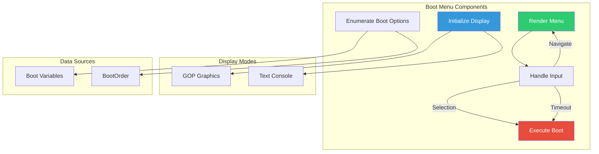

# Chapter 25: Graphical Boot Menu

Build a visual boot option selector with keyboard navigation, timeout countdown, and graphical rendering using GOP.

## Overview

### What We're Building

A graphical boot menu that:
- Displays boot options in a visual menu
- Supports keyboard navigation (up/down, Enter, Escape)
- Shows countdown timer with auto-boot
- Renders graphics using GOP
- Falls back to text mode if GOP unavailable

```
┌──────────────────────────────────────────────────────────┐
│                                                          │
│                   UEFI Boot Menu v1.0                    │
│                                                          │
├──────────────────────────────────────────────────────────┤
│                                                          │
│      ►  Windows Boot Manager                             │
│         Ubuntu                                           │
│         Fedora Linux                                     │
│         UEFI Shell                                       │
│         Enter Setup                                      │
│                                                          │
├──────────────────────────────────────────────────────────┤
│  [↑/↓] Select   [Enter] Boot   [Esc] Reboot   [5s]      │
└──────────────────────────────────────────────────────────┘
```

### Architecture



## Initialization

### Project Structure

```
BootMenu/
├── BootMenu.c          # Main application
├── BootMenu.h          # Declarations
├── Graphics.c          # GOP rendering
├── Input.c             # Keyboard handling
├── BootOptions.c       # Boot option enumeration
├── BootMenu.inf        # Module definition
└── Colors.h            # Color definitions
```

### INF File

```ini
# BootMenu.inf

[Defines]
  INF_VERSION    = 0x00010006
  BASE_NAME      = BootMenu
  FILE_GUID      = ABCD1234-5678-9ABC-DEF0-123456789ABC
  MODULE_TYPE    = UEFI_APPLICATION
  VERSION_STRING = 1.0
  ENTRY_POINT    = UefiMain

[Sources]
  BootMenu.c
  BootMenu.h
  Graphics.c
  Input.c
  BootOptions.c
  Colors.h

[Packages]
  MdePkg/MdePkg.dec
  MdeModulePkg/MdeModulePkg.dec

[LibraryClasses]
  UefiApplicationEntryPoint
  UefiLib
  UefiBootServicesTableLib
  UefiRuntimeServicesTableLib
  BaseMemoryLib
  MemoryAllocationLib
  PrintLib
  DevicePathLib

[Protocols]
  gEfiGraphicsOutputProtocolGuid
  gEfiSimpleTextInputExProtocolGuid
  gEfiLoadedImageProtocolGuid
  gEfiDevicePathProtocolGuid

[Guids]
  gEfiGlobalVariableGuid
```

### Header Files

```c
// BootMenu.h

#ifndef _BOOT_MENU_H_
#define _BOOT_MENU_H_

#include <Uefi.h>
#include <Library/UefiLib.h>
#include <Library/UefiBootServicesTableLib.h>
#include <Library/UefiRuntimeServicesTableLib.h>
#include <Library/BaseMemoryLib.h>
#include <Library/MemoryAllocationLib.h>
#include <Library/PrintLib.h>
#include <Library/DevicePathLib.h>
#include <Protocol/GraphicsOutput.h>
#include <Protocol/SimpleTextInEx.h>
#include <Protocol/LoadedImage.h>
#include <Protocol/DevicePath.h>
#include <Guid/GlobalVariable.h>

#define MENU_VERSION     L"1.0"
#define MAX_BOOT_OPTIONS 20
#define DEFAULT_TIMEOUT  5

// Boot option structure
typedef struct {
    UINT16   BootNum;
    CHAR16   *Description;
    UINT32   Attributes;
    EFI_DEVICE_PATH_PROTOCOL  *DevicePath;
} BOOT_OPTION;

// Menu state
typedef struct {
    BOOT_OPTION  Options[MAX_BOOT_OPTIONS];
    UINTN        OptionCount;
    UINTN        SelectedIndex;
    UINTN        Timeout;
    BOOLEAN      UseGraphics;
} MENU_STATE;

// Function prototypes
EFI_STATUS InitializeDisplay(OUT BOOLEAN *UseGraphics);
EFI_STATUS EnumerateBootOptions(IN OUT MENU_STATE *State);
EFI_STATUS RenderMenu(IN MENU_STATE *State);
EFI_STATUS HandleInput(IN OUT MENU_STATE *State, OUT BOOLEAN *ShouldBoot, OUT BOOLEAN *ShouldExit);
EFI_STATUS ExecuteBoot(IN BOOT_OPTION *Option);
VOID FreeBootOptions(IN MENU_STATE *State);

// Graphics functions
EFI_STATUS GopDrawRect(UINTN X, UINTN Y, UINTN Width, UINTN Height, UINT32 Color);
EFI_STATUS GopDrawText(UINTN X, UINTN Y, CHAR16 *Text, UINT32 FgColor, UINT32 BgColor);
EFI_STATUS GopClearScreen(UINT32 Color);
VOID GetScreenSize(OUT UINTN *Width, OUT UINTN *Height);

#endif // _BOOT_MENU_H_
```

```c
// Colors.h

#ifndef _COLORS_H_
#define _COLORS_H_

// ARGB color definitions (for GOP)
#define COLOR_BLACK       0x00000000
#define COLOR_WHITE       0x00FFFFFF
#define COLOR_GRAY        0x00808080
#define COLOR_DARK_GRAY   0x00404040
#define COLOR_LIGHT_GRAY  0x00C0C0C0
#define COLOR_BLUE        0x000000FF
#define COLOR_DARK_BLUE   0x00000080
#define COLOR_LIGHT_BLUE  0x008080FF
#define COLOR_GREEN       0x0000FF00
#define COLOR_RED         0x00FF0000
#define COLOR_CYAN        0x0000FFFF
#define COLOR_YELLOW      0x00FFFF00

// Menu theme colors
#define MENU_BG_COLOR       COLOR_DARK_BLUE
#define MENU_FG_COLOR       COLOR_WHITE
#define MENU_BORDER_COLOR   COLOR_LIGHT_BLUE
#define MENU_SELECT_BG      COLOR_LIGHT_BLUE
#define MENU_SELECT_FG      COLOR_BLACK
#define MENU_TITLE_COLOR    COLOR_CYAN

#endif // _COLORS_H_
```

## Configuration

### Main Application

```c
// BootMenu.c

#include "BootMenu.h"
#include "Colors.h"

// Global GOP protocol
EFI_GRAPHICS_OUTPUT_PROTOCOL *gGop = NULL;

/**
  Main entry point for Boot Menu application.
**/
EFI_STATUS
EFIAPI
UefiMain (
    IN EFI_HANDLE        ImageHandle,
    IN EFI_SYSTEM_TABLE  *SystemTable
    )
{
    EFI_STATUS   Status;
    MENU_STATE   State;
    BOOLEAN      ShouldBoot = FALSE;
    BOOLEAN      ShouldExit = FALSE;
    EFI_EVENT    TimerEvent;
    UINT64       TimerPeriod = 10000000;  // 1 second in 100ns units

    // Initialize state
    ZeroMem(&State, sizeof(State));
    State.Timeout = DEFAULT_TIMEOUT;

    // Initialize display (GOP or text)
    Status = InitializeDisplay(&State.UseGraphics);
    if (EFI_ERROR(Status)) {
        Print(L"Failed to initialize display: %r\n", Status);
        return Status;
    }

    // Enumerate boot options
    Status = EnumerateBootOptions(&State);
    if (EFI_ERROR(Status) || State.OptionCount == 0) {
        Print(L"No boot options found\n");
        gBS->Stall(3000000);
        return EFI_NOT_FOUND;
    }

    // Create timer event for countdown
    Status = gBS->CreateEvent(
        EVT_TIMER,
        TPL_CALLBACK,
        NULL,
        NULL,
        &TimerEvent
    );

    if (!EFI_ERROR(Status)) {
        gBS->SetTimer(TimerEvent, TimerPeriodic, TimerPeriod);
    }

    // Main menu loop
    while (!ShouldBoot && !ShouldExit) {
        // Render menu
        Status = RenderMenu(&State);

        // Handle input with timeout
        Status = HandleInput(&State, &ShouldBoot, &ShouldExit);

        // Check timer for countdown
        if (State.Timeout > 0) {
            EFI_STATUS TimerStatus;
            UINTN Index;

            TimerStatus = gBS->CheckEvent(TimerEvent);
            if (TimerStatus == EFI_SUCCESS) {
                State.Timeout--;
                if (State.Timeout == 0) {
                    ShouldBoot = TRUE;
                }
            }
        }
    }

    // Clean up timer
    gBS->CloseEvent(TimerEvent);

    // Execute boot if requested
    if (ShouldBoot && State.SelectedIndex < State.OptionCount) {
        // Clear screen before boot
        if (State.UseGraphics) {
            GopClearScreen(COLOR_BLACK);
        } else {
            gST->ConOut->ClearScreen(gST->ConOut);
        }

        Status = ExecuteBoot(&State.Options[State.SelectedIndex]);
        if (EFI_ERROR(Status)) {
            Print(L"Boot failed: %r\n", Status);
            gBS->Stall(3000000);
        }
    }

    // Free resources
    FreeBootOptions(&State);

    return EFI_SUCCESS;
}
```

### Boot Options Enumeration

```c
// BootOptions.c

#include "BootMenu.h"

/**
  Enumerate boot options from UEFI variables.
**/
EFI_STATUS
EnumerateBootOptions (
    IN OUT MENU_STATE  *State
    )
{
    EFI_STATUS  Status;
    UINT16      *BootOrder = NULL;
    UINTN       BootOrderSize = 0;
    UINTN       Index;

    // Get BootOrder variable size
    Status = gRT->GetVariable(
        L"BootOrder",
        &gEfiGlobalVariableGuid,
        NULL,
        &BootOrderSize,
        NULL
    );

    if (Status != EFI_BUFFER_TOO_SMALL) {
        return EFI_NOT_FOUND;
    }

    // Allocate and get BootOrder
    BootOrder = AllocatePool(BootOrderSize);
    if (BootOrder == NULL) {
        return EFI_OUT_OF_RESOURCES;
    }

    Status = gRT->GetVariable(
        L"BootOrder",
        &gEfiGlobalVariableGuid,
        NULL,
        &BootOrderSize,
        BootOrder
    );

    if (EFI_ERROR(Status)) {
        FreePool(BootOrder);
        return Status;
    }

    // Enumerate each boot option
    State->OptionCount = 0;
    for (Index = 0; Index < BootOrderSize / sizeof(UINT16); Index++) {
        if (State->OptionCount >= MAX_BOOT_OPTIONS) {
            break;
        }

        Status = LoadBootOption(BootOrder[Index],
            &State->Options[State->OptionCount]);

        if (!EFI_ERROR(Status)) {
            State->OptionCount++;
        }
    }

    FreePool(BootOrder);
    return (State->OptionCount > 0) ? EFI_SUCCESS : EFI_NOT_FOUND;
}

/**
  Load a single boot option from variable.
**/
EFI_STATUS
LoadBootOption (
    IN  UINT16       BootNum,
    OUT BOOT_OPTION  *Option
    )
{
    EFI_STATUS  Status;
    CHAR16      BootName[16];
    UINT8       *BootData = NULL;
    UINTN       BootDataSize = 0;
    UINTN       DescLen;

    UnicodeSPrint(BootName, sizeof(BootName), L"Boot%04X", BootNum);

    // Get size
    Status = gRT->GetVariable(
        BootName,
        &gEfiGlobalVariableGuid,
        NULL,
        &BootDataSize,
        NULL
    );

    if (Status != EFI_BUFFER_TOO_SMALL) {
        return EFI_NOT_FOUND;
    }

    // Allocate and get data
    BootData = AllocatePool(BootDataSize);
    if (BootData == NULL) {
        return EFI_OUT_OF_RESOURCES;
    }

    Status = gRT->GetVariable(
        BootName,
        &gEfiGlobalVariableGuid,
        NULL,
        &BootDataSize,
        BootData
    );

    if (EFI_ERROR(Status)) {
        FreePool(BootData);
        return Status;
    }

    // Parse EFI_LOAD_OPTION structure
    // Offset 0: Attributes (UINT32)
    // Offset 4: FilePathListLength (UINT16)
    // Offset 6: Description (null-terminated CHAR16)
    // After Description: DevicePath

    Option->BootNum = BootNum;
    Option->Attributes = *(UINT32 *)BootData;

    // Copy description
    CHAR16 *SrcDesc = (CHAR16 *)(BootData + 6);
    DescLen = StrLen(SrcDesc) + 1;
    Option->Description = AllocatePool(DescLen * sizeof(CHAR16));
    if (Option->Description != NULL) {
        StrCpyS(Option->Description, DescLen, SrcDesc);
    }

    // Get device path (after description)
    UINT16 FilePathLen = *(UINT16 *)(BootData + 4);
    UINT8 *DevicePathStart = BootData + 6 + DescLen * sizeof(CHAR16);
    Option->DevicePath = AllocateCopyPool(FilePathLen, DevicePathStart);

    FreePool(BootData);
    return EFI_SUCCESS;
}

/**
  Execute the selected boot option.
**/
EFI_STATUS
ExecuteBoot (
    IN BOOT_OPTION  *Option
    )
{
    EFI_STATUS                Status;
    EFI_HANDLE                ImageHandle;
    EFI_DEVICE_PATH_PROTOCOL  *DevicePath;

    if (Option == NULL || Option->DevicePath == NULL) {
        return EFI_INVALID_PARAMETER;
    }

    Print(L"Booting: %s\n", Option->Description);

    DevicePath = Option->DevicePath;

    // Load the image
    Status = gBS->LoadImage(
        FALSE,
        gImageHandle,
        DevicePath,
        NULL,
        0,
        &ImageHandle
    );

    if (EFI_ERROR(Status)) {
        Print(L"LoadImage failed: %r\n", Status);
        return Status;
    }

    // Start the image
    Status = gBS->StartImage(ImageHandle, NULL, NULL);

    // If we return, unload the image
    gBS->UnloadImage(ImageHandle);

    return Status;
}

/**
  Free boot option resources.
**/
VOID
FreeBootOptions (
    IN MENU_STATE  *State
    )
{
    for (UINTN i = 0; i < State->OptionCount; i++) {
        if (State->Options[i].Description != NULL) {
            FreePool(State->Options[i].Description);
        }
        if (State->Options[i].DevicePath != NULL) {
            FreePool(State->Options[i].DevicePath);
        }
    }
    State->OptionCount = 0;
}
```

### Graphics Rendering

```c
// Graphics.c

#include "BootMenu.h"
#include "Colors.h"

extern EFI_GRAPHICS_OUTPUT_PROTOCOL *gGop;

// Font dimensions (using built-in 8x16 font approximation)
#define CHAR_WIDTH   8
#define CHAR_HEIGHT  16

/**
  Initialize display - try GOP first, fall back to text.
**/
EFI_STATUS
InitializeDisplay (
    OUT BOOLEAN  *UseGraphics
    )
{
    EFI_STATUS  Status;

    *UseGraphics = FALSE;

    // Try to get GOP
    Status = gBS->LocateProtocol(
        &gEfiGraphicsOutputProtocolGuid,
        NULL,
        (VOID **)&gGop
    );

    if (!EFI_ERROR(Status) && gGop != NULL) {
        *UseGraphics = TRUE;

        // Optionally set a preferred video mode
        // For now, use current mode
    }

    // Initialize console regardless
    gST->ConOut->SetAttribute(gST->ConOut, EFI_WHITE | EFI_BACKGROUND_BLACK);
    gST->ConOut->ClearScreen(gST->ConOut);
    gST->ConOut->EnableCursor(gST->ConOut, FALSE);

    return EFI_SUCCESS;
}

/**
  Get screen dimensions.
**/
VOID
GetScreenSize (
    OUT UINTN  *Width,
    OUT UINTN  *Height
    )
{
    if (gGop != NULL) {
        *Width = gGop->Mode->Info->HorizontalResolution;
        *Height = gGop->Mode->Info->VerticalResolution;
    } else {
        // Text mode dimensions (approximate)
        *Width = 80 * CHAR_WIDTH;
        *Height = 25 * CHAR_HEIGHT;
    }
}

/**
  Clear screen with solid color.
**/
EFI_STATUS
GopClearScreen (
    UINT32  Color
    )
{
    if (gGop == NULL) {
        gST->ConOut->ClearScreen(gST->ConOut);
        return EFI_SUCCESS;
    }

    EFI_GRAPHICS_OUTPUT_BLT_PIXEL Pixel;
    Pixel.Blue = Color & 0xFF;
    Pixel.Green = (Color >> 8) & 0xFF;
    Pixel.Red = (Color >> 16) & 0xFF;
    Pixel.Reserved = 0;

    return gGop->Blt(
        gGop,
        &Pixel,
        EfiBltVideoFill,
        0, 0,
        0, 0,
        gGop->Mode->Info->HorizontalResolution,
        gGop->Mode->Info->VerticalResolution,
        0
    );
}

/**
  Draw a filled rectangle.
**/
EFI_STATUS
GopDrawRect (
    UINTN   X,
    UINTN   Y,
    UINTN   Width,
    UINTN   Height,
    UINT32  Color
    )
{
    if (gGop == NULL) {
        return EFI_UNSUPPORTED;
    }

    EFI_GRAPHICS_OUTPUT_BLT_PIXEL Pixel;
    Pixel.Blue = Color & 0xFF;
    Pixel.Green = (Color >> 8) & 0xFF;
    Pixel.Red = (Color >> 16) & 0xFF;
    Pixel.Reserved = 0;

    return gGop->Blt(
        gGop,
        &Pixel,
        EfiBltVideoFill,
        0, 0,
        X, Y,
        Width, Height,
        0
    );
}

/**
  Render the boot menu.
**/
EFI_STATUS
RenderMenu (
    IN MENU_STATE  *State
    )
{
    UINTN  ScreenWidth, ScreenHeight;
    UINTN  MenuWidth, MenuHeight;
    UINTN  MenuX, MenuY;
    UINTN  i;

    GetScreenSize(&ScreenWidth, &ScreenHeight);

    // Calculate menu dimensions
    MenuWidth = 500;
    MenuHeight = 100 + (State->OptionCount * 30);
    MenuX = (ScreenWidth - MenuWidth) / 2;
    MenuY = (ScreenHeight - MenuHeight) / 2;

    if (State->UseGraphics && gGop != NULL) {
        // Clear screen
        GopClearScreen(MENU_BG_COLOR);

        // Draw menu background
        GopDrawRect(MenuX, MenuY, MenuWidth, MenuHeight, COLOR_DARK_GRAY);

        // Draw border
        GopDrawRect(MenuX, MenuY, MenuWidth, 3, MENU_BORDER_COLOR);
        GopDrawRect(MenuX, MenuY + MenuHeight - 3, MenuWidth, 3, MENU_BORDER_COLOR);
        GopDrawRect(MenuX, MenuY, 3, MenuHeight, MENU_BORDER_COLOR);
        GopDrawRect(MenuX + MenuWidth - 3, MenuY, 3, MenuHeight, MENU_BORDER_COLOR);

        // Title would go here (requires font rendering)
        // For now, fall through to text console for strings
    }

    // Use text console for text rendering
    // (GOP text rendering requires a font library)
    gST->ConOut->SetCursorPosition(gST->ConOut, 0, 0);

    // Print title
    gST->ConOut->SetAttribute(gST->ConOut, EFI_CYAN | EFI_BACKGROUND_BLACK);
    Print(L"\n\n");
    Print(L"                    UEFI Boot Menu v%s\n", MENU_VERSION);
    Print(L"    ────────────────────────────────────────────────\n\n");

    // Print boot options
    for (i = 0; i < State->OptionCount; i++) {
        if (i == State->SelectedIndex) {
            gST->ConOut->SetAttribute(gST->ConOut,
                EFI_BLACK | EFI_BACKGROUND_LIGHTGRAY);
            Print(L"      ►  ");
        } else {
            gST->ConOut->SetAttribute(gST->ConOut,
                EFI_WHITE | EFI_BACKGROUND_BLACK);
            Print(L"         ");
        }

        Print(L"%-50s\n", State->Options[i].Description);
    }

    // Print footer
    gST->ConOut->SetAttribute(gST->ConOut, EFI_LIGHTGRAY | EFI_BACKGROUND_BLACK);
    Print(L"\n    ────────────────────────────────────────────────\n");
    Print(L"      [↑/↓] Select   [Enter] Boot   [Esc] Exit");

    if (State->Timeout > 0) {
        Print(L"   [%ds]", State->Timeout);
    }
    Print(L"\n");

    gST->ConOut->SetAttribute(gST->ConOut, EFI_WHITE | EFI_BACKGROUND_BLACK);

    return EFI_SUCCESS;
}
```

### Input Handling

```c
// Input.c

#include "BootMenu.h"

/**
  Handle keyboard input.
**/
EFI_STATUS
HandleInput (
    IN OUT MENU_STATE  *State,
    OUT BOOLEAN        *ShouldBoot,
    OUT BOOLEAN        *ShouldExit
    )
{
    EFI_STATUS     Status;
    EFI_INPUT_KEY  Key;
    UINTN          Index;

    *ShouldBoot = FALSE;
    *ShouldExit = FALSE;

    // Wait for key with timeout (100ms)
    Status = gBS->WaitForEvent(1, &gST->ConIn->WaitForKey, &Index);

    if (Status == EFI_TIMEOUT) {
        return EFI_SUCCESS;
    }

    // Check for key
    Status = gST->ConIn->ReadKeyStroke(gST->ConIn, &Key);

    if (EFI_ERROR(Status)) {
        return EFI_SUCCESS;
    }

    // Reset timeout on any key
    State->Timeout = 0;

    switch (Key.ScanCode) {
    case SCAN_UP:
        if (State->SelectedIndex > 0) {
            State->SelectedIndex--;
        }
        break;

    case SCAN_DOWN:
        if (State->SelectedIndex < State->OptionCount - 1) {
            State->SelectedIndex++;
        }
        break;

    case SCAN_ESC:
        *ShouldExit = TRUE;
        break;

    case SCAN_NULL:
        // Check Unicode character
        switch (Key.UnicodeChar) {
        case CHAR_CARRIAGE_RETURN:
        case CHAR_LINEFEED:
            *ShouldBoot = TRUE;
            break;

        case 'q':
        case 'Q':
            *ShouldExit = TRUE;
            break;
        }
        break;
    }

    return EFI_SUCCESS;
}
```

## Porting Guide

### Platform Considerations

| Aspect | Consideration |
|--------|---------------|
| GOP | Not available on all systems; provide text fallback |
| Resolution | Query GOP for current resolution |
| Color Depth | Use 32-bit BGRA for compatibility |
| Timeout | Read from Boot Manager settings |
| Secure Boot | May require signed binaries |

### Text-Only Mode

```c
// Simplified text-only rendering
EFI_STATUS
RenderMenuText (
    IN MENU_STATE  *State
    )
{
    gST->ConOut->ClearScreen(gST->ConOut);
    gST->ConOut->SetCursorPosition(gST->ConOut, 0, 2);

    Print(L"  UEFI Boot Menu\n");
    Print(L"  ══════════════\n\n");

    for (UINTN i = 0; i < State->OptionCount; i++) {
        if (i == State->SelectedIndex) {
            gST->ConOut->SetAttribute(gST->ConOut,
                EFI_BLACK | EFI_BACKGROUND_WHITE);
        }

        Print(L"    %s\n", State->Options[i].Description);

        gST->ConOut->SetAttribute(gST->ConOut,
            EFI_WHITE | EFI_BACKGROUND_BLACK);
    }

    Print(L"\n  [Up/Down] Navigate  [Enter] Boot  [Esc] Exit\n");

    return EFI_SUCCESS;
}
```

### Adding Font Support

For full graphical text rendering, you would need:

```c
// Simple bitmap font structure
typedef struct {
    UINT8  Width;
    UINT8  Height;
    UINT8  Glyphs[256][16];  // 8x16 bitmap font
} BITMAP_FONT;

// Render a character
VOID
RenderChar (
    UINTN   X,
    UINTN   Y,
    CHAR16  Char,
    UINT32  FgColor,
    UINT32  BgColor
    )
{
    // Get glyph bitmap
    UINT8 *Glyph = Font.Glyphs[Char & 0xFF];

    for (UINTN Row = 0; Row < Font.Height; Row++) {
        for (UINTN Col = 0; Col < Font.Width; Col++) {
            UINT32 Color = (Glyph[Row] & (0x80 >> Col))
                ? FgColor : BgColor;
            // Set pixel at (X + Col, Y + Row)
        }
    }
}
```

## Testing

### Build and Run

```bash
# Build
build -a X64 -t GCC5 -p UefiGuidePkg/UefiGuidePkg.dsc

# Test in QEMU
qemu-system-x86_64 \
    -drive if=pflash,format=raw,file=OVMF_CODE.fd,readonly=on \
    -drive if=pflash,format=raw,file=OVMF_VARS.fd \
    -drive format=raw,file=esp.img \
    -serial stdio
```

### Expected Behavior

1. Menu displays with available boot options
2. Arrow keys navigate selection
3. Enter boots selected option
4. Escape exits to shell
5. Countdown auto-boots after timeout

## Extension Ideas

1. **Themes**: Add multiple color schemes
2. **Background image**: Load and display BMP background
3. **Password protection**: Require password for certain options
4. **Boot once**: Add option to boot once without saving
5. **Edit options**: Allow editing boot parameters

## References

- [UEFI Graphics Output Protocol](https://uefi.org/specs/UEFI/2.10/12_Protocols_Console_Support.html)
- [Boot Manager Specification](https://uefi.org/specs/UEFI/2.10/03_Boot_Manager.html)
- [EDK2 BDS](https://github.com/tianocore/edk2/tree/master/MdeModulePkg/Universal/BdsDxe)

---

*Next: [Chapter 26: Network Application](../26-network-app/) - Build an HTTP client.*
