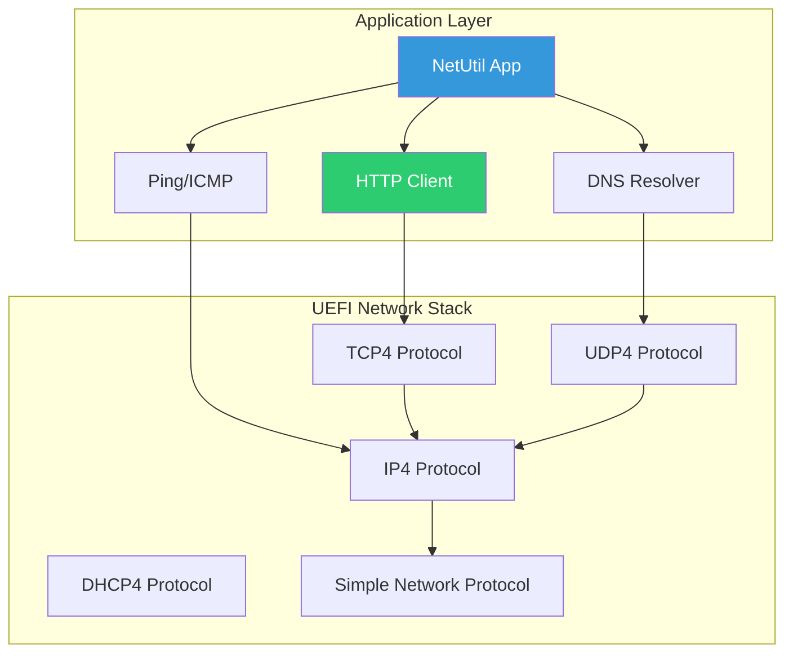

# Chapter 26: Network Application

Build an HTTP client and network diagnostic tool that demonstrates UEFI's networking capabilities.

## Overview

### When to Build Network Applications

{: .important }
> **Build network applications when you need to:**
> - Download firmware updates or boot files from a server
> - Implement network-based diagnostics or monitoring
> - Support PXE-like boot scenarios with custom logic
> - Communicate with management services (Redfish clients)

| Use Case | Network Feature | Example |
|:---------|:----------------|:--------|
| **HTTP boot** | HTTP protocol | Download kernel from web server |
| **Update download** | TCP/HTTP | Fetch firmware capsules |
| **Network diagnostics** | ICMP/ARP | Ping, connectivity testing |
| **Configuration** | DHCP/DNS | Retrieve network settings |
| **Management** | REST/HTTP | Redfish API access |
| **PXE alternative** | TFTP/HTTP | Custom network boot |

**Network Application Complexity:**

| Level | Protocols | Effort |
|:------|:----------|:-------|
| **Basic** | DHCP, DNS, Ping | Low |
| **Moderate** | TCP/UDP client | Medium |
| **Advanced** | HTTP with TLS | High |
| **Expert** | Custom protocols | Very high |

**Who Builds Network Applications:**
- **PXE/boot developers**: Network boot infrastructure
- **Enterprise IT tools**: Remote configuration utilities
- **Update services**: OTA firmware update clients
- **Diagnostic developers**: Network troubleshooting tools

### What We're Building

A network utility (`netutil`) that provides:
- HTTP file download
- Network interface information
- Ping functionality
- DNS resolution

```
Shell> netutil info
Network Interfaces:
  [0] Intel(R) PRO/1000
      MAC: 52:54:00:12:34:56
      IPv4: 10.0.2.15 / 255.255.255.0
      Gateway: 10.0.2.2
      DNS: 10.0.2.3

Shell> netutil ping 10.0.2.2
PING 10.0.2.2: 64 bytes, time=0.5ms
PING 10.0.2.2: 64 bytes, time=0.4ms
PING 10.0.2.2: 64 bytes, time=0.5ms
--- 10.0.2.2 ping statistics ---
3 packets transmitted, 3 received, 0% loss

Shell> netutil get http://example.com/file.txt output.txt
Resolving example.com... 93.184.216.34
Connecting to 93.184.216.34:80...
Downloading: [████████████████████] 100%
Downloaded 1270 bytes to output.txt
```

### Architecture



## Initialization

### Project Structure

```
NetUtil/
├── NetUtil.c           # Main application
├── NetUtil.h           # Declarations
├── HttpClient.c        # HTTP download
├── Ping.c              # ICMP ping
├── DnsClient.c         # DNS resolution
├── NetInfo.c           # Interface info
├── NetUtil.inf         # Module definition
└── HttpParser.c        # HTTP response parser
```

### INF File

```ini
# NetUtil.inf

[Defines]
  INF_VERSION    = 0x00010006
  BASE_NAME      = NetUtil
  FILE_GUID      = 98765432-1234-5678-9ABC-DEF012345678
  MODULE_TYPE    = UEFI_APPLICATION
  VERSION_STRING = 1.0
  ENTRY_POINT    = ShellCEntryLib

[Sources]
  NetUtil.c
  NetUtil.h
  HttpClient.c
  Ping.c
  DnsClient.c
  NetInfo.c
  HttpParser.c

[Packages]
  MdePkg/MdePkg.dec
  MdeModulePkg/MdeModulePkg.dec
  ShellPkg/ShellPkg.dec
  NetworkPkg/NetworkPkg.dec

[LibraryClasses]
  UefiLib
  ShellLib
  ShellCEntryLib
  BaseMemoryLib
  MemoryAllocationLib
  PrintLib
  UefiBootServicesTableLib
  NetLib
  DpcLib

[Protocols]
  gEfiTcp4ServiceBindingProtocolGuid
  gEfiTcp4ProtocolGuid
  gEfiUdp4ServiceBindingProtocolGuid
  gEfiUdp4ProtocolGuid
  gEfiIp4ServiceBindingProtocolGuid
  gEfiIp4ProtocolGuid
  gEfiDhcp4ServiceBindingProtocolGuid
  gEfiDhcp4ProtocolGuid
  gEfiSimpleNetworkProtocolGuid
  gEfiDns4ServiceBindingProtocolGuid
  gEfiDns4ProtocolGuid
```

### Header File

```c
// NetUtil.h

#ifndef _NET_UTIL_H_
#define _NET_UTIL_H_

#include <Uefi.h>
#include <Library/UefiLib.h>
#include <Library/ShellLib.h>
#include <Library/ShellCEntryLib.h>
#include <Library/BaseMemoryLib.h>
#include <Library/MemoryAllocationLib.h>
#include <Library/PrintLib.h>
#include <Library/UefiBootServicesTableLib.h>
#include <Library/NetLib.h>
#include <Protocol/Tcp4.h>
#include <Protocol/Udp4.h>
#include <Protocol/Ip4.h>
#include <Protocol/Dhcp4.h>
#include <Protocol/SimpleNetwork.h>
#include <Protocol/Dns4.h>
#include <Protocol/ServiceBinding.h>

#define NET_UTIL_VERSION  L"1.0"

#define HTTP_DEFAULT_PORT  80
#define DNS_DEFAULT_PORT   53
#define PING_TIMEOUT_MS    1000
#define HTTP_BUFFER_SIZE   4096

// HTTP response structure
typedef struct {
    UINT32  StatusCode;
    UINT64  ContentLength;
    CHAR8   *Body;
    UINTN   BodyLength;
} HTTP_RESPONSE;

// Function prototypes
VOID PrintHelp(VOID);
EFI_STATUS ShowNetworkInfo(VOID);
EFI_STATUS DoPing(IN CHAR16 *Target, IN UINTN Count);
EFI_STATUS DoHttpGet(IN CHAR16 *Url, IN CHAR16 *OutputFile);
EFI_STATUS ResolveDns(IN CHAR16 *Hostname, OUT EFI_IPv4_ADDRESS *Address);

// TCP helper functions
EFI_STATUS TcpConnect(IN EFI_IPv4_ADDRESS *Address, IN UINT16 Port, OUT EFI_TCP4_PROTOCOL **Tcp);
EFI_STATUS TcpSend(IN EFI_TCP4_PROTOCOL *Tcp, IN VOID *Data, IN UINTN Length);
EFI_STATUS TcpReceive(IN EFI_TCP4_PROTOCOL *Tcp, OUT VOID *Buffer, IN OUT UINTN *Length);
EFI_STATUS TcpClose(IN EFI_TCP4_PROTOCOL *Tcp);

// HTTP parsing
EFI_STATUS ParseHttpResponse(IN CHAR8 *Data, IN UINTN Length, OUT HTTP_RESPONSE *Response);
EFI_STATUS ParseUrl(IN CHAR16 *Url, OUT CHAR8 *Host, OUT UINT16 *Port, OUT CHAR8 *Path);

#endif // _NET_UTIL_H_
```

## Configuration

### Main Application

```c
// NetUtil.c

#include "NetUtil.h"

SHELL_STATUS
EFIAPI
ShellAppMain (
    IN UINTN   Argc,
    IN CHAR16  **Argv
    )
{
    EFI_STATUS  Status;

    if (Argc < 2) {
        PrintHelp();
        return SHELL_INVALID_PARAMETER;
    }

    // Parse command
    if (StrCmp(Argv[1], L"info") == 0) {
        Status = ShowNetworkInfo();
    }
    else if (StrCmp(Argv[1], L"ping") == 0) {
        if (Argc < 3) {
            Print(L"Usage: netutil ping <host>\n");
            return SHELL_INVALID_PARAMETER;
        }
        Status = DoPing(Argv[2], 4);
    }
    else if (StrCmp(Argv[1], L"get") == 0) {
        if (Argc < 4) {
            Print(L"Usage: netutil get <url> <output-file>\n");
            return SHELL_INVALID_PARAMETER;
        }
        Status = DoHttpGet(Argv[2], Argv[3]);
    }
    else if (StrCmp(Argv[1], L"dns") == 0) {
        if (Argc < 3) {
            Print(L"Usage: netutil dns <hostname>\n");
            return SHELL_INVALID_PARAMETER;
        }
        EFI_IPv4_ADDRESS Addr;
        Status = ResolveDns(Argv[2], &Addr);
        if (!EFI_ERROR(Status)) {
            Print(L"%s -> %d.%d.%d.%d\n",
                Argv[2],
                Addr.Addr[0], Addr.Addr[1], Addr.Addr[2], Addr.Addr[3]);
        }
    }
    else if (StrCmp(Argv[1], L"--help") == 0 ||
             StrCmp(Argv[1], L"-h") == 0) {
        PrintHelp();
        Status = EFI_SUCCESS;
    }
    else {
        Print(L"Unknown command: %s\n", Argv[1]);
        PrintHelp();
        return SHELL_INVALID_PARAMETER;
    }

    if (EFI_ERROR(Status)) {
        Print(L"Command failed: %r\n", Status);
        return SHELL_DEVICE_ERROR;
    }

    return SHELL_SUCCESS;
}

VOID
PrintHelp (
    VOID
    )
{
    Print(L"NetUtil - Network Utility v%s\n\n", NET_UTIL_VERSION);
    Print(L"Usage: netutil <command> [options]\n\n");
    Print(L"Commands:\n");
    Print(L"  info                     Show network interface information\n");
    Print(L"  ping <host>              Ping a host\n");
    Print(L"  get <url> <file>         Download file via HTTP\n");
    Print(L"  dns <hostname>           Resolve hostname to IP\n");
    Print(L"\n");
    Print(L"Examples:\n");
    Print(L"  netutil info\n");
    Print(L"  netutil ping 10.0.2.2\n");
    Print(L"  netutil get http://example.com/file.txt output.txt\n");
    Print(L"  netutil dns example.com\n");
}
```

### Network Information

```c
// NetInfo.c

#include "NetUtil.h"

EFI_STATUS
ShowNetworkInfo (
    VOID
    )
{
    EFI_STATUS                    Status;
    EFI_HANDLE                    *Handles;
    UINTN                         HandleCount;
    EFI_SIMPLE_NETWORK_PROTOCOL   *Snp;
    EFI_IP4_CONFIG2_PROTOCOL      *Ip4Config;
    UINTN                         Index;

    Print(L"Network Interfaces:\n\n");

    // Find all network interfaces
    Status = gBS->LocateHandleBuffer(
        ByProtocol,
        &gEfiSimpleNetworkProtocolGuid,
        NULL,
        &HandleCount,
        &Handles
    );

    if (EFI_ERROR(Status)) {
        Print(L"No network interfaces found\n");
        return Status;
    }

    for (Index = 0; Index < HandleCount; Index++) {
        Status = gBS->HandleProtocol(
            Handles[Index],
            &gEfiSimpleNetworkProtocolGuid,
            (VOID **)&Snp
        );

        if (EFI_ERROR(Status)) {
            continue;
        }

        // Print interface info
        Print(L"  [%d] Interface\n", Index);

        // MAC address
        Print(L"      MAC: ");
        for (UINTN i = 0; i < Snp->Mode->HwAddressSize; i++) {
            Print(L"%02X", Snp->Mode->CurrentAddress.Addr[i]);
            if (i < Snp->Mode->HwAddressSize - 1) {
                Print(L":");
            }
        }
        Print(L"\n");

        // State
        CHAR16 *StateStr;
        switch (Snp->Mode->State) {
        case EfiSimpleNetworkStopped:    StateStr = L"Stopped"; break;
        case EfiSimpleNetworkStarted:    StateStr = L"Started"; break;
        case EfiSimpleNetworkInitialized: StateStr = L"Initialized"; break;
        default:                          StateStr = L"Unknown"; break;
        }
        Print(L"      State: %s\n", StateStr);

        // Try to get IP configuration
        Status = gBS->HandleProtocol(
            Handles[Index],
            &gEfiIp4Config2ProtocolGuid,
            (VOID **)&Ip4Config
        );

        if (!EFI_ERROR(Status)) {
            EFI_IP4_CONFIG2_INTERFACE_INFO *IfInfo;
            UINTN DataSize = 0;

            Status = Ip4Config->GetData(
                Ip4Config,
                Ip4Config2DataTypeInterfaceInfo,
                &DataSize,
                NULL
            );

            if (Status == EFI_BUFFER_TOO_SMALL) {
                IfInfo = AllocatePool(DataSize);
                if (IfInfo != NULL) {
                    Status = Ip4Config->GetData(
                        Ip4Config,
                        Ip4Config2DataTypeInterfaceInfo,
                        &DataSize,
                        IfInfo
                    );

                    if (!EFI_ERROR(Status)) {
                        Print(L"      IPv4: %d.%d.%d.%d\n",
                            IfInfo->StationAddress.Addr[0],
                            IfInfo->StationAddress.Addr[1],
                            IfInfo->StationAddress.Addr[2],
                            IfInfo->StationAddress.Addr[3]);
                    }
                    FreePool(IfInfo);
                }
            }
        }

        Print(L"\n");
    }

    FreePool(Handles);
    return EFI_SUCCESS;
}
```

### HTTP Client

```c
// HttpClient.c

#include "NetUtil.h"

// Service binding handle
STATIC EFI_HANDLE gTcpChildHandle = NULL;

EFI_STATUS
DoHttpGet (
    IN CHAR16  *Url,
    IN CHAR16  *OutputFile
    )
{
    EFI_STATUS           Status;
    CHAR8                Host[256];
    CHAR8                Path[512];
    UINT16               Port;
    EFI_IPv4_ADDRESS     ServerAddr;
    EFI_TCP4_PROTOCOL    *Tcp = NULL;
    CHAR8                *Request = NULL;
    CHAR8                *Response = NULL;
    UINTN                ResponseLen;
    HTTP_RESPONSE        HttpResp;
    SHELL_FILE_HANDLE    FileHandle;

    // Parse URL
    Status = ParseUrl(Url, Host, &Port, Path);
    if (EFI_ERROR(Status)) {
        Print(L"Invalid URL\n");
        return Status;
    }

    // Resolve hostname
    Print(L"Resolving %a...", Host);

    // Check if already an IP address
    Status = NetLibStrToIp4(Host, &ServerAddr);
    if (EFI_ERROR(Status)) {
        // Need DNS resolution
        CHAR16 HostW[256];
        AsciiStrToUnicodeStrS(Host, HostW, sizeof(HostW)/sizeof(CHAR16));
        Status = ResolveDns(HostW, &ServerAddr);
        if (EFI_ERROR(Status)) {
            Print(L" failed\n");
            return Status;
        }
    }

    Print(L" %d.%d.%d.%d\n",
        ServerAddr.Addr[0], ServerAddr.Addr[1],
        ServerAddr.Addr[2], ServerAddr.Addr[3]);

    // Connect to server
    Print(L"Connecting to %d.%d.%d.%d:%d...\n",
        ServerAddr.Addr[0], ServerAddr.Addr[1],
        ServerAddr.Addr[2], ServerAddr.Addr[3], Port);

    Status = TcpConnect(&ServerAddr, Port, &Tcp);
    if (EFI_ERROR(Status)) {
        Print(L"Connection failed: %r\n", Status);
        return Status;
    }

    // Build HTTP request
    Request = AllocatePool(1024);
    if (Request == NULL) {
        TcpClose(Tcp);
        return EFI_OUT_OF_RESOURCES;
    }

    AsciiSPrint(Request, 1024,
        "GET %a HTTP/1.1\r\n"
        "Host: %a\r\n"
        "User-Agent: UEFI-NetUtil/1.0\r\n"
        "Connection: close\r\n"
        "\r\n",
        Path, Host);

    // Send request
    Status = TcpSend(Tcp, Request, AsciiStrLen(Request));
    FreePool(Request);

    if (EFI_ERROR(Status)) {
        Print(L"Send failed: %r\n", Status);
        TcpClose(Tcp);
        return Status;
    }

    // Receive response
    Response = AllocatePool(HTTP_BUFFER_SIZE);
    if (Response == NULL) {
        TcpClose(Tcp);
        return EFI_OUT_OF_RESOURCES;
    }

    ResponseLen = HTTP_BUFFER_SIZE;
    Status = TcpReceive(Tcp, Response, &ResponseLen);

    TcpClose(Tcp);

    if (EFI_ERROR(Status)) {
        Print(L"Receive failed: %r\n", Status);
        FreePool(Response);
        return Status;
    }

    // Parse HTTP response
    Status = ParseHttpResponse(Response, ResponseLen, &HttpResp);
    if (EFI_ERROR(Status)) {
        Print(L"Failed to parse response\n");
        FreePool(Response);
        return Status;
    }

    Print(L"HTTP %d\n", HttpResp.StatusCode);

    if (HttpResp.StatusCode != 200) {
        Print(L"Server returned error\n");
        FreePool(Response);
        return EFI_HTTP_ERROR;
    }

    // Save to file
    Status = ShellOpenFileByName(
        OutputFile,
        &FileHandle,
        EFI_FILE_MODE_READ | EFI_FILE_MODE_WRITE | EFI_FILE_MODE_CREATE,
        0
    );

    if (EFI_ERROR(Status)) {
        Print(L"Cannot create output file: %r\n", Status);
        FreePool(Response);
        return Status;
    }

    UINTN WriteSize = HttpResp.BodyLength;
    Status = ShellWriteFile(FileHandle, &WriteSize, HttpResp.Body);
    ShellCloseFile(&FileHandle);

    if (EFI_ERROR(Status)) {
        Print(L"Write failed: %r\n", Status);
    } else {
        Print(L"Downloaded %d bytes to %s\n", WriteSize, OutputFile);
    }

    FreePool(Response);
    return Status;
}

EFI_STATUS
ParseUrl (
    IN  CHAR16  *Url,
    OUT CHAR8   *Host,
    OUT UINT16  *Port,
    OUT CHAR8   *Path
    )
{
    CHAR8   UrlA[512];
    CHAR8   *Ptr;
    CHAR8   *HostStart;
    CHAR8   *PathStart;
    CHAR8   *PortStart;

    UnicodeStrToAsciiStrS(Url, UrlA, sizeof(UrlA));

    // Skip http://
    Ptr = UrlA;
    if (AsciiStrnCmp(Ptr, "http://", 7) == 0) {
        Ptr += 7;
    }

    HostStart = Ptr;
    *Port = HTTP_DEFAULT_PORT;
    AsciiStrCpyS(Path, 512, "/");

    // Find path
    PathStart = AsciiStrStr(Ptr, "/");
    if (PathStart != NULL) {
        AsciiStrCpyS(Path, 512, PathStart);
        *PathStart = '\0';
    }

    // Find port
    PortStart = AsciiStrStr(HostStart, ":");
    if (PortStart != NULL) {
        *PortStart = '\0';
        *Port = (UINT16)AsciiStrDecimalToUintn(PortStart + 1);
    }

    AsciiStrCpyS(Host, 256, HostStart);

    return EFI_SUCCESS;
}

EFI_STATUS
ParseHttpResponse (
    IN  CHAR8          *Data,
    IN  UINTN           Length,
    OUT HTTP_RESPONSE  *Response
    )
{
    CHAR8  *Ptr = Data;
    CHAR8  *BodyStart;

    ZeroMem(Response, sizeof(HTTP_RESPONSE));

    // Skip "HTTP/1.x "
    Ptr = AsciiStrStr(Data, " ");
    if (Ptr == NULL) {
        return EFI_INVALID_PARAMETER;
    }
    Ptr++;

    // Parse status code
    Response->StatusCode = (UINT32)AsciiStrDecimalToUintn(Ptr);

    // Find body (after \r\n\r\n)
    BodyStart = AsciiStrStr(Data, "\r\n\r\n");
    if (BodyStart != NULL) {
        BodyStart += 4;
        Response->Body = BodyStart;
        Response->BodyLength = Length - (BodyStart - Data);
    }

    return EFI_SUCCESS;
}
```

### TCP Helpers

```c
// Continuation of HttpClient.c

EFI_STATUS
TcpConnect (
    IN  EFI_IPv4_ADDRESS   *Address,
    IN  UINT16              Port,
    OUT EFI_TCP4_PROTOCOL  **Tcp
    )
{
    EFI_STATUS                        Status;
    EFI_HANDLE                        *Handles;
    UINTN                             HandleCount;
    EFI_SERVICE_BINDING_PROTOCOL      *TcpSb;
    EFI_TCP4_CONFIG_DATA              TcpConfig;
    EFI_TCP4_CONNECTION_TOKEN         ConnToken;
    EFI_TCP4_PROTOCOL                 *TcpProto;

    // Find TCP service binding
    Status = gBS->LocateHandleBuffer(
        ByProtocol,
        &gEfiTcp4ServiceBindingProtocolGuid,
        NULL,
        &HandleCount,
        &Handles
    );

    if (EFI_ERROR(Status) || HandleCount == 0) {
        return EFI_NOT_FOUND;
    }

    Status = gBS->HandleProtocol(
        Handles[0],
        &gEfiTcp4ServiceBindingProtocolGuid,
        (VOID **)&TcpSb
    );

    FreePool(Handles);

    if (EFI_ERROR(Status)) {
        return Status;
    }

    // Create TCP child
    gTcpChildHandle = NULL;
    Status = TcpSb->CreateChild(TcpSb, &gTcpChildHandle);
    if (EFI_ERROR(Status)) {
        return Status;
    }

    // Get TCP protocol
    Status = gBS->HandleProtocol(
        gTcpChildHandle,
        &gEfiTcp4ProtocolGuid,
        (VOID **)&TcpProto
    );

    if (EFI_ERROR(Status)) {
        TcpSb->DestroyChild(TcpSb, gTcpChildHandle);
        return Status;
    }

    // Configure TCP
    ZeroMem(&TcpConfig, sizeof(TcpConfig));
    TcpConfig.TypeOfService = 0;
    TcpConfig.TimeToLive = 64;
    TcpConfig.AccessPoint.UseDefaultAddress = TRUE;
    TcpConfig.AccessPoint.RemoteAddress = *Address;
    TcpConfig.AccessPoint.RemotePort = Port;
    TcpConfig.AccessPoint.ActiveFlag = TRUE;

    Status = TcpProto->Configure(TcpProto, &TcpConfig);
    if (EFI_ERROR(Status)) {
        TcpSb->DestroyChild(TcpSb, gTcpChildHandle);
        return Status;
    }

    // Connect
    ZeroMem(&ConnToken, sizeof(ConnToken));
    Status = gBS->CreateEvent(
        EVT_NOTIFY_SIGNAL,
        TPL_CALLBACK,
        NULL,
        NULL,
        &ConnToken.CompletionToken.Event
    );

    if (EFI_ERROR(Status)) {
        TcpProto->Configure(TcpProto, NULL);
        TcpSb->DestroyChild(TcpSb, gTcpChildHandle);
        return Status;
    }

    Status = TcpProto->Connect(TcpProto, &ConnToken);
    if (Status == EFI_SUCCESS || Status == EFI_NOT_READY) {
        // Wait for connection
        UINTN Index;
        gBS->WaitForEvent(1, &ConnToken.CompletionToken.Event, &Index);
        Status = ConnToken.CompletionToken.Status;
    }

    gBS->CloseEvent(ConnToken.CompletionToken.Event);

    if (EFI_ERROR(Status)) {
        TcpProto->Configure(TcpProto, NULL);
        TcpSb->DestroyChild(TcpSb, gTcpChildHandle);
        return Status;
    }

    *Tcp = TcpProto;
    return EFI_SUCCESS;
}

EFI_STATUS
TcpSend (
    IN EFI_TCP4_PROTOCOL  *Tcp,
    IN VOID               *Data,
    IN UINTN               Length
    )
{
    EFI_STATUS           Status;
    EFI_TCP4_IO_TOKEN    TxToken;
    EFI_TCP4_TRANSMIT_DATA TxData;

    ZeroMem(&TxToken, sizeof(TxToken));
    ZeroMem(&TxData, sizeof(TxData));

    Status = gBS->CreateEvent(
        EVT_NOTIFY_SIGNAL,
        TPL_CALLBACK,
        NULL,
        NULL,
        &TxToken.CompletionToken.Event
    );

    if (EFI_ERROR(Status)) {
        return Status;
    }

    TxData.Push = TRUE;
    TxData.DataLength = (UINT32)Length;
    TxData.FragmentCount = 1;
    TxData.FragmentTable[0].FragmentLength = (UINT32)Length;
    TxData.FragmentTable[0].FragmentBuffer = Data;

    TxToken.Packet.TxData = &TxData;

    Status = Tcp->Transmit(Tcp, &TxToken);
    if (!EFI_ERROR(Status)) {
        UINTN Index;
        gBS->WaitForEvent(1, &TxToken.CompletionToken.Event, &Index);
        Status = TxToken.CompletionToken.Status;
    }

    gBS->CloseEvent(TxToken.CompletionToken.Event);
    return Status;
}

EFI_STATUS
TcpReceive (
    IN     EFI_TCP4_PROTOCOL  *Tcp,
    OUT    VOID               *Buffer,
    IN OUT UINTN              *Length
    )
{
    EFI_STATUS            Status;
    EFI_TCP4_IO_TOKEN     RxToken;
    EFI_TCP4_RECEIVE_DATA RxData;

    ZeroMem(&RxToken, sizeof(RxToken));
    ZeroMem(&RxData, sizeof(RxData));

    Status = gBS->CreateEvent(
        EVT_NOTIFY_SIGNAL,
        TPL_CALLBACK,
        NULL,
        NULL,
        &RxToken.CompletionToken.Event
    );

    if (EFI_ERROR(Status)) {
        return Status;
    }

    RxData.DataLength = (UINT32)*Length;
    RxData.FragmentCount = 1;
    RxData.FragmentTable[0].FragmentLength = (UINT32)*Length;
    RxData.FragmentTable[0].FragmentBuffer = Buffer;

    RxToken.Packet.RxData = &RxData;

    Status = Tcp->Receive(Tcp, &RxToken);
    if (!EFI_ERROR(Status)) {
        UINTN Index;
        gBS->WaitForEvent(1, &RxToken.CompletionToken.Event, &Index);
        Status = RxToken.CompletionToken.Status;

        if (!EFI_ERROR(Status)) {
            *Length = RxData.DataLength;
        }
    }

    gBS->CloseEvent(RxToken.CompletionToken.Event);
    return Status;
}

EFI_STATUS
TcpClose (
    IN EFI_TCP4_PROTOCOL  *Tcp
    )
{
    EFI_TCP4_CLOSE_TOKEN CloseToken;
    EFI_STATUS Status;

    if (Tcp == NULL) {
        return EFI_SUCCESS;
    }

    ZeroMem(&CloseToken, sizeof(CloseToken));
    Status = gBS->CreateEvent(
        EVT_NOTIFY_SIGNAL,
        TPL_CALLBACK,
        NULL,
        NULL,
        &CloseToken.CompletionToken.Event
    );

    if (!EFI_ERROR(Status)) {
        Tcp->Close(Tcp, &CloseToken);
        UINTN Index;
        gBS->WaitForEvent(1, &CloseToken.CompletionToken.Event, &Index);
        gBS->CloseEvent(CloseToken.CompletionToken.Event);
    }

    Tcp->Configure(Tcp, NULL);

    return EFI_SUCCESS;
}
```

### DNS Resolution

```c
// DnsClient.c

#include "NetUtil.h"

EFI_STATUS
ResolveDns (
    IN  CHAR16           *Hostname,
    OUT EFI_IPv4_ADDRESS *Address
    )
{
    EFI_STATUS                      Status;
    EFI_HANDLE                      *Handles;
    UINTN                           HandleCount;
    EFI_SERVICE_BINDING_PROTOCOL    *DnsSb;
    EFI_HANDLE                      DnsHandle = NULL;
    EFI_DNS4_PROTOCOL               *Dns;
    EFI_DNS4_CONFIG_DATA            DnsConfig;
    EFI_DNS4_COMPLETION_TOKEN       Token;
    CHAR8                           HostnameA[256];

    // Convert hostname to ASCII
    UnicodeStrToAsciiStrS(Hostname, HostnameA, sizeof(HostnameA));

    // Find DNS service
    Status = gBS->LocateHandleBuffer(
        ByProtocol,
        &gEfiDns4ServiceBindingProtocolGuid,
        NULL,
        &HandleCount,
        &Handles
    );

    if (EFI_ERROR(Status)) {
        return Status;
    }

    Status = gBS->HandleProtocol(
        Handles[0],
        &gEfiDns4ServiceBindingProtocolGuid,
        (VOID **)&DnsSb
    );

    FreePool(Handles);

    if (EFI_ERROR(Status)) {
        return Status;
    }

    // Create DNS child
    Status = DnsSb->CreateChild(DnsSb, &DnsHandle);
    if (EFI_ERROR(Status)) {
        return Status;
    }

    Status = gBS->HandleProtocol(
        DnsHandle,
        &gEfiDns4ProtocolGuid,
        (VOID **)&Dns
    );

    if (EFI_ERROR(Status)) {
        DnsSb->DestroyChild(DnsSb, DnsHandle);
        return Status;
    }

    // Configure DNS
    ZeroMem(&DnsConfig, sizeof(DnsConfig));
    DnsConfig.UseDefaultSetting = TRUE;
    DnsConfig.EnableDnsCache = TRUE;
    DnsConfig.Protocol = EFI_IP_PROTO_UDP;
    DnsConfig.RetryCount = 3;
    DnsConfig.RetryInterval = 3;

    Status = Dns->Configure(Dns, &DnsConfig);
    if (EFI_ERROR(Status)) {
        DnsSb->DestroyChild(DnsSb, DnsHandle);
        return Status;
    }

    // Create completion event
    ZeroMem(&Token, sizeof(Token));
    Status = gBS->CreateEvent(
        EVT_NOTIFY_SIGNAL,
        TPL_CALLBACK,
        NULL,
        NULL,
        &Token.Event
    );

    if (EFI_ERROR(Status)) {
        Dns->Configure(Dns, NULL);
        DnsSb->DestroyChild(DnsSb, DnsHandle);
        return Status;
    }

    // Resolve hostname
    Status = Dns->HostNameToIp(Dns, Hostname, &Token);

    if (!EFI_ERROR(Status)) {
        UINTN Index;
        gBS->WaitForEvent(1, &Token.Event, &Index);
        Status = Token.Status;

        if (!EFI_ERROR(Status) && Token.RspData.H2AData != NULL) {
            if (Token.RspData.H2AData->IpCount > 0) {
                CopyMem(Address,
                    &Token.RspData.H2AData->IpList[0],
                    sizeof(EFI_IPv4_ADDRESS));
            } else {
                Status = EFI_NOT_FOUND;
            }

            if (Token.RspData.H2AData->IpList != NULL) {
                FreePool(Token.RspData.H2AData->IpList);
            }
            FreePool(Token.RspData.H2AData);
        }
    }

    gBS->CloseEvent(Token.Event);
    Dns->Configure(Dns, NULL);
    DnsSb->DestroyChild(DnsSb, DnsHandle);

    return Status;
}
```

## Porting Guide

### Platform Considerations

| Aspect | Consideration |
|--------|---------------|
| Network Stack | May need to enable in platform DSC |
| DHCP | Must have IP before TCP/HTTP works |
| DNS | Requires configured DNS server |
| Firewall | QEMU user-mode networking has limitations |

### QEMU Network Setup

```bash
# User-mode networking (default, limited)
qemu-system-x86_64 -netdev user,id=net0 -device virtio-net,netdev=net0

# TAP networking (full access, requires root)
qemu-system-x86_64 \
    -netdev tap,id=net0,ifname=tap0,script=no \
    -device virtio-net,netdev=net0

# Port forwarding for testing HTTP server
qemu-system-x86_64 \
    -netdev user,id=net0,hostfwd=tcp::8080-:80 \
    -device virtio-net,netdev=net0
```

## Testing

### Build

```bash
build -a X64 -t GCC5 -p UefiGuidePkg/UefiGuidePkg.dsc
```

### Test Commands

```bash
# In UEFI Shell
Shell> netutil info
Shell> netutil ping 10.0.2.2
Shell> netutil dns example.com
Shell> netutil get http://10.0.2.2:8080/test.txt output.txt
```

## Extension Ideas

1. **HTTPS support**: Add TLS via OpenSSL or mbedTLS
2. **Progress bar**: Show download progress
3. **Resume**: Support partial downloads
4. **Proxy**: Add HTTP proxy support
5. **IPv6**: Add IPv6 protocol support

## References

- [UEFI Network Stack](https://github.com/tianocore/edk2/tree/master/NetworkPkg)
- [TCP4 Protocol Specification](https://uefi.org/specs/UEFI/2.10/27_Network_Protocols_TCP_IP.html)
- [DNS4 Protocol](https://uefi.org/specs/UEFI/2.10/29_Network_Protocols_DNS_and_HTTP_Boot.html)

---

*Next: [Chapter 27: Boot Loader](../27-boot-loader/) - Load and execute a kernel.*
